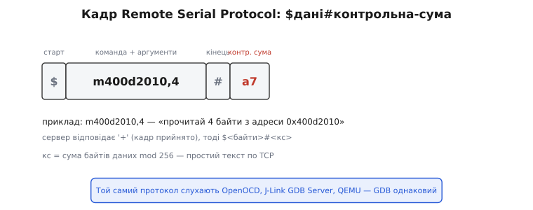
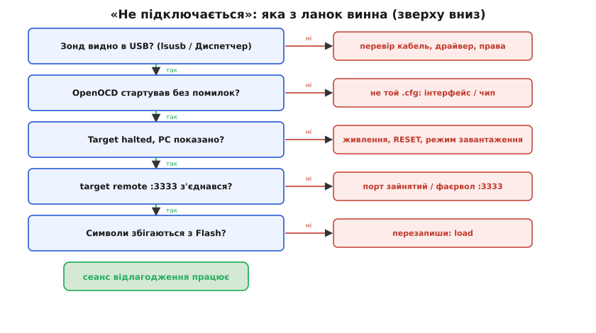

# OpenOCD і GDB углиб: конфіги, протокол, автоматизація

Налагодження чипа тримається на простій ідеї: жодна програма не вміє всього, тож роботу ділять на ланки, і кожна знає рівно один рівень абстракції. Зонд знає біти на дроті. [OpenOCD](book:programming/why-debugger) знає конкретний чип і конкретний зонд. GDB знає символи з `.elf`. Людина знає логіку програми. Поки все працює, цей поділ непомітний. Але щойно «не підключається» або «брейкпоінт не там», поділ стає головним інструментом діагностики: винна майже завжди **одна** ланка, і якщо розуміти, що саме кожна робить, її видно за хвилину замість години тику навмання.

Щоб дійти до цього вміння, треба зазирнути всередину кожної ланки глибше, ніж «запусти дві команди в двох терміналах». Як OpenOCD узагалі розуміє, який перед ним чип? Чому той самий GDB однаково говорить і з реальним Cortex-M, і з QEMU, і з SEGGER-зондом? Як зробити, щоб увесь сеанс піднімався одним рядком, а регістри периферії показувалися людськими іменами полів, а не дампом адрес? І чому під багатозадачною прошивкою без окремого режиму все перетворюється на кашу? Розберімо це по порядку — від конфігів, через протокол, до автоматизації та типових збоїв із їхнім механізмом.

## Конфіги OpenOCD: чому два файли, а не один

OpenOCD сам по собі не знає нічого про ваше залізо. Він — рушій, що вміє крутити скан-ланцюги й читати регістри, але **що саме** крутити й читати, йому треба сказати. Каже це конфігурація — текстові файли мовою Tcl. І тут перше, що збиває з пантелику новачка: чому запуск майже завжди має **два** `-f`, а не один?

Причина — у природі самого заліза. На столі є дві геть різні речі, які нічого не знають одна про одну. Є **зонд** — умовний ST-Link, J-Link чи дешева CMSIS-DAP-плата; він однаковий незалежно від того, який чип до нього під'єднано. І є **чип** — STM32, ESP32, nRF52; він однаковий незалежно від того, яким зондом до нього лізуть. Зонд від чипа не залежить, чип від зонда не залежить — тож і описувати їх логічно окремо. Звідси два рівні конфігів:

- **interface** (англ. *interface* — «стик, поверхня дотику») описує **зонд**: який це адаптер, через який драйвер із ним говорити, який транспорт він підтримує. Лежать ці файли в каталозі `scripts/interface/` дистрибутива OpenOCD: `stlink.cfg`, `jlink.cfg`, `cmsis-dap.cfg`, `ftdi/ft2232h.cfg`, `esp_usb_jtag.cfg`.
- **target** (англ. *target* — «ціль») описує **чип**: яке ядро (Cortex-M0/M4/M7, Xtensa, RISC-V), скільки апаратних компараторів для пасток, де межі Flash і RAM, як виглядає скан-ланцюг. Лежать у `scripts/target/`: `stm32f4x.cfg`, `nrf52.cfg`, `esp32.cfg`, `rp2040.cfg`.

Тоді типовий ручний запуск читається зліва направо як речення «таким-то зондом до такого-то чипа»:

```bash
openocd -f interface/cmsis-dap.cfg -f target/stm32f4x.cfg
```

Порядок не випадковий: спершу треба підняти зонд, бо саме через нього target-скрипт потім полізе сканувати чип. Поміняєте зонд (узяли J-Link замість CMSIS-DAP) — міняєте лише перший файл. Поміняєте плату на іншу з тим самим зондом — лише другий. Розділення рятує від комбінаторного вибуху: десяток зондів × сотня чипів дали б тисячу окремих конфігів, а так маємо десяток плюс сотню.

> 🔧 **Навіщо це.** Коли в чужому проєкті бачиш незрозумілий рядок запуску OpenOCD, читай його як пару «зонд + чип». Якщо налагодження не стартує, ця пара одразу каже, де копати: помилка на рівні interface — проблема із зондом чи драйвером; помилка на рівні target — узяли конфіг не того чипа. Сам рядок запуску вже половина діагнозу.

### board: коли один файл уже все містить

Якщо зонд і чип логічно окремі, звідки тоді конфіги, де `-f` лише один? Це третій рівень — **board** (англ. *board* — «плата»). Готова плата-налагоджувач — Nucleo, Discovery, ESP-WROVER-KIT — це **фіксована пара**: на ній і зонд розпаяний, і чип відомий, і вони вже з'єднані виробником. Описувати їх окремо нема потреби, бо комбінація одна-єдина. Тож виробник пакує все в один board-файл із каталогу `scripts/board/`, а той усередині просто підтягує потрібні interface й target і додає специфіку плати — частоту кварцу, особливий порядок скидання, додаткову мікросхему Flash на платі:

```bash
# Готова плата ST Nucleo-F411: один файл містить і зонд (ST-Link), і чип
openocd -f board/st_nucleo_f4.cfg
```

Звідси проста навігація. Окрема плата, де зонд і чип нероздільні → шукай `board/`, один `-f`. Свій власний пристрій, до якого ти причепив зовнішній зонд, → склади пару `interface/` + `target/`, два `-f`. Не знаєш, чи є готовий board-файл, — заглянь у `scripts/board/`: усі підтримувані плати там, і дуже часто вже є рядок саме під твою.

### adapter speed і transport: дві ручки, які вирішують долю сеансу

Усередині конфігів є два налаштування, які найчастіше доводиться чіпати руками, бо саме вони псують сеанс, коли значення за замовчуванням не підходить.

Перше — **транспорт**. Більшість сучасних зондів уміють і JTAG, і SWD, і треба вибрати один: `transport select swd` або `transport select jtag`. [SWD проти JTAG](book:programming/swd-jtag-internals) — це різні фізичні протоколи доступу до ядра: JTAG старший, на чотири-п'ять дротів, уміє ланцюжок із кількох мікросхем; SWD двопровідний, компактніший, на одному чипі цілком достатній. Якщо вибрати транспорт, якого зонд або плата не підтримують (наприклад, на роз'єм виведено лише дві ніжки SWD, а ви просите JTAG), OpenOCD або не знайде чип, або відрапортує, що транспорт недоступний. Board-файли зазвичай вибирають транспорт самі; у ручній парі це часто доводиться ставити явно.

Друге — **швидкість зонда**, `adapter speed 2000` (значення в кілогерцах). Це частота тактового сигналу, яким зонд жене дані до чипа. І тут інтуїція «більше — краще» зраджує. Дроти, перемички, погані контакти, довгі шлейфи на макетці — усе це спотворює сигнал на високій частоті. Просиш 10 МГц по двадцятисантиметрових перемичках — отримуєш збої читання, «дивні» значення регістрів і випадкові розриви. Тому є просте правило для діагностики: **усе працює нестабільно — спершу збав швидкість**. Поставив `adapter speed 500` — і якщо хаотичні збої зникли, винні були дроти, а не код. На якісній платі з короткими доріжками можна підняти й до кількох мегагерц; на макетці безпечніше триматися сотень кілогерц.

> 🔧 **Навіщо це.** `adapter speed` — перша ручка, яку крутять, коли сеанс «то є, то нема»: значення читаються неправильно, з'єднання рветься без причини. Збавлення швидкості вдвічі за секунду відрізняє апаратну проблему (дроти, контакти) від програмної (код, конфіг). Це найдешевший тест на всьому шляху налагодження.

## RSP: чому GDB байдуже, з ким говорити

Між GDB і OpenOCD є межа, і вона набагато важливіша, ніж здається на перший погляд. GDB не вбудований в OpenOCD і нічого не знає про конкретний зонд. Він спілкується з ним по мережі текстовим протоколом — **Remote Serial Protocol** (RSP, англ. «віддалений послідовний протокол»). Назва історична: колись GDB чіплявся до плати справжнім послідовним кабелем RS-232, тепер той самий протокол біжить поверх TCP, найчастіше на порт 3333. Але формат лишився текстовим і навмисно простим — і саме ця простота дає велику практичну свободу.

Кадр RSP виглядає так: символ `$`, далі тіло пакета (сама команда з аргументами), далі `#`, далі двознакова шістнадцяткова контрольна сума. Контрольна сума — просто сума байтів тіла за модулем 256; вона ловить спотворення на лінії. Приймач, отримавши цілий кадр, відповідає одним символом: `+` — «прийняв, сума зійшлася» або `-` — «зіпсовано, надішли ще раз».



*Кадр Remote Serial Protocol на прикладі `m400d2010,4` — «прочитай 4 байти з 0x400D2010»: долар відкриває, решітка закриває, два знаки після неї — контрольна сума; формат настільки простий, що його однаково слухають різні сервери.*

Самих команд жменя, і за ними легко вгадати весь цикл налагодження. Кожна — одна-дві літери:

```
g           # прочитати ВСІ регістри ядра одним пакетом
G<дані>     # записати всі регістри
p<n>        # прочитати один регістр номер n
m<адр>,<len># прочитати len байтів пам'яті з адреси
M<адр>,<len>:<дані>  # записати байти в пам'ять
c           # continue — пустити ядро далі
s           # step — виконати одну інструкцію
Z<тип>,<адр>,<kind>  # поставити пастку (брейк/вотч)
z<тип>,<адр>,<kind>  # зняти пастку
?           # чому стали? (код останньої зупинки)
qSupported  # узгодити можливості сторін на старті
```

Коли в GDB ви пишете `print g_counter`, відбувається ось що: GDB по `.elf` уже знає, що `g_counter` живе за адресою `0x3FFB0140` й займає 4 байти, тож формує кадр `$m3ffb0140,4#..` і шле його в порт. Сервер читає ці чотири байти з чипа через зонд і повертає `$0a000000#..`. GDB перетворює байти на число й показує `$1 = 10`. Уся «магія» налагодження — це обмін такими текстовими записками поверх TCP.

І ось чому це важливо понад усе інше. Раз протокол між GDB і сервером — публічний текст, то **будь-хто** може написати сервер, що говорить цим протоколом, і GDB його не відрізнить від OpenOCD. Так і сталося. По RSP однаково говорять:

- **OpenOCD** — для широкого спектра зондів і чипів;
- **SEGGER J-Link GDB Server** — фірмовий сервер під зонди J-Link;
- **pyOCD** — реалізація на Python під CMSIS-DAP;
- **gdbstub у QEMU** — коли «чип» насправді емулюється, і фізичного заліза взагалі немає.

Для вас це означає велику річ: команди GDB, `.gdbinit`, звички, навіть інтеграція в редактор — усе лишається тим самим, хоч би що стояло з іншого боку порту. Перейшли з ручного OpenOCD на J-Link GDB Server заради швидшого прошивання — у GDB не змінюється нічого, ви просто під'єднуєтеся до іншого порту. Запустили прошивку в QEMU, бо плати ще нема на руках, — той самий `target remote`, ті самі брейкпоінти. Поділ через стандартний протокол перетворив сервер на змінну деталь, а ваші навички — на капітал, що не залежить від конкретного заліза.

> 🔧 **Навіщо це.** Знання, що сервер RSP взаємозамінний, прямо економить час у двох ситуаціях. Зонд глючить — можна підмінити сервер (наприклад, узяти pyOCD замість OpenOCD під ту саму CMSIS-DAP-плату), не переписуючи ні рядка налагоджувальних скриптів. А коли заліза ще нема, QEMU-gdbstub дає повноцінне налагодження прошивки тим самим GDB — логіку алгоритму можна вилизати ще до того, як плата приїде.

### `monitor`: запасний хід повз протокол

У RSP немає команди «стерти Flash» чи «прочитати регістр периферії UART» — це специфіка конкретного чипа, а не загального протоколу. Для таких речей є спеціальний пакет: усе, що ви пишете в GDB після слова `monitor`, GDB **не виконує сам**, а загортає в RSP-пакет `qRcmd` і пересилає дослівно серверу. Сервер виконує цей рядок своєю власною мовою (для OpenOCD — Tcl) і повертає текст назад. Тобто `monitor reset halt` — це не команда GDB; це команда **OpenOCD**, прокинута крізь GDB у те саме вікно. Так із одного терміналу ви дістаєте і високорівневе налагодження по символах, і будь-яку низькорівневу дію конкретного чипа.

## `.gdbinit`: увесь сеанс одним рядком

Ручний сеанс — це щоразу однакова низка команд: під'єднатися до порту, скинути ядро, залити свіжу прошивку, поставити перший брейкпоінт. Набирати їх по десять разів на день — марнування часу й джерело помилок (забув `load` — і налагоджуєш старий код). GDB це вирішує просто: під час старту він читає файл `.gdbinit` із поточного каталогу й виконує його рядки так, ніби ви набрали їх руками. Тобто весь рутинний вступ можна записати раз і запускати одним рядком `gdb`.

Ось робочий `.gdbinit` для Cortex-M через OpenOCD, який сам піднімає весь сеанс:

```
# .gdbinit — автоматичний старт сеансу налагодження Cortex-M
target extended-remote :3333   # під'єднатися до сервера OpenOCD
monitor reset halt             # скинути ядро й зупинити його ДО першої інструкції
load                           # залити свіжу прошивку з .elf у Flash
break main                     # перший брейкпоінт на main
continue                       # дійти до main і стати там
```

Запустили `arm-none-eabi-gdb firmware.elf` — і за секунду ви вже стоїте на `main` зі свіжою прошивкою, не торкнувшись клавіатури. Тут варто розрізняти два різновиди під'єднання: `target remote` — звичайне, а `target extended-remote` лишає зв'язок живим навіть після того, як програма доходить до кінця або ви робите `kill`, і дозволяє перезапустити ціль командою `run`. Для довгих сеансів із багатьма перезапусками extended зручніший.

> 🔧 **Навіщо це.** `.gdbinit` у корені проєкту — це відтворюваність сеансу. Будь-хто в команді запускає налагодження однаково, ніхто не забуває `load` і не ловить привидів від старої прошивки. А ще це жива документація: новачок відкриває `.gdbinit` і одразу бачить, до якого порту чіплятися й як правильно скидати саме цей чип.

### Власні команди й хуки: автоматизуємо рутину налагодження

GDB дозволяє склеювати власні команди з наявних через `define` — і це перетворює довгі ритуали на одне слово. Скажімо, ви раз у раз хочете побачити поточний контекст: де стали, стек викликів і ключові регістри. Замість трьох команд щоразу — одна:

```
# Власна команда: показати повний контекст однією дією
define ctx
  printf "=== зупинка в: ===\n"
  frame
  printf "\n=== стек викликів: ===\n"
  backtrace
  printf "\n=== ключові регістри: ===\n"
  info registers pc sp lr xpsr
end
```

Тепер `ctx` у будь-який момент малює повну картину. Ще сильніша річ — **хуки** (англ. *hook* — «гачок»): команди, що спрацьовують **автоматично** довкола інших подій. Найкорисніший — `hook-stop`, який GDB виконує щоразу, коли ядро зупинилося: на брейкпоінті, на вотчпоінті, після кроку. Повісьте на нього свій `ctx` — і контекст малюється сам після кожної зупинки, без жодної ручної команди:

```
# Спрацьовує автоматично при КОЖНІЙ зупинці ядра
define hook-stop
  ctx
end
```

Тепер кожен брейкпоінт сам показує, де ви, як сюди дійшли й що в регістрах. Це і є суть автоматизації налагодження: один раз описати, що хочеш бачити, — і далі інструмент робить це за тебе. Усе це теж кладеться в `.gdbinit`, тож приходить разом із проєктом.

Для ESP-IDF та готових плат свій `.gdbinit` писати руками здебільшого не треба: `idf.py gdb` генерує його сам — підставляє правильний порт, потрібний `.elf` і конфіг саме під ваш чип. Але розуміти, що під капотом це звичайний `.gdbinit` із тими самими `target remote` / `monitor reset halt` / `load`, варто: коли автоматика дає збій, ви знаєте, який саме рядок піти й полагодити руками.

## SVD і вікно периферії: адреси стають іменами

Налагодження логіки програми GDB робить чудово — символи з `.elf` дають імена функцій і змінних. Але вбудована система — це не лише код, це ще й **периферія**: регістри GPIO, UART, таймерів, ШІМ. І ось тут `.elf` безсилий, бо периферія — це не ваші змінні, а апаратні регістри за фіксованими адресами в адресному просторі чипа. Хочете перевірити, чи увімкнено тактування UART2, — голим GDB доведеться читати слово за адресою на кшталт `0x40023840` й вручну колупати потрібний біт. Це повільно, і легко помилитися адресою чи номером біта.

Рятує **SVD** (System View Description — «опис системного вигляду», XML-формат від ARM). Виробник чипа постачає `.svd`-файл, де **повністю** описано всю периферію: кожен блок (GPIOA, USART2, TIM3), кожен регістр у блоці, кожне поле в регістрі — його зміщення, ширина, призначення, навіть розшифровка можливих значень. По суті це машинно-читана версія тих таблиць регістрів, які ви гортаєте в довідці на чип.

Сам по собі XML нічого не показує — його читає **розширення налагоджувача**. У VS Code це Cortex-Debug, у Eclipse — окремий плагін, у багатьох IDE є «вікно периферії» (Peripheral View). Згодувавши йому `.svd`, ви дістаєте дерево: розкриваєте `USART2`, бачите регістр `CR1`, а в ньому — поле `UE` («USART Enable») зі значенням `1`. Не «біт 13 у слові 0x40004400 дорівнює одиниці», а людською мовою: «передавач UART2 увімкнено». І навпаки — багато вікон дозволяють писати в поле прямо з дерева, тобто увімкнути той самий біт кліком, не пам'ятаючи ні адреси, ні номера.

> 🔧 **Навіщо це.** SVD-вікно — головний інструмент, коли пишеш **драйвер периферії**, а не бізнес-логіку. Налаштував UART, а нічого не передається — за секунди дивишся в дерево: чи увімкнено блок, чи виставлена швидкість, чи не висить прапорець помилки. Без SVD це означало б гортати довідку на чип, шукати адреси й колупати біти руками — десятки хвилин на те, на що вікно дає миттєву відповідь людськими іменами.

## RTOS-aware: щоб багатозадачність не була кашею

Доки прошивка однопотокова, картина в налагоджувачі проста: один стек, один потік виконання, `backtrace` чесно показує, хто кого викликав. Але щойно з'являється [операційна система реального часу](book:programming/step-debugging) — FreeRTOS, Zephyr, ThreadX, — модель ламається. Тепер у системі **багато задач**, у кожної свій окремий стек, і планувальник за лаштунками перемикає їх десятки разів на секунду. Ядро ж фізично одне. Тож коли ви зупиняєте чип, апаратно видно лише **одну** задачу — ту, яку планувальник саме виконував у мить зупинки. Решта задач застигли у своїх стеках, але для голого налагоджувача їх ніби нема: він бачить тільки поточні регістри ядра.

Уявіть наслідок. Зависла задача `sensor_task`, ви зупиняєте чип, а в мить зупинки виконувалася зовсім інша — `wifi_task`. `backtrace` показує стек Wi-Fi, хоча проблема в давачі. Перемкнутися на застиглий стек сенсора голим GDB неможливо — його регістри не в ядрі, а збережені десь у пам'яті, у керуючому блоці задачі, і де саме — знає лише внутрішня структура FreeRTOS. Без сторонньої допомоги багатозадачна прошивка під налагоджувачем — справді каша: видно одну випадкову задачу з десятка, і ту не завжди потрібну.

Розв'язок — **RTOS-aware** режим OpenOCD (англ. «обізнаний про операційну систему»). Йому кажуть, яка саме RTOS у прошивці (`-c "set _RTOS freertos"` або відповідний рядок у конфігу), і OpenOCD навчається **читати внутрішні списки планувальника прямо з пам'яті чипа**: список готових задач, заблокованих, відкладених. Для кожної задачі він знаходить її керуючий блок, дістає звідти збережений стек і подає GDB кожну задачу як окремий **потік** (thread). Тепер працюють звичні команди:

```
info threads          # перелік усіх задач FreeRTOS з іменами та станом
thread 3              # перемкнутися на задачу #3 (sensor_task)
backtrace             # тепер стек САМЕ цієї задачі, а не випадкової
```

`info threads` показує всі задачі з їхніми іменами (`sensor_task`, `wifi_task`, `idle`) і станом, `thread 3` перемикає фокус на потрібну, і аж тоді `backtrace` чесно показує, де застрягла саме вона. OpenOCD для ESP32 уміє це з коробки — список задач FreeRTOS у нього вже вшитий, тож `info threads` працює одразу.

> 🔧 **Навіщо це.** RTOS-aware режим — різниця між «бачу одну випадкову задачу» і «бачу всю систему». Коли продукт завис, ви одним `info threads` оглядаєте, чим зайнята кожна задача й де яка стоїть: чи всі чекають на семафор (класична взаємна блокада), чи одна крутиться в нескінченному циклі й не віддає процесор. Без цього доводилося б ловити потрібну задачу багаторазовими зупинками навмання — і все одно не побачити повної картини.

## Типові збої підключення з їхнім механізмом

Тепер головне практичне вміння — розбирати, чому «не підключається». Поділ на ланки тут і працює: помилка майже завжди в одній із них, і йти треба знизу вгору, від фізики до символів. Кожен крок дає вердикт-причину, якщо відповідь «ні».



*Діагностика йде знизу стека вгору: спершу фізика (USB, кабель), тоді конфіг OpenOCD, тоді зупинка ядра, тоді мережеве з'єднання GDB, і вже наприкінці — відповідність символів; винна та ланка, на якій ланцюжок уперше каже «ні».*

**Ланка 1 — зонд узагалі не видно.** Перше питання: чи бачить операційна система зонд як USB-пристрій? На Linux — `lsusb`, на Windows — Диспетчер пристроїв. Якщо зонда там нема, далі рухатися марно — нема з чим говорити. Причини суто фізичні й драйверні:

- **Кабель.** Дешеві USB-кабелі часто бувають «лише для заряду» — у них є живлення, але нема ліній даних. Зонд начебто світиться діодом (живлення є), а в системі його нема (даних нема). Перевірка — інший, свідомо повноцінний кабель.
- **Права доступу (Linux).** Навіть видимий у `lsusb` зонд може бути недоступний звичайному користувачу: типово USB-пристрої належать `root`. Правильний шлях — покласти у `/etc/udev/rules.d/` файл правил, що дає доступ групі (OpenOCD постачає готовий `60-openocd.rules`). Запуск через `sudo` теж спрацює, але це грубий обхід, не розв'язок.
- **Драйвер (Windows).** Для зондів на чипі FTDI чи для «сирих» CMSIS-DAP Windows часто чіпляє не той драйвер, і OpenOCD пристрій не відкриває. Лікують утилітою Zadig, якою на потрібний інтерфейс ставлять драйвер **WinUSB**. Доки драйвер не той, OpenOCD стартувати не зможе, хоч пристрій і видно в Диспетчері.

**Ланка 2 — OpenOCD стартував із помилкою.** Зонд видно, але OpenOCD падає. Дві типові помилки.

Перша: `Error: unable to find a matching CMSIS-DAP device` (або `no device found`). OpenOCD знає, який зонд шукати, з interface-конфігу — і не знаходить. Або взято не той interface-файл (просите `cmsis-dap.cfg`, а підключено ST-Link), або драйвер усе ще не той (див. ланку 1), або зонд зайнятий іншою програмою. До речі, дуже частий випадок зайнятості — другий екземпляр OpenOCD або середовище штибу STM32CubeIDE, що вже тримає зонд; два процеси один зонд не поділять.

Друга, підступніша: OpenOCD стартує, але регістри й ідентифікатори читаються як сміття, або він рапортує невідповідний чип. Це **не той target-файл**. Узяли `target/stm32f4x.cfg` для чипа з родини F1 — і OpenOCD очікує одну структуру скан-ланцюга й розкладку регістрів, а чип віддає іншу. Симптом — «дивні» значення там, де мали б бути осмислені, або скарга на невідповідний IDCODE. Лікування одне: взяти конфіг саме свого чипа.

**Ланка 3 — ядро не зупиняється.** OpenOCD достукався до чипа, але немає рядка `Target halted` із показаним PC, або висить `Error: timed out while waiting for target halted`. Зонд і конфіг тут уже ні до чого — проблема в стані самого чипа.

- **Живлення й контакти.** Чип може бути недоживлений, або сигнальний дріт (`SWDIO`/`SWCLK`) має поганий контакт. Зонд «бачить» лінію, але чип на запити не відповідає — звідси таймаут.
- **Режим завантаження (BOOT-стрепи).** Багато чипів мають ніжки, які при скиданні вирішують, звідки вантажитися: з Flash, із системного завантажувача, з RAM. Якщо стрепи виставлені неправильно (часто — перемичка на платі забута в не тому положенні), чип іде не туди, де його чекає налагоджувач, і не зупиняється як слід.
- **Лінія RESET.** Якщо сигнал скидання не заведений на зонд або заведений не так, OpenOCD не може надійно привести чип у зупинений стан до першої інструкції.

Тут варто чітко розрізняти `reset halt` і `reset init`, бо плутанина між ними породжує дивну поведінку. `reset halt` скидає чип і **негайно зупиняє ядро ще до першої інструкції** — стан максимально «сирий», жоден ваш код ще не виконувався. `reset init` робить те саме, але потім **додатково виконує init-скрипт із конфігу** — налаштовує тактування, зовнішню пам'ять (буває критично для чипів із зовнішнім SDRAM/QSPI, як ESP32 з PSRAM). Якщо вам треба зупинитися геть на старті — `reset halt`; якщо чипові потрібна базова ініціалізація, інакше навіть Flash недоступний, — `reset init`. Узяли `reset halt` там, де чип без init-скрипта не вміє читати власну пам'ять, — отримаєте незрозумілі збої вже на `load`.

**Ланка 4 — GDB не з'єднується з портом.** OpenOCD підняв сервер, чип зупинено, але `target remote :3333` не проходить. Тут проблема вже мережева, не апаратна.

- **Порт зайнятий.** Найчастіше висить **інший OpenOCD** (забутий у сусідньому терміналі) і вже тримає 3333. Новий сервер або не стартує на цьому порту, або GDB чіпляється до старого процесу й бачить геть інший чип. Лікування — закрити зайвий OpenOCD; перевірити, хто тримає порт, можна `lsof -i :3333` (Linux) чи `netstat -ano | findstr 3333` (Windows).
- **Фаєрвол.** Навіть на `localhost` суворі правила фаєрвола подеколи ріжуть з'єднання до 3333. Симптом — `Connection refused` чи мовчазний таймаут при живому OpenOCD.

**Ланка 5 — підключилися, але символи брешуть.** Усе з'єдналося, ядро зупинене, GDB на зв'язку — але брейкпоінти не там, рядки коду не сходяться, значення безглузді. Це остання й найпідступніша ланка: **`.elf` не відповідає прошивці у Flash**. Перекомпілювали після останнього запису, але не перепрошили — адреси функцій зсунулися, і GDB, спираючись на старий словник, показує не той рядок. Лікування завжди те саме: перепрошити свіжим образом командою `load` — щоб символи в `.elf` і код у Flash знову були з однієї збірки. Цей самий зв'язок критичний і для [посмертного аналізу](root:embedded/core-dump): дамп без рідного `.elf` — купа чисел без сенсу.

### Окремі підступні випадки

Кілька збоїв не лягають у пряму драбину ланок, але трапляються регулярно, тож варто знати їхній механізм.

**SWD замовкає під час сну.** Прошивка ввела чип у глибокий енергоощадний режим — а в ньому часто **зупиняється тактування того блока, через який працює сам інтерфейс налагодження**. Наслідок парадоксальний: щойно код доходить до `sleep`, зв'язок із чипом обривається посеред цілком справного сеансу. Це не поломка зонда — це чип сам прибрав під собою канал доступу. Лікують або забороною сну на час налагодження, або спеціальним бітом (на STM32 — `DBGMCU`, «debug during low-power»), що тримає налагоджувальний блок живим уві сні.

**Перемикання SWD ↔ JTAG.** Якщо зонд щойно говорив із чипом по JTAG, а конфіг наступного сеансу просить SWD (чи навпаки), а між ними чип не скинули, лінія може лишитися в попередньому режимі, і з'єднання не встановиться. Чисте скидання (`reset halt`) або фізичне перепідключення повертає чип у визначений стан.

**Швидкість зонда задрана під дроти.** Уже згадане: `adapter speed` вище, ніж витримує конкретна проводка, дає не чесну помилку, а **плавучі** збої — то прочиталося, то ні, з'єднання рветься на пів дії. Якщо симптоми хаотичні й невідтворювані, перше, що пробують, — збавити швидкість удвічі. Стабілізувалося — винні були дроти.

## Зведені worked-приклади

**Повний ручний сеанс Cortex-M через CMSIS-DAP — від запуску OpenOCD до стека викликів.** Спершу в одному терміналі піднімаємо сервер парою «зонд + чип», у другому ведемо GDB:

```bash
# === Термінал 1: сервер OpenOCD (зонд CMSIS-DAP + чип STM32F4) ===
$ openocd -f interface/cmsis-dap.cfg -f target/stm32f4x.cfg
Open On-Chip Debugger 0.12.0
Info : CMSIS-DAP: SWD supported
Info : SWD DPIDR 0x2ba01477
Info : stm32f4x.cpu: Cortex-M4 r0p1, halted
Info : Listening on port 3333 for gdb connections

# === Термінал 2: GDB чіпляється й піднімає сеанс ===
$ arm-none-eabi-gdb firmware.elf
(gdb) target remote :3333
Remote debugging using :3333
0x08000abc in Reset_Handler ()

(gdb) monitor reset halt          # команда йде в OpenOCD, не в GDB
target halted due to debug-request, current mode: Thread
xPSR: 0x01000000 pc: 0x08000abc

(gdb) load                        # залити свіжу прошивку з .elf у Flash
Loading section .text, size 0x4a80 lma 0x8000000
Loading section .data, size 0x110 lma 0x8004a80
Start address 0x08000abc, load size 19344

(gdb) break main
Breakpoint 1 at 0x8001200: file Src/main.c, line 88.

(gdb) c
Continuing.
Breakpoint 1, main () at Src/main.c:88
88          HAL_Init();

(gdb) bt
#0  main () at Src/main.c:88
```

Видно всі ланки в дії: OpenOCD достукався до Cortex-M4 через CMSIS-DAP по SWD і відкрив порт 3333; `target remote` під'єднав GDB по RSP; `monitor reset halt` пішов дослівно в OpenOCD; а `break`/`c`/`bt` уже оперують символами з `.elf` — іменем `main` і рядком 88, а не голими адресами.

**Той самий старт, але одним рядком через `.gdbinit`.** Усе вступне з прикладу вище кладемо у файл — і запуск зводиться до однієї команди:

```
# .gdbinit поряд із firmware.elf
target extended-remote :3333
monitor reset halt
load
break main
continue
```

```bash
$ arm-none-eabi-gdb firmware.elf
# ... GDB сам виконав усі п'ять рядків і вже стоїть на main
Breakpoint 1, main () at Src/main.c:88
88          HAL_Init();
(gdb)
```

**Читання регістра периферії двома шляхами.** Припустімо, треба перевірити регістр `RCC->AHB1ENR` на STM32F4 (адреса `0x40023830`) — він каже, тактування яких портів увімкнено. Перший шлях — через OpenOCD командою `monitor mdw` (memory display word):

```
(gdb) monitor mdw 0x40023830
0x40023830: 00100001
```

Значення `0x00100001` означає: біт 0 (порт A) і біт 20 (порт I) увімкнені — на ці порти подано такт. Той самий регістр можна прочитати й засобами самого GDB командою `x` (examine), не виходячи в OpenOCD:

```
(gdb) x/1xw 0x40023830
0x40023830: 0x00100001
```

Результат той самий — різниця лише в тому, хто читає: `monitor mdw` доручає читання OpenOCD, `x/1xw` читає сам GDB по RSP-пакету `m`. А якщо до проєкту підключено `.svd`-файл і вікно периферії, той самий факт видно без жодної адреси: у дереві `RCC → AHB1ENR` поля `GPIOAEN` і `GPIOIEN` просто позначені як `1`. Три дороги до однієї відповіді — від найнижчого «прочитай слово за адресою» до найвищого «покажи людською назвою поля», і вибір залежить лише від того, що під рукою.
