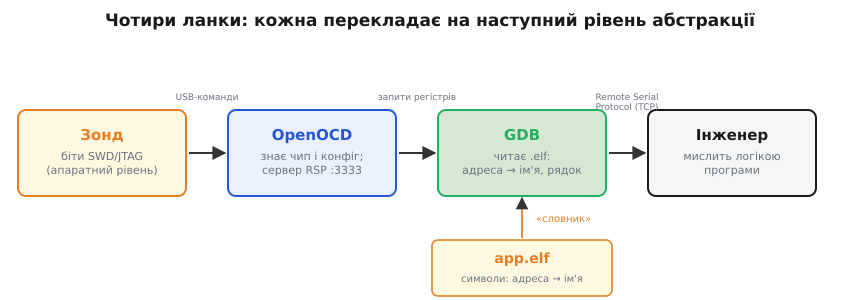
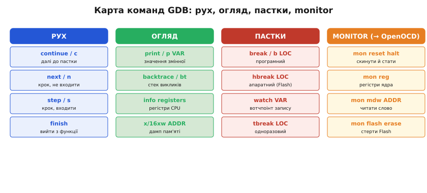

# OpenOCD і GDB: хост говорить із чипом

[Зонд](root:sys-ide/swd-jtag-internals), що підключається до JTAG/SWD і вміє [ставити пастки](root:sys-ide/breakpoints-watchpoints), — це «німий» виконавець: він знає тільки, як крутнути тактовий сигнал і перетворити команду з USB на JTAG-послідовність. Осмислення, символіка, імена функцій, рядки вихідного коду — нічого з цього в зонді немає. Щоб з голих бітів виникло повноцінне відлагодження, між зондом і людиною стають ще дві програми, і кожна додає свій рівень сенсу.

### Чотири ланки: зонд → OpenOCD → GDB → людина

Найперше відчуття, ніби «відлагоджувач» — це одна річ. Насправді це ланцюг із чотирьох ланок, де кожна розмовляє лише з сусідами й перекладає на наступний рівень абстракції.

**Зонд** — фізичний міст USB↔JTAG/SWD. Він приймає команди від хоста, перетворює їх на тактові послідовності на ніжках чипа й повертає відповіді. Про ваш код, ядро чи прошивку зонд не знає нічого: для нього існують лише біти на дроті.

**OpenOCD** (Open On-Chip Debugger — «відкритий відлагоджувач усередині чипа») — програма на хості, що знає **конкретний чип** і **конкретний зонд**: де який регістр, скільки апаратних компараторів для пасток, як виглядає скан-ланцюг для Cortex-M4 чи Xtensa ESP32. OpenOCD приймає абстрактні запити («прочитай регістр r0», «зупини ядро»), розкладає їх на конкретні скан-послідовності для зонда, а назустріч відкриває **мережевий сервер** — зазвичай на TCP-порту 3333. Саме тут апаратний рівень стає протокольним: усе, що вище, спілкується вже не з дротом, а з мережевим портом.

**GDB** (GNU Debugger — відлагоджувач проєкту GNU) — той самий GDB, що йде [в тулчейні поряд із компілятором](root:sf-lang/compilation), але підключений не до процесу в операційній системі, а до реального чипа. Розмовляє він із сервером OpenOCD по **Remote Serial Protocol** (RSP — «віддалений послідовний протокол») поверх TCP. GDB читає **символи з .elf-файлу** й знає: адреса `0x400D2ABC` — це функція `process_packet` у файлі `proto.c`, рядок 47. Голі числа адрес, що надходять знизу, він обертає на осмислений вигляд: імена функцій, рядки коду, значення змінних.

**Людина** — остання ланка. Інженер мислить не адресами, а логікою програми: чому лічильник не обнулився, звідки взялося від'ємне значення. GDB якраз і перекладає машинні числа в ті поняття, якими думає людина.

Кожна ланка вміє рівно одне: говорити з сусідами й піднімати сенс на щабель вище. Звідси й головна практична вигода такого поділу — коли «не працює», винна майже завжди одна конкретна ланка, і шукати треба саме її.



*Зонд оперує бітами, OpenOCD — чипом, GDB — символами, людина — логікою; .elf дає GDB словник для перекладу адрес на імена.*

### .elf: словник для мертвих чисел

Коли ви записуєте прошивку у Flash, туди лягає `.bin` або `.hex` — голий бінарний образ без жодного символу. Усередині чипа немає нічого, крім машинних кодів і числових адрес. А `.elf` (Executable and Linkable Format — «здатний до виконання й компонування формат») — це той самий код, але з повною **таблицею символів**: кожна адреса прив'язана до імені функції чи змінної й до рядка у файлі `.c` або `.cpp`. GDB читає цей словник і повертає числам їхні імена.

Звідси жорстке правило: GDB **мусить** мати рівно той `.elf`, що відповідає прошивці у Flash. Перекомпілювали код після запису, але не перепрошили — адреси функцій зсунулися, і GDB показуватиме хибні рядки або взагалі не знайде символів. Той самий зв'язок між [образом прошивки](root:sf-lang/firmware-image) і його символами критичний і для [посмертного аналізу](root:embedded/core-dump): дамп без рідного `.elf` — це купа незрозумілих чисел.

> 🔧 **Навіщо це.** Найчастіша причина «брейкпоінт не спрацьовує там, де треба» — розбіжність `.elf` і Flash. Звичка перепрошивати перед сеансом (`load`) і не чіпати `.elf` між записом і налагодженням економить години полювання на привидів.

### Базові команди GDB

Мінімальний словник, що покриває майже весь щоденний цикл. Перед командами зручно тримати в голові їхній намір: одні рухають виконання, інші оглядають стан, треті ставлять пастки, ще одні (`monitor`) ідуть прямо в OpenOCD.

```
target remote :3333   # підключитися до сервера OpenOCD (localhost)
load                  # завантажити прошивку з .elf у Flash
break app_main        # програмний брейкпоінт на функцію
hbreak flash_isr      # апаратний брейкпоінт (код у Flash)
continue / c          # продовжити виконання
next / n              # крок, не входячи у функцію
step / s              # крок, входячи у функцію
finish                # доконати поточну функцію й вийти
print g_counter       # значення змінної
print *cfg            # розіменувати вказівник, показати структуру
backtrace / bt        # стек викликів
frame 2               # перейти у фрейм #2
info registers        # регістри CPU (PC, SP, LR, …)
x/16xw 0x3FFB0000     # дамп 16 слів по 4 байти з адреси
set var g_mode = 1    # змінити змінну наживо для досліду
monitor reset halt    # скинути ядро й стати (команда OpenOCD)
watch g_config.rate   # вотчпоінт на запис у змінну
```

Окремо варто бачити `monitor`: усе після нього GDB не виконує сам, а пересилає **дослівно** в OpenOCD. Так із того самого вікна дістаєш суто апаратні дії — скинути ядро, стерти Flash, прочитати регістр периферії, — яких у мові GDB немає.

Командний рядок GDB — фундамент, але щодня поверх нього зручніше працювати в [графічній обгортці VS Code](root:sys-ide/debug-vscode): вона запускає той самий OpenOCD і GDB під капотом, а брейкпойнти й змінні показує мишкою прямо в редакторі.



*Тримати в голові не список, а карту за наміром: рухаю виконання, оглядаю стан, ставлю пастку чи звертаюся до OpenOCD через monitor.*

### ESP32 і ESP-IDF: готовий стек

З [ESP32](root:hw-arch/esp32-architecture) усе зведено докупи заздалегідь. Конфіги для OpenOCD команда Espressif уже написала: `board/esp32-wrover-kit.cfg`, `board/esp32s3-builtin.cfg` тощо — там описано і зонд, і чип. Запуск зводиться до двох команд у двох терміналах:

```bash
# Термінал 1: піднімаємо OpenOCD (сервер RSP на :3333)
idf.py openocd

# Термінал 2: GDB з автоматичним конфігом і потрібним .elf
idf.py gdb
```

Для ESP32-S3/C3/C6 із вбудованим USB-Serial-JTAG конфіг сам вибирає USB-транспорт — зовнішній зонд не потрібен, досвід пише прямо в роз'єм плати. OpenOCD для ESP32 ще й **обізнаний із FreeRTOS**: він бачить задачі планувальника, показує їхні окремі стеки й уміє [перемикатися між ними під час покрокового відлагодження](root:sys-ide/step-debugging) — без цього багатозадачна прошивка під відлагоджувачем виглядала б суцільною плутаниною.

**Повний міні-сеанс: підключитися й прочитати змінну.**

```bash
# === Термінал 1: OpenOCD ===
$ idf.py openocd
Open On-Chip Debugger v0.12.0
Info : esp32: Target halted, PC=0x400D1ABC
Info : Listening on port 3333 for gdb connections

# === Термінал 2: GDB ===
$ idf.py gdb
(gdb) target remote :3333
Remote debugging using :3333
0x400D1ABC in esp_restart ()

(gdb) break app_main
Breakpoint 1 at 0x400D2010: file main/main.c, line 42.

(gdb) c
Continuing.
Breakpoint 1, app_main () at main/main.c:42
42          config_t cfg = { .rate = DEFAULT_RATE };

(gdb) p cfg.rate
$1 = 100

(gdb) bt
#0  app_main () at main/main.c:42
#1  0x400D0888 in main_task (args=0x0) at /idf/components/freertos/app_startup.c:208
```

Видно всі чотири ланки в роботі: `idf.py openocd` підняв сервер на 3333 (OpenOCD достукався до чипа через зонд і відрапортував `Target halted`), `target remote :3333` під'єднав GDB по RSP, а `break`/`c`/`p`/`bt` уже працюють символами з `.elf` — іменами функцій і змінних, а не адресами.

> 🔧 **Навіщо це.** Коли «не підключається», розуміння чотирьох ланок одразу звужує пошук: зонд не видно в USB / OpenOCD узяв не той `.cfg` / ядро не зупинилося / GDB має не той `.elf`. Замість тику навмання перевіряєш ланки по черзі знизу вгору — і винна знаходиться за хвилину.
