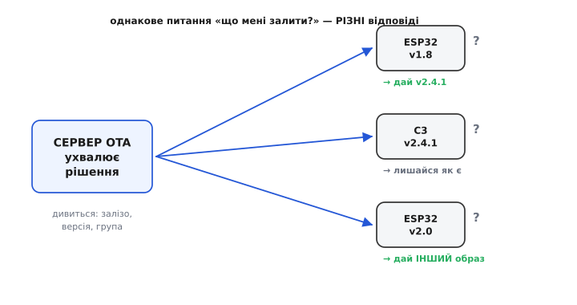
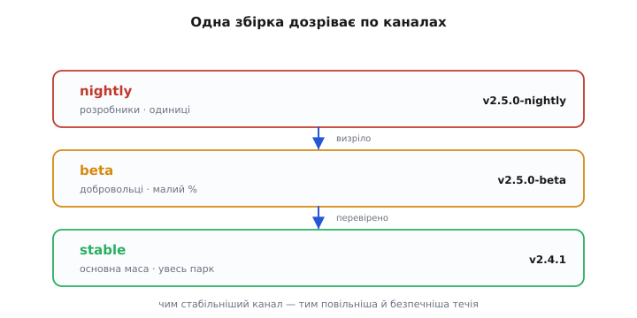
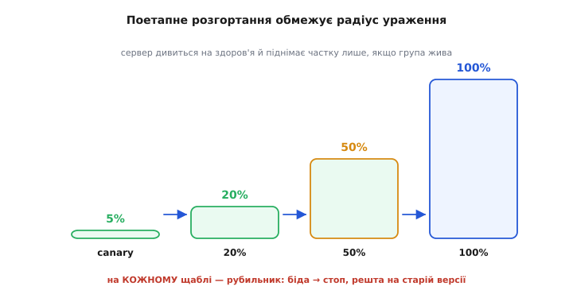
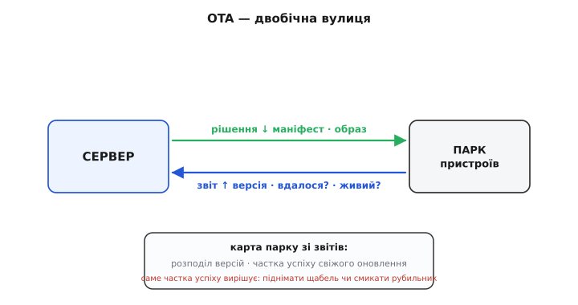
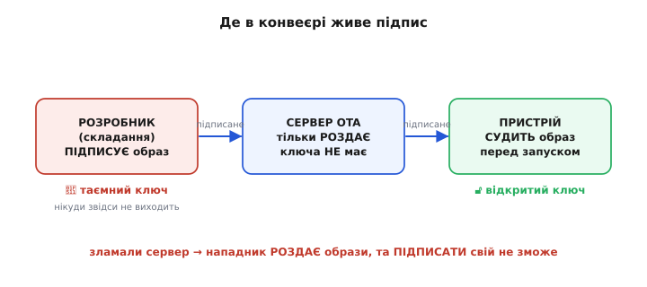

# Серверна частина OTA: мозок цілого парку

[Оновлення через ефір](topic:programming/ota-update) ми досі дивилися очима **пристрою**: дві банки під прошивку, перевірка цілості й підпису, атомарний перемикач, пробний запуск із відкатом. Уся ця механіка боронить **один** виріб від того, щоб стати цеглиною. Та в тій розповіді був бік, який ми свідомо лишили чорною скринькою: усе починалося з того, що пристрій **питає сервер** — «чи є новіша версія, ніж моя?». Звідки сервер знає, що відповісти? Що він узагалі тримає в себе, окрім самого файлу прошивки? І чому, маючи десять тисяч пристроїв, не можна просто покласти новий образ у одну папку й розіслати його всім?

Саме тут — на сервері — живе **друга половина** OTA, і вона геть інша за природою. На пристрої задача була **інженерна**: як безпечно записати мегабайт у Flash, не вбивши робочу копію. На сервері задача **організаційна**: яку версію кому віддати, коли, в якому порядку, як побачити, що пішло не так, і як зупинити лихо, поки воно не накрило весь парк. Пристрій думає про **себе**; сервер думає про **всіх одразу**. Це різниця між тим, щоб безпечно посадити один літак, і тим, щоб керувати рухом цілого аеропорту.

Розберімо цю другу половину чесно: що сервер мусить уміти відповісти, чому відповідь — не файл, а **рішення для кожного пристрою окремо**, як влаштований документ-маніфест, що цю відповідь несе, навіщо парку кілька «правд» одночасно, чому новий образ ніколи не вмикають усьому парку разом і як побачити стан тисяч пристроїв, щоб ловити біду на десятці, а не на всіх.

### Сервер віддає не файл, а рішення

Найперша спокуса — уявити сервер оновлень як звичайне сховище файлів: лежить там `firmware.bin`, пристрій його качає, та й по всьому. Для одного пристрою на столі так і є. Та щойно пристроїв стає багато, ця картинка розсипається, і ось чому.

Парк ніколи не буває однорідним. Частина пристроїв — старого апаратного покоління, частина — нового; на одних стоїть ESP32, на інших — [уже C3 на RISC-V](root:embedded/esp32-family); хтось у полі застряг на торішній версії, бо місяцями не виходив на зв'язок, а хтось щойно зійшов із конвеєра з найсвіжішою. Якщо віддати їм **усім один і той самий** образ, половину можна перетворити на цеглу: образ, зібраний під C3, не запуститься на оригінальному ESP32, а оновлення, що стрибає через п'ять версій, може спіткнутись об несумісність даних. Тобто правильна відповідь на питання «що тобі залити?» **залежить від того, хто питає**.

Отже, сервер OTA — це не файлове сховище, а той, хто на кожен запит ухвалює **рішення**: подивитися, хто перед ним (яке залізо, яка поточна версія, з якої групи), і відповісти **саме цьому** пристрою саме те, що йому годиться, — або чесно сказати «тобі оновлюватися не треба». Файл прошивки — лише вантаж; цінність сервера в **голові**, що цей вантаж розподіляє.


*Сервер OTA — не папка з файлом, а той, хто ухвалює рішення на кожен запит. Пристрої різні: різне апаратне покоління, різні поточні версії, різні групи. На однакове питання «що мені залити?» сервер відповідає по-різному — комусь новий образ, комусь «лишайся як є», комусь геть інший образ під його залізо. Один файл на всіх перетворив би частину парку на цеглу.*

> 🔧 **Навіщо це.** Перш ніж писати рядок серверного коду, перемкни голову з «де покласти файл» на «як ухвалити рішення для конкретного пристрою». Це визначає **всю** подальшу будову: серверу потрібно знати про кожен пристрій три речі — яке в нього залізо, яка зараз версія і до якої групи він належить, — бо без цих трьох він не має права нічого віддавати наосліп. Якщо твій «сервер OTA» цих трьох речей не розрізняє, він придатний рівно для одного пристрою на столі, а в полі рано чи пізно когось закатає.

### Маніфест: контракт між сервером і пристроєм

Як саме пристрій дізнається рішення сервера? Він не качає одразу мегабайтний образ «про всяк випадок» — це було б марнотратством щоразу, коли оновлення й не потрібне. Спершу він питає коротко й дешево, і у відповідь отримує маленький **документ-опис** — його звуть **маніфестом** (лат. *manifestus* — «очевидний, виявлений»): кілька рядків, що **оголошують**, яка версія для цього пристрою зараз вважається правильною і де її взяти.

Маніфест — це **контракт** між сервером і пристроєм: рівно те, що пристрою треба знати, перш ніж качати важкий образ. Найголовніше в ньому — **версія**, бо саме її пристрій звірятиме зі своєю. Далі — **адреса** самого образу (звідки качати), його **розмір** і **контрольна сума** (щоб пристрій знав наперед, що має доїхати), а часто й **підпис** або вимоги до апаратного покоління. Виглядає це приблизно так — звичайний текстовий документ, який легко прочитати й людині, і пристрою:

```json
{
  "version":   "2.4.1",
  "hardware":  "esp32-c3",
  "url":       "https://ota.example.com/fw/app-2.4.1.bin",
  "size":      1048576,
  "sha256":    "9f86d0818884...e3b0c44298fc",
  "min_from":  "2.0.0"
}
```

Кожне поле тут — відповідь на конкретне питання пристрою. `version` — «що зараз правильно?». `hardware` — «це точно під моє залізо?». `url` — «де брати?». `size` і `sha256` — «що має доїхати, щоб я знав, чи доїхало ціле?». А `min_from` — тонке, але рятівне: «з якої версії можна стрибати прямо сюди?». Якщо пристрій занадто старий (скажімо, `1.5.0`, а `min_from` каже `2.0.0`), стрибати через прірву небезпечно — і пристрій спершу візьме проміжну версію, а тоді вже цю. Маніфест дешевий — кілька сотень байтів, — тож пристрій може питати його хоч щогодини, не качаючи й байта зайвого образу, поки оновлення справді не з'явиться.

Чому версію кладуть **і** в маніфест, **і** всередину самого образу? Бо це дві різні перевірки на двох різних рубежах. Версію в маніфесті пристрій звіряє **до** завантаження — щоб не качати те, що в нього вже стоїть. А версію, **вшиту в образ**, перевіряють уже **після** завантаження, перед самим перемиканням: чи справді доїхав той образ, що обіцяв маніфест, а не випадково старіший. На ESP32 ця вшита версія — частина [образу прошивки](topic:programming/firmware-image): збираючи прошивку, ESP-IDF кладе в її заголовок структуру-опис із назвою проєкту й версією, і пристрій може прочитати її прямо зі свіжозавантаженого образу, ще не перемкнувшись на нього.

> 🔧 **Навіщо це.** Маніфест — це місце, де ти **відокремлюєш дешеве питання від дорогої відповіді**. Питати «чи є новіше?» пристрій має часто й майже задарма; качати мегабайт — рідко й лише коли треба. Якщо твій пристрій щоразу тягне весь образ, аби лише дізнатися версію, ти палиш трафік (а в полі це гроші за мобільний зв'язок) і батарею на порожньому місці. Першим завжди їде маніфест; образ — лише як він каже «так, тобі справді треба».

### Версії, що щось означають

Маніфест стоїть на версіях, тож варто на мить спинитися: що таке «новіша версія» взагалі? Рядок `2.4.1` — не просто мітка, а **три числа з домовленим змістом**, і ця домовленість зветься **семантичним версіонуванням** (англ. *semantic versioning* — «версіонування зі змістом»). Перше число — **велика** версія (ламає сумісність: дані старої прошивки нова може не зрозуміти), друге — **функційна** (додає вміння, лишаючись сумісною), третє — **латка** (виправляє помилку, нічого не ламаючи). Тоді `2.4.1` читається однозначно: друге функційне доповнення гілки 2, а в ньому — перша латка.

Чому це важить серверу? Бо порівнювати версії доводиться **числами по полях**, а не як рядки. Рядкове порівняння збрехало б: текстово `"2.10.0"` менше за `"2.9.0"` (бо символ `1` менший за `9`), хоч за змістом десята збірка новіша за дев'яту. Сервер мусить розбити версію на три числа й порівняти їх по черзі — інакше парк застрягне на старій версії, певний, що вона найсвіжіша. Та сама пастка чигає й на пристрої, коли той вирішує, чи новіший образ із маніфесту за його власний; до коду цього порівняння ми ще дійдемо.

### Канали: один парк, кілька правд

Тепер — тонкість, без якої серйозне OTA не живе. Дотепер ми мовчки припускали, що для даного заліза є **одна** «правильна зараз» версія. Насправді ж їх потрібно **кілька одночасно**, і ось чому.

Уявіть, що ви випустили версію `2.4.0` і хочете спробувати в ній нову, ще сирувату можливість. Залити її **всьому** парку — божевілля: якщо в ній вада, ляже все. Тримати її лише в себе на столі — теж погано: вади виповзають аж у полі, на справжньому залізі, у справжній мережі. Потрібне щось середнє: **невелика група** пристроїв-добровольців, які свідомо беруть свіже й сируве, тоді як решта парку спокійно сидить на перевіреному. Ось ця «дві правди для одного парку» і є **канал** (англ. *channel* — «русло»): окрема доріжка оновлень зі своєю течією версій.

Типова розкладка — два-три канали. **Стабільний** (*stable*) — для основної маси: сюди потрапляє лише те, що вже визріло. **Тестовий** (*beta*) — для добровольців і власних пристроїв: сюди свіже приходить раніше, щоб виявити вади на малій групі, перш ніж пускати в стабільний. Іноді ще **нічний** (*nightly*) — найгостріший край, для самих розробників. Те саме питання «що мені залити?» сервер тепер розв'язує **в межах каналу** пристрою: бета-пристрою віддасть `2.5.0-beta`, стабільному — перевірену `2.4.1`. Канал — це просто ще одна властивість пристрою, поряд із залізом і версією, яку сервер бере до уваги, ухвалюючи рішення.


*Канали — це кілька «правд» для одного парку. Свіжа збірка спершу йде в **nightly** (розробники, одиниці пристроїв), визрівши — у **beta** (добровольці, малий відсоток), і лише перевіреною — у **stable** (основна маса). Кожен канал тече своєю швидкістю: чим стабільніший — тим повільніший і безпечніший. Так вади ловлять на десятку пристроїв, а не на десяти тисячах.*

> 🔧 **Навіщо це.** Канали — це твій спосіб **ризикувати малим, а не всім**. Без них у тебе лише два поганих вибори: або ніколи не пробувати нове (і парк застигає), або пробувати на всіх (і одна вада кладе весь бізнес). Канал дає третій шлях: тримай вузьку групу, що свідомо їсть сире, і поки вона жива й здорова — пускай це далі. Найдешевший канал, який мусиш завести з першого дня, — окремий **тестовий** для своїх власних пристроїв: на них ти ловитимеш те, що ніколи не виявиш на столі.

### Поетапне розгортання: ніколи не вмикай усім одразу

Канали — це **хто** дістає свіже раніше. Та є друге, не менш важливе питання: навіть усередині одного каналу, навіть для стабільної версії — **як швидко** новий образ розповзається парком? І тут є правило, написане кров'ю не одного перевернутого OTA: **ніколи не перемикай увесь парк на нову версію одним махом.**

Причина — у природі вад. Образ може пройти всі перевірки на столі, цілим доїхати, навіть запуститися й підтвердити себе на сотні пристроїв — і все одно мати ваду, що виповзе лише на **тисячному**: на рідкісному апаратному варіанті, у поганій мережі, на якомусь крайньому стані даних, якого в лабораторії не було. Якщо ви вже перемкнули **весь** парк, виправляти нема як: усі десять тисяч одночасно зловили ваду, і якщо вона завадить їм оновитися знову, ви втратили цілий парк. Це і є **радіус ураження** (англ. *blast radius* — «радіус вибуху»): скільки пристроїв постраждає, якщо оновлення виявиться поганим.

Ліки прості й залізні: розгортати **поетапно** (англ. *staged rollout* — «розгортання щаблями»). Спершу нову версію дістає крихітна **передова група** (англ. *canary* — «канарка», за шахтарськими пташками, що першими чули отруйний газ і гинули, рятуючи людей): зазвичай 1–5 % парку. Сервер кілька годин чи добу **дивиться**: канарки оновлюються успішно? не падають у нескінченні перезавантаження? виходять на зв'язок після оновлення? Якщо передова жива й здорова — частку піднімають: 5 % → 20 % → 50 % → 100 %, на кожному щаблі знову дивлячись на здоров'я. А якщо на якомусь щаблі піде лихо — сервер **зупиняє** розгортання (англ. *kill switch* — «рубильник»): решта парку так і лишається на старій, перевіреній версії, і постраждав не весь парк, а лише та частка, що вже встигла перемкнутися.


*Поетапне розгортання обмежує радіус ураження. Нову версію спершу дістає лише канарка (1–5 %); сервер дивиться на її здоров'я й піднімає частку щаблями. На кожному щаблі напоготові рубильник: помітив біду — зупинив, і решта парку лишилася на старій версії. Вмикати все одразу — означає ризикувати всім парком на одній невиявленій ваді.*

Порахуймо, що дає ця обережність, на простому прикладі.

**Радіус ураження: одразу проти щаблями.** Парк — 10 000 пристроїв, у новій версії ховається вада, що робить пристрій цеглиною.

```
Увімкнули ВСІМ одразу:
  постраждали      = 10 000 пристроїв        (увесь парк)
  поки помітили    = вже пізно, усі вже взяли образ

Розгортали щаблями, зупинили на канарці 5 %:
  постраждали      = 10 000 × 0.05 = 500 пристроїв
  решта 9 500      = ціла, на старій версії
  радіус ураження  менший у 20 разів
```

П'ятсот пристроїв на ремонт — біда, але переживна; десять тисяч одночасно — кінець. Уся суть щаблів у цьому числі: ви не **прибираєте** ризик вади (її прибирають тестуванням), ви **обмежуєте ціну** вади, якщо вона все-таки прослизнула. І що дорожчий ваш пристрій та що важче до нього доїхати — то вужчою має бути канарка й то довше треба дивитися, перш ніж піднімати частку.

> 🔧 **Навіщо це.** Поетапне розгортання — це визнання простої правди: **ти не зловиш усі вади до випуску, хоч як старайся.** Тож питання не «чи прослизне вада?», а «скільки пристроїв вона забере, коли прослизне?». Канарка перетворює катастрофу на прикрість. Правило без винятків для будь-чого, що в полі: новий образ виходить **спершу на вузьку групу**, і тільки переконавшись, що вона жива, ти його пускаєш далі. Рубильник тримай під рукою завжди — і це не метафора, а кнопка, яку треба вміти натиснути за секунди.

### Бачити парк: телеметрія назад

Розгортання щаблями має сенс лише тоді, коли ви **бачите**, що з канаркою. А це означає, що OTA — не однобічна вулиця «сервер → пристрій». Назад мусить текти **звіт**: кожен пристрій після оновлення (і час від часу взагалі) повідомляє серверу свій стан, і з цих повідомлень сервер складає **карту парку**.

Що саме звітувати? Найперше — **яка зараз версія** стоїть і чи оновлення **вдалося**: пристрій перемкнувся, піднявся, [підтвердив себе](topic:programming/ota-update) — чи, навпаки, відкотився на стару? Далі корисні **здоров'я** (скільки разів перезавантажувався, чи були аварії) і просто **факт зв'язку** («я живий, я тут»). З цього потоку сервер бачить найважливіше: **розподіл версій** парком (скільки пристроїв на якій версії) і **частку успіху** свіжого оновлення серед тих, хто його вже взяв.

Саме ця частка успіху й керує рубильником. Канарка взяла нову версію; сервер рахує: з тих, хто почав оновлюватися, скільки **успішно** доповіли про новий стан, а скільки **зникли** (взяли образ — і замовкли, що зазвичай означає цеглину) чи **відкотилися**? Якщо успіх високий — щабель піднімають. Якщо пристрої масово замовкають чи відкочуються — це сигнал біди, і розгортання зупиняють, **поки воно не дійшло до решти парку**. Без цього зворотного потоку поетапність сліпа: ви піднімали б частку наосліп, не знаючи, рятуєте ви парк чи методично його вбиваєте.


*OTA — двобічна вулиця. Униз тече рішення сервера (маніфест, образ); угору — звіт пристроїв (яка версія, чи вдалося оновлення, чи живі). Зі звітів сервер складає карту парку: розподіл версій і частку успіху свіжого оновлення. Саме ця частка вирішує — піднімати щабель чи смикати рубильник. Без зворотного потоку поетапне розгортання сліпе.*

> 🔧 **Навіщо це.** Карта парку — це твоє єдине **чесне дзеркало** того, що насправді коїться в полі, а не в твоїх надіях. Без неї ти дізнаєшся про погане оновлення останнім — від розлючених користувачів, коли вже пізно. З нею ти бачиш «частка успіху серед канарки впала до 80 %» **за годину** й зупиняєш лихо на сотні пристроїв. Закладай зворотний звіт у пристрій із самого початку, навіть найпростіший: бодай «я на версії X, оновлення Y вдалося». Усе складніше доростиш потім; без цього мінімуму ти керуєш парком наосліп.

### Хто ти, пристрою: впізнавання й допуск

Двобічна вулиця відкриває питання, якого в чорній скриньці не було видно: коли пристрій стукає до сервера по маніфест чи по образ — **звідки сервер знає, що це справді ваш пристрій**, а не чужий, що видає себе за нього? І навпаки: пригадаймо з [клієнтського боку](topic:programming/ota-update), що відкритий, незахищений OTA — це запрошення «приходь і став свій код». Тож обидва боки мусять **впізнавати** одне одного, перш ніж довіряти.

Тут працюють два різні замки, і їх легко сплутати. Перший — **пристрій перевіряє сервер**: образ їде [захищеним каналом](topic:programming/firmware-secure-boot) (TLS), і пристрій звіряє, що на тому кінці справді ваш сервер, а не самозванець, що підсуне чужу прошивку. Другий — **сервер перевіряє пристрій**: щоб маніфести й образи (особливо бета-канал чи внутрішні збірки) не міг тягнути будь-хто, пристрій доводить серверу, **хто він** — токеном, ключем чи сертифікатом, зашитим у нього. Перше захищає пристрій від чужого коду; друге захищає **вас** від того, щоб ваші прошивки й карту парку вичитував сторонній.

Та затямте чітку межу, бо тут — найпоширеніша й найдорожча ілюзія в усьому OTA. Жодне впізнавання сервера й жоден захищений канал **не замінює підпису образу**. Канал боронить прошивку **в дорозі**; підпис перевіряє її **на місці**, вже у Flash, перед самим запуском. Навіть якщо нападник якось зламає сервер чи прокладе свій канал, без правильного підпису пристрій його образ **не виконає** — бо [перевірка підпису](topic:programming/firmware-secure-boot) стоїть в самому пристрої, незалежно від того, звідки образ прийшов. Тому правило з клієнтського боку лишається залізним і на сервері: яким би захищеним не був канал і як би сервер не впізнавав пристрій — **жодного OTA без перевірки підпису образу самим пристроєм**.

Що ця осторога не теоретична, показала історія: ціла галузь керованого OTA виросла з кількох гучних катастроф, коли мільйони пристроїв упали через незахищені оновлення, — а у відповідь з'явилися спеціальні захищені рамки доставки на кшталт TUF і автомобільного Uptane. Як ботнет із сотень тисяч камер на стандартних паролях поклав пів-інтернету й чому після цього «просто HTTPS» перестало вважатися безпечним — у вставці [Як незахищене OTA породило цілу галузь захисту](root:embedded/ota-server/hist-fleet-ota.md).

> 🔧 **Навіщо це.** Розрізняй три замки, бо їх часто валять в один і дірявлять усі троє. **TLS** каже пристрою «сервер справжній». **Токен пристрою** каже серверу «пристрій справжній». **Підпис образу** каже пристрою «код справжній, хоч би звідки приїхав». Це різні рубежі від різних загроз, і кожен потрібен. Найгірша помилка — повірити, що «у нас же HTTPS, отже безпечно»: HTTPS береже трубу, а не вантаж. Зламали сервер — і труба чесно везе отруту. Рятує лише підпис у самому пристрої.

### Де живе підпис: сервер роздає, пристрій судить

Це підводить до того, як OTA-конвеєр розкладає роботу між тими, хто збирає прошивку, сервером і пристроєм. Бо «підписати образ» — окрема справа, і важливо, **де** в ланцюжку вона стається.

Підпис народжується **не на сервері оновлень**. Образ підписують **таємним ключем розробника** там, де збирають прошивку, — і цей ключ нікуди звідти не виходить, найкраще взагалі лежить у захищеному сховищі осторонь. На сервер оновлень потрапляє вже **готовий, підписаний** образ; сам сервер таємного ключа не має й мати не повинен — а отже, зламавши сервер, нападник дістане лише право **роздавати** образи, але не **підписувати** свої. Пристрій же несе в собі **відкритий** ключ і ним **судить** кожен образ перед запуском. Сервер роздає — пристрій судить; таємний ключ не торкається жодного з них. Як саме влаштований підпис образу — яким ключем, що підписують і як пристрій перевіряє, — це окрема тема [підписування OTA-образу](topic:programming/ota-image-signing), нерозлучна з [secure boot](topic:programming/firmware-secure-boot).


*Де в конвеєрі живе підпис. Таємний ключ — лише у розробника, на складанні: там образ підписують, і ключ нікуди звідти не виходить. На сервер оновлень їде вже підписаний образ — сервер його тільки роздає, ключа не має. Пристрій несе відкритий ключ і судить кожен образ перед запуском. Зламали сервер — нападник роздаватиме образи, та підписати свій не зможе.*

> 🔧 **Навіщо це.** Тримай таємний ключ **якнайдалі** від сервера оновлень — це найдорожчий урок безпеки OTA. Сервер дивиться в інтернет, його стукають боти щодня, рано чи пізно хтось знайде діру. Якщо на зламаному сервері лежить і ключ підпису — нападник підпише свою прошивку й роздасть її всьому парку як вашу, і навіть бездоганний secure boot не врятує, бо підпис **справжній**. А якщо ключ ніколи там не був — найгірше, що нападник зможе, це роздавати **старі ваші** образи, що підпис пройдуть. Прірва між цими двома катастрофами — у тому, де лежить один файл-ключ.

### Усе разом: рішення на стороні пристрою

Складімо обидві половини в коді. Серверну логіку (хто на якому каналі, який щабель розгортання) пишуть зазвичай не на C, а на стороні сервера звичайною мовою вебу, тож тут показ її був би не до місця — її суть ми вже розклали словами. А от **рішення на стороні пристрою** — те, з чого вся наша розповідь почалася, — лягає в реальний код прямо. Покажемо найважливіший його шматок: пристрій узяв маніфест і має чесно вирішити, чи варто взагалі качати образ.

Ключове тут — **правильно порівняти версії**, не наступивши на рядкову пастку, про яку ми говорили. Розіб'ємо версію на три числа й порівняємо по полях.

**Приклад (порівняння версій по полях, без рядкової пастки).**

```c
#include <stdio.h>
#include <string.h>
#include <stdbool.h>

// Розкласти рядок "2.4.1" на три числа.
typedef struct { int major, minor, patch; } version_t;

static version_t parse_version(const char *s) {
    version_t v = {0, 0, 0};
    sscanf(s, "%d.%d.%d", &v.major, &v.minor, &v.patch);
    return v;
}

// > 0  якщо a новіша за b;  0 — рівні;  < 0 — a старіша.
// Саме ПОЛЯМИ, а не рядком: "2.10.0" новіша за "2.9.0", хоч текстово менша.
static int version_cmp(version_t a, version_t b) {
    if (a.major != b.major) return a.major - b.major;
    if (a.minor != b.minor) return a.minor - b.minor;
    return a.patch - b.patch;
}
```

Маючи це порівняння, пристрій ухвалює рішення про оновлення тверезо: бере свою чинну версію, версію з маніфесту — і качає образ, лише якщо маніфест **справді новіший**. Інакше нема чого палити трафік і ризикувати перезаписом.

**Приклад (рішення качати чи ні).**

```c
// running — наша чинна версія (із заголовка ВЛАСНОГО образу);
// manifest — версія, яку оголосив сервер у маніфесті.
bool should_update(const char *running_ver, const char *manifest_ver,
                   const char *manifest_hw, const char *my_hw) {

    // 1. Залізо мусить збігтися — інакше образ нас перетворить на цеглу.
    if (strcmp(manifest_hw, my_hw) != 0) {
        printf("OTA: образ під чуже залізо (%s != %s) — пропускаємо\n",
               manifest_hw, my_hw);
        return false;
    }

    // 2. Качаємо, лише якщо маніфест НОВІШИЙ за нас.
    version_t mine = parse_version(running_ver);
    version_t want = parse_version(manifest_ver);
    if (version_cmp(want, mine) <= 0) {
        printf("OTA: %s не новіше за %s — лишаємось\n", manifest_ver, running_ver);
        return false;   // та сама або старіша версія — нічого не робимо
    }

    printf("OTA: є новіше: %s > %s — починаємо завантаження\n",
           manifest_ver, running_ver);
    return true;
}
```

Прочитайте ці дві перевірки — і ви впізнаєте в них дві з трьох речей, які, як ми казали, сервер знає про пристрій: **залізо** (щоб не залити образ під чужий чіп) і **версію** (щоб не качати те, що вже стоїть). Третя — **канал** — на сервері вирішує, **який саме** маніфест цьому пристрою віддати, тож до пристрою вона доходить уже у вигляді того, що в маніфесті стоїть саме «його» версія. На ESP32 свою чинну версію (`running_ver`) пристрій бере не з повітря, а з [заголовка власного образу](topic:programming/firmware-image) — тієї самої структури-опису, що ESP-IDF вшиває при збиранні; готовий стек `esp_https_ota` навіть уміє витягти опис із завантажуваного образу й порівняти версії за вас, але механіка під ним — рівно ця.

Коли `should_update()` повернув `true` — далі вступає вже знайома нам [клієнтська механіка OTA](topic:programming/ota-update): приймати образ шматками крізь крихітний буфер RAM у запасний слот, перевірити цілість і підпис, атомарно перемкнутися, піднятися в пробному запуску й підтвердити себе. Серверна половина закінчується там, де починається ця: сервер ухвалив рішення й видав маніфест, а далі пристрій сам безпечно його виконує.

### Підсумок: дві половини одного цілого

Озирнімося на весь шлях. На [боці пристрою](topic:programming/ota-update) OTA — це **інженерія безпечного запису**: дві банки, перевірка, атомарний перемикач, відкат, аби жоден збій не лишив цеглини. На боці сервера, який ми щойно розклали, OTA — це **керування парком**: сервер віддає не файл, а **рішення для кожного пристрою**, спираючись на його залізо, версію й канал. Це рішення їде маленьким **маніфестом** — контрактом, що оголошує правильну версію, перш ніж качати важкий образ. Парку потрібно **кілька каналів** одразу, щоб пробувати свіже на вузькій групі, а не на всіх. Усередині каналу новий образ розповзається **щаблями** — від канарки в 5 % до всього парку, з рубильником напоготові, щоб одна невиявлена вада не забрала весь парк. А щоб бачити, коли цей рубільник смикати, назад тече **телеметрія**, з якої сервер складає карту версій і частку успіху. Над усім цим стоять **три замки** — TLS, токен пристрою, підпис образу, — і найголовніший із них, підпис, народжується таємним ключем **осторонь** сервера, тож навіть зламаний сервер не зможе підсунути парку чужий код.

Дві половини доповнюють одна одну точно: пристрій уміє безпечно **прийняти** будь-який образ, сервер уміє розумно **вирішити**, який образ кому й коли віддати. Поодинці кожна половина безпорадна — пристрій без сервера не знає, що качати, сервер без пристрою не має кому віддавати. Разом вони й роблять виріб тим, чим OTA його обіцяв зробити: **живим** усе його життя в полі, де б він не висів, — полагоджуваним, оновлюваним і захищеним не по одному, а цілим парком.
