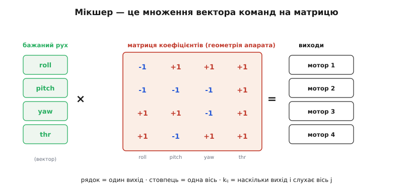
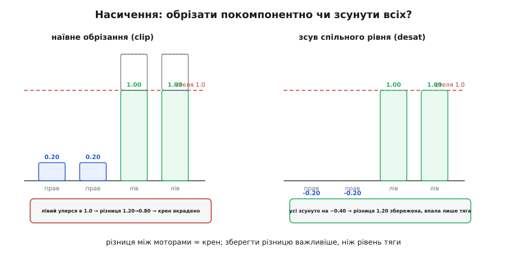
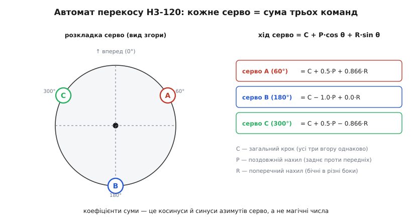

# Узгодження сигналів керування — детально

У базовому кроці ми домовилися про головне: контролер мислить не пінами, а **бажаним рухом апарата**, і останній каскад прошивки — узгодження виходів — розкладає це бажання на конкретні сигнали конкретним виконавцям. Ми окреслили п'ять його частин (мікшування, масштаб і межі, реверс, трим, failsafe), побачили спільну мову виходів «1–2 мс, 50 Гц, центр 1.5 мс» і механіку качалок. Усе це було подано **як мапа**: що з чого складається й навіщо.

Тепер пройдемо цю мапу вглиб. Бо за кожним із тих п'яти слів стоїть або струнке виведення, яке базова версія свідомо сховала, або цілий пласт граничних випадків, на яких новачки й розбивають перші апарати. Тут ми **виведемо** мікшер із геометрії — від найпростішого квадрокоптера до автомата перекосу гелікоптера, де кожне серво є сумою трьох команд за тригонометрією. Розберемо, що робить мікшер, коли команд забагато й вони **не влазять** у фізичний хід виходу — це питання насичення (saturation), і саме воно відрізняє іграшкову прошивку від тієї, що втримає апарат на межі. Пройдемо арифметику одного виходу **по кроках** у тому самому порядку, у якому її виконує зрілий стек, і побачимо, чому трим працює не так симетрично, як здається. Дійдемо до того, як апаратний таймер формує імпульс без участі ядра. І складемо failsafe не як гасло «стати в безпеку», а як конкретне дерево рішень із урахуванням того, що сам сигнал може зникнути на будь-якому рівні.

Нитку веду звідти ж, де скінчився базовий крок: виходи — це абстракція, а вся сіль у тому, **яка саме арифметика** перетворює бажаний рух на число в регістрі таймера.

## Виход як число: єдина шкала для мотора й серво

Почнімо з того, що в базовій версії було сказано побіжно, а тут стане фундаментом усього: **для контролера кожен вихід — це одне число**. Не «кут серво» й не «оберти мотора», а безрозмірна, нормована величина, з якою однаково зручно рахувати мікшеру. Лише в самому кінці, за крок до заліза, це число перетворюється на мікросекунди імпульсу.

Навіщо взагалі нормувати? Бо мікшер не має права знати, що на виході 3 висить серво з ходом 1000–2000 мкс, а на виході 1 — регулятор обертів, який теж розуміє 1000–2000 мкс, але «1000» у нього означає стоп, а не «крайній кут». Якби мікшер оперував мікросекундами, він був би прив'язаний до конкретного заліза й до конкретного типу виходу. Тому логіка керування працює в **абстрактних одиницях**, а переклад у мікросекунди — остання, ізольована дія.

Практично склалися дві зручні шкали, і варто розрізняти, коли яка:

```
кутовий вихід (серво, керма):   значення ∈ [−1 … +1],  0 = нейтраль
дросельний вихід (мотор, тяга): значення ∈ [ 0 … +1],  0 = стоп
```

Кутовий вихід симетричний навколо нуля, бо кермо однаково відхиляється в обидва боки від центру: −1 — крайнє ліворуч, 0 — рівно, +1 — крайнє праворуч. Дросельний однобічний, бо тяга не буває від'ємною (звичайний мотор не «тягне назад»). Ця відмінність — не дрібниця запису: вона напряму визначає, як число ляже в мікросекунди й де сидітиме нейтраль, і ми до цього повернемося, коли розбиратимемо трим.

> 🔧 **Навіщо це.** Уся переносність прошивки, про яку ми говорили в базовому кроці, тримається саме на цій нормалізації. Модель апарата видає числа в [−1…+1], і їй байдуже, чи це серво Futaba, чи цифровий привід, чи навіть керма, які смикає крокун через власний драйвер. Замінив залізо — переписав лише останній переклад «число → мікросекунди» в налаштуваннях виходу, а не логіку польоту. Це та сама межа, що дає [шарувата архітектура](topic:sys-dron/ardupilot-layers): верхні шари живуть у нормованих величинах, нижній (`SRV_Channels`) переводить їх у сигнали заліза.

Тримаймо цю картину: **мікшер приймає бажаний рух і видає для кожного виходу одне нормоване число; потім кожне число окремо доводять і переводять у мкс.** Спершу — звідки береться число (мікшер), тоді — що з ним стається далі (доведення й переклад).

## Мікшер як лінійне відображення: матриця виходів

Базовий крок показав мікшер на прикладі елевонів: «лівий = тангаж + крен, правий = тангаж − крен». Ці дві формули — не окремий трюк для крила, а **окремий випадок загальної конструкції**, і зараз ми цю конструкцію дістанемо цілком, бо вона однакова для всього — від квадрокоптера до автомата перекосу.

Погляньмо на «тангаж + крен» уважно. Ліворуч — вихід (серво), праворуч — сума **вкладів** кожної осі керування, кожен зі своїм знаком (тут усі коефіцієнти рівні одиниці). Це лінійна комбінація: вихід = сума (коефіцієнт осі × команда осі). А якщо кожен вихід — лінійна комбінація тих самих команд, то весь мікшер — це **множення вектора команд на матрицю коефіцієнтів**:

```
⎡ out₁ ⎤   ⎡ k₁ᵣ  k₁ₚ  k₁ᵧ  k₁ₜ ⎤   ⎡ roll     ⎤
⎢ out₂ ⎥ = ⎢ k₂ᵣ  k₂ₚ  k₂ᵧ  k₂ₜ ⎥ · ⎢ pitch    ⎥
⎢ out₃ ⎥   ⎢ k₃ᵣ  k₃ₚ  k₃ᵧ  k₃ₜ ⎥   ⎢ yaw      ⎥
⎣ out₄ ⎦   ⎣ k₄ᵣ  k₄ₚ  k₄ᵧ  k₄ₜ ⎦   ⎣ throttle ⎦
```

Кожен рядок — це один вихід; кожен стовпець — це одна вісь керування (крен `r`, тангаж `p`, курс `y`, тяга `t`). Число `kᵢⱼ` каже: **наскільки сильно й у який бік вихід `i` реагує на команду по осі `j`**. Уся геометрія апарата — де стоїть мотор, як прикручене серво, під яким кутом сидить поверхня — стиснута в ці коефіцієнти. Зміни геометрію — зміниться лише матриця, а решта стека навіть не помітить. Ось чому це та сама конструкція скрізь: різні апарати — різні числа в одній і тій самій операції.

Повернімося до елевонів і **перевіримо**, що загальна форма дає ті самі дві формули. Крило має два виходи (лівий і правий елевон) і використовує лише дві осі — тангаж і крен (курсом крило кермує іншим способом, тягою його не рухаєш). Матриця вироджується у два рядки й два стовпці:

```
⎡ лівий  ⎤   ⎡ +1  +1 ⎤   ⎡ pitch ⎤     лівий  = +pitch + roll
⎢        ⎥ = ⎢        ⎥ · ⎢       ⎥  →
⎣ правий ⎦   ⎣ +1  −1 ⎦   ⎣ roll  ⎦     правий = +pitch − roll
```

Збіглося з базовим кроком точно. Тепер видно й **чому** саме такі знаки: обидва коефіцієнти тангажа додатні, бо для підняття носа обидві поверхні йдуть в один бік (угору); коефіцієнти крену протилежні за знаком, бо крен — це коли поверхні розходяться (одна вгору, друга вниз). Знак коефіцієнта — це напрям, у який тягне поверхню відповідна вісь. Уся змістовна частина мікшера — це правильно розставлені знаки й величини в матриці.


*Мікшер — це лінійне відображення. Вектор бажаного руху множиться на матрицю коефіцієнтів; рядок матриці — один вихід, стовпець — одна вісь. Коефіцієнт `kᵢⱼ` каже, наскільки й у який бік вихід `i` реагує на вісь `j`. Уся геометрія апарата стиснута в ці числа; змінюєш апарат — змінюєш лише матрицю.*

> 🔧 **Навіщо це.** Матрична форма — не математичне кокетство, а те, як мікшер реально записаний у прошивці. У [Betaflight](topic:sys-dron/flight-controller) кастомний мікс задають рядками `mmix n throttle roll pitch yaw` — це буквально рядок матриці для мотора `n`. Коли треба нестандартна рама (гексакоптер химерної геометрії, літак із диференціальною тягою двох моторів, апарат зі змішаними поверхнями), ти не пишеш код — ти вписуєш коефіцієнти. Зрозумів матрицю — вмієш налаштувати будь-яку раму, якої нема серед пресетів.

## Виведення мультиротора: чому саме такі знаки в матриці

Крило було розминкою на двох осях. Тепер виведемо повну матрицю **квадрокоптера**, бо тут працюють усі чотири осі одразу, і саме на мультироторі видно, звідки беруться знаки й чому вони мусять бути саме такими. Це і є той випадок, який базова версія назвала, але не розкрутила.

Квадрокоптер має чотири мотори й **лише тягу** як засіб керування — жодних поверхонь. Здавалося б, чотирьох чисел-обертів замало, щоб керувати чотирма осями (крен, тангаж, курс, висота). Але вистачає, і ось чому: кожну вісь створює **різниця** тяги між моторами, а різницю можна викласти на ту саму четвірку чотирма незалежними способами. Розберімо кожну вісь окремо — від фізики до знака коефіцієнта.

Розставимо мотори конвертом (X-конфігурація) і пронумеруємо, як прийнято в багатьох прошивках: 1 — правий задній, 2 — правий передній, 3 — лівий задній, 4 — лівий передній. Дивимось згори.

**Тяга (throttle).** Щоб апарат піднявся, всі мотори мають крутитися дужче разом. Отже вклад тяги в кожен вихід однаковий і додатний:

```
k₁ₜ = k₂ₜ = k₃ₜ = k₄ₜ = +1
```

Тут немає різниці — це «загальний рівень», спільна складова всіх виходів.

**Тангаж (pitch).** Щоб підняти ніс, задні мотори мусять штовхати дужче, а передні — слабше (апарат перекидається назад, ніс іде вгору). Отже задні дістають додатний вклад тангажа, передні — від'ємний:

```
k₁ₚ = +1 (задній),  k₂ₚ = −1 (передній),  k₃ₚ = +1 (задній),  k₄ₚ = −1 (передній)
```

Це чиста різниця «зад мінус перед». Помітьте: сума вкладів тангажа по всіх моторах дорівнює нулю (+1 −1 +1 −1 = 0). Так і має бути — тангаж лише **перерозподіляє** тягу між передом і задом, не змінюючи загальної підіймальної сили. Ця властивість (стовпець осі-повороту сумується в нуль) — прикмета правильно складеної матриці мультиротора, і ми ще скористаємося нею, коли говоритимемо про насичення.

**Крен (roll).** Так само, тільки ліворуч–праворуч: щоб накренити праворуч, правий бік слабшає, лівий дужчає:

```
k₁ᵣ = −1 (правий),  k₂ᵣ = −1 (правий),  k₃ᵣ = +1 (лівий),  k₄ᵣ = +1 (лівий)
```

Знову сума нуль — крен теж лише перерозподіляє тягу між боками.

**Курс (yaw).** Ось найтонше, і саме тут ховається краса квадрокоптера. Поверхонь для повороту навколо вертикальної осі немає — то звідки береться курс? З **реактивного моменту** самих гвинтів. Гвинт, розкручуючи повітря в один бік, за третім законом Ньютона сам штовхає раму в протилежний. Тому сусідні мотори роблять такими, що крутяться в **різні** боки: два за годинниковою, два проти. У врівноваженому режимі їхні реактивні моменти гасяться. А щоб повернути апарат по курсу, ми **порушуємо** цей баланс: додаємо обертів парі, що крутиться в один бік, і віднімаємо в іншої. Апарат отримує непогашений реактивний момент і повертається.

Отже знак вкладу курсу для мотора дорівнює **напрямку його обертання**:

```
k₁ᵧ = +1 (CCW),  k₂ᵧ = −1 (CW),  k₃ᵧ = −1 (CW),  k₄ᵧ = +1 (CCW)
```

І знову сума нуль — курс перерозподіляє тягу між парами обертання. Зберімо все в одну матрицю квадрокоптера-X:

```
        roll  pitch  yaw  thr
мотор1 ⎡ −1    +1    +1   +1 ⎤   (правий задній,  CCW)
мотор2 ⎢ −1    −1    −1   +1 ⎥   (правий передній, CW)
мотор3 ⎢ +1    +1    −1   +1 ⎥   (лівий задній,   CW)
мотор4 ⎣ +1    −1    +1   +1 ⎦   (лівий передній, CCW)
```

Ось повна відповідь на питання «чому саме такі знаки». Кожен стовпець — фізичний механізм: тяга не має різниці (усі +1), тангаж — різниця перед/зад, крен — різниця лів/прав, курс — різниця за напрямком обертання. Три стовпці-повороти сумуються в нуль (перерозподіл), стовпець тяги — ні (спільний рівень). Це не завчена таблиця, а прямий наслідок того, як тяга й реактивний момент діють на раму.

**Умова.** Апарат висить рівно на половині газу й отримує команду «трохи накренитися праворуч». Порахуймо, що дістане кожен мотор.

```c
// нормовані команди від контролера
float roll = 0.20f, pitch = 0.0f, yaw = 0.0f, thr = 0.50f;

// рядки матриці квадрокоптера-X: {roll, pitch, yaw, thr}
static const float MIX[4][4] = {
    { -1, +1, +1, +1 },   // мотор 1
    { -1, -1, -1, +1 },   // мотор 2
    { +1, +1, -1, +1 },   // мотор 3
    { +1, -1, +1, +1 },   // мотор 4
};

float out[4];
for (int i = 0; i < 4; i++)
    out[i] = MIX[i][0]*roll + MIX[i][1]*pitch + MIX[i][2]*yaw + MIX[i][3]*thr;
```

Покроково для крену +0.20 на висінні 0.50:

```
мотор1 = −1·0.20 + 0 + 0 + 1·0.50 = 0.30   (правий, слабшає)
мотор2 = −1·0.20 + 0 + 0 + 1·0.50 = 0.30   (правий, слабшає)
мотор3 = +1·0.20 + 0 + 0 + 1·0.50 = 0.70   (лівий, дужчає)
мотор4 = +1·0.20 + 0 + 0 + 1·0.50 = 0.70   (лівий, дужчає)
```

Правий бік просів до 0.30, лівий піднявся до 0.70 — апарат кренить праворуч, а середня тяга лишилась 0.50, бо крен лише перерозподілив, не додав. Саме те, чого ми хотіли. Зверніть увагу: всі чотири числа поки що лежать у [0…1] — команда влізла в діапазон, і мікшер відпрацював чисто. А що коли не влізе? Це наступне питання, і воно найважливіше.

## Насичення: коли команди не влазять у хід

Ось де кінчається підручник і починається справжня інженерія. Матриця чудово рахує, поки суми лежать у діапазоні виходу. Але контролер у поривчастий вітер може попросити крен +0.6 при газі 0.8 — і для лівого боку вийде 0.8 + 0.6 = 1.4, чого фізично не буває: мотор не крутиться «на 140%». Вихід **насичується** (лат. *saturatio* — насичення) — упирається в стелю. Питання не в тому, як це виявити (порівняти з межею просто), а в тому, **що робити далі**, бо від відповіді залежить, чи втримає апарат керованість на межі можливостей.

Найгірша відповідь — та, що напрошується першою: просто **обрізати** (clip) кожен вихід окремо до [0…1]. Здавалося б, чесно: не можеш дати 1.4 — дай 1.0. Але подивіться, що станеться з нашим прикладом, якщо газ і крен більші. Хай `thr = 0.8`, `roll = 0.6`:

```
до обрізання:  правий = 0.8 − 0.6 = 0.20      лівий = 0.8 + 0.6 = 1.40
після обрізання:                              лівий = 1.00   ← втратили 0.40
```

Правий бік дав 0.20, лівий мав дати 1.40, але зміг лише 1.00. **Різниця** між боками задумувалася 1.20, а вийшла 0.80 — апарат накренився слабше, ніж просив контролер. Гірше: обрізали ми лише один бік, тож зіпсували **крен**, хоча вимагали конкретну величину. Наївне обрізання **тихо краде авторитет керування** саме тоді, коли він потрібен найбільше — на різкому маневрі чи в борні з вітром. Апарат «недокеровує», контролер бачить, що крен не досягнутий, накручує ще більше — і легко звалюється в розгойдування.

Правильна відповідь виходить із того, що ми помітили при виведенні матриці: **тяга — спільний рівень, а повороти — різниці**. Різниця між моторами (те, що створює крен) важливіша за абсолютний рівень (тягу): втратиш трохи висоти — нічого, апарат просяде на сантиметри; втратиш крен — апарат перекинеться. Тож коли суми вилазять за стелю, розумний мікшер **жертвує спільним рівнем заради збереження різниць**. Механізм такий: знаходимо, наскільки найбільший вихід переліз за межу, і **зсуваємо всі виходи разом** (тобто прибираємо трохи спільної тяги), поки найбільший не сяде на стелю. Різниці між виходами при спільному зсуві **зберігаються** — а отже крен/тангаж/курс лишаються точно такими, як просив контролер.

**Умова.** Той самий випадок: `thr = 0.8`, `roll = 0.6`. Показати різницю між наївним обрізанням і зсувом спільного рівня.

```c
// чотири виходи вже пораховані матрицею
float out[4] = { 0.20f, 0.20f, 1.40f, 1.40f };   // прав, прав, лів, лів

// --- крок 1: знайти найбільший і найменший ---
float hi = out[0], lo = out[0];
for (int i = 1; i < 4; i++) {
    if (out[i] > hi) hi = out[i];
    if (out[i] < lo) lo = out[i];
}
// hi = 1.40 (перелізло стелю 1.0),  lo = 0.20

// --- крок 2: якщо верх переліз — зсунути ВСІ вниз на надлишок ---
float shift = 0.0f;
if (hi > 1.0f) shift = 1.0f - hi;          // = −0.40
// (симетрично: якщо lo < 0, зсунули б угору на −lo)

for (int i = 0; i < 4; i++) out[i] += shift;
// тепер: 0.20−0.40=−0.20  |  −0.20  |  1.00  |  1.00
```

Порівняймо два виходи:

```
                       правий бік     лівий бік    різниця (крен)
задумано мікшером        0.20           1.40          1.20
наївне обрізання         0.20           1.00          0.80   ← крен зіпсовано
зсув спільного рівня    −0.20           1.00          1.20   ← крен ЗБЕРЕЖЕНО
```

Зсув зберіг задуману різницю 1.20 повністю — апарат накренився рівно так, як просив контролер. Ціна — правий бік пішов у −0.20, тобто тепер **знизу** вилазить за нуль, і його теж треба підтягти (ще один зсув угору), або визнати, що за такого газу цей крен фізично недосяжний без втрати висоти. Але навіть у цьому разі ми свідомо жертвуємо **висотою**, а не **креном** — і це рівно та ієрархія пріоритетів, яку диктує фізика: впасти набік страшніше, ніж просісти.

У зрілих прошивках ця логіка називається **десатурацією** (англ. *desaturation* — зняття насичення), а споріднений режим, який дозволяє мікшеру для збереження поворотів навіть **піднімати** загальну тягу вище заданої, зветься **airmode**. У [Betaflight та PX4](topic:sys-dron/flight-controller) airmode для крену й тангажа піднімає або опускає тягу настільки, наскільки треба, щоб досягти заданих крену/тангажа, а курсу підвищувати тягу зазвичай не дозволяють — курс має нижчий пріоритет, ніж крен і тангаж, бо втрата курсу менш небезпечна, ніж втрата стабілізації по крену. Уся ця ієрархія — пряме продовження того, що ми вивели руками: різниці важливіші за рівень, а серед різниць крен і тангаж важливіші за курс.


*Два способи впоратися з насиченням. Ліворуч — наївне обрізання: лівий бік упирається в стелю, різниця між боками падає, крен зменшується проти заданого. Праворуч — зсув усіх виходів на спільний надлишок: різниця (а отже крен) зберігається повністю, а платимо лише загальною тягою. Фізика диктує саме такий вибір: впасти набік гірше, ніж просісти.*

> 🔧 **Навіщо це.** Це та відмінність, через яку однаково «правильні» прошивки літають по-різному на межі. Іграшковий мікшер обрізає покомпонентно й «розсипається» на агресивному маневрі; зрілий десатурує й тримає апарат до останнього. Якщо чужий квад «здувається» в різких бочках або втрачає ніс на повному газі — дивись не на PID, а на політику насичення мікшера й на те, чи ввімкнено airmode. Розуміння цього механізму рятує від безплідного крутіння коефіцієнтів там, де винен вихідний каскад.

## Автомат перекосу: кожне серво — сума трьох команд

Тепер доведімо мікшер до найскладнішого випадку, який базовий крок лише назвав — **автомат перекосу** (swashplate) гелікоптера. Тут немає моторів-як-керма й немає окремої поверхні на кожну вісь. Є плоска тарілка, яку тримають знизу три серво, і **нахил та висота** цієї тарілки задають крок лопатей по всьому колу обертання. Підняти тарілку рівно — збільшити крок усіх лопатей однаково (загальний крок, англ. *collective*) — апарат іде вгору. Нахилити тарілку вперед — лопаті змінюють крок циклічно за оберт, диск ротора нахиляється, апарат летить уперед (циклічний крок, англ. *cyclic*). Три осі — загальний крок, поздовжній нахил, поперечний нахил — і три серво. Питання: **як розкласти три команди на три серво?** Виведемо це з чистої геометрії.

Поставимо три серво по колу тарілки через 120° — класична конфігурація, яку в гелікоптерній практиці звуть **H3-120** чи просто CCPM (англ. *cyclic/collective pitch mixing* — змішування циклічного й загального кроку). Одне серво спереду, два ззаду по боках — або, у кутах азимута, розставимо їх на 60°, 180° і 300°, де 0° дивиться вперед. Кожне серво може лише **штовхати вгору чи опускати** свою точку тарілки. Питання: на скільки має рухатися кожне серво, щоб дати чистий загальний крок, чистий поздовжній нахил або чистий поперечний нахил?

**Загальний крок (collective, `C`).** Тарілка йде вгору вся, не нахиляючись. Отже всі три серво штовхають однаково:

```
серво_i (від collective) = +C          для всіх трьох
```

Це «спільний рівень» автомата перекосу — точний аналог тяги в матриці квадрокоптера.

**Поздовжній нахил (pitch/elevator, `P`) і поперечний (roll/aileron, `R`).** Ось де входить тригонометрія. Уявімо, що ми хочемо нахилити плоску тарілку. Математично нахил плоскої тарілки задається двома числами — на скільки вона піднята вперед (`P`) і на скільки вбік (`R`). Висота будь-якої точки нахиленої тарілки — це проєкція нахилу на напрямок цієї точки. Серво, що сидить під азимутом `θ` (кут від напрямку «вперед»), піднімається на:

```
серво_i (від нахилу) = P·cos θᵢ + R·sin θᵢ
```

Чому саме `cos` для поздовжнього й `sin` для поперечного? Бо `cos θ` — це проєкція напрямку серво на вісь «вперед-назад» (по ній діє `P`), а `sin θ` — проєкція на вісь «ліворуч-праворуч» (по ній діє `R`). Серво прямо спереду (`θ=0`) відчуває весь поздовжній нахил (`cos 0 = 1`) і жодного поперечного (`sin 0 = 0`) — очевидно правильно: точка спереду піднімається рівно на «нахил уперед». Серво збоку (`θ=90°`) — навпаки. Уся мудрість автомата перекосу — це просто розкладання нахилу тарілки на три напрямки, де сидять серво.

Складемо загальний крок і нахил разом і підставимо кути 60°, 180°, 300°:

```
серво_i = C + P·cos θᵢ + R·sin θᵢ

θ = 60°:   cos 60° = +0.5   sin 60° = +0.866
θ = 180°:  cos 180° = −1.0  sin 180° =  0.0
θ = 300°:  cos 300° = +0.5  sin 300° = −0.866
```

Звідси три формули мікшера автомата перекосу:

```
серво A (60°)  = C + 0.5·P + 0.866·R
серво B (180°) = C − 1.0·P + 0.0·R
серво C (300°) = C + 0.5·P − 0.866·R
```

Придивімося, що вони кажуть, — і геометрія ожене. **Загальний крок** `C` заходить у всі три однаково: підняли всі три серво — тарілка пішла вгору рівно, крок усіх лопатей зріс. **Поздовжній нахил** `P` штовхає заднє серво B на повний хід (−1.0), а два передні — на пів-ходу в протилежний бік (+0.5) — тарілка гойднулася «ніс-хвіст». **Поперечний нахил** `R` не чіпає заднього серво (0.0) і розводить два бічні в різні боки (±0.866) — тарілка хитнулася вбік. Кожне серво — **сума трьох команд**, рівно як обіцяв базовий крок; просто тепер видно, що коефіцієнти суми — це синуси й косинуси азимутів, а не магічні числа.

І ще одне, що падає з цієї ж геометрії саме собою. Помітьте: поперечний нахил `R` спирається на два серво з коефіцієнтом 0.866 кожне, а поздовжній `P` — на одне заднє серво з коефіцієнтом 1.0 та два передні по 0.5. Ефективний «важіль» по цих двох осях трохи різний — тому в конфігурації H3-120 поперечний рух тарілки виходить дещо жвавішим за поздовжній. Це не вада прошивки, а прямий наслідок розкладання по 120°; саме щоб його вирівняти, придумали інші розкладки серво (як-от H3-140, де кути підібрані так, щоб зрівняти авторитет осей). Ми вивели цей ефект, не заглядаючи в жоден даташит, — він сидить у самих косинусах.

**Умова.** Пілот дав легкий загальний крок і невеликий нахил уперед, без крену. Порахуймо ходи трьох серво.

```c
float C = 0.30f;   // загальний крок (нормований)
float P = 0.20f;   // нахил уперед
float R = 0.00f;   // без поперечного

// коефіцієнти для кутів 60/180/300°
float servoA = C + 0.5f*P + 0.866f*R;   // = 0.30 + 0.10 + 0    = 0.40
float servoB = C - 1.0f*P + 0.0f *R;    // = 0.30 − 0.20 + 0    = 0.10
float servoC = C + 0.5f*P - 0.866f*R;   // = 0.30 + 0.10 − 0    = 0.40
```

```
серво A (перед-правий) = 0.40   (піднялося)
серво B (зад)          = 0.10   (просіло)
серво C (перед-лівий)  = 0.40   (піднялося)
```

Два передні серво піднялися, заднє просіло — тарілка нахилилася носом униз відносно свого підвищеного середнього рівня, диск ротора нахилився вперед, апарат полетить уперед. Крену немає, бо `R=0` дало симетричні передні серво. Усе зійшлося з геометрією, і жодне серво не «належить» одній осі — кожне несе всі три, точно як у матричній формі, з якої ми почали.


*Автомат перекосу як розкладання нахилу тарілки. Три серво стоять під 60°, 180°, 300°. Хід кожного = C + P·cos θ + R·sin θ: загальний крок `C` піднімає всі три однаково, поздовжній нахил `P` гойдає заднє серво проти двох передніх, поперечний `R` розводить два бічні. Коефіцієнти суми — це косинуси й синуси азимутів, тож кожне серво несе всі три команди одразу.*

> 🔧 **Навіщо це.** Коли на гелікоптері тарілка нахиляється не туди, куди дав пілот, або «повзе» вбік при чистому загальному кроці, причина майже завжди у фазі мікшера (кутах θ) чи в реверсі одного серво, а не в механіці. Розуміння того, що це проста лінійна комбінація за синусами й косинусами, дозволяє налаштувати нестандартну розкладку серво в прошивці свідомо, а не підбором. І та сама формула лежить в основі мікшера тарілки в ArduPilot — тому вивівши її раз, ти читаєш налаштування будь-якого гелікоптерного стека.

Автомат перекосу — це та точка, де матрична форма мікшера доведена до краю: чотири осі, три серво, кожен коефіцієнт — геометричний. Далі ускладнювати нема куди; повернімося з вершини вниз, до того, що робиться з **кожним** нормованим числом окремо після мікшера.

## Арифметика виходу по кроках: масштаб, реверс, трим

Мікшер видав нормоване число. Базовий крок сказав, що далі його «масштабують, за потреби перевертають реверсом і зсувають тримом», і назвав це простою арифметикою. Проста вона справді — але **порядок** дій і те, як саме трим лягає на несиметричний діапазон, ховають кілька пасток, на яких новачки набивають ґулі. Пройдемо конвеєр рівно в тому порядку, у якому його виконує зрілий стек, і на кожному кроці спинимося, де є що зрозуміти.

Дано: нормоване значення виходу `v` (для серво в [−1…+1], для мотора в [0…+1]) і чотири налаштування цього конкретного виходу — `MIN`, `TRIM`, `MAX` (у мікросекундах) і прапорець реверсу. Треба видати ширину імпульсу.

**Крок 1 — реверс.** Найперше, ще до всякого масштабу, застосовуємо реверс: якщо прапорець стоїть, міняємо знак нормованого значення.

```
v' = reversed ? −v : v
```

Чому реверс — першим, над нормованою величиною, а не наприкінці над мікросекундами? Бо реверс — це поняття **напрямку команди**, а не заліза: «команда +1 має тягти поверхню не туди, куди тягне зараз». Найчистіше перевернути це на рівні абстрактного числа, поки воно ще симетричне навколо нуля. Якби ми перевертали мікросекунди наприкінці, довелося б відбивати їх відносно `TRIM`, і будь-яка несиметрія `MIN`/`MAX` відносно `TRIM` (а вона майже завжди є, див. нижче) зробила б реверс кривим. Перевертаємо знак нормованого значення — і несиметрія діапазону нас не обходить.

**Крок 2 — масштаб у мікросекунди навколо тримa.** Ось головна тонкість, яку базовий крок сховав за словом «масштабують». Нейтраль кутового виходу — це не середина між `MIN` і `MAX`, а **окреме** значення `TRIM`, і `TRIM` **не зобов'язаний** лежати рівно посередині. Тому масштаб робиться **двобічно**: додатну половину команди тягнемо від `TRIM` до `MAX`, а від'ємну — від `TRIM` до `MIN`, і ці дві половини мають **різний масштаб**, якщо `TRIM` зміщений від центру.

```
якщо v' ≥ 0:   pwm = TRIM + v' · (MAX − TRIM)
якщо v' < 0:   pwm = TRIM + v' · (TRIM − MIN)
```

Розжуймо, чому саме так, а не «одна лінійна формула від MIN до MAX». Уявіть серво з `MIN=1000`, `TRIM=1500`, `MAX=2000` — тут `TRIM` посередині, обидві половини мають однаковий масштаб 500 мкс, і різниці нема. А тепер хай механіка вийшла така, що нейтраль довелося виставити `TRIM=1520` (поверхня рівна саме за 1520 мкс). Верхня половина тепер має хід 2000 − 1520 = 480 мкс, нижня — 1520 − 1000 = 520 мкс. Якби ми лінійно тягли одну пряму від 1000 до 2000, то команда «нуль» дала б 1500, а не 1520 — поверхня стояла б косо в нейтралі. **Двобічний масштаб від тримa** гарантує, що команда рівно нуль завжди дає рівно `TRIM` (поверхня точно в нейтралі), а повні ±1 сідають точно в `MAX` і `MIN`. Це і є те, як `TRIM` реально працює в зрілому стеку: він **опорна точка нуля**, а не просто «трохи зсунути результат».

Для дросельного виходу все простіше, бо він однобічний і нейтралі як такої не має — там масштаб лінійний від `MIN` (стоп) до `MAX` (повний газ):

```
pwm = MIN + v · (MAX − MIN)        // v ∈ [0…1]
```

**Крок 3 — затиск у межі.** Після масштабу результат про всяк випадок затискаємо в [`MIN`…`MAX`] — на випадок, якщо мікшер із десатурацією все ж видав щось за краєм або налаштування суперечливі:

```
if (pwm < MIN) pwm = MIN;
if (pwm > MAX) pwm = MAX;
```

Ось і весь конвеєр: реверс над нормованим числом → двобічний масштаб навколо тримa → затиск. Зберімо в код і проженемо крізь нього конкретний приклад.

**Умова.** Кутовий вихід (серво елерона): `MIN=1000`, `TRIM=1520`, `MAX=2000`, реверс увімкнено. Мікшер дав нормоване значення `v = −0.50`. Яка ширина імпульсу?

```c
typedef struct { int min_us, trim_us, max_us; bool rev; } out_cfg;

int scaled_to_pwm(float v, const out_cfg *c) {
    // 1) реверс над нормованим значенням
    if (c->rev) v = -v;

    // 2) двобічний масштаб навколо тримa
    float pwm;
    if (v >= 0.0f) pwm = c->trim_us + v * (c->max_us  - c->trim_us);
    else           pwm = c->trim_us + v * (c->trim_us - c->min_us);

    // 3) затиск у межі
    if (pwm < c->min_us) pwm = c->min_us;
    if (pwm > c->max_us) pwm = c->max_us;
    return (int)(pwm + 0.5f);
}
```

Покроково:

```
вхід:   v = −0.50,  MIN=1000, TRIM=1520, MAX=2000, реверс=так
крок 1: реверс → v = +0.50            (знак перевернувся)
крок 2: v ≥ 0 → pwm = 1520 + 0.50·(2000 − 1520) = 1520 + 240 = 1760 мкс
крок 3: 1760 ∈ [1000…2000] → лишаємо
результат: 1760 мкс
```

Простежте логіку до кінця: контролер хотів −0.50, реверс перетворив це на команду «половина ходу в додатний бік від нейтралі», а додатний бік тут має хід лише 480 мкс (бо трим зміщений угору), тож пів-ходу дало 240 мкс над 1520 — рівно 1760. Якби реверсу не було, ми пішли б у **нижню** половину: 1520 + (−0.5)·(1520−1000) = 1520 − 260 = 1260 мкс. Різні половини, різний хід — саме через несиметричний трим. Ось чому порядок і двобічність тут не косметика: переплутай їх — і поверхня в нейтралі стане косо, а хід в один бік не збіжиться з ходом в інший.

> 🔧 **Навіщо це.** Ця трійця — те, що ти реально крутиш перед першим польотом, і тепер зрозуміло, **чому** воно так поводиться. Виставив трим, а хід став несиметричним? Так і має бути — двобічний масштаб. Увімкнув реверс, а межі раптом «помінялися місцями»? Природно — реверс б'є по нормованому числу до масштабу. Знання порядку рятує години марного тику: ти правиш саме той параметр, що винен, а не крутиш усі підряд. І це рівно той порядок, у якому працює вихідний каскад ArduPilot (`SRV_Channels`): реверс негує нормоване значення, далі воно масштабується двобічно навколо `SERVOn_TRIM` між `SERVOn_MIN` і `SERVOn_MAX`.

## Від числа до заліза: як таймер формує імпульс без ядра

Ми дійшли до мікросекунд. Базовий крок показав формування імпульсу «в лоб» через `delayMicroseconds()` і чесно сказав, що так робити не можна, бо воно блокує ядро на весь кадр. Тепер розберемо, **як** це роблять насправді — бо тут ховається гарний шматок роботи заліза, і без нього не зрозуміти ні звідки береться роздільність сигналу, ні чому кілька серво не заважають одне одному, ні як узагалі контролер встигає керувати польотом, поки формує десяток імпульсів.

Ключ — апаратний **таймер** (англ. *timer*) мікроконтролера в режимі широтно-імпульсної модуляції. Таймер — це лічильник, який сам, без участі ядра, тактується від системної частоти й безперервно рахує вгору від нуля до заданого числа `ARR` (регістр автоперезавантаження), тоді скидається в нуль і рахує знову. Кожен повний цикл лічби — це один **кадр** сигналу. А поряд є регістр порівняння `CCR`: поки лічильник менший за `CCR`, нога тримається високою; щойно перевалив — низькою. Отже:

```
період кадру   задає ARR  (докуди лічильник рахує до скидання)
ширину імпульсу задає CCR  (докуди нога тримається високою в межах кадру)
```

Уся робота ядра зводиться до **одного запису**: поклав у `CCR` потрібну кількість тактів — і все, далі залізо саме тримає ногу високою рівно стільки, скільки треба, у кожному кадрі, поки ти не запишеш нове число. Ядро вільне керувати польотом; імпульс формується паралельно, апаратно, з точністю такту. Це і є те, що базовий крок назвав «записуєш число в регістр, а вузол сам формує і частоту, і тривалість».

Порахуймо конкретику, бо тут одразу видно, звідки береться роздільність сигналу. Хай таймер тактується від 1 МГц (один такт = 1 мкс — зручний вибір, часто його так і налаштовують дільником частоти).

**Умова.** Таймер на 1 МГц, кадр 20 мс (50 Гц), серво в центрі (1500 мкс). Які числа в регістрах?

```c
// такт таймера = 1 мкс  →  число в регістрі = мікросекунди напряму
#define TICK_US   1
#define FRAME_US  20000
#define TIMER_ARR (FRAME_US / TICK_US - 1)   // 19999: лічить 0..19999 = 20000 тактів = 20 мс

// поставити ширину імпульсу (мкс) на каналі таймера
static inline void servo_write_us(volatile uint32_t *ccr, int width_us) {
    *ccr = (uint32_t)(width_us / TICK_US);   // 1500 мкс → CCR = 1500
}
```

При такті 1 мкс роздільність сигналу — рівно **1 мкс на крок**. А хід серво 1000…2000 мкс — це діапазон 1000 мкс, тобто близько **тисячі** розрізнюваних положень (≈0.18° на крок при ході 180°). Ось звідки взялося те число з базового кроку — воно не з апаратури серво, а з роздільності таймера, який формує сигнал. Хочеш тонше? Тактуй таймер швидше (наприклад, 8 МТ/с — 8 кроків на мікросекунду), і роздільність зросте увосьмеро — але лише якщо сам виконавець здатний її відпрацювати, чого класичне аналогове серво не вміє.

Кілька серво на різних ногах обслуговує **кілька каналів `CCR` одного таймера** (або кілька таймерів): усі рахують від спільного `ARR`, тож усі кадри однакові за періодом, а кожен канал тримає свою ширину незалежно. Тому виходи не заважають один одному — це фізично різні регістри порівняння в одному лічильнику. Класичні приймачі колись роздавали імпульси серво **по черзі** в межах одного кадру (це і був PPM), а сучасний контролер формує їх **паралельно**, кожен своїм каналом.

І тут випливає останнє, суто практичне, чого базова версія торкнулася одним реченням: частота кадру для серво й для мотора **різна**, і таймер має це вміти. Аналогове серво хоче ~50 Гц (кадр 20 мс) — швидше воно однаково не відпрацює, а перегрів котушки цілком реальний. Регулятори обертів, навпаки, радо приймають набагато частіші оновлення (сотні герц), бо мотор інертний і чим частіше поправляєш газ, тим чистіше летить апарат. Тому виходи серво й виходи моторів часто вішають на **різні таймери** з різним `ARR` — інакше довелося б усіх зрівняти по найповільнішому, і мотори втратили б у гостроті керування.

> 🔧 **Навіщо це.** Коли обираєш, який пін під що призначити, це не довільно: піни згруповані по таймерах, а один таймер = одна частота кадру для всіх своїх каналів. Повісив серво й мотор на канали одного таймера — доведеться або гнати серво зашвидко (згорить), або гальмувати мотор (втратиш керованість). Тому в даташиті контролера дивляться, які піни від яких таймерів, і розкладають виходи так, щоб серво жили на «повільному» таймері, а мотори — на «швидкому». Це прямо впливає на розведення плати й на те, що взагалі можна підключити.

## Failsafe як дерево рішень: коли й що саме відмовляє

Останнє узгодження — failsafe (англ. «безпечний за відмови»). Базовий крок сказав головне: реакцію на відмову зашивають **заздалегідь**, кожному виходу прописують, куди стати, газ — у безпеку, керма — у керований стан. Тепер розберемо це як інженер, бо «стати в безпеку» — це не одна дія, а **дерево** рішень, і залежить воно від того, **що саме** відмовило й **на якому рівні** пропав сигнал. Плутанина тут коштує апарата.

Перше, що треба чітко розділити, — **джерела відмови**, бо реакція на них різна:

- **Пропав радіозв'язок з пультом** (найчастіше). Апарат живий, давачі працюють, автопілот при тямі — просто нема команд від людини. Тут розумна реакція — **активна**: повернутися додому, стати в коло, сісти. Апарат сам знає, що робити.
- **Відмовив автопілот або живлення логіки** (рідше, страшніше). Мозок мовчить. Тут на виходи вже нема кому подавати осмислені команди — і рятує лише те, що виходи вміють стати в безпечне положення **самі**, без мозку.
- **Відмовив окремий виконавець** (серво заклинило, мотор став). Це не про failsafe виходів, а про [надлишковість](topic:sf-devices/redundancy) — інші виходи мусять скомпенсувати; окрема тема.

Зосередьмося на першому й другому, бо саме їх обслуговує вихідний каскад. І ось ключове спостереження, якого базовий крок не розкрив: **failsafe-положення виходу може задаватися на двох різних рівнях**, і треба розуміти обидва, бо вони спрацьовують за різних відмов.

**Рівень перший — розумний failsafe в прошивці.** Автопілот живий, зв'язку з пультом нема. Прошивка сама переводить бажаний рух у наперед задану дію (повернення, посадка, коло) і **далі гонить його через звичайний мікшер і арифметику виходів**. Тобто failsafe тут — це просто інше джерело команд, а весь наш конвеєр (мікшер → масштаб → реверс → трим) працює як завжди. Для мультиротора це може бути «летіти в точку старту»; для апарата з кермами — «легкий крен і набір висоти по колу, газ на економ», поки зв'язок не повернеться. Якщо супутникова навігація недоступна, повернення зазвичай вироджується в кероване зниження на місці.

**Рівень другий — апаратний failsafe виходу.** Автопілот мовчить (завис, скинувся, втратив живлення) — гнати команди нема кому. Тоді єдине, що рятує, — **наперед прописане положення в самому виході**, куди він стає, коли перестав отримувати оновлення. Це і є те, що базовий крок назвав «кожному виходу прописують, куди стати». Механізм простий і надійний саме тому, що не залежить від мозку: якщо оновлення `CCR` не приходило довше заданого часу, вихід сам віддає наперед зашиту ширину (або тримає останню — залежно від налаштування). Газ прописують у стоп чи в режим планування, керма — у безпечне положення.

Різниця між рівнями критична. Розумний failsafe **не спрацює**, якщо відмовив сам автопілот, — нема кому думати. Апаратний спрацює завжди, але він **тупий** — стає в одне зашите положення, без огляду на обстановку. Тому серйозний апарат покладається на обидва: доки мозок живий, працює розумний рівень; відмовив мозок — ловить апаратний. І кожному виходу окремо вирішують, що для нього безпечніше: одному триматися останнього значення (наприклад, тримати крен, щоб апарат не звалився), іншому йти в нейтраль, третьому — газ у нуль.

**Умова.** Апарат із кермами. Скласти failsafe-положення виходів для двох сценаріїв: (а) пропав зв'язок, автопілот живий; (б) автопілот мовчить.

```c
// що робити виходу за відмови
typedef enum { HOLD_LAST, GO_NEUTRAL, GO_VALUE } fs_action;

typedef struct {
    fs_action on_lost_link;   // (а) зв'язку нема, мозок живий
    int       fs_value_us;    // куди стати, якщо GO_VALUE
} out_failsafe;

// приклад для чотирьох виходів апарата з кермами
static const out_failsafe FS[4] = {
    /* газ     */ { GO_VALUE,   1000 },  // у стоп/планування
    /* елерон  */ { GO_VALUE,   1520 },  // легкий крен для кола (не рівно нейтраль)
    /* висота  */ { GO_VALUE,   1560 },  // трохи вгору — набирати висоту
    /* напрям  */ { HOLD_LAST,     0 },  // тримати останнє — не смикати курс
};
// сценарій (б), автопілот мовчить: спрацьовує АПАРАТНИЙ failsafe виходу —
// кожен CCR за таймаутом віддає зашите fs_value_us незалежно від мозку.
```

Зверніть увагу на дрібницю, що відрізняє продуманий failsafe від наївного: елерон іде не в рівну нейтраль (1500), а трохи вбік (1520) — щоб апарат сам крутив пологе коло й не полетів по прямій за горизонт, поки чекає зв'язку. Failsafe — це не «завмерти», а **керована** безпечна поведінка, і кожне число тут — свідоме рішення «що найменш небезпечно для цього виходу цього апарата».

І окремо — живлення цього каскаду, бо саме воно тихо провалює failsafe частіше, ніж будь-яка логіка. Серво (а надто кілька разом) рвуть чималий струм під навантаженням; якщо живити їх від тонкої логічної шини контролера, різкий ривок серво просадить напругу — і автопілот **сам скинеться** рівно в мить маневру, обваливши весь розумний рівень failsafe у найгірший момент. Тому серво живлять від окремої шини (стабілізатора чи BEC), а не від логіки, — це продовження загальної теми [живлення складних систем](topic:hw-power/power-rails).

> 🔧 **Навіщо це.** Failsafe складають, ставлячи кожному виходу два питання: «що робити, якщо зник зв'язок, а мозок живий?» і «що робити, якщо мозок замовк?». Перше — це наперед задана дія через звичайний мікшер; друге — зашите положення в самому виході. Плутати їх смертельно: понадіявся лише на розумний рівень — і завислий автопілот лишить керма в будь-якому випадковому стані. А ще перевір живлення серво окремою шиною — інакше маневр сам вимкне мозок, і жоден рівень failsafe не встигне спрацювати.

## Підсумок

Ми пройшли узгодження виходів наскрізь — від нормованого числа до такту таймера. Головна думка, що тримає все: **вихід — це одне безрозмірне число, і вся система працює в цих числах, а перекладає в мікросекунди лише в останню мить.** Мікшер — це лінійне відображення бажаного руху у виходи, тобто множення вектора команд на матрицю коефіцієнтів; ми вивели цю матрицю руками для крила, для квадрокоптера (де знаки — прямий наслідок дії тяги й реактивного моменту, а стовпці-повороти сумуються в нуль) і для автомата перекосу (де коефіцієнти — це косинуси й синуси азимутів серво). Коли команди не влазять у хід, наївне обрізання тихо краде авторитет керування, а правильна десатурація зсуває спільний рівень, зберігаючи різниці, бо крен і тангаж важливіші за висоту й курс. Кожне число далі проходить конвеєр — реверс над нормованою величиною, двобічний масштаб навколо тримa (де трим є опорним нулем, а не центром діапазону), затиск у межі — і лягає в регістр таймера, який формує імпульс апаратно, без ядра, з роздільністю, що й задає тисячу градацій сигналу. А failsafe — це дерево з двох рівнів: розумного (мозок живий, команди йдуть звичайним конвеєром) і апаратного (мозок мовчить, вихід сам віддає зашите положення), і скласти його треба тверезо для кожного виходу окремо. Серворушій у всьому цьому лишився тим, чим був у базовому кроці, — одним із виходів, виконавцем кута; вся сіль виявилась не в ньому, а в арифметиці, що веде бажаний рух до заліза.

---
