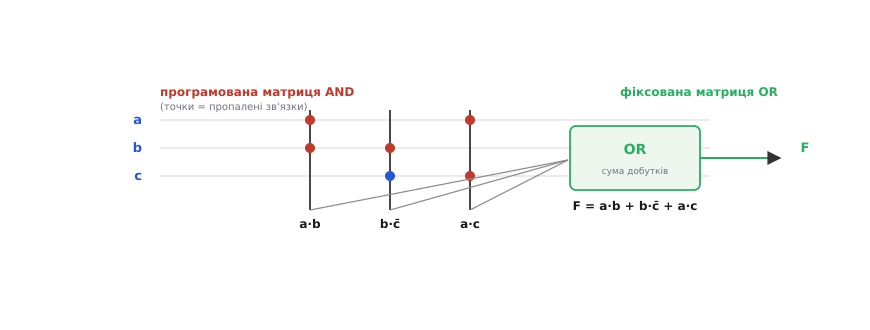
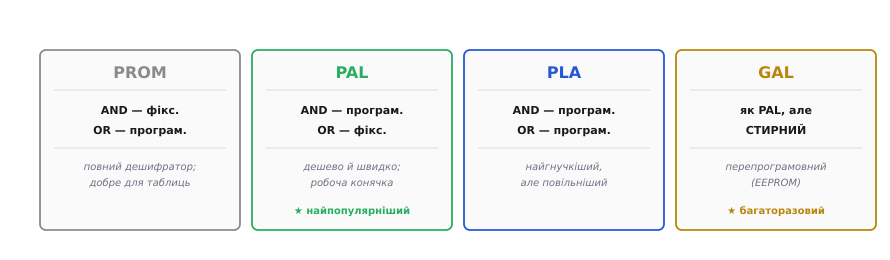
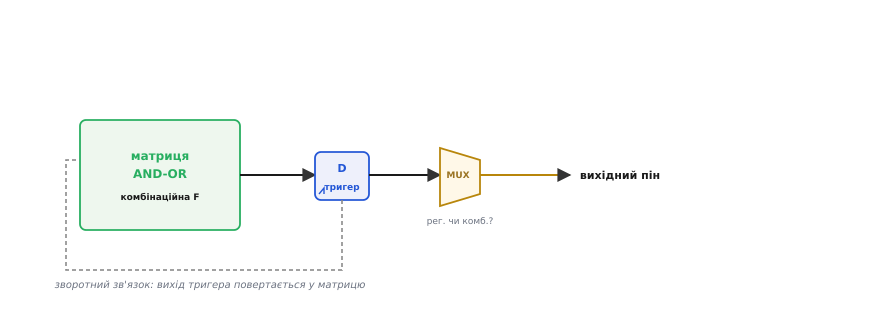
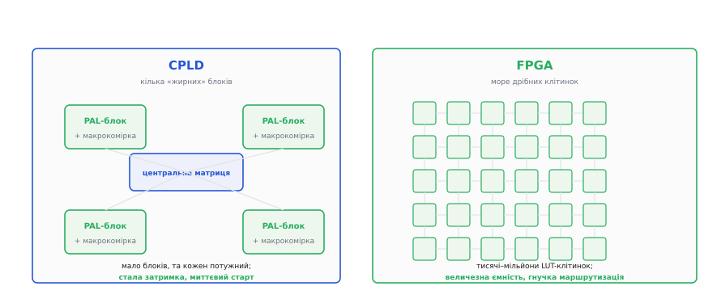
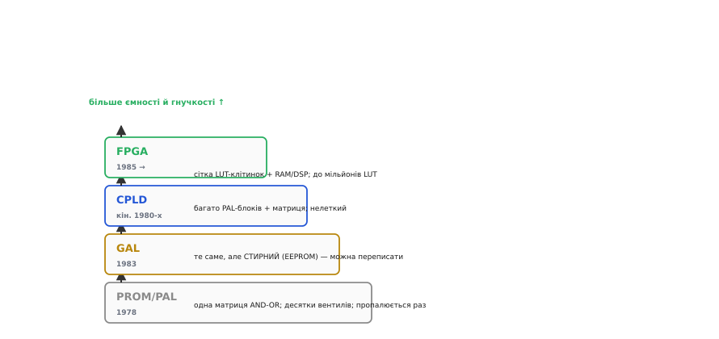

# Від PAL до FPGA

Чип, чию логіку задають уже **після** того, як його виготовили й продали, — звична річ сьогодні, та сама ідея визрівала з кінця 1970-х, від зовсім простих мікросхем до велетенських матриць на мільйони елементів. Кожна сходинка цього шляху народилася як відповідь на конкретну ваду попередньої, і та сама логіка пояснює, чому сучасна FPGA влаштована саме так, а не інакше. До того ж проміжні ланки — PAL, GAL, CPLD — не музейні експонати: вони працюють і досі, там, де велика FPGA була б стрільбою з гармати по горобцях. В основі всього лежить одна думка, що зробила логіку програмованою.

### Найперша ідея: програмована матриця AND-OR

Ключовий факт із [булевої алгебри](book:math/boolean-algebra): **будь-яку** логічну функцію можна записати як **суму добутків** — кілька доданків, з'єднаних OR, де кожен доданок є AND кількох входів (можливо, інвертованих). Хто вміє будувати довільні добутки, а потім їх додавати, той уміє побудувати **будь-яку** функцію. Саме на цьому стоїть найперший масово вдалий програмований чип — **PAL** (англ. *programmable array logic*, програмована матриця логіки).


*Входи (a, b, c та їхні інверсії) йдуть у програмовану матрицю AND: розробник пропалює потрібні з'єднання (червоні точки), задаючи, які входи входять у кожен добуток (a·b, b·c̄, a·c). Далі фіксована матриця OR додає ці добутки в результат F = a·b + b·c̄ + a·c. Так одна мікросхема замінювала жменю окремих корпусів-вентилів серії 74.*

Уся хитрість конструкції — у слові **пропалити**. На заводі чип виходить з усіма можливими з'єднаннями в матриці AND; розробник за допомогою програматора **руйнує зайві** (спершу — буквально пропалюючи плавкі перемички), лишаючи тільки потрібні. Так з однієї універсальної заготовки народжується конкретна схема. Це величезний крок уперед від паяння десятків [окремих вентилів](book:electronics/basic-gates): замість плати, всипаної корпусами 74-ї серії, — одна мікросхема, у яку «вшито» потрібну логіку.

> 🔧 **Навіщо це.** Сама ідея «універсальна заготовка → пропалюю своє» досі лежить в основі всієї програмованої логіки, від копійчаного GAL до FPGA за тисячі доларів. Зрозумієш матрицю AND-OR — і поведінка будь-якого з цих чипів перестане бути магією: усередині все одно сума добутків, просто масштаб різний.

PAL з'явилася не на порожньому місці. Її випустила компанія Monolithic Memories (MMI) у березні 1978 року; провідні інженери розробки — Джон Біркнер (John Birkner) і Хуа-Тай Чуа (H. T. Chua). Їхній задум був прагматичний: наявні на той час програмовані матриці (PLA, FPLA) дозволяли програмувати **обидві** матриці, через що виходили великі, дорогі й повільні. Біркнер і Чуа свідомо **пожертвували гнучкістю заради дешевизни й швидкості** — лишили програмованою тільки матрицю AND. Розрахунок справдився: попри початкові проблеми з виходом придатних кристалів (перші зразки доводилося продавати дорожче за 50 доларів), PAL стала найпопулярнішою з усього сімейства. Та сама PAL — лише найпростіший представник цілого роду, і його родичі відрізняються тим, **яку саме** з двох матриць дозволено програмувати.

### Сімейство простих програмованих логік (SPLD)

Близьку рідню PAL варто розкласти по поличках, бо ці чотири абревіатури плутають найчастіше. Усі вони — **прості програмовані логіки** (англ. *simple programmable logic device*, SPLD), усі побудовані з двох матриць AND і OR, і вся різниця між ними — у тому, котра матриця фіксована, а котра програмована.


*PROM: матриця AND фіксована (повний дешифратор), OR — програмована; добра для таблиць. PAL: AND програмована, OR фіксована — дешево й швидко, тому найпопулярніша. PLA (programmable logic array): обидві матриці програмовані — найгнучкіша, але повільніша. GAL (generic array logic): як PAL, але на стирній пам'яті — її можна перепрограмувати, а не пропалити раз.*

З цього розкладу видно дві лінії розвитку. Перша — **гнучкість проти швидкості**: PLA (англ. *programmable logic array*, програмована матриця логіки) дозволяє програмувати обидві матриці, тож уміщує більше, але зайвий рівень перемикачів її сповільнює; PAL поступається гнучкістю, зате швидша й дешевша — і саме тому стала робочою конячкою. Друга лінія — **багаторазовість**: GAL (англ. *generic array logic*, універсальна матриця логіки) замінила плавкі перемички на стирну пам'ять EEPROM, і чип із «пропали раз і назавжди» перетворився на «перепиши скільки хочеш». GAL з'явилася 1983 року в компанії Lattice Semiconductor — і саме Lattice володіє нині торговими марками і GAL, і PAL. Ця друга ідея — конфігурація, яку можна змінювати, — і є зернятко, з якого виросте вся FPGA.

> 🔧 **Навіщо це.** Розрізняти PAL і GAL доводиться щоразу, коли береш стару чи дешеву дрібну мікросхему: PAL (на плавких перемичках) шиється один раз — помилився, викидай; GAL (на EEPROM) пробачає помилки, бо стирається. На макеті завжди бери стирне; одноразове пали лише в готову серію.

Та щоб рости вшир, програмованій логіці бракувало ще однієї речі — **пам'яті стану**.

### Додаємо стан: макрокомірка з тригером

Сама лиш матриця AND-OR, хоч пропалена, хоч стирна, дає тільки [комбінаційну логіку](book:electronics/combinational-circuits): вихід залежить винятково від поточних входів, минулого вона не пам'ятає. Але справжні цифрові пристрої повні **стану** — лічильники, регістри, [скінченні автомати](book:electronics/finite-state-machines). Тож біля кожного виходу напрошується [тригер](book:electronics/d-flip-flop).


*Макрокомірка = матриця AND-OR (комбінаційна функція) + тригер + мультиплексор, що обирає, віддати назовні реєстровий (через тригер) чи комбінаційний вихід. Зворотний зв'язок повертає вихід тригера назад у матрицю — і це вже дозволяє будувати скінченні автомати: наступний стан рахується з поточного.*

У такій комірці сходяться дві лінії цифрової схемотехніки: комбінаційне обчислення функції і пам'ять стану, разом в одному вузлі. Ця **макрокомірка** (англ. *macrocell*, комірка-«великий осередок») — уже мініатюрна самодостатня цифрова схема: вона і обчислює функцію, і запам'ятовує результат, і може подати його назад на вхід, замикаючи петлю зворотного зв'язку. А петля зворотного зв'язку — це рівно те, що потрібно для [автомата](book:electronics/finite-state-machines): «новий стан = функція(старий стан, входи)». Лишався один крок — **зібрати багато** таких комірок на одному кристалі й навчити їх з'єднуватися між собою.

Тут варто застерегти від хибного враження, ніби PAL і GAL — лише історія. Навпаки: ідея «крихітного програмованого чипа на жменю функцій» жива й сьогодні, просто змінила нішу. Колись такі мікросхеми ставили, щоб **замінити купу [окремих вентилів](book:electronics/basic-gates)** серії 74 однією деталлю; нині ту саму роль грає **клейова логіка** (англ. *glue logic*, «клей» між мікросхемами) — дрібні програмовані чипи, що зшивають між собою більші мікросхеми: підганяють [рівні логічних сімейств](book:electronics/logic-families), формують такти скидання, перемикають сигнали. Сучасні представники цього класу вміщують жменю LUT і тригерів у корпус завбільшки з рисове зерно й коштують копійки — і вони незамінні там, де тягнути велику FPGA було б безглуздо.

> 🔌 Дрібний програмований чип, що «склеює» більші мікросхеми між собою (підганяє рівні, генерує скид, ділить такти), — окремий живий клас деталей із власною конфігураційною пам'яттю на борту. [Як влаштований такий мікроскопічний чип і де його ставлять на платі](root:embedded/pal-to-fpga/comp-greenpak.md).

### Дві дороги: CPLD і FPGA

Коли постало питання «як скласти багато програмованих комірок в один великий чип», знайшлося дві принципово різні відповіді. Перша дала **CPLD**, друга — **FPGA**, і саме друга виявилась здатною вирости до мільйонів елементів.


*CPLD (complex PLD): кілька «жирних» PAL-блоків із макрокомірками, зв'язаних однією центральною матрицею. Блоків небагато, та кожен потужний; затримка передбачувана, чип стартує миттєво. FPGA: море дрібних клітинок у регулярній сітці з гнучкою програмованою маршрутизацією. Клітинок тисячі чи мільйони — ємність на порядки більша.*

Різниця між ними — це різниця між «кількома великими» і «безліччю дрібних». **CPLD** (англ. *complex programmable logic device*, складна програмована логіка) взяв кілька повноцінних PAL-блоків і поєднав їх однією передбачуваною центральною матрицею. Через це CPLD невеликий, зате дуже **прогнозований**: будь-який сигнал проходить однаковий короткий шлях, тож затримка стала й мала, а конфігурація зазвичай зберігається прямо в чипі, тож він готовий до роботи відразу по ввімкненні. **FPGA** (англ. *field-programmable gate array*, матриця вентилів, програмована «в полі», тобто вже у користувача) пішла протилежним шляхом: замість кількох великих блоків — **тисячі крихітних** клітинок, розкиданих сіткою, і складна мережа програмованих проводів між ними. Це коштувало передбачуваності (шлях сигналу тепер залежить від того, як його проклали) і миттєвого старту ([конфігурацію зазвичай доводиться завантажувати ззовні](root:embedded/fpga-flow)), зате відчинило двері до колосальної ємності.

Першу FPGA випустила компанія Xilinx 1985 року — мікросхему XC2064, яку її автори Росс Фрімен (Ross Freeman) і Бернард Вондершміт (Bernard Vonderschmitt) назвали «масивом логічних комірок» (*Logic Cell Array*). За мірками сьогодення вона крихітна: 64 конфігуровані логічні блоки в сітці 8×8, усього кілька тисяч вентилів. Але саме в ній уперше поєдналися дві речі, що визначають FPGA донині: програмовані логічні блоки **і** програмовані з'єднання між ними. Це не було винаходом однієї людини на порожньому місці — ідея конфігурованих матриць визрівала в гурті інженерів і компаній ціле десятиліття; заслуга Xilinx у тому, що вона перша звела дрібнозернисту сітку з гнучкою маршрутизацією в комерційно життєздатний чип. Саме ця архітектура й дала FPGA її масштаб.

### Уся драбина разом

Зведені в один ряд, сходинки оголюють наскрізну логіку розвитку — і заразом показують, що нижні щаблі нікуди не зникли.


*Від PAL/PROM (одна матриця, десятки вентилів, пропалюється раз) через GAL (те саме, але стирне) і CPLD (багато PAL-блоків + матриця, нелеткий) до FPGA (сітка LUT-клітинок із маршрутизацією, блоками RAM і DSP, до мільйонів LUT). Кожен щабель додавав ємності й гнучкості, не міняючи головної ідеї — «логіка, яку задають після випуску чипа».*

Найважливіше з цієї драбини — не верхній щабель, а **незмінність головної ідеї** на всіх щаблях: чип, чию схему визначають **після** виготовлення. Мінялися лише ємність (від десятків вентилів до мільйонів) і зручність (від одноразового пропалювання до миттєвого перезавантаження). І нижні щаблі живі донині, кожен у своїй ніші: PAL і GAL — для дрібної «клейової» логіки між мікросхемами; CPLD — для невеликого керування, де цінні миттєвий старт і стала затримка; FPGA — коли логіки треба багато й паралельно. Вибір між ними — не «старе проти нового», а відповідність масштабу задачі.

### Приклад: де яка сходинка окупається

Щоб ця відповідність стала відчутною, візьмімо конкретну дрібну задачу. Зовнішня кнопка деренчить (контакти дзвенять кілька мілісекунд), а ще треба згенерувати один короткий імпульс скидання на старті плати — типова «клейова» робота, для якої тягнути FPGA безглуздо. Така логіка чудово лягає в один GAL чи дрібну CPLD. От як виглядав би опис цієї поведінки, перш ніж його віддадуть інструменту-синтезатору:

**Кнопка з усуненням деренчання + імпульс скидання на одній макрокомірці (синтаксований опис, стиль C):**

```c
// такт debounce_clk ≈ 1 кГц (один такт = 1 мс)
// btn_raw — «сирий» вхід кнопки; стан тримаємо у двох тригерах макрокомірки
#define STABLE_TICKS 20          // 20 мс тиші → сигнал вважаємо усталеним

static uint8_t  cnt   = 0;       // лічильник стабільності входу (тригери макрокомірки)
static uint8_t  btn   = 0;       // усунений від деренчання стан кнопки
static uint8_t  por   = 1;       // power-on reset, активний відразу після старту
static uint8_t  por_t = 0;       // власний лічильник вікна скидання

void on_debounce_clk(uint8_t btn_raw) {
    // 1) усунення деренчання: рахуємо, доки вхід тримається незмінним
    if (btn_raw == btn) {
        cnt = 0;                  // збігається з виходом — лічити нема чого
    } else if (++cnt >= STABLE_TICKS) {
        btn = btn_raw;            // 20 мс тримався новий рівень — приймаємо його
        cnt = 0;
    }
    // 2) скид: тримати por один «вікно» тактів, тоді зняти назавжди
    if (por && ++por_t > STABLE_TICKS) por = 0;
}
```

Порахуймо ціну рішення. Такт 1 кГц і поріг 20 тактів дають затримку усунення деренчання:

```
t_debounce = STABLE_TICKS / f_clk
           = 20 / 1000 Гц
           = 20 мс          ← людина натиску не помітить, а дзвін контактів уже минув
```

Уся ця схема — це жменя тригерів і трохи комбінаційної логіки навколо них: два лічильники (`cnt`, `por_t`), регістр стану `btn` і прапорець `por`. Вона вільно вміщується в **кілька макрокомірок** дешевого GAL і запускається тієї ж мілісекунди, що й живлення, без зовнішньої флеші. Якби сюди поставили FPGA, 99 % її клітинок простоювали б, а плата ще й чекала б завантаження конфігурації ззовні. FPGA окупає свою складність лише тоді, коли потрібна **велика паралельна логіка** — багато каналів, обробка потоку, складні конвеєри; «склеїти» кнопку зі скиданням — робота для найнижчого щабля драбини.

> 🔧 **Навіщо це.** Уся практична користь знання цього спектра — **брати рівно стільки програмованості, скільки треба, і не платити за надлишок** ні грошима, ні складністю плати, ні зовнішньою флешкою конфігурації. Дрібна «склейка» — GAL чи CPLD; велика паралельна обробка — FPGA. Помилка масштабу в обидва боки коштує однаково дорого: на надмірній FPGA переплачуєш і ускладнюєш плату, на надто дрібному GAL не вміщуєш потрібну логіку.
