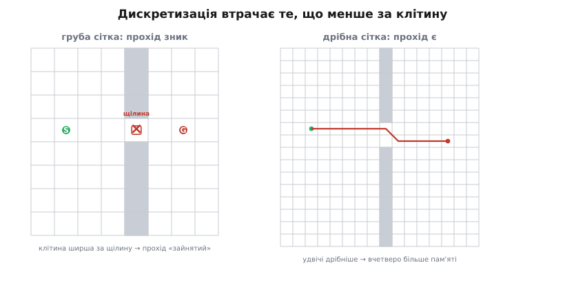
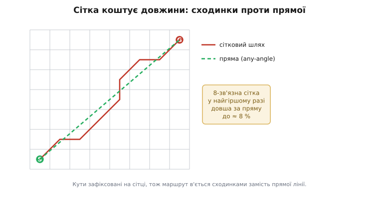

# Планування шляху: сітка і A\* — глибше

<preknowlist>
- [Алгоритм Дейкстри](topic:sf-algorithms/dijkstra) — хвильовий пошук найкоротшого шляху в графі з вагами; A\* — це його прямий нащадок, тож треба тримати в голові, як Дейкстра розкриває вершини за зростанням відстані.
- [Черга з пріоритетом (купа)](topic:sf-algorithms/priority-queue-adt) — структура, що віддає найменший елемент за log-час; на ній тримається фронт A\*, і саме нею меряють ціну пошуку.
</preknowlist>

У базовій частині ми пройшли головну думку: неперервний світ кладуть на **сітку зайнятості**, вільні клітини стають вершинами графа, а A\* — це [Дейкстра](topic:sf-algorithms/dijkstra) зі здогадом **h**, що розкриває клітини за найменшою сумою **f = g + h** і тому тягнеться до цілі, а не розповзається колом. Ми домовилися про чесні ціни ребер (1 ортогонально, √2 навскіс), про допустиму евристику й про те, що на виході A\* дає **план**, який ще треба згладити й вести окремим слідкувачем. Цього досить, щоб написати робочий планувальник.

Але «досить, щоб працювало» і «зрозуміло без дір» — різні речі, і між ними лежить цілий шар, який базова частина свідомо оминула. Він починається з незручного питання, яке легко проґавити за акуратністю формул: **а що ми взагалі втрачаємо, коли кладемо світ на сітку?** Сітка ж не сам світ — це його груба копія. Чи знаходить A\* по сітці справді найкоротший шлях — чи лише найкоротший **із тих, що сітка дозволяє намалювати**? Виявиться, що це геть не одне й те саме, і різниця має ім'я, розмір і наслідки на польоті. А коли розберемося з нею, спливе друге питання, ще практичніше: чому той самий A\*, теоретично «вужчий за Дейкстру», на відкритому полі раптом розкриває **тисячі зайвих клітин** — і як один рядок коду це лікує. І врешті — що робити, коли сітка не тягне, і люди винайшли пошук, який узагалі перестрибує клітини або кладе шлях під довільним кутом. Це і є другий шар: не «як запустити A\*», а **де межі сітки, звідки береться марнотратство навіть у A\*, і чим його доганяють, коли грубого плану замало.**

## Сітка — це брехня, яку світ терпить

Повернімося до найпершого кроку — дискретизації — і подивімося на неї підозріливіше. Ми накрили територію клітинами й про кожну сказали одне: вільна чи зайнята. Здається чесним. Але в цьому «одне слово на клітину» захована втрата, і вона не косметична.

Клітина — це **квадрат землі**, всередині якого може бути будь-що: наскрізь вільно, наполовину стіна, тонка щілина. А ми стискаємо весь цей квадрат в **один біт**. Куди дівається все, що дрібніше за клітину? Пропадає. Якщо крізь квадрат іде прохід, вужчий за сторону клітини, у нас лишається вибір із двох брехень: назвати клітину вільною (і збрехати, що там повний простір, хоча насправді ледь протискається щілина) або зайнятою (і збрехати, що проходу нема, хоча він є). Обидва варіанти — неправда; сітка просто **не має роздільності**, щоб сказати правду.


*Та сама фізична щілина, дві роздільності. Ліворуч клітина ширша за прохід — сітка мусить назвати її зайнятою, і реальний, прохідний коридор для планувальника **зникає**: він шукатиме довгий обхід або взагалі оголосить «шляху нема». Праворуч удвічі дрібніша сітка вміщує щілину у дві клітини, і маршрут крізь неї знаходиться. Ціна за прозорість — квадратична: удвічі дрібніша клітина означає вчетверо більше клітин у пам'яті. Роздільність сітки — це не «що дрібніше, то краще», а межа між «бачу вузький прохід» і «влажу в пам'ять».*

Ось перша річ, яку треба назвати чесно: **сітковий планувальник неповний**. У теорії пошуку алгоритм звуть **повним** (англ. *complete* — «повний, вичерпний»), якщо він гарантовано знаходить розв'язок, коли той існує. Дейкстра на графі — повний: є шлях у графі — знайде. Але A\* по сітці повний лише **щодо сітки**, не щодо світу. Якщо у світі шлях є, а проходить він крізь щілину, вужчу за клітину, — сітка цього шляху не містить, і жоден пошук по ній його не знайде, хоч скільки шукай. Поломка не в A\*, а на кроці **раніше** — у дискретизації, що викинула прохід.

Найбільше, на що можна сподіватися, — це **повнота за роздільністю** (англ. *resolution completeness*): «знайду розв'язок, якщо він існує **на цій роздільності сітки**». Тобто гарантія прив'язана до кроку сітки: дрібнішаєш — бачиш вужчі проходи — наближаєшся до повноти справжньої, але ніколи її не досягаєш, бо клітина завжди скінченна. Це не вада конкретної реалізації, а фундаментальна властивість самого підходу «розбити світ на клітини». Розуміти її — значить не дивуватися, коли планувальник каже «шляху нема» там, де око бачить вузьку щілину: він не бреше, він просто короткозорий рівно на розмір клітини.

> 🔧 **Навіщо це.** Ця межа диктує цілком конкретне інженерне рішення — **крок сітки** — і робить його не «на око», а розрахунком. Спитай: який **найвужчий прохід**, крізь який апарат мусить пролізти? Скажімо, дрон завширшки 0.4 м має проходити ворота 0.6 м. Тоді клітина мусить бути помітно дрібніша за 0.6 м — бо інакше ворота «замуруються» в один зайнятий квадрат; беруть із запасом, скажімо 0.15–0.2 м, щоб прохід гарантовано ліг у кілька вільних клітин. А з іншого боку тисне пам'ять: двір 100×100 м при кроці 0.2 м — це вже 500×500 = 250 тисяч клітин. Крок сітки — це затиснене з двох боків число: знизу — найвужчий прохід, згори — доступна пам'ять і час. Якщо ці межі не сходяться (найвужчий прохід вимагає дрібнішої сітки, ніж влазить у пам'ять), сама сітка — неправильний інструмент для цієї задачі, і час дивитися на графи не-сіткові, до яких ми ще дійдемо.

## Скільки коштує сітка: податок на довжину

Припустімо, роздільність ми взяли досить дрібну, всі проходи видно, шлях знаходиться. Тепер тонше питання: наскільки цей шлях **хороший**? Ми ж домовилися — A\* знаходить найкоротший. Найкоротший — так, але **на сітці**. А сітка дозволяє йти лише вздовж ребер: ортогонально й по діагоналі під 45°. Восьми напрямків, і жодного між ними. Що, як найкоротший шлях у справжньому світі йде під кутом, скажімо, 20°? Сітка такого напряму не має — вона мусить **апроксимувати** його сходинками: трохи навскіс, трохи прямо, знову навскіс. І ця сходинкова ламана **довша** за пряму, яку вона наслідує.

Порахуймо, наскільки. Це варте акуратного виведення, бо число виявиться напрочуд конкретним. Нехай нам треба пройти від клітини до цілі, зсунутої на Δx праворуч і Δy вгору, і хай перешкод узагалі нема — чисте поле. Пряма між центрами має довжину √(Δx² + Δy²) — це фізичний ідеал, коротше не буває. А що дасть 8-зв'язна сітка? Найкоротший сітковий шлях у порожньому полі — це «діагональна відстань»: пройти min(Δx, Δy) кроків навскіс (по √2) і решту |Δx − Δy| прямо (по 1). Розгляньмо найгірший для сітки випадок — коли пряма йде під кутом, найдалі від усіх восьми дозволених напрямів. Це кут рівно посередині між 0° і 45°, тобто **22.5°**.

Візьмімо конкретно: ціль зсунута так, що Δx = 1, а Δy = tan(22.5°) ≈ 0.414. Пряма:

```
пряма    = √(Δx² + Δy²) = √(1² + 0.414²) = √(1 + 0.172) = √1.172 ≈ 1.0824
```

А сітковий шлях мусить покрити цей зсув ходами по осях і діагоналі. Найкоротший спосіб у порожньому полі — min(1, 0.414) = 0.414 діагоналі й (1 − 0.414) = 0.586 прямо (уявімо неперервний масштаб, щоб побачити граничне співвідношення):

```
сітка    = 0.414 · √2 + 0.586 · 1 = 0.586 + 0.586 = 1.172
```

Стоп — це для «дробових» кроків; на реальній цілочисловій сітці шлях буде східчастою апроксимацією тієї самої довжини. Порівняймо:

```
відношення = сітка / пряма = 1.172 / 1.0824 ≈ 1.0824
```

Ось воно, і число красиве не випадково: у найгіршому разі 8-зв'язний сітковий шлях довший за пряму **приблизно на 8%** (точніше, у √(4 − 2√2) ≈ 1.0824 раза). Це не похибка реалізації, не наслідок грубої сітки — це **вбудований податок самої 8-зв'язності**: вона має лише вісім напрямів, і будь-який шлях під «незручним» кутом вона наближає сходинками, що довші за пряму рівно на цей множник. Дрібнішання сітки тут **не рятує**: хоч мільйон клітин — напрямів усе одно вісім, сходинки просто стають дрібнішими, а сумарна довжина лишається на ті ж ~8% більшою. Це усталений результат теорії планування на сітках. *(Статус: усталено — межа ≈1.08 для 8-зв'язної сітки доведена в літературі про any-angle-планування.)*


*Чому сітковий шлях завжди трохи задовгий. Червона ламана — найкоротший шлях 8-зв'язною сіткою: вона мусить триматися восьми дозволених напрямів, тож наближає косий маршрут «драбинкою» з ортогональних і діагональних кроків. Зелена штрихова — фізична пряма між тими самими кінцями, ідеал, коротший за який не буває. Різниця в найгіршому разі сягає ≈8%, і вона **не зникає** від дрібнішання сітки: напрямів усе одно вісім. Саме цей «податок на сітку» породив цілий клас алгоритмів, що кладуть шлях під довільним кутом, — до них ми ще дійдемо.*

Чи можна зменшити податок, додавши сітці напрямів? Так — і це прямий шлях думки, який варто пройти. Замість 8-зв'язності беруть **16-зв'язність**: до восьми напрямів додають ходи «конем» (2 клітини по одній осі, 1 по іншій), даючи проміжні кути ≈26.57°. Найгірший податок падає приблизно до 2.8%. Ще більше напрямів (32-зв'язність тощо) — ще менший податок. Але за кожен новий напрям платять: більше сусідів на клітину — ширший фронт, повільніший пошук, складніша перевірка «чи не перетинає хід стіну» (бо хід конем іде через кілька клітин). Тому в практиці рідко йдуть далі 8, а коли податок на довжину справді муляє — не докидають напрямів у сітку, а **міняють підхід**, кладучи шлях під будь-яким кутом. Це окрема гілка, і ми до неї дійдемо; спершу розберемося з марнотратством, яке жере час **навіть на чесній 8-зв'язній сітці**.

## Плато рівного f: чому «розумний» A\* тупить на відкритому місці

Тут ховається одна з найкорисніших і найменш очевидних речей про A\* — така, що її не видно з формул і про неї мовчить більшість перших знайомств, а вона вирішує, чи буде планувальник швидким. Почнімо зі спостереження, яке спантеличує кожного, хто вперше візуалізує роботу A\* на порожньому полі.

Ми ж казали: A\* вужчий за Дейкстру, він тягнеться до цілі витягнутим еліпсом, а не колом. Запусти його на **відкритій** сітці без перешкод — і побачиш дещо дивне: він розкриває не вузьку смужку до цілі, а **величезний трикутник** клітин, ледь не пів-поля. Начебто «зрячий» пошук поводиться майже як сліпий Дейкстра. Чому?

Причина — у **нічиїх за f**. Згадаймо, що A\* на кожному кроці бере клітину з найменшим f. А що, коли таких клітин **багато** — десятки, сотні з **однаковим** найменшим f? Тоді A\* мусить розкрити їх **усі** (він не знає, яка з них веде до цілі коротше — за f вони рівні), перш ніж рушити до клітин із більшим f. І на порожньому полі таких «однакових» клітин — море.

Розберімо чому — на числах. Візьмімо порожнє поле, старт і ціль на одній горизонталі. Для клітини на діагональному ході g росте на √2, а h (діагональна відстань до цілі) на √2 **спадає** — тож f = g + h лишається **тим самим**. Уздовж будь-якого «сходового» маршруту, що чесно рухається до цілі, f **не змінюється взагалі**: скільки додається до g, стільки віднімається від h. Виходить ціла **область** клітин, крізь яку проходить якийсь оптимальний шлях, і **всі вони мають однакове, найменше f**. Це і є **плато** (фр. *plateau* — «пласке підвищення»): рівнина рівного f. A\*, чесно беручи «найменше f», змушений облазити все плато, бо формально всі ці клітини рівноперспективні. Його «зір» не бреше — просто на порожньому полі перспективних напрямів **однаково багато**, і евристика не має чим їх розрізнити.


*Одна й та сама задача на порожньому полі, з розбиттям нічиїх і без. Ліворуч (без розбиття) усі клітини нижнього трикутника мають **однакове** найменше f — бо на діагональному ході, що йде до цілі, приріст g гасить спад h. A\* мусить розкрити все це плато, перш ніж торкнеться цілі: «зрячий» пошук марнує майже стільки ж, скільки сліпий Дейкстра. Праворуч крихітний **нахил** евристики (помножити h на 1+p) робить дальші клітини плато мікроскопічно дорожчими за ближчі до прямої S–G — нічия зникає, і пошук стискається у вузьку смугу вздовж лінії до цілі. Один множник — і оглянутих клітин у рази менше.*

Тепер — лік, і він чудовий у своїй дешевизні. Плато існує тому, що клітини **точно** рівні за f. Отже, треба цю рівність **ледь-ледь** порушити — так, щоб серед рівних A\* волів ті, що ближчі до прямої лінії «старт → ціль», а решту чіпав в останню чергу. Тоді плато перестане бути пласким: у ньому з'явиться ледь помітний **нахил** до цілі, і пошук покотиться цим нахилом вузькою смугою, а не розтечеться всім трикутником. Найпоширеніший прийом — **нахилити евристику**, домноживши h на дрібку, трішки більшу за одиницю:

```
h ← h · (1 + p),    де p — крихітне число
```

Наскільки крихітне? Тут точний рецепт: p має бути **меншим за** відношення «найдешевший крок / найдовший можливий шлях». Формально:

```
p < ціна_найдешевшого_кроку / очікувана_макс_довжина_шляху
```

Для сітки, де найдешевший крок коштує 1, а шлях не довший за кілька тисяч клітин, беруть p ≈ 1/1000. Чому саме така межа — не примха, а тонкий баланс. Домноживши h на (1 + p), ми зробили евристику трішки **завищеною** — а завищена евристика, як ми знаємо з [доведення допустимості](root:embedded/path-planning-grid/math-heuristic-admissibility.md), загрожує оптимальності. Але завищення таке мале, що на будь-якому реальному шляху сумарна «брехня» p·h менша за різницю в одну ціну кроку — тобто не здатна переплутати два шляхи **різної** довжини, лише розбиває нічию між шляхами **однакової**. Оптимальність зберігається на практиці (розв'язок або точно оптимальний, або відрізняється менш ніж на один крок), а плато зникає. Крихітний обман, що коштує майже нічого й прискорює пошук у рази.

Є й **точніший** спосіб розбити нічию, який дає гарніші, «пряміші» шляхи, — за **векторним добутком**. Ідея: серед клітин рівного f воліти ту, що лежить ближче до прямої від старту до цілі. Наскільки клітина відхилилася вбік від цієї прямої, міряє модуль векторного добутку двох векторів — «старт → ціль» і «клітина → ціль»:

```
dx1 = |x_клітини − x_цілі|,   dy1 = |y_клітини − y_цілі|
dx2 = |x_старту  − x_цілі|,   dy2 = |y_старту  − y_цілі|
cross = |dx1 · dy2 − dx2 · dy1|
h ← h + cross · 0.001
```

Векторний добуток `cross` дорівнює нулю, коли клітина точно на прямій «старт → ціль», і росте, коли вона збочує. Додавши крихітну частку `cross` до h, ми робимо збочені клітини мікроскопічно дорожчими — і A\* серед рівних воліє ті, що тримаються прямої. На відкритому полі це дає майже ідеально прямий пошук; біля перешкод шлях виходить трохи «дивний» (він тягнеться до теоретичної прямої, хоч її й перекриває стіна), зате плато знову-таки розбите. *(Статус: усталено — обидва прийоми, множник (1+p) і векторний нахил, — класика практичного A\*, задокументована в літературі про ігровий пошук; ретельний виклад — у розборі Амíта Пателя зі Стенфорда.)*

> 🔧 **Навіщо це.** Розбиття нічиїх — це, мабуть, **найбільший приріст швидкості за найменший код** у всьому A\*: два-три рядки, і пошук на відкритій місцевості прискорюється в рази, бо перестає облазити плато. На бортовому комп'ютері, де кожна розкрита клітина — це такти, яких обмаль, різниця між «оглянув 400 клітин» і «оглянув 40» вирішує, чи вкладеться планувальник у такт. І це саме той випадок, коли **не знати** про механізм — дорого: новачок бачить, що A\* «чомусь повільний і майже як Дейкстра», і починає оптимізувати купу, кеш, арифметику — а справжня причина в тому, що фронт роздувається плато, і лікується вона одним множником у евристиці. Спершу розбий нічиї, тоді оптимізуй решту.

## Форма еліпса: скільки насправді коштує пошук

Ми весь час малюємо A\* як «витягнутий еліпс», а Дейкстру як «коло», і кажемо: що точніша евристика, то вужчий еліпс. Пора підвести під цю картинку число — бо саме воно каже, чи встигне планувальник, і саме воно пояснює, звідки взялося плато з попереднього розділу.

Ключова величина — **скільки клітин A\* розкриє**, перш ніж дійде до цілі. Для Дейкстри відповідь проста й безжальна: він розкриває **всі** клітини, ближчі до старту за ціль. Якщо ціль на відстані D, а поле відкрите, це круг радіуса D — порядку **π·D²** клітин. Квадратично від відстані: удвічі далі ціль — учетверо більше роботи. Ось чому Дейкстра на великому полі нестерпний.

A\* із **ідеальною** евристикою (яка точно знає справжню відстань до цілі, враховуючи перешкоди) розкрив би лише клітини **на самому оптимальному шляху** — порядку **D** клітин, лінійно. Це недосяжний ідеал (щоб знати точну відстань, треба вже розв'язати задачу), але він задає нижню межу. Реальна евристика — десь між цими двома полюсами, і **де саме** — визначає, ближче пошук до лінійного A\* чи до квадратичного Дейкстри.


*Скільки клітин розкрито — це і є ціна пошуку, і форма області прямо залежить від сили евристики. Сіре коло (h = 0) — Дейкстра: розкриває все, ближче за ціль, порядку π·D² клітин. Зелений еліпс — евклідова евристика: занижує сильніше, тож ширший. Червоний вузький еліпс — точна діагональна: найсильніша чесна оцінка для 8-зв'язності, найвужчий пошук. Що ближче h до правди знизу, то вужчий еліпс і менше клітин — але жодна допустима евристика не звузить його до самої лінії, бо для цього треба вже знати відповідь. Плато з попереднього розділу — це якраз «товщина» еліпса, роздута нічиїми; розбиття нічиїх стискає її до смуги.*

Тепер видно зв'язок із плато. «Товщина» еліпса — це і є кількість клітин рівного f, яку A\* мусить облазити на кожному «фронті». Без розбиття нічиїх ця товщина на відкритому полі величезна (все плато), і еліпс роздувається майже до кола Дейкстри. Розбиття нічиїх стискає товщину до смуги — і еліпс стає по-справжньому вузьким. Тобто **точність евристики** й **розбиття нічиїх** — це дві незалежні ручки, що обидві керують шириною еліпса: перша визначає, наскільки він **міг би** звузитися, друга — чи справді він звужується, чи роздувається плато.

Є й другий бік складності — **пам'ять**, і він на мікроконтролері часто болючіший за час. A\* тримає у фронті **всі** відкриті клітини одночасно, і на великому полі фронт росте як периметр еліпса — порядку D клітин у купі, плюс масиви g і came_from на **всю** сітку. Саме тому наївний A\* «падає» на сітці 400×400 не тому, що довго рахує, а тому, що йому **нема куди покласти** мільйони чисел; як цю пам'ять тиснуть — стиском мапи до біта, цілими замість float, зберіганням лише відвіданих клітин — розібрано в [реалізації A\* на сітці](root:embedded/path-planning-grid/proj-a-star-grid.md). Тут важлива сама межа: час A\* — приблизно N·log N за числом розкритих клітин, а пам'ять — лінійна за розміром сітки, і на бортовому залізі впирається зазвичай саме пам'ять.

## Коли сітка не тягне: інші способи зробити граф

Досі ми лагодили A\* **на сітці**. Але сама сітка — лише один спосіб перетворити простір на граф, і не завжди найкращий. Варто побачити альтернативи, бо кожна лікує якусь ваду сітки, і вибір «на чому шукати» часто важливіший за вибір «як шукати». Три підходи заслуговують розуміння.

**Граф видимості** (англ. *visibility graph*). Замість дрібнити весь простір на клітини, беруть за вершини лише **кути перешкод** (плюс старт і ціль) і з'єднують ребром дві вершини, **якщо між ними пряма не перетинає жодної перешкоди** — тобто вони «бачать» одна одну. Найкоротший шлях у такому графі — це **справжній** найкоротший шлях у неперервному світі, без сіткового податку: він іде прямими відрізками від кута до кута, точно як натягнута навколо перешкод мотузка. Краса в оптимальності; біда — у ціні побудови: перевірити видимість для кожної пари з V вершин — це порядку V² перевірок, кожна ще й пробігає перешкоди, тож на купі кутастих перешкод граф видимості будується повільно й розростається. Він блищить там, де перешкод **мало** й вони **многокутні** (кілька будівель на відкритому полі), і задихається там, де світ — суцільний лабіринт.

**Навігаційна сітка** (англ. *navigation mesh*, скорочено *navmesh*). Компроміс: вільний простір розбивають не на дрібні квадрати, а на **великі опуклі многокутники** (трикутники чи чотирикутники), кожен з яких — суцільна прохідна ділянка. Вершини графа — ці многокутники, ребра — спільні сторони між сусідніми. Плоский коридор, що на сітці зайняв би тисячу клітин, у navmesh — **один** трикутник. Пошук по такому графу з жменьки многокутників блискавичний, а всередині кожного апарат може йти по прямій. Це стандарт у відеоіграх і в наземній робототехніці по відомій, статичній мапі; ціна — навмеш треба **збудувати** заздалегідь (розбити простір на опуклі шматки — окрема, нетривіальна геометрична задача), тож він погано пасує до світу, що часто змінюється.

**Ґратка станів** (англ. *state lattice*). Досі вершина графа була **точкою** (клітиною). Але апарат — не точка: він має орієнтацію, а машина чи ровер ще й **не вміє повернути на місці** — має мінімальний радіус розвороту. Сітковий шлях, що робить прямий кут, для такого апарата **фізично нездійсненний**. Ґратка станів це лікує: вершина — вже не (x, y), а (x, y, кут); ребра — не «крок у сусідню клітину», а короткі **здійсненні дуги руху** (англ. *motion primitives*), що враховують радіус розвороту. A\* по такій ґратці видає шлях, яким апарат справді **може** проїхати, без нездійсненних зламів. Ціна — граф багатовимірний (додався кут) і важчий, а евристику для нього складніше придумати. Це підхід для машин і роверів із кінематичними обмеженнями, де сітковий шлях довелося б жорстко переробляти під радіус розвороту.

Спільна думка за всіма трьома — одна, і вона важливіша за деталі кожного: **A\* — це пошук по графу, а який граф йому підсунути — окреме рішення.** Сітка проста й універсальна, але платить податком на довжину, роздувається в пам'яті й не знає про радіус розвороту. Граф видимості дає оптимум на рідких перешкодах; navmesh — швидкість на статичній мапі; ґратка станів — здійсненність для кінематики. Той самий A\* працює на всіх — змінюється лише те, **що** для нього вершина й ребро.

## Any-angle: полагодити податок прямо в пошуку

Граф видимості дає прямі шляхи, але дорого будується. А що, як лишитися на дешевій сітці, але дозволити шляху **зрізати кути під довільним кутом** прямо під час пошуку? Цю ідею втілює родина **any-angle**-планувальників (англ. *any-angle* — «під будь-яким кутом»), і найвідоміший із них — **Theta\*** (тета-зірка).

Theta\* — це майже той самий A\*, з однією добавкою в момент розкриття сусіда. Звичайний A\* завжди приписує сусідові батька-**попередню клітину** (came_from вказує на клітину, з якої прийшли). Theta\* робить хитріший крок: розкриваючи сусіда s поточної клітини, він питає — а чи **видно** сусіда s прямо з **діда** (батька поточної клітини)? Якщо між дідом і s пряма лінія не перетинає перешкод, то навіщо йти ламаною «дід → поточна → s», коли можна прямо «дід → s»? Theta\* тоді ставить сусідові батьком **діда**, а не поточну клітину, і рахує g уздовж **прямої** дід→s, а не вздовж сітки. Так шлях поступово «натягується» в прямі відрізки під довільним кутом, зрізаючи сходинки, — і на виході виходить майже той самий гладкий шлях, що дав би граф видимості, але без дорогої попередньої побудови графа.

Механізм видимості тут — той самий, що ми вже зустрічали в базовій частині як заборону **зрізати кут** упритул до стіни, тільки вивернутий: там ми **забороняли** діагональ крізь ріг двох стін, тут ми **дозволяємо** пряму, лише якщо вона стін не черкає. Перевірка «чи видно A з B» — це прохід по клітинах уздовж відрізка A–B (алгоритм проведення лінії на сітці) з питанням, чи всі вони вільні. Ціна Theta\* проти A\* — саме ці перевірки видимості на кожному розкритті; виграш — шлях коротший на ті самі ~8% податку й без сходинок, тобто його не треба потім згладжувати. Коли гладкість шляху важлива сама по собі (а для апарата з інерцією вона важлива завжди), Theta\* часто вартий своєї ціни. *(Статус: усталено — Theta\* уведено 2007 року; автори Алекс Неш, Кенні Деніел, Свен Кеніг і Аріель Фелнер, конференція AAAI.)*

## Jump Point Search: перестрибнути через нудьгу

Плато навчило нас, що на відкритому полі A\* робить купу **зайвої** роботи. Розбиття нічиїх пригладжує це евристикою — але є радикальніший спосіб, що б'є в саму причину: **симетрію шляхів**. І він не жертвує ані краплею оптимальності.

Ось у чому суть симетрії. На відкритій ділянці 8-зв'язної сітки між двома точками існує **безліч** найкоротших шляхів однакової довжини — вони відрізняються лише **порядком** тих самих кроків. Пройти «діагональ, потім прямо» чи «прямо, потім діагональ» — та сама довжина, різні ламані. A\* сумлінно розкриває клітини **всіх** цих рівноцінних варіантів (це і є плато під іншим кутом зору), хоча всі вони ведуть в одне місце тим самим коштом. Марнується робота на розрізнення того, що розрізняти не варто.

**Jump Point Search** (JPS, «пошук стрибкових точок») прибирає цю симетрію під корінь. Замість розкривати кожну клітину по дорозі, JPS зі стартової клітини **мчить** у кожному напрямі, **не зупиняючись** на проміжних клітинах, доки не наткнеться на клітину, що справді **щось міняє**, — так звану **стрибкову точку** (англ. *jump point*). Стрибкова точка — це там, де біля шляху виринає перешкода, що змушує розглянути поворот; на чистому просторі таких точок нема, тож JPS проскакує довгі прямі й діагоналі **одним махом**, кладучи в чергу лише рідкі точки повороту, а не кожну клітину. Результат: на відкритих мапах JPS оглядає **на порядок** менше вузлів, ніж A\*, і працює в рази швидше — при цьому знаходить **той самий оптимальний** шлях, бо перестрибує лише те, що доведено байдуже.


*Та сама задача, два обсяги роботи. Ліворуч звичайний A\* розкриває широку смугу клітин навколо шляху — усі симетричні перестановки тих самих кроків (плато під іншим кутом зору). Праворуч JPS: він не зупиняється на проміжних клітинах, а «перестрибує» довгі прямі й діагоналі одним рухом, кладучи в чергу лише **стрибкові точки** (червоні кружечки) — там, де перешкода поблизу справді змушує розглянути поворот. На відкритому полі таких точок одиниці, тож роботи на порядок менше — а шлях виходить **той самий** оптимальний.*

Чому JPS має право перестрибувати клітини й **не втратити** оптимальний шлях — це не очевидно й тримається на акуратних правилах, які клітини можна пропустити, а які — обов'язково розглянути (їх звуть «вимушеними сусідами»). Ці правила виводяться саме з симетрії 8-зв'язної сітки й доведення, що пропущені клітини нічого не додають; повний розбір — коли клітина стає стрибковою точкою, звідки беруться вимушені сусіди й чому пропуск решти безпечний — у вставці [як Jump Point Search перестрибує клітини](root:embedded/path-planning-grid/math-jps-symmetry.md). Тут головне — думка: JPS не хитріше **шукає**, він **не витрачається** на розрізнення однакового. Обмеження теж варто назвати чесно: JPS живе саме на **рівномірній 8-зв'язній сітці** (усі клітини однакового розміру, ціни 1 і √2); на графі з довільними вагами, на navmesh чи ґратці станів його трюк не працює — там немає тієї симетрії, яку він визискує. *(Статус: усталено — JPS уведено 2011 року; автори Деніел Гарабор і Албан Ґрастьєн, конференція AAAI, праця «Online Graph Pruning for Pathfinding on Grid Maps».)*

## Коли мапа змінюється: не рахувати заново, а лагодити

Останній і найпрактичніший шар — про **час життя плану**. У базовій частині ми назвали правило: A\* — повільний глобальний планувальник, що рахує рідко по відомій мапі, а від раптових перешкод боронить швидкий локальний контур. Але між «спланував раз назавжди» і «реагую рефлексом» є середина, яку варто зрозуміти: що робити, коли мапа **змінилася не катастрофічно, але суттєво** — відкрилися чи закрилися двері, з'явилася нова стіна, — і план треба **оновити**, але рахувати геть заново — задорого?

Наївна відповідь — «перезапустити A\* по новій мапі» — марнотратна, і легко побачити чому. Уяви велике поле, довгий спланований маршрут, і одну нову перешкоду, що перекрила його десь **посередині**. Уся частина плану **до** перешкоди лишилася чинною — навіщо її перераховувати? Змінилося лише те, що **за** нею. Але A\* цього не знає: він викидає весь попередній розрахунок і повзе полем від старту наново, повторюючи тисячі розкриттів, з яких змінилася жменька. На бортовому комп'ютері, де перепланування треба робити **часто** (мапа оновлюється щокадру з давачів), це неприпустиме розкошування.

Розв'язок — **інкрементний** пошук (англ. *incremental* — «нарощувальний»): не рахувати заново, а **полагодити** попередній результат, торкнувшись лише тих клітин, чиї відстані справді змінилися через нову перешкоду. Класика тут — родина **D\*** («ді-зірка», від *dynamic A\**) і її сучасний, простіший нащадок **D\* Lite**. Ідея, коли її вимовити, майже очевидна: коли перешкода змінює прохідність кількох клітин, «псуються» лише відстані клітин, що залежали від зміненого місця; D\* Lite знаходить цю **заражену** ділянку й перераховує **тільки** її, лишаючи решту карти відстаней недоторканою. Часто це в рази, а то й на порядки швидше за повний перезапуск — бо зачеплена ділянка зазвичай мала проти всієї мапи.


*Три відповіді на «план застарів». Сірий штриховий — старий глобальний маршрут A\* по відомій мапі. Жовтогаряча клітина з окликом — перешкода, що виникла вже в польоті, просто на шляху. Найдешевша реакція «зараз» — червоний локальний **об'їзд**: швидкий реактивний контур відхиляє апарат убік і повертає на маршрут, не чіпаючи глобального плану. А коли зміна суттєва й треба оновити **весь** план, розумно не рахувати його заново, а **інкрементно** полагодити зачеплену частину — це і робить D\* Lite, перераховуючи лише «заражену» ділянку карти відстаней, а не все поле.*

Складімо повну ієрархію реакцій на зміну — це і є практична архітектура навігації, і тепер вона має всі три поверхи, а не два. **Найшвидший, реактивний контур** ([обхід перешкод](root:embedded/obstacle-avoidance), наступний крок розділу) працює щотакту по свіжих давачах і **об'їжджає** те, що виринуло просто перед носом, не чіпаючи плану взагалі. **Середній, інкрементний** (D\* Lite) вмикається, коли зміна на мапі суттєва, але не тотальна: **лагодить** глобальний план, торкаючись лише зачепленого. **Найповільніший, повний** (звичайний A\* з нуля) потрібен лише коли мапа змінилася кардинально або планувальник стартує вперше. Кожен наступний поверх дорожчий і рідший; разом вони дають апарат, що і миттєво ухиляється від несподіванки, і розумно оновлює стратегію, не перераховуючи щоразу півсвіту. *(Статус: усталено — D\* Lite уведено 2002 року; автори Свен Кеніг і Максим Ліхачов, конференція AAAI.)*

> 🔧 **Навіщо це.** Ця триповерхова модель — не академічна класифікація, а прямий припис, як розкласти обчислення на бортовому комп'ютері, щоб він **устигав**. Помилка новачка — тримати лише один поверх: або перезапускати повний A\* щокадру (і не вкладатися в такт, бо повний пошук по великій сітці задовгий), або покладатися лише на реактивний об'їзд (і застрягати в глухих кутах, бо рефлекс не бачить далі носа й не має стратегії). Правильно — **розкласти за частотою й масштабом зміни**: рефлекс щотакту для найближчого, інкрементне перепланування зрідка для суттєвих змін мапи, повний A\* дуже рідко для старту й катастроф. Розуміти, який поверх коли вмикається, — значить будувати навігацію, що і швидка, і не тупа; а не знати цього поділу — значить приректи апарат або на запізнення, або на дурість.

## Підсумок нитки

Базова частина дала робочий A\* на сітці; цей другий шар показав, **де його межі й чим їх розсувають**. Сітка — не сам світ, а його груба, брехлива копія: вона стискає квадрат землі в один біт, тож губить усе, що дрібніше за клітину, і робить планувальник **повним лише за роздільністю** — крок сітки затиснений знизу найвужчим проходом, згори пам'яттю. Навіть коли шлях знайдено, 8-зв'язна сітка бере **податок на довжину** — до ≈8% проти прямої, і цей податок не зникає від дрібнішання, бо напрямів усе одно вісім. На відкритому полі A\* марнує роботу на **плато рівного f** — безлічі рівноцінних клітин, де приріст g гасить спад h; **розбиття нічиїх** (нахил h на 1+p чи векторний добуток) стискає роздутий еліпс у вузьку смугу майже задарма. Ширина цього еліпса — і є ціна пошуку: від π·D² у сліпого Дейкстри до ≈D в ідеалі, а реально між ними, тим вужче, чим точніша евристика й чим краще розбито нічиї. Коли сама сітка не тягне, міняють **граф**, а не пошук: граф видимості дає прямі шляхи на рідких перешкодах, navmesh — швидкість на статичній мапі, ґратка станів — здійсненність для апарата з радіусом розвороту. Податок на довжину лагодять прямо в пошуку — **Theta\*** натягує шлях у прямі під довільним кутом; марнотратство на симетрії вбиває **JPS**, перестрибуючи все доведено байдуже без втрати оптимуму. А коли мапа змінюється, план не рахують заново, а **інкрементно лагодять** (D\* Lite), і разом із реактивним об'їздом та повним A\* це складається у триповерхову навігацію: рефлекс щотакту, інкрементне перепланування зрідка, повний пошук дуже рідко. A\* лишається серцем усього цього — але тепер видно і його межі, і той арсенал, яким їх розсувають, коли грубого плану по сітці замало.
