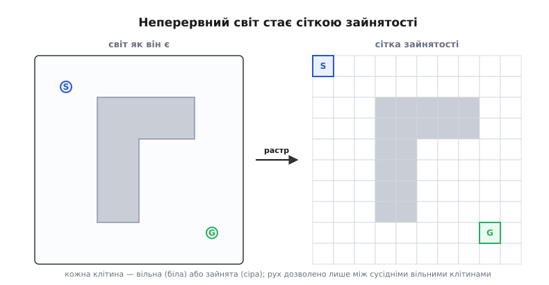
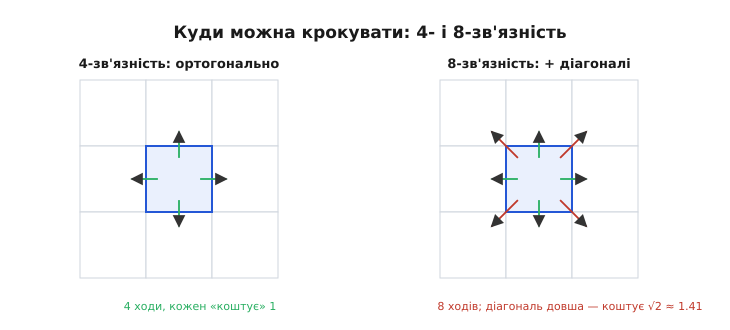
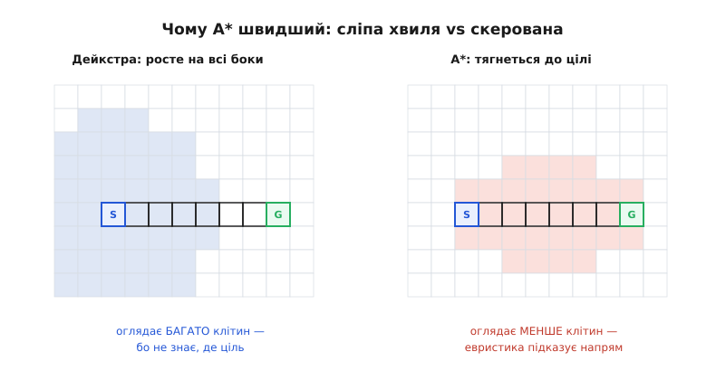
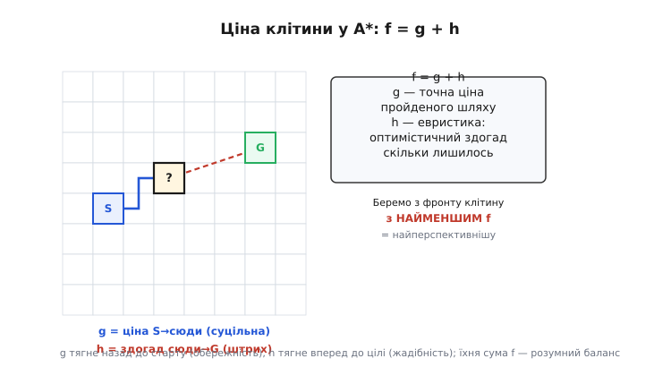
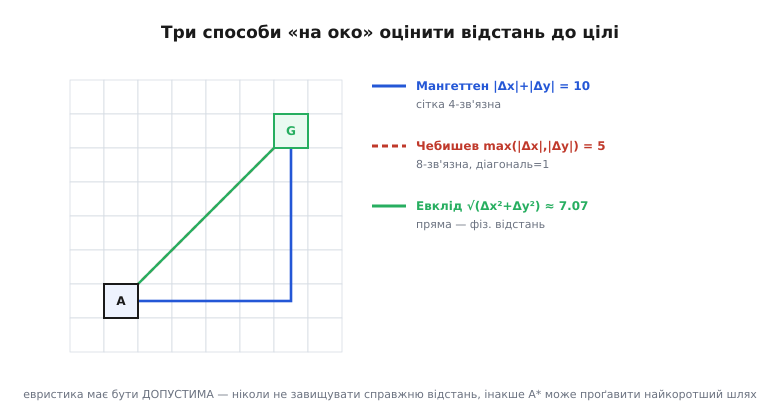

# Планування шляху: сітка і A*

У [проєктуванні місії](root:embedded/mission-planning) ми клали вейпойнти **самі**, дивлячись на мапу згори: онде злітний майданчик, онде забудова, проведімо лінію між ними в обхід. Людина за екраном бачить усе поле відразу й планує розумом. Але що робить апарат, коли ми кажемо йому не «лети точками 1-2-3», а «дістанься **отуди**, а як саме — розберися сам»? У нього немає ока, що охоплює карту згори. У нього є координата, куди треба, координата, де він зараз, і знання про те, де стоять перешкоди. З цього треба **народити маршрут** — послідовність проміжних точок, якими можна пройти, не влетівши в стіну.

Ми вже маємо інструмент, що вміє шукати найдешевший шлях, — [алгоритм Дейкстри](topic:algorithms/dijkstra), який ми проходили попереднім кроком: він поволі, чесно, «хвилею» розповзається графом від старту й гарантовано знаходить найкоротший маршрут до будь-якої вершини. Здавалося б, готова відповідь. Але між «алгоритм на графі» і «дрон, що облітає будинок» лежать два запитання, на які Дейкстра сам не відповідає. **Перше:** де тут граф? Світ навколо — неперервний, у ньому нескінченно багато точок, а Дейкстра працює з вершинами й ребрами. **Друге:** Дейкстра шукає **на всі боки одразу**, не знаючи, де ціль, — а це марнування, коли ціль відома наперед. Цей крок відповідає на обидва: спершу перетворимо простір на граф-**сітку**, а тоді навчимо пошук **тягнутися до цілі**, а не розповзатися наосліп. Друга частина — це і є алгоритм **A\***.

### Світ треба спочатку розкреслити на клітини

Перешкоди в реальному світі мають довільну форму: стіна під кутом, дерево, кут будівлі. Комп'ютер не вміє «шукати шлях у довільній формі» — йому потрібні дискретні варіанти, серед яких перебирати. Тому перший крок будь-якого планувальника — **дискретизація** (лат. *discretus* — «розділений, окремий»): розбити неперервний простір на скінченну кількість шматочків, кожен з яких або **вільний**, або **зайнятий**.

Найпростіший і найпоширеніший спосіб — накрити територію рівномірною **сіткою** (англ. *grid* — «ґратка, сітка») і про кожну клітину сказати одну-єдину річ: чи можна там бути. Таку структуру звуть **сіткою зайнятості** (англ. *occupancy grid*, від *occupancy* — «заповненість, зайнятість»): двовимірний масив, де кожна клітина каже, зайнятий цей клаптик землі перешкодою чи вільний для проходу.


*Неперервний світ ліворуч має перешкоду довільної форми — з нею алгоритм працювати не вміє. Праворуч ту саму територію накрито сіткою: кожна клітина стала або вільною (біла), або зайнятою (сіра). Тепер «знайти шлях» означає «знайти ланцюжок сусідніх вільних клітин від S до G» — а це вже задача на графі, яку ми вміємо розв'язувати. Ціною за простоту стала грубість: сітка не знає, що діється всередині клітини, тож роздільність плану дорівнює розміру клітини.*

Ось де ховається граф, якого бракувало Дейкстрі. **Кожна вільна клітина — це вершина.** **Ребро** з'єднує дві сусідні вільні клітини: якщо з клітини можна крокнути в сусідню, між ними є перехід. Зайняті клітини у граф просто не входять — у них немає ребер, туди не потрапиш. Задача «пройти світом від старту до цілі» перетворилася на знайому: **знайти шлях у графі від однієї вершини до іншої**. Дискретизація — це міст від фізичного простору до алгоритму.

> 🔧 **Навіщо це.** Сітка зайнятості — не абстракція з підручника, а те, що реально живе в пам'яті наземної станції чи бортового комп'ютера ровера. Мапу будують із давачів — лідара, камери глибини, сонарів, — і кожен вимір «підпалює» клітини, куди впав промінь у перешкоду. Розмір клітини — це прямий інженерний компроміс: дрібні клітини дають точний план, але сітка 1000×1000 — це мільйон вершин, і пошук по ній забирає час і пам'ять, яких у мікроконтролера обмаль. Груба сітка шукає миттєво, але «не бачить» вузьких проходів менших за клітину. Вибір кроку сітки — перше рішення, що визначає, чи встигне планувальник відпрацювати між кадрами.

### Скільки в клітини сусідів — і чому це важливо

Сказали «сусідня клітина» — а скільки їх, сусідніх? Відповідь не одна, і від неї залежить, які маршрути взагалі можливі. Найпростіший вибір — **4-зв'язність** (англ. *4-connectivity*): сусідами вважаємо лише чотири клітини, що межують **сторонами** — вгору, вниз, ліворуч, праворуч. Тоді апарат ходить, як тура в шахах: лише ортогонально, ніяких навскіс.

Але людина (і дрон) чудово рухається по діагоналі. Тож частіше беруть **8-зв'язність**: до чотирьох ортогональних сусідів додають чотири **діагональні** — по кутах. Тепер із клітини є вісім ходів, і маршрут може йти навскіс, а не лише сходинками.


*Ліворуч 4-зв'язність: чотири ходи, кожен між центрами сусідніх клітин коштує однаково — умовну «1». Праворуч 8-зв'язність: додаються діагоналі. Тут криється тонкість, яку легко проґавити: діагональний хід **довший** за ортогональний. Якщо сторона клітини — 1, то діагональ — √2 ≈ 1.41 (теорема Піфагора для катетів 1 і 1). Тому не можна казати «будь-який хід коштує 1»: ортогональний коштує 1, діагональний — 1.41, інакше алгоритм вважатиме навскісний шлях таким самим дешевим, як прямий, і рахуватиме відстані неправильно.*

Ця різниця в ціні ходу — не педантизм, а суть коректності. Уяви, що ми полінувалися й дали діагоналі теж ціну 1. Тоді, щоб дістатися клітини на 5 праворуч і 5 вгору, алгоритм побачить шлях «5 діагональних ходів» ціною 5 — і вважатиме його таким самим, як 10 ортогональних ходів ціною 10, хоча фізично діагональний коротший. Гірше: він рахуватиме реальну довжину неправильно й може обрати не той маршрут. Тому **ціна ребра має відповідати фізичній довжині кроку**: 1 для ортогонального сусіда, √2 для діагонального. Це та сама «вага ребра», що й у Дейкстри, — просто тепер ми знаємо, звідки вона береться.

### Дейкстра шукає наосліп — а ми знаємо, куди йдемо

Отже, граф є, ваги ребер є — запускай Дейкстру, і матимеш найкоротший шлях. І це працюватиме. Але придивімося, **як** Дейкстра шукає, бо саме тут ховається його марнотратність.

Дейкстра нічого не знає про те, **де** ціль. Він розповзається від старту рівномірно на всі боки, як кола на воді від кинутого каменя: спершу обробляє всі клітини на відстані один крок, тоді на два, на три… Він сумлінно вимірює відстань до **кожної** клітини поблизу — і ліворуч, і праворуч, і назад, — хоча ціль, скажімо, чітко попереду. Коли хвиля нарешті докотиться до цілі, півкарти вже пораховано **дарма**. Для навігації, де ми **завжди знаємо координату цілі**, це очевидне марнування: навіщо промацувати простір за спиною, коли ясно, що йти треба вперед?

Ось природна думка, яка й народжує A\*. А що, як **підказати** пошукові напрям? Дати йому, крім точної ціни вже пройденого шляху, ще й **здогад** — грубу оцінку, скільки лишилося до цілі, — і змусити братися насамперед за ті клітини, що виглядають **ближчими до мети**? Тоді пошук перестане розповзатися колом і **витягнеться** в бік цілі.


*Та сама задача, два пошуки. Дейкстра (ліворуч) оглядає клітини рівним колом навколо старту — бо не має жодної підказки, де ціль, і мусить перевірити всі напрями однаково. A\* (праворуч) оглядає витягнутий до цілі «еліпс»: евристика підказує, що клітини вбік і назад — безперспективні, тож він майже їх не чіпає. Обидва знайдуть **той самий** найкоротший шлях (жирна рамка) — але A\* дійде до нього, оглянувши значно менше клітин. Що точніша підказка про напрям, то вужчий еліпс і швидший пошук.*

У цьому вся ідея, і варто її вимовити чітко, бо решта — лише техніка навколо неї. **Дейкстра — це A\* без підказки.** Якщо здогад про «скільки лишилось» скрізь дорівнює нулю (нічого не підказуємо), A\* поводиться точнісінько як Дейкстра — розповзається колом. А щойно ми даємо чесний здогад, пошук набуває **зору**: він далі гарантує найкоротший шлях, але більше не марнує зусиль на очевидно неправильні напрями.

### Ціна клітини: f = g + h

Формалізуймо здогад. Для кожної клітини, до якої пошук уже дотягнувся, A\* тримає два числа.

Перше — **g** (від англ. *cost*, історично позначене буквою *g*): **точна** ціна найдешевшого відомого шляху **від старту до цієї клітини**. Це те саме число, що рахує й Дейкстра, — сума ваг ребер уздовж пройденого. Воно чесне: жодних здогадів, лише те, що вже пораховано.

Друге — **h** (англ. *heuristic* — «евристика», гр. *heuriskō* — «знаходжу»): **оцінка** ціни шляху **від цієї клітини до цілі**. Це вже не точне число, а **здогад**: ми ж іще не проходили туди, звідки нам точно знати? Але грубо прикинути можна — наприклад, за прямою відстанню до цілі, якби перешкод не було.

І головне число — їхня сума:

```
f = g + h
```

**f** — це оцінка **повної** ціни маршруту, що проходить **через цю клітину**: скільки коштувало дійти сюди (g, точно) плюс скільки, за здогадом, коштуватиме звідси дійти до цілі (h, приблизно). A\* на кожному кроці бере з-поміж усіх клітин-кандидатів ту, у якої **f найменше** — тобто найперспективнішу, ту, через яку **очікуваний** повний шлях найкоротший.


*Кожна клітина фронту оцінюється двома числами. **g** (суцільна лінія) — точна ціна вже пройденого шляху від старту сюди, її A\* знає напевно. **h** (штрихова) — оптимістичний здогад, скільки лишилося звідси до цілі. Їхня сума **f = g + h** — оцінка повного маршруту крізь цю клітину. З усіх відомих клітин A\* завжди розкриває ту, де f найменше. Красива рівновага двох сил: g тягне назад, до старту, змушуючи не забувати про вже витрачене (обережність Дейкстри), а h тягне вперед, до цілі (жадібність). Сама лише h без g дала б «жадібний» пошук, що женеться до цілі напролом і легко застряє; сама лише g — це Дейкстра. Разом вони дають і швидкість, і гарантію найкоротшого шляху.*

Це поєднання двох сил — уся суть. Якби A\* дивився **тільки на g**, він був би Дейкстрою: обережним, але сліпим. Якби дивився **тільки на h**, він був би «жадібним» пошуком (англ. *greedy best-first*): мчав би до цілі напролом, ігноруючи, скільки вже витратив, — і легко застрягав би в тупиках чи обирав довгу дорогу, бо не оглядався назад. Сума `g + h` тримає рівновагу: цінуй уже пройдене, але тягнися до мети.

### Евристика: як оцінити «скільки лишилось» — і чому це не будь-яке число

Уся сила A\* — в евристиці h. Але її не можна брати навмання: від того, **яке** число ми підставимо, залежить, чи знайде A\* **найкоротший** шлях узагалі. Є одна залізна умова.

Евристика мусить бути **допустимою** (англ. *admissible* — «прийнятна, допустима»): вона **ніколи не має завищувати** справжню відстань до цілі. Дозволено недооцінити («думаю, лишилось 5, а насправді 8») — це безпечно; заборонено переоцінити («думаю, 10, а насправді 8»). Причина глибока й варта того, щоб її зрозуміти, а не завчити: A\* зупиняється й оголошує шлях найкоротшим, коли витягує ціль із фронту з найменшим f. Якщо h чесно занижена, f для цілі — це її **справжня** ціна, і жоден інший маршрут не міг лишитися дешевшим непоміченим. А якщо h **завищила** десь по дорозі, A\* повірить, що перспективний насправді шлях — «дорогий», відкладе його, і може повернути гіршу дорогу як «найкоротшу». Одна брехлива переоцінка — і гарантія оптимальності зламана. Це не єдина тонкість — для **повної** гарантії, коли клітину більше ніколи не доводиться переоцінювати, потрібна ще сильніша властивість, **узгодженість** (consistency); чому саме занижена оцінка зберігає оптимальність і як узгодженість пов'язана з допустимістю — розібрано з викладками у вставці [чому допустима евристика гарантує найкоротший шлях](root:embedded/path-planning-grid/math-heuristic-admissibility.md).

Які ж числа годяться? Природний і завжди допустимий вибір — **відстань до цілі так, ніби перешкод немає взагалі**. Перешкоди можуть тільки **подовжити** реальний шлях (доведеться їх обходити), тож відстань по прямій «напролом» ніколи не завищить справжню — вона й є нижньою межею. А от **як саме** міряти цю «пряму», залежить від того, якими ходами апарат рухається сіткою.


*Три способи оцінити відстань від клітини A до цілі G, кожен пасує до своєї зв'язності. **Мангеттенська** відстань — сума горизонтального й вертикального зсувів, |Δx| + |Δy|: скільки ходів «сходинками», якщо дозволено лише ортогональні кроки. Пасує до **4-зв'язності** й для неї допустима. **Чебишева** — max(|Δx|, |Δy|): скільки ходів, якщо діагональ коштує стільки ж, скільки прямий крок; пасує до **8-зв'язності**, коли діагональ рахують за 1. **Евклідова** — √(Δx² + Δy²), фізична пряма: завжди допустима (коротшого за пряму не буває), але часто занижує сильніше, ніж треба, тож підказує слабше. Назва мангеттенської — від сітки вулиць Мангеттена, де між двома точками не пройдеш навпростець крізь квартали, лише вздовж вулиць уздовж і впоперек.*

Розберімо вибір за причиною, а не за таблицею. Якщо апарат ходить **лише ортогонально** (4-зв'язність), то найкоротший можливий шлях без перешкод — це рівно |Δx| + |Δy| кроків: спершу вирівняти один бік, тоді другий. Це **мангеттенська відстань** (англ. *Manhattan distance*), і для 4-зв'язної сітки вона допустима й точна «в порожнечі». Якщо ж дозволені **діагоналі** (8-зв'язність), мангеттенська оцінка **завищить**: вона не знає, що один діагональний хід прибирає розбіжність і по x, і по y відразу. Для 8-зв'язності чесніша **чебишева відстань** (англ. *Chebyshev distance*) max(|Δx|, |Δy|) — стільки ходів треба, якщо навскіс дешево. А **евклідова** √(Δx² + Δy²) годиться завжди, бо фізичної прямої не перебити нічим, — але вона зазвичай занижує сильніше, тож пошук виходить трохи ширший.

> 🔧 **Навіщо це.** Вибір евристики — це та ручка, якою інженер регулює швидкість планувальника, не жертвуючи коректністю. Правило просте: бери **найбільшу з допустимих** оцінок для своєї зв'язності. Що ближче h до справжньої відстані (не переходячи її), то вужчий «еліпс» пошуку й то менше клітин розкриє A\* — а отже, то швидше він відповість. Взяти для 8-зв'язної сітки евклідову замість чебишевої — легальна, але слабша підказка: план той самий, а роботи більше. А взяти **завищену** евристику (наприклад, помножити відстань на 1.5, щоб «гнати швидше») — спокуса, що ламає гарантію: план стане нахабно швидким, але вже **не обов'язково найкоротшим**. Іноді на це свідомо йдуть, коли «швидко й майже оптимально» цінніше за «повільно й ідеально», — але робити це треба з розплющеними очима.

### A\* у коді

Тепер зберімо алгоритм. Він майже той самий, що Дейкстра, з однією зміною: клітини у **фронті** ми впорядковуємо не за g, а за **f = g + h**, тож завжди беремося за найперспективнішу. Фронт — це набір «відкритих» клітин, які вже побачені, але ще не розкриті; його тримають у [черзі з пріоритетом](topic:algorithms/priority-queue), бо на кожному кроці потрібна клітина з **найменшим** f, а саме це така структура (двійкова купа) віддає швидко — за час log від кількості елементів, а не перебором усіх.

Крок алгоритму:

```
1. Поклади старт у відкритий набір, g[старт] = 0.
2. Поки набір не порожній:
     a. Дістань клітину з найменшим f — назвемо її «поточна».
     b. Якщо поточна = ціль — шлях знайдено, відновлюємо його назад.
     c. Для кожного вільного сусіда:
          нове_g = g[поточна] + ціна_кроку   // 1 або √2
          якщо нове_g краще за відоме g[сусіда]:
              g[сусіда] = нове_g
              f[сусіда] = нове_g + h(сусід, ціль)
              came_from[сусіда] = поточна     // запам'ятай, звідки прийшли
              поклади сусіда у відкритий набір
3. Набір спорожнів, а цілі нема — шляху не існує.
```

Ключова, легко проґавлювана деталь — рядок **`came_from`**. A\* знаходить шлях, але сам шлях — не в алгоритмі пошуку, а в цьому «хлібі з крихт»: для кожної клітини ми запам'ятовуємо, **з якої** сусідньої в неї прийшли найдешевше. Коли пошук дістався цілі, ми йдемо цими стрілками **назад** — ціль, звідки в неї прийшли, звідки в ту, — аж до старту, і розвертаємо ланцюжок. Без `came_from` A\* сказав би лише «шлях завдовжки 27 існує», але не який саме.

Ось серце — оцінка сусіда всередині головного циклу, з чесними цінами ортогонального й діагонального кроку:

**🔧 Worked-приклад: розкриття однієї клітини (C++).** Дістали з фронту поточну клітину; обходимо її сусідів і оновлюємо тих, до кого знайшли дешевший шлях:

```cpp
// Сусіди у 8-зв'язності: 4 ортогональні + 4 діагональні.
struct Step { int dx, dy; float cost; };
static const Step NEIGH[8] = {
    {+1, 0, 1.0f}, {-1, 0, 1.0f}, {0, +1, 1.0f}, {0, -1, 1.0f},   // прямі: ціна 1
    {+1, +1, 1.41421f}, {+1, -1, 1.41421f},                         // діагоналі: √2
    {-1, +1, 1.41421f}, {-1, -1, 1.41421f},
};

// Чебишева евристика для 8-зв'язності: min(|dx|,|dy|) діагоналей + решта прямо.
// (діагональ коштує √2, тож рахуємо чесно, а не просто max)
float heuristic(int cx, int cy, int gx, int gy) {
    int dx = abs(gx - cx), dy = abs(gy - cy);
    int diag = dx < dy ? dx : dy;          // скільки ходів можна зробити навскіс
    int straight = abs(dx - dy);           // решта — прямими кроками
    return diag * 1.41421f + straight * 1.0f;
}

// Розкриття поточної клітини (cur) у головному циклі A*:
for (const Step& s : NEIGH) {
    int nx = cur.x + s.dx, ny = cur.y + s.dy;

    if (!in_bounds(nx, ny) || grid[ny][nx] == OCCUPIED)
        continue;                          // за межами або в стіні — пропускаємо

    float new_g = g[cur.y][cur.x] + s.cost;
    if (new_g < g[ny][nx]) {               // знайшли дешевший шлях до сусіда
        g[ny][nx]        = new_g;
        float f          = new_g + heuristic(nx, ny, goal_x, goal_y);
        came_from[ny][nx] = cur;           // хлібна крихта: звідки прийшли
        open.push({f, nx, ny});            // у чергу з пріоритетом за f
    }
}
```

Придивися до `heuristic`. Наївне `max(|dx|, |dy|)` теж допустиме, але грубіше; тут ми рахуємо точніше — скільки кроків можна пройти **навскіс** (по √2), а скільки лишиться **прямо** (по 1). Це та сама «діагональна відстань», що точно збігається з довжиною найкоротшого шляху **в порожньому полі** для 8-зв'язності, — а отже, найсильніша чесна підказка, яку A\* може дістати, і найвужчий пошук. Умова `new_g < g[ny][nx]` (де g спершу заповнене «нескінченністю») — це той самий крок Дейкстри «зменшуй відстань, якщо знайшов коротшу», тільки в чергу кладемо за f, а не за g. Уся різниця між двома алгоритмами — в одному доданку `+ heuristic(...)`.

Повний, робочий на мікроконтролері код — із самою чергою-купою, циклом до вичерпання фронту, відновленням шляху по `came_from` і акуратним поводженням із «закритими» клітинами, щоб не крутитися вічно, — винесено окремо: [реалізація A\* на сітці](root:embedded/path-planning-grid/proj-a-star-grid.md) від порожньої мапи до готового списку вейпойнтів. Там же — практичні пастки: розрив пам'яті на великій сітці, зрізання кутів упритул до стіни й розрив зв'язку між пошуком і фізичним рухом.

### Що A\* дає — і чого не дає

Ми маємо ланцюжок клітин від старту до цілі, найкоротший за нашою метрикою. Але між цим ланцюжком і реальним польотом лишається зазор, і чесно назвати його, щоб не мати хибних сподівань.

**По-перше, шлях сіткою — «сходинковий» і тулиться до стін.** A\* мінімізує суму ваг ребер, а не «красу» чи «плавність». Він охоче проведе маршрут упритул до кута перешкоди — там же найкоротше, — хоча жоден пілот так не полетить: інерція, вітер і похибка позиції знесуть апарат просто в стіну. Тому сирий вихід A\* майже завжди **згладжують** (прибирають зайві злами, зрізають кути там, де пряма не перетинає перешкод) і **відсувають** від перешкод. Останнє роблять простим і потужним прийомом — **роздуванням** перешкод (англ. *obstacle inflation*): перед пошуком кожну зайняту клітину «нарощують» на радіус апарата плюс запас, позначаючи сусідні клітини теж як зайняті. Тоді A\* фізично не проведе шлях ближче за цей запас — стіни для нього стали товщими, ніж вони є, рівно на розмір апарата.

**По-друге, і головне: A\* — планувальник, а не водій.** Він видає **план** — список точок, — і на цьому його робота завершена. Провести апарат **уздовж** цих точок, плавно, з урахуванням його швидкості й радіуса розвороту, — окрема задача, [навігація pure pursuit](topic:algorithms/pure-pursuit-navigation), що йде далі в цьому розділі: вона перетворює ламану з вейпойнтів на живе керування кермом. Планувальник каже **куди**, слідкувач — **як туди рулити**.

**По-третє, план застаріває.** A\* спланував по тій мапі, що була **на момент запуску**. А що, як перешкода з'явилася вже в польоті — виїхала машина, пройшла людина, вітром звалило гілку? Глобального плану це не стосується — його рахують рідко й по відомій мапі. За реакцію на **раптове й близьке** відповідає окремий, швидкий контур — [обхід перешкод](root:embedded/obstacle-avoidance), наступний крок розділу: він працює по свіжих даних давачів у реальному часі й може відхилити апарат від плану, щоб не зіткнутися, а тоді повернути на маршрут. Так народжується типова дворівнева навігація: **повільний глобальний планувальник** (A\* по мапі, рідко) прокладає загальний маршрут, а **швидкий локальний** (реакція по давачах, щотакту) стежить, щоб на цьому маршруті ні в що не влетіти. A\* — це верхній, стратегічний рівень цієї пари.

> 🔧 **Навіщо це.** Розуміти межу «планувальник ≠ водій ≠ рефлекс» — значить не вимагати від A\* того, чого він не робить, і не дублювати логіку. Класична помилка новачка — запускати A\* щотакту по свіжій мапі, сподіваючись, що він і від раптової перешкоди врятує: але повний пошук по великій сітці **надто повільний** для реального часу, і поки він рахує, апарат уже врізався. Правильний поділ праці: A\* — зрідка, для стратегії («як загалом дістатися туди»); реактивний контур — постійно, для тактики («не вдарся зараз»); слідкувач — постійно, для керма («тримайся лінії»). Кожен робить своє, і разом вони й дають автономний рух.

### Підсумок

Щоб апарат сам проклав маршрут, неперервний світ спершу перетворюють на **граф-сітку**: територію кладуть на **сітку зайнятості**, де кожна клітина вільна або зайнята, вільні клітини стають вершинами, а переходи між сусідніми — ребрами з чесною ціною (1 ортогонально, √2 навскіс). По такому графу вже працює пошук найкоротшого шляху. **A\*** — це [Дейкстра](topic:algorithms/dijkstra), якому дали **зір**: крім точної ціни пройденого (**g**), він тримає **евристику** (**h**) — оптимістичний здогад, скільки лишилося до цілі, — і розкриває клітини за найменшою сумою **f = g + h**, тягнучись до мети замість розповзатися колом. Аби гарантія найкоротшого шляху вціліла, евристика мусить бути **допустимою** — ніколи не завищувати справжню відстань; природний вибір — відстань «без перешкод» (мангеттенська для 4-зв'язності, чебишева/діагональна для 8-зв'язності), і що вона ближча до правди, то швидший пошук. У коді вся відмінність від Дейкстри — доданок `+ h` при впорядкуванні фронту та «хлібні крихти» `came_from`, якими шлях відновлюють назад. А на виході A\* дає **план**, не політ: сирий шлях згладжують і відсувають від стін роздуванням перешкод, ведуть по ньому окремим слідкувачем, а від раптових перешкод боронить швидкий реактивний контур. A\* — стратегічний, верхній рівень навігації; далі побачимо, хто цей рівень доповнює.

> 📜 A\* народився не за столом теоретика, а біля справжнього робота. Наприкінці 1960-х у Стенфордському дослідному інституті (SRI, США) будували Shakey — першого мобільного робота, що сам планував свої дії, — і йому треба було прокладати шлях кімнатою з перешкодами. Так у 1968-му Пітер Гарт, Нільс Нільссон і Бертрам Рафаель вивели алгоритм, що поєднав чесну ціну шляху зі здогадом про напрям. Як робот породив пошук, чому першу статтю про A\* відхиляли журнали й що з цього виросло — у вставці [історія A\* і робота Shakey](root:embedded/path-planning-grid/hist-a-star-shakey.md).

---
