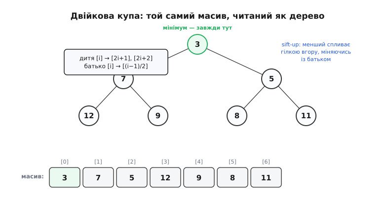
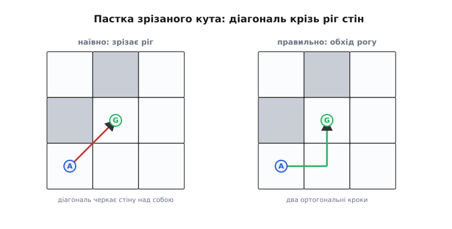

# ⚙️ A\* на сітці: від порожньої мапи до списку вейпойнтів

**Задача.** У тілі теми ми зібрали **серце** A\* — розкриття однієї клітини: обійти вісім сусідів, порахувати `new_g`, оновити дешевших, покласти в чергу за `f`. Але між тим фрагментом і **робочою прошивкою**, яка справді жене ровер кімнатою, лежить усе, що фрагмент замовчав. Звідки взялася сама черга й **як** вона за log-час віддає найдешевшу клітину? Де живе `g`, і чому його треба спершу залити «нескінченністю»? Що спиняє цикл, коли шляху **немає**, — і що не дає йому крутитися вічно, перекладаючи ті самі клітини туди-сюди? Як із «хлібних крихт» `came_from` **зібрати** маршрут — і чому його доводиться **розвертати**? І, найголовніше для того, хто це запускає на мікроконтролері з 64 кілобайтами пам'яті: чому наївна реалізація **впаде** на сітці 200×200, а шлях, який вона все ж таки знайде, поведе апарат **упритул до стіни** й зітре його об кут?

Зберемо повний планувальник — від оголошення структур до функції, що приймає мапу, старт і ціль, а віддає **готовий список вейпойнтів**. Без жодного псевдокоду: усе, що нижче, — справжній C, який компілюється й лягає в прошивку. А наприкінці — чотири пастки, кожна з яких уже завалила чийсь перший планувальник, і як їх обійти.

## Ідея: три масиви й одна черга

Перш ніж писати, домовмося про **форму даних**, бо саме вона визначає весь код. A\* тримає в голові рівно чотири речі, і всі вони — про клітини сітки.

Перше — **сама мапа**: для кожної клітини один біт, вільна вона чи зайнята. Це вхід, ми його не міняємо.

Друге — **`g`**: для кожної клітини найдешевша відома ціна шляху до неї від старту. Спершу ми нічого не знаємо, тож `g` усюди — **нескінченність** (на практиці — дуже велике число), крім старту, де `g = 0`. Це той самий масив відстаней, що й у Дейкстри.

Третє — **`came_from`**: для кожної клітини — та сусідня, з якої в неї прийшли найдешевше. Це «хлібні крихти», якими наприкінці відновлюють шлях назад.

Четверте — **черга з пріоритетом** (фронт, «відкритий набір»): клітини, які вже побачені, але ще не розкриті, впорядковані так, щоб **найменшу за `f`** можна було дістати миттєво. Це єдина нетривіальна структура, і з неї почнемо.

Зверни увагу, чого в списку **немає**: окремого масиву `f`. `f = g + h` для клітини потрібне лише **в мить**, коли ми кладемо її в чергу, — тож ми кладемо вже пораховане `f` **разом** із клітиною в чергу й ніде більше не зберігаємо. А `h` рахуємо на льоту функцією. Це не дрібниця: масив `f` на всю сітку — це стільки ж пам'яті, скільки `g`, а користі з нього нуль. Ощадливість тут не примха, а різниця між «влізло в мікроконтролер» і «не влізло».

Домовмося про габарити, щоб код був конкретний. Сітка — `W` на `H` клітин; координата клітини — пара `(x, y)`, але **всередині** структур ми часто згортаємо її в **один індекс** `idx = y * W + x`, бо так масиви одновимірні й адресуються швидше. Клітину в черзі представляємо стисло — індекс і її `f`:

```c
#include <stdint.h>
#include <stdbool.h>

#define GRID_W   64
#define GRID_H   64
#define N_CELLS  (GRID_W * GRID_H)

// Згортання (x,y) ⟷ лінійний індекс. Тримаємо в одному місці, щоб не наплутати.
static inline int   idx_of(int x, int y) { return y * GRID_W + x; }
static inline int   x_of(int idx)        { return idx % GRID_W;   }
static inline int   y_of(int idx)        { return idx / GRID_W;   }

// Мапа зайнятості: 0 = вільно, 1 = стіна. Один байт на клітину заради простоти
// (можна ужати до біта, якщо пам'ять геть на межі — див. пастку 1).
static uint8_t  grid[N_CELLS];

// Ціна найдешевшого відомого шляху від старту до клітини. INF = ще не досягнута.
static float    g_cost[N_CELLS];

// «Хлібні крихти»: звідки прийшли в цю клітину. -1 = нізвідки (старт або не досягнута).
static int32_t  came_from[N_CELLS];

#define INF   1e30f     // «нескінченність» для g: більша за будь-який реальний шлях
```

Чому `float` для `g`, а не цілі? Бо діагональ коштує √2 ≈ 1.41421 — **не** ціле. Можна лишитися в цілих, домноживши всі ціни на сталу (ортогональ = 41421, діагональ = 58579, це ті самі 1.41421 і 1 у масштабі), і на кволому мікроконтролері **без** апаратної плаваючої коми так і роблять — цілочисельна арифметика там у рази швидша. Але поки тримаймо `float` заради читабельності; наприкінці покажу цілочисельний варіант як пастку продуктивності.

> 🔧 **Навіщо це.** Форма даних — це і є половина алгоритму. Новачок часто заводить окрему структуру-«вузол» на кожну клітину з полями `x, y, g, f, parent, in_open, in_closed` і купою вказівників, а тоді дивується, чому 200×200 = 40 000 таких вузлів не влазять і код повзе. Три пласкі масиви, індексовані одним `idx`, — це той самий вузол, «розшитий» по колонках: замість 40 000 розкиданих по пам'яті об'єктів — три суцільні смуги, які кеш любить, а виділяти під них нічого не треба (вони статичні). Це та різниця в архітектурі даних, що вирішує, чи запуститься планувальник на залізі взагалі.

## Черга з пріоритетом — двійкова купа в масиві

Головний цикл A\* на кожному оберті просить одне: **дай клітину з найменшим `f`**. Якби ми тримали фронт простим масивом і щоразу шукали мінімум перебором, кожен оберт коштував би прохід по всьому фронту — а фронт розростається до тисяч клітин, і пошук виродився б у квадратичний. Потрібна структура, що віддає мінімум **швидко** й **швидко** ж приймає новий елемент. Класична відповідь — [черга з пріоритетом](root:sf-algorithms/priority-queue-adt) на **двійковій купі** (англ. *binary heap*): і вставка, і вилучення мінімуму коштують log від кількості елементів.

Ідея купи гранично ощадлива й варта того, щоб її зрозуміти, а не взяти готовою. Купа — це **не** відсортований масив (сортувати весь фронт щоразу було б надто дорого), а масив із **однією слабшою обіцянкою**: кожен «батько» не більший за своїх «дітей». Уяви масив як дерево: елемент на позиції `i` має дітей на `2i+1` і `2i+2`, а батька — на `(i−1)/2`. Обіцянка «батько ≤ діти» гарантує рівно те, що нам треба: **найменший елемент завжди на вершині**, у клітині `[0]`. І щоб її втримати, не потрібно тримати весь масив упорядкованим — досить, коли елемент «не на своєму місці», **пропхати** його вгору або вниз уздовж однієї гілки, а гілка коротка — заввишки log.


*Двійкова купа — це звичайний масив, який ми **читаємо** як дерево: дитя позиції `i` лежить на `2i+1` і `2i+2`. Обіцянка одна: батько не більший за дітей, тож найменше — завжди в клітині `[0]`, і взяти його — миттєво. Коли додаємо новий елемент, кладемо його в кінець масиву й даємо **спливти** (sift-up): поки він менший за батька — міняємо їх місцями, крок за кроком угору гілкою. Коли забираємо мінімум із вершини, на його місце ставимо останній елемент і даємо **потонути** (sift-down): міняємо з меншою з двох дітей, поки він не осяде. Обидва рухи йдуть однією гілкою, а гілка заввишки log₂n — ось звідки логарифмічна ціна. Для сітки 64×64 фронт сягає кількох тисяч клітин, а log₂4000 ≈ 12: дюжина порівнянь на операцію замість тисяч.*

Ось купа в коді — статичний масив плюс лічильник, і дві операції, що тримають обіцянку. Елемент купи — пара «індекс клітини + її `f`»:

```c
// Один запис у фронті: клітина та її f-оцінка на мить укладання.
typedef struct { float f; int32_t cell; } HeapItem;

// Місткість фронту. Через ЛІНИВЕ видалення (нижче) клітина лягає в купу не раз,
// а щоразу, як сусід, закрившись, приносить до неї дешевший шлях; сусідів вісім.
// Тож стеля пушів — не N_CELLS (вершини), а до 8·N_CELLS (ребра сітки): візьмеш
// N_CELLS — на щільній сітці heap[] переповниться й запис піде ЗА межі масиву.
#define HEAP_CAP  (8 * N_CELLS + 1)   // 8·N ребер + 1 стартовий push
static HeapItem heap[HEAP_CAP];
static int      heap_len = 0;

static inline void heap_swap(int a, int b) {
    HeapItem t = heap[a]; heap[a] = heap[b]; heap[b] = t;
}

// Спливання: новий елемент у кінці «підіймається», доки менший за батька.
static void heap_sift_up(int i) {
    while (i > 0) {
        int parent = (i - 1) / 2;
        if (heap[i].f >= heap[parent].f) break;   // на місці
        heap_swap(i, parent);
        i = parent;
    }
}

// Потонення: елемент із вершини «осідає», міняючись із меншою дитиною.
static void heap_sift_down(int i) {
    for (;;) {
        int l = 2 * i + 1, r = 2 * i + 2, smallest = i;
        if (l < heap_len && heap[l].f < heap[smallest].f) smallest = l;
        if (r < heap_len && heap[r].f < heap[smallest].f) smallest = r;
        if (smallest == i) break;                  // обидві дитини не менші
        heap_swap(i, smallest);
        i = smallest;
    }
}

static void heap_push(int32_t cell, float f) {
    if (heap_len >= HEAP_CAP) return;   // запобіжник від виходу за межі масиву (за нашої місткості не спрацює)
    heap[heap_len].f = f;
    heap[heap_len].cell = cell;
    heap_sift_up(heap_len);
    heap_len++;
}

// Забрати клітину з найменшим f (вона завжди у heap[0]).
static int32_t heap_pop_min(void) {
    int32_t best = heap[0].cell;
    heap_len--;
    heap[0] = heap[heap_len];       // останній — на вершину
    heap_sift_down(0);              // і хай осяде
    return best;
}

static inline bool heap_empty(void) { return heap_len == 0; }
```

Тут ховається тонкість, через яку A\* прощають те, чого не прощають підручниковій купі. У «правильній» черзі з пріоритетом є операція `decrease-key` — коли ми знайшли **дешевший** шлях до клітини, що вже лежить у фронті, треба **знайти** її в купі й посунути вгору. Знайти елемент у купі — дорого (вона не для пошуку). Тому A\* робить простіший фокус, який видно у `heap_push`: ми **не шукаємо** стару копію, а просто кладемо клітину **ще раз**, з новим, меншим `f`. У купі тепер два записи про одну клітину — старий (дорожчий) і новий (дешевший). Оскільки купа віддає **менший** першим, спершу вилізе дешевий і клітину розкриють правильно; а коли пізніше вилізе **дорогий** дублікат, ми його **впізнаємо застарілим і викинемо** — і саме для цього потрібне те, що зробимо далі: закритий набір і звірка `f` із чинним `g`. Ці дублікати мають ціну — місткість купи. Одну клітину кладемо стільки разів, скільки сусідів устигли принести до неї дешевший шлях, а сусідів вісім; тож у найгіршому разі у фронті не N клітин, а до 8·N записів — по числу **ребер** сітки, не вершин. Тому масив купи і беремо на 8·N_CELLS (див. `HEAP_CAP` вище): на N_CELLS він на щільній мапі тихо переповнився б, і запис пішов би за межі масиву. Натомість ми уникаємо дорогої `decrease-key`, якій довелося б щоразу лінійно шукати клітину в купі, щоб посунути її вгору, — для мікроконтролера це вдалий розмін.

## Мапа й підготовка

Перш ніж пускати пошук, треба заповнити стартовий стан. Мапу нам дає давач чи наземна станція — припустимо, вона вже в `grid[]`. А от `g_cost[]` і `came_from[]` треба **скинути**: усі клітини недосяжні (`g = INF`), «крихт» нема (`came_from = −1`), фронт порожній.

```c
// Скинути робочі масиви перед новим пошуком. Мапу (grid) не чіпаємо.
static void astar_reset(void) {
    for (int i = 0; i < N_CELLS; i++) {
        g_cost[i]    = INF;
        came_from[i] = -1;
    }
    heap_len = 0;
}

// Чи в межах сітки і чи вільна клітина.
static inline bool cell_free(int x, int y) {
    if (x < 0 || x >= GRID_W || y < 0 || y >= GRID_H) return false;
    return grid[idx_of(x, y)] == 0;
}
```

Заливка `INF` — не формальність, а **умова коректності**. Порівняння `new_g < g_cost[neighbor]` (те саме, що в тілі теми) працює лише тому, що недосягнута клітина має `g = INF`: **будь-який** реальний `new_g` менший за нескінченність, тож перший-ліпший шлях до клітини її «відкриває», а дальші — лише якщо дешевші. Забудеш залити `INF` (лишиш нулі від статичної ініціалізації) — і всі клітини вдаватимуть, що до них уже є шлях ціною 0, жоден новий шлях не пройде умову, і A\* не зрушить із місця. Це класична мовчазна поломка: код компілюється, пошук «відпрацьовує» й повертає «шляху нема» на порожній мапі.

## Евристика й ціни кроку

Повторимо з тіла теми чесну **діагональну** (октильну) евристику й таблицю сусідів — вони тут потрібні цілком, а не фрагментом. Нагадаю логіку: у 8-зв'язності найкоротший шлях у **порожньому** полі проходить `min(|Δx|,|Δy|)` кроків навскіс (по √2) і рештою — прямо (по 1); ця оцінка допустима й найточніша, тож пошук найвужчий.

```c
#define ORTHO_COST  1.0f
#define DIAG_COST   1.41421356f     // √2

// Восьмеро сусідів: dx, dy, ціна кроку.
typedef struct { int dx, dy; float cost; } Neighbour;
static const Neighbour NEIGH[8] = {
    {+1,  0, ORTHO_COST}, {-1,  0, ORTHO_COST},
    { 0, +1, ORTHO_COST}, { 0, -1, ORTHO_COST},
    {+1, +1, DIAG_COST},  {+1, -1, DIAG_COST},
    {-1, +1, DIAG_COST},  {-1, -1, DIAG_COST},
};

// Октильна (діагональна) евристика — точна довжина шляху в порожньому полі.
static float heuristic(int x, int y, int gx, int gy) {
    int dx = gx - x; if (dx < 0) dx = -dx;
    int dy = gy - y; if (dy < 0) dy = -dy;
    int diag     = (dx < dy) ? dx : dy;      // скільки навскіс
    int straight = (dx < dy) ? (dy - dx) : (dx - dy);  // решта прямо
    return diag * DIAG_COST + straight * ORTHO_COST;
}
```

Ця евристика **узгоджена** (consistent), не лише допустима, — а це має практичний наслідок, на який зіпремося в головному циклі. Узгодженість означає, що коли клітину вже **розкрито** (дістали з фронту), знайдений до неї шлях **остаточно найдешевший**: пізніше дешевшого не з'явиться. Тому розкриту клітину можна сміливо **закрити назавжди** й ніколи не переоцінювати — ми доведено нічого не втратимо. Саме це дозволяє «закритий набір», який робить пошук скінченним і швидким.

## Головний цикл: від старту до цілі

Тепер збираємо серце. Але фрагмент із тіла теми показав лише **розкриття** сусіда; тут — **весь** цикл, із трьома речами, яких там бракувало: **закритим набором** (щоб не розкривати клітину двічі), **упізнаванням застарілих дублікатів** із купи й **умовою зупинки** на порожньому фронті.

Закритий набір — це просто прапорець «цю клітину вже розкрито»; тримаємо його бітовою мапою на всю сітку. Логіка обертається так: дістали з фронту найдешевшу клітину; якщо це ціль — усе, шлях знайдено; якщо клітину **вже закрито** (це виліз застарілий дублікат) — **пропускаємо**; інакше закриваємо її й розкриваємо сусідів.

```c
// Закритий набір — по біту на клітину. Компактно і швидко.
static uint8_t closed[(N_CELLS + 7) / 8];
static inline void closed_set(int idx)  { closed[idx >> 3] |=  (1u << (idx & 7)); }
static inline bool closed_get(int idx)  { return closed[idx >> 3] & (1u << (idx & 7)); }
static inline void closed_clear_all(void) {
    for (unsigned i = 0; i < sizeof closed; i++) closed[i] = 0;
}

// Пошук шляху від (sx,sy) до (gx,gy). Повертає true, якщо шлях є;
// came_from[] тоді містить крихти для відновлення.
static bool astar_search(int sx, int sy, int gx, int gy) {
    astar_reset();
    closed_clear_all();

    if (!cell_free(sx, sy) || !cell_free(gx, gy)) return false;  // старт/ціль у стіні

    int start = idx_of(sx, sy);
    g_cost[start] = 0.0f;
    heap_push(start, heuristic(sx, sy, gx, gy));   // f старту = 0 + h

    while (!heap_empty()) {
        int32_t cur = heap_pop_min();              // найдешевша за f

        if (closed_get(cur)) continue;             // застарілий дублікат — викинути
        if (cur == idx_of(gx, gy)) return true;    // дійшли до цілі

        closed_set(cur);                           // розкриваємо остаточно
        int cx = x_of(cur), cy = y_of(cur);

        for (int k = 0; k < 8; k++) {
            int nx = cx + NEIGH[k].dx;
            int ny = cy + NEIGH[k].dy;

            if (!cell_free(nx, ny)) continue;      // за межами або в стіні

            // ── зріз кута: діагональ дозволена, лише якщо ОБИДВА
            //    ортогональні сусіди по дорозі вільні (див. пастку 2) ──
            if (NEIGH[k].dx != 0 && NEIGH[k].dy != 0) {
                if (!cell_free(cx + NEIGH[k].dx, cy) ||
                    !cell_free(cx, cy + NEIGH[k].dy))
                    continue;                       // кут стіни — не зрізаємо
            }

            int nidx = idx_of(nx, ny);
            if (closed_get(nidx)) continue;        // вже остаточно розкрито

            float new_g = g_cost[cur] + NEIGH[k].cost;
            if (new_g < g_cost[nidx]) {            // знайшли дешевший шлях
                g_cost[nidx]    = new_g;
                came_from[nidx] = cur;             // хлібна крихта
                float f = new_g + heuristic(nx, ny, gx, gy);
                heap_push(nidx, f);                // (можливий дублікат — не страшно)
            }
        }
    }
    return false;   // фронт вичерпано, цілі не досягли — шляху не існує
}
```

Придивімося до трьох рядків, яких не було у фрагменті, бо саме вони роблять код **скінченним і правильним**.

Рядок `if (closed_get(cur)) continue;` **одразу після** вилучення з купи — це той самий «викид застарілого дубліката», що обіцяли в розділі про купу. Клітина могла потрапити у фронт кілька разів (щоразу як знаходили дешевший шлях). Перша — найдешевша — вилізе першою, її розкриють і закриють. Решта копій, дорожчі, вилізуть пізніше вже закритими — і ось цей рядок їх мовчки викидає. Без нього ми б розкривали ту саму клітину по кілька разів, марнуючи роботу; узгодженість евристики гарантує, що перше розкриття було **остаточним**, тож викид безпечний.

Рядок `if (cur == idx_of(gx, gy)) return true;` — умова зупинки за **успіхом**. Ключове: перевіряємо ціль **у мить вилучення** з фронту, а **не** тоді, коли вперше поклали її у фронт. Різниця тонка, але суттєва: коли ціль **виходить** із черги з найменшим `f`, це доведено найдешевший шлях до неї (для узгодженої евристики). Перевіриш надто рано — на вкладанні — і можеш повернути **не** найкоротший маршрут, бо дешевший ще не встиг дозріти у фронті.

І `return false;` за межами циклу — зупинка за **невдачею**. Якщо фронт спорожнів, а цілі не витягли, значить, до неї **не веде жоден ланцюжок вільних клітин**: ціль замурована, або старт замкнено в кишені. Це не помилка, а чесна відповідь «шляху немає», і викликач мусить її обробити (скажімо, не зрушувати апарат, а доповісти оператору).

## Відновлення шляху: назад по крихтах і розворот

A\* повернув `true` — але сам маршрут іще ніде не зібраний, він **розсіяний** по масиву `came_from[]`. Тепер його треба скласти. Логіка проста: станьмо на **ціль**; `came_from[ціль]` каже, з якої клітини в неї прийшли; переходимо туди; `came_from` тієї — ще на крок назад; і так доти, доки не впремося в старт (у якого `came_from = −1`). Ми пройдемо шлях **задом наперед**, від цілі до старту.

Тому наприкінці ланцюжок **розвертають** — щоб вийшов природний порядок «від старту до цілі». Ось відновлення, що пише результат у наданий масив і повертає його довжину:

```c
// Відновити шлях у out[] (у клітинних індексах), від старту до цілі.
// Повертає кількість точок, або 0, якщо не влізло в out_cap.
static int astar_reconstruct(int gx, int gy, int32_t *out, int out_cap) {
    // 1) Пройти came_from від цілі назад, складаючи в out задом наперед.
    int n = 0;
    int32_t node = idx_of(gx, gy);
    while (node != -1) {
        if (n >= out_cap) return 0;   // шлях довший за буфер — чесно програємо
        out[n++] = node;
        node = came_from[node];       // ще крок до старту
    }
    // 2) Розвернути: тепер out[0] стане стартом, out[n-1] — ціллю.
    for (int i = 0, j = n - 1; i < j; i++, j--) {
        int32_t t = out[i]; out[i] = out[j]; out[j] = t;
    }
    return n;
}
```

Перевірка `if (n >= out_cap) return 0;` — не педантизм. Довжину шляху **наперед не знаєш**, а на великій сітці він може мати сотні клітин. Даси малий буфер і не перевіриш — запишеш **за його межі**, зіпсуєш сусідню пам'ять, дістанеш плаваючий баг, що вилазить лише на довгих маршрутах. Тому: не влізло — чесно поверни 0, хай викликач збільшить буфер або огрубить сітку.

## Від клітин до вейпойнтів: викидаємо зайві точки

Маємо шлях — **список сусідніх клітин**. Але вести апарат **по кожній клітині** — марнотратство: якщо десять клітин лежать на одній прямій, апарату потрібні лише **дві** — початок і кінець відрізка, а не всі проміжні. Тому сирий шлях **проріджують** до **вейпойнтів** (англ. *waypoint* — «шляхова точка»): лишають тільки ті клітини, де маршрут **змінює напрям**.

Ідея — гранично проста: йдемо по клітинах і на кожній дивимося, чи **той самий** напрямок веде далі, що й вів сюди. Якщо напрямок не змінився — клітина проміжна, її **пропускаємо**. Якщо змінився (поворот) — це вейпойнт, лишаємо. Старт і ціль лишаємо завжди.

```c
// Один вейпойнт у клітинних координатах.
typedef struct { int x, y; } Waypoint;

// Прорідити шлях out[] до поворотних точок → wp[]. Повертає їхню кількість.
static int path_to_waypoints(const int32_t *path, int n,
                             Waypoint *wp, int wp_cap) {
    if (n == 0) return 0;
    int m = 0;
    // Старт — завжди вейпойнт.
    wp[m].x = x_of(path[0]); wp[m].y = y_of(path[0]); m++;

    for (int i = 1; i < n - 1; i++) {
        int px = x_of(path[i - 1]), py = y_of(path[i - 1]);
        int cx = x_of(path[i]),     cy = y_of(path[i]);
        int nx = x_of(path[i + 1]), ny = y_of(path[i + 1]);

        int dir_in_x  = cx - px, dir_in_y  = cy - py;   // куди прийшли
        int dir_out_x = nx - cx, dir_out_y = ny - cy;   // куди підемо

        // Напрямок змінився → поворот → це вейпойнт.
        if (dir_in_x != dir_out_x || dir_in_y != dir_out_y) {
            if (m >= wp_cap) return m;   // буфер вичерпано — віддамо що є
            wp[m].x = cx; wp[m].y = cy; m++;
        }
    }
    // Ціль — завжди вейпойнт.
    if (m < wp_cap) {
        wp[m].x = x_of(path[n - 1]); wp[m].y = y_of(path[n - 1]); m++;
    }
    return m;
}
```

Це найпростіше проріджування — «за колінеарністю сусідніх кроків». Воно прибирає лише прямі **на сітці** (десять клітин угору стиснуться на дві), але **не** зрізає сходинки, коли маршрут іде по діагоналі «драбинкою» через тісноту 8-зв'язності. Сильніше згладжування — окрема пастка нижче. Але навіть цей дешевий прохід зазвичай ужимає шлях у рази: замість сотні клітин — десяток поворотів, і саме їх віддаємо в контур руху.

## Усе разом: одна функція «мапа → маршрут»

Зберемо публічний виклик — той, що його викликає решта прошивки. На вхід: старт, ціль, буфер під вейпойнти. На вихід: скільки їх вийшло (0 — шляху нема або не влізло). Усередині — знайомі три кроки: пошук, відновлення, проріджування.

```c
// Головний публічний виклик планувальника.
// Повертає кількість вейпойнтів у wp[], або 0, якщо шляху немає.
int plan_path(int sx, int sy, int gx, int gy, Waypoint *wp, int wp_cap) {
    static int32_t raw[N_CELLS];        // буфер сирого шляху (статичний, не стек!)

    if (!astar_search(sx, sy, gx, gy))
        return 0;                       // шляху не існує

    int n = astar_reconstruct(gx, gy, raw, N_CELLS);
    if (n == 0) return 0;               // не влізло (буфер малий)

    return path_to_waypoints(raw, n, wp, wp_cap);
}
```

Одна деталь у цьому короткому коді критична для мікроконтролера — слово **`static`** перед `raw`. Буфер сирого шляху може бути завбільшки з усю сітку (`N_CELLS` елементів по 4 байти — для 64×64 це 16 КБ). Оголоси його **без** `static` — і компілятор покладе 16 КБ **на стек**, а стек мікроконтролера — це кілька кілобайтів. Стек **переповниться**, і апарат впаде посеред польоту без жодного натяку чому. `static` кладе буфер у статичну пам'ять (там, де решта масивів), поза стеком. Це та сама пастка, що й невилите `INF`: компілюється чисто, вибухає в польоті.

Тепер апарат має маршрут. Викликач бере `wp[0..m−1]`, переводить клітинні координати у метри (помножити на розмір клітини, додати кут мапи) і згодовує контуру руху — далі маршрут веде вже [навігація pure pursuit](root:sys-dron/pure-pursuit-navigation), що перетворює ламану з вейпойнтів на живе керування кермом.

## Складність і чому наївний код падає

Скільки це коштує? Кожну клітину розкривають **щонайбільше раз** (закритий набір), і на кожну — до восьми сусідів, кожен із яких може лягти в купу за log-час. Отже, роботи — порядку **N·log N**, де N — число клітин: для 64×64 це 4096·12 ≈ 50 тисяч операцій, мікросекунди. Пам'ять — лінійна за N: масиви `g_cost`, `came_from`, купа, `closed`. І саме пам'ять — перша пастка.

**Пастка 1: пам'ять вибухає квадратично з роздільністю.** Сітка 64×64 — це 4 тисячі клітин, дрібниця. Але охопити двір 100×100 метрів із роздільністю 0.25 м — це вже 400×400 = **160 тисяч** клітин. `g_cost` по 4 байти — 640 КБ **лише під один масив**; плюс `came_from` — ще 640 КБ; а купа, яку доводиться розраховувати на найгірший випадок (до 8·N записів по 8 байтів — розділ про купу пояснює, чому саме стільки), сама тягне **мегабайти** — більше за всі решту масивів разом. У сумі — гори пам'яті, яких у мікроконтролера **немає** й близько. А спокуса «зроблю дрібнішу сітку — план буде точніший» тягне саме сюди. Пам'ять росте **як квадрат** роздільності: удвічі дрібніша клітина — вчетверо більше пам'яті. Що з цим роблять:

- **Стискати мапу до біта на клітину.** `grid[]` як бітова мапа — увосьмеро менше (`закритий набір` ми вже так і зробили).
- **Замінити `float g` на цілі.** `int16_t` замість `float` — удвічі; ще й арифметика без FPU швидша (див. пастку 4).
- **Не тримати `g` і `came_from` на **всю** сітку, а лише на **відвідані**** — через геш-таблицю. Для розрідженого пошуку (ціль близько) відвідана дрібка сітки, і платити пам'яттю за всю — марно.
- **Огрубити сітку.** Найчесніше: якщо точність 0.25 м не потрібна, візьми 1 м — і пам'ять упаде в 16 разів. Роздільність плану — інженерне рішення, а не «що дрібніше, то краще».

**Пастка 2: зріз кута впритул до стіни.** Ми вже вбудували захист у головний цикл, але варто зрозуміти **чому** без нього шлях фізично неможливий. Уяви дві стіни, що сходяться в кут: клітина праворуч зайнята, клітина зверху зайнята, а **діагональна** між ними — вільна. Наївний A\* залюбки піде **навскіс** через цей діагональний просвіт — адже сама діагональна клітина вільна. Але фізично апарат **не пролізе**: щоб пройти по діагоналі, він мусить бодай **черкнути** обидві сусідні клітини, а вони — стіни. Шлях «зрізав кут» крізь суцільний ріг.


*Пастка зрізаного кута. Праворуч і зверху від апарата — стіни (сірі), між ними по діагоналі — вільна клітина. Наївний 8-зв'язний A\* пройде **навскіс** (червона стрілка) крізь просвіт: цільова клітина ж вільна. Але діагональний хід фізично проходить **між** двома стінами й черкає обидві — реальний апарат тут застряг би або зачепив ріг. Правильно (зелена ламана) — заборонити діагональ, коли **бодай один** із двох ортогональних сусідів на її шляху зайнятий, і обійти кут двома прямими кроками. Саме це робить перевірка `cell_free(cx+dx, cy) && cell_free(cx, cy+dy)` перед кожним діагональним сусідом.*

Лік — рівно той, що в коді: **перед** тим як прийняти діагонального сусіда, перевір **обидва** ортогональні сусіди, повз які пройшла б діагональ. Обидва вільні — хід дозволено; хоч один стіна — **заборонено**, обходь кут ортогонально. Один `if` на три рядки, а без нього планувальник радісно веде апарат крізь роги стін — і це найпідступніша пастка, бо на **відкритій** мапі код працює бездоганно й пастка спить, доки шлях не притиснеться до кута.

**Пастка 3: сирий шлях тулиться до стін — роздуй перешкоди наперед.** Навіть із забороною зрізати кути A\* веде маршрут **упритул** до перешкод — там-бо найкоротше. Але апарат має **розмір**, інерцію й похибку позиції: провести його по клітинах, що межують зі стіною, — значить майже напевно черкнути стіну на першому ж пориві вітру. Розв'язок стратегічний і робиться **до** пошуку: **роздути перешкоди** (англ. *obstacle inflation*). Перед запуском A\* проходимо мапу й кожну зайняту клітину «нарощуємо» — позначаємо як зайняті ще й сусідні клітини в радіусі «половина ширини апарата + запас». Тоді A\* фізично **не зможе** провести шлях ближче за цей запас: для нього стіни стали товщими рівно на габарит апарата.

```c
// Роздути перешкоди на radius клітин: кожну стіну «розмазати» на сусідів.
// Пишемо в окрему мапу, щоб не роздувати вже роздуте (інакше стіни «поповзуть»).
static void inflate_obstacles(const uint8_t *src, uint8_t *dst, int radius) {
    for (int y = 0; y < GRID_H; y++)
        for (int x = 0; x < GRID_W; x++) {
            uint8_t occupied = 0;
            // Клітина зайнята, якщо в радіусі є хоч одна стіна вихідної мапи.
            for (int oy = -radius; oy <= radius && !occupied; oy++)
                for (int ox = -radius; ox <= radius; ox++) {
                    int sx = x + ox, sy = y + oy;
                    if (sx < 0 || sx >= GRID_W || sy < 0 || sy >= GRID_H) continue;
                    if (src[idx_of(sx, sy)]) { occupied = 1; break; }
                }
            dst[idx_of(x, y)] = occupied;
        }
}
```

Тонкість у коментарі: роздувати треба з **вихідної** мапи в **окрему** — не «на місці». Роздувай на місці — і щойно позначені клітини самі стануть джерелом наступного роздування в тому ж проході, стіни «поповзуть» далеко за потрібний радіус, а вузькі, але **прохідні** коридори зникнуть. Дві мапи, вхід і вихід, знімають це начисто. Ціна роздування — надійність важливіша за кілька зайвих клітин обходу; надто товсте роздування, щоправда, **замурує** вузькі проходи, тож радіус беруть найменший, що дає безпечний зазор.

**Пастка 4: `float` без FPU — і план рахується вічність.** Останнє — не про коректність, а про **встигнути**. Ми писали `g` і ціни в `float` заради ясності. Але дешеві мікроконтролери (Cortex-M0, багато AVR) **не мають** апаратної плаваючої коми: кожне множення й порівняння `float` компілятор розкладає в **десятки** інструкцій програмної емуляції. На великій сітці, де таких операцій мільйони, план, що на комп'ютері рахується за мілісекунду, на такому мікроконтролері повзе **секундами** — а апарат тим часом летить. Лік — цілочисельна арифметика: домнож усі ціни на сталу й тримай `g` у цілих.

```c
// Цілочисельні ціни: множимо на 1000, √2 ≈ 1.41421 → 1414.
#define ORTHO_I  1000
#define DIAG_I   1414
static int32_t g_cost_i[N_CELLS];   // ціле g замість float — швидше без FPU

static int32_t heuristic_i(int x, int y, int gx, int gy) {
    int dx = gx - x; if (dx < 0) dx = -dx;
    int dy = gy - y; if (dy < 0) dy = -dy;
    int diag     = (dx < dy) ? dx : dy;
    int straight = (dx < dy) ? (dy - dx) : (dx - dy);
    return diag * DIAG_I + straight * ORTHO_I;   // усе в цілих, без жодного float
}
```

Похибка від округлення √2 до 1.414 — тисячна частка, для планування нехтовна, а виграш у швидкості на кволому ядрі — **порядок**. Правило просте: є FPU (Cortex-M4F і вище) — лишай `float`, читабельніше; немає — переходь на цілі, бо інакше «повільний глобальний планувальник» стане нестерпно повільним.

## Підсумок

Повний A\* на сітці — це три пласкі масиви (`grid`, `g_cost`, `came_from`), одна двійкова купа для фронту й головний цикл, що вилучає найдешевшу за `f` клітину, відкидає застарілі дублікати та закриті клітини, розкриває сусідів із чесними цінами 1 і √2 і забороняє зрізати кути. Знайшовши ціль **на вилученні** з фронту (не на вкладанні), він відновлює шлях назад по `came_from`, розвертає його й проріджує до поворотних вейпойнтів. Чотири пастки відрізняють іграшку від прошивки: пам'ять росте **квадратом** роздільності (стискай, огрублюй, тримай лише відвідане); діагональ **зрізає кути** крізь роги стін, якщо не перевіряти обидва ортогональні сусіди; сирий шлях **тулиться до стін**, доки не роздмухаєш перешкоди наперед; і `float` **без FPU** перетворює план на муку, якої позбавляє цілочисельна арифметика. Усе разом дає функцію `plan_path(старт, ціль) → список вейпойнтів`, готову лягти в бортовий контролер, — а вже над готовим маршрутом далі стереже [обхід перешкод](root:embedded/obstacle-avoidance) від того, чого A\* не бачив: раптової перешкоди, що з'явилась уже в польоті.
