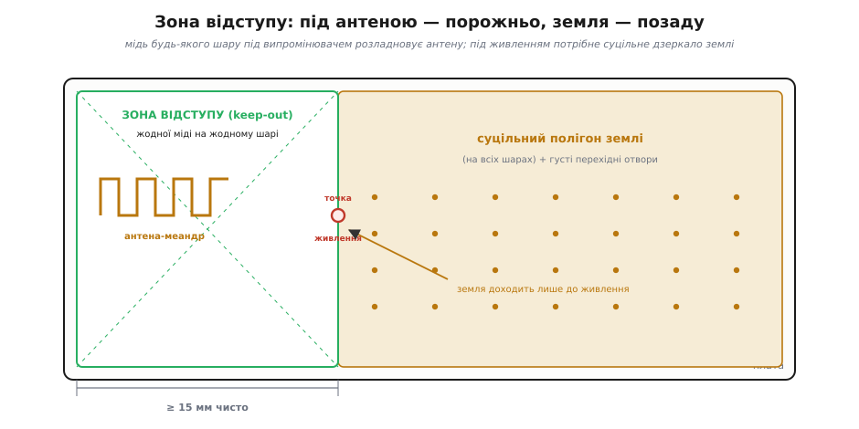
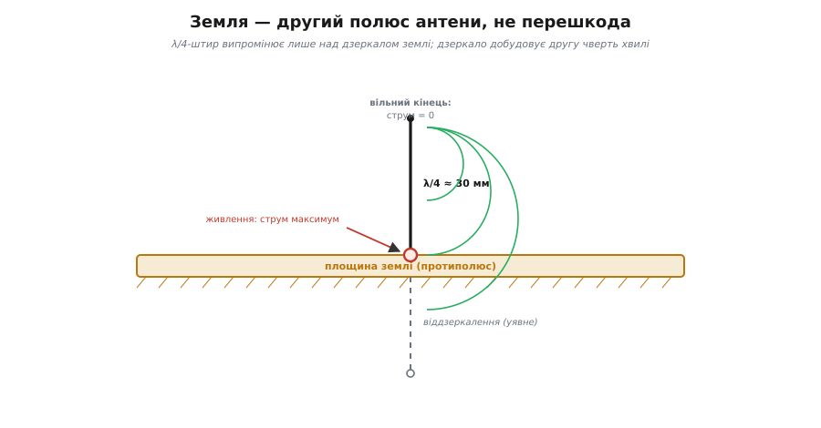
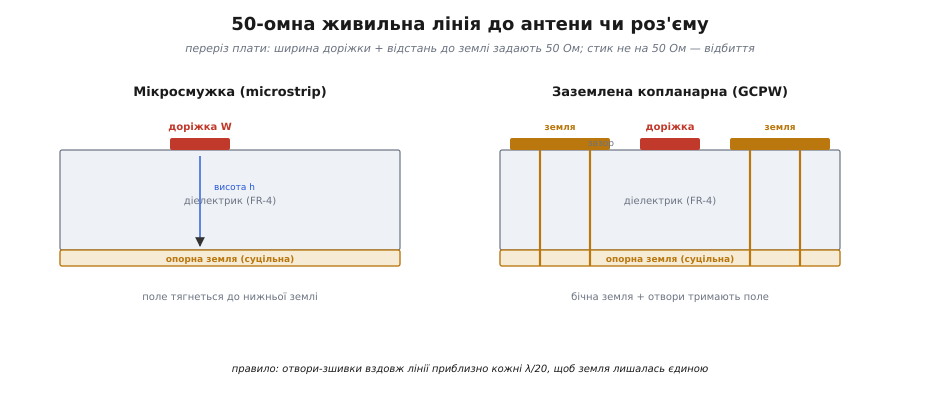

# Топологія антени на PCB: keep-out, заземлення, розведення

У [попередньому кроці](root:embedded/esp32-antenna) ми розібрали, *які* антени бувають на модулі й *чому* будь-що провідне поруч садить зв'язок: антена резонує лише в парі з площиною землі, а стороння мідь чи рука розладновують її паразитною ємністю. Там ми взяли це як даність і покладались на готовий модуль WROOM, де розведення вже зроблене виробником. Тепер крок углиб: коли ти ставиш на власну плату **голий чип** ESP32 (а не запаяний модуль) або виводиш сигнал на зовнішній роз'єм, топологію антени, землі й живильної доріжки доводиться креслити **самому**. І саме тут роблять найбільше помилок — плата «начебто працює», та дальність утричі менша за паспортну.

Ця стаття — про три речі, які треба покласти на мідь правильно: **зону відступу (keep-out)** довкола випромінювача, **площину землі** як другий полюс антени, і **50-омну живильну лінію** від чипа до антени чи роз'єма. Усе це — не естетика розведення, а пряме продовження тієї самої фізики резонансу, яку ми вже бачили.

## Чому топологію не можна «трохи підрівняти»

Спокуса в розробника одна: антена з її дзиґзаґами займає дорогий край плати, поруч проситься поставити роз'єм USB чи кварц, а порожнє місце під меандром «шкода марнувати». Кожне з цих рішень здається невинним — і кожне коштує дальності.

Причина в тому, що антена на 2.4 ГГц працює з полем, яке простягається в простір на сантиметри довкола міді — на масштаб тієї самої [електромагнітної хвилі](root:ph-electromagnetism/em-wave), що її антена випромінює. Доріжка обчислювача чи стінка корпусу за міліметр від випромінювача — це не «поруч», це **всередині** ближнього поля антени. Тому топологію антени проєктують не як решту плати (де важливо лише, щоб доріжки з'єднували що треба), а як **окрему ВЧ-структуру** з власними правилами розмірів. Виробник чипа дає референсну топологію до десятих міліметра саме тому, що відхилення на пів міліметра вже зсуває резонанс. Звідси головна настанова всього кроку: **антенну ділянку копіюй із референсного дизайну виробника як є, не «покращуй».** Решта статті пояснює, *чому* кожне з цих правил саме таке — щоб ти впізнавав їх у чужому дизайні й не ламав випадково.

## Зона відступу: де міді бути не може

Перше й найважливіше правило топології — **keep-out** (з англ. «тримайся осторонь»): ділянка довкола антени, де **не можна** класти мідь — ні доріжки, ні полігон землі, ні заливку, ні навіть на внутрішніх шарах багатошарової плати. Espressif для модулів WROOM просить лишати **щонайменше 15 мм** чистого простору в усіх напрямках від антени — без міді на **жодному** шарі. Це найчастіше знехтуване правило в усьому розведенні радіоплат і, за словами самого виробника, причина номер один кволого зв'язку.

Чому саме «без міді на жодному шарі», а не лише на верхньому? Бо поле антени тривимірне. Полігон землі на внутрішньому шарі прямо під меандром так само перетягує на себе ближнє поле й додає паразитну ємність, як і доріжка зверху, — він просто невидимий оком, тому про нього й забувають найчастіше. Антена «бачить» усю мідь у своєму об'ємі, незалежно від того, на якому шарі вона лежить.


*Корінь топології. Ліворуч — зона відступу: під меандром і довкола нього порожньо на всіх шарах, антена винесена на самий край плати. Праворуч — суцільний полігон землі з густими перехідними отворами. Земля доходить лише до точки живлення антени й не далі: вона потрібна як дзеркало під живленням, а не збоку від випромінювача.*

Звідси й розташування самого модуля чи чипа: антенним краєм — **назовні, на межу плати**, щоб половина простору довкола випромінювача була вільним повітрям, а не текстолітом із мідью. Якщо антена фізично не може виступати за край (компонування корпусу не дозволяє), виробник радить піти далі: **вирізати текстоліт** з боків і знизу від антени, прибравши навіть діелектрик без міді — бо сам матеріал плати (його діелектрична проникність) теж трохи сповільнює хвилю й розладновує антену, хоч і слабше за мідь.

> 🔧 **Навіщо це.** На етапі компонування плати зона відступу диктує, де взагалі може стояти радіомодуль: тільки край, тільки кутом назовні. Це впливає на форму плати раніше, ніж ти розставив бодай одну іншу деталь. Закладай keep-out у контур плати з самого початку — інакше з'ясуєш, що антені нема куди дихати, коли вся плата вже розведена, і переробляти доведеться все.

## Земля — це другий полюс, а не перешкода

Тут криється головний парадокс, від якого плутаються початківці: щойно ми сказали «під антеною жодної міді», а водночас [у минулому кроці](root:embedded/esp32-antenna) бачили, що **без площини землі антена взагалі не резонує**. То землю прибирати чи лишати?

Відповідь — у тому, що земля потрібна в **одному конкретному місці** й шкідлива в іншому. Випромінювач ESP32 несиметричний: один його полюс — гарячий вихід радіо, а другим полюсом служить сама площина землі плати. Хвиля біжить уздовж чвертьхвильового провідника, відбивається від землі й повертається так, що на вільному кінці струм завжди нуль, а в точці живлення — максимум. Земля при цьому працює як **дзеркало (counterpoise, протиполюс)**: вона добудовує другу чверть хвилі своїм віддзеркаленням, тож λ/4-штир над землею поводиться як повноцінний піврозмірний випромінювач.


*Земля як другий полюс. Чвертьхвильовий провідник угору живиться в точці, де струм максимальний; на вільному кінці струм нульовий. Площина землі віддзеркалює провідник, ніби добудовуючи невидиму другу чверть хвилі вниз, — тому з боку радіо це повноцінний піврозмірний випромінювач. Прибери дзеркало — і резонанс розвалиться.*

Тепер парадокс знімається сам собою. Дзеркало мусить бути **під точкою живлення й позаду неї** — там, де провідник «спирається» на землю. А от **збоку й попереду випромінювача**, у напрямку, куди він випромінює, земля стає чужою міддю в ближньому полі: вона перетягує поле на себе й глушить його. Тому топологія виглядає так: суцільна, добре зшита перехідними отворами площина землі **позаду** антени (під обчислювачем, під рештою плати) — і чистий keep-out **попереду й довкола** меандру. Земля доходить рівно до точки живлення антени й там обривається.

Що означає «добре зшита»? Площина землі під радіочастиною має бути **єдиним цілим без розрізів і вузьких перетяжок**. Якщо її розрізати доріжкою чи прорізом, краї розрізу починають коливатися з різним потенціалом, і земля перестає бути спокійним дзеркалом — вона сама стає паразитним випромінювачем, а заразом і антеною для завад від цифрової частини. На багатошаровій платі суцільну землю підпирають **густими перехідними отворами** по всій ВЧ-ділянці: вони з'єднують усі ділянки землі різних шарів в одну точку відліку, щоб ніде не виникло різниці потенціалів на частоті радіо. Та сама вимога суцільної опорної землі лежить в основі [цілісності сигналу](root:embedded/signal-integrity) будь-яких швидких доріжок, не лише антени.

> 🔧 **Навіщо це.** Коли ти заливаєш плату полігоном землі (а це роблять майже завжди), легко за звичкою залити **все**, зокрема й під антеною — редактор плат радо заллє мідь усюди, де є місце. Саме тут і народжується найтиповіша помилка. Правило просте: спершу намалюй keep-out як заборонену зону, а тоді вже лий землю — вона обтече зону відступу й сама зупиниться там, де треба.

## Живильна лінія: 50 Ом від чипа до антени

Між виходом радіо чипа й антеною (чи роз'ємом для зовнішньої антени) лежить шматок доріжки. Здавалося б, дрібниця — просто з'єднати два піни. Але на 2.4 ГГц ця доріжка вже не «провід», а **лінія передачі**, і вона мусить мати цілком конкретний хвильовий опір: **50 Ом**. Якщо опір лінії не дорівнює опору джерела й навантаження, на кожному стику частина хвилі **відбивається** назад у передавач замість іти в антену — це той самий механізм відбиття, що псує будь-яку [лінію передачі на платі](root:com-medium/transmission-lines).

Звідки взялися саме 50 Ом — окрема й цікава історія: це не кругле число «з повітря», а інженерний компроміс, ухвалений ще наприкінці 1920-х.

> 📜 **Чому радіо «домовилося» на 50 Ом.** Для повітряного коаксіального кабелю найкраща передача потужності припадає на ~30 Ом, а найменше згасання — на ~77 Ом; 50 Ом — це компроміс між ними, що його закріпили Bell Labs наприкінці 1920-х. Відтоді 50 Ом стало де-факто стандартом усього радіотракту — від роз'ємів до входів чипів. Деталі й імена — [у вставці](root:embedded/pcb-antenna-layout/hist-50-ohm.md).

Як зробити 50-омну доріжку на платі? Хвильовий опір смужки міді над землею задають **ширина доріжки** й **відстань до опорної землі** (тобто товщина діелектрика між ними) та сам діелектрик. Для типового текстоліту FR-4 «50 Ом» виходить за певної ширини доріжки відносно висоти до землі — точні числа дає калькулятор під конкретний стек плати, і їх теж беруть із референсного дизайну, не вгадують. Важливо інше — **геометрія цієї лінії**, бо саме її ти креслиш руками.


*Дві форми 50-омної лінії в перерізі плати. Мікросмужка — доріжка над суцільною землею через діелектрик; її 50 Ом задають ширина доріжки W і висота h до землі. Заземлена копланарна (GCPW) додає землю обабіч доріжки на тому ж шарі, зшиту з нижньою землею перехідними отворами, — поле краще тримається в межах лінії. Отвори ставлять уздовж лінії приблизно кожні λ/20, щоб уся земля лишалась єдиним потенціалом.*

Найпростіша форма — **мікросмужка (microstrip)**: доріжка зверху, суцільна земля знизу, діелектрик між ними; її поле частково висить у повітрі над доріжкою. Надійніша на високих частотах — **заземлена копланарна лінія (grounded coplanar waveguide, GCPW)**: ту саму доріжку обрамлюють землею **на тому ж шарі**, з обох боків, лишаючи рівний зазор, і зшивають цю бічну землю з нижньою рядами перехідних отворів. Поле тоді тримається в межах лінії, менше випромінює врозтіч і менше ловить завади — тому GCPW на 2.4 ГГц зазвичай кращий вибір для живильної доріжки.

Кілька непорушних правил для цієї лінії:

- **Тримай 50 Ом по всій довжині.** Ширина доріжки стала, під нею — суцільна непорушна земля. Будь-яке звуження, розширення чи розрив землі під лінією — це стик не на 50 Ом, тобто відбиття.
- **Лінію — коротку й пряму.** Кожен зайвий міліметр доріжки — додаткове згасання й нагода для розладнання. Чип чи роз'єм ставлять так, щоб шлях до антени був якнайкоротшим.
- **Без різких прямих кутів.** Гострий поворот на 90° — це локальне потовщення міді, знову зрив 50 Ом. Повороти роблять плавними (дугою) або зрізаним кутом.
- **Зшивай землю отворами вздовж лінії.** Орієнтир — перехідний отвір приблизно кожні **λ/20**, щоб опорна земля ніде не «відірвалась» по фазі від доріжки.

Один маленький розрахунок, щоб «λ/20» перестало бути формулою:

**Крок отворів-зшивок для живильної лінії 2.45 ГГц.** Скільки міліметрів між сусідніми перехідними отворами вздовж 50-омної доріжки? Беремо довжину хвилі **в повітрі** як грубий орієнтир (у діелектрику вона коротша, тож запас іде в безпечний бік — отвори стануть навіть частіше):

```
λ = c / f
  = (3 · 10⁸ м/с) / (2.45 · 10⁹ Гц)
  ≈ 0.1224 м
  = 122.4 мм

крок ≈ λ / 20
     = 122.4 мм / 20
     ≈ 6 мм
```

Отже, перехідні отвори вздовж живильної лінії ставлять приблизно через **6 мм** один від одного (а з поправкою на діелектрик — ще ближче, що лише на користь). Це і є практичне число, яке кладеш на плату.

> 🔧 **Навіщо це.** Коли в редакторі плат тягнеш доріжку від ESP32 до U.FL-роз'єма, ці чотири правила — твій чекліст. Найчастіша помилка тут — провести радіодоріжку через усю плату звивистим шляхом повз інші деталі: кожен поворот і кожен розрив землі під нею з'їдає сигнал, і зовнішня антена вже не дає очікуваного виграшу. Коротка пряма 50-омна лінія з суцільною землею під нею — половина успіху зовнішньої антени.

## Сусіди антени: що тримати подалі

Навіть із бездоганним keep-out антену можна задушити **сусідніми вузлами плати**, які самі шумлять на радіочастотах або поруч. Espressif прямо просить тримати антену **подалі** від:

- **кварцу й тактових генераторів** — вони джерела вузькосмугових завад на гармоніках своєї частоти, і антена радо їх ловить;
- **USB-роз'єма, мікросхеми USB↔UART і ліній UART** — швидкі цифрові краї випромінюють широку «гребінку» завад; будь-яка доріжка UART, навіть тестова точка чи контакт гребінки, що проходить близько до антени, підмішує цей шум у приймач;
- **DDR-пам'яті й інших швидких шин** — той самий клас широкосмугового цифрового шуму.

Логіка спільна: антена — найчутливіший у системі вхід, вона підсилює все, що ловить. Тримати її «у тиші» означає фізично рознести подалі все, що генерує ВЧ-енергію, і ніколи не вести швидкі цифрові доріжки крізь зону відступу чи попри неї. Це доповнює правило keep-out: під антеною не лише не має бути міді — поруч не має бути й галасливих сусідів.

## Перевірка топології до прототипу

Найдешевша помилка — та, яку зловив до замовлення плат. Зону відступу неможливо перевірити оком на щільній платі: легко прогледіти полігон землі на внутрішньому шарі під меандром. Тому keep-out задають у редакторі як **формальне правило-зону** й ганяють автоматичну перевірку (DRC), яка підтверджує, що в цьому об'ємі нема міді **на жодному шарі**. Це перетворює «не забути» на машинну гарантію — і легко вписується в той самий автоматичний контроль плати, що й решта правил розведення.

> ⚙️ **Keep-out як правило DRC і перевірка топології.** Як описати зону відступу формально (rule area / keep-out region у редакторі плат), щоб перевірка ловила мідь на всіх шарах усередині неї, і як винести це в автоматичну перевірку проєкту замість ручного огляду. Робочий приклад — [у вставці](root:embedded/pcb-antenna-layout/proj-keepout-drc.md).

## Що покласти на мідь — підсумок

Топологія антени зводиться до трьох правил, і всі три виростають з однієї думки: антена резонує лише в парі зі своєю землею, а ближнє поле не терпить чужої міді поруч.

- **Keep-out** — щонайменше 15 мм чистого простору довкола антени, без міді на жодному шарі; антена — на краю плати, кутом назовні; як треба — вирізати й текстоліт.
- **Земля** — суцільна, зшита отворами, **позаду** точки живлення (як дзеркало); обривається на точці живлення й **не лізе** під випромінювач.
- **50-омна живильна лінія** — коротка, пряма, сталої ширини, з непорушною землею під нею й отворами-зшивками приблизно кожні λ/20; повороти плавні.

Решту — точні розміри меандру, ширину доріжки під 50 Ом, розташування отворів — бери з референсного дизайну виробника й не «покращуй». А коли антена сидить на зовнішньому роз'ємі, ці самі правила діють до U.FL-гнізда: 50 Ом не уривається ні на доріжці, ні на роз'ємі, ні в кабелі.
