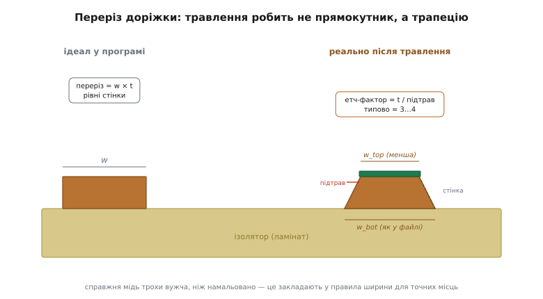
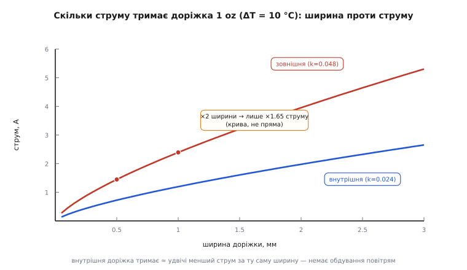
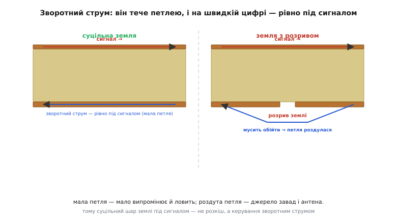
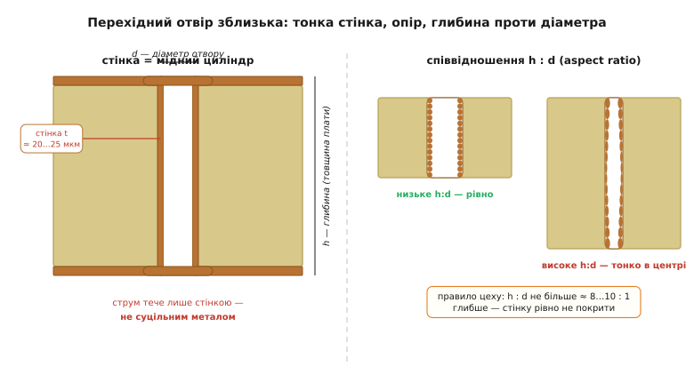

# Що таке друкована плата: шари, доріжки, перехідні отвори

<preknowlist>
- [Питомий опір і провідність](root:ph-condensed/resistivity) — опір провідника = ρ · довжина / переріз; звідки береться ρ і чому мідь має мале ρ.
- [Електричний опір](root:ph-condensed/resistance) — R = ρL/A; як геометрія провідника задає його опір.
- [Опір і температура](root:ph-condensed/resistance-temperature) — опір міді росте з нагрівом (додатний температурний коефіцієнт α ≈ 0.4 % на градус).
- [Джоулеве тепло](root:ph-electromagnetism/joule-heating) — провідник зі струмом розсіює потужність I²·R у вигляді тепла.
- [Тепловий опір і відведення тепла](root:ph-thermodynamics/thermal-resistance) — перепад температури = потужність · тепловий опір; як тепло тече від гарячого до холодного.
- [Скін-ефект](root:hw-components/skin-effect) — на високій частоті струм тисне до поверхні провідника, залишаючи серцевину порожньою.
</preknowlist>

Базову картину ми вже склали: плата — це пиріг зі скло-епоксидного ізолятора й мідної фольги, мідь травленням перетворюють на доріжки й майданчики, зверху її закриває паяльна маска, а між шарами струм перестрибує перехідним отвором. Цього досить, щоб упізнати плату й зрозуміти, що на ній діється. Але щойно ви сідаєте **проєктувати** плату — а не просто дивитися на неї, — з'ясовується, що майже кожен її розмір є **числом, яке треба порахувати**, і що мідь, якою ви з'єднали деталі, поводиться не як ідеальний дріт зі схеми, а як повноцінний елемент кола з опором, індуктивністю та ємністю. Саме про це глибший розбір: не «що таке плата», а **чому кожна її цифра саме така** й **як мідь стає деталлю**, з якою доводиться рахуватися.

Ми підемо тим самим маршрутом, що й у базовій статті, але на кожному кроці спускатимемося на шар глибше: від «FR-4 — стандартний ламінат» до того, за якої температури він розм'якшується й чому це вбиває плату; від «доріжка має опір» до формули цього опору, виведеної з нуля; від «via — металізований отвір» до того, чому його не можна зробити як завгодно глибоким. Наприкінці ви дивитиметеся на зелений прямокутник інакше — як на **кероване тривимірне мідне тіло**, у якому опір, тепло, індуктивність і зворотний струм — величини, якими інженер керує свідомо.

## Ламінат — не просто ізолятор, а матеріал зі своїми межами

У базовій статті ламінат був «твердою пластиною, що тримає форму й нічого не проводить». Для першого знайомства цього досить. Та насправді ламінат — це **композит із власним характером**, і три його властивості диктують, що з платою можна робити, а чого не можна: за якої температури він поводитиметься, як швидко по ньому біжить сигнал і скільки він при цьому втрачає.

### Склад: тканина, смола і два масштаби

FR-4 — не однорідний пластик. Це **тканина**: реальні нитки скловолокна, зіткані в полотно (з утоком і основою — двома напрямками ниток), просочені епоксидною смолою й запечені. Ця тканинна природа має прямий наслідок: **матеріал неоднаковий у різних напрямках**. Уздовж нитки — одні властивості, поперек — інші, а по діагоналі, де сигнал іде то над скляною ниткою (діелектрична проникність скла εᵣ ≈ 6), то над «вікном» чистої смоли між нитками (εᵣ ≈ 3), — треті. Для повільних сигналів це байдуже. Але коли по доріжці біжить швидкий фронт, він частину шляху летить «над склом», а частину «над смолою», і його швидкість трохи стрибає — це реальний головний біль високошвидкісних плат, який називають **glass-weave skew**. Тут ми лише позначаємо цей ефект; він оживає в темі про [цілісність сигналу](root:embedded/signal-integrity), а зараз важливо запам'ятати причину: ламінат — не суцільна речовина, а тканина, і його однорідність — зручна ілюзія, що ламається на швидкості.

### Скляний перехід: температура, за якої смола «здається»

Найважливіше число ламінату після діелектричної проникності — **температура склування** (англ. *glass transition temperature*, Tg). Це не температура плавлення: FR-4 не плавиться, як віск. Це поріг, за яким **застигла смола розм'якшується** — з твердого склоподібного стану переходить у гумоподібний. Нижче Tg епоксидка тримає нитки скла жорстко; вище Tg вона стає піддатливою, і весь пиріг починає поводитися інакше.

Для звичайного FR-4 Tg лежить у діапазоні **130…140 °C**; існують «високо-Tg» ґатунки з Tg 170…180 °C для важчих умов. *(Статус: усталено — діапазони задокументовані в даташитах ламінатів.)* Чому цей поріг критичний? Бо коли смола розм'якшується, різко зростає її **теплове розширення по товщині плати** (по осі Z). Ламінат і так розширюється при нагріві, але **нерівномірно**: скляні нитки тримають розміри в площині плати, тож розпирає її переважно **вгору-вниз**, крізь товщу. А крізь товщу проходять металізовані отвори — тонкі мідні циліндри. Коли плата, нагріта вище Tg (наприклад, під час паяння), розпирається по Z сильніше, ніж витримує мідь у стінці отвору, ця **мідна стінка тріскає**. Отвір, що виглядав ідеально, стає обривом — і плата, зібрана бездоганно, не працює. Ось чому Tg — не абстрактна цифра з паспорта, а межа, за якою ваша плата фізично руйнується зсередини.

> 🔧 **Навіщо це.** Безсвинцеве паяння вимагає вищих температур (пік близько 245…260 °C проти ~215 °C для старого свинцевого припою), і плата в цей момент **проходить крізь свій Tg** і йде вище. Якщо взяти дешевий низько-Tg ламінат для плати, яку паятимуть безсвинцево та ще й у кілька заходів (двобічний монтаж, ремонт), мідь у стінках отворів накопичує мікротріщини з кожним нагрівом — і пристрій починає збоїти не одразу, а через місяці, від температурних циклів. Вибір «звичайний чи високо-Tg FR-4» — це не примха, а рішення про **надійність з'єднань крізь плату**.

За Tg іде ще один поріг — **температура розкладання** (англ. *decomposition temperature*, Td, близько **300…350 °C**), за якої смола вже не просто м'якне, а **хімічно розпадається**, безповоротно втрачаючи масу (Td визначають як точку, де матеріал утратив 5 % ваги). Це остаточна межа: перегрів вище Td руйнує ламінат назавжди. Між Tg і Td лежить робочий коридор, у якому плату можна паяти, не вбиваючи її.

### Проникність і втрати: ціна швидкості

Дві електричні цифри ламінату — **діелектрична проникність** (εᵣ, вона ж Dk) і **тангенс втрат** (tan δ, він же Df) — у базовій статті згадувалися лише мимохідь (εᵣ ≈ 4.3). Розберемо, що кожна означає фізично й що вона коштує.

Проникність εᵣ каже, у скільки разів ізолятор «сповільнює» електричне поле порівняно з вакуумом. Для сигналу на платі це прямо задає **швидкість поширення**: сигнал біжить доріжкою не зі швидкістю світла у вакуумі, а повільніше — приблизно в √εᵣ разів. Для FR-4 з εᵣ ≈ 4.3 це √4.3 ≈ 2.07 раза, тобто:

```
v ≈ c / √εᵣ = 3·10⁸ / 2.07 ≈ 1.45·10⁸ м/с
```

Приблизно **половина швидкості світла**, або зручним інженерним числом — близько **7 наносекунд на метр** доріжки (для доріжки на поверхні, де частина поля йде повітрям, ефективна проникність нижча й затримка ближча до 6 нс/м). Для повільного мікроконтролера це неважливо. Але для швидкої шини, де сигнал має прийти вчасно, ця затримка — величина, яку рахують і яку **вирівнюють**, роблячи паралельні доріжки однакової довжини (звідси «змійки» на платах пам'яті). Проникність, отже, — не абстрактна константа, а множник затримки, вбудований у сам матеріал.

Тангенс втрат tan δ каже інше: **яку частку енергії сигналу ізолятор з'їдає й перетворює на тепло** щоразу, коли поле в ньому змінюється. Для FR-4 tan δ ≈ 0.02 — це «дірява» ізоляція за мірками високої частоти. На постійному струмі й низьких частотах вона байдужа. Але втрати ростуть із частотою: що швидше змінюється поле, то більше циклів «зарядив-розрядив» діелектрик за секунду, і на кожному він гризе частинку енергії. Тому на одиницях гігагерц сигнал у звичайному FR-4 помітно **згасає по довжині** — і для таких швидкостей беруть спеціальні «низьковтратні» ламінати з tan δ ≈ 0.005 і менше. FR-4 популярний не тому, що він добрий, а тому, що він **достатньо добрий і дешевий** для переважної більшості плат; його межі — це якраз межі, за якими починається дорога високочастотна техніка.

## Мідь як провідник: опір, виведений із нуля

Тепер спустимося в мідь і порахуємо те, що базова стаття лишила якісним. Там доріжка «мала маленький опір, тим більший, чим вона довша й тонша». Виведемо цей опір як формулу — бо саме ним інженер оперує щодня, обираючи ширину.

### Питомий опір, товщина й винахід «ома на квадрат»

Опір будь-якого шматка провідника задається трьома речами: матеріалом (питомий опір ρ), довжиною L, якою тече струм, і площею перерізу A, крізь яку він тече:

```
R = ρ · L / A
```

Для міді ρ ≈ **1.68·10⁻⁸ Ом·м** при кімнатній температурі. *(Статус: усталено — стандартна табличка.)* Доріжка — це стрічка завширшки W і завтовшки t, тож її переріз A = W · t, і струм тече вздовж довжини L:

```
R = ρ · L / (W · t)
```

Тут ховається дуже зручна перегрупованість. Товщина мідної фольги t на всій платі **однакова** (ми її вже обрали — скажімо, 1 oz ≈ 35 мкм). Відокремимо цей сталий множник:

```
R = (ρ / t) · (L / W)
```

Величину **ρ / t** називають **поверхневим опором** (англ. *sheet resistance*, Rs). Вона залежить лише від матеріалу й товщини фольги — і не залежить від того, яку саме доріжку ви малюєте. Порахуймо її для 1 oz міді:

```
Rs = ρ / t = 1.68·10⁻⁸ / 35·10⁻⁶ ≈ 4.8·10⁻⁴ Ом ≈ 0.48 мОм
```

Одиниця тут — **«ом на квадрат»** (Ω/□), і назва спершу спантеличує: чому «на квадрат», а не на метр чи міліметр? Ось у чому геніальність цієї одиниці. Доданий опір доріжки — це Rs, помножений на відношення L/W, тобто на те, **скільки «квадратів» укладається вздовж доріжки**. Квадрат зі стороною W (хоч 0.2 мм, хоч 5 мм — байдуже) має L/W = 1 і додає рівно один Rs. Два квадрати поспіль — подвоюють. Це працює, бо ширший квадрат має і більший переріз (менший опір), і довшу сторону (більший опір) — і ці два ефекти точно скорочуються. Тож не треба знати абсолютний розмір: рахуй, скільки квадратів довжини вкладається в доріжку, множ на Rs — маєш опір.

**Опір реальної доріжки живлення.** Візьмімо доріжку 1 oz завширшки 0.5 мм і завдовжки 50 мм.
```
кількість «квадратів»:  L / W = 50 / 0.5 = 100
опір:                   R = Rs · (L/W) = 0.48 мОм · 100 = 48 мОм
```
Якщо цією доріжкою тече 1 А, на ній падає U = I·R = 1 · 0.048 = 48 мВ і розсіюється P = I²R = 1² · 0.048 = 48 мВт тепла. Для сигналу 48 мОм — ніщо. Але для лінії живлення 3.3 В, що годує чутливий вузол, 48 мВ просадки вже можуть мати значення, а 48 мВт локального тепла — нагріти саме цю доріжку. **Висновок:** ширину силової доріжки обирають не «щоб гарно», а рахуючи цю просадку й це тепло.

### Пастка: опір міді росте з нагрівом

Ми взяли ρ при кімнатній температурі. Але мідь має **додатний температурний коефіцієнт**: її опір росте приблизно на **0.393 % на кожен градус** нагріву (α ≈ 0.00393/°C). *(Статус: усталено.)* Це не дрібниця, а зачаток небезпечного зворотного зв'язку:

```
доріжка гріється струмом  →  її опір росте  →  на тому самому струмі
росте втрата I²R  →  доріжка гріється ще дужче  →  ...
```

Порахуймо масштаб. Доріжка, що на 50 °C гарячіша за кімнату, має опір:

```
R(T) = R₀ · (1 + α·ΔT) = R₀ · (1 + 0.00393 · 50) = R₀ · 1.197
```

Тобто на **~20 % більший**, ніж «холодний» опір із паспорта. Для помірних струмів петля зворотного зв'язку затухає (тепло встигає стікати, і система знаходить рівновагу при якійсь підвищеній температурі). Але біля межі — коли доріжка й так ледь тримає струм — ці зайві 20 % опору додають зайвого тепла, яке додає опору, і плата може «поповзти» в перегрів. Ось чому в розрахунку струму закладають **запас**: холодний опір оманливо малий, а працює доріжка гарячою.

### Доріжка — не прямокутник: трапеція від травлення

Ще одне спрощення базової статті: там доріжка мала переріз W · t, ніби це акуратний прямокутник. Реальна доріжка — **трапеція**, і причина в самій хімії травлення.

Травник — рідина. Він роз'їдає мідь **у всіх напрямках однаково** (це називають ізотропним травленням): не лише вглиб, від поверхні до ізолятора, а й **убік** — під край захисної плівки-резиста, що прикриває майбутню доріжку. Поки травник прогризає мідь на всю товщину вниз, він устигає підточити її й з боків, «залізши» під маску. У результаті доріжка виходить **вужчою зверху, ширшою знизу** — з похилими стінками. Це називають **підтравом** (англ. *undercut*), а міру похилості — **етч-фактором** (англ. *etch factor*): відношення товщини міді до глибини бічного підточення. Типовий етч-фактор — близько **3…4**. *(Статус: усталено — стандартне визначення процесу.)*


*Ліворуч — доріжка, як її задано в програмі: рівний прямокутник шириною w. Праворуч — та сама доріжка після травлення: травник гризе мідь і вбік, підточуючи її під захисною плівкою, тож переріз стає трапецією — вужчою зверху (w_top), ширшою знизу (w_bot). Похилість стінки задає етч-фактор (товщина міді, поділена на бічний підтрав). Через це реальна мідь трохи вужча за намальовану — і в точних місцях цю різницю закладають наперед.*

Наслідків два. Перший, практичний: **справжня ширина доріжки менша за намальовану**, і для тонких критичних ліній (де важлива точна геометрія — наприклад, контрольований імпеданс) цей підтрав компенсують, малюючи трохи ширше, ніж треба «на папері». Другий, тонший: коли рахуєш переріз під струм, треба пам'ятати, що реальна площа міді — це площа **трапеції**, трохи менша за W · t прямокутника. Для грубих оцінок різницею нехтують, але вона пояснює, чому виміряний опір готової доріжки завжди трохи вищий за розрахований із номінальної ширини.

## Скільки струму тримає доріжка: формула IPC-2221, виведена

Найпрактичніше питання про доріжку — **яку ширину дати під такий-то струм**. У базовій статті відповідь була якісною: «ширша мідь — менший опір і менше гріється». Тепер — власне число, і звідки воно береться.

Ключова ідея — **теплова рівновага**. Доріжка гріється, бо розсіює P = I²R. Це тепло має кудись подітися: стекти в ізолятор, у сусідню мідь, у повітря. Доріжка нагрівається доти, доки **тепло, яке вона віддає, не зрівняється з теплом, яке вона виробляє**. Чим гарячіша доріжка щодо оточення, тим швидше вона віддає тепло. Отже, для кожного струму встановлюється якийсь перепад температури ΔT над оточенням — і питання «яка ширина під струм» насправді є питанням «яка ширина, щоб ΔT не перевищив прийнятного» (типово беруть ΔT = 10 °C).

Точно вивести цю рівновагу з фізики важко: тепловіддача доріжки залежить від купи речей — теплопровідності ламінату, сусідньої міді, конвекції повітря. Тому галузь пішла емпіричним шляхом: **нагріли реальні доріжки різної ширини різними струмами, зміряли ΔT і підігнали формулу під заміри**. Так з'явилася формула стандарту **IPC-2221**:

```
I = k · ΔT⁰·⁴⁴ · A⁰·⁷²⁵
```

де I — струм в амперах, ΔT — допустимий перепад температури в °C, A — площа перерізу доріжки в **квадратних мілах** (mil² — імперська одиниця, 1 mil = 0.0254 мм), а k — коефіцієнт, що залежить від того, де доріжка: **k = 0.048 для зовнішньої** (на поверхні, обдувається повітрям і добре холоне) і **k = 0.024 для внутрішньої** (замурована в ламінат, холоне лише теплопровідністю). *(Статус: усталено — формула прямо зі стандарту.)*

Розберемо, чому формула саме така, бо кожен показник несе фізику.

**Чому ΔT у степені 0.44, а не 1?** Якби доріжка віддавала тепло суто теплопровідністю, ΔT був би пропорційний потужності лінійно. Але тепловіддача — суміш провідності, конвекції та випромінювання, і сумарно вона зростає з ΔT **швидше, ніж лінійно** (гарячіше тіло віддає тепло непропорційно активніше). Показник 0.44 — це підгонка під реальну змішану тепловіддачу: щоб подвоїти допустимий струм за рахунок самого лише вищого ΔT, перегрів довелося б збільшити не вдвічі, а приблизно вп'ятеро (бо 2 = ΔT_ratio⁰·⁴⁴ дає ΔT_ratio ≈ 5).

**Чому площа у степені 0.725, а не 1?** Це найважливіший і найнеінтуїтивніший момент. Наївно здається: удвічі ширша доріжка має вдвічі менший опір, отже, при тому самому ΔT потягне вдвічі більший струм. Це було б так, **якби ширша доріжка тільки виробляла менше тепла**. Але вона й **віддає** тепло не пропорційно ширині: тепло стікає переважно з країв доріжки та з її поверхні, а внутрішня частина широкої доріжки «задихається» — їй нема куди скидати жар, окрім як убік, до країв. Тобто зі зростанням ширини охолодна здатність росте повільніше за саму ширину. Підсумок обох ефектів дає показник **менше одиниці** — 0.725. На практиці це означає жорстку розплату:

**Подвоєння ширини не подвоює струм.** Порівняймо доріжки 0.5 мм і 1.0 мм (1 oz, зовні, ΔT = 10 °C).
```
переріз 0.5 мм:  A = (0.5/0.0254) · 1.378 ≈ 27.1 mil²
переріз 1.0 мм:  A = (1.0/0.0254) · 1.378 ≈ 54.3 mil²   (рівно вдвічі)
струм 0.5 мм:    I = 0.048 · 10⁰·⁴⁴ · 27.1⁰·⁷²⁵ ≈ 1.45 А
струм 1.0 мм:    I = 0.048 · 10⁰·⁴⁴ · 54.3⁰·⁷²⁵ ≈ 2.39 А
відношення:      2.39 / 1.45 ≈ 1.65
```
Ширину подвоїли, а струм зріс лише в **1.65 раза**. Щоб реально подвоїти струм, доріжку треба розширити приблизно в 2.6 раза (бо 2 = ratio⁰·⁷²⁵ дає ratio ≈ 2.61). Ось чому широкі силові доріжки «жеруть» місце нелінійно: кожен наступний ампер коштує дедалі більше міді.


*Скільки струму тримає доріжка 1 oz при перегріві 10 °C залежно від ширини. Крива, а не пряма: подвоєння ширини (наприклад, з 0.5 до 1.0 мм) додає лише близько 1.65 раза струму, бо охолодна здатність доріжки росте повільніше за її ширину. Внутрішня доріжка (нижня крива) тримає приблизно вдвічі менший струм за ту саму ширину — вона замурована в ламінат і не обдувається повітрям.*

**Чому внутрішня доріжка вдвічі слабша?** Множник k відрізняється рівно вдвічі (0.024 проти 0.048), і фізика проста: зовнішня доріжка має одну грань, відкриту в повітря, звідки тепло йде конвекцією; внутрішня замурована ізолятором з усіх боків і може віддавати жар лише повільною теплопровідністю крізь смолу. Тому, розводячи живлення, силові шини воліють класти **на зовнішніх шарах** — там та сама мідь тягне вдвічі більший струм.

> 🔧 **Навіщо це.** Ця формула — щоденний інструмент: під кожну лінію живлення ви прикидаєте струм і з кривої (чи оберненої формули) знаходите мінімальну ширину під заданий перегрів. Але треба знати й **її межі чесно**: IPC-2221 — консервативна підгонка під дуже старі (1950-х років) заміри поодинокої доріжки у вільному просторі. Вона не враховує ні сусідніх доріжок, ні мідних полігонів поруч (які холодять), ні теплопровідних via, ні реального стеку. Тому в житті вона дає **занижений** (безпечний) струм — доріжка витримає більше. Точніший наступник, **IPC-2152**, урахував ближнє оточення й дає реалістичніші числа; але для швидкої оцінки «на серветці» стара формула досі жива саме через свою простоту й безпечний запас. Повний розрахунок ширини під струм із кодом — у [калькуляторі мідної геометрії](root:embedded/pcb-intro/proj-copper-calc.md).

## Мідь як індуктивність і ємність: чому «дріт» не ідеальний

Ось кульмінація, заради якої й затіяно детальний розбір. Базова стаття кинула тезу: «мідь, якою ви з'єднали деталі, сама є деталлю». Тепер зробимо цю тезу точною. Доріжка — не лише опір. Це ще **індуктивність** (вона опирається зміні струму) і, разом із сусідньою міддю, **ємність** (вона накопичує заряд). На постійному струмі ці приховані елементи сплять. На швидкій цифрі й високому струмі вони прокидаються — і плата, бездоганна за схемою, починає жити власним життям.

### Індуктивність доріжки: чому широка й коротка

Будь-який провідник зі струмом створює навколо себе магнітне поле, а поле запасає енергію — це і є індуктивність. Зміна струму мусить змінити це поле, а на це потрібен час і напруга: L опирається різкій зміні струму. Для доріжки груба, але корисна оцінка — **близько 1 нГн на міліметр довжини** (точне число залежить від ширини й висоти над опорним шаром). Здається, дрібниця. Але подивімося, що вона робить на швидкому фронті.

Коли цифровий вихід перемикається, струм у доріжці змінюється дуже швидко — скажімо, на 20 мА за 1 нс. Напруга, яку наведе на собі індуктивність доріжки завдовжки 20 мм (L ≈ 20 нГн), така:

```
U = L · (ΔI / Δt) = 20·10⁻⁹ · (0.02 / 1·10⁻⁹) = 20·10⁻⁹ · 2·10⁷ = 0.4 В
```

**0.4 вольта** просадки, наведеної самою лише доріжкою на різкій зміні струму. Для лінії живлення це катастрофа: у момент перемикання напруга на кінці доріжки провалюється, і вузол, який вона годує, на мить недоживлений. Ось чому біля кожної мікросхеми ставлять [конденсатор розв'язки](root:hw-components/decoupling) — локальний запас заряду, що віддає струм миттєво, поки далека доріжка живлення «розганяється». І ось чому доріжки живлення й землі роблять **широкими й короткими**: ширша й коротша мідь має меншу індуктивність, отже, менше опирається кидку струму. Індуктивність — прихована, її не видно на схемі, але вона диктує топологію.

### Взаємна ємність і зворотний струм — найглибший шар

Дві сусідні мідні поверхні, розділені ізолятором, — це конденсатор. Доріжка над суцільним шаром землі — теж конденсатор (доріжка й площина як дві обкладки). І тут відкривається головна ідея, без якої не зрозуміти сучасну плату: **струм завжди тече петлею**. Він виходить із джерела, біжить сигнальною доріжкою до навантаження — і **мусить повернутися назад** до джерела. Зворотний шлях так само реальний, як і прямий; просто на схемі він схований у символі «землі».

Питання: **яким шляхом повертається струм**? На низькій частоті — найкоротшим за опором, тобто просто по міді землі, найпрямішою дорогою. Але на **високій** частоті зворотний струм вибирає шлях **найменшої індуктивності**, а це — шлях найменшої **площі петлі**. Петля «сигнал туди, повернення назад» тим менша, чим ближче зворотний струм тримається під самим сигналом. Тому над суцільним шаром землі швидкий зворотний струм тече **рівно під сигнальною доріжкою**, дзеркально повторюючи її, — щоб петля була якнайменшою. Мідь землі під сигналом — це не пасивне «нуль вольт», а **активний зворотний провідник**, що сам знаходить оптимальний шлях.


*Струм тече замкненою петлею: сигнал біжить доріжкою туди, зворотний струм по землі повертається назад. Ліворуч — над суцільним шаром землі швидкий зворотний струм тримається рівно під сигналом, і петля мала. Праворуч — розрив у площині землі перегороджує йому прямий шлях, і струм мусить обійти перешкоду; петля роздувається. Мала петля мало випромінює й мало ловить заваду; роздута петля стає і антеною-передавачем, і антеною-приймачем. Тому суцільний шар землі під сигналом — це керування зворотним струмом, а не розкіш.*

Тепер зрозуміло, чому **розрив у шарі землі шкідливий**. Якщо під сигнальною доріжкою в площині землі є проріз (наприклад, її прорізав ряд перехідних отворів або вирізаний майданчик), зворотний струм не може текти прямо під сигналом — він **мусить обійти** проріз, роблячи гак. Петля «туди-назад» різко роздувається. А велика петля струму — це маленька **рамкова антена**: вона і випромінює перешкоди назовні (плата «світить» на радіочастотах, не проходить сертифікацію), і ловить чужі наводки всередину. Так невинний на вигляд розрив землі перетворює акуратну доріжку на джерело й приймач завад. Ось у чому глибокий сенс тези «мідь — це деталь»: суцільний шар землі — не просто зручний спосіб розвести нуль, а **інструмент керування зворотним струмом**, і його цілісність доводиться берегти свідомо. Внутрішні шари багатошарової плати цінні саме цим: вони віддають цілий шар під суцільну землю, щоб кожен сигнал мав під собою неперервну мідну опору.

Доріжка як пара провідників (сигнал + його опорна земля) має ще одну зведену властивість — **характеристичний імпеданс**, який на швидкій цифрі перетворює доріжку на **лінію передачі**, де сигнал може відбиватися, як луна від стіни. Це окремий великий апарат — [доріжка як лінія передачі: імпеданс і відбиття](root:hw-pcb/pcb-stackup-rf/detail); тут досить того, що ємність і індуктивність доріжки разом задають цей імпеданс, і саме тому геометрію швидких доріжок (ширину, висоту над землею) рахують, а не беруть «на око».

## Перехідний отвір зблизька: тонка стінка з опором і глибиною

Повернімося до via й спустимося глибше за базове «просвердлений і металізований канал». Отвір теж має **числа**: опір, індуктивність, граничну глибину й здатність тягти струм і тепло.

### Струм тече стінкою, а не металом

Ключове, що легко проґавити: усередині via **порожній**. Мідь — лише тонка **стінка-циліндр** на поверхні просвердленого каналу; серцевина отвору — повітря (або, у деяких процесах, заповнювач). Товщина цієї стінки за нормами IPC — у середньому **20 мкм** (клас 2) чи **25 мкм** (клас 3), і в жодній точці не тонша за ~18…20 мкм. *(Статус: усталено — вимоги IPC-6012.)* Тобто струм крізь via тече не крізь суцільний мідний стовпчик, а крізь **тонкостінну трубку**, і її провідний переріз — це площа **кільця** (різниця площ зовнішнього й внутрішнього кіл), а не круга.


*Ліворуч — via в розрізі: провідник — тонка мідна стінка (≈ 20…25 мкм) на поверхні каналу, а серцевина порожня; струм тече лише стінкою. Розміри, що все вирішують: діаметр отвору d і глибина h (дорівнює товщині плати). Праворуч — чому глибину обмежують: за низького співвідношення h : d гальваніка вкриває стінку рівно, а за високого (глибока вузька дірка) метал у центрі осідає тонше, бо свіжому розчину важко туди дістатися. Правило цеху — h : d не більше приблизно 8…10 : 1.*

Порахуймо опір типового наскрізного via в платі 1.6 мм: діаметр отвору 0.3 мм, стінка 25 мкм.
```
зовнішній радіус трубки:  r_out = 0.15 мм
внутрішній радіус:        r_in  = 0.15 − 0.025 = 0.125 мм
площа кільця:  A = π·(r_out² − r_in²) = π·(0.15² − 0.125²) мм²
                = π·(0.0225 − 0.015625) = π·0.006875 ≈ 0.0216 мм² = 2.16·10⁻⁸ м²
довжина (глибина плати):  L = 1.6 мм = 1.6·10⁻³ м
опір:  R = ρ·L/A = 1.68·10⁻⁸ · 1.6·10⁻³ / 2.16·10⁻⁸ ≈ 1.24·10⁻³ Ом ≈ 1.2 мОм
```
Близько **міліома** — мізерно для сигналу. Та все ж один via **не завжди досить під сильний струм**: якщо крізь перехід у живленні йде кілька ампер, ставлять **кілька паралельних via**, щоб поділити струм і зменшити сумарний опір та нагрів. І та сама тонка стінка дає via маленьку **індуктивність** (груба оцінка — близько 1 нГн на переривання), яка на швидкому фронті поводиться так само, як індуктивність доріжки: чим більше via в сигнальному шляху, тим більше він опирається різкій зміні струму.

### Аспектне співвідношення: чому дірку не зробиш як завгодно глибокою

Тут ховається обмеження, про яке базова стаття мовчала. Металізують стінку **гальванікою**: плату кладуть у ванну з розчином міді, і мідь осідає на струмопровідній (попередньо хімічно активованій) поверхні каналу. Проблема в тому, що **свіжому розчину важко дістатися вглиб вузької дірки**. Біля входу в отвір розчин рясний, і мідь осідає товсто; а в **середині** глибокого вузького каналу розчин застоюється, обмінюється повільно — і мідь там осідає **тонше**. Здатність рівномірно покрити глибину називають **розсіювальною здатністю** ванни (англ. *throwing power*).

Звідси головна геометрична межа via — **аспектне співвідношення** (англ. *aspect ratio*): відношення глибини отвору (= товщини плати) до його діаметра. Що глибша й вужча дірка, то гірше покривається її середина. На практиці цех тримає це відношення **не більше ~8…10 : 1** для звичайного механічного свердління; за вищого — стінка в центрі виходить занадто тонкою або з розривами, і надійність падає. *(Статус: усталено — типові виробничі межі.)* Ось чому не можна просто взяти дуже товсту плату й насвердлити в ній тонких отворів: діаметр отвору знизу обмежений товщиною плати. Хочете тонші via — робіть тоншу плату або переходьте на дорожчі процеси (лазерне свердління мікро-via в тонких шарах, послідовне пресування).

### Via як тепловий міст

Ще одна робота отвору, згадана в базі мимохідь, — **проводити тепло**. Мідна стінка via — це доріжка для жару так само, як для струму. Під гарячою деталлю (силовим ключем, регулятором) ставлять **масив теплових via** — решітку отворів, що з'єднують верхній мідний майданчик під деталлю з внутрішніми й нижнім мідними шарами. Тепло, що інакше застрягло б у верхній міді, стікає крізь ці via в товщу плати, розтікається по внутрішніх полігонах і скидається з більшої площі. Кожен via сам по собі проводить небагато (тонка стінка — невеликий переріз), тому їх ставлять **масивом**: більше отворів — менший сумарний тепловий опір донизу. Скільки саме ставити й з яким кроком — це вже тепловий розрахунок, до якого ми ще дійдемо: [тепловідведення на платі](root:embedded/pcb-thermal-design). Тут важлива сама ідея: **via — це універсальний вертикальний зв'язок** у платі, і для струму, і для тепла, і його «пропускну здатність» нарощують кількістю.

## Як народжується багатошарова плата: механіка пресування

Базова стаття сказала, що багатошарову плату «збирають і пресують» з осердь і препрегів. Розберемо цей процес глибше, бо з нього випливає купа обмежень, які інженер потім бачить у правилах виробника.

Почнемо з того, **чому взагалі не можна витравити багатошарову плату як двобічну**. Внутрішні мідні шари фізично **всередині** пирога — до них немає доступу зовні, коли плата вже суцільна. Тому послідовність зворотна: спершу роблять **окремі внутрішні шари**, а тоді **склеюють** їх у моноліт. Одиниця складання — **осердя** (англ. *core*): тонкий, уже затверділий двобічний ламінат, на обох боках якого **вже витравлено** внутрішній малюнок міді. Між осердями (і між осердям та зовнішньою фольгою) кладуть **препрег** — аркуш скловолокна, просоченого смолою, яку **ще не допекли** до твердості. Препрег — це «недороблений ламінат», клей у формі листа.

Далі стос — осердя, препреги, зовнішня фольга — кладуть під **гарячий прес**. Тут відбувається головне: недопечена смола препрегу від тепла й тиску спершу **розм'якшується й тече**, заповнюючи всі проміжки між доріжками внутрішніх шарів (мідь-бо витравлена рельєфом — там, де міді нема, смола має затекти й вирівняти), а тоді **остаточно полімеризується** — застигає назавжди, склеївши весь стос у неподільну плиту. З цього моменту шари вже не роз'єднати: препрег став таким самим твердим ламінатом, як осердя, і межі між ними зникли.

З цієї механіки випливають реальні наслідки, які інженер зустрічає в правилах:

- **Внутрішні шари тонші.** Осердя й препреги роблять тонкими, щоб плата не виходила надто товстою; звідси й менша товщина внутрішньої міді, і той факт, що внутрішні доріжки гірше холонуть (ми це вже бачили в множнику k).
- **Смолі треба куди текти.** Якщо на внутрішньому шарі велика суцільна залита міддю площа поряд із порожньою — розподіл міді нерівномірний, і при пресуванні смола тече нерівно, плата може покоробитися. Тому великі мідні заливки **«штрихують» сіткою** або збалансовують мідь по шарах — щоб пресування було рівномірним.
- **Шари треба сумістити.** Малюнок кожного внутрішнього шару, отвори й зовнішні шари мусять збігтися з точністю до частки міліметра (**реєстрація** шарів). Що більше шарів, то важче їх усі вирівняти, — і тим дорожча плата.
- **Глухі й заховані via — це окремі проходи.** Щоб зробити захований via (лише між внутрішніми шарами), відповідні осердя треба **просвердлити й металізувати ще до** загального пресування, а тоді вкласти в стос. Кожен такий «підпакет» — окремий цикл свердління-металізації-пресування. Ось справжня причина, чому глухі й заховані отвори помітно дорожчі: вони множать кількість виробничих проходів.

Скільки шарів брати, як їх упорядкувати (де землі, де живлення, де сигнали) і чому саме так — це **шарування плати** (stackup), окрема глибша тема: [шарування плати (stackup)](root:hw-pcb/pcb-stackup). Для нас тут головне — зрозуміти, що багатошарова плата не «витравлена», а **вирощена пресуванням**, і що більшість обмежень на via й мідь ідуть саме з цієї механіки.

## Де все це ламається: граничні випадки

Зберемо докупи межі, за якими акуратна теорія плати перестає працювати, — бо саме на цих межах живе реальна інженерія.

**Тріщина стінки via від температурних циклів.** Ми вже бачили механізм: нагрів вище Tg різко збільшує розширення плати по осі Z, і мідна стінка отвору, розтягувана цим розширенням, накопичує втому. При багатьох циклах «нагрів-охолодження» (паяння, ремонт, а потім робочі коливання температури) стінка може тріснути — надто в тонкому місці глибокого via. Це головний аргумент за високо-Tg ламінат і за помірні аспектні співвідношення в надійних виробах.

**Кислотна пастка.** Якщо дві доріжки сходяться під **гострим кутом** (менше 90°), у вершині кута під час травлення застоюється травник — його важче вимити, ніж із тупого кута. Він продовжує гризти мідь у вершині вже після того, як решта дотравилася, — і **підточує доріжку** саме там, де вона й так вузька. Тому гострих кутів між доріжками уникають, а повороти роблять двома тупими згинами (45°) замість одного прямого чи гострого. Це не естетика — це захист від локального перетравлення.

**Вологість і провідні містки.** Скло-епоксидка не абсолютно герметична: вона **вбирає вологу** з повітря. Волога сама по собі трохи псує ізоляцію (росте tan δ, падає опір ізоляції), а в парі з електричним полем між сусідніми провідниками може з часом рости тонкий провідний місток **уздовж скляних ниток** усередині ламінату — це явище зветься CAF (провідна анодна нитка). Через це між сусідніми via й доріжками під напругою тримають достатній зазор, а перед паянням вологу з плати **виганяють просушуванням** (інакше різкий нагрів перетворить увібрану вологу на пару, і плата може розшаруватися — «попкорн-ефект»).

**Скупчення струму на кутах.** Струм у доріжці розподілений не ідеально рівно: на **внутрішньому боці повороту** й у місцях різкої зміни ширини він скупчується, локально піднімаючи щільність струму й нагрів. Для сильнострумових доріжок це означає, що вузьке місце чи гострий поворот стають «гарячою точкою» раніше за решту доріжки. Тому силові доріжки ведуть плавно, без різких звужень, а критичні переходи роблять із запасом ширини.

Спільне в усіх цих випадках одне: **плата — фізичне тіло**, а не схема, і в неї є хімія травлення, механіка пресування, теплове розширення та вбирання вологи. Ідеальна модель («ізолятор + провідник») працює для розуміння, але межі надійності лежать там, де оживає матеріал.

## Що з усього цього винести

Детальна картина плати відрізняється від базової одним словом — **числа**. Плата й далі лишається шарованим мідно-ізоляторним предметом, але тепер видно, що майже кожен її параметр є величиною, якою інженер керує свідомо.

Ламінат — не просто ізолятор, а композит-тканина з межами: температура склування **Tg** (130…140 °C для звичайного FR-4), за якою смола м'якне й розпирає плату по товщині, ризикуючи стінками отворів; проникність **εᵣ ≈ 4.3**, що вдвічі сповільнює сигнал (≈ 6 нс/м); тангенс втрат **tan δ ≈ 0.02**, що з'їдає енергію тим більше, чим вища частота.

Мідь має **опір**, виведений із ρ/t як «ом на квадрат» (для 1 oz — **0.48 мОм/□**), що росте з нагрівом на **0.4 % на градус**; травлення робить доріжку **трапецією** (підтрав, етч-фактор ≈ 3…4), тож реальна мідь вужча за намальовану. Струмову ширину дає **формула IPC-2221** (I = k·ΔT⁰·⁴⁴·A⁰·⁷²⁵), у якій показник площі 0.725 означає, що **подвоєння ширини не подвоює струм**, а внутрішня доріжка тримає вдвічі менше за зовнішню.

Найглибше: мідь — це ще **індуктивність** (наведе десяті вольта на швидкому фронті — звідси широкі короткі шини й конденсатори розв'язки) і **ємність**, а разом вони роблять доріжку **лінією передачі**. Струм тече **петлею**, і зворотний струм на швидкості тримається рівно під сигналом над суцільною землею; **розрив землі** роздуває петлю й перетворює доріжку на антену завад — ось точний сенс тези «мідь — це деталь».

**Via** — тонкостінна мідна трубка (стінка 20…25 мкм), струм тече кільцем (опір ~міліоми, тому паралелять під струм), а глибину обмежує **аспектне співвідношення ~8…10 : 1**, бо гальваніці важко рівно покрити вузьку глибоку дірку. Багатошарову плату не травлять, а **вирощують пресуванням** осердь і препрегів, і з цієї механіки випливають тонші внутрішні шари, штрихування заливок, реєстрація й дорожнеча глухих via.

Наступний природний крок — як на цю плату **сідають деталі**: майданчики й отвори ми вже розуміємо аж до геометрії, лишається зрозуміти, як припій механічно й електрично приєднує до них деталь. Саме про це — [методи монтажу плат](root:embedded/pcb-assembly-methods): дві родини корпусів, наскрізний і поверхневий монтаж, і фізика того, як розплавлений припій змочує оголену мідь, яку ми щойно розібрали до останнього мікрона.
