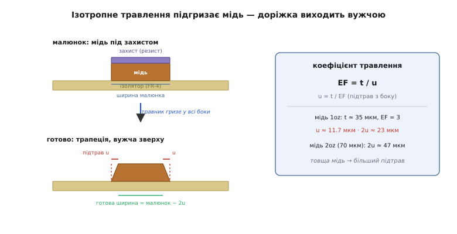
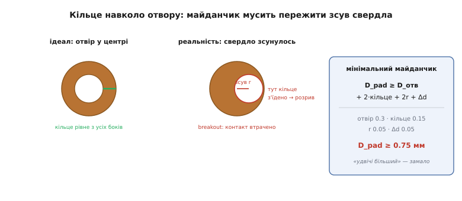
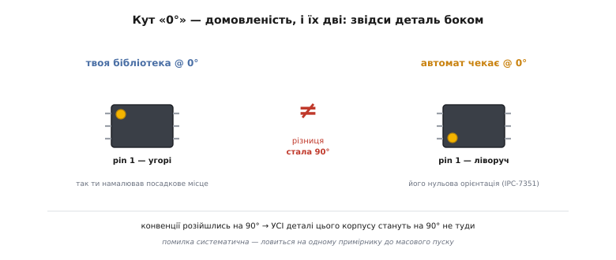
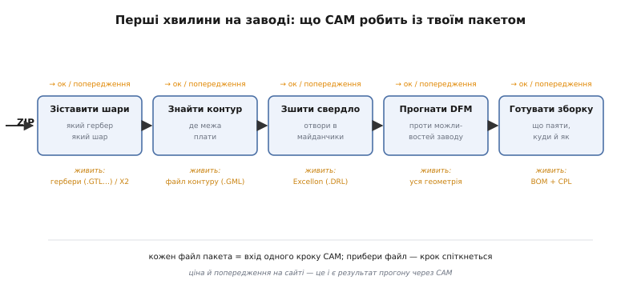

# Від схеми до замовлення: глибше в конвеєр — розводка, гербери, виробник

<preknowlist>
- [Що таке друкована плата](root:embedded/pcb-intro) — мідь на склоепоксидці, шари, доріжки, майданчики, перехідні отвори, паяльна маска.
- [Методи монтажу плат (THT і SMD)](root:embedded/pcb-assembly-methods) — деталь крізь отвір проти деталі на майданчику; звідки беруться діри й майданчики.
- [Читання схем](root:embedded/reading-schematics) — символ, вивід, зв'язок; чому схема каже «що з чим», а не «де».
- [Друкована плата (закони розводки)](book:electronics/pcb-layout) — доріжка як опір і котушка, зворотний струм, чому коротко й чому суцільна земля.
- [Закон Ома](book:electronics/ohms-law) — напруга = струм · опір; знадобиться в кожному виведенні просадки й розсіяння.
</preknowlist>

У [базовому кроці](root:embedded/pcb-layout-flow) ми пройшли конвеєр від початку до кінця й побачили його **скелет**: схема каже, що з'єднати; нетліст перекладає це в машинний список зв'язків; розводка кладе мідь у простір; пакет файлів (гербери + свердло + BOM + CPL) описує плату мовою, зрозумілою заводу; виробник за цим описом друкує мідь і повертає готову плату. Цього достатньо, щоб замовити свою першу плату й не заблукати.

Але кожна ланка цього скелета має **м'ясо**, у яке ми свідомо не пірнали. Чому найтонша доріжка саме 0.15 мм, а не 0.05 — звідки взялося це число і що фізично стається, коли ти його порушуєш? Чому навколо отвору *мусить* лишитися обід міді, і як порахувати, який найменший майданчик іще безпечний? Чому нетліст — не просто зручність, а математичний об'єкт, який дає можливість комп'ютерові *довести*, що плата відповідає схемі? Чому автомат ставить половину деталей боком, хоча координати в CPL правильні? І що насправді робить завод із твоїм ZIP-архівом у перші п'ять хвилин, ще до того як увімкнути хоч один верстат?

Ця стаття — той самий конвеєр, але **зсередини кожної ланки**. Ми не переказуватимемо скелет — ми його розкриємо: виведемо числа, які в базовому кроці просто названі; пройдемо фізику травлення міді, що диктує всі правила DFM; розберемо, як CAM-система заводу читає твої файли й де саме твоя плата ламається ще до виробництва. Мета проста: щоб після цієї статті жодне число у виробничих можливостях заводу не було для тебе магією, а лист «у вас проблема з annular ring на via поблизу U3» читався як точна адреса, куди дивитися й що робити.

## Нетліст як математичний об'єкт, а не просто список

У базовому кроці ми сказали: нетліст — це сухий список «хто з ким», єдине джерело правди між схемою і платою. Це правда, але вона ховає, **чому** саме цей проміжний об'єкт дає комп'ютерові надлюдську надійність. Розберімо глибше, бо тут криється сама причина, чому EDA взагалі здатна не дати збрехати.

Формально нетліст — це **розбиття** (англ. *partition*) множини всіх виводів схеми на класи. Кожен вивід кожної деталі — це точка. Мережа (net) — це клас точок, які електрично **тотожні**: усе, що входить в одну мережу, — це один і той самий вузол потенціалу, скільки б фізичних дротів чи доріжок його не з'єднувало. Уся схема, хоч якою складною б вона виглядала, зводиться до відповіді на одне питання для кожної пари виводів: **в одному класі вони чи в різних?**

Це не дрібниця формулювання. Саме тому, що зв'язність — відношення еквівалентності (вивід зв'язаний сам із собою; якщо A зв'язаний з B, то B з A; якщо A з B і B з C, то A з C), комп'ютер може тримати її **не як картинку, а як структуру**, яку можна порівнювати механічно. Візьми плату, простеж по фактичній міді, які майданчики фізично з'єднані доріжками, побудуй з цього своє розбиття виводів — і **порівняй два розбиття**: те, що дала схема, і те, що дала мідь. Якщо вони збігаються клас-у-клас — плата електрично тотожна схемі, крапка. Якщо ні — програма покаже кожну розбіжність двох сортів.

```
Розбіжність типу «розрив» (open):
  два виводи в ОДНОМУ класі за схемою,
  але в РІЗНИХ класах за міддю
  → зв'язок мав бути, міді нема

Розбіжність типу «замикання» (short):
  два виводи в РІЗНИХ класах за схемою,
  але в ОДНОМУ класі за міддю
  → мідь є там, де зв'язку бути не мало
```

Оці два типи помилок — **розрив** (open, забув провести) і **замикання** (short, звів зайве) — вичерпують геть усі електричні помилки розводки. Не буває третього виду: будь-яка невідповідність плати схемі — це або зайвий зв'язок, або відсутній. Тому звірка «мідь проти нетлісту», яку в EDA роблять однією командою, — це не евристика й не «на око»: це доведення тотожності двох розбиттів. Ось звідки надійність, якої людське око не дало б: людина дивиться на плату й «бачить, що начебто все з'єднано»; комп'ютер бере два формальні об'єкти й доводить, що вони поточково рівні.

> 🔧 **Навіщо це.** Коли розумієш нетліст як розбиття, стає ясно, чому в EDA є дві *різні* перевірки й навіщо обидві. **DRC** (design rule check) перевіряє геометрію — чи мідь не порушує фізичних правил заводу (§ про DFM). **ERC/звірка з нетлістом** перевіряє топологію — чи мідь описує ту саму зв'язність, що й схема. Плата може пройти DRC (усе гарно розставлено) і завалити звірку (гарно розставлено, але не те з'єднано), і навпаки. Тому перед випуском файлів запускають *обидві*: одна ловить «фізично не виготовиться», інша — «виготовиться, але це не твоя схема».

Є одна пастка, яку варто знати вже зараз. Звірка ловить лише те, що описано в нетлісті. Якщо ти забув намалювати зв'язок **на схемі** — нетліст його не міститиме, і плата, де його теж нема, чесно пройде звірку. Комп'ютер довів, що плата тотожна схемі; але схема була неповна. Тому звірка з нетлістом гарантує «плата = схема», а не «плата = правильна». Правильність схеми — усе ще на тобі.

## Розміщення: чому воно розводить себе саме

У базовому кроці ми кинули фразу: добре розміщення розводить себе майже саме, і досвідчений інженер витрачає на нього більше часу, ніж на трасування. Це звучить як приказка бувалих. Насправді за нею — кількісний факт, який можна побачити на очах.

Уяви дві деталі, які треба з'єднати `N` доріжками (скажімо, мікроконтролер і рознімач на 20 ліній). Постав їх поряд, виводами навпроти виводів — доріжки підуть короткими прямими паралельними лініями, жодна не перетне іншу. Тепер розсунь ці дві деталі на протилежні краї плати й поверни одну на 90°. Ті самі 20 зв'язків тепер мусять протягтися через усю плату, а що гірше — виводи, які були навпроти, тепер «перехрещені»: щоб їх з'єднати, доріжки муситимуть перетнути одна одну. А дві доріжки на одному боці плати перетнутися **не можуть** — мідь замкнеться. Отже, кожен такий перетин вимагає **перехідного отвору**: одна доріжка пірнає на інший бік плати, проходить під місцем перетину й виринає назад.

Ось звідки кількісний зв'язок. Приблизне число перехідних отворів, яких вимагає розводка, зростає **не лінійно, а різкіше** з тим, наскільки погано розставлені деталі, бо кожна пара «перехрещених» зв'язків додає перетин, а перетинів між `N` лініями, які йдуть «навхрест», буває близько `N²/4`. Погане розміщення двадцяти ліній може вимагати сотні via там, де добре — жодного.

```
Добре розміщення (виводи навпроти):
  20 доріжок, 0 перетинів, 0 via — усе на одному боці

Погане розміщення (деталі рознесені, навхрест):
  ~N²/4 ≈ 100 потенційних перетинів
  → десятки via, доріжки через усю плату
```

А кожен via — це не безкоштовно. Це отвір, який завод мусить просвердлити й покрити міддю (гроші й один із небагатьох способів отримати брак — про це нижче). Це розрив у суцільній землі під сигналом, куди via пробиває дірку. Це гак у шляху сигналу, що додає йому індуктивності. Тому «розміщення розводить себе саме» — не про естетику, а про те, що **грамотне розміщення прибирає перетини ще до того, як їх довелося б рятувати перехідними отворами**. Ти платиш часом на початку, щоб не платити міддю, отворами й завадами до кінця.

> 🔧 **Навіщо це.** Практичне правило, яке звідси випливає: спершу **зафіксуй те, що не рухається** (рознімачі диктує механіка корпусу — USB з краю, кнопки де зручно пальцю), тоді **притули до кожного споживача його дрібноту** (конденсатор живлення впритул до мікросхеми, підтяжку — до виводу, який вона тягне), і аж тоді **розвертай і зсувай великі деталі**, щоб їхні виводи дивилися назустріч сусідам, з якими найбільше зв'язків. Якщо після цього доріжки не хочуть лягати без десятків перетинів — це сигнал не «трасувати впертіше», а **вернутися й пересунути деталі**.

## Фізика травлення: звідки насправді береться «мінімальна доріжка»

Тепер — у серце DFM, глибше за базовий крок. Там ми назвали три межі заводу (доріжка/зазор ≈ 0.15 мм, свердло ≈ 0.3 мм, кільце навколо отвору) і сказали: у заводу скінченна роздільність. Але **чому** саме скінченна і **звідки береться саме таке число** — лишилося за кадром. А без цього правила DFM здаються довільними табличками, які треба зазубрити. Насправді вони прямо випливають із того, **як фізично роблять мідний малюнок**, і варто це побачити, бо тоді жодну межу не треба буде запам'ятовувати — вона стане очевидною.

Мідний малюнок на платі отримують **відніманням**, а не додаванням. Уся плата спершу вкрита суцільною мідною фольгою. На неї наносять захисний шар (**фоторезист**) саме там, де мідь має лишитися, — тобто малюнок майбутніх доріжок. Тоді плату купають у травнику (англ. *etchant* — хімія, що роз'їдає мідь, зазвичай розчин на основі хлориду заліза чи міді). Травник з'їдає всю відкриту мідь до ізолятора, а захищену — лишає. Знімають резист — і на платі лишається мідь точно там, де був захист.

І ось ключове, чого немає в базовому кроці. Травник — рідина, і він гризе мідь **у всі боки однаково** (це зветься **ізотропне** травлення, гр. *ísos* — «рівний» + *trópos* — «напрям»). Він іде вглиб, до ізолятора, — але заразом і **вбік, під край захисту**. Поки хімія прогризає мідь на всю її товщину донизу, вона встигає з'їсти й трохи міді збоку, залізши **під** фоторезист. Це підточування збоку зветься **підтрав** (англ. *undercut* — «підріз»). Через нього готова доріжка виходить **вужчою за той малюнок, що ти намалював**, і в перерізі має форму не прямокутника, а **трапеції**: широка внизу (біля ізолятора, куди травник дістався останнім), вужча вгорі (де він гриз найдовше).


*Чому доріжка виходить вужчою за малюнок. Травник з'їдає мідь у всі боки однаково: поки він доходить донизу (товщина t), устигає підгризти й убік, залізши під захист. Це підтрав u з кожного боку. Готова доріжка звужується зверху на 2u і має трапецієподібний переріз — широкий унизу, вузький угорі. Що товща мідь, то глибше треба травити, то більший підтрав — тому товста мідь погано тримає тонкі доріжки.*

Наскільки вужчою? Тут з'являється проста міра — **коефіцієнт травлення** (англ. *etch factor*): відношення глибини травлення (а вона дорівнює товщині міді) до бічного підтраву з одного боку.

```
коефіцієнт травлення = товщина міді / підтрав з одного боку
        EF = t / u   →   u = t / EF
```

Для звичайного заводського процесу `EF` лежить у межах приблизно **2…4** *(усталений діапазон галузі)*. Візьмімо типове: мідь 1 oz (`t` ≈ 35 мкм) і `EF` = 3.

**Звуження доріжки через підтрав.** Мідь 1 oz, коефіцієнт травлення 3.
```
підтрав з одного боку:  u = t / EF = 35 / 3 ≈ 11.7 мкм
звуження зверху всього: 2u = 2 × 11.7 ≈ 23 мкм ≈ 0.023 мм ≈ 0.9 mil
```

Доріжка, намальована на 0.15 мм (150 мкм), угорі виходить близько 150 − 23 ≈ **127 мкм**. Звуження майже на мілідюйм — і це на *звичайній* міді. А тепер дивись, що стається на **товстій** міді. Візьми 2 oz (`t` ≈ 70 мкм): підтрав з боку `u` = 70/3 ≈ 23 мкм, звуження 2u ≈ 47 мкм ≈ майже 2 mil. Удвічі товща мідь — удвічі глибше травити — удвічі більший підтрав. **Ось чому** правило заводу не одне на всі випадки: для товстої міді (силові плати, велика мідь під струм) мінімальна доріжка й зазор *більші*, ніж для звичайної. Не тому що завод вередує, а тому що фізика підтраву прямо масштабується з товщиною.

Тепер видно, звідки береться і **мінімальний зазор** між сусідніми доріжками. Дві доріжки розділяє смужка відкритої міді, яку травник має **повністю** прогризти наскрізь, щоб їх роз'єднати. Але травник підгризає з обох боків цієї смужки. Якщо смужка вужча за подвійний підтрав, травник **не встигне** зчистити мідь у щілині між доріжками до того, як переточить самі доріжки, — і дві доріжки лишаться з'єднані тонким мідним «містком». Це і є **замикання**, народжене травленням. Тому мінімальний зазор і мінімальна ширина — це **дві сторони однієї фізики**: щоб мідь надійно **лишилася** (доріжка не переточилась) і надійно **зникла** (щілина прочистилась), обидва розміри мусять бути з запасом більші за підтрав. Число 0.15 мм для звичайного процесу — це і є той запас: комфортно більший за типовий подвійний підтрав ~0.023 мм, з місцем на розкид процесу.

> 🔧 **Навіщо це.** Звідси — практичний висновок, який рятує від дорогого браку. Завод, знаючи свій підтрав, **сам розширює твій малюнок** перед травленням на величину підтраву — це зветься **компенсація травлення** (etch compensation): він малює доріжку трохи ширшою, щоб *після* підгризання вона вийшла тієї ширини, яку ти замовив. Але ця компенсація має межу: якщо ти намалював доріжку на самій межі можливостей (6 mil на звичайному процесі), заводу вже нема куди її розширювати без того, щоб з'їсти сусідній зазор. Тому «мінімальна доріжка» й «мінімальний зазор» у можливостях заводу — це не абстрактні числа, а точка, де ще лишається місце на компенсацію підтраву. Проектуй з запасом над ними, і завод має простір зробити тобі рівну мідь; проектуй на самій межі — і будь-який розкид процесу піде тобі в брак.

Ось короткий калькулятор, який рахує, наскільки завод має розширити твій малюнок, щоб *готова* доріжка вийшла заданої ширини, — саме те, що завод робить сам, але корисно бачити число:

:::tabs
```cpp
// Компенсація травлення: наскільки розширити малюнок доріжки,
// щоб ПІСЛЯ ізотропного підтраву вона вийшла цільової ширини.
// Усі величини — у мікрометрах.
struct EtchComp {
    float target_um;   // цільова ширина готової доріжки
    float draw_um;     // ширина, яку слід намалювати (з компенсацією)
    float undercut_um; // підтрав з одного боку
};

EtchComp etch_compensate(float target_um,
                         float copper_thickness_um, // 35 = 1oz, 70 = 2oz
                         float etch_factor)          // типово 2..4
{
    EtchComp r;
    r.target_um    = target_um;
    r.undercut_um  = copper_thickness_um / etch_factor;   // u = t / EF
    // готова = намальована − 2u  ⇒  намальована = цільова + 2u
    r.draw_um      = target_um + 2.0f * r.undercut_um;
    return r;
}

// Приклад: хочемо готову доріжку 150 мкм на міді 1oz, EF=3
//   u        = 35 / 3      ≈ 11.7 мкм
//   малювати = 150 + 23.4  ≈ 173.4 мкм
// Тобто щоб отримати рівні 150 мкм, малюнок має бути ~173 мкм —
// цю поправку завод вносить сам, але тепер зрозуміло ЧОМУ вона є.
```
```python
from dataclasses import dataclass

# Компенсація травлення: наскільки розширити малюнок доріжки,
# щоб ПІСЛЯ ізотропного підтраву вона вийшла цільової ширини.
# Усі величини — у мікрометрах.
@dataclass
class EtchComp:
    target_um: float    # цільова ширина готової доріжки
    draw_um: float      # ширина, яку слід намалювати (з компенсацією)
    undercut_um: float  # підтрав з одного боку

def etch_compensate(target_um,
                    copper_thickness_um,  # 35 = 1oz, 70 = 2oz
                    etch_factor):         # типово 2..4
    undercut_um = copper_thickness_um / etch_factor       # u = t / EF
    # готова = намальована − 2u  ⇒  намальована = цільова + 2u
    draw_um = target_um + 2.0 * undercut_um
    return EtchComp(target_um, draw_um, undercut_um)

# Приклад: хочемо готову доріжку 150 мкм на міді 1oz, EF=3
#   u        = 35 / 3      ≈ 11.7 мкм
#   малювати = 150 + 23.4  ≈ 173.4 мкм
# Тобто щоб отримати рівні 150 мкм, малюнок має бути ~173 мкм —
# цю поправку завод вносить сам, але тепер зрозуміло ЧОМУ вона є.
```
:::

## Отвір і кільце: чому обід міді — це геометрична неминучість

Друга межа заводу — свердло, і третя — кільце навколо отвору (annular ring). У базовому кроці ми сказали: свердло не влучає в центр ідеально, тому навколо отвору мусить лишитися обід міді. Розгорнімо це в число, бо саме тут новачок робить найтихішу й найдорожчу помилку — ставить майданчики «на око достатні», а завод повертає плату з отворами, що прогризли край майданчика й лишили via без контакту.

Почнімо з того, що таке via й майданчик під отвір. Наскрізний отвір (під THT-вивід або перехідний via) — це діра, просвердлена крізь усю плату, а тоді **покрита зсередини міддю** (гальванічно), щоб з'єднати мідь верхнього боку з міддю нижнього. Щоб ця мідна трубка отвору мала за що триматися й із чим з'єднатися, навколо отвору на кожному мідному шарі лишають **майданчик** (pad) — мідне кружальце, більше за отвір. Обід міді, що лишається між краєм отвору й краєм майданчика, — це і є **кільце** (annular ring, лат. *anulus* — «перстеник»).

Тепер — чому воно мусить бути не нульове. Свердло приходить до плати не по ідеальних координатах. Є **похибка суміщення** (англ. *registration* — «сполучення»): мідний малюнок друкували в один момент, отвори свердлять в інший, і два процеси суміщаються з певним допуском — свердло може прийти на кілька соток міліметра **вбік** від геометричного центра майданчика. Плюс саме свердло має **допуск на діаметр** — реальна діра може вийти трохи більшою за номінал. Склади ці дві похибки — і стає видно геометрію катастрофи.


*Чому майданчик мусить бути з запасом більший за отвір. Ліворуч — ідеал: отвір точно в центрі, кільце міді рівне з усіх боків. Праворуч — реальність: свердло прийшло зі зсувом r, і з одного боку кільце з'їдено дощенту — контакт розірвано (breakout). Щоб цього не сталося за будь-якого зсуву в межах допуску, номінальне кільце мусить перекривати найгіршу суму зсуву суміщення й розкиду діаметра отвору.*

Порахуймо мінімальний безпечний майданчик. Позначмо: `D_pad` — діаметр майданчика, `D_hole` — номінальний діаметр отвору. Номінальне кільце (з ідеальним центруванням) — це половина різниці діаметрів:

```
кільце (номінальне) = (D_pad − D_hole) / 2
```

Але отвір зсунеться від центра на `r` (похибка суміщення), а сам може роздутися на `Δd` (допуск діаметра). У найгіршому куті ці дві похибки з'їдають кільце разом. Щоб навіть тоді лишився обід не менший за мінімальний, що його гарантує завод (`ring_min`), потрібно:

```
(D_pad − D_hole) / 2  ≥  ring_min + r + Δd/2

⇒  D_pad  ≥  D_hole + 2·ring_min + 2r + Δd
```

**Мінімальний майданчик під via.** Отвір 0.3 мм; завод гарантує кільце ≥ 0.15 мм, суміщення в межах ±0.05 мм, розкид діаметра до +0.05 мм.
```
D_pad ≥ 0.30 + 2×0.15 + 2×0.05 + 0.05
      = 0.30 + 0.30 + 0.10 + 0.05
      = 0.75 мм
```

Ось звідки береться те саме заводське правило-підказка, що спливало в пошуку можливостей: **майданчик via ≈ отвір + 0.3 мм** (тобто по 0.15 мм кільця з кожного боку) — це вже містить типовий запас на суміщення. Постав майданчик менший — і будь-який зсув свердла з'їсть кільце до розриву (**breakout**, англ. — «прорив назовні»): отвір вигризе край майданчика, і via лишиться без надійного контакту з доріжкою. Плата виглядатиме готовою, а електрично — з обривом, який ще й проявиться не одразу, а від вібрації чи нагріву в полі.

І звідси ж — **чому свердло має мінімум ~0.3 мм**. Річ не лише в тонкості самого свердла (тонке ламається), а в **співвідношенні сторін** (англ. *aspect ratio*): відношенні товщини плати до діаметра отвору. Мідь у отвір заганяють гальванічно — розчин має затекти в діру й рівно осадити мідь по всій глибині. У глибокій вузькій дірі розчин обмінюється погано, і мідь на середині стінки виходить тонша або з розривами. Завод тримає це співвідношення в межах приблизно **10:1**.

```
співвідношення сторін = товщина плати / діаметр отвору
для плати 1.6 мм і межі 10:1:
   D_hole(min) = 1.6 / 10 = 0.16 мм
```

Тобто на стандартній платі 1.6 мм отвір тонший за ~0.16 мм уже впирається в надійність покриття, а ~0.3 мм — це комфортний, дешевий діапазон. Хочеш тонше (мікровіа) — це або лазер, або нарощені шари (HDI), і геть інша ціна. Ось короткий чек, який ловить обидві пастки — замалий майданчик і завеликий aspect ratio:

:::tabs
```cpp
// Перевірка отвору: чи майданчик тримає кільце й чи затече мідь у діру.
// Розміри — у міліметрах. Числа-допуски — типові для дешевого процесу.
struct DrillCheck {
    bool ring_ok;         // майданчик достатній для кільця
    bool aspect_ok;       // мідь надійно осяде в отворі
    float ring_nominal;   // фактичне номінальне кільце
    float aspect;         // співвідношення сторін
};

DrillCheck check_hole(float pad_d, float hole_d, float board_thickness,
                     float ring_min = 0.15f,   // гарантоване кільце
                     float misreg   = 0.05f,   // похибка суміщення
                     float d_tol    = 0.05f,   // розкид діаметра
                     float ar_limit = 10.0f)   // межа aspect ratio
{
    DrillCheck c;
    c.ring_nominal = (pad_d - hole_d) * 0.5f;
    // потрібне номінальне кільце з урахуванням найгіршого зсуву й розкиду
    float ring_needed = ring_min + misreg + d_tol * 0.5f;
    c.ring_ok  = c.ring_nominal >= ring_needed;
    c.aspect   = board_thickness / hole_d;
    c.aspect_ok = c.aspect <= ar_limit;
    return c;
}

// via 0.3мм у майданчику 0.6мм на платі 1.6мм:
//   ring_nominal = (0.6 - 0.3)/2 = 0.15 мм
//   ring_needed  = 0.15 + 0.05 + 0.025 = 0.225 мм  → 0.15 < 0.225 → ЗАМАЛИЙ!
//   aspect       = 1.6 / 0.3 = 5.3 ≤ 10 → ок
// Мораль: «майданчик удвічі більший за отвір» ЗАМАЛО з урахуванням суміщення.
// Треба 0.75 мм, не 0.6. Саме цю помилку EDA-DRC і ловить.
```
```python
from dataclasses import dataclass

# Перевірка отвору: чи майданчик тримає кільце й чи затече мідь у діру.
# Розміри — у міліметрах. Числа-допуски — типові для дешевого процесу.
@dataclass
class DrillCheck:
    ring_ok: bool        # майданчик достатній для кільця
    aspect_ok: bool      # мідь надійно осяде в отворі
    ring_nominal: float  # фактичне номінальне кільце
    aspect: float        # співвідношення сторін

def check_hole(pad_d, hole_d, board_thickness,
               ring_min=0.15,   # гарантоване кільце
               misreg=0.05,     # похибка суміщення
               d_tol=0.05,      # розкид діаметра
               ar_limit=10.0):  # межа aspect ratio
    ring_nominal = (pad_d - hole_d) * 0.5
    # потрібне номінальне кільце з урахуванням найгіршого зсуву й розкиду
    ring_needed = ring_min + misreg + d_tol * 0.5
    aspect = board_thickness / hole_d
    return DrillCheck(ring_ok=ring_nominal >= ring_needed,
                      aspect_ok=aspect <= ar_limit,
                      ring_nominal=ring_nominal,
                      aspect=aspect)

# via 0.3мм у майданчику 0.6мм на платі 1.6мм:
#   ring_nominal = (0.6 - 0.3)/2 = 0.15 мм
#   ring_needed  = 0.15 + 0.05 + 0.025 = 0.225 мм  → 0.15 < 0.225 → ЗАМАЛИЙ!
#   aspect       = 1.6 / 0.3 = 5.3 ≤ 10 → ок
# Мораль: «майданчик удвічі більший за отвір» ЗАМАЛО з урахуванням суміщення.
# Треба 0.75 мм, не 0.6. Саме цю помилку EDA-DRC і ловить.
```
:::

> 🔧 **Навіщо це.** Помилка «майданчик замалий» підступна тим, що плата **збирається й навіть працює на столі** — свіже гальванічне покриття тримає навіть на тонкому кільці. Розрив проявляється потім: термоцикли (нагрів-охолодження) і вібрація доламують тонкий контакт у полі, і виріб, що місяць працював, раптом «вмирає» без видимої причини. Тому DRC на кільце — не формальність: це різниця між платою, що працює рік на столі розробника, і платою, що працює десять років у пристрої замовника. Заводи публікують `ring_min` у можливостях саме тому, що це один із небагатьох параметрів, чиє порушення дає **прихований** брак, а не одразу видимий.

## Гербер зсередини: що насправді лежить у тих файлах

У базовому кроці ми розвіяли головну плутанину: гербер — не один файл плати, а набір файлів, по одному на шар. А чому формат такий дивакуватий і як він дорослішав — розібрано окремо в [історії гербера й Excellon](root:embedded/pcb-layout-flow/hist-gerber-format.md), і туди ми по історію не поліземо. Але одну річ базовий крок лишив магією: **що саме** записано в тих файлах і **як їх читати очима**, щоб зловити помилку до заводу. Розберімо анатомію, бо гербер — це простий текст, і вміння глянути в нього рятує від дорогих сюрпризів.

Відкрий будь-який гербер у текстовому редакторі — і побачиш рядки з коротких команд. Логіка їхня прямо випливає з того, що формат колись керував [векторним фотоплотером](root:embedded/pcb-layout-flow/hist-gerber-format.md) — верстатом, що водив променем світла по плівці. Тому команди — це буквально «обери інструмент, їдь сюди, постав крапку або веди лінію»:

```
%FSLAX46Y46*%      ← формат координат: 4 цілих, 6 дробових розрядів
%MOMM*%            ← одиниці — міліметри (MO = mode)
%ADD10C,0.150*%    ← визнач діафрагму D10 як КОЛО (C) діаметром 0.150 мм
%ADD11R,1.5X1.0*%  ← визнач D11 як ПРЯМОКУТНИК (R) 1.5×1.0 мм
D10*               ← обери інструмент D10 (те коло)
X50000Y30000D03*   ← їдь у точку (5.0, 3.0) і СПАЛАХНИ (D03) — це майданчик
X60000Y30000D02*   ← їдь у (6.0, 3.0) БЕЗ сліду (D02 — перо вгору)
X70000Y30000D01*   ← веди ЛІНІЮ (D01 — перо вниз) сюди — це доріжка
M02*               ← кінець файла
```

Розшифруймо, бо кожен елемент тут несе змив однієї плутанини. `%ADD10C,0.150*%` — це **визначення діафрагми** (aperture definition): «інструмент номер 10 — це коло діаметром 0.15 мм». `%ADD11R,1.5X1.0*%` — «інструмент 11 — прямокутник 1.5 на 1.0». Це і є ті самі «діафрагми», що лишилися від фотоплотера: набір форм-штампів, якими малюють. Далі `D10*` **обирає** інструмент, а три коди руху роблять усю графіку: `D03` — «спалах» (flash): постав форму обраної діафрагми в цій точці (так ставлять майданчики); `D02` — «перо вгору»: просто переїдь, не малюючи; `D01` — «перо вниз»: веди слід від попередньої точки сюди (так малюють доріжки, тягнучи круглу діафрагму).

Ось чому одна плата — це пачка файлів. **Кожен фізичний шар малюють окремим прогоном пера**, тож кожен шар — окремий файл зі своїм набором діафрагм і своєю послідовністю спалахів та ліній. Верхня мідь — свій файл. Нижня мідь — свій. Паяльна маска верху (де лишити відкритий майданчик) — свій. Шовкографія — свій. І **розширення файлів — це просто мітки**, який файл який шар описує, а не частина формату. Найпоширеніша схема міток — від Altium/Protel, і в ній є проста логіка, яку варто прочитати раз, щоб ніколи не плутатися:

```
G  — Gerber
T / B — Top / Bottom (верх / низ)
L — Layer (мідь)      S — Solder mask (маска)
O — Overlay (шовкографія)   P — Paste (паста для трафарету)

.GTL = Gerber Top Layer      — верхня мідь
.GBL = Gerber Bottom Layer   — нижня мідь
.GTS = Gerber Top Solder     — верхня маска
.GBS = Gerber Bottom Solder  — нижня маска
.GTO = Gerber Top Overlay    — верхня шовкографія
.GTP = Gerber Top Paste      — верхня паста (трафарет під SMD)
.GML / .GKO = Gerber Mechanical / Keep-Out — контур плати
```

Знаючи цю абетку, ти читаєш пачку файлів як зміст: три літери — і ясно, що всередині. Прийшов лист «у вас проблема з .GTO»? Це верхня шовкографія — написи згори, найбезпечніший шар, там ніколи не буває фатального. «Проблема з .GTL»? Це верхня мідь — уже серйозно, дивись доріжки згори.

Є, щоправда, зоопарк схем найменування: KiCad за замовчуванням пише описові імена (`F.Cu.gbr` — front copper, `B.Mask.gbr` — back solder mask), інші пакети — свої. Тому сучасна практика — не покладатися на розширення, а вкладати **сенс шару прямо у файл**. Це і робить **Gerber X2**: додає у файл машинні **атрибути** (`%TF.FileFunction,Copper,L1,Top*%` — «цей файл: мідь, шар 1, верх»), і завод читає призначення шару прямо з файла, а не вгадує з імені. Ми не переказуватимемо, як X2 до цього дійшов, — про еволюцію формату є [окрема історія](root:embedded/pcb-layout-flow/hist-gerber-format.md); тут важлива практика: якщо твоя EDA вміє X2 — вмикай, це прибирає цілий клас непорозумінь «завод не зрозумів, який шар який».

> 🔧 **Навіщо це.** Уміння глянути в гербер очима — це страховка, яку не дає жодна кнопка. Перед відправкою відкрий гербери у **переглядачі герберів** (безкоштовний онлайн-переглядач приймає той самий ZIP, що й завод) і подивись на кожен шар окремо, як його побачить верстат. Око миттю ловить те, чого DRC не бачить: маска, що випадково закрила майданчик, який мав бути відкритий; шовкографія, що наїхала на контактну площадку; забутий контур плати; текст, залитий міддю. Це п'ятихвилинна звичка, що коштує рівно нічого й ловить помилки, які інакше приїхали б браком через два тижні. Переглядач показує тобі рівно те, що побачить завод, — тому дивись *ним*, а не гарною 3D-картинкою своєї EDA.

## Свердло окремою мовою: чому не в гербері

Гербер описує мідь і малюнки, але **жодного отвору**. Отвори їдуть окремим файлом іншою мовою — **Excellon**. У базовому кроці ми це назвали; тут варто зрозуміти, **чому** так і що всередині, бо це прямо впливає на те, як читати помилки заводу про свердління.

Причина роздільності — фізична, і вона та сама, що й у всій цій історії: **різні файли керують різними верстатами**. Гербер керував фотоплотером (малює світлом мідь на плівці). Свердління робить **інший** верстат — свердлильний з ЧПК, і в нього свій, простіший формат від фірми-виробника таких верстатів. Тому свердло принципово не в гербері: це команди не тому верстатові. За змістом Excellon простий до краю — це список інструментів (свердел) і координат отворів під кожен:

```
M48                ← заголовок: далі йде список інструментів
METRIC             ← одиниці — міліметри
T01C0.300          ← інструмент T01 — свердло діаметром 0.300 мм
T02C0.800          ← інструмент T02 — свердло 0.800 мм
%                  ← кінець заголовка, далі — координати
T01                ← беремо свердло T01 (0.3 мм)
X5.0Y3.0           ← отвір тут
X6.0Y3.0           ← і тут (усі via 0.3 мм)
T02                ← міняємо на свердло T02 (0.8 мм)
X10.0Y5.0          ← отвір під THT-вивід
M30                ← кінець
```

Логіка дзеркальна до гербера, але простіша: замість «діафрагм» — **свердла** (кожне зі своїм діаметром), замість спалахів і ліній — просто **координати отворів** під поточне свердло. Верстат бере свердло `T01`, обходить усі його координати, міняє на `T02`, обходить його координати. Саме тому в замовленні завжди **дві мови поряд**: гербери на мідь і маски, Excellon на отвори — спадок двох різних верстатів, які й досі роблять різну роботу.

Практичний наслідок: коли завод пише про **тип отвору**, він розрізняє те, що для тебе виглядає однаково. Отвір буває **металізований** (plated-through, PTH — покритий міддю зсередини, з'єднує шари; такі всі via й усі отвори під паяні виводи) і **неметалізований** (non-plated, NPTH — гола діра без міді, суто механічна: під гвинт, під штифт). Ці два сорти часто їдуть **окремими** Excellon-файлами, бо завод робить їх на різних етапах (металізовані свердлять до покриття міддю, неметалізовані — після). Забув розділити або переплутав — і кріпильний отвір під гвинт приїде безглуздо покритим міддю, а то й замкне щось.

## DFM ширше за три числа: правила, яких DRC не спіймає

У базовому кроці DFM звівся до трьох геометричних меж (доріжка, свердло, кільце) і перевірки DRC, що ловить їх автоматично. Це фундамент, але DFM (design for manufacturability) — ширше, і найпідступніші його правила ті, яких **звичайна DRC не перевіряє**, бо вони не про порушення геометрії, а про **зручність і надійність виготовлення й зборки**. Розберімо кілька, бо саме вони відрізняють плату, яку завод зробить дешево й без питань, від тієї, за яку пришле лист із проханням переробити.

**Кільце теплового бар'єра (англ. *thermal relief*).** Коли майданчик під паяний вивід сидить просто в суцільній мідній заливці (полігоні землі), уся ця мідь **відводить тепло** від майданчика під час паяння. Паяльник чи піч гріють майданчик, а величезний мідний полігон висмоктує тепло — і припій не встигає розплавитися рівно, виходить холодна пайка. Тому майданчик з'єднують із полігоном не суцільно, а **кількома тонкими перемичками** (spokes), лишаючи навколо кільцевий проміжок. Електрично з'єднання є; теплово майданчик частково ізольований, і його легко прогріти. DRC цього не вимагає — плата з майданчиком у суцільній міді пройде перевірку геометрії. А завод чи ти сам при паянні намучитесь. Хороша EDA ставить thermal relief автоматично; але знати, *навіщо* воно, треба, щоб не «оптимізувати» його прибиранням.

**Маска між сусідніми виводами (англ. *solder mask dam*).** Між двома близькими майданчиками (ніжки дрібної мікросхеми) паяльна маска лишає тонку смужку лаку — **дамбу**, що не дає припою розтектися й замкнути дві ніжки. Але маска теж має скінченну роздільність: якщо ніжки надто близько, дамба між ними виходить тонша за мінімум, який завод здатен нанести (типово ~0.1 мм), — і її просто не буде, а припій охоче з'єднає сусідні ніжки. Це знову не геометрія міді, тож проста DRC мовчить; ловить це **окрема перевірка на маску** або DFM-звіт заводу.

**Орієнтація й доступ для зборки.** Купа правил не про фізику плати, а про те, що робот і піч мусять мати змогу поставити й припаяти деталь. Полярні деталі (діоди, електроліти, мікросхеми) варто **орієнтувати одноманітно** — щоб оператор і автомат легше ловили розворот. Високі деталі не можна тулити впритул до низьких так, щоб автомат не дістав насадкою. Дрібні пасивні деталі поряд із високою «стіною» можуть потрапити в її **тінь** у печі й не прогрітися. Нічого з цього DRC не бачить — це чистий DFM, і його ловить або досвід, або DFM-аналіз заводу.

Ось чому серйозний маршрут перед замовленням — це **дві різні перевірки, а не одна**. DRC у твоїй EDA ловить порушення геометрії (доріжка, зазор, кільце, свердло) — те, що можна порахувати з правил. А **DFM-аналіз** (його роблять окремі інструменти або сам завод зі свого CAM) ловить те, що з голих правил не рахується: теплові бар'єри, дамби маски, доступ для зборки, тіні в печі. Багато онлайн-заводів проганяють DFM автоматично після завантаження й показують попередження ще до оплати — і ці попередження варто читати, а не клацати «все одно робити».

> 🔧 **Навіщо це.** Різниця між «DRC чиста» і «плата технологічна» — це різниця між платою, яку завод зробить мовчки, і платою, за яку пришле лист із затримкою на тиждень і проханням переробити. DRC каже «це не порушує фізичних меж»; DFM каже «це ще й зручно й надійно зробити». Перше — необхідне, але недостатнє. Тому не зупиняйся на зеленій DRC: прожени DFM (свій чи заводський) і полікуй попередження. Кожне вилікуване до відправки попередження — це тиждень, який ти не втратив на переробку, і партія, яка не пішла в брак через холодні пайки чи замкнені ніжки.

## Зборка: чому автомат ставить деталі боком

Дійшли до найтихішої пастки всього конвеєра. У базовому кроці ми сказали: CPL (він же центроїд, він же pick-and-place файл) містить для кожної SMD-деталі координати центра й кут повороту, щоб автомат узяв її й поклав рівно на місце. Звучить просто. А на практиці саме **кут повороту** — джерело класичного лиха: приходить зібрана плата, де частина мікросхем стоїть повернута на 90° чи 180° від правильного, хоча координати центрів ідеальні. Розберімо, **чому** так стається, бо причина глибша за «завод помилився» і майже завжди — на твоєму боці.

Корінь — у тому, що **кут «нуль» — це домовленість, а домовленостей дві**. Коли ти малюєш посадкове місце (footprint) деталі у своїй бібліотеці, ти сам вирішуєш, як деталь лежить при куті 0°: куди дивиться перший вивід (pin 1), у який бік «голова» мікросхеми. Автомат на заводі теж має свою домовленість, який стан деталі — це 0° (галузевий стандарт на посадкові місця, **IPC-7351**, каже: додатний поворот — **проти годинникової** стрілки, якщо дивитися зверху на плату, а нульова орієнтація визначена для кожного класу корпусів). Якщо твоя бібліотечна «нуль-орієнтація» **не збігається** з тією, від якої відлічує автомат, то кожен кут у твоєму CPL зсунутий на сталу величину — і всі деталі цього типу стануть повернуті однаково неправильно.


*Чому автомат ставить деталі боком, хоча координати правильні. Кут «0°» — домовленість, і їх дві. Ліворуч: у твоїй бібліотеці деталь при 0° лежить першим виводом (крапка) угору. Праворуч: автомат за своєю конвенцією чекає при 0° першим виводом ліворуч. Різниця — стала (тут 90°), тож усі деталі цього корпусу повертаються на 90° від задуманого. Лік ведеться проти годинникової від погляду згори (IPC-7351).*

Звідси видно і природу помилки, і ліки. Помилка **систематична**: якщо конвенції розходяться на 90°, то **всі** деталі з таким посадковим місцем повернуться рівно на 90° — не хаотично, а однаково. Тому, побачивши на зібраній платі, що всі корпуси одного типу дивляться однаково не туди, не думай «завод рукожоп» — це майже напевно розбіжність нуль-орієнтації між твоєю бібліотекою і конвенцією автомата. А оскільки помилка систематична, її й лікують системно: або привести бібліотечні посадкові місця до стандартної IPC-орієнтації, або дати заводу **таблицю поправок** обертання (rotation offset) на кожен тип корпусу, або — найнадійніше — **прикласти складальне креслення** з позначеним pin 1 і полярністю кожної деталі, щоб оператор автомата звірив орієнтацію очима перед пуском.

Ось перевірка, що ловить найпоширенішу підставу — коли в CPL кути записані в конвенції, зсунутій від очікуваної заводом, — і показує, як звести їх до єдиної системи:

:::tabs
```cpp
// Приведення кута з CPL до конвенції автомата.
// Джерело помилки: бібліотека рахує 0° інакше, ніж автомат.
// rotation_offset — стала поправка на КЛАС корпусу (напр. +90 для SOIC),
// визначена один раз звіркою з еталоном; далі застосовна до всіх таких.
struct Placement {
    const char* ref;   // R1, U3, C7...
    float x_mm, y_mm;   // координати центроїда
    float rot_deg;      // кут у КОНВЕНЦІЇ БІБЛІОТЕКИ
};

float normalize_deg(float a) {           // звести кут у [0, 360)
    while (a < 0.0f)    a += 360.0f;
    while (a >= 360.0f) a -= 360.0f;
    return a;
}

// Перетворити кут бібліотеки на кут, який чекає автомат.
// Знак поправки — з IPC-7351: додатний поворот проти годинникової,
// якщо дивитися на плату ЗВЕРХУ (для нижнього боку — дзеркалиться окремо).
float to_machine_rotation(const Placement& p, float rotation_offset) {
    return normalize_deg(p.rot_deg + rotation_offset);
}

// Приклад: SOIC у бібліотеці має pin1 угорі (0°), автомат чекає pin1
// ліворуч (тобто його «0°» = наш «90°»). Поправка на клас SOIC = +90°.
//   деталь у макеті під 0°  → 0 + 90  = 90°  (так поставить автомат)
//   деталь у макеті під 180°→ 180+ 90 = 270°
// Головне: поправку визначаємо ОДИН раз на клас корпусу, звіривши
// одну деталь із фізичним еталоном, — далі вона правильна для всіх таких.
```
```python
from dataclasses import dataclass

# Приведення кута з CPL до конвенції автомата.
# Джерело помилки: бібліотека рахує 0° інакше, ніж автомат.
# rotation_offset — стала поправка на КЛАС корпусу (напр. +90 для SOIC),
# визначена один раз звіркою з еталоном; далі застосовна до всіх таких.
@dataclass
class Placement:
    ref: str            # R1, U3, C7...
    x_mm: float         # координата X центроїда
    y_mm: float         # координата Y центроїда
    rot_deg: float      # кут у КОНВЕНЦІЇ БІБЛІОТЕКИ

def normalize_deg(a):                    # звести кут у [0, 360)
    return a % 360.0

# Перетворити кут бібліотеки на кут, який чекає автомат.
# Знак поправки — з IPC-7351: додатний поворот проти годинникової,
# якщо дивитися на плату ЗВЕРХУ (для нижнього боку — дзеркалиться окремо).
def to_machine_rotation(p, rotation_offset):
    return normalize_deg(p.rot_deg + rotation_offset)

# Приклад: SOIC у бібліотеці має pin1 угорі (0°), автомат чекає pin1
# ліворуч (тобто його «0°» = наш «90°»). Поправка на клас SOIC = +90°.
#   деталь у макеті під 0°  → 0 + 90  = 90°  (так поставить автомат)
#   деталь у макеті під 180°→ 180+ 90 = 270°
# Головне: поправку визначаємо ОДИН раз на клас корпусу, звіривши
# одну деталь із фізичним еталоном, — далі вона правильна для всіх таких.
```
:::

> 🔧 **Навіщо це.** Ця пастка коштує найдорожче, бо проявляється **після** зборки — коли деталі вже напаяні боком на всю партію. Полярна мікросхема, поставлена на 180°, — це не косметика: живлення й земля міняються місцями, і при першому ж вмиканні деталь (а то й половина плати) вигорає. Тому при першому замовленні зі зборкою роби три речі: приведи бібліотеку до IPC-орієнтації **або** склади таблицю поправок обертання; **завжди** прикладай складальне креслення з pin 1; і замовляй спершу **малу партію**, щоб зловити систематичний розворот на п'яти платах, а не на п'яти тисячах. Систематична помилка тим і добра, що ловиться на одному примірнику — але тільки якщо ти дивишся на цей примірник до масового пуску.

## Що завод робить із твоїм ZIP: перші п'ять хвилин

Останнє, чого не було в базовому кроці, — **погляд з іншого боку**. Ти завантажив ZIP і бачиш 3D-перегляд та ціну. Що сталося за ці секунди? Розуміння цього закриває весь конвеєр, бо показує: між твоїм наміром і верстатом стоїть іще один розум — **CAM-система заводу** (англ. *computer-aided manufacturing* — комп'ютерна підготовка виробництва), яка твої файли не просто приймає, а **осмислює й перетворює** під конкретне обладнання.

Щойно файли завантажено, CAM робить приблизно таку послідовність, і кожен крок пояснює, чому саме такий пакет ти зібрав:

Спершу CAM **зіставляє шари** (layer mapping): бере пачку герберів і мусить зрозуміти, який файл — верхня мідь, який — нижня, який — маска. Якщо в тебе Gerber X2 з атрибутами — CAM читає призначення прямо з файлів і не помиляється. Якщо старий Gerber X1 із самими розширеннями — CAM угадує з імен, і саме тут народжуються перекоси «завод переплутав шар». Ось перша причина вмикати X2: ти віддаєш CAM однозначну відповідь замість здогаду.

Далі CAM зчитує **контур плати** (board outline) — звідки він знає, де плата закінчується й де її вирізати. Забув покласти файл контуру — і CAM або не зрозуміє форму, або візьме прямокутник по крайніх координатах міді, і плата приїде не тієї форми. Тоді CAM зшиває **свердло** (Excellon) з міддю, звіряючи, що отвори лягають у майданчики, а не в порожнечу.

Тоді — власне **DFM-аналіз**: CAM проганяє твою геометрію проти можливостей *цього* заводу (його реальні мінімальні доріжка, зазор, кільце, дамба маски). Те, що не влазить, стає попередженням, яке ти й бачиш на сайті. Тут CAM може й **тихо підправити** дрібне (трохи розширити майданчик, додати thermal relief) — або зупинитися й спитати. Нарешті, під зборку CAM бере **BOM** (звіряє, чи є вказані деталі на складі, чи партномери однозначні) і **CPL** (розкладає координати й кути під свій автомат — і саме тут спрацьовує поправка обертання, якщо конвенції розійшлися).


*Перші хвилини на заводі. CAM-система не «друкує твій файл» — вона його осмислює: розбирає, який гербер який шар (з атрибутів X2 або вгадуючи з імен), знаходить контур плати, зшиває свердло з майданчиками, проганяє геометрію проти реальних можливостей цього заводу й готує деталі до зборки. Кожен крок повертає «ок» або попередження — те саме, що ти бачиш на сайті ще до оплати. Твій пакет файлів — це вхід у цей конвеєр, і кожен файл у ньому відповідає одному кроку CAM.*

Ось чому склад пакета саме такий, який ми зібрали: **гербери** дають CAM шари, **контур** — форму, **свердло** — отвори, **BOM** — що паяти, **CPL** — куди й як повернути. Прибери будь-що — і відповідний крок CAM спіткнеться. Тепер ясно й чому онлайн-завод показує ціну й попередження за секунди: він не «дивиться на плату», він **проганяє твій пакет крізь CAM** і повертає результат кожного кроку. Ти спілкуєшся не з людиною, а з програмою заводу, яка розуміє рівно ту саму формальну мову файлів, що й твоя EDA, — і в цьому вся краса конвеєра.

## Уся нитка, тепер зсередини

Пройдімо конвеєр іще раз — але тепер із м'ясом на кожній ланці, яке ми розкрили.

**Схема → нетліст.** Не просто список зв'язків, а **розбиття виводів на класи еквівалентності**, яке дає комп'ютерові змогу *довести* тотожність плати й схеми, звівши всі можливі помилки до двох — розриву й замикання.

**Нетліст → розводка.** Розміщення прибирає перетини (а з ними — via, завади й гроші) ще до трасування, бо число перетинів росте квадратично з тим, як погано розставлені деталі. Трасування кладе мідь, пам'ятаючи, що [доріжка — це опір і котушка](book:electronics/pcb-layout), а не ідеальний дріт.

**Розводка → виготовність.** Усі правила DFM випливають з однієї фізики: мідь роблять **відніманням**, травник гризе **ізотропно**, свердло приходить **не в центр**. Звідси й мінімальна доріжка (запас над підтравом), і мінімальний зазор (щоб щілина прочистилась), і кільце навколо отвору (запас над похибкою суміщення), і межа aspect ratio (щоб мідь затекла в діру). Жодне число не довільне — усі виводяться.

**Розводка → пакет файлів.** Гербери — по файлу на шар, кожен читається очима як послідовність «обери форму, їдь, спалахни або веди»; свердло — окремою мовою, бо керує іншим верстатом; BOM — що паяти; CPL — куди й **під яким кутом**, і саме кут ховає систематичну пастку конвенцій нуля.

**Пакет → плата.** На заводі файли зустрічає не людина, а **CAM-система**, що зіставляє шари, зшиває свердло з міддю, проганяє DFM проти реальних можливостей і готує зборку. Кожен файл пакета — це вхід в один крок CAM.

І над усім цим — одна думка, тепер із доказом під нею. Між твоїм наміром і фізичним виробом немає перемовин — є **однозначна формальна мова**, яку однаково розуміють EDA на твоєму екрані й CAM за тисячі кілометрів. Нетліст формалізує «що з'єднати». Гербер і Excellon формалізують «яка мідь і де отвори». BOM і CPL формалізують «що паяти й куди». DRC і DFM формалізують «чи це взагалі виготовно». Уся ця мова існує рівно для того, щоб між двома розумами — твоїм і заводським — не лишилося місця для «я думав, ти мав на увазі». Ти не просиш зробити плату. Ти віддаєш її строгий опис — і фізика на тому кінці відтворює його з точністю до частки міліметра.

## Куди далі

Ми пройшли той самий конвеєр, що й у [базовому кроці](root:embedded/pcb-layout-flow), але тепер бачимо кожну ланку зсередини: нетліст як розбиття, розміщення як прибирання перетинів, DFM як пряме породження фізики травлення й свердління, гербер як читабельний протокол, CPL як поле систематичної пастки, CAM як розум на тому кінці.

Але помітили, як часто спливало слово **DFM** — і щоразу ми торкалися його побіжно, бо повна дисципліна «проєктувати так, щоб дешево й надійно виготовити й зібрати» — це окремий, великий крок, і саме ним ми займемося далі в цьому модулі. А коли з одиничного прототипу народжується **серія**, конвеєр обростає геть новими турботами: заводське прошивання кожної плати, тестові пристосування, що за секунди відсівають брак, корпус і сертифікація. Плата в руках — не фініш, а старт зовсім іншої розмови: **як зробити не одну плату, а тисячу однакових, надійних і готових до продажу**.
