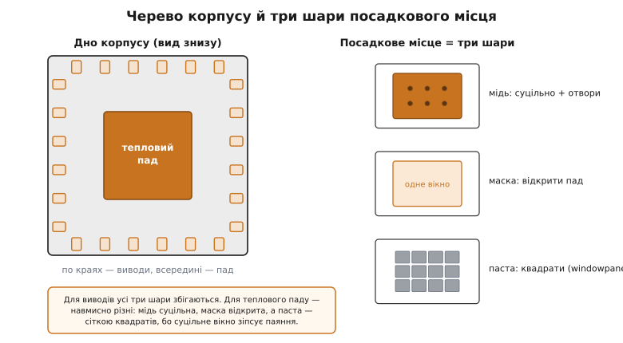
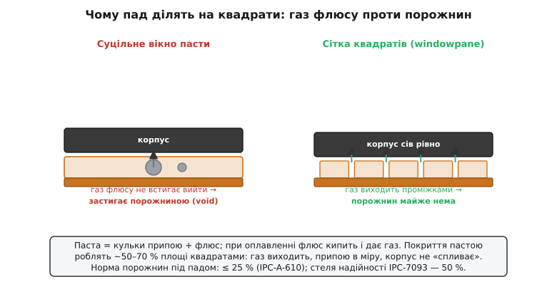

# 🔌 Корпуси з тепловим падом: клас, посадкове місце й паста

> У темі ми дійшли до головної причини, чому плата стала радіатором: сучасний плаский корпус віддає тепло **вниз**, у мідь під собою, а не вбік крізь ніжки. Тепер придивімося до самого цього класу корпусів як до **об'єкта**, з яким доводиться працювати руками: що в нього на череві, як малюють під нього посадкове місце з трьох різних шарів, чому пад ділять на квадратики під пасту й звідки беруться порожнини, що ховають перегрів. Жодних партномерів — лише принцип, спільний для всієї родини, бо посадкове місце під QFN одного виробника й QFN іншого виходить однакове.

## Клас пристрою: корпуси з тепловим падом на череві (BTC)

Спершу — як цей клас зветься, бо назв багато й вони плутають. Найзагальніша — **BTC** (*Bottom Termination Components* — компоненти з нижнім приєднанням): усе сімейство пласких корпусів, у яких виводи не стирчать збоку ніжками, а виходять **контактними майданчиками просто на дні** корпусу. Усередині цього сімейства — кілька споріднених форм:

```
QFN  — Quad Flat No-leads   — майданчики з усіх чотирьох боків дна
DFN  — Dual Flat No-leads   — майданчики з двох боків (вузький корпус)
SON  — Small Outline No-leads — те саме, інша назва тієї ж ідеї
LGA  — Land Grid Array      — майданчики масивом по всьому дну
```

Спільне в усіх одне: збоку **немає ніжок** (звідси «no-leads»), а на дні, **просто під кристалом, лежить велика металева площинка** — її й звуть **тепловий пад** (*exposed pad*, дослівно «відкритий пад»; у даташитах часто скорочують до **EPAD** або «*die paddle*» — паддл, на якому сидить кристал). Кристал припаяний до цього паддла зсередини, тож паддл — це його теплова підошва, виведена назовні на дно корпусу.

Звідки взявся цей клас, варто знати, бо це пояснює його вдачу. До кінця 1990-х панували корпуси з ніжками — QFP (*Quad Flat Package*, плаский корпус із ніжками по периметру). Тепло кристала виходило крізь ці тонкі ніжки вбік, у доріжки, — шлях довгий і кепський. Леадфреймову (на металевій рамці-основі) безвивідну форму, де паддл із кристалом виведено просто на дно, у пізні 1990-ті вивела на ринок компанія Amkor під своєю назвою **MicroLeadFrame (MLF)**; узагальнена ж назва за класифікацією JEDEC — саме **QFN**, і вона прижилася як родова. (Це усталений факт: «QFN» — родова номенклатура JEDEC, «MLF» — фірмова назва того самого від Amkor; зростання було стрімке — від десятків мільйонів корпусів на рік близько 2000-го до сотень мільйонів за три роки.) Геометрію корпусів стандартизували окремими описами JEDEC: контур QFN веде документ **MO-220**, вужчого DFN — **MO-229**.

> 🔧 **Навіщо це.** Коли в даташиті бачите «QFN-32», «DFN-8», «VQFN», «SON», «MLF», «LFCSP», «PowerPAD» — це **все той самий клас**: безвивідний плаский корпус із тепловим падом на дні. Підхід до плати під ним один на всіх, тож не треба шукати окремих правил під кожну абревіатуру. Єдиний галузевий документ, що описує проектування й монтаж усієї цієї родини, так і зветься — **IPC-7093**, «Design and Assembly Process Implementation for Bottom Termination Components». Якщо доведеться сперечатися з контрактним складальником про норму порожнин чи геометрію трафарету — це той стандарт, на який спираються обидві сторони.

## Анатомія дна: периметральні майданчики плюс тепловий паддл

Подивімося на черево корпусу зблизька. По краях дна йдуть **сигнальні майданчики** (*lands* — контактні майданчики виводів): дрібні прямокутники, кожен — це вивід (живлення, земля, лінія шини, GPIO). Вони невеликі, бо несуть струм сигналу, а не тепло. А посередині, займаючи здебільшого більшу частину дна, лежить **тепловий пад** — велика суцільна металева площадка.

Тепловий пад майже завжди має **подвійну роль**, і це джерело частих непорозумінь. Електрично він зазвичай з'єднаний усередині корпусу із **землею** кристала (бо паддл — це металева основа, до якої кристал приклеєний електропровідним клеєм). Тож пад — це водночас **і теплова підошва, і вивід землі**. Звідси правило, яке легко проґавити: тепловий пад **треба паяти до плати** — не лише заради тепла, а й тому, що без нього земля кристала висить у повітрі й мікросхема або не працює, або ловить шум. Новачок іноді думає «це ж просто радіаторна площинка, можна не паяти» — і отримує непрацездатну плату.

Тепер ключове для всього подальшого: **посадкове місце під такий корпус — це не один малюнок, а три різні шари, що лежать один на одному й керуються окремо**. Їх постійно плутають, а вони відповідають за різні речі:

```
1. мідь (land / pad)      — куди ляже й до чого припаяється вивід; це власне метал плати
2. маска (solder mask)    — лак, що відкриває мідь там, де має бути припій, і ховає решту
3. паста (paste / stencil) — отвори в трафареті, крізь які пасту наносять на мідь
```

Для звичайного виводу всі три збігаються — прямокутник міді, відкритий маскою, з таким самим вікном пасти. А для **теплового паду** вони **навмисно різні**, і саме в цій різниці — уся хитрість монтажу. Розберемо її по черзі: спершу мідь, тоді отвори, тоді пасту.


*Зліва — дно корпусу: дрібні сигнальні майданчики по краях і велика площадка теплового паду посередині. Справа — посадкове місце розкладене на три шари. Мідь — суцільна площадка з сіткою отворів; маска відкриває її повністю; а трафарет пасти розбитий на квадратики (windowpane), бо суцільне вікно пасти зіпсувало б паяння. Збіг усіх трьох — для виводів; для паду шари навмисно різні.*

## Мідь під падом: суцільне з'єднання й сітка отворів

Перший шар — мідь. Тут діє все, що ми вивели в основній темі, тож стисло, але з наголосом на тому, що саме малюють під цим класом корпусів.

Мідний майданчик під тепловий пад роблять **приблизно під розмір самого паду** (виробник дає число в даташиті — зазвичай це майже весь розмір корпусу за відрахуванням периметра виводів). Від цього майданчика тепло має піти на інший бік і у внутрішні площини, тож у нього вставляють **сітку теплових отворів** — ту саму, що ми вже розбирали: свердло близько **0.3 мм**, регулярна ґратка з кроком приблизно **1–1.2 мм**, від **дев'яти до двадцяти п'яти** штук. Більше ставити марно — виграш виположується вище приблизно двох десятків отворів (це підтверджують і вимірювання виробників: поліпшення стає асимптотичним за межею ~25 отворів).

І найважче засвоюване правило класу, варте окремого наголосу: **мідний пад з'єднують із міддю навколо й з отворами суцільно, без теплових містків**. У САПР контактні майданчики за замовчуванням чіпляють до полігона **тепловими перемичками** (*thermal relief* — кілька вузьких спиць, інакше «wagon wheel», «колесо воза»). Для паяння звичайного виводу це добре: перемички не дають полігону висмоктати тепло й «обікрасти» паяння. Але **для теплового паду вони згубні** — ці спиці є вузькі резистори в самому шляху тепла, заради якого ми все будуємо. Тож тепловий пад заливають у мідь і з'єднують з отворами **повним металом**. Це не побажання, а норма: спиці-перемички просто скасовують ефект усієї сітки отворів.

> 🔧 **Навіщо це.** Поставити в САПР тепловий пад «як усі майданчики» — і отримати на ньому автоматичні теплові містки — найтихіша й найпоширеніша помилка цього класу. Плата виглядає правильно, сітка отворів на місці, а тепло до неї не доходить, бо його душать чотири тоненькі спиці. Перевіряйте з'єднання теплового паду окремо: він має бути **залитий суцільно**, без жодного thermal relief. У більшості САПР це окреме налаштування «solid connection» саме для цього контактного майданчика.

## Паста: чому пад ділять на квадрати

Тепер найцікавіший шар — паста, і тут логіка протилежна до інтуїції. Здавалося б: пад великий, площа велика — наллємо пасти на всю площу суцільним вікном, хай буде багато припою, контакт буде кращий. **Саме так робити не можна.** І щоб зрозуміти чому, треба згадати, що таке паяльна паста й що з нею діється при оплавленні.

Паяльна паста — це не чистий метал, а **суміш дрібних кульок припою з флюсом** (флюс — клейкувата хімія, що знімає окисли й тримає кульки купи). Коли плату гріють у печі (оплавлення, *reflow*), флюс розігрівається й **закипає — виділяє газ і пару**. Цей газ мусить кудись вийти, поки припій ще рідкий, інакше він застрягне всередині застиглого припою бульбашкою. І ось тут вилазить біда великого паду: якщо пасту нанесли **одним суцільним вікном на всю площу**, газ із середини цієї великої калюжі рідкого припою **не встигає дійти до краю й вийти** — шлях надто довгий. Він застрягає й застигає **порожниною** (*void* — пустота, бульбашка газу в товщі припою).

А порожнина під тепловим падом — це пряма дірка в теплопроводі. Згадаймо, що пад — найкоротша й найважливіша ланка шляху тепла; бульбашка газу в ній має теплопровідність повітря, тобто **майже нульову**. Велика порожнина під падом — те саме, що відламати шматок радіатора: тепло впирається в неї, і кристал перегрівається, хоч плата начебто зроблена правильно. Тому **порожнечі — ворог номер один** усього класу: це найчастіший дефект паяння BTC-корпусів, і трапляється він саме на тепловому паді.

Розв'язок елегантний: **не наносити пасту суцільним вікном, а розбити трафарет на сітку дрібних квадратиків** (галузевий жаргон — *windowpane*, «віконна рама» з кватирок; або *dot matrix*, точковий масив). Між квадратиками лишаються проміжки голої міді, і коли паста оплавляється, газ флюсу виходить **цими проміжками** — кожній бульбашці тепер близько до краю свого маленького острівця. Менші острівці рідкого припою — коротший шлях газу назовні — менше застряглих порожнин.


*Зліва — паста суцільним вікном: при оплавленні газ флюсу з середини великої калюжі не встигає вийти й застигає порожниною (сіра бульбашка) — дірка в теплопроводі. Справа — той самий пад, але паста розбита на квадрати: газ виходить проміжками між острівцями, припою менше, і порожнин майже немає. Менше припою свідомо, заради цілісного контакту.*

Друга причина ділити пад — **висота й кількість припою**. Суцільне вікно поклало б на пад завелику гірку пасти; при оплавленні вона **підняла б увесь корпус** на собі, як на подушці. А піднятий корпус — це відірвані від плати **сигнальні** майданчики по краях (вони ж нижчі за гірку припою під центром): мікросхема стане на «дибки» й половина виводів не припаяється. Тому пасти на пад кладуть **свідомо менше, ніж уся площа**: усталений орієнтир — покрити пастою приблизно **50–80 %** площі паду (на практиці частіше 50–70 %). Це й роблять, зменшуючи квадратики windowpane: їхня сумарна площа й задає це покриття. Виходить подвійна вигода від однієї дії — і газу є куди вийти, і висота припою в міру, і корпус сідає рівно.

```
покриття пастою паду ≈ 50–80 % площі  (типово 50–70 %)
  ← менше → корпус не «спливає», сигнальні виводи сідають
  ← квадрати → газ флюсу виходить проміжками, менше порожнин
норма порожнин: ≤ 25 % площі (IPC-A-610);  стеля IPC-7093 — 50 %
```

> 🔧 **Навіщо це.** Два числа варто тримати в голові, коли віддаєте плату на монтаж. Перше — **покриття пастою ~50–70 %** теплового паду через сітку квадратів, а не суцільне вікно: це і випускає газ, і не дає корпусу спливти. Друге — **норма порожнин**: за IPC-A-610 під падом має лишатися не більш як 25 % порожнеч (IPC-7093 як стелю надійності називає 50 %). Це не педантизм: на силовій деталі різниця між 10 % і 40 % порожнин — це десятки градусів кристала. Якщо складальник питає «яке покриття трафарету на тепловому паді?» — відповідь «50–70 %, windowpane», а не «суцільно».

## Як це з'єднують: рецепт посадкового місця

Зберемо все докупи в один практичний рецепт — як виглядає правильне посадкове місце під корпус цього класу, шар за шаром. Це і є «підключення» для класу корпусів (у корпусу немає розпіновки в звичному сенсі — є посадкове місце):

```
1. Мідь під виводи:  прямокутні майданчики за даташитом, по периметру.
2. Мідь під пад:     суцільна площадка ~під розмір паду, ЗАЛИТА в полігон
                     БЕЗ теплових містків (solid connection).
3. Отвори в паді:    сітка ⌀≈0.3 мм, крок ≈1–1.2 мм, 9–25 шт,
                     наскрізь на нижній полігон і внутрішні площини.
4. Маска:            відкриває мідь паду повністю (одне вікно).
5. Паста на пад:     НЕ суцільно — сітка квадратів (windowpane),
                     сумарно ~50–70 % площі паду.
6. Паста на виводи:  звичайні вікна 1:1 під кожен майданчик.
```

Окрема тонка деталь — **що робити з отворами під падом, щоб припій не втік у них**. Отвори — це дірки наскрізь; рідкий припій при оплавленні охоче **затікає в них капіляром** (*solder wicking*, гноту́вання) і йде на інший бік. Наслідок подвійно поганий: припою під падом меншає (контакт голодний), а знизу під платою вилазять **краплі-напливи** (заважають, якщо там площинка прилягає до корпусу). Тому отвори в тепловому паді зазвичай **закривають**: або «тентують» маскою з нижнього боку (*tenting* — затягують лаком), або заповнюють (*plugged / filled via* — забивають отвір спеціальною пастою чи міддю). Заповнені міддю отвори дають **найкращий** теплопровід і нуль гнотування, але дорожчають плату; для більшості пристроїв досить дешевшого тентування знизу. Головне — **не лишати отвори голими наскрізь**, інакше частина припою з-під паду піде в них.

> 🔧 **Навіщо це.** Якщо плата дешева й отвори в паді **не закриті**, монтажник це побачить одразу: припій провалиться в отвори, під падом лишиться менше металу, а під платою — намистини. Лікують одним із двох: тентувати отвори маскою знизу (дешево, добре для більшості) або просити в виробника заповнені отвори (дорожче, для серйозного тепла). Це треба **закласти в проєкт плати наперед** — дотягти потім на готовій платі вже не вийде.

## Перший монтаж: що видно й чого не видно

«Перший байт» для класу корпусів — це **перше оплавлення й перший огляд**: що ви побачите, коли корпус ляже на плату, і — головне — чого **не** побачите.

Добрий монтаж BTC-корпусу зовні майже невидимий. У звичайної мікросхеми з ніжками паяння видно збоку: галтель припою на кожній ніжці, можна оглянути оком чи мікроскопом. А тут **усі контакти сховані під корпусом** — і периметральні майданчики, і весь тепловий пад. Збоку видно хіба тонесеньку смужку припою на торцях периметральних виводів (у деяких корпусів торці виводів облужені — *wettable flanks*, змочувані боки, навмисно зроблені, щоб було за що зачепитися оком і автоматом огляду). А **тепловий пад і порожнечі під ним оком не видно взагалі** — вони замуровані між корпусом і платою.

Звідси неприємний висновок: **головний дефект класу — порожнини під падом — невидимий при звичайному огляді**. Плата може виглядати ідеально, мікросхема працювати на столі, а під падом сидіти 50 % порожнин, і деталь тихо перегріватиметься в полі. Побачити порожнечі можна лише **рентгеном** (*X-ray* — наскрізне просвічування, на якому порожнини видно світлими плямами в темному припої) або, грубіше, розрізавши плату й подивившись зріз під мікроскопом. Тому на серйозному виробництві паяння BTC **контролюють рентгеном**, а не оком, і саме звідти беруться ті норми «не більш як стільки-то відсотків порожнеч».

> 🔧 **Навіщо це.** Якщо пристрій із корпусом на тепловому паді працює на столі, але **гріється чи зависає в роботі** — перша підозра саме сюди: порожнини під падом або непропаяний пад (а отже, і поганий контакт землі). Оком це не діагностувати — потрібен рентген партії або контрольний розріз. Тому дешевше зробити трафарет правильно з першого разу (windowpane, 50–70 %, закриті отвори), ніж потім ловити плавучий перегрів у готовому виробі. Власне паяння цього класу руками — окрема морока; її розбираємо у [ручному паянні SMD](root:embedded/smd-rework), бо без трафарета й печі тепловий пад під корпусом прогріти дуже непросто.

## Варіації класу

Усе сказане — спільне ядро, а форми класу різняться дрібницями, які корисно впізнавати.

**DFN / SON** — те саме, але вузьке: майданчики лише з **двох** боків (як у звичайної дрібної мікросхеми на 6–8 виводів), а посередині — той самий тепловий пад. Логіка плати ідентична, просто пад менший і отворів у нього влазить менше (часто 4–9). Назви DFN і SON позначають одне й те саме — різні виробники звуть по-різному.

**Силові корпуси з паддлом** (узагальнено — стиль *PowerPAD* і подібні: силові транзистори й регулятори в пласких корпусах із великою тепловою підошвою) — це той самий принцип, доведений до краю: пад там **дуже великий**, бо розсіювати треба вати, не мілівати. Сітка отворів під ним густіша й численніша, мідь — обов'язково в кілька шарів, а заповнені (а не лише тентовані) отвори тут уже не розкіш, а часта потреба. Іноді тепловий пад такого корпусу електрично з'єднаний не із землею, а зі **стоком** силового ключа — тоді мідь під ним сидить під робочою напругою, і це треба враховувати при розведенні (не можна просто кинути її в загальну землю).

**LGA** — коли виводів багато, периметра не вистачає, і майданчики розкладають **масивом по всьому дну** (як у BGA, але плоскими майданчиками без кульок). Тепловий пад тут може бути або окремою площадкою серед масиву, або його роль грає група центральних «земляних» майданчиків із отворами. Підхід до тепла той самий — мідь під центр і отвори вниз.

**Корпуси з кількома падами.** Зрідка на череві не один тепловий пад, а **кілька** — наприклад, у мікросхемі з двома силовими частинами, кожна зі своїм паддлом і своєю землею/потенціалом. Тоді кожен пад — окреме посадкове місце зі своєю сіткою отворів, і плутати їхні полігони не можна, бо вони можуть бути під різними напругами.

Попри всі ці варіації, **рецепт один**: суцільна мідь під пад без теплових містків, сітка отворів ⌀≈0.3 мм униз, паста квадратами на ~50–70 % площі, закриті отвори, контроль порожнин рентгеном. Зрозумівши клас один раз, ви читаєте посадкове місце під будь-який його різновид — від крихітного DFN-6 до силового паддла — як ту саму ідею в різних масштабах: дати теплу пряму мідну дорогу вниз і не дати газу флюсу замурувати її порожниною.
