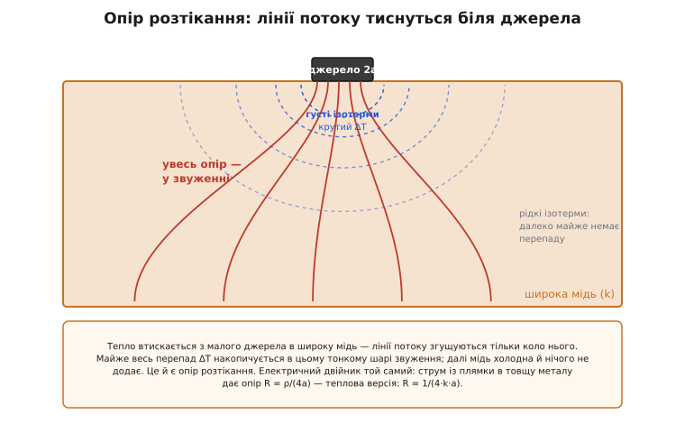
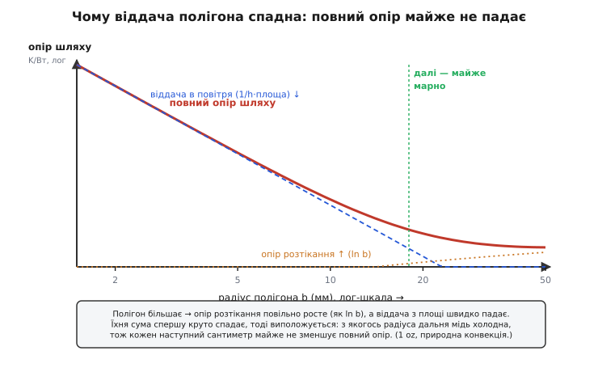

# 🧮 Опір розтікання: чому віддача полігона спадна

У темі ми вже бачили дивну річ: подвоївши площу мідного полігона, охолодження ви **не** подвоюєте. Перші квадратні сантиметри коло деталі дають левову частку ефекту, а далі віддача спадає — і з якогось розміру доточувати мідь майже марно. Ми назвали винуватця «опором розтікання» й пообіцяли розібрати його числом. Зробімо це. Бо за цією назвою стоїть не груба емпірика, а чиста й гарна фізика, з якої виводиться формула — і вона прямо каже, який полігон малювати, а де зупинитися.

Питання, на яке відповідає вся ця вставка, одне: **чому тепловий потік, виходячи з маленького паду в широку мідь, зустрічає додатковий опір — попри те, що мідь чудово проводить?** Адже мідь — теплова автострада, k ≈ 400 Вт/(м·°C). Здавалося б, дай тепла багато міді — і опір майже зникне. А він не зникає. І не через поганий матеріал, а через **геометрію**: тепло мусить **звузитися** з широкого паду в ще ширшу мідь, і саме на цьому звуженні накопичується перепад.

> 🔧 **Навіщо це.** Опір розтікання — це та частина теплового опору плати, якою ви керуєте топологією, а не вибором деталі. Зрозумівши його формулу, ви перестаєте малювати полігони «на око» («залию півплати про всяк випадок») і починаєте бачити, де мідь працює, а де лежить мертвим вантажем. Те саме число пояснює, чому в даташиті θJA таке, яке є, і чому на вашій платі воно інше.

## Означення: опір, що живе в геометрії, а не в матеріалі

Звичайний тепловий опір прямого шляху ми знаємо: для бруска довжини L і сталого перерізу A це Rθ = L/(k·A). Основу — що таке тепловий опір і як він рахується — ми проходили окремо.

> Тепловий опір Rθ (°C/Вт) каже, на скільки нагріється тіло на кожен ват, що крізь нього тече: ΔT = P·Rθ. Для прямого шляху сталого перерізу Rθ = L/(k·A): довший шлях гальмує тепло, товщий і теплопровідніший — пропускає. Це двійник електричного опору R = ρ·L/A. Основа — [тепловий опір і відведення тепла](book:physics/thermal-resistance).

Так от, формула L/(k·A) мовчазно припускає, що **переріз сталий уздовж усього шляху** — потік іде рівним пучком, як вода рівною трубою. Опір розтікання — це поправка саме на той випадок, коли **переріз різко змінюється**: тепло входить крізь малу площу джерела, а далі розливається у велику.

**Опір розтікання** (англ. *spreading resistance*; для протилежного напрямку, коли потік звужується **до** малого контакту, — *constriction resistance*, опір звуження) — це додатковий тепловий опір, що виникає **суто через зміну перерізу потоку** на шляху від малого джерела в широке тіло. Формально його означують як різницю:

```
R_розтік = (T_джерела − T_далеко) / P  −  (опір, який був би при рівному перерізі)
```

Тобто беремо реальний перепад між гарячим джерелом і далекою «холодною» міддю, ділимо на потужність — і віднімаємо ту частину, яку дав би прямий рівномірний шлях. Лишок — плата за геометрію звуження. І головне, що видно вже з означення: **це опір без матеріалу-винуватця**. Мідь скрізь однаково добра; опір береться з того, що лінії потоку мусять згуститися біля джерела.

## Інтуїція: лінії потоку згущуються — і там увесь перепад

Чому зміна перерізу взагалі коштує опору? Згадаймо, що тепловий потік тече **лініями** — як струм лініями струму, як вода лініями течії. Густота цих ліній — це густина потоку (Вт на м²). А перепад температури між двома точками тим більший, чим **густіші** лінії між ними: де потік протискається крізь вузьке, там круте падіння; де розливається широко, там майже рівно.

Тепер уявімо тепло, що виходить із маленького паду в товсту мідь. Біля самого джерела всі лінії втиснуті в його крихітну площу — вони **максимально густі**. Відійшовши від джерела, лінії розходяться віялом у всі боки, і їхня густота стрімко падає. Виходить, майже весь перепад температури накопичується в тонкому шарі **просто навколо джерела**, де лінії ще густі. Далі, у просторій міді, лінії рідкі — там перепаду майже немає, мідь усюди майже однаково тепла.


*Тепло втискається з малого джерела в широку мідь. Лінії потоку густі лише в тонкому шарі звуження коло джерела (там круте ΔT, густі ізотерми), а далі розходяться й рідшають — далека мідь майже не гріється. Цей перепад у звуженні й називають опором розтікання. Електричний двійник той самий: струм із малої плямки в товщу металу дає опір R = ρ/(4a).*

Звідси відразу видно дві речі, які ми емпірично знали з теми. По-перше, **опір зосереджений біля джерела** — отже, найцінніша мідь та, що **впритул** до деталі; дальня працює дедалі слабше. По-друге, опір **не можна обнулити, доточуючи мідь**: скільки б широкої міді ви не додали, звуження коло джерела нікуди не дінеться, бо джерело лишається малим. Можна хіба зменшити саме звуження — **збільшивши джерело** (ширший тепловий пад) або давши теплу більше «вимірів» для розтікання (товща мідь, кілька шарів).

Аналогія зі струмом тут не просто схожа — вона **точна до коефіцієнта**, бо стаціонарне тепло і стаціонарний струм описує те саме рівняння Лапласа (∇²T = 0 і ∇²V = 0). Тому все, що електрики знають про опір контактної плямки, дослівно переноситься на тепло заміною ρ → 1/k. Ламається аналогія лише там, де в тепла з'являється свій канал, якого нема в струму, — **віддача з поверхні в повітря** (конвекція). Струм із бічних граней металу не «витікає», а тепло витікає; цю поправку ми додамо нижче, і саме вона зробить картину остаточно платівською.

## Формальний апарат: формула 1/(4·k·a) і звідки в ній четвірка

Порахуймо опір розтікання для найчистішого випадку — **круглого джерела радіуса a** на поверхні дуже товстого тіла (півпростору) з теплопровідністю k. «Дуже товстого» — щоб тепло могло розходитися вглиб і вшир без перешкод; для міді плати це ідеалізація, але вона дає кістяк, а тоншу пластину ми розберемо слідом.

Прямий вивід інтеграла тут вимагав би розв'язати рівняння Лапласа в півпросторі — це довго. Але є коротший шлях, що дає **точну** відповідь і чудово показує, звідки беруться числа: скористатися готовою електростатичною аналогією. Задача «кружок радіуса a підтримують за сталого потенціалу, навколо — провідне середовище» — це задача про **ємність диска**, яку розв'язали ще у XIX столітті. Її переклад на наш опір такий: для **ізотермічного** круглого джерела (уся плямка за однієї температури) на півпросторі

```
R_розтік = 1 / (4 · k · a)
```

Ось вона, славнозвісна «четвірка». Перевірмо її на здоровий глузд, бо формула, у яку не віриш, — мертва.

Розмірність: [1 / (Вт/(м·°C) · м)] = [°C/Вт]. Опір — сходиться.

Залежність від **k**: опір обернено пропорційний теплопровідності — теплопровіднішою міддю тепло розтікається легше. Очікувано.

Залежність від **a** — найголовніша й найповчальніша: опір обернено пропорційний **радіусу**, а **не площі**. Це тонка й важлива відмінність. Площа джерела росте як a², а опір падає лише як a. Тож подвоївши радіус паду, ви площу вчетверо збільшили, а опір розтікання лише **вдвічі** зменшили. Розтікання «бачить» не площу плямки, а її **лінійний розмір** — периметр, край, з якого лінії потоку виходять у простір. Звідси й уся спадна віддача, до якої ми ще повернемося.

> 🔧 **Навіщо це.** Залежність 1/a, а не 1/a², — практичне золото. Вона каже: щоб удвічі зменшити опір розтікання, треба вдвічі **більший лінійний розмір** джерела (а площі — вчетверо). Тому розширювати тепловий пад деталі вигідно, але з різко спадною віддачею: перше розширення дає багато, кожне наступне — дедалі менше. І тому ж «трохи більший пад» майже нічого не дає, а «помітно більший» — дає.

Звідки сама четвірка? Її приносить геометрія півпростору й точний розв'язок Лапласа — це не підгінний коефіцієнт, а строге число тієї самої природи, що й «вісімка» в ємності диска C = 8·ε₀·a. Для нас важливіше не вивести четвірку заново, а зрозуміти, що **коефіцієнт залежить від того, як саме розподілений потік по джерелу**. Якщо джерело не ізотермічне (стала температура), а **ізопотоково** (рівна густина потоку по всій плямці — фізично це ближче до реального паду, що рівномірно гріється), коефіцієнт трохи інший:

```
ізотермічне джерело:   R = 1 / (4·k·a)          ≈ 0.250 / (k·a)
ізопотокове джерело:   R = 8 / (3·π²·k·a)        ≈ 0.270 / (k·a)
```

Різниця — близько **8 %**: ізопотокове джерело має трохи вищий опір (за його **середньою** температурою), бо в нього край плямки гарячіший за центр, і середнє виходить вище. Для інженерної прикидки ця різниця — у межах шуму; обидва числа кажуть одне: **опір розтікання круглого джерела ≈ 0.25…0.27 поділити на (k·a)**. Запам'ятати варто саме порядок: «приблизно чверть на ка».

**Опір розтікання мідного паду.** Тепловий пад радіуса a = 2 мм (діаметр 4 мм) на товстій міді, k = 400 Вт/(м·°C). Скільки коштує саме розтікання?

```
R = 1 / (4·k·a) = 1 / (4 · 400 · 0.002)
R = 1 / 3.2 ≈ 0.31 °C/Вт
```

Третина градуса на ват — на товстій міді розтікання майже дармове. Якби це була вся теплова історія плати, перейматися не було б чим. Але це не вся історія: реальна плата — **не** товстий брусок міді, а тонесенька мідна плівка на ізоляторі. І саме тонкість усе змінює.

## Тонка пластина: чому з'являється повільне ln(b/a)

Формула 1/(4·k·a) описує півпростір — тіло, товще за джерело. Мідь же на платі має товщину t ≈ 35 мкм (один «oz»), тоді як пад — кілька міліметрів. Тут уже **не півпростір, а лист**: тепло не може піти вглиб (углиб лише тонкий шар і одразу ізолятор), воно змушене розтікатися майже **плоско, вшир**, у двох вимірах. А двовимірне розтікання має зовсім інший характер — і це варто вивести самим, бо вивід **і є** пояснення.

Уявімо мідний диск товщини t: у центрі — кружок-джерело радіуса a, тепло розходиться радіально назовні до краю радіуса b, звідки знімається (поки що уявімо, що по краю його хтось забирає). Візьмімо тонке кільце радіуса r і ширини dr. Усе тепло P тече крізь нього назовні, а площа, крізь яку воно тече, — це бічна поверхня кільця: довжина кола 2π·r помножена на товщину t. За Фур'є опір цього кільця:

```
dR = dr / (k · A(r)) = dr / (k · 2π·r·t)
```

Тепер просто складемо опори всіх кілець від a до b (вони послідовні — тепло проходить їх одне за одним):

```
R = ∫[a..b] dr / (2π·k·t·r) = ln(b/a) / (2π·k·t)
```

Ось воно — **двовимірне розтікання дає логарифм**:

```
R_лист = ln(b/a) / (2π · k · t)
```

І в цьому логарифмі — вся розгадка спадної віддачі. Логарифм росте **болісно повільно**. Подвоїти полігон (b → 2b) додає до опору лише ln(2)/(2π·k·t) — сталу добавку, що з ростом b важить дедалі менше у відсотках. А **зменшує** опір кожне розширення ще слабше: щоб відчутно зрізати R, край b треба збільшувати не вдвічі, а в **рази й рази**, бо опір живе під знаком логарифма. Перейти від b = 2 мм до b = 4 мм — це ln(4/a)−ln(2/a) = ln 2; перейти від 20 мм до 40 мм — рівно стільки ж, ln 2, хоча міді ви доклали в десятки разів більше. Ось чому далека мідь майже дармова: вона додає до логарифма копійки.

Подивимося, як по-різному залежить опір від товщини й радіуса:

```
від товщини t:  R ~ 1/t   — подвоїв мідь (2 oz) → опір розтікання вдвічі менший
від радіуса b:  R ~ ln b  — подвоїв полігон    → опір падає лише на ln(2)·стала
```

Контраст разючий. **Товщина б'є прямо** (1/t), **радіус — крізь логарифм** (ln b). Тому на платі з великими тепловими потоками вигідніше замовити товщу мідь (2 oz замість 1), ніж роздувати полігон: подвоєння товщини чесно ділить опір розтікання навпіл, а подвоєння радіуса зрізає його ледь-ледь.

**Розтікання в тонкій міді.** Той самий пад a = 2 мм, але тепер реальний лист: мідь 1 oz, t = 35 мкм, k = 400. Полігон до краю b = 20 мм:

```
R = ln(b/a) / (2π·k·t) = ln(20/2) / (2π · 400 · 35×10⁻⁶)
R = ln(10) / (2π · 400 · 35×10⁻⁶)
R = 2.303 / 0.0880 ≈ 26 °C/Вт
```

Двадцять шість градусів на ват — проти **0.31** у товстій міді! Тонкість плівки підняла опір розтікання майже у **сто разів**. Ось чому на платі розтікання — не дрібниця, а часто головна ланка: мідь сама по собі чудова, але її жалюгідно мало по товщині, тож вшир вона проводить набагато гірше, ніж здається з її k.

> 🔧 **Навіщо це.** Це число пояснює, навіщо в темі здавалися такими важливими дві речі — теплові отвори й внутрішні площини. Якщо одна тонка плівка дає десятки °C/Вт на розтікання, то єдиний спосіб різко зрізати цей опір — додати **паралельних** мідних листів: нижній полігон і внутрішні площини, з'єднані отворами. Кожен новий лист — це ще одне 1/t у паралель, тобто опір ділиться. Логарифм же радіуса каже протилежне про площу: ширший полігон допомагає мало. Звідси й правило теми — спершу **товщина й шари**, лише потім **площа**.

## Де ця математика працює в темі: повний опір і точка зупину

Тепер зберімо все докупи й відповімо на головне практичне питання: **з якого розміру полігона доточувати мідь марно?** Логарифм сам по собі ще не дає точки зупину — він росте без межі, тільки повільно. Точку зупину дає те, про що ми попередили вище: у тепла, на відміну від струму, є **другий канал** — віддача з мідної поверхні в повітря. І саме боротьба двох ефектів робить криву віддачі спадною аж до насичення.

Розгляньмо потік тепла від паду до повітря як два послідовні опори. Спершу тепло **розтікається** міддю від паду до краю полігона — це наше R_лист = ln(b/a)/(2π·k·t), що з ростом b повільно **росте**. Потім воно **віддається** з усієї площі полігона в повітря — конвекцією, опір якої R_конв = 1/(h·площа) = 1/(h·π·b²), що з ростом b швидко **падає** (площа ж як b²). Повний опір шляху — їхня сума:

```
R_шлях(b) = ln(b/a)/(2π·k·t)  +  1/(h·π·b²)
              ↑ розтікання, росте як ln b      ↑ віддача, падає як 1/b²
```

Ось де народжується спадна віддача й точка зупину. При малому полігоні домінує **другий** доданок: площі мало, віддавати нікуди, опір величезний — і кожен доданий міліметр міді різко його зрізає (b² у знаменнику працює потужно). Та що більшає полігон, то менший внесок віддачі — і дедалі більше починає важити **перший** доданок, розтікання, яке росте. У якийсь момент друге вже майже обнулилося, а перше повзе вгору, і сума **виположується**: додавати мідь — означає трошки зменшувати віддачу й водночас трошки збільшувати розтікання, а в сумі — майже нуль. Це і є той розмір, від якого мідь марна.


*Полігон більшає (вісь — радіус, лог-шкала): опір розтікання повільно росте як ln b (мідна крива), а віддача в повітря швидко падає як 1/b² (синя). Їхня сума — повний опір шляху (червона) — спершу круто спадає, тоді виположується. З позначеного радіуса дальня мідь уже холодна, тож кожен наступний сантиметр майже не зменшує повний опір. Модель: 1 oz, природна конвекція.*

Прикинемо точку зупину на знайомих числах — пад a = 2 мм, мідь 1 oz, природна конвекція (з обох боків плати разом приблизно h ≈ 20 Вт/(м²·°C)):

```
полігон b = 5 мм:   розтікання ≈ 10,  віддача ≈ 640,  сума ≈ 650 °C/Вт
полігон b = 12 мм:  розтікання ≈ 20,  віддача ≈ 110,  сума ≈ 130 °C/Вт
полігон b = 20 мм:  розтікання ≈ 26,  віддача ≈  40,  сума ≈  66 °C/Вт
полігон b = 30 мм:  розтікання ≈ 31,  віддача ≈  18,  сума ≈  49 °C/Вт
полігон b = 50 мм:  розтікання ≈ 37,  віддача ≈   6,  сума ≈  43 °C/Вт
```

Дивимося на стовпчик суми. Від 5 до 20 мм радіуса опір падає майже **вдесятеро** (650 → 66) — кожен міліметр золотий. Від 20 до 50 мм — лише з 66 до 43, тобто роздувши полігон по площі ще в шість разів, ми виграли якихось третину. А далі за 50 мм крива практично лягає: віддача вже мізерна, а розтікання тільки росте. Ось де «доточувати мідь майже марно» — десь там, де радіус полігона переростає **десяток-півтора міліметрів** від краю паду, тобто полігон у кілька квадратних сантиметрів. Точно те правило, яке тема дала з практики, тепер виведене з двох формул.

Зверніть увагу й на те, **що** обмежує велику плату: на великих b сума дедалі ближча до **самого розтікання** (37 із 43 при b = 50 мм — це розтікання). Тобто далеку мідь душить не брак площі для віддачі, а те, що тепло до неї просто **не доходить** — застрягає в логарифмі розтікання тонкої плівки. Тому й помагає не ширший полігон, а **товща мідь і паралельні шари**: вони б'ють саме по цьому домінантному доданку (1/t), тоді як площа його не чіпає.

> 🔧 **Навіщо це.** Звідси робочий алгоритм, коли деталь гріється: (1) зроби суцільне з'єднання паду з полігоном, без теплових містків, — інакше додаєш ще одне звуження поверх неминучого; (2) залий полігон навколо деталі радіусом приблизно з десяток міліметрів — це майже вся віддача; (3) далі **не** роздувай площу, а додавай **товщину й шари** (нижній полігон, внутрішні площини, сітка отворів між ними) — кожен паралельний лист ділить домінантний опір розтікання. Гнатися за гігантською заливкою — переводити мідь: її далекий край лишиться холодним.

## Як це замикається на θJA даташита

Лишилося пов'язати опір розтікання з числом, з якого тема почалася, — θJA. Тепер видно, **що** в ньому сидить, коли радіатора нема: майже весь θJA — це опір **плати**, а в ньому чималу частку складає саме розтікання тонкою міддю. Виробник міряє θJA на стандартній тестовій платі (родина JEDEC JESD51): на бідній одношаровій тонка плівка дає велике розтікання → велике θJA; на багатій чотиришаровій кілька паралельних мідних листів ділять розтікання → мале θJA. Різниця між полюсами — у рази, і тепер ясно, звідки вона: це різна кількість паралельних 1/t у формулі розтікання.

Для повноти — як цю задачу розв'язують точно, без наших спрощень. Реальна пластина має скінченну товщину, скінченний край (тепло не «забирають» по краю, а воно віддається з площини) і конвекцію. Точні розв'язки (їх розвинула школа Йовановича в Університеті Ватерлоо) дають безрозмірний опір розтікання як функцію трьох безрозмірних чисел:

```
ε = a/b   — відносний розмір джерела (пад проти полігона)
τ = t/b   — відносна товщина (мідь проти полігона)
Bi = h·b/k — число Біо (наскільки активно край віддає проти того, як проводить)
```

Наші дві формули — це два граничні кути цієї загальної картини: 1/(4·k·a) — межа товстого тіла (τ велике), ln(b/a)/(2π·k·t) — межа тонкого листа (τ мале) без віддачі. Для прикидки полігона їх досить; точні таблиці й корелятори потрібні, коли проектуєш складний багатошаровий розтікач і кожен градус на рахунку. Але фізика, що керує і таблицями, і прикидкою, — одна: **опір живе у звуженні потоку коло джерела, падає з лінійним розміром джерела й товщиною міді, а від площі полігона залежить лише логарифмічно** — тому віддача й спадна.

---

Опір розтікання — це данина геометрії, а не матеріалу: тепло, втискаючись із малого джерела у широку мідь, згущує лінії потоку коло себе, і весь перепад накопичується в цьому звуженні. Для круглого джерела на товстій міді він дорівнює приблизно 0.25…0.27/(k·a) — падає з **лінійним** розміром джерела, не з площею, тож розширювати пад вигідно, але зі спадною віддачею. На реальній платі мідь не товста, а тонесенька, і розтікання стає двовимірним: воно дає ln(b/a)/(2π·k·t) — опір, що з товщиною падає прямо (1/t), а з радіусом полігона росте лише як логарифм. Цей логарифм і робить дальню мідь майже дармовою, а коли його скласти з віддачею в повітря (що падає як 1/b²), повний опір шляху спершу круто спадає, тоді виположується — ось звідки «з якогось розміру доточувати мідь марно». Практичний підсумок прямо з формул: спершу суцільне з'єднання й товща мідь та паралельні шари, які ділять домінантний 1/t, і лише потім — помірний полігон у кілька квадратних сантиметрів; а число θJA з даташита — це і є цей опір розтікання, виміряний на чужій платі, тож на вашій він інший рівно настільки, наскільки інша ваша мідь.
