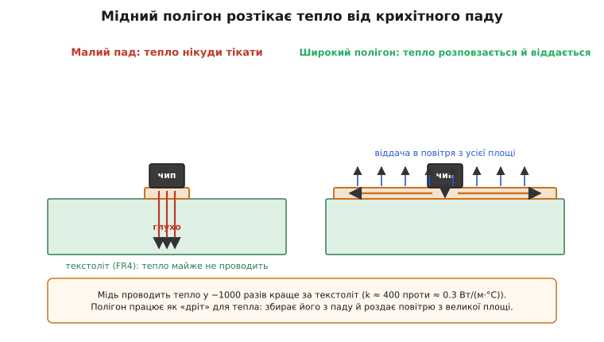
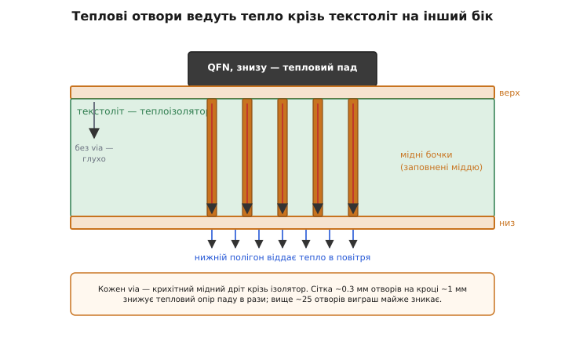
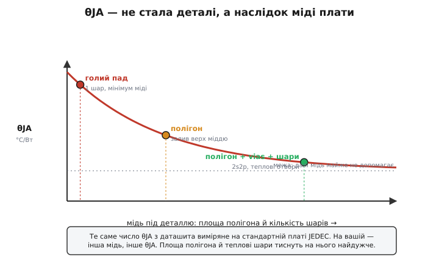
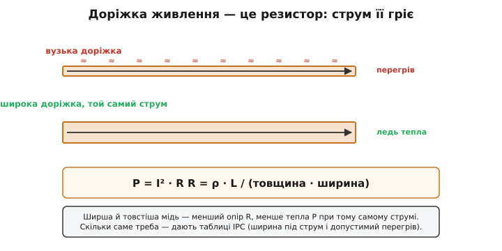

# Тепловідведення на PCB

Тепловий бюджет, який ми вже навчилися зводити, упирається в один доданок — тепловий опір шляху від кристала до повітря. І там, рахуючи радіатор, ми мали зручне число з даташита: θJA, опір «кристал → повітря». Та ось питання, від якого бюджет хитається: **звідки взялося це число і чи правдиве воно для вашої плати?** Бо здебільшого у вбудованому пристрої радіатора немає взагалі — дрібний регулятор, мікросхема в корпусі QFN, силовий ключ без ребер. Тепло цих деталей виходить у повітря **не крізь радіатор, а крізь саму плату**. І тоді плата перестає бути просто підкладкою для доріжок — вона **і є** система охолодження.

> 🔧 Тепловий опір Rθ (°C/Вт) каже, на скільки градусів нагріється тіло на кожен ват, що крізь нього тече: ΔT = P·Rθ. Геометрично він двійник електричного опору: Rθ = L/(k·A) — довший шлях гальмує тепло, товщий і теплопровідніший пропускає. Основа — [тепловий опір і відведення тепла](topic:ph-thermodynamics/thermal-resistance).

Саме тому θJA з даташита — число оманливе. Його виміряли не на вашій платі, а на **стандартній тестовій** (про неї нижче), і змінивши мідь під деталлю, ви змінюєте θJA у рази. Виходить, тепловий опір останньої, найдовшої ланки шляху — не властивість деталі, а **наслідок того, як ви розвели плату**. Ця стаття — про те, як свідомо проектувати плату так, щоб вона відводила тепло: де класти мідь, куди вести теплові отвори, як рахувати, чи витримає доріжка свій струм. Уся фізика в нас уже є — лишилося прикласти її до міді й текстоліту.

## Чому плата взагалі може охолоджувати: мідь проти текстоліту

Звичайна плата — це бутерброд: тонкі шари **міді** (доріжки й полігони) на товстій основі зі склотекстоліту, який інженери звуть FR4 (*Flame Retardant 4* — клас негорючого склоепоксиду). І вся теплова доля плати тримається на одному разючому контрасті між цими двома матеріалами.

Згадаймо закон Фур'є з розбору [трьох шляхів тепла](root:embedded/heat-transfer): кондукція крізь тверде тіло тим краща, чим вища теплопровідність k матеріалу. Так от, числа тут такі:

```
мідь:       k ≈ 400 Вт/(м·°C)
FR4:        k ≈ 0.3 Вт/(м·°C)
відношення: ≈ 1000–1300 разів
```

Мідь проводить тепло **приблизно в тисячу разів краще** за текстоліт. Це не «трохи краще» — це прірва. Для тепла FR4 — майже такий самий ізолятор, як повітря (у повітря k ≈ 0.025, тобто FR4 кращий за нього лише на порядок). А мідь — теплова автострада. Тому головна думка всього проектування проста: **тепло на платі йде туди, де є мідь, і впирається там, де самий текстоліт**.

> 🔧 **Навіщо це.** Звідси випливає вся стратегія: щоб відвести тепло від деталі, треба дати йому **мідь** — і якомога більше. Полігон під деталлю, широкі заливки, мідні отвори на інший бік. Усе, що ми робитимемо далі, — це варіації на одну тему «прокласти теплу мідну дорогу й не лишити на ній текстолітових розривів». Якщо ж деталь сидить на крихітному паді посеред голого FR4 — тепло нікуди дітися, і вона перегріється навіть на скромному ваті.

Є ще одна тонкість, варта згадки: мідь на платі **тонюсінька**. Стандартний шар — «одна унція» (*1 oz*), і за цією старовинною мірою (унція міді, розкатана на квадратний фут) ховається товщина всього **35 мікрометрів** — тонша за людську волосину. Тож мідь чудово проводить тепло **вздовж** площини, де її багато, але крізь такий тонесенький шар угору-вниз її переріз мізерний. Це пояснить, навіщо потрібні теплові отвори, — але спершу подивімося, як працює мідь у площині.

## Мідний полігон як розтікач тепла

Уявімо найпростіше: гаряча деталь стоїть на платі, її тепловий пад — маленький, кілька міліметрів. Якщо під ним лише цей пад, тепло виходить у повітря з крихітної площі — а конвекція, як ми знаємо із закону Ньютона, прямо пропорційна площі. Мала площа — кволий тепловідвід — перегрів.

Тепер розлиймо навколо паду **широкий мідний полігон** (*copper pour* — суцільну залиту міддю ділянку шару). Що зміниться? Тепло з паду розтікається цією міддю вшир — бо мідь для нього автострада — і тепер віддається в повітря не з кількох міліметрів паду, а з усієї площі полігона. Полігон працює як **розтікач** (*heat spreader*): він не «висмоктує» тепло магією, а просто **перетворює крихітну гарячу точку на велику теплу пляму**, з якої конвекція знімає тепло куди охочіше.


*Ліворуч — деталь на малому паді: тепло впирається в текстоліт і нікуди не тече. Праворуч — той самий чип на широкому полігоні: мідь розносить тепло вшир (помаранчеві стрілки), і плата віддає його в повітря з усієї площі (сині стрілки). Та сама потужність, та сама деталь — але теплова доля геть інша.*

Та є межа, і вона показова. Подвоївши площу полігона, ви **не** вдвічі покращите охолодження. Перші квадратні сантиметри міді коло деталі дають найбільший виграш, а далі віддача спадає — бо тепло не встигає докотитися до дальніх країв полігона. Поки воно тече тонкою міддю від паду до краю, на цьому шляху накопичується свій перепад температури, тож далекі ділянки полігона **холодніші** за пад і віддають менше. Цей внутрішній опір розтіканню — тепло мусить «протиснутися» з широкого паду в ще ширшу мідь — називають [опором розтікання](root:embedded/pcb-thermal-design/math-spreading-resistance.md). Саме він робить віддачу спадною: великий полігон допомагає, але кожен наступний сантиметр — менше за попередній, і з якогось розміру доточувати мідь майже марно.

> 🔧 **Навіщо це.** Практичне правило, що випливає: найцінніша мідь — **найближча до деталі**. Залийте суцільний полігон просто під гарячою деталлю й трохи навкруги — це дасть левову частку ефекту. Гнатися за гігантськими заливками на півплати немає сенсу: дальня мідь майже не гріється, бо тепло до неї не доходить. Орієнтир із практики — корисний полігон зазвичай у межах кількох квадратних сантиметрів навколо деталі; далі — закон спадної віддачі.

## Теплові отвори: дорога крізь текстоліт

Полігон на верхньому шарі — добре, але часто його замало, та й місце на верху зайняте доріжками. Природно захотіти задіяти **нижній** бік плати: там зазвичай вільніше, можна залити великий полігон, а в багатьох пристроях саме нижня мідь тулиться до корпусу чи металевої основи. Проблема одна: між верхом і низом — товстий шар FR4, теплоізолятор. Тепло саме крізь нього не пройде.

Розв'язок — **теплові перехідні отвори** (*thermal vias*): дрібні свердловини крізь плату, стінки яких (а часто й уся серцевина) затягнуті міддю під час виготовлення. Кожен такий отвір — це крихітний **мідний дріт**, прокладений з верхнього мідного шару на нижній **наскрізь** ізолятора. Поодинці він тонкий і проводить небагато, але якщо насвердлити під тепловим падом цілу **сітку** таких отворів, їхні опори стають паралельними — а паралельні опори додаються в провідності, тобто разом вони пропускають куди більше тепла.


*Тепловий пад QFN угорі віддає тепло вниз не крізь ізолятор-текстоліт (там — глухо), а крізь мідні бочки отворів. Знизу його підхоплює нижній полігон і роздає в повітря. Сітка отворів — це жмут паралельних мідних дротів, що замикають теплову дорогу на інший бік плати.*

Геометрія сітки усталена практикою. Отвори роблять дрібними (свердло близько 0.3 мм) і ставлять регулярною ґраткою з кроком приблизно 1–1.2 мм просто в межах теплового паду. Тут спрацьовує той самий закон спадної віддачі, що й з полігоном: перші отвори різко знижують опір, але вище приблизно **двох-трьох десятків** отворів додавати майже марно — крива виположується. Тож типова робоча сітка — від дев'яти до двадцяти п'яти отворів; більше — лише місце переводити.

І ще одна пастка, суто практична. У САПР пади за замовчуванням з'єднують із полігоном **тепловими містками** — кількома вузькими перемичками замість суцільного контакту (так зроблено, щоб пад легше було паяти, не висмоктуючи все тепло в полігон). Для **сигналу** це добре, а для **тепловідводу** — згубно: ці перемички — вузькі шийки, що душать саме той тепловий потік, заради якого ми все робимо. Тому тепловий пад до полігона й до отворів з'єднують **суцільною міддю, без містків**. Інакше сітка отворів є, а тепло до неї не протискається.

> 🔧 **Навіщо це.** Теплові отвори — стандартний прийом для деталей у корпусах із тепловим падом на череві (про сам клас таких корпусів — нижче). Без них пад приклеєний до острівця міді, під яким товстий ізолятор, і тепло замкнене зверху. Із сіткою отворів воно йде на нижній полігон, а звідти — в повітря або в корпус. Два правила, які найчастіше порушують новачки: не лінуватися й поставити **повну** сітку (а не три отвори для галочки) і прибрати **теплові містки**, з'єднавши пад із полігоном суцільно.

## Шари плати як теплові площини

Дотепер ми говорили про верх і низ. Але серйозна плата має ще й **внутрішні шари** — і вони теж працюють на тепло. У типовій чотиришаровій платі двоє внутрішніх шарів зазвичай суцільні: один — «земля», другий — живлення. Це великі **мідні площини** на всю плату, і для тепла вони — величезні розтікачі, заховані всередині.

Логіка та сама, що з полігоном, тільки масштабніша. Теплові отвори від паду деталі доводять тепло не лише до нижнього боку, а й до цих внутрішніх площин. А площина — це мідний лист на всю плату; розтектися такому листу є куди. Тепло від однієї гарячої деталі розповзається внутрішньою площиною по всій платі й віддається в повітря вже з обох зовнішніх боків. Тому **що більше в платі суцільних мідних шарів, то нижчий її тепловий опір у повітря** — і саме звідси найбільший стрибок проти голого паду.

Це прямо пояснює загадку, з якої ми почали, — звідки в даташиті береться θJA і чому воно для вашої плати інше. Виробник міряє θJA не в порожнечі, а на **стандартній тестовій платі**, щоб числа різних виробників можна було чесно зіставити. Таких стандартних плат (їх описує родина JEDEC JESD51) дві, і вони — два полюси:

- **проста одношарова** (мінімум міді, лише доріжки до виводів) — дає **велике** θJA, бо розтікати тепло майже нікуди;
- **складна чотиришарова** (дві внутрішні суцільні площини, англ. «2s2p» — два сигнальні шари плюс дві площини) — дає **мале** θJA, бо тепло розповзається площинами.

Між цими двома числами — різниця в **рази**. Тому в даташиті ви часто бачите два значення θJA, і деталь, що на чотиришаровій платі тримається при 60 °C/Вт, на однашаровій матиме всі 120. Ваша плата — десь між полюсами, ближче до того, скільки в ній міді під деталлю.


*Той самий чип, та сама потужність — а тепловий опір у повітря круто падає, тільки-но додаєш міді: від голого паду до полігона, далі до полігона з отворами й внутрішніми площинами. Крива виположується: з якогось моменту мідь майже не допомагає. Число θJA з даташита — лише одна точка на цій кривій, виміряна на стандартній платі, а не на вашій.*

> 🔧 **Навіщо це.** Звідси головна засторога при читанні даташита: **ніколи не беріть θJA як незмінну властивість деталі**. Дивіться, на якій платі його виміряли (це пишуть дрібним шрифтом біля числа), і чесно прикидайте, наскільки ваша плата бідніша чи багатша на мідь. Якщо у вас двошарова плата без внутрішніх площин, а θJA в даташиті виміряне на чотиришаровій — реальний тепловий опір буде помітно гіршим за паспортний, і це треба закласти в [тепловий бюджет](root:embedded/thermal-budget) ще до того, як замовлено плату.

## Корпуси з тепловим падом: куди йде тепло сучасної мікросхеми

Усе про отвори й полігони набуває сенсу, коли подивитися, як влаштовані **сучасні** корпуси мікросхем. Старі корпуси з довгими ніжками віддавали частину тепла крізь самі виводи в доріжки. Нові пласкі корпуси (передусім сімейство QFN — *Quad Flat No-leads*, безвивідний плаский корпус) зробили інакше: у них знизу, просто під кристалом, є велика металева площинка — **тепловий пад** (*exposed pad*, відкритий пад). Кристал тепловіддає переважно **вниз**, у цей пад, а не вбік крізь ніжки.

Це і змінює всю гру. Тепер головна теплова дорога деталі веде **прямо в плату**, у ту мідь, що під падом. Якщо під ним багатий полігон із сіткою отворів на внутрішні площини — деталь живе; якщо самотній острівець міді на товстому FR4 — деталь у пастці, хоч би яким добрим був її кристал. Тому для таких корпусів топологія плати під тепловим падом — це [клас рішень](root:embedded/pcb-thermal-design/comp-exposed-pad-package.md): як малювати посадкове місце, скільки й де ставити отворів, як ділити пад на квадрати під паяльну пасту, щоб під ним не лишилося порожнин. Деталі — у вставці; для нас зараз головне зрозуміти причину: у сучасного корпусу плата **і є** його радіатор, бо тепло за задумом тече саме в неї.

## Доріжка теж гріється: мідь як резистор

Дотепер деталь була джерелом тепла, а мідь — рятівником. Але мідь має й власний гріх: **доріжка сама гріється**, коли крізь неї тече струм. Адже доріжка — це смужка металу, тобто [резистор](topic:ph-condensed/resistivity) з опором R = ρ·L/A, і на ньому, за законом Джоуля, виділяється потужність P = I²·R. Для сигнальних доріжок це дрібниця, та для **силових** — живлення, землі, виходу перетворювача — струми великі, а I входить у формулу **в квадраті**, тож тепло росте швидко.


*Вузька доріжка має великий опір — той самий струм перегріває її. Ширша й товстіша мідь має менший опір R = ρ·L/(товщина·ширина), тож при тому самому струмі виділяє менше тепла й лишається ледь теплою. Скільки саме міді треба під заданий струм — дають таблиці IPC.*

Звідси й керування цим теплом видно прямо з формули опору: щоб доріжка грілася менше, треба зменшити її **опір**, а він обернено пропорційний перерізу — тобто **ширині** доріжки й **товщині** мідного шару. Ширша доріжка — менший опір — менше тепла; товстіша мідь (дві унції замість однієї) — те саме. Тому силові доріжки роблять широкими, а на платах із великими струмами замовляють товщу мідь.

Скільки саме? Питання «яку ширину дати доріжці, щоб під своїм струмом вона нагрілася не більш як на стільки-то градусів» розв'язують не наосліп, а за таблицями галузевого стандарту IPC. Класичні графіки зі старого стандарту IPC-2221 (їхні дані тягнуться ще з експериментів 1950-х) дають швидку прикидку: доріжка з одної унції міді завширшки приблизно чверть міліметра тримає десь пару ампер при перегріві близько 10 °C. Точніший сучасний стандарт IPC-2152 (виміряний уже в 2000-х на сотнях реальних конфігурацій) враховує й те, чи є поряд полігон, що розтікає тепло. Сам розрахунок ширини під струм — короткий, його легко зашити в [код-помічник](root:embedded/pcb-thermal-design/proj-trace-current.md).

**Скільки гріється силова доріжка.** Доріжка живлення: мідь 1 oz (товщина 35 мкм), ширина 1 мм, довжина 50 мм, струм 3 А. Питомий опір міді ρ ≈ 1.7×10⁻⁸ Ом·м. Спершу опір, тоді тепло:

```
переріз A = ширина · товщина = 0.001 · 35×10⁻⁶ = 3.5×10⁻⁸ м²
R = ρ · L / A = 1.7×10⁻⁸ · 0.05 / 3.5×10⁻⁸
R = 8.5×10⁻¹⁰ / 3.5×10⁻⁸ ≈ 0.024 Ом

P = I² · R = 3² · 0.024 = 9 · 0.024 ≈ 0.22 Вт
```

Майже чверть вата виділяється просто в доріжці — і це тепло теж гріє плату, додаючись до тепла самих деталей. Подвоїмо ширину до 2 мм — переріз удвічі більший, опір удвічі менший, і тепло падає до ≈ 0.11 Вт. Ось чому ширина доріжки — це не лише про падіння напруги, а й про тепло: вузька силова доріжка стає прихованим нагрівачем посеред плати.

> 🔧 **Навіщо це.** Перед розведенням силових ліній корисно швидко прикинути дві речі: чи не впаде на доріжці забагато напруги (це R·I) і чи не перегріється вона сама (це I²·R). Обидві хвороби лікують однаково — ширшою або товщою міддю. Найчастіша помилка — вести живлення такою самою тонкою доріжкою, як сигнали: на 3-5 амперах вона і просідає за напругою, і відчутно гріється. Полігон-заливка для землі й живлення розв'язує це сам собою, бо дає величезний переріз.

## Збираємо все: плата як частина теплового шляху

Повернімося туди, звідки почали, — до теплового бюджету. Раніше ми писали тепловий опір однією буквою Rθ і брали θJA з даташита. Тепер ми бачимо, **що** в ньому насправді сидить, коли радіатора немає: майже весь цей опір — це **плата**. Від кристала тепло йде в тепловий пад (мала ланка), з паду крізь отвори в мідь (ланка, якою ми керуємо сіткою отворів), міддю розтікається вшир (ланка полігонів і площин) і нарешті віддається в повітря (конвекція з усієї мідної площі). Кожну з цих ланок ми щойно навчилися зменшувати.

Покажемо це числом на знайомому прикладі — лінійному регуляторі без радіатора.

**Як плата рятує регулятор.** Той самий стабілізатор: вхід 5 В, вихід 3.3 В, струм 0.5 А, тепло P = (5−3.3)·0.5 = 0.85 Вт. Корпус QFN із тепловим падом. Довкілля в корпусі пристрою — 55 °C, межа кристала Tj(max) = 125 °C. Подивімося два сценарії плати:

```
Голий пад (мінімум міді), θJA ≈ 120 °C/Вт:
Tj = 55 + 0.85 · 120 = 55 + 102 = 157 °C   → за межею, деталь горить

Полігон + сітка отворів + площина, θJA ≈ 45 °C/Вт:
Tj = 55 + 0.85 · 45 = 55 + 38 = 93 °C       → під межею, запас 32 °C
```

Та сама деталь, та сама потужність, те саме довкілля — а доля протилежна, і вирішує її **тільки топологія плати**. На бідній міді регулятор згоряє; на багатій — спокійно живе із запасом. Радіатора ми не додавали жодного: його роль зіграла мідь плати. Ось чому θJA — не вирок деталі, а наслідок нашого рішення, і чому плату треба проектувати теплово так само свідомо, як і електрично.

> 🔧 **Навіщо це.** Практичний висновок усієї теми: тепловідведення закладають **на етапі розведення плати**, а не лагодять потім. Чотири важелі, усі вже знайомі. Полігон під гарячою деталлю — щоб було куди розтікатися. Сітка теплових отворів — щоб дотягтися до нижнього боку й внутрішніх площин. Суцільне з'єднання паду без теплових містків — щоб тепло справді протискалося. Широка мідь силових ліній — щоб доріжки не гріли самі себе. Кожен важіль зменшує котрусь ланку θJA — і цей зменшений, **реальний для вашої плати** опір ставлять у тепловий бюджет, а не оптимістичне число з даташита.
