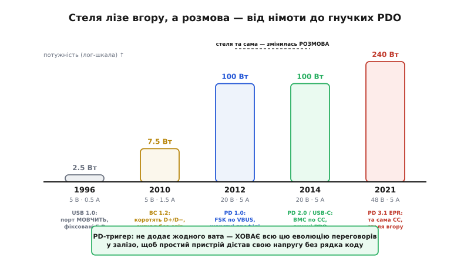

# 📜 Як USB навчився домовлятися про живлення

Тригер, з якого ми починали розмову про sink, здається майже магією: один чип, кілька перемичок — і з розетки тече не жалюгідні 5 вольтів, а стабільні 12 чи 20. Але магії тут нема. У тому чипі спресована **тридцятирічна історія** того, як спершу німий провід для даних поступово вчився вести переговори про потужність. Тригер не винайшов ці переговори — він їх **проковтнув** і сховав у залізо, щоб ви не мусили писати їх самі. Щоб зрозуміти, чому він улаштований саме так — і чому взагалі знадобився, — варто пройти цю дорогу від початку: від дроту, який за задумом **не мав** давати струму, до стандарту, що жене по тому ж дроту 240 ват і плавно домовляється про кожен вольт.

Це історія не про винахідника й не про єдину дату осяяння. Це історія колективна: її вели консорціуми, комітети зі стандартів і десятки конкурентних компаній, кожна зі своїм інтересом. І, як то часто буває з добрими інженерними рішеннями, кожен наступний крок народжувався не з чистого аркуша, а з **болю попереднього** — з того, що працювало погано.


*Двадцять п'ять років однією картинкою: стовпчики (лог-шкала) — стеля потужності, від 2.5 Вт у 1996-му до 240 Вт у 2021-му. Під кожним — не лише «скільки», а й **як домовлялися**: спершу порт мовчить і дає фіксовані 5 В; BC 1.2 коротить лінії даних як безсловесний знак; PD 1.0 говорить FSK по силовій шині жорсткими профілями; PD 2.0 переносить розмову на окрему лінію CC гнучкими PDO; EPR лишає ту саму розмову, тільки піднімає стелю. Помітьте, що між 2012 і 2014 стеля не зросла — змінився сам **спосіб** розмови. А тригер (зелена рамка внизу) не додає ват узагалі: він ховає всю цю еволюцію переговорів у залізо для простого пристрою.*

## Дріт, який навмисно не мав давати струму

Щоб оцінити, наскільки далеко все зайшло, треба згадати, з чого USB починався. У грудні 1995-го семеро компаній — **Compaq, Digital Equipment Corporation (DEC), IBM, Intel, Microsoft, NEC і Nortel** — заснували USB Implementers Forum, а перша робоча версія стандарту побачила світ у 1996-му. Мета була проста й вузька: прибрати зоопарк портів на задній стінці ПК — послідовні, паралельні, PS/2 для миші й клавіатури — і замінити їх **одним** універсальним роз'ємом для **даних**. Слово в назві — Universal Serial **Bus**, універсальна послідовна **шина**. Про живлення ніхто всерйоз не думав; п'ять вольтів на контакті були там радше для зручності, щоб миша чи клавіатура не тягли окремий блок.

Саме тому ранній USB був щодо струму навмисно **скупий і німий**. Порт роздавав живлення квантами, які називали **одиничним навантаженням** (англ. *unit load*): один квант — 100 мА. Пристрій на старті мав право взяти рівно один такий квант, а щоб отримати більше, мусив **попросити дозволу** в господаря шини — і то не «дай скільки хочу», а «дозволь мені стільки-то одиничних навантажень». Стеля була жорстка: максимум п'ять квантів, тобто 500 мА. При п'яти вольтах це дає:

```
Стеля раннього USB:
  1 одиничне навантаження = 100 мА
  максимум               = 5 × 100 мА = 500 мА
  потужність             = 5 В × 0.5 А = 2.5 Вт
```

Два з половиною вати. Цього вистачало на мишу, флешку, вебкамеру — і зовсім не вистачало ні на що серйозніше. Але зверніть увагу на **сам принцип**, бо він виявиться наскрізним для всієї подальшої історії: уже тут закладено ідею, що пристрій не просто **бере** струм, а **домовляється** про нього — питає дозволу й дістає квоту. Уся дальша еволюція — це не поява переговорів із нічого, а нескінченне **розширення** цієї початкової думки: від «скільки сотень міліампер» до «яку саме напругу й скільки ампер», аж до плавного ведення напруги крок за кроком.

> 🔧 **Навіщо це.** Коли ви бачите в описі порту «500 мА» чи «900 мА» (у USB 3.0 квант підняли до 150 мА, стеля стала шість квантів — 900 мА) — це не випадкові числа, а прямий спадок одиничного навантаження. І коли пристрій «не запускається від слабкого порту», причина часто саме тут: він мовчки взяв понад дозволену квоту з порту, який за старим правилом стільки давати не зобов'язаний.

## Перший злам: як зарядці сказати, що вона зарядка

Німа скупість USB упиралася в реальність: у 2000-х телефони й плеєри масово почали заряджатися саме від USB, бо це було зручно — той самий кабель для даних і для струму. Але виникла безглузда пастка. Зарядний блок у розетці **фізично здатен** дати амперу й більше — а підключений телефон за правилами шини не має права взяти понад 500 мА, бо він **не знає**, куди його ввімкнули: у справжній USB-порт комп'ютера (де діють суворі квоти) чи в тупий зарядний блок (де ніяких квот нема, бо там і комп'ютера нема). Дроти ті самі, роз'єм той самий — а поводитися треба по-різному.

Потрібен був спосіб пристроєві **розпізнати**, куди його встромили, — і зробити це **без обміну повідомленнями**, бо в дешевому зарядному блоці нема ніякого процесора, який вів би розмову. Відповідь, яку 2007-го дав перший документ про зарядку від USB, а 2010-го відшліфувала **Battery Charging Specification 1.2** (BC 1.2, фінальна редакція — 7 грудня 2010 року, під егідою USB-IF; статус доказовості — усталено), геніальна у своїй грубості. Замість розмови — **фізичний знак на лініях даних**.

У звичайному USB-кабелі, крім живлення (VBUS і земля), є дві лінії даних — **D+ і D−**. У порту комп'ютера вони підтягнуті вниз через резистори й слугують для обміну байтами. BC 1.2 сказав: нехай спеціальний зарядний блок — його назвали **DCP** (англ. *Dedicated Charging Port* — «виділений порт для заряджання») — усередині себе **закоротить D+ і D− між собою** (точніше, з'єднає їх опором не більше 200 Ω). Це і є весь «сигнал»: якщо лінії даних коротко з'єднані, значить, перед нами не комп'ютер, а зарядний блок, від якого можна брати повний струм.

Як пристрій це намацує, теж красиво, і варто зупинитися на механізмі, бо в ньому вся суть підходу. Пристрій не чекає повідомлень — він сам **промацує** лінії. Він подає невелику напругу-пробу на D+ (у специфікації її звуть **VDP_SRC**) і дивиться, що з'явиться на D−. Логіка проста, як стук по стіні:

```
Пробуємо: подаємо напругу-пробу на D+, читаємо D−
  D− лишилось низьким  → лінії РОЗ'ЄДНАНІ → це звичайний порт (SDP), бери ≤500 мА
  D− піднялось за пробою → лінії З'ЄДНАНІ (закорочені всередині) → це зарядка (DCP)
                          → можна брати до 1.5 А
```

Якщо проба «перетекла» з D+ на D− — лінії всередині з'єднані, перед нами DCP, і телефон сміливо бере до **1.5 А**, тобто 7.5 Вт замість колишніх 2.5. Був і третій, компромісний тип порту — **CDP** (англ. *Charging Downstream Port*, «порт-нащадок із заряджанням»): це вже розумніший порт, який і дані передає, і дозволяє ті самі 1.5 А. Його пристрій розпізнає окремим, другим кроком проби. Але суть трюку DCP лишається та сама: **знак замість слів**.

```
Три типи порту за BC 1.2:
  SDP  (Standard Downstream Port)   — звичайний порт ПК:  ≤ 500/900 мА, дані є
  CDP  (Charging Downstream Port)   — порт із заряджанням: до 1.5 А, дані є
  DCP  (Dedicated Charging Port)    — тупий зарядний блок: до 1.5 А, даних нема
                                       (D+ і D− закорочені опором ≤ 200 Ω)
```

Це ще **не переговори** в повному сенсі — тут ніхто нічого не «просить» і не «погоджує», сторони не обмінюються повідомленнями. Це радше **пароль**: одна сторона мовчки виставила знак, друга мовчки його намацала й зробила висновок. Але це вже величезний крок від повної німоти: пристрій уперше отримав спосіб **зрозуміти оточення** й підлаштувати свій апетит. І — що важливо для нашої теми про тригери — усе це відбувається **без жодного рядка коду й без процесора з обох боків**. Дешевий контролер заряджання в телефоні намацує пароль апаратно. Це перший натяк на майбутню філософію тригера: складне рішення про живлення можна **зашити в залізо**, якщо воно достатньо просте, щоб обійтися без справжньої розмови.

> 🔧 **Навіщо це.** BC 1.2 і досі всюди — це той рівень, на якому працює абсолютна більшість дешевих зарядних блоків і павербанків «на 5 вольтів 2 ампери». Коли ваш пристрій має живитися й від сучасної PD-зарядки, і від старого 5-вольтового блока, нижнім поверхом його логіки часто лишається саме BC 1.2: «PD не вийшло — намацаю хоча б DCP і візьму свої 1.5 А». Як пристрої, що взагалі не знають PD, годуються цими старими способами кодування по лініях даних — окрема довга розповідь, і ми до неї ще звернемось наприкінці.

## Народження справжніх переговорів: USB Power Delivery 1.0

BC 1.2 підняв стелю до 7.5 Вт — і вперся в неї. Бо весь фокус із закорочуванням D+/D− давав лише **більший струм при тих самих п'яти вольтах**. А для ноутбука, монітора чи потужного пристрою п'яти вольтів мало в принципі: щоб передати серйозну потужність малим струмом (а отже, тонким кабелем, що не гріється), потрібна **вища напруга**. Знаком на лініях даних вищу напругу не виторгуєш — «пароль» уміє сказати лише «я зарядка», але не «дай мені, будь ласка, дванадцять вольтів, а якщо можеш, то й двадцять». Для цього потрібна **справжня двостороння розмова**: меню того, що джерело вміє, вибір пристрою, згода джерела.

Таку розмову приніс **USB Power Delivery**. Її першу версію, PD 1.0, оголосила **USB Promoter Group** — група компаній-рушіїв стандарту — 5 липня 2012 року (статус доказовості — усталено). І тут важливо чесно назвати авторство, бо це рівно той випадок, де легко зісковзнути в міф про «геніальний винахід однієї фірми». Ніякої однієї фірми нема. USB Promoter Group і ширший USB-IF — це **консорціум**: сьогодні до групи-рушія входять Apple, Hewlett-Packard, Intel, Microsoft, Renesas, STMicroelectronics і Texas Instruments, а сам форум налічує сотні компаній-учасниць. PD — плід узгодження їхніх інтересів, компроміс конкурентів, а не осяяння одинака. Це варто пам'ятати щоразу, коли якесь джерело намагається приписати такий стандарт одному «геніальному» бренду чи країні: подібні речі народжуються **комітетами**, і в цьому їхня сила (сумісність) і водночас їхня незграбність (про яку — за мить).

PD 1.0 замахнувся широко: до **100 ват** — 20 вольтів при 5 амперах. Стрибок від 7.5 до 100 Вт — більш ніж у десять разів — і саме він уперше зробив реальною думку «живити ноутбук тим самим кабелем, що й мишу». Пристрій міг тепер не просто взяти більший струм, а **попросити геть іншу напругу**, якої на голому USB зроду не бувало.

Але — і це ключове для розуміння, чому далі все переробили, — **як саме** PD 1.0 вів цю розмову, було, м'яко кажучи, незграбно. Згадайте: 2012 рік, роз'єму USB-C ще не існує (він з'явиться аж за два роки). PD 1.0 мусив працювати на **старих** роз'ємах Type-A і Type-B, а в них нема жодної вільної лінії, спеціально відведеної під переговори про живлення. Лінії даних зайняті даними; окремого проводу для розмови нема. Куди подіти сигнал?

Рішення було відчайдушне: **говорити прямо по силовій шині VBUS**. PD 1.0 накладав переговорний сигнал на ту саму лінію, якою тече живлення, за допомогою **частотної маніпуляції** — FSK (англ. *frequency-shift keying*, «маніпуляція зсувом частоти»: нулі й одиниці кодують двома різними частотами дрібного коливання, підмішаного до постійної напруги). Уявіть, що ви ведете тиху розмову, накладаючи слова легким тремтінням на потужний силовий кабель, по якому водночас тече струм для ноутбука. Це працювало, але було **крихким** і складним у реалізації: приймати таку модуляцію на зашумленій силовій шині, де струм стрибає при кожній зміні навантаження, — інженерний головний біль.

## Чому перші переговори виявилися надто негнучкими

Незграбним було не лише «як говорили», а й **про що** домовлялися. PD 1.0 не давав пристроєві вимагати довільну напругу — тільки вибрати один із наперед визначених **профілів** (англ. *Power Profile*). Профілів було п'ять, вкладених один в одного драбинкою:

```
Фіксовані профілі PD 1.0 (пристрій міг узяти лише готовий рядок):
  Профіль 1:  5 В              до 2 А   → 10 Вт
  Профіль 2:  5 / 12 В         до 1.5 А → 18 Вт (на 12 В)
  Профіль 3:  5 / 12 / 20 В    до 3 А   → 60 Вт (на 20 В)
  Профіль 4:  5 / 9 / 15 / 20 В до 3 А  → 60 Вт
  Профіль 5:  те саме          до 5 А   → 100 Вт (на 20 В)
```

Проблема цієї драбини — її **жорсткість**. Профілі були прив'язані до конкретних напруг, і пристрій мусив брати рядок цілком, без права на проміжне значення. Треба вам, скажімо, 19 вольтів для якогось ноутбука — такого варіанта в меню просто нема; бери 15 або 20 і викручуйся сам. Ще гірше з батареями: щоб заряджати літієву комірку напряму, напругу треба вести плавно й безперервно за станом заряду, а фіксована драбина цього не вміла в принципі. І, як завжди з речами, зробленими комітетом на компроміс, профілі виявилися заплутаними для покупця: два зарядні блоки «на 60 ват» могли підтримувати різні профілі й тому годитися для різних пристроїв — а на вигляд однакові.

Отут і проступає **справжня причина**, чому згодом виникли PD-тригери — і чому цей розділ історії варто знати кожному, хто робить sink. Переговори PD виявилися **потужними, але важкими**: крихкий FSK по силовій шині, складний протокол зі станами й таймінгами, заплутані профілі. Реалізувати повний PD-стек на кожному дрібному пристрої — це процесор, прошивка, налагодження часових діаграм, сертифікація. Абсурдно дорого, коли все, що потрібно твоєму моторному драйверу, — це стабільні 12 вольтів і байдуже як. Ринок відповів очевидним: якщо переговори завжди ведуть до **однієї й тієї ж** відповіді («дай мені 12 В»), то навіщо їх щоразу програмувати? Зашиймо цю одну розмову в **окремий чип** раз і назавжди. Так з'явився клас мікросхем-тригерів: маленький автомат, що знає **весь** протокол PD апаратно, але веде його заради **єдиної наперед заданої** мети. Тригер — це пряма реакція на складність переговорів: він бере ту складність на себе, щоб решта пристрою її не бачила.

> 🔧 **Навіщо це.** Коли ви обираєте між тригером і повним стеком на МК, ви фактично повторюєте той самий вибір, що постав перед індустрією після PD 1.0: чи потрібна вам **гнучкість** справжніх переговорів — чи досить **однієї зашитої відповіді**. Історія тут не прикраса, а підказка: гнучкість PD завжди коштувала дорого, і тригер придумали саме тому, що для більшості простих пристроїв ця гнучкість — зайвий тягар. Беріть тригер не тому, що він «слабший», а тому, що для сталої напруги вся міць переговорів марна.

## USB-C усе виправляє: розмова переїжджає на власну лінію

Справжнє полегшення прийшло 2014-го разом із роз'ємом **USB-C** (специфікацію Type-C 1.0 USB-IF затвердив у серпні 2014 року; статус доказовості — усталено). USB-C був спроєктований уже з пам'яттю про весь цей біль — і серед його 24 контактів з'явилася річ, якої так бракувало: окрема службова лінія **CC** (англ. *Configuration Channel*, «канал конфігурації»). Це виділений провід **саме для домовляння**: по ньому визначають, який бік джерело, а який приймач, який кабель підключено, — і по ньому ж тепер іде вся розмова PD.

З появою CC переговори переїхали зі силової шини на власну лінію — і одразу подешевшали й поспокійніли. Оновлений протокол, **PD 2.0**, викинув крихкий FSK і перейшов на просте й надійне кодування **BMC** (англ. *Biphase Mark Coding*, «двофазне маркерне кодування»: біти кодують не рівнем напруги, а **наявністю переходу** — така розмова не залежить від того, який бік кабелю куди повернули, що для симетричного USB-C критично) на швидкості близько 300 кбіт/с. Ту саму розмову тепер вели окремим тихим проводом, а не тремтінням силового кабелю під струмом. Розповідь про те, [як улаштоване це рукостискання по CC](root:com-devices/usb-pd) — хто виставляє резистори, як біти лягають у повідомлення, — то окрема тема; тут важить сам історичний поворот: **переговори дістали власне місце**, і від того стали простими.

Разом із новою лінією прийшла й нова, гнучкіша **мова** домовляння. Замість жорстких профілів PD 2.0 запровадив **PDO** (англ. *Power Data Object* — «об'єкт-опис живлення»): джерело виставляє список рядків-можливостей «я вмію ось таку напругу при ось такому струмі», а приймач вибирає потрібний. Це вже не п'ять застиглих драбин, а живе меню, яке кожне джерело складає під себе. А трохи згодом, у PD 3.0, з'явилося те, чого фіксовані профілі не могли дати зроду, — **PPS** (англ. *Programmable Power Supply*, «програмоване джерело»: режим, де напругу й струм ведуть плавно, дрібними кроками). Саме PPS уперше дозволив пристроєві веліти зарядці «а тепер дай на 20 мілівольтів більше» — і тим перетворити саме джерело на плавний зарядник батареї, ведучи напругу за станом комірки. Драбина стала пандусом.

Зверніть увагу на промовисту деталь, винесену на нашій картинці окремою пунктирною лінією: між PD 1.0 (2012) і PD 2.0 (2014) **стеля потужності не змінилася** — як було 100 ват, так і лишилося. Змінився **сам спосіб розмови**: крихкий FSK по силовій шині поступився надійному BMC по власній лінії, а застиглі профілі — гнучким PDO. Це важливий урок про природу таких стандартів: часто найцінніше оновлення — не «більше ват», а «зручніше домовлятися». Число на коробці те саме, а користуватися стало легше на порядок.

## Стеля піднімається знову: EPR і 240 ват

Сто ват здавалися стелею надовго — доти, доки їх не почало бракувати вже й ноутбукам. Ігрові машини, потужні робочі станції, великі монітори просили більше, ніж 20 В × 5 А могли дати. Піднімати струм понад 5 А небезпечно: тонкий кабель на такому струмі надто гріється, а втрати на ньому ростуть як квадрат струму. Лишався один шлях — **вища напруга**.

2021 року (травень; статус доказовості — усталено) USB-IF випустив **PD 3.1** із розширенням **EPR** (англ. *Extended Power Range*, «розширений діапазон потужності»). Воно підняло стелю зі 100 аж до **240 ват** — за рахунок нових фіксованих напруг 28, 36 і 48 вольтів понад колишні. Логіка та сама, що вела всю історію: більше потужності беруть **вищою напругою, а не більшим струмом**, бо це щадить кабель. Струм лишили тих самих 5 А, а от напругу підняли майже вп'ятеро проти початкових п'яти вольтів:

```
Куди зросла стеля EPR (PD 3.1, 2021):
  нові фіксовані напруги:  28 В → 140 Вт
                           36 В → 180 Вт
                           48 В → 240 Вт   (за тих самих 5 А)
  той самий канал CC, те саме кодування BMC — тільки числа вищі
```

Важливо, що EPR **не переписував** механіку розмови — він лишив ту саму лінію CC й те саме кодування, просто додав у меню вищі рядки. Це знак зрілості стандарту: коли фундамент переговорів побудовано добре, нарощувати потужність можна, не ламаючи все наново. Але й ціна за 240 ват реальна: щоб пустити понад 3 ампери чи перейти в EPR-напруги, потрібен **розумний кабель** — з e-marker, крихітною мікросхемою всередині, що чесно каже системі, на що цей кабель розрахований. Німий провід, з якого починалася історія, в кінці її сам мусив навчитися говорити хоч слово про себе.

## Що з усього цього спресовано в тригері

Тепер повернімося до чипа, з якого почали, — і подивімося на нього новими очима. Пройшовши всю дорогу, ми бачимо: PD-тригер — це **вся ця історія, стиснута в кремній**. Усередині нього живе повний автомат переговорів PD по лінії CC: він уміє намацати профілі, скласти PDO-запит, дочекатися згоди — тобто робить те саме, що робив би повноцінний стек на процесорі. Але веде він цю розмову **заради єдиної, наперед вибраної мети**. Він не пропонує вам гнучкості PPS, не вміє передумати, не веде напругу плавно за станом батареї. Він робить рівно одне: щоразу програє **ту саму** вивчену розмову, щоб дістати **ту саму** напругу.

І тепер зрозуміло, **чому** він саме такий — і чому взагалі знадобився. Індустрія тридцять років будувала все складніший і гнучкіший механізм домовляння: від німого проводу через грубий пароль BC 1.2 до крихкого FSK перших переговорів і, нарешті, до зрілої гнучкої розмови по CC. Та сама гнучкість, що робить PD могутнім, робить його **дорогим** для дрібного пристрою, якому потрібні лише сталі дванадцять вольтів. Тригер — це відповідь на цю невідповідність: він **проковтнув** усю складність переговорів раз і назавжди, щоб решта пристрою могла про неї не знати. Уся тридцятирічна еволуція «як домовлятися» захована так глибоко, що для розробника лишається одна перемичка: «яку напругу просити». Магія тригера — це не відсутність переговорів, а переговори, доведені до такої досконалості, що їх можна **сховати в один чип і забути**.

Ось у чому головний урок цієї історії для того, хто проєктує sink. Складність PD-переговорів — не забаганка комітету, а накопичений за тридцять років шар рішень, кожне з яких лікувало біль попереднього. Ви можете взяти всю цю складність собі — повним стеком на МК, з усією його гнучкістю й усіма його способами зламатися. А можете лишити її **всередині тригера** й дістати свою напругу задарма. Вибір між ними — це, по суті, вибір того, **скільки з цієї історії** вам справді треба тримати в руках. Для сталої напруги — жодного шматка: нехай усе живе в чипі. Для змінних режимів і плавного заряджання батареї — доведеться взяти рівно стільки гнучкості, скільки додав відповідний виток цієї еволюції, і не більше.

А для пристроїв і портів, які всієї цієї історії просто **не застали** — старий телефон, дешевий блок, порт, що знає хіба BC 1.2, — розмова про живлення й досі точиться тими першими, грубими способами: [кодуванням по лініях даних без жодних справжніх переговорів](root:com-devices/legacy-charging-dialects). Історія не викидає старі поверхи — вона надбудовує над ними нові; і добрий sink мусить пам'ятати їх усі, від німого проводу 1996-го до гнучких PDO сьогодні.
