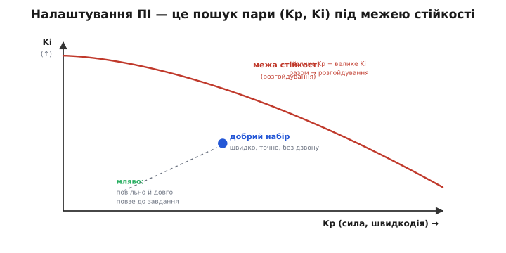
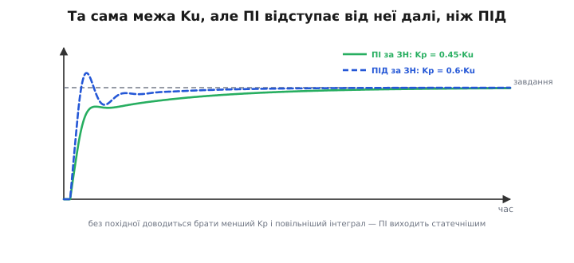
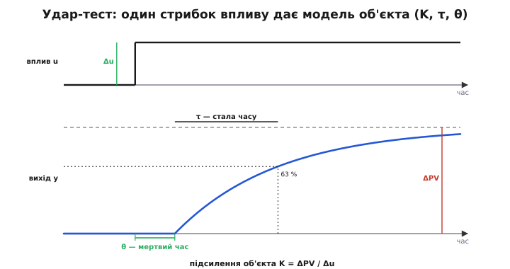
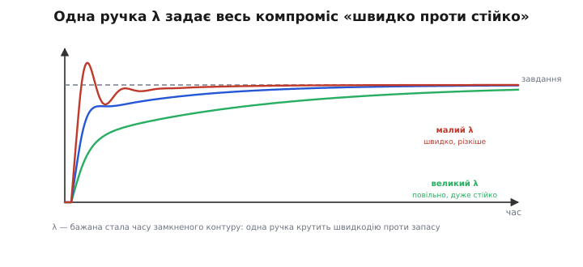

# Налаштування ПІ-регулятора

Дивний факт: найпоширеніший регулятор у світі — не повний ПІД. Опитування промислових контурів дають ту саму картину знов і знов — понад 95 % усіх контурів керування мають ПІД-структуру, та **похідну в більшості з них вимкнено**. Тобто реально працює **ПІ** — пропорційна плюс інтегральна, без диференційної. Температура в печі, тиск у трубі, витрата рідини, оберти мотора — усе це здебільшого тримають саме два числа, Kp та Ki.

Ми вже [зібрали ПІ-регулятор](root:embedded/integral-control): P дає швидку пружну реакцію на помилку зараз, I прибирає сталий зсув, накопичуючи минулу помилку. Знати формулу — половина справи; лишається друга, суто практична — **дібрати ці два числа** під конкретний об'єкт. І хоч [налаштування повного ПІД](root:embedded/pid-tuning-cascade) ми вже розбирали, ПІ заслуговує власної розмови, і не тому, що він простіший. Навпаки: коли ви **відмовляєтеся** від похідної, ви позбуваєтеся єдиної складової, що дивиться наперед і гасить коливання завчасно, — а отже, мусите інакше шукати рівновагу між швидкодією і стійкістю. ПІ — це не «ПІД без однієї літери», а самостійне ремесло зі своїми правилами.

### Чому взагалі без похідної

Почнімо з питання, від якого все залежить: коли свідомо **викидають** D? Адже [диференційна складова](root:embedded/derivative-control) корисна — гасить переліт, дозволяє підняти Kp. Та в неї є невблаганна вада: вона реагує на **швидкість зміни** помилки, а отже, нещадно підсилює **шум** виміру. Найменше тремтіння давача — і похідна перетворює його на смикання виконавчого органу. Там, де сигнал зашумлений (а в промисловості зашумлено майже все: давачі тиску, витратоміри, термопари), D приносить більше лиха, ніж користі.

Є й друга причина, тонша. D має сенс лише тоді, коли система встигає **передбачати** свій рух наперед. Якщо об'єкт повільний і добре передбачуваний — піч, що гріється хвилинами, бак, що наповнюється, — то накопиченої й поточної помилки цілком досить, аби тримати його точно; вгадувати майбутнє нема потреби. Похідна тут не додає швидкодії, лише ловить шум. Тому інженери й беруть за замовчанням ПІ, а D додають лише там, де він справді потрібен — у швидких механічних контурах із чистим виміром (привід, що мусить різко й точно відпрацьовувати, стабілізація з малою інерцією).

> 🔧 **Навіщо це.** Перше рішення в налаштуванні — навіть не «які числа», а «**чи потрібна взагалі похідна**». Правило просте: давач шумить або об'єкт повільний і терплячий — беріть **чистий ПІ** і не майте клопоту з D. Похідну додавайте, лише коли ПІ не дає водночас і швидко, і без перельоту, **а вимір при цьому чистий**. У дев'яти промислових контурах із десяти відповідь — ПІ; не ускладнюйте те, що добре працює двома числами.

### Дві ручки, що тягнуть в один бік

Налаштувати ПІД — це жонглювати трьома числами, де D частково розв'язує конфлікт між P та I. У ПІ ручок лише дві — і це не вдвічі легше, бо тепер вони **обидві** працюють у тому самому напрямку до межі стійкості, і немає третьої, що тримала б її осторонь.

Згадаймо, що робить кожна. **Kp** дає силу: більший Kp — швидша, різкіша реакція, але за ним [тягнеться розгойдування](root:embedded/proportional-control). **Ki** дає наполегливість: більший Ki — швидше зникає зсув, але [інтеграл діє із запізненням](root:embedded/integral-control) і теж штовхає контур до коливань. Підступність у тому, що **обидва** наближають систему до того самого зриву — нарощуючи будь-який із них, ви рухаєтесь до межі. У повному ПІД похідна повертала частину запасу, тож можна було сміливіше; у ПІ цього запасу нема, і ходити доводиться обережніше.


*Налаштування ПІ — це вибір точки на площині (Kp, Ki). Лівий нижній кут — обидва замалі: вихід мляво повзе до завдання. Верхній правий, за червоною межею, — обидва завеликі: контур розгойдується. Добрий набір лежить смугою попід межею: досить великі обидва числа, щоб бути швидким і точним, але з запасом до зриву. Ключове — межу перетинає і завелике Kp, і завелике Ki, тож тиснути на обидва наосліп небезпечно.*

Звідси випливає головний практичний принцип ПІ: **налаштовувати по черзі, не разом**. Точно як у [ручному налаштуванні ПІД](root:embedded/pid-tuning-cascade), але без кроку з D:

```
 1. Ki = 0. Підіймайте Kp, доки реакція не стане швидкою й ледь-ледь
    недорозгойданою. Це — кістяк: уся основна сила тут.
 2. Тепер потроху додавайте Ki, спостерігаючи, як зникає сталий зсув.
    Щойно з'явилося повільне наростальне гойдання — Ki завеликий, відступіть.
 3. Якщо додавання Ki змусило знизити Kp заради спокою — так і зробіть.
    Кінцевий набір завжди компроміс, де обидва числа узгоджені.
```

Чому спершу P? Бо саме він робить роботу, а I лише чистить залишок. Поставити великий Ki на млявий P — певний шлях до повільного, підступного гойдання, у якому годі розібратися, що винне. А зробивши навпаки, ви бачите дію кожного числа окремо.

> 🔧 **Навіщо це.** Не крутіть Kp і Ki одночасно — заплутаєтесь. Спершу самим Kp (при Ki = 0) добийтеся швидкої реакції на межі легкого дзвону, тоді додавайте Ki рівно стільки, щоб зсув зникав за прийнятний час. І пам'ятайте розподіл праці: Kp бореться з помилкою **зараз**, Ki — зі **сталою**. Якщо реакція повільна — це до Kp, а не до Ki; якщо вихід застигає нижче завдання — це до Ki, а не до Kp. Плутати їхні ролі — найчастіша помилка початківця.

### Зіглер–Ніколс для ПІ: чому числа інші

[Метод Зіглера–Ніколса](root:embedded/pid-tuning-cascade) дає швидкий старт і для ПІ. Процедура та сама: лишивши тільки P, піднімають Kp до **граничної жорсткості** Ku, за якої контур входить у рівні незгасні коливання, і міряють їхній **період** Tu. Та формули за цими двома числами для ПІ **відрізняються** від ПІД — і саме ця відмінність повчальна:

```
 Зіглер–Ніколс, гранична точка (Ku, Tu):

   тільки P:   Kp = 0.5  · Ku
   ПІ:         Kp = 0.45 · Ku,   Ti = Tu/1.2  (≈ 0.83·Tu)
   ПІД:        Kp = 0.6  · Ku,   Ti = 0.5·Tu,  Td = 0.125·Tu
```

Подивіться, що сталося, коли ми **прибрали** похідну: Kp упав із 0.6·Ku до 0.45·Ku, а інтегральний час Ti **виріс** із 0.5·Tu до 0.83·Tu (тобто інтеграл став **повільнішим**). Обидва числа стали обережнішими. Це не примха таблиці, а пряма розплата за відсутність D.


*Та сама виміряна межа Ku, але різні набори. ПІ (зелений) із нижчим Kp = 0.45·Ku і повільнішим інтегралом виходить статечніше; ПІД (синій) із Kp = 0.6·Ku і швидшим інтегралом спритніший — бо похідна повертає йому запас фази, який можна витратити на сміливіші коефіцієнти. Прибрали D — і за неї розплачуєтесь млявішим контуром.* У повному ПІД саме похідна додавала на критичній частоті випередження фази — той запас, яким «викуповували» і відставання інтеграла, і вищий Kp. Без D платити нічим: доводиться і знизити підсилення, і пригальмувати інтеграл, щоб не з'їсти й без того скромний запас. [Звідки беруться самі коефіцієнти Зіглера–Ніколса](root:embedded/pid-tuning-cascade/math-ziegler-nichols.md) — окрема історія; нам тут важливий висновок: **кожна літера, яку ви додаєте, дозволяє решті бути сміливішою, і навпаки**.

**Приклад (ПІ за Зіглером–Ніколсом).** Піднімаючи підсилення оборотів мотора, знайшли межу: Ku = 6, період коливань на ній Tu = 0.4 с. Тоді

```
 Kp = 0.45 · 6        = 2.7
 Ti = 0.4 / 1.2       = 0.333 c
 Ki = Kp / Ti = 2.7 / 0.333 = 8.1
```

У прошивці це звичайне присвоєння — і одразу видно перехід між двома формами запису, бо метод дає **час** Ti, а код тримає **коефіцієнт** Ki:

```c
// відправний ПІ за Зіглером–Ніколсом (Ku = 6, Tu = 0.4 c)
float Ku = 6.0f, Tu = 0.4f;
float Kp = 0.45f * Ku;          // = 2.70
float Ti = Tu / 1.2f;           // = 0.333 c  (інтегральний час)
float Ki = Kp / Ti;             // = 8.10     (коефіцієнт для коду)
// далі: перевірити на реальному об'єкті й донастроїти за кривою відгуку
```

Як і для ПІД, цей набір свідомо різкий — метод цілить у [чвертьамплітудне загасання](root:embedded/pid-tuning-cascade/math-ziegler-nichols.md) з помітним перельотом, — тож його беруть лише **відправною точкою**, а не фіналом.

> 🔧 **Навіщо це.** Зіглер–Ніколс корисний, коли у вас **нема моделі** об'єкта, зате можна безпечно довести його до коливань. Але саме ця вимога — небезпечна: гнати реальну піч, привід чи насос на межу стійкості ризиковано. Тому метод хороший на стенді чи моделі й поганий «наживо». А головне — пам'ятайте, що для ПІ числа **окремі** (0.45, не 0.6): схопити «універсальну» ПІД-таблицю й застосувати до ПІ — типова помилка, що дає завеликий Kp і непотрібний дзвін.

### Інший шлях: спершу зрозумій об'єкт

Зіглер–Ніколс має спільну рису з ручним налаштуванням: він **не питає, який у вас об'єкт**. Ви тицяєте систему й дивитесь на реакцію, не маючи її опису. Це й сила (працює без моделі), і слабкість (доводиться доводити до межі, а результат різкий). Промисловість давно пішла іншим, ощаднішим шляхом: **спершу виміряти модель об'єкта, тоді розрахувати під неї коефіцієнти** — без жодних коливань, з першого пострілу близько до цілі.

Ідея проста до зухвалості. Дайте об'єктові один-єдиний **стрибок впливу** — відкрийте клапан на сталу величину, додайте моторові фіксованого газу — і запишіть, **як** вихід на це відгукнувся. Ця крива (її звуть **кривою розгону**, англ. *process reaction curve* — крива реакції процесу) містить усе, що треба знати про об'єкт, аби його налаштувати.


*Удар-тест (англ. bump test). Дали стрибок впливу Δu — вихід спершу постояв (мертвий час θ — поки реакція дійде), тоді поплив до нового рівня й застиг. Три числа з цієї однієї кривої описують об'єкт повністю: підсилення K = ΔPV/Δu (наскільки сильно об'єкт реагує), стала часу τ (як швидко — час до 63 % шляху) і мертвий час θ (затримка до початку руху). Жодних коливань — один безпечний поштовх.*

Більшість простих об'єктів — нагрівачі, баки, потоки — поводяться на такий поштовх однаково: трохи постоять (затримка), тоді плавно, по експоненті виповзають на нове плато. Цю поведінку описує модель з трьох чисел, яку звуть **об'єктом першого порядку із запізненням** (англ. *first-order-plus-dead-time*, FOPDT):

```
 K  — підсилення об'єкта:  на скільки змінився вихід на одиницю впливу,  K = ΔPV/Δu
 τ  — стала часу:          як швидко об'єкт реагує (час до 63 % повного зрушення)
 θ  — мертвий час:         запізнення між дією і початком відгуку
```

Усю динаміку об'єкта вкладено в ці три числа. K каже, **наскільки** сильно тиснути; τ — **як швидко** він узагалі здатен рухатися; θ — **наскільки сліпим** буде регулятор, бо протягом θ він діє, ще не бачачи наслідку. Саме θ — головний ворог стійкості: що довша затримка проти τ, то [небезпечніший зворотний зв'язок](root:embedded/loop-stability), бо виправлення приходить дедалі більш невчасно.

### Налаштування під модель: одна ручка λ

Маючи модель (K, τ, θ), коефіцієнти ПІ дістають **прямим розрахунком** — без коливань, без тицяння. Найпоширеніший у промисловості рецепт відомий під двома іменами: **lambda-налаштування** (λ-tuning) і, що те саме для ПІ, **IMC** (англ. *Internal Model Control* — керування на основі внутрішньої моделі). Назви прийшли різними шляхами — [сам термін «lambda» й перші формули](root:embedded/pi-controller-tuning/hist-dahlin-lambda.md) ввів Едґар Далін 1968 року для цифрових регуляторів, а IMC як струнку теорію оформили Гарсія й Морарі на початку 1980-х, — та для ПІ на простому об'єкті обидва підходи [дають **тотожні** формули](root:embedded/pi-controller-tuning/math-imc-pi.md):

```
 ПІ за lambda / IMC, об'єкт (K, τ, θ):

   Ti = τ                       ← інтегральний час дорівнює сталій об'єкта
   Kp = τ / ( K · (λ + θ) )     ← підсилення тим менше, чим більше λ
   Ki = Kp / Ti = 1 / ( K·(λ+θ) )

   λ — бажана стала часу замкненого контуру (ваш єдиний вибір)
```

Тут — уся краса методу. Замість двох чисел, які треба узгоджувати між собою, ви крутите **одну** ручку — **λ** (лямбда): бажану сталу часу **замкненого** контуру, тобто як швидко ви хочете, щоб система виходила на завдання. Малий λ — швидко й різкіше; великий λ — повільно, зате дуже стійко й м'яко. Усе інше формула рахує сама.


*Одна ручка λ задає весь компроміс. Великий λ (зелений) — повільний, але дуже стійкий і м'який відгук, із великим запасом до зриву. Малий λ (червоний) — швидкий, але різкіший, ближчий до коливань. Замість окремо мучити Kp і Ki, ви крутите єдину зрозумілу величину — бажану швидкодію контуру — а формула обертає її на обидва коефіцієнти.*

Чому Ti = τ? Це найелегантніша частина: інтегральний час беруть **рівним сталій часу об'єкта**, щоб інтегратор регулятора рівно «скасував» власну повільність об'єкта. Грубо кажучи, регулятор підлаштовує свій темп під темп об'єкта — і замкнений контур поводиться як проста, чиста система першого порядку зі сталою λ, без зайвого дзвону. [Повне виведення, чому саме Ti = τ і Kp = τ/(K(λ+θ))](root:embedded/pi-controller-tuning/math-imc-pi.md), показує цей механізм у деталях — як вибір Ti = τ скорочує повільний полюс об'єкта, а λ лишається єдиною вільною ручкою, що задає швидкодію.

А як вибрати сам λ? Тут є зрозуміле практичне правило: **бери λ співмірним зі сталою об'єкта τ**. Поширений діапазон — λ від τ до 3·τ: λ ≈ τ дає бадьорий, але ще стійкий контур; λ ≈ 3·τ — дуже спокійний і запасистий, для відповідальних чи зашумлених процесів. Що важливо, формула чесно враховує мертвий час: великий θ автоматично зменшує Kp (бо `λ + θ` у знаменнику росте), тож регулятор сам стає обережнішим там, де об'єкт «сліпий». Це різко контрастує з Зіглером–Ніколсом, який мертвого часу прямо не питає.

**Приклад (lambda-налаштування нагрівача).** Удар-тест печі: підняли потужність на Δu = 10 % і отримали приріст температури ΔPV = 40 °C; рух почався через θ = 12 с, а 63 % шляху вихід пройшов за τ = 80 с від початку руху. Виберемо помірно стійкий контур, λ = τ = 80 с:

```
 K  = ΔPV/Δu = 40 / 10 = 4 (°C на % потужності)
 τ  = 80 c,  θ = 12 c
 λ  = 80 c

 Ti = τ = 80 c
 Kp = τ / (K·(λ+θ)) = 80 / (4·(80+12)) = 80 / 368  = 0.217
 Ki = Kp / Ti       = 0.217 / 80                    = 0.00272
```

```c
// ПІ за lambda-налаштуванням з удар-тесту печі
// модель: K = 4 °C/%, tau = 80 c, theta = 12 c
float K = 4.0f, tau = 80.0f, theta = 12.0f;
float lambda = tau;                        // помірно стійкий контур
float Ti = tau;                            // = 80 c
float Kp = tau / (K * (lambda + theta));   // = 0.217
float Ki = Kp / Ti;                        // = 0.00272
// хочемо вдвічі швидше? зменшуємо ОДНЕ число:
// lambda = 0.5f*tau;  Kp і Ki перерахуються самі — решта не міняється
```

Зверніть увагу, який це інший досвід проти ручного крутіння. Не було ні коливань, ні десятків циклів проб — один безпечний поштовх, три виміряні числа, і коефіцієнти лягли близько до робочих. А коли треба зробити контур швидшим чи спокійнішим, ви чіпаєте **одну** величину λ замість того, щоб навпомацки балансувати два числа.

> 🔧 **Навіщо це.** Якщо об'єкт можна безпечно «вдарити» стрибком впливу й записати відгук — майже завжди вигідніше **виміряти модель і порахувати**, ніж тицяти наосліп. Lambda-налаштування дає вам **одну зрозумілу ручку** λ замість двох плутаних: не подобається швидкодія — крутите λ в один бік, мало запасу — в інший, а Kp і Ki рахуються самі. Це й робить метод улюбленцем промисловості: оператор без теорії керування може безпечно й передбачувано налаштувати контур, думаючи лише про «як швидко» і «наскільки спокійно».

### Під що налаштовуєш: завдання чи збурення

Є ще одне рішення, яке легко проґавити, а воно міняє все: **на що** має добре відповідати ваш контур — на **зміну завдання** чи на **збурення**? Це дві різні задачі, і добрий для однієї набір може бути посереднім для іншої.

Уявіть круїз-контроль. **Стеження за завданням** (англ. *setpoint tracking*) — це коли ви вдарили по педалі «+10 км/год» і хочете швидкого, чистого виходу на нову швидкість без перельоту. **Подавлення збурення** (англ. *disturbance rejection*) — це коли швидкість задана стала, а дорога пішла вгору, і ви хочете, щоб провал швидкості був дрібний і швидко вибраний. Перше — про реакцію на **ваш** новий наказ; друге — про опір тому, що **світ** збиває систему вбік.

Чому набори різні? Бо [інтегральна складова](root:embedded/integral-control) — головний борець саме зі **збуренням**: стале збурення для регулятора виглядає як стала помилка, і Ki невблаганно її виїдає. Якщо ваша головна біда — збурення (а в процесному керуванні так і є: завдання задали раз і тримають роками, а збурення сиплються щодня), то інтеграл хочеться **сильніший**, ніж дав би розрахунок під чисте стеження. І навпаки: lambda-налаштування з його Ti = τ скроєне радше під плавне стеження — для агресивного подавлення збурень інтеграл іноді беруть бадьорішим. Знати, **під що** ви настроюєте, — частина грамотного вибору λ і Ki.

> 🔧 **Навіщо це.** Перш ніж судити, добре чи погано налаштований контур, спитайте: його головна робота — **виходити на нові завдання** чи **тримати одне попри збурення**? Випробовуйте відповідним тестом: для стеження давайте стрибок завдання, для подавлення — кидайте збурення (накиньте навантаження, відкрийте паразитний відбір). Контур, бездоганний на стрибку завдання, може мляво вибирати збурення — і навпаки. Налаштовуйте під ту задачу, яка для вашого пристрою справжня.

### Не забути про межі заліза

Будь-який розрахунок дає коефіцієнти для **ідеального** регулятора — а на реальному об'єкті є виконавчий орган зі **скінченними** межами, і це повертає нас до старого знайомого. Щойно вплив упирається в стелю (клапан повністю відкрито, мотор на максимумі), [інтеграл починає накручуватися](root:embedded/integral-control) — це **windup**, накопичувальне насичення. Він особливо болючий саме для ПІ, бо тут інтеграл несе всю відповідальність за точність (немає D, що пригальмував би переліт), тож роздутий інтеграл б'є з усієї сили.

Тому жодне налаштування ПІ не вважається завершеним без **антивіндапу**. Найдешевший і найнадійніший прийом — **затиснути** інтеграл розумними межами, щоб він сам не міг вимагати більше за повний хід виконавчого органу. Ось як ПІ-крок виглядає в прошивці цілком — із розрахованими коефіцієнтами, насиченням виходу і захистом інтеграла:

```c
// повний крок ПІ-регулятора з антивіндапом (викликати рівно раз на dt)
typedef struct {
    float Kp, Ki;          // коефіцієнти (з lambda-налаштування чи ЗН)
    float integ;           // накопичувач інтеграла (стан)
    float out_min, out_max;// межі виконавчого органу (насичення)
    float i_min, i_max;    // межі самого інтеграла (антивіндап-затиск)
} PI_t;

float pi_step(PI_t *c, float setpoint, float measured, float dt) {
    float e = setpoint - measured;            // помилка
    c->integ += e * dt;                       // накопичуємо площу помилки
    // антивіндап: не даємо інтегралу роздуватися понад межі
    if (c->integ > c->i_max) c->integ = c->i_max;
    if (c->integ < c->i_min) c->integ = c->i_min;
    float u = c->Kp * e + c->Ki * c->integ;   // ПІ-закон
    // насичення виходу під реальний виконавчий орган
    if (u > c->out_max) u = c->out_max;
    if (u < c->out_min) u = c->out_min;
    return u;
}
```

Дрібниця, про яку легко забути: інтеграл варто **обнуляти** в момент «увімкнення» контуру — старту регулювання, зброєння приводу. Інакше накопичений за простою борг (поки регулятор працював «у стіл») вистрелить вихід у першу ж секунду. Тонші схеми антивіндапу — умовне інтегрування, зворотний перерахунок — і повна [реалізація дискретного ПІД на мікроконтролері](book:algorithms/discrete-pid) лишаються окремою темою; для ПІ ж засвойте мінімум: **затиск інтеграла плюс обнулення на старті** рятують від найгірших перельотів майже задарма.

> 🔧 **Навіщо це.** Розрахували ви коефіцієнти бездоганно — а апарат після великого збурення дає дикий переліт. Перша підозра не на числа, а на **windup**: інтеграл накрутився, поки вплив був у насиченні. Для ПІ це особливо ймовірно, бо інтеграл тут робить усю точну роботу сам. Затисніть його межами й обнуляйте на старті — це не вдосконалення, а обов'язкова частина будь-якого реального ПІ.

### Як це сходиться

Тепер уся картина налаштування ПІ складається в один зв'язний хід думки. Спершу — **рішення про структуру**: шум або повільний об'єкт → чистий ПІ без похідної, і це норма, а не компроміс. Тоді — **вибір методу під ситуацію**. Можна тицяти й дивитися: підняти Kp до легкого дзвону, додати Ki проти зсуву, по черзі — надійно й без моделі. Можна довести до межі й узяти Зіглера–Ніколса (Kp = 0.45·Ku, Ti = 0.83·Tu) — швидкий старт, але різкий і ризикований. А можна, і найчастіше варто, **виміряти об'єкт одним ударом-тестом** (K, τ, θ) і порахувати коефіцієнти під нього lambda-методом, крутячи єдину ручку λ. Наприкінці — **межі заліза**: затиск інтеграла й обнулення на старті проти windup, та чесний тест під справжню задачу контуру — стеження це чи подавлення збурень.

Жоден із цих кроків не складний поодинці. Сила — у тому, щоб бачити їх **разом**: яке число за що відповідає, чому без похідної доводиться брати обидва скромнішими, як модель об'єкта обертає здогад на розрахунок, і чому реальне залізо завжди вимагає захисту інтеграла. ПІ невипадково тримає 95 % світових контурів: за двома його числами стоїть рівно стільки розуміння, щоб надійно керувати майже чим завгодно — від печі до мотора, — і тепер ви крутите ці два числа усвідомлено, а не навмання.

---
