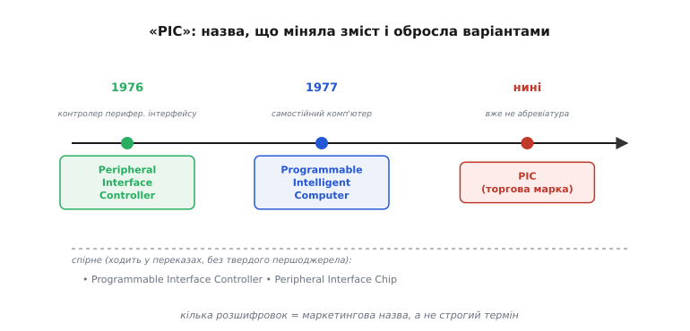
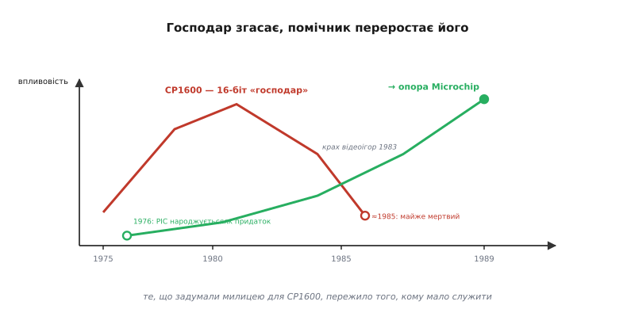

# 📜 Як народився PIC: від придатка до CP1600 до власного імені

> Найпопулярніший 8-бітний мікроконтролер свого покоління народився не як зірка, а як **прислуга**. Його зробили, щоб він знімав чорнову роботу з куди важливішого процесора — і дали йому таке скромне місце в табелі, що навіть назву придумали побіжно, як ярлик на коробці. А потім головний процесор помер, фірма ледь не луснула, а «прислугу» викупили, перейменували й випустили в люди — і вона пережила всіх. Це історія про те, як **дешевий помічник пережив свого господаря**, і чому навіть три літери в його імені досі не мають однієї погодженої розшифровки.

Ми вже розбирали PIC як живий приклад граничної простоти заліза — [єдиний акумулятор, строгий Гарвард, банковану пам'ять](root:embedded/pic-architecture). Але всі ці дивацтва набувають сенсу аж тоді, коли знаєш, **навіщо** цей чип узагалі з'явився. Бо жодне з них не було задумане як «архітектурна ідея» — кожне було відповіддю на дуже приземлене питання: як зробити допоміжну мікросхему якомога **дешевшою**. Щоб це відчути, треба повернутися в середину 1970-х і познайомитися з фірмою, яка PIC випадково й народила.

## Фірма, що робила чипи для телевізорів

**General Instrument** (англ. «загальне приладдя») — це сьогодні майже забуте ім'я, та в 1970-х то була велика американська компанія з Лонг-Айленду, що годувалася зовсім не комп'ютерами. Її хлібом були мікросхеми для **побутової електроніки**: чипи для телевізорів і калькуляторів, для електронних годинників, для перших домашніх ігрових приставок. Це світ, де успіх міряють не швидкодією, а **ціною за штуку**: коли твій чип іде в мільйони дешевих телевізорів, кожен зекономлений цент на кристалі обертається купою грошей. Ця звичка рахувати копійки в’їлася фірмі в кров — і саме вона, а не якась академічна мрія, згодом продиктувала всю аскезу PIC.

Усередині GI був підрозділ мікроелектроніки — той самий, що згодом стане окремою компанією. Він умів робити **MOS-мікросхеми великого ступеня інтеграції** (LSI — *large-scale integration*, англ. «велика інтеграція») і навіть був одним із піонерів електрично-перезаписуваної постійної пам'яті. Тобто люди там були тямущі. Просто галузь, у якій вони працювали, винагороджувала не блиск, а **ощадливість**. Тримайте це в голові — це ключ до всього подальшого.

> 🔧 **Навіщо це.** Походження фірми пояснює характер чипа краще за будь-який даташит. Коли вас дивує, чому в PIC усе так по-спартанськи врізано, згадайте: його робила компанія, що звикла продавати чипи в дешеву масову електроніку, де перемагає найдешевший. Архітектура — завжди відбиток того ринку, під який її точили; уміючи бачити цей відбиток, ви тверезіше читаєте будь-який мікроконтролер.

## CP1600: великий процесор, у якого боліли ноги

Тепер головна дійова особа першої дії — і це **не** PIC. На початку 1970-х General Instrument забажала свій повноцінний **16-бітний процесор** — це тоді була межа престижу, бо більшість світу ще сиділа на 8 бітах. Розробляли його не самотужки, а **в парі з компанією Honeywell**, і світ побачив його близько **лютого 1975 року** під назвою **CP1600**. Це був один із перших однокристальних 16-бітних мікропроцесорів узагалі — компанію йому в ті роки складали хіба National PACE і трохи пізніший TI TMS9900.

> 📌 *Статус «найперший»: спірно.* Лаври першого однокристального 16-бітного частіше віддають **National Semiconductor PACE** (кінець 1974 або 1975 — джерела розходяться), а не CP1600. Тож точніше казати «один із перших», а не «перший»: однокристальні 16-бітні постали майже одночасно в кількох фірмах, і битва за пріоритет тут радше про місяці, ніж про ясну першість.

Щоб зрозуміти, який це був звір, досить однієї деталі: архітектурно CP1600 сильно скидався на **PDP-11** — легендарний міні-комп'ютер компанії DEC. Він мав вісім 16-бітних регістрів і систему команд, що йшла слідами PDP-11 (хоч і не була з нею сумісна). Це був, без перебільшення, маленький міні-комп'ютер на одному кристалі. Найгучніше він засвітився навіть не в комп'ютерах: його здешевлений варіант **CP1610** став мозком ігрової приставки **Intellivision** від Mattel, якої з 1980 року наробили понад три мільйони, — аж доки крах ринку відеоігор 1983-го не прибив усю цю лінію.

І все ж у цього потужного процесора була прикра **слабка пляма**. Сам по собі він рахував чудово, та коли треба було поспілкуватися із зовнішнім світом — поморгати світлодіодом, опитати кнопку, поговорити з якоюсь мікросхемою, — починалися муки. Шина CP1600 була **складна й сильно мультиплексована** (одні й ті самі лінії в різні моменти означали різне), тож **підключити до неї звичайну периферію було важко**. А коли периферію таки чіпляли, потужний 16-бітний процесор мусив сам стояти над кожною дрібницею введення-виведення — смикати ніжки, чекати на сигнали, рахувати такти. Уявіть професора математики, якого приставили вручну перебирати поштові конверти: він це зможе, але це **марнування дорогої голови** на чорну роботу.

Ось він, той первородний клопіт, з якого все й почалося. У GI постало суто інженерне питання: навіщо ганяти дорогий 16-бітний процесор на тупу метушню з ніжками? Чи не дешевше посадити поруч **окрему дрібну мікросхему**, яка візьме всю цю чорну роботу на себе?

## Народження помічника

Так у **1976 році** на світ і з'явився PIC — не як самостійний мозок, а як **розвантажувач введення-виведення** для CP1600. Перші члени родини дістали імена **PIC1650** та його варіант без вшитої програми; трохи поодаль стояв і споріднений PIC1640. Задум був простий і красивий: хай дорогий процесор займається тим, що вміє найкраще — рахує, — а вся метушня з ніжками, кнопками й сигналами лягає на крихітного дешевого помічника поруч. Помічник бере на себе ноги, професор лишає собі голову.

І саме тут — корінь усієї подальшої вдачі PIC. Якщо це **допоміжний** чип, що має тулитися в систему мільйонними тиражами, то головна чеснота для нього — **дешевизна кристала**, і нічого більше. Не універсальність, не зручність для програміста, не багатство можливостей — а ціна. Кожне архітектурне рішення приймали під цим єдиним кутом, і кожне різало щось задля копійок:

```
єдиний регістр W   ← не треба поля «який регістр» у команді → команда вужча → дешифратор простіший
строгий Гарвард    ← слово коду кроїться окремо, рівно під «команда + адреса» → один такт, простіше залізо
банкована пам'ять  ← адреса влізла в слово команди, лишилося мало біт → ділимо RAM на банки по 128
стек на 2 рівні    ← глибокий стек коштує заліза, а помічнику глибока вкладеність ні до чого → ріжемо до двох
```

Жодна з цих рис не «архітектурна ідея заради ідеї». Усі вони — **наслідки одного слова «дешево»**, продиктованого роллю помічника. Та сама причинно-наслідкова нитка, що тягнеться крізь усю [архітектуру PIC](root:embedded/pic-architecture), починається саме тут, у задумі 1976 року. Цікаво, що того ж 1976-го Intel випустила свій 8048 — теж дрібний контролер, але з іншою філософією; PIC від самого початку стояв на крайньому полюсі ощадливості.

Архітектурно перші PIC були вже впізнавані: 40-вивідний корпус, живлення 5 вольтів, та сама **Гарвардська** будова з 12-бітним словом команди, 8-бітними даними і стеком на два рівні, що ми знаємо й донині як baseline-покоління. Тобто ядро, яке через сорок років усе ще можна купити, у головних рисах склалося відразу — бо відразу було підпорядковане одній меті.

## Три літери, чотири розшифровки

А тепер найкумедніше — і найповчальніше для того, хто хоче відрізняти **факт** від **легенди**. Запитайте п'ятьох людей, що означає «PIC», і ризикуєте дістати п'ять різних відповідей. Це не випадковість і не чиясь неграмотність — сама назва за свій вік **міняла зміст**, та ще й по дорозі обросла варіантами. Розплутаймо це чесно, бо це гарний урок історичної обережності.

Те, що можна вважати **усталеним** (підтверджено кількома незалежними довідковими джерелами, зокрема описами лінійки GI):

```
1976 — Peripheral Interface Controller   (контролер периферійного інтерфейсу)
1977 — Programmable Intelligent Computer  (програмовний інтелектуальний комп'ютер)
```

Логіка зміни читається прямо з історії, яку ми щойно пройшли. Коли чип народжувався (1976), він був буквально **контролером периферійного інтерфейсу** — придатком, що обслуговує введення-виведення головного процесора. Назва описувала роль: «то штука для периферії». Та вже наступного, 1977 року в GI розгледіли, що ця «штука» цілком тягне на **самостійний** програмовний пристрій, а не лише підпору для CP1600, — і назву піднесли до гучнішої: *Programmable Intelligent Computer*. Зміна імені тут — не косметика, а перший знак, що помічник переростає свою початкову роль. Маркетинг побачив у ньому майбутнє раніше, ніж воно настало.

Тепер **спірне й плутане** (трапляється в джерелах, але без єдності, тож подаю зі статусом):

```
Programmable Interface Controller  — часта «третя» розшифровка; зустрічається широко,
                                     але як саме офіційна назва GI не підтверджена строго
Peripheral Interface Chip          — згадується (напр. в історичних оглядах) як ще одне раннє
                                     прочитання «PIC»; теж без твердого першоджерела
```

Чому стільки версій? Бо «PIC» від початку був **маркетинговим ярликом, а не строгим терміном**. Літери легко переспівати: P — то Peripheral, то Programmable; I — то Interface, то Intelligent; C — то Controller, то Chip, то Computer. Кожна комбінація звучить правдоподібно, кожну хтось десь ужив, і за десятиліття вони перемішалися в переказах так, що відділити офіційне від народного вже непросто. Це класичний приклад, як **назва обростає легендами** — не через злий намір, а через те, що сам предмет ніколи не мав одного канонічного прочитання.

> 🔧 **Навіщо це.** Тут варто зупинитися не заради дрібного факту, а заради звички. Коли довкола терміна крутиться кілька «розшифровок» і кожне джерело впевнено подає свою, це майже завжди знак, що **строгого канону немає** і вам показують переказ, а не документ. Здорова реакція — не запам'ятати «правильну» відповідь (її може й не бути), а позначити для себе: *тут усталене, а тут спірне*. Та сама обережність рятує і в техніці, коли два даташити «впевнено» суперечать один одному.

Найчесніша **крапка** в цій історії така: сьогодні **PIC уже взагалі не розкривають як абревіатуру**. Microchip тримає «PIC» і «PICmicro» як зареєстровані торгові марки — просто назву, без розшифровки. Три літери, що колись означали роль придатка, стали власним іменем, яке нічого, крім самого себе, не означає. Помічник доріс до того, що його ім'я більше не треба пояснювати.


*Як ім'я переростало роль. Зліва направо: спершу назва описувала придаток до CP1600, далі — піднялася до «самостійного комп'ютера», нарешті — стала чистою торговою маркою. Унизу — спірні варіанти, що ходять у переказах без твердого першоджерела. Сам факт, що розшифровок кілька, видає маркетингову, а не строго-технічну природу назви.*

## Господар помирає, помічник лишається

Друга дія історії — про злам долі. Поки CP1600 був живий і продавався, PIC чесно служив йому за молодшого. Але 1980-ті були для General Instrument важкими: напівпровідникова справа стрімко мінялася, конкуренція тиснула, і фірма, як делікатно пишуть історики, «пройшла через кілька навколосмертних станів». А тим часом сам CP1600 згасав — крах ринку відеоігор 1983-го підкосив Intellivision, його головного споживача, і до середини 1980-х продажі великого процесора **майже завмерли**.

І ось парадокс, заради якого варто було розповідати всю цю історію: **господар умирав, а помічник — ні**. Поки CP1600 ішов на дно, його скромний придаток встиг **обрости власним колом користувачів**. Дешевий, простий, передбачуваний контролер виявився потрібен сам по собі — у тисячах виробів, де ніякого 16-бітного процесора поруч уже й не було. Те, що проєктувалося як милиця для CP1600, стало самостійним інструментом. Прислуга, якій колись дали ім'я побіжно, тепер мала більше прихильників, ніж її колишній господар.

Що сталося далі з самою фірмою — це і є та частина історії, де **дати плутаються найбільше**, тож розкладімо її чесно, бо вона показова. У переказах ви зустрінете аж три роки — **1985, 1987, 1989** — і кожен по-своєму правильний, бо вони про **різні події** одного розтягнутого процесу.

```
≈1985 — General Instrument виокремлює свій чиповий підрозділ; з'являється назва Microchip.
        Саме на цей рік довідники прив'язують і кінець CP1600 («продажі майже мертві»).
 1987 — мікроелектронний підрозділ оформлюють як дочірню компанію (subsidiary).
 1989 — 14 лютого Microchip Technology постає як ОКРЕМА компанія: групa венчурних
        інвесторів на чолі з Sequoia Capital викуповує її й робить незалежною.
```

> 📌 *Статус: усталено, що подія багатоступенева; конкретний «рік народження» — питання визначення.* Джерела не стільки суперечать, скільки **називають різні віхи**. Енциклопедичні статті про сам PIC і про CP1600 кажуть «спин-оф у Microchip 1985-го» — і це момент, коли чиповий напрям GI відокремили й дали йому ім'я. Корпоративна історія самої Microchip натомість веде відлік від **14 лютого 1989 року** — дати, коли компанія стала **юридично окремою й незалежною** після викупу венчурним капіталом. Проміжний 1987-й — коли підрозділ став дочірнім. Тож «коли народилася Microchip» залежить від того, що рахувати народженням: появу імені й відділення (≈1985), статус дочірньої фірми (1987) чи юридичну незалежність (1989). Тримати треба всі три, а не вибирати «єдино правильну».

Хай там як з точними датами, **сюжет** однозначний: коли чиповий підрозділ GI зрештою став компанією Microchip Technology (зі штаб-квартирою в Чендлері, штат Аризона), його головним активом виявився саме той скромний контролер. CP1600 на той час був майже мертвий; PIC — живий і затребуваний. Нова фірма зробила ставку **не на колишню зірку, а на колишню прислугу** — і не прогадала.


*Господар і помічник міняються місцями. Верхня нитка — CP1600: злет (16-біт, Intellivision), а потім спад після краху відеоігор 1983-го й кінець до ≈1985. Нижня нитка — PIC: народжується 1976-го як придаток, тихо набирає власних користувачів і виходить незалежним продуктом Microchip наприкінці 1980-х. Те, що задумали милицею, пережило того, кому мало служити.*

## Чому помічник виграв

Лишається відповісти на природне питання: **чому** так сталося? Чому потужний 16-бітний CP1600 згинув, а вбогий 8-бітний придаток розрісся в одну з найуспішніших родин мікроконтролерів свого часу? Відповідь — у тій самій ощадливості, що спершу здавалася приниженням.

CP1600 був **дорогим спеціалістом**: маленький міні-комп'ютер, чудовий, але вибагливий і недешевий, прив'язаний до конкретних великих застосувань на кшталт приставки. Коли ці застосування здулися, здувся й попит. PIC був **дешевим універсалом для чорної роботи** — а чорної роботи в електроніці безмежно багато. Морга світлодіодами, опитуй кнопки, керуй зарядкою, рахуй імпульси — це не потребує 16 бітів і міні-комп'ютерної потуги, це потребує дешевизни й передбачуваності. Те саме врізання можливостей, що робило PIC «тупеньким» поруч із господарем, робило його **ідеально дешевим** для мільйонів дрібних задач, де потуга — зайвий тягар. Світу виявилося потрібно куди більше дешевих помічників, ніж дорогих геніїв.

А коли трохи згодом Microchip додала до цього ядра **перезаписувану Flash-пам'ять програм** (славетний PIC16F84 — літера `F` саме про Flash), стався остаточний злам: дешевий чип, який можна перешивати вдома простим програматором, скільки завгодно разів. До того програму в дрібний контролер або зашивали назавжди на заводі, або стирали ультрафіолетом крізь віконце — морока, недоступна аматорові. Flash зробив PIC іграшкою, доступною кожному студентові й гаражному винахіднику, — і саме це закріпило його славу на ціле покоління, поряд із 8051 і пізнішим AVR. (Чому перезаписувана пам'ять стала таким зламом — окрема історія, що тягнеться від [фізики комірок](root:embedded/memory-cell-physics).)

То в чому мораль цієї історії — крім того, що тепер ви знаєте, звідки взявся PIC? У тому, що **архітектурна вдача чипа — це закам'яніла відповідь на питання, заради якого його робили**. PIC питали одне: «як стати якомога дешевшим помічником?» — і кожна його дивина, від єдиного регістра до банків і коротенького стека, є чесною відповіддю саме на це питання. Зрозумівши питання, ви наперед розумієте відповіді — і вам уже не треба зубрити окремо «чому в PIC банки» і «чому такий куций стек». Це все одне слово, сказане в 1976 році: **дешево**. А несподіваний фінал — що найдешевший помічник пережив свого дорогого господаря — лиш зайвий раз нагадує, як часто в техніці виграє не найпотужніше, а найкраще припасоване до своєї справжньої роботи.
