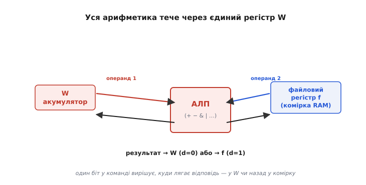
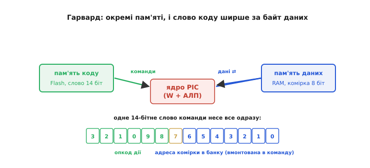
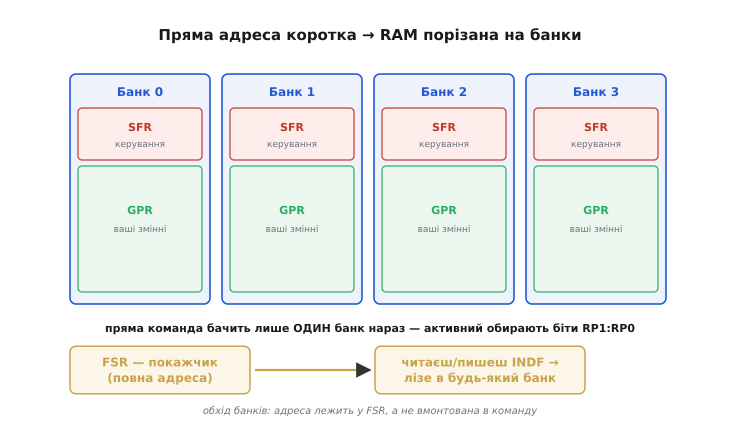
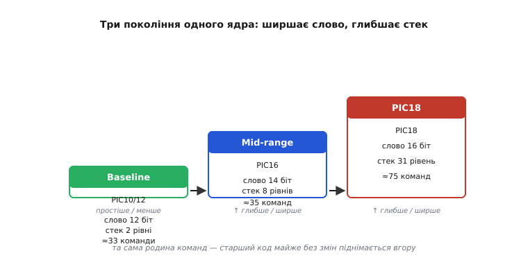

# Архітектура PIC

Досі ми говорили про будову процесора великими мазками — [Гарвард проти фон Неймана](root:embedded/von-neumann-harvard), [RISC проти CISC](root:embedded/risc-cisc). Це були філософії, осі вибору. Тепер корисно взяти **одну конкретну архітектуру** й подивитися, що буває, коли ці принципи доводять до краю — до **граничної простоти**. PIC — саме такий випадок: маленьке 8-бітне ядро, що десятиліттями стояло (і досі стоїть) у безлічі побутових та промислових пристроїв, від зарядок і пультів до автомобільних дрібниць. Його будова така економна, аж місцями впирається в незручність, — і саме тому вона **прозора**: на ній видно, як кожне рішення тягне за собою наслідок, який ви відчуваєте, коли пишете код. Розберімо це ядро як живий приклад того, про що ми говорили теоретично.

PIC цікавий ще й тим, що це чудовий **контраст до ESP32**, на якому будується решта курсу. ESP32 — потужний, багатий, з купою пам'яті й периферії; PIC — навпаки, аскетичний до кістки. Побачивши обидва полюси, ви краще відчуєте, **що** в архітектурі справді важить, а що — розкіш.

### Звідки воно взялося: контролер на побігеньках

Щоб зрозуміти дивацтва PIC, треба знати, **навіщо** він узагалі з'явився — а народився він не як самостійний мозок, а як **помічник**. На середину 1970-х компанія General Instrument мала 16-бітний процесор CP1600, і в нього була слабка пляма: він кепсько порався з простими операціями введення-виведення — смикати ніжки, читати кнопки, чекати на сигнали. Ганяти на це повноцінний процесор — марнотратство. Тож інженери зробили крихітну окрему мікросхему, яка **знімала з великого процесора всю цю дрібну метушню з ніжками**. Звідси й назва — **PIC**: за документами General Instrument того часу, спершу *Peripheral Interface Controller* (англ. «контролер периферійного інтерфейсу»), а вже з 1977-го її стали розкривати як *Programmable Intelligent Computer* («програмовний інтелектуальний комп'ютер»). Зустрічається й третє трактування — *Programmable Interface Controller*; самé поєднання різних розшифровок добре показує, що це **маркетингова назва, а не строгий термін**, і сьогодні Microchip уже не розкриває PIC як абревіатуру взагалі.

Уся подальша дивна простота ядра випливає з цього первородного гріха: воно проєктувалося як **дешевий, швидкий, тупенький виконавець однієї нескладної роботи**, а не як універсальний обчислювач. Кожне зрізане ребро економило копійки на кристалі — а коли таких чипів продаються мільйони, копійки стають грішми. Потім, коли в 1985-му General Instrument виокремила свій напівпровідниковий підрозділ в окрему компанію Microchip Technology, виявилося, що цей скромний контролер устиг обрости величезним колом користувачів — і він став одним з головних продуктів нової фірми. Так «помічник на побігеньках» пережив свого господаря CP1600 і розрісся в цілу родину.

> 📜 **Дотична історія:** [Як народився PIC — від придатка до CP1600 до власного імені](root:embedded/pic-architecture/hist-pic-genesis.md). Народження PIC у General Instrument як розвантажувача введення-виведення для 16-бітного CP1600, плутанина з розшифровкою абревіатури, відокремлення Microchip у 1985-му й те, як скромний помічник пережив свого господаря. Окремо — зі звіркою дат і статусом доказовості суперечливих тверджень.

> 🔧 **Навіщо це.** Розуміння походження вмикає правильні очікування. Коли ви берете в руки PIC і дивуєтеся «чому тут усе так незручно влаштовано?» — відповідь майже завжди «бо це проєктували заради дешевизни кристала, а не зручності програміста». Це не недогляд, а свідомий компроміс. Той самий хід думки знадобиться вам при [виборі мікроконтролера](root:embedded/mcu-selection): архітектура — завжди чийсь компроміс, і треба бачити, на чию користь його зроблено.

### Серце: машина з єдиним акумулятором

Найперша й найхарактерніша риса PIC — у нього майже немає регістрів. Точніше, **робочий регістр лише один**, і зветься він **W** (від *working register*, англ. «робочий регістр»). Це **акумулятор** (лат. *accumulare* — «накопичувати») — те єдине місце, де нагромаджується проміжний результат обчислень. Згадайте, як у [RISC-машинах load/store](root:embedded/risc-cisc) обчислення йдуть між **багатьма** регістрами: завантажив у R2, склав з R1, поклав у R5. PIC доводить ідею до межі в інший бік — регістр для рахунку **один**, і майже кожна арифметична команда неявно бере його за операнд.


*Одно-операндна машина. Арифметико-логічний пристрій (АЛП) має два входи: один **завжди** регістр W, другий — якась комірка пам'яті (файловий регістр). Результат не «вільний» — один біт у самій команді (його звуть `d`, від *destination*) вирішує лише дві долі: лягти назад у W (`d=0`) чи в ту саму комірку (`d=1`). Жодного «склади R3 і R4 у R7» — усе крутиться навколо єдиного W.*

Це і є **одно-операндна (акумуляторна) машина**: ти не вказуєш обидва джерела й окремо приймач, як на ESP32. Ти кажеш лише **одну** адресу комірки — а другий операнд (W) і так мається на увазі. Через те найбуденніша річ — перекласти значення з однієї комірки пам'яті в іншу — на PIC робиться **у два кроки**: спершу затягни число у W, потім вистав W у комірку-приймач. Прямого «скопіюй з комірки в комірку» немає, бо немає двох незалежних адрес в одній команді.

```asm
movf   COUNT, W     ; W ← вміст комірки COUNT  (ف=W: результат у W)
movwf  TOTAL        ; TOTAL ← W                (W→f: вистав W у комірку)
```

Чому інженери на це пішли? Бо акумулятор **дешевий**. Регістр коштує транзисторів, і кожен зайвий регістр треба вміти адресувати в кожній команді — а це ширші команди й складніший дешифратор. Один-єдиний W означає, що в команді **не треба** поля «який регістр-джерело», бо він завжди той самий. Команда стискається, дешифратор спрощується, кристал дешевшає. Ціна — більше команд на ту саму роботу й те саме «вузьке горло» у вигляді W, крізь яке мусить протиснутися кожне число. Класичний компроміс простоти, той самий, що ми вже бачили: **просте залізо — довший код**.

> 🔧 **Навіщо це.** Навіть якщо ви пишете на C і не торкаєтесь асемблера, ця однорегістровість прозирає крізь усе. Компілятор для PIC раз у раз ганяє значення через W туди-сюди, бо іншого шляху немає; через те складні вирази на 8-бітному PIC компілюються в довжелезні низки команд, і обчислення, яке на ESP32 — один такт, тут може коштувати десятків. Коли бачите, що проста на вигляд формула «з'їла» багато пам'яті програм або часу, причина часто саме тут.

### Гарвард із словами різної ширини

Друга визначальна риса — PIC побудований за **Гарвардською архітектурою**, причому в чистому, підручниковому вигляді. [Ми вже розбирали](root:embedded/von-neumann-harvard), що Гарвард тримає пам'ять коду й пам'ять даних окремо, з окремими шинами; PIC дотримується цього строго. Але є деталь, яку саме тут видно особливо опукло: **слово коду й слово даних мають різну ширину**, і ця різниця не випадкова, а працює на користь.


*Окремі пам'яті — окремі ширини. Дані PIC обробляє **8-бітні** (це 8-бітний контролер). А слово команди ширше: у поширеному «середньому» поколінні (PIC16) воно **14 біт**. Зайві біти не марнуються — у те саме слово команди вмонтовують і **код дії** (опкод), і **адресу комірки**, з якою працювати. Бо пам'яті окремі — їх можна кроїти незалежно, під свою задачу кожну.*

Ось тут і прозирає, **навіщо** Гарвард, а не просто «бо швидше». Якби код і дані ділили одну пам'ять однакової ширини (як у фон Неймана), слово мусило б бути компромісом між двома різними потребами. А роздільність дозволяє зробити слово команди рівно таким широким, щоб у нього **влізла і команда, і її аргумент одним шматком**: процесор за один доступ до пам'яті коду витягує і «що робити», і «над чим». Через те майже всі команди PIC виконуються **за один такт** — нема потреби бігати по аргумент окремо. (Винятки — переходи й виклики, що збивають хід вибірки команд: на них іде два такти. Це той самий ефект [конвеєра](book:programming/pipeline), про який ми згадували.)

Різні покоління PIC мають різну ширину слова коду, і це прямий показник «потужності» ядра: **12 біт** — у найпростіших (baseline), **14 біт** — у середніх (mid-range, найвідоміше сімейство PIC16), **16 біт** — у старших PIC18. Чим ширше слово, тим більше можна вкласти в одну команду: довшу адресу, більший безпосередній операнд, багатшу систему команд.

### Пам'ять даних: банки й тіснява адреси

А тепер — найвідоміша незручність PIC, і вона напряму випливає з попереднього. Якщо адреса комірки **вмонтована в слово команди**, то на неї лишається обмаль бітів — решту з'їли опкод і службові поля. У PIC16 на адресу комірки в команді відведено лише **7 біт**. Сім біт — це 2⁷ = 128 різних адрес. Але пам'яті даних у багатьох PIC більше, ніж 128 комірок. Як втиснути більшу пам'ять в адресу, що бачить тільки 128 клітинок?

Відповідь — **банкування (banking)**. Пам'ять даних ріжуть на шматки-**банки** по 128 комірок, і в кожен момент часу команда «бачить» лише **один** банк — активний. Який саме банк активний, задають кілька окремих керівних бітів (у PIC16 вони звуться RP1:RP0). Хочеш дотягтися до комірки в іншому банку — спершу **перемкни банк** цими бітами, аж тоді звертайся. Адреса в команді коротка, зате повна адреса збирається з двох частин: «який банк» (керівні біти) плюс «яка комірка в банку» (7 біт команди).


*Банкована пам'ять даних. Уся RAM поділена на банки; у кожному вгорі сидять **спеціальні регістри** (SFR — *special function registers*, керування периферією й ядром), нижче — **звичайна пам'ять** під ваші змінні (GPR — *general purpose registers*). Пряма команда дістає лише той банк, що активний просто зараз; щоб торкнутися іншого — спершу перемкни біти вибору банку. Окремий механізм — покажчик **FSR** і регістр **INDF** — дозволяє обійти банки: кладеш повну адресу у FSR, а читаючи чи пишучи INDF, насправді працюєш із коміркою, на яку FSR указує.*

Ось де банкування **боляче кусається**: якщо забути перемкнути банк, команда тихо звернеться **не до тієї комірки** — до клітинки з тією самою молодшою адресою, але в активному зараз банку. Помилки не буде, попередження не буде — просто запис піде не туди. Це одна з найклясичніших пасток PIC, на якій спіткнувся кожен, хто колись писав під нього в асемблері.

На щастя, є й **обхід тісняви** — механізм **непрямої адресації** через пару регістрів **FSR** (*file select register*, англ. «регістр вибору комірки» — покажчик) та **INDF** (*indirect file*, «непряма комірка»). Кладеш у FSR **повну** адресу потрібної комірки, а далі читаєш або пишеш «магічний» регістр INDF — і потрапляєш насправді туди, куди вказує FSR. Це і є покажчик у термінах PIC: INDF — не справжня клітинка пам'яті, а **вікно**, крізь яке видно ту комірку, чию адресу ти поклав у FSR. Саме через FSR/INDF на PIC роблять масиви й цикли по пам'яті — без непрямої адресації обходити масив на однорегістровій банкованій машині було б майже неможливо.

> 🔧 **Навіщо це.** На C усю цю метушню з банками за вас робить компілятор: він сам вставляє перемикання банку перед доступом до змінної (макрос `BANKSEL`) і сам користується FSR/INDF для покажчиків. Але ціна нікуди не дівається — кожне таке перемикання це зайва команда й зайвий такт. Тому досвідчені розробники під PIC намагаються тримати змінні, з якими працюють разом, **в одному банку**, щоб компілятор рідше перемикався. Знаючи механізм, ви розумієте, чому розкладка змінних у пам'яті раптом впливає на швидкість, — на ESP32 така думка нікому й на гадку не спаде.

### Дрібний апаратний стек

Ще одна риса, що видає аскетичне походження PIC, — **стек викликів вбудований у залізо й він крихітний**. Коли програма викликає підпрограму, кудись треба сховати адресу повернення — щоб після підпрограми знати, куди вертатися. На «дорослих» процесорах стек живе в загальній пам'яті й обмежений лише її обсягом. У PIC стек — **окремий апаратний блок** фіксованої, дуже малої глибини: у найпростіших — лише **2 рівні** (тобто можна вкласти виклик у виклик заледве на дві сходинки), у середньому PIC16 — **8 рівнів**, у старшому PIC18 — **31**.

Це знов-таки прямий наслідок Гарварду й економії: стек у власному, окремому шматку заліза швидкий і не з'їдає й без того мізерну пам'ять даних — але його глибину прибили цвяхами на етапі проєктування. На baseline-PIC із його двома рівнями глибока вкладеність викликів просто **неможлива**: третій вкладений виклик мовчки затирає найстарішу адресу повернення, і програма повертається не туди. Тому на маленьких PIC код пишуть «пласким», без глибоких ланцюжків функцій, що викликають одна одну, — і рекурсію (функцію, що кличе саму себе) тут практично не застосовують.

> 🔧 **Навіщо це.** Це жорстке обмеження, яке треба тримати в голові з самого початку проєкту. Якщо ви звикли до вільного стеку на ESP32 і необачно перенесете на дрібний PIC код з глибокими вкладеними викликами чи рекурсією, програма зламається **тихо** — без аварії, просто поведеться дивно. На малих PIC структуру коду доводиться підлаштовувати під глибину стека, а не навпаки.

### Родина: одне ядро, що росте сходинками

Усе сказане — не про один чип, а про цілу **родину**, що виростала десятиліттями навколо тієї самої ідеї. І найкорисніше тут — побачити її як **сходи**: те саме акумуляторне Гарвардське ядро в кожному поколінні стає трохи багатшим, але **не змінює своєї суті**.


*Сходи однієї архітектури. **Baseline** (PIC10/PIC12) — найпростіший: слово 12 біт, стек на 2 рівні, близько трьох десятків команд; копійчані чипи на кілька ніжок. **Mid-range** (PIC16) — золота середина й найвідоміше покоління: слово 14 біт, стек 8, близько 35 команд. **PIC18** — старший: слово 16 біт, стек 31, набагато більше команд і набагато зручніша непряма адресація. Угору сходами слово ширшає, стек глибшає, незручностей меншає, — але акумуляторна Гарвардська природа лишається тією самою, і старший код піднімається на нову сходинку майже без переробки.*

Те, що **35 команд** середнього PIC — це жменька, добре лягає на [філософію RISC](root:embedded/risc-cisc), яку ми вже розбирали: мало простих команд, кожна — крихітний крок, майже всі за один такт. PIC — підручниковий RISC за духом: система команд аскетична, виконання однотактне, формат слова однаковий. Але — і це важлива чесна засторога — PIC **не** є чистим RISC у вузькому академічному сенсі. Класичний RISC стоїть на **багатьох рівноправних регістрах** і архітектурі load/store, а PIC, як ми бачили, має **єдиний** акумулятор W і дозволяє командам прямо чіпати пам'ять (комірку-операнд). Тож точніше сказати так: PIC бере від RISC **простоту й однотактність**, але будує її навколо старішої **акумуляторної** ідеї, а не навколо регістрового файлу. Це гібрид, а не зразок з підручника, — і знати цю межу корисно, щоб не плутати «мало команд» з «це класичний RISC».

Окрема причина слави цієї родини — **Flash-пам'ять програм**. Ранні мікроконтролери зберігали програму в пам'яті, яку або не можна було перезаписати взагалі, або доводилося стирати ультрафіолетом. Коли Microchip випустила PIC із **Flash** (як-от знаменитий PIC16F84, де літера `F` у назві саме про Flash), прошивку стало можна перешивати прямо в схемі, скільки завгодно разів, простеньким програматором. Для аматорів і малих виробників це був злам: дешевий чип, який легко перепрошити вдома. Саме завдяки цьому PIC надовго став одним із найпопулярніших мікроконтролерів для навчання й саморобок — поряд з 8051 і пізнішим AVR.

### Що з усього цього винести

Складімо нитку докупи. PIC — це **гранично економне 8-бітне ядро**, і кожна його дивина випливає з одного кореня: його робили **дешевим виконавцем**, а не універсальним мозком. Звідси **єдиний акумулятор W**, крізь який тече вся арифметика; звідси **строгий Гарвард** із ширшим словом коду, куди вмонтовано й команду, і адресу; звідси **банкування** пам'яті даних, бо на адресу в команді лишилося мало бітів, і обхід через **FSR/INDF**; звідси **крихітний апаратний стек**, що забороняє глибоку вкладеність. Усе це — ланки одного причинно-наслідкового ланцюга, що починається зі слова «дешево».

Чому варто було це розбирати, якщо ви, найімовірніше, працюватимете на ESP32, а не на PIC? Бо PIC — **чистий, оголений приклад** усіх архітектурних осей, які ми вивчали абстрактно. На ньому видно, до чого доходить Гарвард у крайній формі, що таке справжня RISC-аскеза (і де вона переходить у щось старіше), і яку ціну має гранична простота заліза — ту ціну, що завжди перекладається на код. Тримаючи в голові цей аскетичний полюс, ви куди тверезіше оцінюватимете будь-який інший мікроконтролер: побачите, що вам дають «безкоштовно» (багато регістрів, плаский доступ до пам'яті, глибокий стек) і що з цього колись доводилося виборювати руками. А вміння бачити архітектуру як **ланцюг компромісів**, а не набір випадкових особливостей, — це і є те, заради чого ми взяли PIC за приклад.

> ⚙️ **Практичний розбір:** [Банки на практиці — чому розкладка змінних впливає на швидкість PIC](root:embedded/pic-architecture/proj-bank-switching.md). Як банкування виглядає у справжньому коді: що насправді робить `BANKSEL`, чому компілятор вставляє зайві перемикання, як угрупування змінних в один банк прискорює доступ, і як FSR/INDF дають масиви й цикли на однорегістровій машині — з робочим C та згенерованим асемблером.
