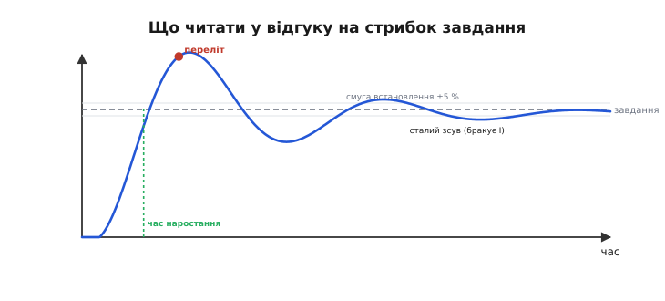
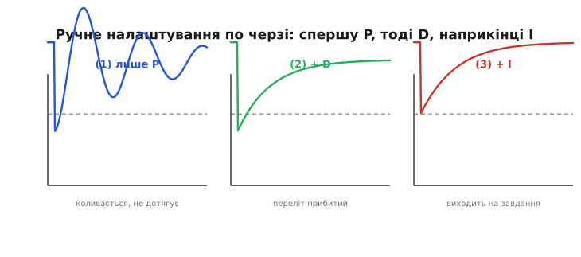
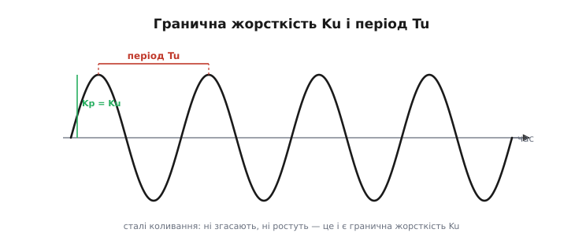
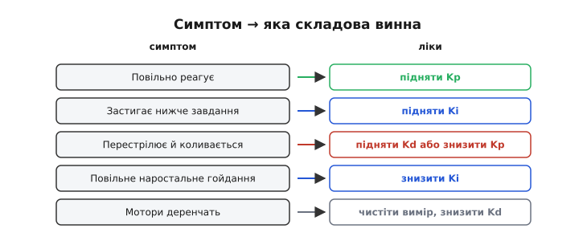
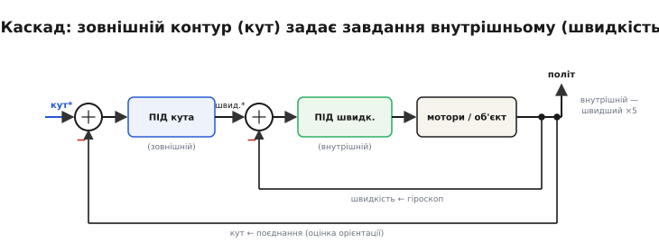
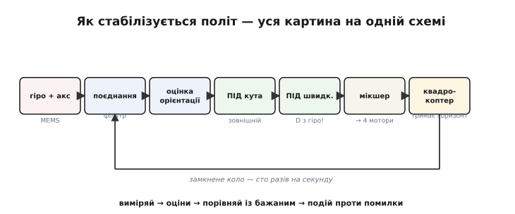

# Налаштування ПІД

Знати формули трьох складових ПІД-регулятора — [пропорційної](root:embedded/proportional-control), [інтегральної](root:embedded/integral-control) і [похідної](root:embedded/derivative-control) — це ще не вміти підняти апарат у повітря. Лишається друга, цілком практична половина справи: **дібрати** три коефіцієнти Kp, Ki, Kd під конкретний механізм — його мотори, масу, давачі — і **скласти** кілька регуляторів у каскад так, як це роблять справжні польотні контролери. Саме тут теорія зустрічається з залізом.

Показовий факт: досвідчений інженер часто налаштовує ПІД майже без розрахунків, на самих спостереженнях за поведінкою апарата. Можна досконало володіти математикою П, І та Д — і все одно не підняти дрон, якщо не вмієш добрати три числа під **його** оберти й інерцію. Тож налаштування — менше про математику, більше про **ремесло**: як перетворити робочий код регулятора на апарат, що впевнено тримається в повітрі. А зрозумівши ремесло, ми дійдемо й до того, як квадрокоптер стабілізує сам себе.

### Читати відгук: що каже крива

Усе налаштування починається з уміння **читати** відгук системи на стрибок завдання. У формі цієї кривої зашифровано, який саме коефіцієнт крутити.


*Що читати у відгуку на стрибок завдання. Час наростання — як швидко вихід дістався цілі (замалий Kp — повільно). Переліт — наскільки проскочив (завеликий Kp чи замалий Kd). Час встановлення — коли заспокоївся в межах ±5 %. Сталий зсув — застиг нижче завдання (бракує I). Кожна риса кривої вказує на свою складову.*

Чотири головні риси кривої кожна пов'язана зі своїм коефіцієнтом. **Час наростання** — це швидкодія, за неї відповідає Kp. **Переліт** (вихід проскочив повз ціль) виказує надмірну різкість: Kp завеликий або Kd замалий. **Час встановлення** — як довго апарат гойдається, доки заспокоїться, — залежить від демпфування, тобто від Kd. А **сталий зсув** (вихід застиг трохи нижче завдання й далі не йде) означає, що бракує Ki. Навчившись зчитувати симптом і називати винний коефіцієнт, ви перетворюєте налаштування з ворожіння на діагностику.

Щоб ці риси проявилися, систему треба **спровокувати**: дати стрибок завдання (раптом задати новий кут) або поштовх (легенько штовхнути апарат) і дивитися, як він повертається. У відповіді на таке збурення характер регулятора видно як на долоні: млявий повзе назад поволі, надто різкий стрибає туди-сюди, добре налаштований швидко й чисто стає на місце. Тому серйозне налаштування завжди супроводжують **логуванням** — записують криву відгуку, щоб **бачити** справжню поведінку апарата, а не здогадуватися навпомацки.

### Налаштування вручну

Найнадійніший ручний метод — уводити складові **по черзі**, у правильному порядку: спершу пропорційну, тоді похідну, наприкінці інтегральну.


*Ручне налаштування крок за кроком. (1) Лише P: піднімайте Kp, доки система не почне ледь коливатися, тоді відступіть приблизно вдвічі. (2) Додайте D: він гасить переліт — і дозволяє підняти Kp ще, заради швидкості. (3) Додайте I: він прибирає сталий зсув. Один коефіцієнт за раз — і дія кожного видно окремо.*

Порядок не випадковий. P дає основну силу, що штовхає вихід до цілі. D цю силу приборкує — гасить переліт і тим дає запас підняти Kp ще вище. А I наприкінці прибирає те, чого не подужає жоден із двох інших, — сталий зсув. Робити це навпаки чи все одразу — певний шлях до хаосу, де незрозуміло, що на що впливає.

Кілька правил із практики. Міняйте коефіцієнт **відчутними** кроками — скажімо, у півтора раза вгору чи вниз, а не на крихту, — інакше різниці просто не побачите. Після кожної зміни давайте те саме збурення, щоб порівнювати однакове. І будьте **терплячі**: добре налаштування — це кілька десятків таких циклів, а не одне геніальне вгадування.

> 🔧 **Навіщо це.** Перші проби робіть **обережно**. Дрон — зі знятими пропелерами або міцно закріплений; промисловий привід — на холостому ходу. Завищений Kp чи Kd легко кидає апарат у різке гойдання, тож першу перевірку — «чи в той бік діє регулятор і чи не розгойдується» — варто робити там, де помилка нічого не зламає й нікого не травмує. Лише переконавшись, що контур поводиться розумно, переходьте до справжнього руху.

### Метод Зіглера–Ніколса

Є й напівформальний рецепт — класичний метод **Зіглера–Ніколса**, що дає коефіцієнти за двома легко вимірюваними числами. Спершу, лишивши тільки P, піднімають Kp до **граничної жорсткості** Ku — такого підсилення, за якого система входить у стійкі, незгасні коливання; заразом міряють їхній **період** Tu.


*Метод Зіглера–Ніколса. Піднімаємо Kp до граничного Ku, за якого коливання стають сталими — ні згасають, ні ростуть, — і міряємо їхній період Tu. За цими двома числами коефіцієнти ПІД беруть з готових формул. Це швидка відправна точка, щоправда агресивна: метод розрахований на загасання з відношенням сусідніх амплітуд приблизно ¼, тож переліт виходить чималий, і його потім підкручують вручну.*

За Ku й Tu коефіцієнти рахують за табличними формулами:

```
 Класичний ПІД за Зіглером–Ніколсом:
   Kp = 0.6 · Ku
   Ki = 1.2 · Ku / Tu          (інтегральний час Ti = 0.5·Tu)
   Kd = 0.075 · Ku · Tu        (диференційний час Td = 0.125·Tu)
```

Числа 0.6, 0.5 і 0.125 не випадкові: кожне випливає з того, що́ саме міряють Ku і Tu, скільки запасу лишити від межі стійкості й до якого загасання метод цілить. Повний вивід, чому коефіцієнти саме такі, — у вставці [звідки беруться ці формули](root:embedded/pid-tuning-cascade/math-ziegler-nichols.md).

**Приклад.** Піднімаючи підсилення, знайшли межу: Ku = 8, а період коливань на ній Tu = 0.5 с. Тоді

```
 Kp = 0.6 · 8          = 4.8
 Ki = 1.2 · 8 / 0.5    = 19.2
 Kd = 0.075 · 8 · 0.5  = 0.3
```

Це й буде відправний набір. Він свідомо різкий (на чвертьамплітудне загасання, з помітним перельотом), тож далі Kp трохи зменшують і донастроюють вручну за кривою відгуку. Перенесене у прошивку, це звичайне присвоєння:

```c
// відправні коефіцієнти за Зіглером–Ніколсом (Ku=8, Tu=0.5 c)
float Kp = 4.8f;
float Ki = 19.2f;
float Kd = 0.30f;
// далі: Kp *= 0.8f і донастроювання за логом перехідної кривої
```

> 🔧 **Навіщо це.** Метод вимагає **довести систему до коливань** — а для багатьох апаратів це небезпечно чи руйнівно: реальний літак чи важкий промисловий привід не ганяють на самій межі стійкості, ризикуючи аварією. Тому Зіглера–Ніколса застосовують обачно — на безпечному стенді чи на моделі, а не «наживо», — і беруть лише як швидкий старт, а не як остаточну істину.

Сам метод народився 1942 року в Taylor Instrument Company: інженер Джон Зіглер виробив емпіричний рецепт і апаратуру, а математик Натаніель Ніколс підвів під нього розрахунок; їхня стаття звалася «Optimum Settings for Automatic Controllers» (англ. *optimum* — «найкращий», від лат. *optimus*). Це був перший широко вживаний простий, повторюваний спосіб налаштування там, де доти панувало саме лиш відчуття.

### Симптом і ліки

Найчастіше ж на практиці налаштовують **за поведінкою**: дивляться на симптом і крутять відповідний коефіцієнт. Ось коротка шпаргалка, що зводить діагностику докупи.


*Симптом і ліки. Повільно реагує — підняти Kp. Застигає нижче завдання — підняти Ki. Перестрілює й коливається — підняти Kd або знизити Kp. Повільне наростальне гойдання — знизити Ki. Мотори деренчать — почистити вимір, знизити Kd або профільтрувати D.*

Одне застереження до шпаргалки: складові **не цілком незалежні**. Піднявши Kp, ви часто посилюєте й переліт — і тоді треба підняти Kd; а сильніший Kd, своєю чергою, може зажадати чистішого виміру швидкості. Тому реальне налаштування — не разовий прохід згори вниз по таблиці, а кілька **ітерацій**: підкрутили одне, перевірили, чи не зіпсувалося інше, підкрутили знову. Добрий кінцевий набір коефіцієнтів завжди є компромісом, у якому всі три числа узгоджені між собою.

> 🔧 **Навіщо це.** Налаштовуйте **спостерігаючи**, а не теоретизуючи. Дайте системі стрибок завдання чи поштовх і дивіться на відгук: повільно — додайте Kp; недотягує — додайте Ki; перестрілює й дзвенить — додайте Kd (або зменшіть Kp); деренчить — чистіть вимір і фільтруйте D. Міняйте **один** коефіцієнт за раз і дивіться, що сталося. Кілька таких циклів дають кращий результат, ніж години розрахунків, бо реальний апарат завжди трохи інший, ніж будь-яка модель.

Існують і **автоналаштувальники** (англ. *auto-tune*): прошивка сама дає апарату пробні збурення, міряє відгук і вираховує коефіцієнти. Для багатьох систем це чудовий старт. Та навіть із автоналаштуванням розуміти, **що** означає кожен коефіцієнт, конче треба: автоматика дає лише відправну точку, а доводити апарат до ідеалу й розгадувати його примхи однаково випадає людині. Тому ПІД і варто розбирати з перших принципів, а не як чорну скриньку з трьома повзунками.

### Каскадні контури

Складні системи керування рідко вішають на один ПІД. Натомість контури **вкладають** один в одного — це **каскадне** керування (від італ. *cascata* — «водоспад»: керування спадає згори вниз, з рівня на рівень). Зовнішній, повільніший контур не керує мотором прямо, а **задає завдання** внутрішньому, швидшому.


*Каскадні контури на прикладі польоту. Зовнішній контур (кута) порівнює бажаний нахил із виміряним і видає не вплив на мотори, а бажану кутову швидкість. Її підхоплює внутрішній контур (швидкості), що вже й керує моторами. Внутрішній мусить бути значно швидшим за зовнішній — тоді для зовнішнього він виглядає майже миттєвим і слухняним.*

Навіщо така будова? Бо вона дає величезні переваги. Внутрішній швидкий контур **миттєво гасить** збурення — порив вітру, поштовх — і ховає примхи самого механізму, тож зовнішній контур «бачить» уже **простий, слухняний** об'єкт, який легко налаштувати. Кожен контур окремо стає простішим, ніж один спільний ПІД на все одразу.

Є й наслідок для надійності. Якщо зовнішній контур (скажімо, утримання положення за GPS) дасть збій чи відмовить його давач, внутрішній контур швидкості й далі тримає апарат керованим — він просто перестане отримувати нові завдання, але не впаде. Каскад природно розшаровує систему на рівні відповідальності, де нижній, найшвидший рівень — найпростіший і найнадійніший. Саме тому критичні системи будують так: серце тримається на простому й швидкому, а складне й повільне лише надбудовується згори й може будь-коли відпасти без катастрофи. Звідси й залізне правило каскаду: внутрішній контур має бути помітно (умовно разів у п'ять) **швидшим** за зовнішній, інакше вони почнуть заважати один одному.

Так само влаштовані польотні режими дрона. У **режимі швидкості** (acro, для трюків) працює лише внутрішній контур: ручка задає бажану кутову швидкість, апарат слухняно її тримає, але самого горизонту «не знає». У **режимі кута** (self-level, для новачків) згори вмикається зовнішній контур: ручка задає **кут**, а той уже обчислює потрібну швидкість для внутрішнього. Цей самий лад «зсередини назовні» діє й у налаштуванні: до пуття доводять внутрішній контур швидкості, і лише на готовому, слухняному внутрішньому надбудовують зовнішній контур кута.

> 🔧 **Навіщо це.** Якщо одним ПІД ніяк не виходить і швидко, і стійко — подумайте про **каскад**. Розбийте задачу на швидкий внутрішній контур (керує безпосередньою величиною — швидкістю, струмом) і повільний зовнішній (керує тим, що вас справді цікавить, — кутом, положенням). Налаштовуйте їх зсередини назовні: спершу внутрішній, тоді — поверх готового внутрішнього — зовнішній. Так роблять і польотні контролери, і промислові приводи: один контур рідко тягне все.

### Як це сходиться: стабілізація польоту

Тепер усі частини стають на свої місця — і видно, як тримається в повітрі квадрокоптер. Тут сходяться обидві половини задачі: «знати орієнтацію» і «тримати» її.


*Як стабілізується політ — уся картина на одній схемі. Гіроскоп і акселерометр ([MEMS](root:hw-sensing/mems)) → поєднання ([комплементарний фільтр](root:com-signal/complementary-filter) чи [Калман](root:com-signal/kalman-filter)) дає надійну орієнтацію → зовнішній ПІД кута видає бажані кутові швидкості → внутрішній ПІД швидкості (вимір швидкості — прямо з гіроскопа) рахує поправки → мікшер розподіляє їх на чотири мотори → апарат тримає горизонт. Замкнене коло — сто разів на секунду.*

Прослідкуймо це коло. Гіроскоп і акселерометр — крихітні [MEMS](root:hw-sensing/mems) — дають сирий рух. **Поєднання** даних ([комплементарний фільтр](root:com-signal/complementary-filter) чи [фільтр Калмана](root:com-signal/kalman-filter)) зводить їх у надійну оцінку орієнтації — кватерніон чи кути. Зовнішній **ПІД кута** порівнює бажаний нахил із цією оцінкою й видає **бажані кутові швидкості**. Внутрішній **ПІД швидкості** порівнює їх із показом гіроскопа (та сама ідея [«швидкість без диференціювання»](root:embedded/derivative-control)) і рахує поправки. **Мікшер** перетворює поправки по крену, тангажу й рисканню на команди чотирьом моторам. Апарат повертається, давачі це бачать — і коло замикається. Усі складові працюють тут **разом**, сто разів на секунду.

Один елемент варто пояснити окремо — **мікшер** (англ. *mixer*, «змішувач», від лат. *miscere* — «змішувати»), його ще звуть мотор-мікс. Поправки виходять окремо по крену, тангажу й рисканню, а керувати треба чотирма моторами — тож мікшер їх **комбінує**: щоб нахилити по крену, він додає тяги моторам одного боку й знімає з протилежного; по тангажу — переду чи заду; по рисканню — грає на різниці обертів діагоналей (бо сусідні пропелери крутяться в різні боки). Кожен мотор дістає суму всіх трьох поправок плюс загальну тягу газу. Проста арифметика — а саме вона й перетворює абстрактні поправки ПІД на конкретні оберти, що тримають апарат у повітрі.

Це і є відповідь на питання, **як апарат тримає сам себе**. Не магія, а зворотний зв'язок — той самий, що крутив відцентровий регулятор Ватта й вів «Аполлон» до Місяця, тільки тепер у вигляді кількох ПІД у каскаді на копійчаному чипі.

І це не навчальне спрощення, а буквально те, що роблять справжні польотні прошивки — ArduPilot, PX4, Betaflight. Усередині кожної — той самий ланцюг: поєднання орієнтації (часто розширений фільтр Калмана), каскад ПІД «кут → швидкість», мотор-мікс і захисти. Відкривши їхні налаштування, ви впізнаєте кожен повзунок: P, I, D для крену, тангажа й рискання, фільтри, межі. Це для вас уже не магічні числа, а складові, зміст яких ви розумієте з перших принципів — і знаєте, що крутити й чому.

> 🔧 **Навіщо це.** Побачивши, як дрон завмер у повітрі попри вітер, ви знатимете **всю** машинерію за цим: MEMS-давачі, поєднання даних, оцінку орієнтації, каскад ПІД, мікшер моторів — і чому кожна ланка саме така. Це знання не лише про дрони: той самий ланцюг «виміряй → оціни → порівняй із бажаним → подій проти помилки» лежить в основі будь-якої системи, що тримає себе сама, від 3D-принтера до супутника. Опанувавши його раз, ви впізнаєте й збудуєте його будь-де.

Гляньте, скільки всього зійшлося, щоб дрон просто завис рівно: фізика MEMS-вантажика на пружинках, математика кватерніонів, статистика фільтра Калмана, частотний погляд на шум, дискретна арифметика мікроконтролера й теорія зворотного зв'язку, вирощувана від Ватта до Мінорського. Жодна з цих частин **окремо** не втримала б апарат; тримає його саме їхня **спільна** робота. У цьому й краса інженерії систем: ціле вміє те, чого не вміє жодна з частин — і тепер ви бачите це ціле.
