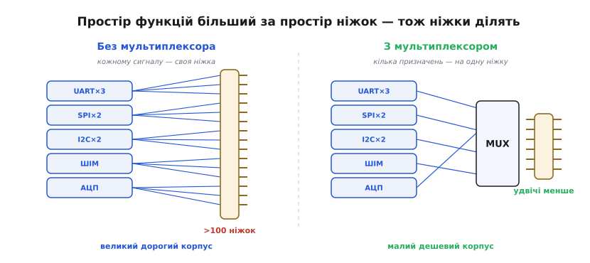
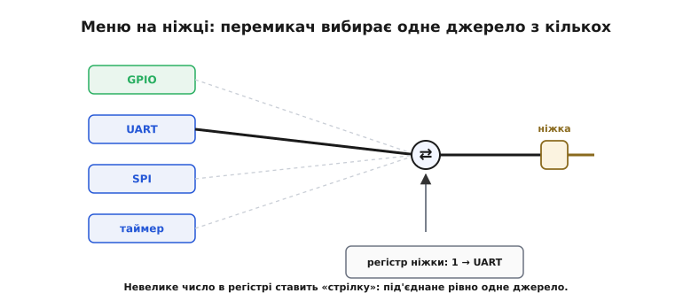
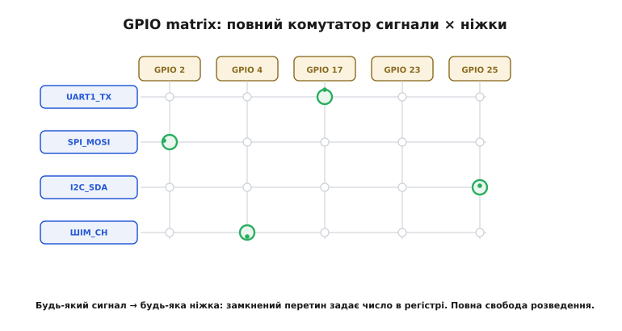
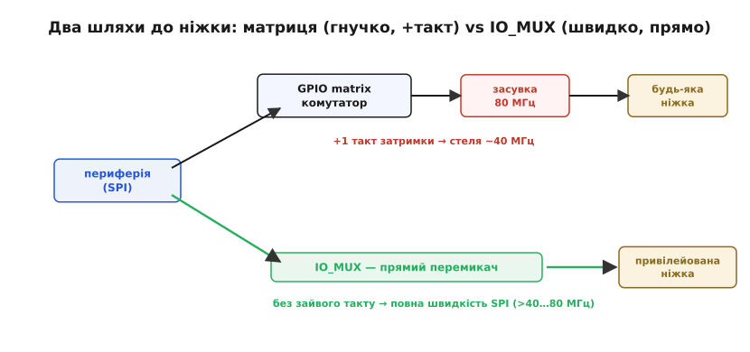

# Мультиплексування пінів (IO_MUX / GPIO matrix)

Розкрийте даташит будь-якого сучасного мікроконтролера на сторінці з розпіновкою — і поряд з кожною ніжкою побачите не одну назву, а цілий стовпчик: `PA9 / USART1_TX / TIM1_CH2 / I2C2_SDA`. Один фізичний контакт, а призначень — чотири. Це не помилка верстки й не примха: це найпряміший наслідок арифметики, з якою стикається кожен, хто проєктує чип. Усередині мікроконтролера живуть десятки готових периферійних блоків — кілька UART, кілька SPI, шина I2C, лічильники-таймери, АЦП, ШІМ-генератори. Кожному з них треба вивести свої сигнали назовні, на ніжки корпусу. А ніжок мало.

Звідси й уся тема цього кроку: як примирити **багато периферії** з **малим числом ніжок**. Відповідь — поставити між внутрішніми блоками й зовнішніми контактами **перемикач**, що в кожен момент з'єднує ніжку лише з одним сигналом. Цей перемикач і зветься мультиплексором пінів (від латинського *multiplex* — «багатоскладовий, багаторазовий»). Розберемо, чому без нього не обійтися, як він влаштований у двох головних різновидах — простий **меню-вибір** і повноцінна **комутаційна матриця**, — і чому за гнучкість матриці доводиться платити швидкодією.

### Чому ніжок завжди бракує

Почнімо з причини, бо без неї решта виглядає довільною. Підрахуймо чесно.

Візьмемо скромний мікроконтролер. Усередині нього, скажімо: три UART, два SPI, дві шини I2C, чотири таймери по кілька каналів ШІМ, шістнадцятиканальний АЦП. Якщо вивести **кожен** сигнал **кожного** блоку на свою окрему ніжку, рахунок швидко перевалює за сотню — і це лише периферія, ще без живлення, землі, кварцу й виводів налагодження. А корпус на 144 ніжки — це вже немала, дорога мікросхема, яку важко розвести на платі й яка займає чимало місця.

Тут і ховається економічний важіль. Більший корпус — це дорожчий чип, складніша плата, більша площа. Часто **саме кількість ніжок** вирішує, у який корпус влізе кристал і скільки він коштуватиме; зменшити число виводів — буквально різниця між двома цінниками. Тож виробник іде на угоду, яку диктує реальне використання: **жоден проєкт не вмикає всю периферію водночас**. Хтось бере UART і I2C, хтось — SPI й кілька каналів ШІМ. Якщо в кожен момент працює лише частина блоків, навіщо тримати ніжку під кожен можливий сигнал? Досить дати кожній ніжці **вибір** — нехай вона вміє бути будь-якою з кількох речей, а яка саме — вирішить розробник прошивки під свою задачу.


*Без мультиплексування кожному сигналу — своя ніжка, і їх назбирується понад сотню: великий дорогий корпус. Мультиплексор зводить кілька можливих призначень на одну ніжку, тож той самий набір периферії влізає у вдвічі менший корпус. Платня — лише одне з призначень ніжки доступне водночас.*

Ось і суть угоди, без жодної магії: **простір функцій більший за простір ніжок**, тож ніжки доводиться ділити в часі — кожна обслуговує одне призначення за раз. Мультиплексор — це механізм, що робить цей поділ керованим: ви кажете ніжці, ким їй бути зараз, а решту її «облич» лишаєте на потім.

> 🔧 **Навіщо це.** Коли ви обираєте мікроконтролер під проєкт, головне питання не «скільки в нього ніжок», а «чи зведуться **мої** периферійні блоки на доступні ніжки без конфлікту». Дві потрібні вам шини можуть змагатися за ту саму ніжку — і тоді навіть чип із запасом виводів вам не підходить. Розуміння мультиплексування — це вміння читати таблицю призначень наперед, ще до того, як замовлено плату.

### Найпростіший мультиплексор: меню на ніжці

Як технічно дати ніжці кілька облич? Найпряміший спосіб — поставити прямо біля неї маленький перемикач, що під'єднує контакт до одного з кількох внутрішніх сигналів. Точнісінько як стрілка на залізниці: рейка одна, а напрямків кілька, і важіль вибирає, куди піде потяг.


*Перемикач біля ніжки — як залізнична стрілка: один контакт, кілька можливих джерел сигналу (GPIO, UART, SPI, таймер). Яке з них з'єднано зараз — задає невелике число, записане у керівний регістр ніжки. У кожен момент під'єднане рівно одне.*

Чим керувати таким перемикачем? Невеликим числом у спеціальному регістрі — комірці пам'яті, яку процесор бачить за відомою адресою. Запис у цю комірку слова `0` ставить стрілку в положення «звичайний GPIO», `1` — «UART», `7` — «таймер» тощо. Це не абстракція: так влаштовані піни на величезній родині мікроконтролерів STM32 (STMicroelectronics). У них кожна ніжка має чотирибітне поле вибору альтернативної функції (*alternate function*), а значить — до шістнадцяти можливих облич, від `AF0` до `AF15`. Поля складені в регістри `AFRL` (для ніжок 0…7) і `AFRH` (для ніжок 8…15), по чотири біти на ніжку. Записали в поле ніжки число — і апаратний перемикач під'єднав до неї відповідний периферійний блок.

Розгляньмо це на реальному коді. Нехай треба зробити з ніжки `PA9` вихід передавача першого UART. На STM32 (прямий стиль роботи з регістрами) це виглядає так:

**Умова:** під'єднати передавач USART1 (`USART1_TX`, альтернативна функція AF7) до ніжки PA9.

```c
// 1. Перевести PA9 у режим «альтернативна функція» (не звичайний GPIO):
//    поле MODER для ніжки 9 = 0b10 (Alternate function mode).
GPIOA->MODER &= ~(0b11 << (9 * 2));   // очистити два біти поля
GPIOA->MODER |=  (0b10 << (9 * 2));   // 0b10 = режим альтернативної функції

// 2. Вибрати, ЯКУ саме функцію: AF7 = USART1_TX для цієї ніжки.
//    PA9 (ніжка 9) лежить у AFRH; рушій тримає його як AFR[1], поле 9-8=1.
GPIOA->AFR[1] &= ~(0xF << ((9 - 8) * 4)); // очистити чотири біти поля
GPIOA->AFR[1] |=  (0x7 << ((9 - 8) * 4)); // 0x7 = AF7
```

Два кроки, і ніжка перестала бути «нічиєю»: тепер біти, що йдуть з передавача UART, виходять назовні саме через `PA9`. Жодного зайвого дроту — лише перемикач, поставлений у потрібне положення двома записами в регістри. Кожна ніжка має своє меню функцій, наперед зашите в кремній, і ви обираєте з нього пункт.

Слово «меню» тут точне — і саме в ньому криється обмеження цього підходу. Меню в кожної ніжки **своє й фіксоване**: `USART1_TX` може жити, наприклад, лише на `PA9` або `PB6`, і більше ніде. Чому так? Бо насправді перемикач стоїть **навпаки**: це не ніжка вибирає з усіх периферій, а кожен периферійний сигнал заздалегідь розведений лише до кількох ніжок, і там його чекає невеликий перемикач. Інженери чипа провели ці доріжки на етапі проєктування кристала, і змінити їх ви не можете — лише вибрати з готового. Тож якщо вам водночас потрібні `USART1_TX` і ще щось, чиє єдине місце — та сама `PA9`, ви в глухому куті, хоч би скільки вільних ніжок лишалося поряд.

Цікаво, що навіть у межах однієї родини STM32 цей механізм еволюціонував. Ранні чипи (серія F1) перемикали не окрему ніжку, а **цілий блок одразу**: спеціальний регістр `AFIO_MAPR` казав «весь USART1 — на стандартні ніжки» або «весь USART1 — на запасний комплект». Грубо, як перевести цілу стрілку для всього поїзда відразу. Пізніші серії (F4 і далі) перейшли на **поніжкове** поле `AFR`, описане вище, — дрібніший, гнучкіший вибір, де кожна ніжка крутить свій перемикач незалежно. Та суть лишилася та сама: ніжка вибирає з невеликого фіксованого меню, накресленого в кремнії.

### Коли меню тісне: повна комутаційна матриця

А що, як хочеться більшого — щоб **будь-який** сигнал ішов на **будь-яку** ніжку, без оглядки на накреслені наперед доріжки? Тоді одного перемикача біля ніжки замало. Потрібен повноцінний **комутатор**: ґратка, у якій кожен внутрішній сигнал можна з'єднати з кожним контактом. Саме цим шляхом пішов ESP32 (Espressif) — чип, навколо якого крутиться чимала частина нашого курсу. Його механізм так і зветься — **GPIO matrix**, комутаційна матриця.


*Комутаційна матриця: внутрішні сигнали — рядки, ніжки — стовпці, на кожному перетині — керований перемикач. Будь-який вихідний сигнал можна звести на будь-яку ніжку (вибір задає число у регістрі ніжки), і будь-яка ніжка може стати джерелом для будь-якого вхідного сигналу. Повна свобода розведення — ціною шару логіки між блоком і контактом.*

Свобода тут майже повна. Усередині ESP32 — кілька сотень внутрішніх сигналів: понад півтори сотні входів, що шукають собі ніжку-джерело, і близько двох сотень виходів, що шукають ніжку-приймач (точніше — 162 входи й 176 виходів через матрицю). Кожен з них можна звести на будь-яку з придатних ніжок, просто записавши потрібні числа в керівні регістри. Хочете `UART1_TX` на ніжці 17 — записали номер цього сигналу в реєстр виходу ніжки 17. Передумали, хочете на ніжці 4 — переписали число, і сигнал «переїхав». Доріжки більше не накреслені наперед: матриця прокладає їх програмно, на льоту.

На рівні прошивки це навіть простіше, ніж двокрокове меню STM32, бо ESP-IDF ховає регістри за зрозумілими викликами:

**Умова:** на ESP32 вивести сигнал передавача UART1 (`U1TXD`) на довільну ніжку GPIO 17 через матрицю.

```c
#include "esp_rom_gpio.h"
#include "soc/gpio_sig_map.h"   // тут лежать номери сигналів, як-от U1TXD_OUT_IDX

// Прокласти до ніжки 17 сигнал передавача UART1.
// Матриця сама знаходить шлях «внутрішній сигнал U1TXD → ніжка 17»:
esp_rom_gpio_connect_out_signal(17, U1TXD_OUT_IDX, false, false);
//                              ^    ^               ^      ^
//                          ніжка  який сигнал   інверсія?  з виходу матриці?
```

Один виклик — і сигнал на ніжці. Жодних `MODER`, `AFR`, жодної звірки «а чи дозволена ця функція саме на цій ніжці». Матриця бере це на себе: майже кожна ніжка ESP32 може стати майже чим завгодно. Це різко спрощує розведення плати — ви тягнете доріжки так, як зручно топології, а вже потім у прошивці «призначаєте» кожній ніжці потрібну роль.

> 🔧 **Навіщо це.** Гнучкість матриці окупається на самій платі. Зі STM32 ви часом мусите вести доріжку до незручної ніжки лише тому, що потрібна функція живе тільки там, — і це псує розведення. На ESP32 ви ставите з'єднувач і доріжки там, де чисто й коротко, а ролі ніжкам роздаєте в коді. Для дрона чи компактної плати, де кожен міліметр і кожен перехідний отвір на рахунку, це різниця між акуратною платою й клубком доріжок.

### Чому в ESP32 живуть **обидва** механізми

Якщо матриця така зручна, чому ж ESP32 не звівся до неї повністю? Бо за свободу матриця бере плату — і плата ця у **швидкодії**. Тут ховається найважливіша інженерна деталь усього кроку, і варто розібрати її до причини.

Перемикач біля ніжки на STM32 — це чиста комбінаційна логіка, кілька вентилів: сигнал проходить крізь нього майже без затримки, ніби дроту й не було. А матриця — це великий комутатор, що мусить **щотакту перевибирати**, який сигнал куди веде. Щоб такий комутатор працював надійно й передбачувано, сигнал у ньому **синхронізують** — пропускають через тактований регістр-засувку. На ESP32 матриця тактується системною шиною APB на 80 МГц, тож кожен сигнал, що йде крізь матрицю, затримується **щонайменше на один такт цієї шини**. Для повільної периферії — GPIO, UART, навіть звичайного I2C — це нічого не важить: один такт у 12.5 наносекунди губиться на тлі. Та для **швидкого** SPI це вже критично: на високих частотах зайвий такт затримки зсуває момент, коли дані готові, і приймач починає читати їх **не вчасно** — зв'язок ламається.

Саме тому ESP32 тримає **другий**, прямий шлях — той самий простий меню-перемикач біля ніжки, що зветься **IO_MUX**. Кілька «привілейованих» ніжок мають у IO_MUX пряме під'єднання до конкретних швидких сигналів (зокрема до апаратного SPI), і цей шлях **обходить матрицю**, а з нею — і її такт затримки. Кожна ніжка має один регістр IO_MUX, що вибирає її функцію з невеликого фіксованого набору (близько шести варіантів) — точнісінько меню STM32. Через IO_MUX SPI працює на повній швидкості (понад 40 і навіть 80 МГц); через матрицю той самий SPI впирається стелею приблизно в 40 МГц, а вище вже збоїть.


*Два шляхи від внутрішнього блоку до ніжки. Через GPIO matrix (довгий): сигнал іде крізь комутатор із тактованою засувкою на 80 МГц, дістає такт затримки — будь-яка ніжка, але стеля швидкості нижча. Через IO_MUX (короткий): прямий перемикач біля привілейованої ніжки, без зайвого такту — лише фіксовані ніжки, зате повна швидкість для SPI. Драйвер сам бере прямий шлях, коли всі сигнали лягають на свої IO_MUX-ніжки.*

Ось чому розумний драйвер поводиться хитро. Коли ви на ESP32 призначаєте швидкому SPI **саме ті** ніжки, що мають для нього прямий запис в IO_MUX, драйвер це помічає й тихо веде сигнали **прямим** шляхом, в обхід матриці, — і SPI летить на повній швидкості. Призначите йому довільні ніжки — драйвер змушений увімкнути матрицю, і стеля швидкості падає. Тому в документації до швидких шин ESP32 завжди є список «рекомендованих» ніжок: це не примха, а ті самі IO_MUX-виводи, що уникають такту затримки. Свобода матриці й швидкість прямого шляху — два кінці однієї шкали, і чип дає обидва, лишаючи вибір вам.

Це пряме відлуння того компромісу, з якого почалася вся тема цього модуля. [Як ми бачили на прикладі архітектур пам'яті](root:embedded/von-neumann-harvard), у залізі рідко буває однозначно «краще» — є шкала між гнучкістю й швидкістю, і інженер змішує потрібну пропорцію. Мультиплексування пінів — той самий компроміс, лише видний з боку ніжок: коротке фіксоване меню швидке, але тісне; повна матриця вільна, але повільніша на такт. ESP32 не вибирає один кінець — він дає обидва, бо різній периферії потрібне різне.

### Старий світ: коли мультиплексора не було

Щоб відчути, що саме купує мультиплексор, корисно глянути, як жилося без нього. На простих восьмибітних мікроконтролерах — класичний AVR в Arduino Uno — гнучкого перемикача периферії в сучасному сенсі немає. Там ніжка теж може бути або звичайним GPIO, або «зайнятою» периферійним блоком, але прив'язка майже **жорстка**: апаратний UART сидить на своїй парі ніжок, апаратний SPI — на своїй, і «переселити» їх нікуди не можна. Меню звужене майже до однієї страви.

Наслідок прямий і знайомий кожному, хто паяв на Arduino: якщо вам потрібні дві речі, що ділять одну ніжку, доводиться **жертвувати** однією або городити обхідний шлях. Звідси й популярність програмної емуляції шин — коли периферійний блок зайняти не можна, протокол «вистукують» ніжками вручну з коду (так званий *bit-banging*, «вибивання бітів»). Працює, та з'їдає такти процесора й поступається апаратному блоку у швидкості. Мультиплексор пінів — це і є вихід з цієї тісноти: він повертає ніжкам свободу вибору, якої бракувало старим чипам, і саме тому став стандартом для всього, що складніше за найпростіший контролер.

Тож коли наступного разу побачите в даташиті ніжку з довгим стовпчиком призначень, ви читатимете його правильно: це не плутанина, а карта вибору. Кожен рядок — окреме «обличчя» ніжки, а мультиплексор — той перемикач, яким ви вирішуєте, ким їй бути у вашому проєкті. Покроковий розбір реальної прошивки, що налаштовує мультиплексування «на металі» — і на STM32 через `AFR`, і на ESP32 через матрицю та IO_MUX, з типовими пастками, — у [практичній вставці](root:embedded/pin-mux/proj-pin-mux-config.md).
