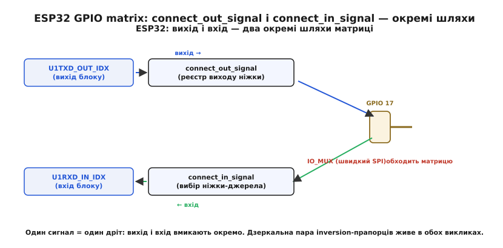

# ⚙️ Налаштування мультиплексування пінів «на металі»

У [темі цього кроку](root:embedded/pin-mux) ми розклали мультиплексування пінів на дві ідеї: фіксоване **меню** біля ніжки (STM32) і повну **комутаційну матрицю** (ESP32), та побачили, чому за свободу матриці платять тактом затримки. Усе це була картина зверху. Тепер спустимося до самого металу й напишемо прошивку, що **справді** ставить ніжку в потрібний режим — двома способами поряд, рядок за рядком, з регістрами, які можна знайти в даташиті й перевірити осцилографом.

Мета вставки практична до жорсткості: після неї ви маєте вміти взяти будь-яку ніжку будь-якого з цих двох чипів і **свідомо** під'єднати до неї потрібний периферійний блок — а головне, упізнати наперед ті пастки, на яких застрягає кожен, хто робить це вперше. Бо налаштування пінів — рідкісне місце, де помилка не дає ні попередження компілятора, ні аварії: код збирається, прошивається, запускається — і просто **мовчить**, бо сигнал виходить не туди або ніжка лишилася звичайним входом. Половина цієї вставки саме про те, як такого мовчання уникнути.

### Задача

Зведемо все до одного конкретного, дуже типового завдання, яке робить будь-який вбудований проєкт у перші ж дні: **вивести передавач UART на ніжку**. На STM32 — `USART1_TX` на `PA9`. На ESP32 — `U1TXD` спершу на довільну ніжку через матрицю, а потім порівняємо зі швидким SPI, де вибір ніжки раптом починає вирішувати, працюватиме шина взагалі чи ні.

Звучить просто — «з'єднати блок із ніжкою». Але за цією простотою три окремі питання, на кожне з яких залізо відповідає по-своєму:

Перше — **режим ніжки**. За замовчуванням ніжка після скидання — або вхід «у повітрі», або звичайний GPIO; вона **не знає**, що тепер нею керує периферійний блок. Хтось має перемкнути її з «ручного» режиму в «периферійний». На STM32 це окремий, легко забутий крок; на ESP32 його ховає драйвер.

Друге — **вибір функції**. Навіть коли ніжка в периферійному режимі, треба сказати, **яку саме** з кількох можливих функцій до неї під'єднати: на одній ніжці STM32 може жити і `USART1_TX`, і канал таймера, і `I2C_SDA`. Це те «меню», з якого ми обираємо пункт.

Третє — **напрямок сигналу**. Передавач — це вихід, приймач — вхід, а двонапрямлена лінія (як `I2C_SDA`) — і те, і те водночас. На STM32 напрямок зашитий у саму альтернативну функцію; на ESP32 вхід і вихід вмикають **окремими** викликами, і це джерело окремого класу помилок.

Розв'язавши ці три питання на двох чипах, ми побачимо, що то не дві різні теми, а **один компроміс**, поданий із двох боків.

### Ідея

Стратегія однакова для обох платформ, хоч імена регістрів різні: **спочатку режим, потім функція, потім напрямок** — і саме в цьому порядку, бо інакше можна на мить випустити назовні сміття. Розгляньмо логіку кожної платформи окремо, тримаючи цю спільну рамку в голові.

**STM32 — двокрокове меню.** Як ми бачили в темі, кожна ніжка STM32 має чотирибітне поле вибору альтернативної функції — до шістнадцяти «облич», `AF0…AF15`. Але перш ніж це поле взагалі почне діяти, ніжку треба перевести в режим альтернативної функції регістром `MODER`. Тобто два кроки, два регістри: `MODER` каже «цією ніжкою тепер керує периферія, не я», а `AFR` каже «а саме оцей блок». Пропустиш перший — поле `AFR` нічого не дасть, бо ніжка лишилася звичайним GPIO й периферія до неї просто не під'єднана. Це **пастка номер один** на STM32, і ми до неї ще повернемося з осцилографом у руках.

**ESP32 — один виклик, але два дроти.** Матриця ховає `MODER`-подібну метушню за функцією ESP-IDF, та натомість вимагає розрізняти **напрямок**. Вихідний сигнал блоку (передавач) ви ведете на ніжку викликом `esp_rom_gpio_connect_out_signal`; вхідний (приймач) — тягнете з ніжки в блок викликом `esp_rom_gpio_connect_in_signal`. Це **два незалежні комутатори** в одному кремнії: один веде сигнали назовні, другий — усередину. Номери самих сигналів (який блок який) живуть у згенерованому заголовку `soc/gpio_sig_map.h` — велика таблиця констант на кшталт `U1TXD_OUT_IDX`. Помилитися тут легко: під'єднав вихід, забув вхід — і двонапрямлена шина мовчить в один бік.


*У матриці ESP32 вихід і вхід — два незалежні комутатори. Передавач під'єднують `connect_out_signal` (реєстр виходу ніжки), приймач — `connect_in_signal` (вибір ніжки-джерела для блоку). Двонапрямлена лінія вимагає **обох** викликів. Швидкий SPI обходить матрицю прямим шляхом IO_MUX.*

**Прямий шлях IO_MUX — третій інструмент.** Понад матрицю в ESP32 живе той самий простий меню-перемикач, що й на STM32, — IO_MUX, по одному регістру на ніжку. Він потрібен там, де такт затримки матриці нестерпний: швидкий SPI. Найкраще, що драйвер SPI вибирає прямий шлях **сам**, коли ви даєте йому «правильні» ніжки. Розберемо нижче, як саме він це робить і де стеля швидкості падає, якщо ніжки «неправильні».

Тримаючи цю рамку, перейдімо до коду — спершу STM32, бо там кроки видні голим оком.

### Робочий код: STM32 через MODER + AFR

Почнемо з найголовнішого практичного вміння — рахувати зсуви бітів **руками**, бо саме на арифметиці зсувів народжується половина помилок. Регістр `MODER` віддає **два** біти на ніжку; регістр `AFR` — **чотири**, але розкладені на два слова. Запишемо це акуратно, з поясненням кожного числа.

**Умова:** під'єднати передавач USART1 (`USART1_TX`, альтернативна функція AF7) до ніжки PA9, працюючи напряму з регістрами, без HAL.

```c
#include "stm32f4xx.h"   // визначає GPIOA, RCC і структуру регістрів

void pa9_to_usart1_tx(void) {
    // 0. Тактування. Периферійний блок без такту — мертвий: запис у його
    //    регістри проходить, але апаратура не реагує. Найтихіша пастка з усіх.
    RCC->AHB1ENR |= RCC_AHB1ENR_GPIOAEN;   // такт на порт A
    RCC->APB2ENR |= RCC_APB2ENR_USART1EN;  // такт на сам USART1

    // 1. РЕЖИМ ніжки 9 → альтернативна функція (0b10).
    //    MODER: 2 біти на ніжку, отже поле ніжки 9 починається з біта 9*2 = 18.
    GPIOA->MODER &= ~(0b11u << (9 * 2));   // очистити обидва біти поля
    GPIOA->MODER |=  (0b10u << (9 * 2));   // 0b10 = Alternate function mode

    // 2. ФУНКЦІЯ: AF7 = USART1_TX саме для PA9 (число — з даташиту, таблиця AF).
    //    AFR: 4 біти на ніжку. Ніжки 0–7 → AFR[0] (AFRL), ніжки 8–15 → AFR[1] (AFRH).
    //    PA9 — ніжка 9, отже AFR[1], а зсув у НЬОМУ рахуємо від 8: (9 - 8)*4 = 4.
    GPIOA->AFR[1] &= ~(0xFu << ((9 - 8) * 4));  // очистити чотири біти поля
    GPIOA->AFR[1] |=  (0x7u << ((9 - 8) * 4));  // 0x7 = AF7

    // 3. (Решта налаштувань ніжки — швидкість фронту, тип виходу — за потребою.)
    GPIOA->OSPEEDR |= (0b11u << (9 * 2));   // висока швидкість фронту для UART
    // OTYPER лишаємо push-pull (біт 9 = 0): передавач жене обидва рівні сам.
}
```

Розберімо кожне число, бо тут немає жодної магії — лише дисципліна.

**Чому `9 * 2` для MODER.** Регістр віддає по два біти кожній з шістнадцяти ніжок порту: ніжка 0 — біти 0–1, ніжка 1 — біти 2–3, …, ніжка 9 — біти 18–19. Загальна формула зсуву поля — `номер_ніжки × 2`. Маска `0b11` (два одиничні біти) спершу **очищає** поле, потім `0b10` його ставить. Очищати окремо обов'язково: якщо просто зробити `|= 0b10`, а в полі вже сидів, скажімо, `0b01` (вхід), вийде `0b11` — зовсім інший режим (аналоговий). Запам'ятайте цей патерн «очисти-маскою-потім-постав» — він повторюється скрізь у роботі з полями регістрів.

**Чому `AFR[1]`, а не `AFR[0]`, і чому зсув від 8.** Тут і живе [згадана в темі](root:embedded/pin-mux) **пастка плутанини AFRL/AFRH**. Чотирибітних полів на шістнадцять ніжок — це 64 біти, а регістр 32-бітний; тож поля розклали на два регістри по 32 біти. Ніжки 0…7 лягли в `AFRL` (що компілятор бачить як `AFR[0]`), ніжки 8…15 — в `AFRH` (`AFR[1]`). Усередині кожного регістра зсув рахується **від першої його ніжки**: у `AFR[1]` ніжка 8 має зсув 0, ніжка 9 — зсув 4, ніжка 15 — зсув 28. Звідси `(9 - 8) * 4`. Якби ви механічно написали `9 * 4 = 36`, це вилізло б за межі 32-бітного слова — невизначена поведінка, а на практиці зсув «загорнеться» й попсує чужі біти або просто нічого не зробить.

![У STM32 чотирибітне поле ніжки лежить у AFR[0] для ніжок 0–7 і в AFR[1] для ніжок 8–15; для PA9 треба AFR[1] зі зсувом (9−8)·4, а не AFR[0]](img/afr-split.svg)
*Поле вибору функції — чотири біти на ніжку, але у двох регістрах: ніжки 0–7 в `AFR[0]` (AFRL), ніжки 8–15 в `AFR[1]` (AFRH). Для PA9 потрібен `AFR[1]`, зсув `(9−8)·4 = 4`. Звична помилка для ніжок 8–15: полізти в `AFR[0]` або взяти зсув `9·4` — і налаштувати геть іншу ніжку.*

Щоб ця арифметика не була джерелом помилок у кожному виклику, її варто загорнути раз і назавжди в маленьку функцію, що сама обирає регістр і рахує зсув:

```c
// Універсальний помічник: ставить альтернативну функцію af (0..15)
// на ніжку pin (0..15) порту port — сам обирає AFRL/AFRH і зсув.
static inline void gpio_set_af(GPIO_TypeDef *port, uint32_t pin, uint32_t af) {
    // режим → альтернативна функція
    port->MODER &= ~(0b11u << (pin * 2));
    port->MODER |=  (0b10u << (pin * 2));
    // функція: індекс регістра pin/8 (0 для 0–7, 1 для 8–15),
    //          зсув у ньому (pin % 8) * 4
    uint32_t idx = pin >> 3;            // pin / 8
    uint32_t shift = (pin & 7u) * 4u;   // (pin % 8) * 4
    port->AFR[idx] &= ~(0xFu << shift);
    port->AFR[idx] |=  ((af & 0xFu) << shift);
}
```

Тепер виклик читається як умова задачі: `gpio_set_af(GPIOA, 9, 7)` — «ніжці PA9 функцію AF7». Уся плутанина регістрів сховалася в `pin >> 3` і `(pin & 7) * 4`, і помилитися більше ніде. Це той самий принцип, що ми застосовуємо до всякої роботи з [регістрами через HAL, LL чи голий доступ](root:embedded/hal-ll-registers): дрібну, легко-хибну арифметику інкапсулюй раз, далі користуйся ім'ям.

> 🔧 **Навіщо це.** Помилка «забув MODER» або «переплутав AFR» не дає жодного діагностичного сигналу: код збирається й біжить, а UART мовчить. На осцилографі ви побачите на ніжці рівну лінію замість пакетів — і витратите годину, перш ніж здогадаєтеся, що ніжка лишилася звичайним входом. Помічник `gpio_set_af` прибирає цілий клас таких годин: він **завжди** ставить MODER і **завжди** правильно адресує AFR. У реальному проєкті такий помічник окуповується першого ж тижня.

Якщо ви пишете не на голих регістрах, а через HAL — той самий результат дає `HAL_GPIO_Init` зі структурою, де `Mode = GPIO_MODE_AF_PP` і `Alternate = GPIO_AF7_USART1`. HAL робить рівно те, що наш помічник: ставить MODER у режим AF і кладе число в AFR. Корисно знати обидва рівні — бо коли HAL «не працює», шукати причину ви будете саме в цих регістрах.

### Робочий код: ESP32 через GPIO matrix

Тепер та сама задача на ESP32 — і одразу видно інший світогляд. Замість «перемкни режим, потім обери функцію» тут «прокладемо дріт від сигналу до ніжки». Сигнали мають числові індекси з `soc/gpio_sig_map.h`, а напрямок задаємо вибором виклику.

**Умова:** вивести передавач UART1 (`U1TXD`) на ніжку GPIO 17 і завести приймач (`U1RXD`) з ніжки GPIO 16 — обидва напрямки, через матрицю.

```c
#include "esp_rom_gpio.h"
#include "soc/gpio_sig_map.h"   // U1TXD_OUT_IDX, U1RXD_IN_IDX, …
#include "hal/gpio_hal.h"
#include "driver/gpio.h"

void uart1_pins_via_matrix(void) {
    const int tx_pin = 17;
    const int rx_pin = 16;

    // 1. Ніжку-вихід треба зробити виходом, ніжку-вхід — входом.
    //    Матриця тільки КОМУТУЄ; буфер ніжки (драйвер/приймач) вмикаємо окремо.
    gpio_set_direction(tx_pin, GPIO_MODE_OUTPUT);
    gpio_set_direction(rx_pin, GPIO_MODE_INPUT);

    // 2. ВИХІД: вести сигнал передавача U1TXD з блоку → на ніжку 17.
    //    (ніжка, індекс_сигналу, інвертувати_сигнал, інвертувати_дозвіл_виходу)
    esp_rom_gpio_connect_out_signal(tx_pin, U1TXD_OUT_IDX, false, false);

    // 3. ВХІД: завести сигнал з ніжки 16 → у приймач блоку U1RXD.
    //    (ніжка, індекс_сигналу, інвертувати_сигнал)
    esp_rom_gpio_connect_in_signal(rx_pin, U1RXD_IN_IDX, false);
}
```

Зверніть увагу: **вихід і вхід — два окремі виклики**, бо це два окремі комутатори матриці, як ми домовилися в ідеї. Передавач веде сигнал **назовні** (`connect_out_signal`), приймач тягне сигнал **усередину** (`connect_in_signal`). Двонапрямленої «магії» тут нема: якщо забути один із викликів, шина працюватиме рівно в один бік, і це найчастіша помилка новачка в матриці — «передаю нормально, а не приймаю нічого».

Окремо — про `gpio_set_direction` перед комутацією. Матриця лише вирішує, **який сигнал** ходить до ніжки; але чи ввімкнено **сам буфер** ніжки (драйвер, що жене рівень назовні, та приймач, що читає рівень) — це окреме питання, і його закриває напрямок ніжки. Прокласти вихідний сигнал на ніжку, у якої вихідний буфер вимкнено, — те саме, що під'єднати дріт до ніжки з обрізаним виходом: матриця готова, а назовні нічого не йде. Тому напрямок ставимо **першим**.

Тепер про четвертий аргумент `connect_out_signal`, повз який легко проскочити, — **інверсію сигналу прапорцем матриці**. Передостанній параметр (`false` вище) означає «не інвертувати сам сигнал»; постав `true` — і матриця апаратно перевертає рівень на шляху до ніжки. Це безкоштовний інвертор у кремнії, і він рятує там, де зовнішня логіка очікує активний-низький рівень або де трапився переплутаний полярністю приймач. Та сама можливість є на вході. Це зручність, якої немає в простого меню STM32, і про неї варто пам'ятати — як про інструмент і як про пастку (про що нижче).

> 🔧 **Навіщо це.** Поділ «вихід окремо, вхід окремо» — не примха API, а пряме відображення кремнію: у матриці справді два незалежні комутатори. Як тільки ви це засвоїте, зникає цілий клас плутанини. Двонапрямлена лінія (`I2C_SDA`, half-duplex) вимагає **обох** викликів на **ту саму** ніжку — і вихідного, і вхідного; одна шина даних — два дроти матриці. Забули вхідний — майстер шле, але ніколи не «чує» ні підтвердження, ні даних від підлеглого, і ви годину дивитеся на справний з вигляду осцилограф.

У реальному коді ESP-IDF ви рідко смикаєте `connect_out_signal` руками для UART чи I2C — це робить драйвер, коли ви передаєте йому номери ніжок у конфігурації (`uart_set_pin`, `i2c_param_config`). Але **знати**, що відбувається під капотом, критично: коли драйвер «не бачить» ніжку або сигнал іде не туди, ви відкриваєте саме ці два виклики й дивитеся, що насправді скомутовано. А для нестандартних випадків — вивести внутрішній сигнал на ніжку для діагностики, перекинути тактовий вихід — ви кличете їх прямо.

### Швидкий SPI: коли драйвер сам обирає IO_MUX

Найцікавіше починається там, де матриця **заважає**. Розберемо, як драйвер SPI на ESP32 непомітно перемикається між двома шляхами й чому це питання не зручності, а працездатності шини взагалі.

Згадаймо причину з [теми кроку](root:embedded/pin-mux): сигнал крізь матрицю проходить через тактовану засувку й дістає затримку. Espressif називає точне число: коли майстер SPI ходить через GPIO matrix, до шляху сигналу MISO додаються **два такти шини APB**, а такт APB — це 12.5 нс, тобто близько 25 нс зайвої затримки. На повільній шині це дрібниця, а на швидкій — катастрофа: до часу, коли підлеглий виставив дані, додаються ці 25 нс, момент готовності зсувається, і майстер на високій частоті читає **не той** біт.

Числа варто закріпити, бо вони прямо диктують стелю. Грубу оцінку максимальної частоти Espressif дає так:

```
Стеля_частоти [МГц] ≈ 80 / (⌊затримка_MISO[нс] / 12.5⌋ + 1)
```

Підставмо два випадки. Через **IO_MUX** (прямий шлях, без зайвих тактів) затримка мінімальна, і для ідеального підлеглого без власної затримки виходу стеля сягає **80 МГц**. Через **матрицю** ті самі +25 нс штовхають знаменник угору, і та сама ідеальна лінія впирається приблизно в **26 МГц**; на практиці безпечною межею тактової для матриці називають близько **40 МГц** (з оглядками на півдуплекс і додаткові «пусті» біти). Різниця — від двох до трьох разів, і вона цілком визначається тим, чи лежать ніжки на своїх IO_MUX-виводах.

А тепер ключова деталь, заради якої все це писалося. **Драйвер SPI обирає шлях сам.** Коли ви конфігуруєте шину, ви передаєте йому номери ніжок CLK/MOSI/MISO/CS. Драйвер звіряє їх із зашитим у чип списком IO_MUX-виводів цього SPI-блоку: якщо **всі** ваші ніжки збігаються з рекомендованими — він тихо веде сигнали **прямим** шляхом IO_MUX, обходячи матрицю, і шина дістає повну швидкість. Варто **бодай одній** ніжці не збігтися — драйвер змушений увімкнути матрицю **для всіх** сигналів цієї шини, і стеля падає. Ось ці виводи для оригінального ESP32:

```
Блок HSPI (SPI2):  CLK = GPIO 14,  MOSI = GPIO 13,  MISO = GPIO 12,  CS = GPIO 15
Блок VSPI (SPI3):  CLK = GPIO 18,  MOSI = GPIO 23,  MISO = GPIO 19,  CS = GPIO 5
```

Подивимося на це в коді — два виклики, що відрізняються лише ніжками, але дають різну швидкість шини:

```c
#include "driver/spi_master.h"

// ── Варіант А: ніжки VSPI з IO_MUX → драйвер бере прямий шлях, повна швидкість ──
static void spi_fast_iomux(void) {
    spi_bus_config_t bus = {
        .sclk_io_num = 18,   // ← рекомендовані IO_MUX-виводи VSPI
        .mosi_io_num = 23,
        .miso_io_num = 19,
        .quadwp_io_num = -1,
        .quadhd_io_num = -1,
    };
    spi_bus_initialize(SPI3_HOST, &bus, SPI_DMA_CH_AUTO);

    spi_device_interface_config_t dev = {
        .clock_speed_hz = 80 * 1000 * 1000,  // 80 МГц — реально лише через IO_MUX
        .spics_io_num   = 5,                  // ← CS теж IO_MUX-виводу VSPI
        .mode = 0, .queue_size = 4,
    };
    spi_device_handle_t h;
    spi_bus_add_device(SPI3_HOST, &dev, &h);
    // Тут драйвер побачив: усі ніжки = IO_MUX VSPI → матриця вимкнена, прямий шлях.
}

// ── Варіант Б: довільні ніжки → драйвер вмикає матрицю, стеля падає ──
static void spi_slow_matrix(void) {
    spi_bus_config_t bus = {
        .sclk_io_num = 25,   // ← НЕ IO_MUX-виводи: вибрані під зручність плати
        .mosi_io_num = 26,
        .miso_io_num = 27,
        .quadwp_io_num = -1,
        .quadhd_io_num = -1,
    };
    spi_bus_initialize(SPI3_HOST, &bus, SPI_DMA_CH_AUTO);

    spi_device_interface_config_t dev = {
        .clock_speed_hz = 80 * 1000 * 1000,  // ПОПРОСИЛИ 80 — але через матрицю
        .spics_io_num   = 33,                 //   стеля ~26–40 МГц: на 80 шина збоїть
        .mode = 0, .queue_size = 4,
    };
    spi_device_handle_t h;
    spi_bus_add_device(SPI3_HOST, &dev, &h);
    // Драйвер побачив чужі ніжки → увімкнув матрицю для ВСІХ сигналів шини.
}
```

Різниця між цими двома функціями — лише в номерах ніжок, але наслідок драматичний. У варіанті А ви просите 80 МГц і **отримуєте** їх, бо драйвер веде сигнали прямо. У варіанті Б ви теж просите 80 МГц, код збирається й запускається без жодної скарги — але шина **мовчки збоїть**, бо матриця не встигає, і дані читаються не вчасно. Жодної помилки компіляції, жодного винятку — лише биті байти на високій частоті. Найпідступніше, що на низькій частоті (скажімо, 10 МГц) **обидва** варіанти працюють однаково, тож на стенді ви можете не помітити проблеми, а вона вилізе, щойно ви піднімете тактову на бойовій платі.

> 🔧 **Навіщо це.** Список «рекомендованих» ніжок у даташиті швидкої шини — це не порада зі стилю, а ті самі IO_MUX-виводи, що уникають такту затримки. Коли проєктуєте плату під швидкий SPI (дисплей, флеш, АЦП), **посадіть шину на ці ніжки наперед** — інакше пізніше доведеться або жити з нижчою стелею, або переразводити плату. А якщо швидкість некритична (повільний дисплей, рідкісний обмін), ставте ніжки де зручно й хай драйвер вмикає матрицю — це і є та свобода, заради якої вона існує. Рішення «IO_MUX чи матриця» ви ухвалюєте **на етапі розведення**, а не в коді; код лише виконує наслідок. Те, як драйвер ховає роботу з шиною за абстракцією, перегукується з [абстракцією шин SPI/I2C](root:embedded/spi-vs-i2c/proj-bus-abstraction.md) — драйвер бере на себе вибір шляху, ви даєте йому лише ніжки й швидкість.

### Складність і пастки на залізі

Тепер — найважче й найкорисніше: місця, де чистий код розбивається об фізику й особливості кремнію. Кожна з цих пасток коштувала комусь не однієї години біля осцилографа; зберемо їх так, щоб вони коштували вам нуль.

- **STM32: забути перевести MODER у режим AF.** Найпоширеніша помилка з усіх. Ви акуратно поклали правильне число в `AFR`, але лишили `MODER` у стані «вхід» або «звичайний вихід GPIO» — і периферія до ніжки просто **не під'єднана**, поле `AFR` ні на що не впливає. Симптом: ніжка німа, осцилограф показує рівну лінію або сміття. Лікування — завжди ставити MODER **і** AFR разом, одним помічником (як `gpio_set_af` вище), щоб фізично не можна було зробити одне без іншого. Якщо налагоджуєте чужий код, де UART/SPI мовчить, — перше, що перевіряйте, це `MODER` потрібної ніжки.

- **STM32: переплутати AFRL і AFRH для ніжок 8–15.** Друга за частотою пастка, і саме на ніжках 8–15. Поле ніжки 9 лежить у `AFR[1]` зі зсувом `(9−8)·4 = 4`, а не в `AFR[0]` і не зі зсувом `9·4`. Помилитесь — налаштуєте **чужу** ніжку (а свою лишите німою), і діагноз заплутається подвійно: одна ніжка раптом ожила «сама», інша мовчить. Помічник із `pin>>3` і `(pin&7)*4` закриває це назавжди; руками ж завжди питайте себе «ніжка ≥ 8? тоді `AFR[1]` і зсув від восьмої».

- **STM32: забути такт на порт або на сам блок.** Запис у регістри `GPIOx` чи `USARTx` без увімкненого такту (`RCC->AHB1ENR`, `RCC->APBxENR`) **проходить тихо** — і нічого не робить, бо без такту блок не живий. Жодної помилки шини, просто мертва периферія. Це навіть підступніше за MODER, бо тут німіє все одразу. Правило: вмикайте такт **першим**, до будь-якого торкання регістрів блоку.

- **ESP32: ніжки тільки на вхід (34–39).** Кремнієва межа, якої не обійти жодним кодом: ніжки **GPIO 34, 35, 36, 39** (а на практиці весь діапазон 34–39) — **лише входи**. У них фізично немає вихідного буфера й немає внутрішніх підтяжок. Прокладете на таку ніжку вихідний сигнал через `connect_out_signal` — матриця слухняно скомутує, виклик поверне успіх, а назовні **не вийде нічого**, бо виводити нічим. Симптом класичний для матриці: код без помилок, ніжка німа. Тримайте ці шість ніжок під входи (АЦП, кнопки, давачі) і ніколи не вішайте на них передавач, CS чи будь-який вихід. І пам'ятайте про брак внутрішніх підтяжок — для входу [підтяжку доведеться ставити зовнішнім резистором](root:embedded/pullup-resistor-design).

- **ESP32: strapping-піни (0, 2, 5, 12, 15).** Ці ніжки чип читає **в мить скидання**, щоб вирішити, звідки вантажитися й на якій напрузі флеш: `GPIO0` — режим завантаження (низький → режим прошивання), `GPIO2` йому допомагає, `GPIO12` (MTDI) задає напругу флеш-пам'яті, `GPIO15` (MTDO) — вивід логів при старті, `GPIO5` теж бере участь. Біда в тому, що це **звичайні** GPIO **після** старту, тож спокусливо повісити на них свою периферію — і все працює, доки одного разу зовнішня обв'язка не притисне `GPIO0` до землі в момент увімкнення, і плата не завантажиться. Найгірший збіг: `GPIO12` — це водночас **MISO блоку HSPI** з IO_MUX. Тобто посадивши швидкий HSPI на «рідні» IO_MUX-ніжки, ви займаєте strapping-пін напругою флеш — і якщо ваш зовнішній пристрій підтягує цю лінію не туди, чип при старті обере хибну напругу флеш і не підніметься. Лікування: на strapping-пінах або не вішайте нічого, що активне при скиданні, або ретельно лічіть рівні зовнішньої обв'язки в **момент** старту, а не лише в роботі.

- **ESP32: два сигнали б'ються за одну ніжку.** Матриця дає свободу — і нею легко вистрелити собі в ногу. Якщо ви двома викликами `connect_out_signal` спрямуєте на **ту саму** ніжку два різні вихідні сигнали, переможе **останній**: перший просто перестане виходити, мовчки. Жодного попередження — лише один із двох блоків раптом «зник» із ніжки. Це інша природа конфлікту, ніж на STM32: там ніжка фізично має лиш одне меню й конфлікт видно як «функція недоступна», а тут обидва сигнали «дозволені», просто пізніший затирає ранішого. Тримайте **карту призначень** (хоч у коментарі, хоч у таблиці) — яка ніжка чий сигнал несе, — і звіряйтеся з нею; матрична свобода без обліку перетворюється на тихі затирання.

- **ESP32: інверсія прапорцем матриці — забута або зайва.** Передостанній аргумент `connect_out_signal`/`connect_in_signal` перевертає рівень сигналу. Лишите зайвий `true` зі старого коду — і ваш UART шле інвертовані біти, які приймач читає як суцільне сміття (рамкова помилка на кожному байті). Забудете потрібний `true` там, де лінія активна-низька, — те саме. Підступність у тому, що інверсія схована в одному булевому аргументі серед інших, і око по ній ковзає. Якщо UART/SPI «майже працює», але дані — каша, перевірте цей прапорець **перш**, ніж винуватити швидкість чи дроти.

- **Обидві платформи: на низькій частоті помилка спить.** Найковзкіша пастка взагалі. І зайва затримка матриці, і дрібний огріх полярності, і навіть слабкий контакт часто **не видні** на повільній шині — байти проходять, бо запасу часу багато. Підніміть тактову вдвічі — і шина сипле помилками. Тому фінальну перевірку конфігурації пінів **завжди** робіть на **робочій** частоті, а не на зручній для налагодження; інакше стенд бреше, що все гаразд.

Зведімо все докупи. Налаштування мультиплексування — це три послідовні питання (**режим → функція → напрямок**), і кожна платформа відповідає на них по-своєму: STM32 вимагає явно перемкнути `MODER` і вписати функцію в правильну половину `AFR`, ESP32 ховає режим за драйвером, але змушує окремо вмикати вихід і вхід матриці, а для швидкого SPI — мовчки обирає прямий IO_MUX, коли ніжки «рідні». Помилки тут особливі тим, що **не кричать**: код збирається й біжить, а ніжка просто мовчить або сипле сміттям. Тому головна зброя — не пам'ять, а дисципліна: завжди MODER разом з AFR, завжди вихід разом із входом для двонапрямленої лінії, завжди звірка з картою ніжок і перевірка на бойовій частоті. Опанувавши це на двох настільки різних чипах, ви читатимете розпіновку будь-якого третього вже без страху — бо за всіма іменами регістрів стоїть той самий [компроміс «гнучкість проти швидкості»](root:embedded/pin-mux), який ми тепер уміємо налаштувати руками.
