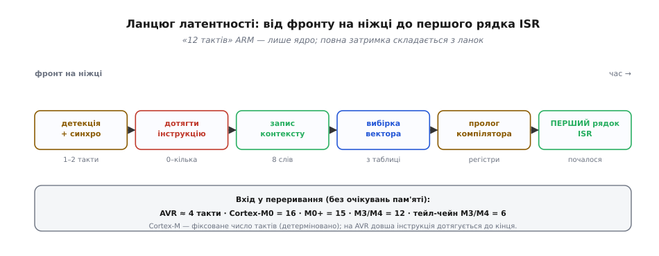
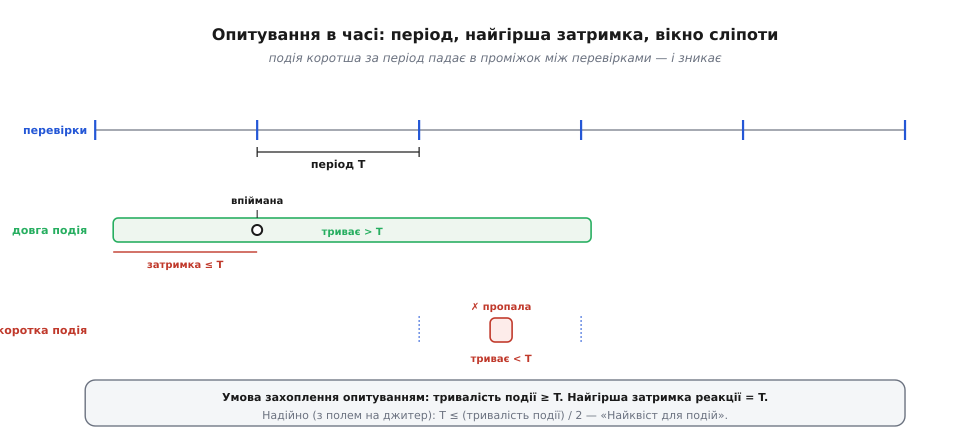
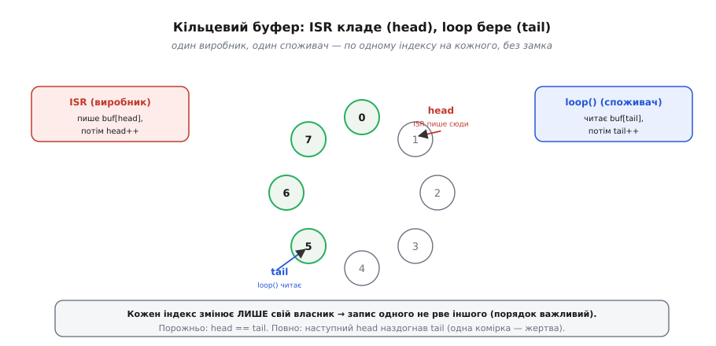

# Polling vs переривання: механіка вибору

У [базовій частині](root:embedded/polling-vs-interrupts) ми відповіли на головне запитання роботи практика — **коли брати опитування, а коли переривання** — і звели його до двох питань, п'яти критеріїв та гібрида «прапорець + `loop()`». Цього досить, щоб ухвалити вірне рішення в більшості задач. Але за кожним із тих критеріїв стоїть точна механіка, і саме вона відрізняє того, хто **вгадує** правильний інструмент, від того, хто **знає, чому** він правильний і **де саме** він зламається.

Тут ми розберемо цю механіку до дна. Скільки насправді триває реакція переривання — і чому «12 тактів», якими хизуються ARM, це лише одна ланка довшого ланцюга. Яку затримку гарантує опитування — і як із цього виводиться «Найквіст для подій», умова, за якою подію взагалі можна впіймати опитуванням. Яку ціну ми платимо за переривання не словами «складніше», а конкретними механізмами: **порвате читання**, `volatile`, критичні секції, кільцевий буфер. І нарешті — вимір, якого базова частина майже не торкнулася: **енергія**, бо для пристрою на батарейці вибір між опитуванням і перериванням часто вирішує не швидкість, а струм спокою.

Нитку ведемо ту саму — навіщо, інтуїція, деталі, приклад, — але тепер занурюємося на шар глибше: не «що обрати», а **як воно працює всередині** й **де межа**.

## Скільки насправді триває реакція переривання

Базова частина сказала: на Cortex-M вхід у переривання — «детермінований, 12 тактів», на AVR — «близько 4–5 тактів». Ці числа правдиві, але вони описують лише **одну ланку**. Коли інженер каже «латентність переривання 12 тактів», він майже завжди має на увазі час, який рахує **ядро** від моменту, коли воно вирішило обслужити переривання, до першої інструкції обробника. Повна ж затримка — від фізичного фронту на ніжці до вашого коду — складається з кількох послідовних ланок, і кожна додає свій внесок.

Розкладімо цей ланцюг. Спершу фронт на вході має бути **помічений**: логіка периферії (у ARM це NVIC — вкладений векторний контролер переривань, англ. *Nested Vectored Interrupt Controller*) семплує лінію своїм тактом, і між фізичним краєм та внутрішнім «прапорцем чекає» минає 1–2 такти на синхронізацію. Далі ядро **не кидає інструкцію посеред виконання** — воно дотягує поточну до точки, де її можна перервати; якщо це коротка інструкція, чекати нічого, а якщо довга (ділення, доступ до повільної пам'яті) — доводиться дочекатися. Тоді ядро **зберігає контекст**: на Cortex-M апаратура автоматично складає в стек вісім слів (xPSR, PC, LR, R12, R3–R0), і це кістяк тих самих 12 тактів. Паралельно чи слідом іде **вибірка вектора** — адреси обробника з таблиці векторів. І аж потім — **пролог компілятора**: код, який компілятор дописав на початок вашої `void handler()`, щоб зберегти ще й ті регістри, якими користується сама функція. Лише після цього виконується **перший ваш рядок**.


*Повна затримка переривання — сума ланок, а не одне число. NVIC синхронізує фронт (1–2 такти), ядро дотягує поточну інструкцію, апаратно складає 8 слів контексту, вибирає вектор, тоді виконується пролог компілятора — і аж далі перший рядок ISR. «12 тактів» ARM описують лише апаратне складання контексту.*

Тепер числа набувають сенсу. На Cortex-M вхід у переривання — **фіксоване** число тактів, і саме тому ARM зве його детермінованим: Cortex-M0 — 16 тактів, Cortex-M0+ — 15, Cortex-M3 і Cortex-M4 — 12, Cortex-M7 — 10–12 (усі за нульових очікувань пам'яті). Детермінізм тут не дрібниця, а окрема цінність: у системі жорсткого реального часу важлива не так мала латентність, як **передбачувана** — така, для якої можна довести, що дедлайн не зірветься. AVR влаштований інакше: мінімальна відповідь до вектора — **4 такти** (за них у стек лягає лічильник команд), а сам вектор — це зазвичай інструкція переходу `RJMP` до тіла обробника, ще **3 такти**; разом близько семи тактів до першого рядка вашої ISR. На ATmega328P @ 16 МГц один такт — 62.5 нс, тож ці чотири такти вектора — це ті самі ≈250 нс, що згадувала базова частина, а повний шлях до тіла — під півмікросекунди.

```
Cortex-M3/M4 @ 72 МГц:  12 тактів входу ≈ 12 / 72e6 ≈ 167 нс (детерміновано)
AVR @ 16 МГц:           4 такти до вектора + 3 такти RJMP = 7 тактів ≈ 437 нс
```

Дві поправки, без яких число бреше. Перша — **пробудження зі сну**: якщо ядро спало, до латентності додається час запуску тактового генератора, а на AVR — ще й окремі 4 такти зверху; для сплячого пристрою «латентність переривання» може підскочити з нанросекунд до мікросекунд, і це часто вирішальний фактор (до нього повернемося в розділі про енергію). Друга — **очікування пам'яті**: 12 тактів Cortex-M справедливі за нульових wait-states; повільна флеш-пам'ять чи зайнята шина розтягують і складання контексту, і пролог. Тому «детерміновано 12» — це стеля ідеальних умов, а не гарантія на будь-якій платі.

І остання, найпрактичніша ланка — **пролог компілятора**, бо на нього ви впливаєте кодом. Апаратний вхід від вас не залежить, а от скільки регістрів збереже й відновить обгортка вашого обробника — залежить прямо від того, що ви в ньому робите. Порожня ISR, що лише ставить прапорець, тягне мінімальний пролог; ISR, що викликає функцію з плаваючою комою чи бібліотечний виклик, змушує компілятор зберегти півсвіту регістрів — і латентність від фронту до **корисної** дії зростає в рази. Ось перша практична причина золотого правила «ISR має бути короткою», яку базова частина дала як аксіому: коротка ISR — це не лише малий податок на процесор (це ми рахували в [бюджеті переривань](root:embedded/polling-vs-interrupts/math-isr-budget.md)), а й короткий пролог, отже менша реальна затримка реакції.

> 🔧 **Навіщо це.** Коли в даташиті пише «interrupt latency 12 cycles», не приймайте це за час реакції вашої системи. Реальний шлях від сигналу до вашого коду — це сума: синхронізація + дотягування поточної інструкції + апаратне складання контексту + вибірка вектора + пролог компілятора, а зі сну ще й запуск генератора. Якщо задача жорстка за часом (керування двигуном, семпл АЦП у фіксовану мить), рахуйте **найгіршу** суму, а не мінімум ядра, і тримайте ISR голою — інакше пролог з'їсть ваш запас тихо й непомітно.

## Найгірша затримка — і чому вона важить більше за середню

Ми звикли міряти реакцію переривання «швидкістю входу». Але для системи, що мусить встигати, важлива не типова, а **найгірша** затримка — та, за яку ви ще можете поручитися. Вона майже завжди більша за паспортні 12 тактів, і складається вона з трьох доданків, кожен зі своєю механікою.

Перший доданок — сам **вхід у переривання**, який ми щойно розклали. Другий — **час, поки переривання заборонені або зайняте вище за пріоритетом**. Поки виконується критична секція (переривання глобально вимкнені) або поки ядро обслуговує обробник вищого пріоритету, ваше переривання **чекає**, хай яке воно термінове. Третій — **час, поки процесор дотягне поточну неперервну дію**: найдовша інструкція, найдовша критична секція в чужому коді, найдовша ISR нижчого пріоритету, яку не можна витіснити.

Звідси — центральна для реального часу формула найгіршої реакції:

```
T(реакція, найгірше) = T(вхід)  +  T(блокування)  +  T(вищі пріоритети)

  T(вхід)          — апаратний вхід у переривання (12 тактів Cortex-M …)
  T(блокування)    — найдовша ділянка з вимкненими перериваннями (критичні секції!)
  T(вищі пріоритети) — сумарний час обробників, що можуть витіснити вас
```

Тут ховається неочевидне, але важливе спостереження: **найгіршу латентність вашого термінового переривання визначає найдовша критична секція у всій програмі** — навіть у коді, який не має до цього переривання жодного стосунку. Один недбалий `noInterrupts()` перед довгим циклом деінде — і ваша «миттєва» реакція на аварійний сигнал відкладається на весь той цикл. Ось чому в системах реального часу критичні секції тримають **якомога коротшими**: не заради швидкості самої секції, а заради латентності **всіх** переривань, які через неї можуть застрягти.

Пріоритети — окрема механіка, якої в базовій частині не було. NVIC у Cortex-M дозволяє переривання **вкладати**: обробник вищого пріоритету витісняє нижчий просто в момент його виконання. Це той самий tail-chaining і late-arrival, що робить ARM сильним у реальному часі: якщо, поки складається контекст для одного переривання, приходить важливіше, NVIC обслужить важливіше першим (late-arrival); а коли один обробник щойно завершився, а інший уже чекає, ядро **не** розвантажує й не завантажує контекст даремно, а перестрибує з кінця одного в початок іншого — це tail-chaining, і коштує він не 12 тактів, а лише **6**. Завдяки цьому ланцюг обробників біжить майже без пауз, а термінове переривання не мусить чекати, поки добіжить менш важливе.

```
Звичайний вхід (M3/M4):        12 тактів  (склали контекст)
Tail-chaining між обробниками:  6 тактів  (контекст не чіпали — перестрибнули)
Late-arrival:                  важливіший обслужується першим, стек не подвоюється
```

На AVR цієї розкоші майже немає: вхід в обробник **глобально вимикає** переривання (прапорець I у SREG скидається), тож за замовчуванням одне переривання не витісняє інше — вони обслуговуються по черзі. Тому на AVR довга ISR прямо роздуває найгіршу латентність **усіх** інших переривань, і правило «коротка ISR» тут ще суворіше, ніж на ARM. Це, до речі, ще один аргумент, чому потік однотипних подій краще віддати апаратному лічильнику чи DMA: інакше довгий чи частий обробник блокує все інше.

> 🔧 **Навіщо це.** Якщо у вас є переривання з дедлайном (керування, безпека, точний семпл), його реальна гарантія — не «12 тактів входу», а сума входу, найдовшого блокування і всіх вищих пріоритетів. Практичні висновки прямі: (1) критичні секції — мікроскопічні; (2) термінове переривання — на **вищий** пріоритет, ніж часте-але-нетермінове; (3) на AVR, де вкладення немає, кожна ISR коротка, бо вона блокує решту. Не порахувавши цю суму, ви не маєте права казати «система встигає» — ви лише сподіваєтесь.

## Опитування в часі: «Найквіст для подій»

Тепер симетрично розберемо опитування — так само в числах. Базова частина сформулювала суть одним реченням: опитування «фізично не бачить події, коротшої за свій період». Виведемо цю межу строго й побачимо, що вона тісно споріднена з теоремою відліків, знайомою з обробки сигналів.

Нехай цикл перевіряє стан лінії з періодом **T** — раз на кожні T секунд `loop()` доходить до `digitalRead` і дивиться. Питання: за якої умови подію гарантовано **не пропустити**? Розберемо два випадки, і різниця між ними — усе.

**Довга подія: триває довше за період.** Якщо сигнал стоїть високим протягом часу довшого за T, то хоч би куди впала перевірка, **бодай одна** з них неодмінно застане подію активною — між двома сусідніми перевірками не поміститься проміжок, за який подія встигла б з'явитися й зникнути. Отже, довга подія **завжди впіймається**. Питання лише в затримці: у найгіршому разі подія почалася **щойно після** попередньої перевірки, і побачимо ми її аж на наступній — тобто найгірша затримка реакції дорівнює рівно **T**.

**Коротка подія: триває менше за період.** А ось тут провалля. Якщо імпульс коротший за T, він може повністю вміститися **між** двома перевірками: код глянув — лінія `LOW`, імпульс спалахнув і згас, код глянув знову — знову `LOW`. Подія існувала, але для опитування її **не було**. І це не «іноді» — це станеться неминуче для будь-якого імпульсу, коротшого за T, щойно він випадково впаде в проміжок; а падає він туди тим частіше, чим коротший.


*Опитування з періодом T. Довга подія (зелена, триває > T) неминуче застається хоч однією перевіркою — впіймана, найгірша затримка = T. Коротка подія (червона, триває < T) вміщується в проміжок між перевірками й зникає безслідно. Гранична умова захоплення: тривалість події ≥ T; надійно, з полем на джитер, — T ≤ тривалість/2.*

Звідси — **умова захоплення опитуванням**: щоб гарантовано впіймати подію, період опитування має бути не більший за її тривалість.

```
Гарантоване захоплення:   T(опитування)  ≤  тривалість події
Найгірша затримка реакції: = T(опитування)
```

Ця нерівність — точний аналог теореми відліків (критерій Найквіста): щоб не втратити сигнал, семплювати треба **частіше, ніж він змінюється**. Тільки там ідеться про синусоїду й потрібне подвоєння частоти, а тут — про подію-імпульс, і потрібне подвоєння радше з практичних міркувань. У теорії досить T ≤ тривалості; на практиці подія й опитування **не синхронізовані** й обидва мають **джитер** (тремтіння) — момент перевірки плаває через змінне навантаження циклу, тривалість імпульсу теж не ідеальна. Тому надійний робочий запас — **T ≤ тривалість/2**: тоді навіть якщо перевірка й подія найгірше розминулися фазою, у вікні події вміститься принаймні одна перевірка. Це і є «Найквіст для подій» — те саме подвоєння, лише з іншої причини (не спектральної, а через несинхронність і джитер).

Прикладемо до чисел базової частини. Імпульс давача обертів — 50 мкс; `loop()` крутиться раз на 5 мс. Умова захоплення вимагає T ≤ 50 мкс, а ми маємо T = 5000 мкс — у сто разів завелика. Опитування тут не «трохи спізнюється», воно **системно сліпе**: у середньому побачить лише один імпульс зі ста, і `turns` буде брехати не на відсотки, а на два порядки. Щоб урятувати опитування, довелося б крутити цикл раз на 25 мкс (T = тривалість/2) — тобто 40 000 разів на секунду **нічого не роблячи, крім перевірки ніжки**, і це вже безглуздо: простіше й дешевше віддати рахунок перериванню чи апаратному лічильнику.

А тепер зворотний бік тієї ж нерівності — **коли опитування виграє**. Кнопка під палець: подія (натиск) триває десятки-сотні мілісекунд, а T = 5 мс. Умова захоплення виконана з величезним запасом (5 мс ≪ 100 мс), затримка реакції ≤ 5 мс людині непомітна — опитування ідеальне, і додавати переривання означало б купувати складність, яку нема куди подіти. Та сама формула, що засудила опитування для імпульсу, виправдовує його для кнопки — уся різниця в **масштабі часу** події проти періоду циклу.

Є й пастка, симетрична до пастки переривань. У переривань найгіршу латентність роздуває найдовша критична секція; в опитування — **найдовша ітерація циклу**. Період T — це не константа: якщо десь у `loop()` є важкий шматок (перемалювати екран, порахувати, зачекати відповідь модуля), то на цій ітерації T підскакує, і навіть подія, довша за *середній* період, може провалитися в цю розтягнуту паузу. Тому чесне T для розрахунку — це **найгірша**, найдовша ітерація, а не типова. Звідси й практичне правило: у циклі з опитуванням не можна тримати `delay()` та довгі блокувальні виклики — вони роздувають T і роблять опитування ненадійним саме тоді, коли навантаження зростає.

> 🔧 **Навіщо це.** Перш ніж покладатися на опитування, порахуйте два числа: найкоротшу тривалість події, яку треба впіймати, і найдовшу ітерацію вашого циклу. Якщо найдовша ітерація перевищує половину тривалості події — опитування **проґавить**, і жодне «прискорення коду» не врятує принципово, поки в циклі лишаються довгі блокувальні дії. Це той самий рахунок, що й бюджет переривань, лише з іншого боку: там ми питали «чи вистачить процесора на потік ISR», тут — «чи встигне цикл побачити подію».

## Справжня ціна переривань — не рядки коду, а спільна пам'ять

Базова частина назвала ціну переривань «складнішим кодом: ISR, `volatile`, гонки». Це чесно, але надто коротко, щоб цю ціну поважати. Насправді вся складність переривань зводиться до однієї фундаментальної речі: **обробник виконується асинхронно й ділить пам'ять із головним кодом**. Переривання може вклинитися **між будь-якими двома машинними інструкціями** головного потоку — і якщо в цю мить обидва торкаються тих самих даних, дані рвуться. Розберімо три механізми цієї біди по черзі, бо саме вони — реальна причина, чому опитування «простіше».

Почнемо з найпідступнішого — **порватого читання** (англ. *torn read*). Уявімо лічильник обертів `turns` типу `unsigned long` (32 біти) на ATmega328P — 8-бітному ядрі. Процесор фізично не вміє прочитати 32 біти за одну інструкцію; він читає їх **чотирма** послідовними байтовими читаннями. Тепер уявімо, що `loop()` почав читати `turns`, устиг узяти старші байти — і **саме в цю мить** спрацьовує ISR і робить `turns++`, змінюючи число. `loop()` продовжує й дочитує молодші байти — але вже **нові**. У руках опиняється покруч: старша половина від старого значення, молодша від нового — число, якого **ніколи не існувало**.


*Порвате читання на 8-бітному ядрі. `loop()` читає старший байт багатобайтної змінної (0x01), між читаннями вклинюється ISR і робить `++` — у пам'яті вже 0x0200 (512). `loop()` дочитує молодший байт — але вже новий (0x00). Склеюється 0x0100 = 256 — значення, якого не було ні до інкремента (511), ні після (512). Лік — читати під критичною секцією.*

Найгидкіше в цьому багу — його **рідкість і невідтворюваність**. Вікно, у яке має влучити переривання, — лічені такти між двома байтовими читаннями; попадання туди трапляється, може, раз на мільйони проходів. Програма працює тижнями, а тоді раз показує абсурдне число — і жоден налагоджувач цього не зловить, бо під покроковим виконанням переривання лягає деінде. Ось конкретне, а не абстрактне значення слів «баги переривань плавають». На 32-бітному ARM ця конкретна пастка з `unsigned long` зникає (32-бітне слово читається однією інструкцією, **атомарно**), але вертається для 64-бітних величин, для структур і для будь-яких «прочитати-змінити-записати» послідовностей — механізм той самий, змінюється лише розмір.

Другий механізм — **застаріле значення в регістрі**, і саме проти нього стоїть `volatile`. Компілятор, оптимізуючи, любить прочитати змінну **один раз** у регістр і далі працювати з копією, не звертаючись до пам'яті. Для звичайної змінної це слушно й швидко. Але якщо змінну міняє ISR, головний код, який тримає стару копію в регістрі, **ніколи не побачить нове значення** — він крутитиме `while (flag == 0)` вічно, бо перечитувати `flag` із пам'яті компілятор не вважає за потрібне. Ключове слово `volatile` (лат. *volatilis* — «летючий, мінливий») каже компіляторові: «ця змінна може змінитися поза видимим потоком — щоразу читай її з пам'яті наново, не кешуй у регістрі». Тому **кожна** змінна, спільна між ISR і головним кодом, мусить бути `volatile`. Забутий `volatile` дає той самий клас «плаваючих» багів: без оптимізації працює (компілятор і так читає з пам'яті), з `-O2` зависає.

Тут критично розуміти, **чого `volatile` НЕ робить**, бо на цьому початківці обпікаються. `volatile` гарантує **свіжість** (читання з пам'яті щоразу), але **не гарантує атомарності**. `volatile unsigned long turns` усе одно читається чотирма байтами й усе одно рветься перериванням посеред читання. Це два різні захисти від двох різних бід: `volatile` — проти застарілої копії, критична секція — проти порватого доступу. Плутати їх — типова й дорога помилка: люди ставлять `volatile` і думають, що захистились, а порвате читання лишається.

Третій механізм — і водночас **ліки** до першого — **критична секція**: коротке місце, де переривання **заборонені**, щоб багатокрокова дія над спільними даними завершилася без вклинення. На Arduino це `noInterrupts()` / `interrupts()`, під якими ховаються асемблерні `cli` (clear interrupt flag) та `sei` (set interrupt flag), що скидають і піднімають прапорець I у регістрі стану SREG. Обгортаємо небезпечне читання — і воно стає неподільним:

```c
volatile unsigned long turns = 0;   // спільне з ISR → volatile (свіжість)

unsigned long readTurns() {
  unsigned long snapshot;
  noInterrupts();        // cli: переривання заборонені — вклинитися нікому
  snapshot = turns;      // усі 4 байти читаються цілісно, без вклинення ISR
  interrupts();          // sei: знову дозволені
  return snapshot;       // цілісний знімок — або старе, або нове, без покручів
}
```

Але критична секція не безплатна, і її ціну ми вже бачили в розділі про латентність: **поки переривання заборонені, усі вони чекають** — навіть аварійне. Тому головне правило критичної секції — **робити її мікроскопічною**: усередині лише той мінімум, який мусить бути неподільним (тут — одне присвоєння), і жодного «заодно надрукувати» чи «заодно порахувати». Розтягнута критична секція прямо роздуває найгіршу латентність усіх переривань системи, і це найчастіша причина зірваних дедлайнів у начебто правильному коді.

Є й тонший інструмент, коли забороняти **всі** переривання завелика розкіш. Правильно збережена критична секція **зберігає й відновлює** попередній стан прапорця, а не піднімає його наосліп:

```c
uint8_t sreg = SREG;   // запам'ятали стан (чи були переривання дозволені)
cli();                 // заборонили
// ... неподільна дія над спільними даними ...
SREG = sreg;           // відновили ТОЧНО як було (а не просто sei)
```

Різниця тонка, але важлива: якщо цей код викликано вже зсередини іншої критичної секції, наївний `interrupts()` **передчасно** ввімкнув би переривання й порушив зовнішній захист. Збереження SREG робить секцію **вкладуваною** — вона лишає світ таким, яким застала. На ARM цю саму роль грає пара інструкцій читання-відновлення регістра `PRIMASK` (`__disable_irq()` / `__enable_irq()` — грубий молоток) або тонший `BASEPRI`, що глушить лише переривання нижче заданого пріоритету, лишаючи найважливіші живими. Це вже інструмент справжнього реального часу: критична секція, яка **не** блокує аварійне переривання, бо йому призначено пріоритет вищий за поріг `BASEPRI`.

> 🔧 **Навіщо це.** Три правила, які закривають 90% багів переривань, і кожне має механізм за спиною. (1) Будь-яка змінна, спільна з ISR, — `volatile` (проти застарілої копії в регістрі). (2) Будь-який доступ до багатобайтної спільної змінної, ширшої за машинне слово, — під критичною секцією (проти порватого читання); на 8-біт це `long`/`int` понад один байт, на 32-біт — `double`, `int64`, структури. (3) Критична секція — найкоротша можлива, зі збереженням SREG/PRIMASK (щоб не роздувати латентність і бути вкладуваною). Опитування «простіше» саме тому, що в чистому опитуванні цих трьох правил **не існує**: усе діється в одному потоці, вклинюватися нікому, рвати нічого.

## Гібрид, копнутий глибше: від прапорця до кільцевого буфера

Базова частина назвала гібрид «золотим патерном» і показала його простий вигляд: ISR ставить `volatile bool flag`, `loop()` бачить прапорець і робить роботу. Це працює бездоганно, поки подія — **одна й без даних**: «щось сталося, обробіть». Але щойно подій багато й кожна **несе дані** (байти з UART, семпли з АЦП, кроки енкодера), простий прапорець ламається на очах — і те, як саме він ламається, веде нас до глибшої, найважливішої форми гібрида.

Розберімо, **чому** прапорця замало. Уявімо `volatile bool got` і `volatile byte data`: ISR на кожен прийнятий байт кладе його в `data` і піднімає `got`, а `loop()` бачить `got`, читає `data`, скидає `got`. Тепер два байти прийшли **поспіль**, поки `loop()` був зайнятий: ISR поклала перший, підняла `got`; не встиг `loop()` його забрати — прийшов другий, ISR **перезаписала** `data` другим байтом. Перший байт **загублено**, а `loop()` навіть не дізнається, що він був. Прапорець «сталося / не сталося» несе рівно один біт пам'яті — а нам треба зберегти **чергу** подій, що надходять швидше, ніж їх устигають розгрібати. Ця біда — **перегони виробника й споживача**: ISR виробляє дані швидше, ніж `loop()` їх споживає, і без буфера між ними дані течуть на підлогу.

Ліки — **кільцевий буфер** (англ. *ring buffer*, або *circular buffer*): масив фіксованого розміру, який використовують «по колу», з двома індексами. ISR-**виробник** кладе новий елемент туди, куди показує `head`, і посуває `head` уперед; `loop()`-**споживач** бере елемент звідти, куди показує `tail`, і посуває `tail`. Коли індекс доходить до кінця масиву, він завертається на початок — звідси «кільцевий». Порожньо, коли `head == tail`; повно, коли наступний крок `head` наздогнав би `tail`. Місткість буфера — це саме той запас, що розв'язує в часі швидкий приплив подій і повільне їх опрацювання: поки в буфері є місце, `loop()` може відставати, і жоден байт не пропаде.


*Кільцевий буфер із одним виробником і одним споживачем (SPSC). ISR пише `buf[head]` і посуває `head`; `loop()` читає `buf[tail]` і посуває `tail`. Ключ до безпеки без замка: `head` змінює **лише** ISR, `tail` — **лише** `loop()`, тож запис одного ніколи не рве індекс іншого. Порожньо: `head == tail`. Повно: наступний `head` наздогнав би `tail` (одна комірка лишається жертвою, щоб відрізнити «повно» від «порожньо»).*

Тепер найтонше й найкрасивіше. Може здатися, що спільний буфер знову вимагає критичних секцій — адже його чіпають і ISR, і `loop()`. Але для випадку **один виробник, один споживач** (англ. *single-producer, single-consumer*, SPSC) — а це рівно наш випадок, бо ISR одна й `loop()` один — буфер працює **без жодного замка**, і причина в дисципліні власності індексів. `head` **пише тільки** виробник (ISR), `tail` **пише тільки** споживач (`loop()`); кожен лише **читає** чужий індекс, але ніколи його не змінює. А раз кожен індекс має єдиного письменника, його ніхто не може порвати посеред запису — конфлікту «двоє пишуть те саме» просто немає. Це той рідкісний і елегантний випадок, коли правильна **структура** усуває потребу в блокуванні: не ми охороняємо дані замком, а сама геометрія доступу робить гонку неможливою.

Тонкощів, які роблять це коректним, дві, і обидві варті знання. Перша — **порядок операцій** у виробнику: спершу записати **дані** в комірку `buf[head]`, і **аж потім** посунути `head`. Якщо зробити навпаки — посунути `head`, а тоді класти дані, — споживач може побачити новий `head`, кинутися читати комірку, у якій даних ще немає, і взяти сміття. Порядок «дані → потім індекс» гарантує, що коли споживач бачить посунутий `head`, дані під ним **уже** лежать. Друга тонкість — індекси мусять бути такого розміру, щоб їхнє **читання й запис були атомарними** (вміщатися в машинне слово); на 8-біт це означає буфер до 256 елементів з однобайтовими індексами, і саме тому класичні реалізації беруть степінь двійки й `head = (head + 1) & (SIZE - 1)` — і завертання дешеве маскою, і індекс однобайтовий.

Саме так, а не інакше, влаштований прийом по UART, який базова частина назвала гібридом. Апаратура на кожен прийнятий байт викликає ISR, ISR кладе байт у кільцевий буфер драйвера й посуває `head`; `Serial.available()` — це `head != tail`, а `Serial.read()` — узяти `buf[tail]` і посунути `tail`. Ось **чому** байти не губляться, поки `loop()` зайнятий: між швидким приливом (ISR) і повільним розбором (`loop()`) стоїть буфер, а SPSC-дисципліна дозволяє обом працювати без замків і без взаємних блокувань. І це той самий принцип, що масштабується на [операційні системи реального часу](root:sf-devices/freertos): там ISR через `…FromISR`-виклик кладе подію в чергу, а окрема задача її споживає — кільцевий буфер виростає в потокобезпечну чергу, але ідея тотожна: **лови швидко, обробляй спокійно, а між ними — буфер, що розв'язує їх у часі**.

Межі цієї елегантності теж треба знати, щоб не переносити її наосліп. Безламковий SPSC тримається рівно на «**один** виробник, **один** споживач». Дві ISR, що пишуть у той самий буфер, або дві задачі, що читають, — і дисципліна одного письменника на індекс ламається, тоді знову потрібні критичні секції або спеціальні атомарні операції. І на процесорах зі слабкою моделлю пам'яті (багатоядерні, з переставлянням записів) навіть SPSC вимагає **бар'єрів пам'яті**, щоб «дані → потім індекс» не переставив компілятор чи процесор; на простому одноядерному Cortex-M чи AVR порядку в межах одного ядра досить, і бар'єр непотрібен. Тобто краса «без замка» — не універсальний закон, а наслідок конкретних умов; знати ці умови так само важливо, як і сам патерн.

## Вимір, якого бракувало: енергія

Базова частина зважувала вибір за п'ятьма критеріями — частота, терміновість, передбачуваність, ціна пропуску, складність. Для пристрою на розетці цього досить. Але для пристрою на **батарейці** є шостий критерій, який часто важить більше за всі попередні разом, і в базовій частині його не було: **енергія**. І тут опитування й переривання розходяться не на відсотки, а на **порядки** споживання — тому цей вимір заслуговує окремого й уважного розгляду.

Механізм простий і невблаганний. Опитування вимагає, щоб процесор **не спав**: він мусить раз у раз прокидатися до `digitalRead`, а між перевірками — крутити цикл або хоч би тримати ядро активним. Активне ядро споживає **міліампери**. Переривання ж дозволяє протилежну стратегію: процесор **засинає** інструкцією `WFI` (wait for interrupt — «чекай на переривання») і в цьому сні споживає **мікроампери** — у тисячі разів менше; а прокидається його не програма, а **апаратне** переривання від події. Різниця між «крутитися й перевіряти» та «спати, доки залізо не збудить» для автономного пристрою — це різниця між тижнем і роками роботи від того самого елемента живлення.

Порахуймо, щоб відчути масштаб. Хай ядро в активному режимі бере 5 мА, а в глибокому сні — 5 мкА (типовий порядок для сучасного Cortex-M). Пристрій має раз на секунду прокинутися, зробити коротку дію на 1 мс і чекати далі.

```
Опитування (ядро активне весь час):
  середній струм ≈ 5 мА  →  від елемента 1000 мА·год: ≈ 1000 / 5 ≈ 200 год ≈ 8 діб

Переривання + сон (активне лише 1 мс із 1000 мс):
  середній струм ≈ 5 мА · (1/1000) + 5 мкА · (999/1000) ≈ 0.005 + 0.005 ≈ 0.010 мА
  →  від того самого елемента: ≈ 1000 / 0.010 ≈ 100 000 год ≈ 11 років
```

Різниця — не «краще на скільки-то відсотків», а **три порядки**: тиждень проти років. Ось чому для будь-якого пристрою, що живиться від батарейки чи збирає крихти енергії (англ. *energy harvesting*), стратегія майже завжди одна: **спати, доки переривання не збудить**, і прокидатися рівно на роботу. Опитування в чистому вигляді тут не просто марнотратне — воно робить автономний пристрій непрацездатним за задумом.

І тут криється поворот, який перевертає одну з тез базової частини. Базова радила: «починай із простого — спробуй опитування, і не йди далі, якщо воно тягне». Для пристрою на живленні це золоте правило. Але для пристрою на батарейці **простий шлях — це вже переривання**, бо тільки воно сумісне зі сном, а сон — не оптимізація, а вимога виживання. Тобто «простота» — поняття відносне до задачі: там, де ресурс критичний, простим стає те, що дає змогу цей ресурс берегти, навіть якщо коду в ньому більше. Це не суперечність із базовою частиною, а її поглиблення: правило «почни з простого» лишається, але **що є простим** визначає головне обмеження задачі — тут ним стає струм спокою, а не кількість рядків.

Апаратура допомагає довести цю стратегію до досконалості. Ми вже згадували в розділі про латентність, що пробудження зі сну **додає** час запуску генератора — і для більшості задач ці мікросекунди неважливі, бо подія рідкісна. Cortex-M має спеціальний режим **sleep-on-exit**: коли він увімкнений, ядро **автоматично** засинає одразу по завершенні ISR, не повертаючись у головний цикл узагалі — «прокинувся від переривання, обробив, заснув», без єдиного зайвого такту між сном і роботою. Для суто подієвого пристрою це ідеал: `main` після налаштування нічого не робить, уся логіка живе в обробниках, а ядро проводить у сні майже весь час свого життя. Це чиста протилежність опитувальному циклу, який не спить ніколи.

> 🔧 **Навіщо це.** Питаючи «опитування чи переривання», для автономного пристрою спершу спитайте «а який у мене бюджет струму спокою». Якщо пристрій живиться від розетки — енергію можна ігнорувати, і рішення веде звична п'ятірка критеріїв. Якщо від батарейки — енергія стає **головним** критерієм, і він майже завжди тягне на «спати + переривання + пробудження на подію», бо різниця з опитуванням тут не косметична, а в тисячі разів. Практично: тримайте ядро у `WFI` якомога довше, будіть його апаратним перериванням, а для чисто подієвих пристроїв вмикайте sleep-on-exit — і той самий елемент живлення пропрацює роки замість днів.

## Коли переривань замало: віддати потік залізу

Є клас задач, де провалюються **обидва** підходи в їхньому прямому вигляді — і опитування, і переривання на кожну подію. Базова частина натякнула на це в бюджеті переривань («потік краще віддати залізу»), а тут доведемо думку до кінця, бо це третій, повноцінний спосіб, а не примітка до перших двох.

Згадаймо межу з [бюджету переривань](root:embedded/polling-vs-interrupts/math-isr-budget.md): частка процесора, з'їдена джерелом, дорівнює `U = f · t(ISR)`, і коли `U` наближається до одиниці, настає **обрив** — ISR не встигають одна за одною, події губляться. Опитування ту саму подію проґавить іще раніше (за нашою умовою T ≤ тривалість/2, дуже часту подію треба опитувати шалено часто). Отже, для достатньо швидкого потоку — сотні тисяч подій на секунду, потік байтів на високій швидкості, семпли АЦП на десятках кілогерц — **немає** програмного розв'язку: ні опитування, ні переривання на кожну подію фізично не вкладаються в процесор.

Вихід — прибрати процесор із гарячого шляху взагалі. Це роблять три різні апаратні механізми, і кожен б'є по своєму множнику формули.

**Апаратний лічильник** рахує імпульси **сам**, без жодної ISR на подію. Ви налаштовуєте таймер-лічильник у режим підрахунку зовнішніх фронтів — і він тікає в регістр на кожному краї цілком апаратно, поки ядро спить чи робить інше; переривання (якщо взагалі) виникає лише при **переповненні** лічильника, тобто раз на десятки тисяч подій, а не на кожну. Формула `U = f · t(ISR)` тут обнуляється не зменшенням `t`, а тим, що `f` для ISR падає в тисячі разів: подій багато, а обробників — одиниці. Саме так правильно рахувати дуже швидкий давач обертів, для якого і опитування сліпе, і переривання на кожен імпульс пробило б стелю.

**DMA** (direct memory access — прямий доступ до пам'яті) переносить **дані** між периферією й пам'яттю без участі ядра. Приплив байтів з UART чи потік семплів з АЦП DMA складає в буфер сам, апаратно, і турбує ядро перериванням лише коли буфер **заповнився наполовину чи повністю** — тобто раз на сотні байтів, а не на кожен. Тут той самий фокус: ISR лишається, але спрацьовує рідко, тож `f · t(ISR)` мізерний, хоч подій — потік. DMA — це кільцевий буфер із попереднього розділу, реалізований **апаратно**: та сама ідея «лови швидко, обробляй спокійно», лише вловлює тепер не ISR, а окремий блок кремнію, що працює паралельно з ядром.

**Периферійний блок, що завершує дію сам**, — найглибший рівень: коли частину логіки виконує спеціалізований апаратний вузол, а не програма. Апаратний генератор ШІМ сам тримає шпаруватість без ISR на кожен період; апаратний блок SPI/I²C сам вистукує байти; таймер сам генерує точний інтервал. Ядро тут лише **задає завдання** й отримує рідкий сигнал «готово». Це вершина принципу «зняти потік із процесора»: не робити подію дешевою, а зробити так, щоб ядро **взагалі не бачило** окремих подій.

Спільна ідея всіх трьох — і вона варта того, щоб проговорити її прямо, — **третій рівень абстракції над вибором**. Опитування питає залізо сам; переривання дає залізу штовхати ядро на кожну подію; а тут залізо **виконує роботу саме**, і ядро включається лише на межах великих порцій. Правильний інженерний рефлекс на «подій забагато для процесора» — не «оптимізувати ISR до останнього такту» (це відсуває обрив, але не скасовує його), а спитати: **чи є на цьому кристалі апаратний блок, який зробить це без мене?** Дуже часто є — і тоді і опитування, і переривання відпадають як непотрібні, а процесор звільняється для того, що справді потребує програми.

## Повна картина вибору

Складімо все докупи — тепер не як шпаргалку з базової частини, а як розуміння механіки під кожним рішенням.

Опитування й переривання лишаються **двома інструментами**, як і в базовій частині, але тепер за їхньою «ціною» стоять точні механізми. Ціна опитування — не абстрактне «марнує час», а конкретне: воно **сліпе** до подій, коротших за найдовшу ітерацію циклу (умова захоплення T ≤ тривалість/2), і воно **не дає спати**, отже палить енергію (міліампери проти мікроампер). Ціна переривань — не абстрактне «складніше», а три названі механізми спільної пам'яті: **порвате читання** (лік — критична секція), **застаріла копія** (лік — `volatile`), **перегони виробника й споживача** (лік — кільцевий буфер), плюс роздута найгірша латентність через критичні секції та вищі пріоритети.

Рішення тепер спирається не на інтуїцію, а на числа, які ми навчилися рахувати. **Чи впіймає опитування?** — порівняй найдовшу ітерацію циклу з половиною тривалості події. **Чи вкладеться потік переривань?** — порахуй `U = Σ f · t(ISR)` й лиши запас до одиниці. **Чи гарантовано встигне термінове переривання?** — склади вхід, найдовше блокування й вищі пріоритети. **Чи протягне пристрій на батарейці?** — порівняй середній струм при активному ядрі та при сні з пробудженням на подію. І **чи взагалі це задача для процесора** — чи не віддати потік лічильнику, DMA або периферійному блоку.

Гібрид «лови перериванням, обробляй опитуванням прапорця» лишається серцем практики — але тепер ми бачимо, чому він працює й де росте: простий прапорець для одиничної події без даних; кільцевий буфер SPSC для потоку подій із даними (той самий, що всередині UART і черг RTOS); апаратний лічильник, DMA чи периферійний блок — коли потік завеликий навіть для переривань. Це не три різні поради, а один принцип на трьох масштабах: **розділити швидке вловлювання й неквапне опрацювання**, а в ролі «вловлювача» брати рівно того, хто впорається, — від прапорця до окремого блоку кремнію.

І остання, найголовніша думка — та сама, що завершувала базову частину, але тепер підперта всією механікою. **Співмірність.** Кожен із розглянутих механізмів — критична секція, `volatile`, кільцевий буфер, пріоритети, сон, DMA — це складність, яку варто брати **рівно тоді**, коли задача її вимагає, і ні крихтою раніше. Знання механіки потрібне не щоб застосовувати її всюди, а навпаки — щоб **точно бачити межу**, за якою простіший інструмент ламається, і не переступати цю межу з обох боків: не тягти опитування туди, де воно сліпне чи палить батарею, і не городити переривань із їхнім букетом пасток там, де спокійний цикл робить те саме надійніше й прозоріше. Найкращий код — не найшвидший і не найскладніший, а той, де кожен механізм **на своєму місці**, і ви можете довести, чому саме він.
