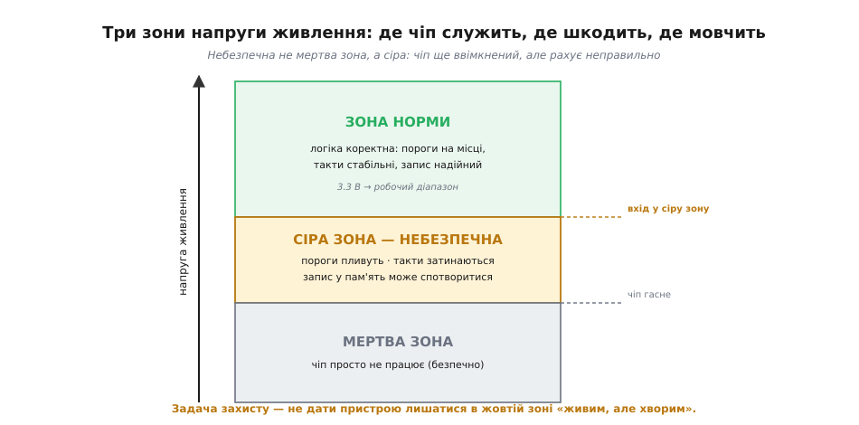
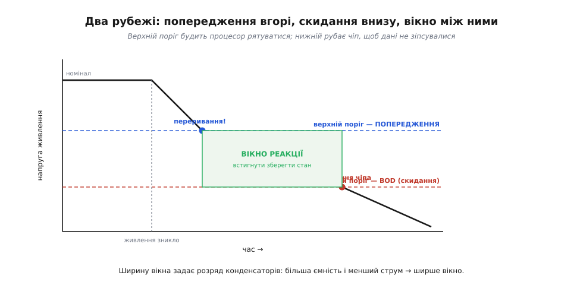
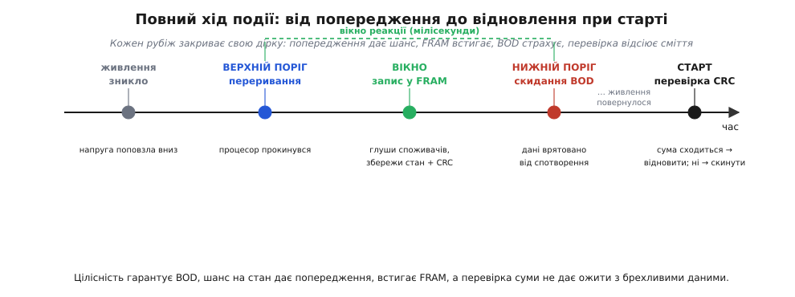

# Захист від зникнення живлення: brown-out і рятування стану

Коли ми розбирали [EEPROM і FRAM](root:embedded/eeprom-fram), наприкінці майнула спокуслива думка: у мить, коли живлення обривається, конденсатори на платі ще тримають заряд кілька мілісекунд, і за це коротке вікно можна **встигнути записати** найважливіше — якщо пам'ять пише швидко. Тоді ми лишили це як перевагу FRAM і пішли далі. Тепер настав час розкрити це повністю, бо «встигнути записати» — то лише півсправи. Сама пам'ять — швидка чи ні — нічого не врятує, якщо мікроконтролер не **дізнається вчасно**, що живлення падає, і не встигне зреагувати, поки ще здатний думати. А коли напруга просідає, перше, що ламається, — це не пам'ять, а сам процесор: він починає рахувати неправильно ще до того, як зовсім зупиниться. І найгірше — він може саме в цю мить щось **писати** в пам'ять, спотворюючи дані напівдорогою.

Тобто питання ширше за «куди зберегти». Воно таке: **як пристрій помічає, що йому от-от стане зле, і встигає або акуратно зберегтися, або хоча б не нашкодити?** Це і є захист від зникнення живлення. Розберімо його по шарах — від того, чому просідання напруги небезпечне саме по собі, до двох рубежів оборони, які ставлять у будь-якому серйозному пристрої.

### Чому падіння напруги небезпечніше за повне вимкнення

На перший погляд дивно: чим обрив живлення гірший за звичайне вимкнення? Адже пристрій просто перестане працювати. Але між «працює нормально» і «знеструмлений» лежить підступна сіра зона — діапазон напруг, де чіп **ще ввімкнений, але вже несправний**. І саме в цій зоні стається лихо.

Згадаймо, чому взагалі цифрова логіка працює. Транзистор у логічному вентилі перемикається, бо напруга на його затворі впевнено перевищує поріг відмикання. Дільники, що задають опорні рівні, тримають правильні пропорції лише за номінальної напруги живлення. Внутрішній генератор тактів коливається на розрахованій частоті, поки його живить стабільна напруга. Усе це — споруда, яка стоїть на одному фундаменті: **на тому, що живлення в нормі**. Прибери фундамент наполовину — і споруда не падає чисто, а **перекошується**.

Що це означає на практиці, коли напруга повзе вниз? Пороги перемикання транзисторів «пливуть», і вентиль, який мав видати чітку одиницю, видає щось проміжне — напругу, яку сусідній вентиль прочитає то як нуль, то як одиницю. Тактовий генератор, недогодований напругою, починає або «затинатися», або взагалі зупиняється — а процесор без тактів завмирає посеред інструкції. Читання з пам'яті повертає спотворені на шляху біти. Якщо в цю мить виконувалася команда запису в нелетку пам'ять — у флеш чи EEPROM піде **напів**записане сміття, яке потім не відрізниш від справжніх даних.

> 🔧 **Навіщо це.** Найнебезпечніший наслідок просідання — не те, що пристрій зупиниться (це якраз нормально), а те, що він **попсує власні дані перед тим, як зупинитися**. Уявіть ваги, що в мить зникнення живлення дописували калібрування: напруга впала на середині запису — і в пам'яті лишилося число-привид, ні старе, ні нове. Наступного ввімкнення прилад бере це сміття за калібрування й бреше. Тому захист від зникнення живлення — це насамперед захист **цілісності даних**, а вже потім — спроба щось зберегти.


*Поки напруга в зеленій зоні, логіка працює правильно. Нижче — жовта «сіра зона»: чіп ще ввімкнений, але пороги пливуть, такти затинаються, запис у пам'ять може спотворитися — найнебезпечніший діапазон. Ще нижче — мертва зона, де чіп просто не працює. Задача захисту: не дати пристрою лишатися в жовтій зоні «живим, але хворим».*

Висновок звідси прямий: лишати чіп працювати в сірій зоні **не можна** — він там не служить, а шкодить. Перший рубіж оборони саме про це: щойно напруга входить у небезпечний діапазон, чіп треба **рішуче спинити** — увести в скидання й тримати там, поки живлення не повернеться до норми. Це робота brown-out detector.

### Перший рубіж: brown-out reset — підлога, нижче якої не працюємо

Назва прийшла з енергетики. **Brown-out** (англ. *brown* — «бурий» + *out*) — це часткове просідання мережі, коли напруга падає, але світло не гасне зовсім: лампи розжарювання тьмяніють до бурого. На противагу **blackout** — повному зникненню. Так само й для чіпа: blackout (повне зникнення живлення) безпечний — чіп просто вимикається; небезпечний саме brown-out — часткове просідання, та сама сіра зона.

**Brown-out detector** (BOD) — крихітний вузол усередині мікроконтролера, чия єдина робота: стежити за напругою живлення й тримати чіп у скиданні, поки вона нижча за безпечний поріг. Усередині це [компаратор](root:hw-analog/comparator) — схема, що порівнює напругу живлення з внутрішнім опорним рівнем і видає одну-єдину відповідь: «вище порога» чи «нижче». Поки живлення вище порога — чіп працює. Щойно напруга проколює поріг униз — BOD миттєво заганяє весь чіп у скидання: процесор спиняється, периферія вимикається, жодна інструкція не виконується. Чіп «засинає мертвим сном» і прокидається, лише коли напруга впевнено повернеться вище порога.

> 🔧 **Навіщо це.** BOD — це **запобіжник проти сірої зони**. Без нього пристрій при просіданні живлення може зависнути в напівживому стані: не працює, але й не скинувся, GPIO в невизначених рівнях, периферія в дивному стані. Класичний симптом «пристрій після кволого живлення поводиться як причинний, допомагає лише повне вимкнення-ввімкнення» — це майже завжди вимкнений або погано налаштований BOD. Увімкнути його — перше, що роблять у будь-якому пристрої, що живиться від батареї чи нестабільної мережі.

Ключова тонкість BOD — **гістерезис** (гр. *hystéresis* — «відставання, запізнення»). Поріг «увімкнути скидання» при падінні й поріг «відпустити зі скидання» при відновленні — **навмисно різні**: відпускає при трохи вищій напрузі, ніж спрацьовує. Навіщо? Уявімо, що порогів немає — один рівень на обидва напрямки. Тоді напруга, яка тремтить рівно біля порога (а так і буває, коли просідання спричинене пусковим струмом мотора чи радіопередавача), змусила б BOD **дрижати**: скинув — відпустив — скинув — відпустив, сотні разів на секунду. Чіп не зміг би ні працювати, ні стояти. Гістерезис розводить два пороги, і тремтіння біля одного не дотягується до другого — перемикання стає чистим, одноразовим.

> 🔧 **Навіщо це.** Гістерезис — універсальний прийом проти «деренчання» на будь-якому порозі, не лише в BOD. Та сама ідея рятує в кнопці (механічне торохтіння контактів), у термостаті (щоб не клацав біля уставки), у компараторі заряду батареї. Запам'ятайте принцип: **поріг увімкнення й поріг вимкнення мають бути різні** — і коливання сигналу біля одного не дістане другого.

На різних родинах BOD налаштовують по-різному, але суть одна — вибрати **поріг**. На 8-бітних AVR (ATmega, ATtiny) поріг зашивають апаратними перемичками-fuse (англ. *fuse* — «запобіжник»; тут — біти конфігурації, що задають при прошиванні): кілька дискретних рівнів на вибір, наприклад 1.8, 2.7 чи 4.3 В. На ESP32 рівень обирають у конфігурації збірки прошивки (`CONFIG_ESP_BROWNOUT_DET_LVL_SEL`), і за замовчуванням BOD увімкнений. На STM32 цей вузол зветься трохи інакше й уміє більше — про нього в наступному розділі, бо саме він відкриває другий рубіж оборони.

Поріг вибирають **не наосліп**. Він має лежати **нижче** мінімальної робочої напруги чіпа (інакше BOD скидатиме справний пристрій при кожному легкому просіданні) — але **вище** тієї напруги, за якої логіка вже починає брехати (інакше чіп встигне попсувати дані ще до скидання). Тобто поріг ставлять у верхню частину сірої зони: щойно напруга в неї входить — рубаємо, не чекаючи, поки стане зовсім зле.

**Приклад (вибір порога BOD).** Маємо мікроконтролер, що працює від 2.0 до 3.6 В, а в даташиті сказано, що логіка гарантовано коректна аж до 1.9 В. Який поріг BOD обрати з дискретного набору {1.8, 2.4, 2.9} В?

```
робочий діапазон чіпа:        2.0 ... 3.6 В
логіка гарантована до:        1.9 В   (нижче — сіра зона)
номінальне живлення:          3.3 В

поріг BOD має бути:  нижче 2.0 В (не чіпати норму)
                     вище 1.9 В (рубати ДО сірої зони)

кандидат 1.8 В → нижче 1.9 → чіп уже в сірій зоні, коли BOD спрацює  ✗
кандидат 2.4 В → вище 2.0 → BOD скидатиме при робочій напрузі       ✗
кандидат 2.9 В → ще гірше                                            ✗
```

Тут жоден дискретний поріг не лягає в потрібну щілину 1.9–2.0 В — вона надто вузька. Це реальна ситуація, і вихід із неї — або взяти чіп із тоншою сіткою порогів, або поставити **зовнішній** наглядач напруги з точним порогом. Якби щілина була ширшою (скажімо, логіка гарантована до 1.7 В), поріг 1.8 В сів би ідеально: рубає при 1.8 В — вище за 1.7, де починається брехня, і нижче за 2.0, де ще норма.

BOD рятує цілісність: він не дає чіпові шкодити в сірій зоні. Але зверніть увагу, чого він **не** робить. Він спиняє чіп — **різко, без попередження**. Процесор просто завмирає посеред роботи, нічого не встигнувши зберегти. Якщо нам треба не лише «не нашкодити», а ще й **врятувати стан** — записати лічильники, поточні дані, місце, де нас перервали, — то самого BOD замало. Потрібен другий рубіж: попередження **заздалегідь**.

### Другий рубіж: раннє попередження — вікно, щоб устигнути врятуватися

Уся ідея рятування стану тримається на одному фізичному факті: **напруга падає не миттєво**. Коли від плати від'єднують джерело, живлення тримають конденсатори — і фільтрувальні на вході, і ті, що по платі розв'язують [споживання кожної мікросхеми](root:embedded/board-consumption). Заряд із них витікає поступово, поки споживачі його з'їдають. Між миттю «живлення зникло» і миттю «напруга впала до порога BOD» минає **проміжок** — і він не нульовий. Це і є наше вікно.

Скільки воно триває, диктує проста фізика конденсатора. Струм, що витікає з нього, пов'язаний зі швидкістю падіння напруги:

```
i = C · (dV/dt)

звідки швидкість падіння:   dV/dt = i / C
```

Чим **більша ємність** C і чим **менший струм** споживання i, тим повільніше падає напруга — тим **ширше вікно**. Це дає нам прямий важіль: хочемо більше часу на рятування — ставимо більший фільтрувальний конденсатор на вході або зменшуємо споживання в мить тривоги. Ось, до речі, чому слова з теми про FRAM — «конденсатори ще тримають заряд кілька мілісекунд» — це не випадковість, а наслідок цієї формули.

Але вікно саме по собі марне, якщо ми про нього не дізнаємося **на початку**, а не в кінці. BOD спрацьовує в **кінці** вікна — коли вже пізно щось робити. Нам потрібен інший наглядач, що крикне «тривога!» на **початку** падіння, лишивши все вікно на реакцію. Цей механізм зветься **раннім попередженням про зникнення живлення** (англ. *power-fail warning*), і влаштований він знов-таки на компараторі — але з **вищим** порогом, ніж у BOD.

Ідея — два пороги, рознесені по висоті. Розгляньмо їх разом, бо саме їхня різниця й творить вікно:

- **Верхній поріг — попередження.** Спрацьовує рано, коли напруга лише почала падати, але ще цілком у робочій зоні. Не скидає чіп — навпаки, генерує **переривання**, негайно смикаючи процесор: «кидай усе, рятуй стан, у тебе лічені мілісекунди».
- **Нижній поріг — BOD, скидання.** Спрацьовує пізніше, на дні, коли напруга вже на межі сірої зони. Рубає чіп, бо далі працювати небезпечно.

Між цими двома порогами й живе вікно реакції. Тривога піднялася вгорі — у процесора є весь час, поки напруга повзе від верхнього порога до нижнього, щоб зробити найважливіше. Дійшло до нижнього — BOD рятує цілісність, обриваючи все.


*Живлення зникло — напруга поповзла вниз по розряду конденсаторів. На верхньому порозі спрацьовує раннє попередження: переривання будить процесор зберігати стан. Поки напруга йде до нижнього порога, триває вікно реакції — ті мілісекунди, за які треба встигнути записати найважливіше. На нижньому порозі BOD рубає чіп, рятуючи дані від спотворення. Ширину вікна задає ємність конденсаторів і споживання.*

> 🔧 **Навіщо це.** Два пороги — це поділ праці між «рятуй» і «не шкодь». Верхній (попередження) дає **шанс** зберегтися, але не гарантує — раптом вікно виявиться надто вузьким. Нижній (BOD) **гарантує**, що навіть якщо зберегтися не встигли, дані не зіпсуються. Тому надійний пристрій ставить **обидва**: розраховує на верхній, але страхується нижнім. Покладатися лише на попередження — ризиковано (а раптом не встигли?); лише на BOD — означає щоразу втрачати стан.

Звідки беруть верхній поріг? Є два шляхи. Перший — **усередині мікроконтролера**: багато сучасних чіпів мають вбудований програмований детектор напруги. На STM32 це **PVD** (англ. *Programmable Voltage Detector* — «програмований детектор напруги»): задаєш йому поріг трохи нижчий за номінал, вмикаєш переривання — і чіп сам смикне обробник, щойно живлення просяде до цього рівня. PVD і BOD на STM32 працюють у парі: PVD — верхній поріг (попередження), вбудований скидання — нижній.

Другий шлях — **зовнішня мікросхема-наглядач** (англ. *voltage supervisor*, наглядач напруги; інша назва — *power-fail comparator*). Це окремий крихітний чіп, що стежить за напругою точніше за вбудовані вузли й має вихід-сигнал «живлення падає», який заводять на ногу переривання процесора. Такі наглядачі вміють давати **немасковане переривання** (NMI, англ. *Non-Maskable Interrupt* — переривання, яке процесор не може відкласти чи проігнорувати) — щоб сигнал тривоги прорвався навіть крізь зайнятий критичною секцією код. Окремий наглядач беруть, коли потрібен дуже точний поріг або коли стежити треба за напругою **до** регулятора живлення — там просідання видно раніше, ніж на виході регулятора.

### Що саме робити у вікні: код рятування

Отже, переривання-попередження спрацювало. Процесор опинився в обробнику, а годинник цокає: напруга падає, вікно зачиняється. Що писати в цьому обробнику — і, головне, чого **не** писати?

Перше правило: **робити мінімум**. Вікно — це мілісекунди, а то й менше. У ньому немає часу на гарне завершення всіх справ — тільки на найголовніше. Тому ще на етапі проєктування виділяють **критичний стан** — той кістяк даних, без якого пристрій не зможе коректно ожити: поточні лічильники, незбережені виміри, позиція в довгій операції, прапорець «мене перервали тут». Усе інше — почекає або відновиться саме.

Друге правило диктує те, **куди** писати. Згадаймо різницю пам'ятей із попереднього кроку. EEPROM пише байт **мілісекунди** — а все наше вікно може бути кілька мілісекунд. Записати в EEPROM десяток байтів у мить тривоги часто **не встигнути**: напруга впаде раніше, і запис обірветься на середині — той самий привид. Ось чому FRAM тут незрівнянна: вона пише за **наносекунди**, тож устигає зберегти весь критичний стан багатократно швидше, ніж вікно зачиниться. Якщо в пристрої передбачено рятування стану при зникненні живлення — нелеткою пам'яттю майже завжди беруть [FRAM](root:embedded/eeprom-fram), а не EEPROM, саме через швидкість запису.

Покажемо кістяк обробника. Нехай у нас STM32 з PVD, а критичний стан — кілька чисел, які ми тримаємо у FRAM на шині:

```c
// Критичний стан, який треба врятувати при зникненні живлення
typedef struct {
    uint32_t magic;        // мітка «дані справжні» (перевіримо при старті)
    uint32_t work_counter; // лічильник напрацювання
    int32_t  last_value;   // останній вимір
    uint16_t op_position;  // де нас перервали в довгій операції
    uint16_t crc;          // контрольна сума решти полів
} CriticalState;

static volatile CriticalState g_state;   // живе в RAM, оновлюється на ходу

// Переривання PVD: напруга просіла до верхнього порога — РЯТУЄМОСЯ
void PVD_IRQHandler(void)
{
    // 1. Негайно вимкнути все, що жере струм і час:
    //    зупинити мотори, погасити дисплей, заглушити радіо.
    //    Менше споживання → повільніше падає напруга → ширше вікно.
    motors_emergency_stop();
    display_off();
    radio_off();

    // 2. Дорахувати контрольну суму й записати стан у FRAM.
    //    FRAM пише за наносекунди — встигаємо, поки тримають конденсатори.
    g_state.magic = STATE_MAGIC;
    g_state.crc   = crc16((const uint8_t *)&g_state,
                          offsetof(CriticalState, crc));
    fram_write(FRAM_STATE_ADDR, (const uint8_t *)&g_state, sizeof g_state);

    // 3. Більше нічого не починаємо. Якщо живлення повернеться —
    //    нас або скине BOD, або ми просто продовжимо. Якщо ні —
    //    стан уже в безпеці.
    pwr_clear_pvd_flag();   // зняти прапорець переривання
}
```

Зверніть увагу на порядок дій. **Спершу** глушимо ненажерливих споживачів — і не лише щоб менше шкодили, а й щоб **подовжити власне вікно**: менший струм i за тією самою формулою `dV/dt = i / C` означає повільніше падіння напруги, тобто більше часу на сам запис. Лише **потім** пишемо стан. І принципово — **нічого не починаємо наново**: жодних нових довгих операцій, жодних записів у повільну флеш. Мета обробника — швидко зафіксувати критичне й завмерти.

Третє правило стосується **цілісності самого запису**. А раптом вікно виявилося надто вузьким і живлення впало **посеред** нашого рятувального запису? Тоді у FRAM ляже напівзбережений стан — і при наступному старті ми приймемо сміття за правду. Захист від цього — **контрольна сума** (CRC) і **мітка справжності** (magic). При старті пристрій читає збережений стан і перевіряє: чи на місці мітка, чи сходиться контрольна сума. Сходиться — стан цілий, відновлюємося з нього. Не сходиться — запис обірвався, стан ушкоджений, починаємо з безпечних значень за замовчуванням.

```c
// Старт після ввімкнення: чи можна довіряти збереженому стану?
void restore_state_on_boot(void)
{
    CriticalState s;
    fram_read(FRAM_STATE_ADDR, (uint8_t *)&s, sizeof s);

    uint16_t crc = crc16((const uint8_t *)&s, offsetof(CriticalState, crc));

    if (s.magic == STATE_MAGIC && crc == s.crc) {
        g_state = s;             // стан цілий — продовжуємо з нього
    } else {
        load_defaults(&g_state); // стан ушкоджений — безпечні значення
    }
}
```

Ця пара «зберегти з контрольною сумою / перевірити при старті» — серце всієї схеми. Вона перетворює рятування з **надії** на **гарантію коректності**: навіть якщо рятувальний запис не встиг завершитися, пристрій не оживе з отруєними даними — він просто помітить ушкодження й почне чисто. Краще втратити останній стан, ніж відновитися з брехливого.

### Як це збирається докупи

Зведімо три механізми в одну картину, бо разом вони й дають захист, якого жоден поодинці не дає.

**Цілісність даних** забезпечує brown-out reset: він рубає чіп, щойно напруга входить у небезпечну сіру зону, не даючи процесору псувати пам'ять напіврозрахованими записами. Це нижній рубіж, остання гарантія — навіть якщо все інше не спрацювало, дані не зіпсуються.

**Шанс урятувати стан** дає раннє попередження — детектор із вищим порогом (вбудований PVD чи зовнішній наглядач), що генерує переривання на **початку** падіння напруги. Воно відкриває вікно реакції, поки напругу ще тримають конденсатори.

**Власне рятування** робить швидка нелетка пам'ять (FRAM) разом із дисциплінованим обробником: глуши споживачів, запиши критичний кістяк, захисти його контрольною сумою — і при старті відновлюйся, лише якщо сума сходиться.


*Повний хід події. Живлення зникло — напруга поповзла вниз. Верхній поріг: спрацьовує попередження, переривання будить процесор. Вікно рятування: глушимо споживачів, пишемо критичний стан у FRAM під контрольною сумою. Нижній поріг: BOD скидає чіп, рятуючи дані від спотворення. Живлення повернулося: при старті читаємо стан, перевіряємо суму — цілий відновлюємо, ушкоджений відкидаємо. Кожен рубіж закриває свою дірку.*

Скільки цих рубежів ставити — залежить від пристрою, і це інженерний вибір, а не закон. Простому пристрою, якому байдуже до миттєвого стану (термометр, що щосекунди наново міряє температуру), вистачить **самого BOD** — аби не псував налаштування при кволому живленні. Пристрою, що веде важливий лічильник чи довгу операцію (лічильник енергії, дозатор, керування процесом), потрібні **всі три** рубежі: попередження, FRAM, перевірка при старті. Чим дорожче втратити стан — тим більше шарів захисту виправдано.

> 🔧 **Навіщо це.** Це типове рішення, яке приймають **на старті проєкту**, а не латають потім. Запитайте про свій пристрій три речі. Перше: *що станеться, якщо живлення обірветься в найгірший момент?* Якщо відповідь «зіпсуються збережені дані» — обов'язковий BOD. Друге: *чи є стан, який боляче втратити?* Якщо так — потрібні раннє попередження і швидка пам'ять для рятування. Третє: *скільки в мене вікно?* Порахуйте за `dV/dt = i / C`, і якщо вікно тісне — або збільшіть вхідний конденсатор, або беріть FRAM замість EEPROM, або глушіть споживачів першою дією. Закласти ці рубежі коштує копійки на етапі схеми; додати їх у вже зроблений пристрій після того, як він «іноді втрачає дані», — дорого й болісно.

---

Отже, зникнення живлення небезпечне не самим вимкненням, а **сірою зоною** дорогою до нього — діапазоном, де чіп ще ввімкнений, але рахує неправильно й може попсувати власні дані напіврозрахованим записом. Захист будують двома рубежами. Нижній — **brown-out reset**: компаратор із гістерезисом, що рішуче скидає чіп, щойно напруга входить у небезпечну зону, гарантуючи **цілісність даних**; поріг ставлять у верхню частину сірої зони — нижче робочої напруги, але вище тієї, за якої логіка вже бреше. Верхній — **раннє попередження** (вбудований детектор на кшталт STM32 PVD або зовнішній наглядач напруги): компаратор із вищим порогом, що на **початку** падіння генерує переривання й відкриває **вікно реакції**, поки напругу тримають конденсатори. Ширину вікна задає фізика розряду `dV/dt = i / C` — більша ємність і менший струм означають більше часу. У вікні обробник глушить ненажерливих споживачів (подовжуючи саме вікно), записує **критичний стан** у швидку нелетку пам'ять — майже завжди [FRAM](root:embedded/eeprom-fram), бо EEPROM зі своїми мілісекундами на байт не встигає, — і захищає запис **контрольною сумою**, щоб при наступному старті відновитися, лише коли сума сходиться, а ушкоджений запис відкинути. Разом ці рубежі перетворюють раптову «смерть» пристрою на акуратне, передбачуване збереження — і це рішення закладають на старті проєкту, бо додати його потім незрівнянно дорожче.
