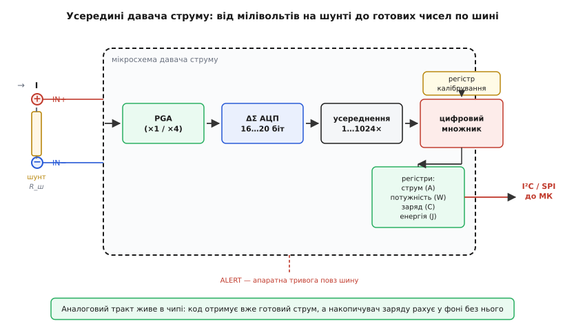
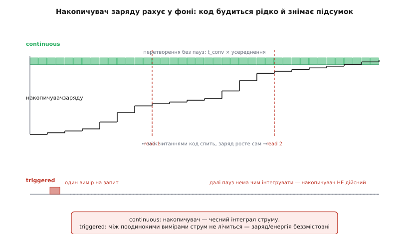

# 🔌 Давач струму з цифровим виходом

У [статті про логер](root:embedded/power-logger) ми вирішили, що пристрій має сам інтегрувати власний струм у заряд і складати підсумок у журнал. І там же майнула спокуслива думка: а що, як саме інтегрування зняти з мікроконтролера й віддати окремому чипу? Ця вставка — про цілий клас мікросхем, які роблять саме це. Вони беруть на себе весь аналоговий тракт вимірювання струму, оцифровують його власним АЦП і віддають мікроконтролеру **готове число** по шині I²C чи SPI — а кращі з них ще й тримають **апаратний накопичувач заряду**, що рахує кулони у фоні, поки код спить.

Розберімо цей клас від обв'язки до першого прочитаного байта, з усіма його зручностями й пастками — і відмежуймо те, що однакове в будь-якого виробника, від конкретних номерів, які лишаємо на потім.

## Що це за клас

[Монітор струму на шунті](topic:electronics/current-monitor) у чистому вигляді — це аналоговий вузол: шунт перекладає струм на крихітну напругу, диференційний підсилювач піднімає її до притомного рівня, а далі ця напруга йде кудись на АЦП. У класичній схемі тим АЦП був вхід мікроконтролера — з усіма його клопотами: скромна роздільність, дрейф опорної напруги, потреба самому писати калібрування й перетворювати відліки на ампери.

> Монітор струму перекладає струм на напругу: увесь струм тече крізь малий шунт R_ш і за законом Ома лишає на ньому спад V = I·R (одиниці-десятки мВ), який далі підсилюють і міряють. Шунт беруть малим (міліоми), щоб він майже не заважав колу; точні шунти під'єднують чотирма виводами (Кельвін), щоб опір підвідних доріжок не спотворював результат. Висока сторона (шунт у плюсі) бачить струм і коротке на землю, але вимагає підсилювача з великою синфазною напругою; низька (шунт у землі) простіша, та піднімає «землю» навантаження над нулем. Деталі — у [моніторі струму](topic:electronics/current-monitor).

**Цифровий давач струму** (англ. *digital current-sense amplifier*, ширше — *current/power/energy monitor IC*) інтегрує весь цей тракт в один корпус: підсилювач, АЦП, цифрову логіку перетворення й шинний інтерфейс. Зовні в нього всього два «силові» виводи на шунт (IN+ і IN−) та кілька цифрових ліній шини — а всередині код отримує вже не сирий відлік, а **число у фізичних одиницях**: струм в амперах, напругу на шині у вольтах, часто й потужність у ватах. Уся арифметика — масштабування, множення напруги на струм — зроблена в залізі.

> 🔧 **Навіщо це.** Згадаймо головний клопіт логера: струм пристрою гуляє на чотири-сім порядків — від мікроамперів сну до сотень міліамперів передачі, — і скромному вбудованому АЦП однієї шкали на це безнадійно мало. Спеціалізований чип знімає це одним махом: його ΔΣ-АЦП на 16–20 біт перекриває величезний розмах без перемикання діапазонів, а калібрування й перетворення вже всередині. Замість «зняти мілівольти, підсилити, оцифрувати, відняти зміщення, помножити на коефіцієнт» код робить одне: прочитати регістр струму. Менше коду — менше місць помилитися.

## Як це влаштовано: блок-схема

Усередині чипа сигнал іде послідовним трактом, і кожна ланка прибирає одну з морок, які в саморобці лягли б на код.



*Аналоговий тракт цілком живе в чипі: PGA піднімає мілівольти з шунта, ΔΣ-АЦП оцифровує, блок усереднення згладжує шум, цифровий множник із регістром калібрування переводить відлік прямо в ампери й вати. Код читає вже готові регістри по шині; накопичувач заряду рахує у фоні без його участі, а пін ALERT сигналить про подію повз шину.*

**Програмований підсилювач (PGA)** приймає різницю IN+ − IN− і піднімає її. У простіших чипах коефіцієнт фіксований; у точніших він перемикається (скажімо, ×1 або ×4) — це і є вибір **діапазону вхідної напруги**: вузький діапазон дає кращу роздільність на малих струмах, широкий — більший запас до насичення на піках. Підсилювач тут диференційний саме тому, що обидва кінці шунта можуть «висіти» високо над землею (про це — нижче, коли дійдемо до синфазної напруги).

**Дельта-сигма АЦП** (ΔΣ) — серце цифрової частини. Він не робить миттєвого знімка, як АЦП послідовного наближення; натомість він безперервно набирає вибірку за визначений **час перетворення** й видає усереднений за цей час результат. Така архітектура дає високу роздільність (16, а в кращих представниках 20 біт) ціною часу — і саме вона дозволяє одній шкалі перекрити весь діапазон струмів логера. Чому ΔΣ так влаштований і чим відрізняється від інших АЦП — у [типах АЦП](topic:electronics/adc-types).

**Блок усереднення** складає кілька готових перетворень в одне число. Це другий, грубіший рівень згладжування поверх самого ΔΣ: усереднити 64 чи 256 відліків означає притиснути випадковий шум, але й сповільнити віддачу свіжого результату. Тут лежить прямий компроміс, до якого ми ще повернемося в налаштуваннях.

**Цифровий множник** — те, заради чого клас і назвали «power monitor». Маючи на руках і струм (зі спаду на шунті), і напругу на шині, чип перемножує їх у залізі й кладе в регістр **готову потужність**. Найважливіша деталь тут — **регістр калібрування**: одне число, в яке зашито, скільки ампер припадає на один молодший біт АЦП за вашого конкретного шунта. Запишеш його раз при старті — і далі чип сам віддає регістр струму вже в амперах, без жодного множення в коді.

**Регістри-результати** — те, що читає мікроконтролер: струм, напруга, потужність, а в накопичувальних чипах ще заряд і енергія. **Шина** (I²C або SPI) — єдиний канал, яким код спілкується з чипом: усе налаштування й усі результати — це читання-запис регістрів за адресами.

**Пін ALERT** стоїть осторонь тракту, і недарма: це апаратна тривога **повз шину**. Чип сам стежить за заданим порогом і смикає цей вивід, щойно струм (чи напруга, потужність, температура) вийшов за межу — мікроконтролер дізнається про подію перериванням, не опитуючи регістри в циклі. Для логера на батареї це золото: можна спати й прокидатися лише на тривогу.

## Типова розпіновка

Партномери різні, корпуси теж, але функційний склад виводів у класі повторюється — бо випливає з блок-схеми. Подумки чип ділиться на три групи виводів.

**Силова пара — IN+ і IN−.** Це два входи диференційного підсилювача, і фізично вони чіпляються до **двох кінців шунта**. «Силові» — умовно: самі по собі вони майже не проводять струму (вхід підсилювача високоомний), струм тече крізь шунт повз чип. Їхнє завдання — зняти спад напруги з шунта, тому розводять їх як [кельвінову пару](topic:electronics/kelvin-shunt): окремі тонкі доріжки прямо з виводів шунта, щоб падіння на товстих силових доріжках не домішалося до виміру.

**Живлення чипа — VS (або VDD) і GND.** Сам чип треба живити, зазвичай від тих же 3.3 чи 5 В, що й логіка. Важливо: це живлення **окреме** від кола, струм якого міряють. Чип на низьковольтному живленні може при цьому міряти струм у колі з куди вищою напругою — це й дозволяє його диференційний вхід з великим синфазним діапазоном.

**Цифрові виводи шини.** Для I²C це SCL (такт), SDA (дані) і кілька **адресних виводів** — притягуючи їх до живлення чи землі, задають молодші біти адреси, тож на одній шині уживаються кілька однакових чипів (різні гілки живлення — різні монітори). Для SPI це SCLK, MOSI, MISO й CS (вибір кристала). І майже завжди є **ALERT** — згаданий вивід тривоги.

Більшого й не треба: два виводи на шунт, два на живлення, жменя на шину. Уся складність — усередині, у регістрах.

## Підключення: куди врізати шунт

Шунт стоїть у розриві кола послідовно з навантаженням — але коло має два проводи, і вибір, у який врізати чип, не косметичний.

**Висока сторона** (англ. *high-side*) — шунт у плюсовому проводі, між джерелом і навантаженням. Обидва його кінці підняті майже до повної напруги живлення, тож підсилювач чипа мусить зносити велику **синфазну напругу** (англ. *common-mode voltage*) — те спільне, що «висить» на обох входах над землею. Зате високосторонній монітор бачить **усе**: і робочий струм навантаження, і коротке замикання навантаження на землю (бо струм короткого тече крізь той самий шунт). Земля навантаження при цьому лишається справжнім нулем системи — і це часто вирішальне.

**Низька сторона** (англ. *low-side*) — шунт між навантаженням і землею. Обидва кінці сидять біля нуля, синфазна напруга мала, підсилювач простіший. Розплата: «земля» навантаження тепер піднята над нулем системи на спад шунта, і коротке навантаження на справжню землю в обхід шунта монітор не побачить.

> 🔧 **Навіщо це.** Для логера споживання вибір зазвичай очевидний — **висока сторона**. Логер міряє, скільки тягне весь пристрій від батареї, тож шунт ставлять у плюс батареї одразу на вході, і чип бачить сумарний струм усіх вузлів із спільною, незрушеною землею. Низьку сторону беруть, коли висока синфазна напруга чипу не по зубах або коли земля навантаження все одно ізольована.

Тут і впирається ключове паспортне число чипа — **діапазон синфазної напруги**. Він каже, до якої напруги в колі можна піднімати входи IN+/IN−, не спаливши чип і не втративши точність. У цьому й сила класу: гарний монітор живиться від 3.3 В, а синфазну тримає до десятків вольтів — тобто живиться від логіки, а міряє струм у силовому колі. Друге паспортне число — **повна шкала вхідної напруги** (англ. *full-scale shunt voltage*): максимальний спад на шунті, який чип ще оцифрує. Вона прямо диктує вибір шунта: спад при піковому струмі (V = I·R) має лягти в цю шкалу з запасом, інакше пік зріжеться.

**Який шунт обрати під логер.** Два числа тягнуть у різні боки. Малий опір шунта менше краде напруги в пристрою (менший спад — менший ризик просадити живлення на піку) і менше гріється; але він же робить корисний сигнал крихітним, і на струмах сну спад потоне в шумі. Великий опір дає гарний сигнал на малих струмах, та на піку передачі його спад може вилізти за повну шкалу й перегріти сам шунт. Вибирають так, щоб спад при **максимальному** струмі сів близько до верху повної шкали, — тоді весь діапазон АЦП працює на вас. Як саме рахувати цей компроміс під розмах від нА до А — у [математиці динамічного діапазону](root:embedded/measure-consumption/math-dynamic-range.md).

## Налаштування: час, усереднення, калібрування

Перш ніж читати струм, чип треба налаштувати — записати кілька конфігураційних регістрів. Три з них визначають усе.

**Час перетворення** (англ. *conversion time*) — скільки ΔΣ-АЦП набирає одну вибірку. Типово його обирають із ряду від десятків мікросекунд до кількох мілісекунд (у поширених чипах — приблизно від 50 мкс до 4 мс на канал). Довший час — менше шуму й більше ефективних бітів, але рідша віддача результату й більше спожитого заряду самим чипом. Короткий час ловить швидкі піки, та галасливіший.

**Усереднення** (англ. *averaging*) — скільки готових перетворень чип складе в одне число, перш ніж оновити регістр. Ряд зазвичай степеневий: 1, 4, 16, 64 … до 1024 разів. Усереднення множить ефективний час виміру: усереднити 64 відліки по 1 мс — це 64 мс на одне число. Притискає шум воно сильно, але робить чип повільним і ненажерливим.

Ці два параметри разом задають **темп** і **тишу** виміру, і це прямий компроміс:

```text
Період одного результату ≈ (час одного перетворення) × (число усереднень)

  приклад A — швидко, для лову піків:
    1 канал × 140 мкс × 1     ≈ 0.14 мс на результат
  приклад Б — тихо, для рівного фону сну:
    1 канал × 1.1 мс  × 64    ≈ 70 мс на результат
```

> 🔧 **Навіщо це.** Для логера ці регістри — головний важіль. Ловиш короткий пік передачі — бери малий час і мале усереднення, щоб результат оновлювався частіше за тривалість піка. Міряєш рівний мікроамперний фон сну — навпаки, дай довгий час і сильне усереднення: шум ΔΣ на малому сигналі інакше з'їсть молодші біти. Один профіль не накриває обидва режими ідеально — і саме тому далі такий цінний апаратний накопичувач, який збирає заряд незалежно від того, як ти налаштував віддачу миттєвого числа.

**Регістр калібрування** — окрема історія, і саме він робить читання струму однорядковим. Сам АЦП міряє напругу на шунті в умовних молодших бітах. Щоб чип віддавав одразу ампери, йому треба сказати ціну біта — скільки струму припадає на один крок АЦП за **вашого** шунта. Це число обчислюють раз із трьох даних: повної шкали АЦП, опору шунта й бажаної роздільності струму, — і записують у регістр калібрування при старті.

```text
Що зашито в регістр калібрування (загальна ідея, без номерів):
  крок струму  =  максимальний струм  /  число рівнів АЦП
  калібрування =  стала чипа  /  (крок струму × R_шунта)

Записав калібрування один раз →
  регістр струму     читається одразу в амперах
  регістр потужності читається одразу у ватах (чип сам перемножив)
```

Поки калібрування не записане, регістри струму й потужності тримають нулі — бо чип не знає, на що множити сирий відлік. Це частий «чому нічого не працює» на старті: напругу на шині й сирий спад на шунті чип віддає одразу, а от струм і потужність мовчать нулями, доки не покладеш калібрування. Запис калібрування — обов'язковий крок ініціалізації, не опція.

## Ключова риса: апаратний накопичувач заряду й енергії

Ось те, заради чого цей клас узагалі згадано в логері. Кращі представники мають усередині не лише регістри миттєвих величин, а й **накопичувачі** — регістри, що **самі додають** кожне нове перетворення до суми. Накопичувач заряду інтегрує струм за часом (Σ I·Δt — ті самі кулони), накопичувач енергії інтегрує потужність (Σ P·Δt — джоулі). І роблять вони це **у фоні, без жодної інструкції коду**: чип перетворює, множить, додає до суми — і так безперервно, поки живиться.



*У безперервному (continuous) режимі чип перетворює без пауз, а накопичувач росте сходинками сам; код будиться лише зрідка (read 1, read 2) і знімає підсумок — між читаннями заряд лічиться без нього. У triggered-режимі чип робить один вимір на запит, між запитами інтегрувати нема чого — тож заряд і енергія беззмістовні.*

Згадаймо, що логер затівався саме заради [підрахунку кулонів](root:embedded/power-logger/proj-coulomb-counter.md) — безперервного інтегрування струму в заряд без втрати коротких піків. У саморобному варіанті це робить мікроконтролер: будиться по таймеру, читає струм, множить на крок часу, додає до суми. Тут усе це робить залізо. Мікроконтролер може спати хвилинами, а накопичувач тим часом чесно збирає заряд кожні кілька мілісекунд. Прокинувся код — прочитав накопичувач — записав підсумок у [кільце у Flash](topic:programming/flash-internals) — обнулив (чи врахував переповнення) — і знову спати. Найгарячіша, найчастіша частина роботи логера знята з процесора повністю.

Це міняє енергетику самого логера. Без накопичувача процесор мусив би прокидатися десятки разів на секунду — кожне прокидання коштує заряду, і вимірювач легко з'їв би більше, ніж міряє. З накопичувачем процесор будиться раз на хвилину, а інтегрування йде в залізі за частку того струму. Спостерігацька пастка «прилад псує те, що міряє», про яку йшлося в [основній статті логера](root:embedded/power-logger), від цього не зникає, але сильно слабшає.

### Пастки накопичувача

За цю розкіш доводиться платити уважністю — і ось де найлегше обпектися.

**Накопичувач дійсний лише в безперервному режимі.** Чип уміє два режими роботи: continuous (перетворює без пауз) і triggered (один вимір на команду, далі тиша до наступної команди). Накопичувач має сенс **тільки в continuous**: він інтегрує струм за реальним часом, а інтеграл вимагає неперервності. У triggered-режимі між поодинокими вимірами струм просто не лічиться — у проміжках чип спить, інтегрувати нема чого, — тож регістри заряду й енергії в цьому режимі **беззмістовні**. Класична помилка: перевести чип у triggered заради економії, а потім читати накопичувач і дивуватися заниженим кулонам. Хочеш накопичувач — тримай continuous; хочеш triggered заради сну чипа — рахуй заряд сам у коді.

**Накопичувач переповнюється.** Сума росте безперервно, і регістр, хай навіть широкий, колись заповниться по вінця. У гарних чипах це не катастрофа: є **прапорець переповнення** (окремий біт для заряду й для енергії), а сам регістр при переповненні перекидається через нуль і рахує далі. Обов'язок коду — читати накопичувач **досить часто, щоб не проґавити переповнення**, або стежити за прапорцем і дораховувати повні оберти. Проґавив переповнення між двома рідкісними читаннями — втратив цілий «оберт» заряду, і журнал тихо занизить споживання. Для логера це задає **стелю інтервалу** прокидання: спати можна довго, але не довше, ніж накопичувач устигне переповнитися на робочому струмі.

**Пін ALERT теж треба зрозуміти правильно.** Він сигналить про вихід за поріг — але налаштувати його треба свідомо: на що саме реагувати (струм, напруга, потужність, готовність нового перетворення, переповнення), яким рівнем активний, тримається він до прочитання статусу чи сам відпускає. Для логера ALERT часто чіпляють на переповнення накопичувача або на поріг струму «пристрій застряг в активному режимі» — тоді код спить, а апаратура будить його рівно на подію. Невірно налаштований ALERT або тихо мовчить, або, навпаки, торохтить без упину, тримаючи процесор у тонусі замість сну.

**Власний струм спокою чипа — теж стаття бюджету.** Цифровий монітор не безкоштовний: у роботі він тягне постійно, типово **сотні мікроамперів** (порядок — пара сотень мкА у поширених чипів), бо всередині крутиться ΔΣ-АЦП, опорне джерело й логіка. На пристрої, де весь бюджет сну — десятки мікроамперів, постійні сотні мікроамперів монітора **переважать** корисне споживання, і журнал чесно покаже завищене число, в якому винен сам вимірювач. Боротися двома ходами: або вмикати чип у глибокий сон між вимірами (тоді він тягне одиниці мкА — але прощавай, фоновий накопичувач), або врахувати його споживання окремою статтею бюджету від початку. Звідси й порада з основної статті: у серійний продукт постійний логер часто не ставлять — лишають посадкове місце й вмикають лише на час польових випробувань.

## «Перший байт»: від нуля до числа струму

Покрокова послідовність, як оживити такий чип і прочитати з нього перше осмислене число — однакова для майже будь-якого представника класу.

1. **Знайти чип на шині.** Для I²C — переконатися, що чип відповідає на своїй адресі (її задають адресні виводи). Найнадійніший перший крок — прочитати **регістр ідентифікації** (виробник зашиває туди сталий код): збігся — шина й адреса в порядку, можна йти далі.
2. **Налаштувати АЦП.** Записати конфігураційний регістр: час перетворення, число усереднень, режим **continuous** (для логера — обов'язково, бо потрібен накопичувач). Тут ви обираєте темп проти тиші під свою задачу.
3. **Записати калібрування.** Обчислити число з повної шкали, опору шунта й бажаної роздільності струму — і покласти в регістр калібрування. Без цього кроку струм і потужність читатимуться нулями.
4. **Дочекатися першого перетворення** й прочитати **регістр струму**. Якщо число розумне — тракт працює: шунт, з'єднання, калібрування зійшлися.
5. **(Для логера) увімкнути накопичувач** — у continuous він уже рахує; лишається періодично читати регістр заряду й енергії та зводити баланс, стежачи за прапорцем переповнення.

«Ага-момент» настає на кроці 4: число, що раніше було здогадом, з'являється у фізичних одиницях — ампери прямо з регістра, без жодного множення. А на кроці 5 додається головне для логера: можна закрити очі коду на хвилину, а прокинувшись, побачити в накопичувачі весь заряд, що протік за цей час, — рівно той інтеграл площі, що єдиний чесно міряє автономність.

## Типові граблі класу

- **Забули калібрування — струм нуль.** Найчастіший старт «нічого не міряє»: напруга на шині є, сирий спад є, а струм і потужність — нулі, бо чип не знає ціни біта. Лікується одним записом у регістр калібрування.
- **Triggered убиває накопичувач.** Перевели чип у режим одиничних вимірів заради економії — і заряд/енергія стали беззмістовними. Накопичувач живе лише в continuous.
- **Проґавлене переповнення накопичувача.** Рідкісні читання економлять заряд, але якщо між ними сума перекинулася через нуль непоміченою, журнал занизить споживання на цілий оберт. Або читати частіше за період переповнення, або стежити за прапорцем.
- **Власні сотні мкА монітора в бюджеті сну.** На low-power пристрої вимірювач легко з'їдає більше, ніж міряє. Або глибокий сон чипа між вимірами, або окрема стаття бюджету.
- **Шунт під неправильну шкалу.** Завеликий опір — пік передачі зрізається на повній шкалі й перегріває шунт; замалий — фон сну тоне в шумі АЦП. Шукати золоту середину під свій діапазон струмів.
- **Burden voltage просаджує живлення.** Спад на шунті «краде» напругу в самого пристрою; на піку в сотні мА завеликий спад може штовхнути МК у [просідання живлення](topic:programming/brownout). Менший шунт — менший спад, але й слабший сигнал; це той самий компроміс, з іншого боку.
- **Високосторонній монітор без запасу синфазної напруги.** Підняли входи вище паспортного діапазону common-mode — і результат попливе або чип постраждає. Перевіряти, що напруга кола лягає в синфазний діапазон чипа з запасом.

## Варіації класу

Лінійка таких мікросхем широка, і вибирають за глибиною й діапазоном.

**Базовий монітор струму й потужності** — 12–16-бітний АЦП, синфазна напруга до кількох десятків вольтів, віддає струм, напругу й потужність по I²C. Цього вистачає для більшості задач телеметрії живлення: бачити, скільки тягне вузол просто зараз. Накопичувача в найпростіших немає — заряд рахує код.

**Монітор з накопичувачем заряду й енергії** — той самий клас, але з апаратними Σ I·Δt і Σ P·Δt у фоні. Саме він ідеальний для логера: інтегрування зняте з процесора, який може спати між рідкісними читаннями. Тут і вищі вимоги до коду — режим continuous, стеження за переповненням, свідоме налаштування ALERT.

**Прецизійний 20-бітний монітор** — найширший динамічний діапазон і найтонша роздільність; бере і мікроамперний сон, і амперні піки однією шкалою без перемикання. Дорожчий, складніший у конфігурації, але закриває весь розмах струмів логера з одного чипа.

Конкретні представники класу лишимо як приклад-згадку, не спираючись на них. Серед поширених — **INA226**: 16-бітний монітор струму, напруги й потужності по I²C, синфазна напруга 0–36 В, живлення 2.7–5.5 В, із програмованими часом перетворення, усередненням і калібруванням та піном ALERT; власний струм спокою — близько 330 мкА (саме той порядок «сотень мікроамперів», про який ішлося вище). Глибший представник — **INA228**: 20-бітний ΔΣ-монітор із повною шкалою вхідної напруги ±163.84 мВ або ±40.96 мВ (перемикається бітом діапазону), синфазною напругою до 85 В і — головне для нас — **апаратними накопичувачами заряду (кулони) й енергії (джоулі)**, що інтегрують у фоні; накопичувач дійсний лише в continuous, переповнення сигналиться прапорцями. *(Числа звірені з документацією виробника на червень 2026; статус — усталено.)* Це лише дві точки на широкій карті — конкретний вибір під плату диктують потрібний діапазон, точність і ціна, а принцип роботи в усіх однаковий: шунт, ΔΣ-АЦП, калібрування, накопичувач, шина.
