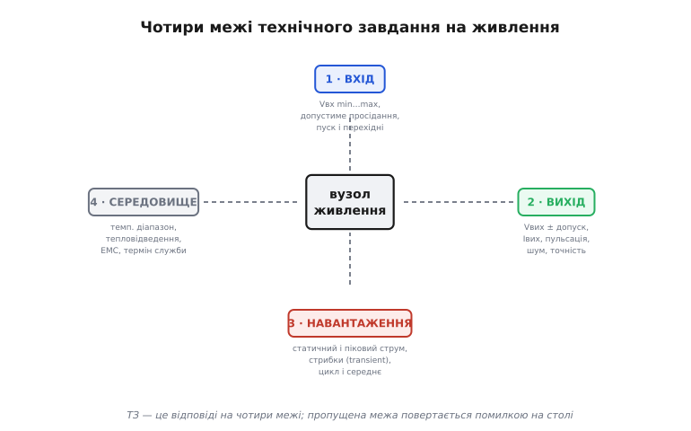
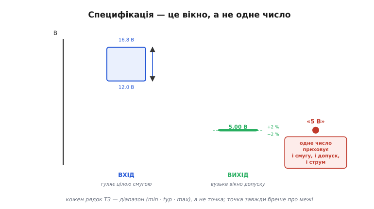
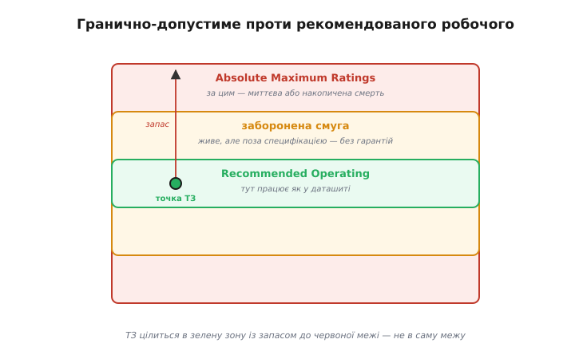
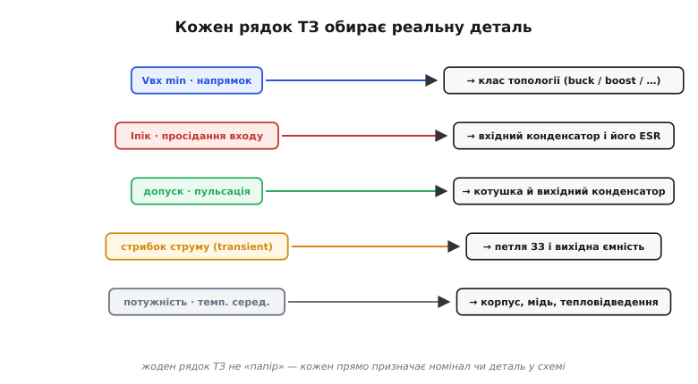

# Шаблон ТЗ на вузол живлення

Через увесь цей модуль ми вчилися ухвалювати рішення про живлення: [обирати топологію](root:embedded/topology-map) за деревом питань, рахувати [споживання плати](root:embedded/board-consumption), вичищати [струм спокою](root:embedded/sleep-current-audit), зводити [тепловий бюджет](root:embedded/thermal-budget). Кожне з тих рішень починалося з фрази «дано ТЗ — …». Тепер настав час спитати про саме це «дано»: **звідки воно береться і як його записати без дір?** Бо найдорожчі помилки в живленні стаються не тоді, коли інженер погано порахував котушку, а тоді, коли він порахував її **правильно — але не під ту вимогу**. Дерево вибору безпомічне, якщо на вхід йому подати неповне ТЗ: воно дасть упевнену відповідь на питання, якого ніхто не ставив.

ТЗ (технічне завдання; англійською requirements specification — від латинського *specere* «дивитися, розглядати»: документ, що **розглядає** виріб до того, як його збудовано) — це не бюрократія, а перший інженерний артефакт вузла. Він фіксує межі, у яких блок мусить працювати, **раніше**, ніж обрано бодай одну деталь. Усе подальше — топологія, номінали, корпус — лише чесні відповіді на нього. І якщо в ТЗ бракує рядка, цей брак не зникає: він просто чекає, поки знайде вас на столі — згорілим ключем, мерехтінням під просілою батареєю чи платою, що працює на лабораторному столі й вмирає на морозі.

Ця тема дає **шаблон**: чотири межі, які ТЗ мусить закрити, поле за полем із поясненням, чим кусає кожен пропуск, і спосіб записати готове ТЗ так, щоб його перевіряла навіть прошивка. Уміння скласти повне ТЗ — окремий навик, рівноцінний умінню читати схему: він економить не години, а перевиточки плати.

## Чотири межі: спина будь-якого ТЗ

Здавалося б, специфікацій живлення безліч — від монетної батарейки до мережевого блока. Але всі вони відповідають на **чотири питання-межі**, і кожна межа — це не пункт, а цілий бік, з якого вузол можна притиснути до стіни. Пропусти один бік — саме звідти й прилетить.


*Технічне завдання — це відповіді на чотири межі. Вхід: звідки беремо й як та напруга гуляє. Вихід: що віддаємо й наскільки точно. Навантаження: як споживач смикає струм у часі. Середовище: де блок фізично живе. Пропущена межа повертається помилкою на столі — саме з того боку, який забули описати.*

- **Вхід** — звідки приходить енергія і **як ця напруга поводиться**. Не одне число, а діапазон: повна й сіла батарея, просідання під пусковим струмом, перехідні від сусідніх споживачів. Саме вхід вирішує перше питання дерева топологій — напрямок перетворення.
- **Вихід** — що віддаємо споживачеві: напруга **з допуском**, максимальний струм, дозволена пульсація (ripple) і шум, точність. «5 В» без допуску — це ще не вихід, це побажання.
- **Навантаження** — як споживач **смикає струм у часі**: статичний рівень, пік, різкі стрибки (transient), цикл і середнє. Та сама теза, що й в [аудиті споживання](root:embedded/board-consumption): час життя й нагрів вирішує не пік, а профіль.
- **Середовище** — де блок фізично живе: діапазон температур, як відводиться тепло, вимоги електромагнітної сумісності, очікуваний термін служби. Це межа, яку забувають найчастіше, — і саме вона валить прилад «у полі», а не на столі.

Порядок не випадковий — той самий принцип, що й у дереві топологій: спершу жорсткі, фізично невблаганні межі (вхід, середовище), тоді тонші (точність виходу, профіль навантаження). Жорстка межа одним махом викреслює цілі класи рішень, тож із неї й починають.

## Поле за полем: чим кусає кожен пропуск

Шаблон корисний лише тоді, коли за кожним рядком стоїть **механізм біди**. Пройдімо поля по черзі — не як анкету, а питаючи: «що станеться, якщо лишити це порожнім?»

**Вхід: діапазон, а не номінал.** Перша й найдорожча помилка — записати вхід одним числом. Чотирибаночний LiPo — це не «14.8 В», а **12.0–16.8 В**: повний дає 16.8, сівший до відсічки — 12.0. Перетворювач мусить тримати вихід на **обох** кінцях. Запишеш «14.8» — і ризикуєш узяти buck, який на сівшій батареї вже не дотягне до цілі, бо вхід підповз до самого виходу. Поряд із діапазоном — **просідання**: коли поруч умикається сильний споживач, вхідна шина короткочасно падає. Якщо ТЗ цього не назве, перетворювач спіткнеться саме в найгірший момент.

**Вихід: напруга з допуском і струм із запасом.** Цифрова логіка живе у вікні — скажімо, 3.3 В ± 5 %. Поза вікном вона не «трохи гірше працює», а **скидається або зависає**. Тому вихід без допуску — недописане ТЗ. Так само максимальний струм: беруть не «скільки зазвичай», а **пік плюс запас**, інакше перетворювач увійде в обмеження саме на сплеску — коли струм найпотрібніший. Сюди ж — **пульсація і шум**: для логіки кількадесят мілівольт байдужі, а для опорної напруги [АЦП](root:embedded/signal-acquisition) чи радіотракту той самий шум — це втрачені біти й піднята межа чутливості.

> 🔧 **Навіщо це.** Допуск виходу — це межа, у яку цілиться **вся** решта проєкту: вибір перетворювача, номінал котушки, ємність і ESR вихідного конденсатора, навіть розведення землі. Якщо допуск не записано, ці рішення нема об що звіряти — і кожне з них ухвалюється «на око». Перший рядок виходу в ТЗ — завжди «напруга ± відсоток», і лише потім усе інше.

**Навантаження: профіль, а не максимум.** Споживач рідко тягне рівний струм. Радіо мовчить і раптом б'є пачкою на передачі; мотор стартує важко й біжить легко. ТЗ мусить назвати **і** статичний струм, **і** пік, **і** найзліший — раптовий **стрибок** (load transient): миттєвий перехід від малого струму до великого. Саме на такому стрибку вихід проїдає вниз (бо петля керування не встигає), і якщо ТЗ цього стрибка не передбачило, вихідної ємності забракне — напруга на мить вийде з вікна, і логіка просядне. Це та сама думка, що вела нас через увесь модуль: дивишся не на пік і не на спокій окремо, а на **поведінку в часі**.

**Середовище: де воно живе.** Той самий блок, що тримає 25 °C на столі, на сонці в корпусі дрона дихає під 70 °C — а вище від певної температури кожен перетворювач **зменшує** дозволену потужність (це [дератинг](topic:electronics/derating) — англ. *derating*, від *to derate* «знижувати норму»). ТЗ без діапазону температур — це блок, спроєктований лише для лабораторії. Сюди ж — вимоги електромагнітної сумісності (поряд із радіо потрібен тихий, [фільтрований](root:embedded/power-supply-filtering) перетворювач) і очікуваний термін служби, що диктує запас за струмом для конденсаторів, бо вони сохнуть із роками.

## Вікно, а не точка

За всіма цими полями стоїть одна спільна думка, і її варто винести окремо, бо вона — корінь половини помилок ТЗ. **Кожен рядок специфікації — це діапазон, а не одне число.** «5 В, 3 А» звучить точно й заспокійливо — і саме тому бреше: воно мовчить про те, що вхід гуляє цілою смугою, вихід має право гуляти у вузькому допуску, а струм смикається від нуля до піку.


*Реальне ТЗ мислить вікнами. Вхід — широка смуга (повна й сіла батарея). Вихід — вузьке вікно допуску навколо номіналу. А «одне число» посередині приховує і смугу входу, і допуск виходу, і весь профіль струму. Кожен рядок ТЗ мусить нести три позначки: мінімум, типове, максимум.*

Звідси проста дисципліна: **пиши кожен рядок як min · typ · max.** Вхід: min — сіла батарея (найгірше для boost і для дотягування), max — повна (найгірше за нагрівом і за межею absolute maximum). Вихід: typ — номінал, min/max — краї допуску. Струм: typ — середній (для нагріву й автономності), max — пік (для вибору перетворювача). Щойно змушуєш себе заповнити всі три колонки, дірки в ТЗ стають видимі самі: порожня клітинка — це невідповідь, яку інакше легко проґавити за гарним круглим числом.

## Дві межі даташита: робоча проти гранично-допустимої

Заповнюючи ТЗ числами з даташитів, неминуче впираєшся у дві різні таблиці меж — і їх **постійно плутають**, з дорогими наслідками. Даташит дає окремо **Recommended Operating Conditions** (рекомендовані робочі умови) і окремо **Absolute Maximum Ratings** (гранично-допустимі значення), і це **не синоніми**.


*Даташит дає дві межі, і ТЗ мусить розрізняти їх. Recommended Operating — зона, де деталь працює так, як написано в специфікації. Absolute Maximum — межа, за якою вона гине миттєво або зношується. Між ними — заборонена смуга: «живе, але вже без гарантій». ТЗ цілиться в зелену зону із запасом до червоної межі — ніколи в саму межу.*

Різниця тут — між «працює як обіцяно» і «ще не вмерло». У **робочій** зоні всі цифри даташита чинні: точність, струм спокою, пульсація. Між робочою межею й **гранично-допустимою** лежить смуга, де деталь ще жива, але вже **поза специфікацією** — параметри попливли, надійність не гарантована. А **absolute maximum** — це навіть не «довго так не можна», а часто «**жодної миті** не можна»: перевищив на мить — і прихований дефект уже посіяно, хай навіть блок іще працює. Звідки взялася сама ідея окремої таблиці «нікчемних максимумів» і чому її формулюють так сурово — у вставці [📜 Як народилися гранично-допустимі значення](root:embedded/power-spec-template/hist-absolute-maximum.md).

Практичний висновок прямий: **ТЗ цілиться в робочу зону із запасом, а не в межу.** Вхід 16.8 В від повного 4S — це вже привід шукати перетворювач із absolute maximum за входом не 18, а 24–28 В, бо комутаційні викиди й перехідні легко докидають понад номінал. Запас — не марнотратство, а плата за те, що реальний світ не сидить у typ-колонці.

## Від ТЗ до деталей: кожен рядок щось обирає

Найшвидший спосіб переконатися, що ТЗ — не папір, а інженерний інструмент: побачити, що **кожен його рядок прямо призначає деталь** у схемі. ТЗ — це не опис того, що хочеться, а набір **керівних чисел**, з яких механічно випливають номінали.


*Жоден рядок ТЗ не «папір». Мінімум входу й напрямок обирають клас топології. Піковий струм і просідання входу задають вхідний конденсатор та його ESR. Допуск і пульсація диктують котушку й вихідну ємність. Стрибок струму визначає петлю зворотного зв'язку. Потужність і температура середовища обирають корпус, переріз міді й тепловідведення. ТЗ — це керівні числа, а не побажання.*

Ось чому неповне ТЗ небезпечніше за відверто помилкове: помилкове число дасть видимо неправильну деталь, яку зловиш на рев'ю. А **порожній** рядок просто лишає деталь обраною «на око» — і вона мовчки стоятиме, поки не зустрінеться зі своєю невказаною межею. Заповнене ТЗ перетворює проєктування з мистецтва вгадування на ланцюжок чесних висновків «дано це → отже така деталь».

## Worked-приклад. ТЗ як структура, що компілюється

Покладімо все докупи на конкретному вузлі — логічна шина дрона на 4S — і запишімо ТЗ так, щоб його **читала прошивка**, а не лише людина. Найкраще ТЗ — машинно-перевірне: тоді абсурдні комбінації ловить компілятор, а не випробувальний стенд.

**Вузол: шина 5 В для логіки дрона, живлення від 4S LiPo.** Вхід 12.0–16.8 В (із запасом absolute maximum до 28 В на викиди). Вихід 5.0 В ± 2 %. Струм: 0.3 А спокій, 3.0 А пік, стрибки до 2.5 А. Середовище −10…+70 °C.

```c
// ТЗ вузла живлення як незмінна структура. Усі межі — у явних полях,
// напруги в мілівольтах, струми в міліамперах (ціле — без сюрпризів float).
typedef struct {
    uint16_t vin_min_mv;     // сіла батарея — найгірше для дотягування
    uint16_t vin_max_mv;     // повна батарея — найгірше за нагрівом
    uint16_t vin_absmax_mv;  // гранично-допустимий вхід (викиди!)
    uint16_t vout_mv;        // номінал виходу
    uint8_t  vout_tol_pct;   // допуск виходу, відсотки
    uint16_t iout_typ_ma;    // середній струм — нагрів і автономність
    uint16_t iout_peak_ma;   // піковий струм — вибір перетворювача
    int8_t   ta_min_c;       // нижня межа температури середовища
    int8_t   ta_max_c;       // верхня межа — точка дератингу
} power_spec_t;

static const power_spec_t logic_5v = {
    .vin_min_mv    = 12000,  .vin_max_mv = 16800,  .vin_absmax_mv = 28000,
    .vout_mv       = 5000,   .vout_tol_pct = 2,
    .iout_typ_ma   = 300,    .iout_peak_ma = 3000,
    .ta_min_c      = -10,    .ta_max_c   = 70,
};
```

Сама структура вже корисна — вона не дає полю «загубитися». Але справжня сила приходить, коли ТЗ **перевіряє само себе** ще під час компіляції: безглузду специфікацію не можна навіть зібрати.

```c
// Перевірки ТЗ на етапі компіляції: абсурд ловить компілятор, не стенд.
_Static_assert(logic_5v.vin_min_mv < logic_5v.vin_max_mv,
               "вхід: min мусить бути нижчим за max");
_Static_assert(logic_5v.vin_max_mv < logic_5v.vin_absmax_mv,
               "робочий max мусить лишати запас до absolute maximum");
_Static_assert(logic_5v.iout_peak_ma >= logic_5v.iout_typ_ma,
               "пік не може бути меншим за середній струм");
_Static_assert(logic_5v.vout_tol_pct > 0 && logic_5v.vout_tol_pct <= 10,
               "допуск виходу: 0 < tol <= 10 % (інакше це не ТЗ, а побажання)");
```

Тепер прошивка може й **використати** ці межі в роботі — наприклад, відмовитися стартувати, якщо реально виміряний вхід виходить за робоче вікно ТЗ:

```c
// Старт лише в межах ТЗ: нижче vin_min перетворювач не дотягне вихід,
// вище vin_max — ризик нагріву й виходу за гарантії.
bool input_within_spec(const power_spec_t *s, uint16_t vin_mv) {
    return vin_mv >= s->vin_min_mv && vin_mv <= s->vin_max_mv;
}

void power_up(void) {
    uint16_t vin = adc_read_vin_mv();
    if (!input_within_spec(&logic_5v, vin)) {
        log_warn("вхід %u мВ поза ТЗ [%u..%u] — старт заборонено",
                 vin, logic_5v.vin_min_mv, logic_5v.vin_max_mv);
        enter_safe_state();
        return;
    }
    enable_converter();
}
```

ТЗ перестало бути мертвим документом у теці: воно живе в коді, його перевіряє компілятор, і воно сторожить пристрій під час роботи. Це і є зрілий вигляд специфікації — не текст, який хтось колись прочитає, а **межі, вбудовані у виріб**. Як розгорнути цю ідею до повного машинно-перевірного шаблону — з валідацією номіналів, генерацією таблиці й дзеркальним описом для рев'ю — у вставці [⚙️ ТЗ як машинно-перевірний шаблон](root:embedded/power-spec-template/proj-spec-as-code.md).

## Типові пастки ТЗ

Помилки специфікації, що повторюються найчастіше, мають **спільний корінь** — ставлення до ТЗ як до формальності, яку «заповнимо потім», замість першого інженерного рішення. Звідси й виростають усі вони:

- **Вхід одним числом.** «14.8 В» замість «12.0–16.8 В» — і перетворювач не тримає вихід на краях смуги.
- **Вихід без допуску.** «3.3 В» без «± 5 %» — нема об що звіряти весь подальший проєкт.
- **Струм за середнім, а не за піком.** Перетворювач входить в обмеження саме на сплеску.
- **Забутий стрибок навантаження.** Вихідної ємності бракує, напруга на мить вилітає з вікна.
- **Ціль у absolute maximum замість робочої зони.** Викид понад номінал — і деталь уже за межею, хай і «жива».
- **Жодного слова про середовище.** Блок працює на столі й вмирає на морозі чи в нагрітому корпусі.

Усі шість — не дрібні недогляди, а наслідок одного пропущеного кроку: ТЗ не написали повністю **до** того, як узялися рахувати. Повне ТЗ ловить ці помилки ще до першої деталі — саме тому воно й варте окремого навику.

## Повне ТЗ — чесне «дано» модуля

Варто повернути думку на початок. Кожен інструмент цього модуля — дерево топологій, бюджети споживання й тепла, аудит струму спокою — мовчки починав зі слів «дано ТЗ». Виходить, що саме це «дано» й було найкрихкішою ланкою всього ланцюга: підводить зазвичай не розрахунок котушки, а недописаний рядок вимоги над ним. Повне ТЗ не додає жодного нового прийому проєктування — воно робить надійними всі попередні, бо підставляє їм тверду опору замість вгаданої. Ось чому вміння дописати специфікацію до кінця стоїть в одному ряду з умінням читати схему: воно вирішує не окрему задачу, а те, чи заслужена відповідь усіх інших.
