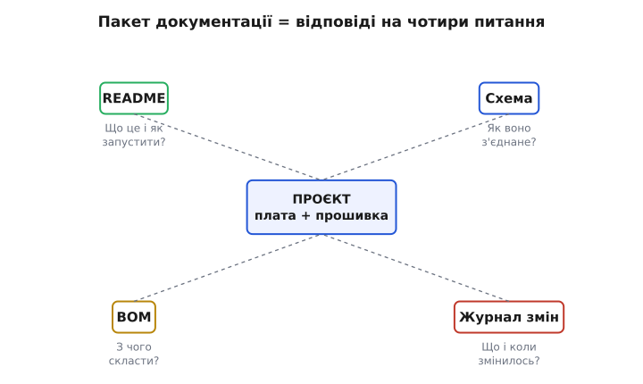
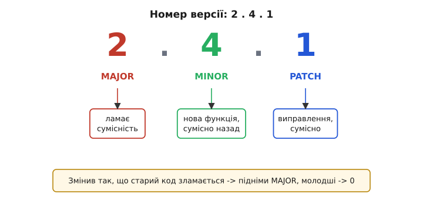

# Документація проєкту: README, схема, BOM, журнал змін

Ваш капстоун працює. Коптер злітає, проходить точки місії й повертається; ровер об'їжджає перешкоду; розумний дім реагує на давачі. Ви щойно провели місію від початку до кінця — і на цьому в багатьох курсах ставлять крапку. Але справжній проєкт не закінчується, коли він уперше запрацював. Він закінчується, коли інша людина — або ви самі через пів року — може взяти його, зрозуміти й повторити, **не смикаючи вас щохвилини**.

Ось у чому справжня перевірка. Уявіть, що вам треба здати проєкт і зникнути на місяць. Приходить товариш, відкриває вашу теку — і там сорок файлів, дві гілки в git, купа дротів на макетці й жодного слова пояснення. Через що він продереться сам, а на чому застрягне намертво? Питання не про красу. Питання про те, чи виживе ваша робота без вас.

Документація — це і є той рятувальний пакет, який ви лишаєте разом із залізом. Слово походить від латинського *documentum* — «те, що вчить, доказ, приклад». Не звіт для галочки, а **навчальний матеріал про власний проєкт**: він показує наступному, як усе влаштовано й чому саме так. У цьому кроці ми зберемо чотири документи, кожен з яких відповідає рівно на одне питання, яке неминуче поставить той, хто торкнеться проєкту після вас.


*Кожен документ закриває одне питання наступної людини; разом вони роблять проєкт таким, що передається з рук у руки.*

> 🔧 **Навіщо це.** У реальній розробці код без документації — це технічний борг, який спливе в найгірший момент: коли пристрій відмовить у полі, а автор буде недоступний. Команди, замовники й журі капстоунів дивляться не лише на те, чи блимає світлодіод, а й на те, чи можна це супроводжувати. Добра документація — різниця між «студентським проєктом» і «інженерним виробом».

## README: перше, що читають, і часто єдине

`README` (англ. read me — «прочитай мене») — файл, який за домовленістю кладуть у корінь проєкту, щоб його побачили найпершим. Назва велика літерами не випадково: у старих файлових списках, посортованих за абеткою з урахуванням регістру, великі літери йшли раніше за малі, тож `README` спливав нагору переліку. Традиція збереглася й досі: відкрив теку — і твій погляд першим падає саме на нього.

README відповідає на питання **«що це таке і як мені це запустити?»**. Це не документація на весь проєкт — це двері до нього. Людина, що вперше бачить вашу теку, має за п'ять хвилин зрозуміти, чи туди вона взагалі потрапила, і зробити перший крок без вашої допомоги.

Мінімальний робочий README для капстоуна має ці частини, у такому порядку:

- **Назва й один рядок суті.** «Автономний ровер обходу перешкод на STM32 + ArduPilot». Прочитав — знаєш, про що мова.
- **Що воно робить.** Три-чотири речення: яку задачу розв'язує, що вміє, чого свідомо не вміє. Межі не менш важливі за можливості — вони рятують наступного від хибних сподівань.
- **Залізо.** Коротко, яка плата, які модулі; за деталями — відсилання до BOM і схеми (нижче).
- **Як зібрати й прошити.** Точні команди, а не «зберіть як звичайно». Якщо треба середовище, версія тулчейна, конкретний крок — усе тут.
- **Як запустити місію.** Що ввімкнути, у якому порядку, чого чекати. Куди дивитись, якщо не працює.
- **Ліцензія й автор.** Хто зробив, на яких умовах можна користуватися.

Ключове правило README: **команди мають працювати дослівно**. Найпоширеніша причина, чому чужий проєкт не запускається, — інструкція, яку автор писав з пам'яті, а не перевіряв. Ви знаєте, що перед прошивкою треба експортувати змінну середовища, бо у вас вона вже експортована в профілі оболонки. Наступний цього не знає. Тож пишіть так, ніби читач сідає за чисту машину.

README живе поряд із кодом, у форматі Markdown — легкій розмітці, де заголовок задається решіткою `#`, список — рискою, а код — потрійними зворотними лапками. Markdown читається як звичайний текст навіть без рендеру, тож він однаково зрозумілий і в редакторі, і на сторінці репозиторію. Ось як виглядає розділ збирання в справжньому README прошивки:

**Приклад: розділ «Збирання» у README капстоуна-ровера.**

```markdown
## Збирання і прошивання

Потрібно: arm-none-eabi-gcc 12.x, CMake ≥ 3.20, ST-Link.

    # 1. Налаштувати збірку (один раз)
    cmake -S . -B build -DCMAKE_BUILD_TYPE=Release

    # 2. Зібрати прошивку
    cmake --build build

    # 3. Прошити плату (ST-Link під'єднано по SWD)
    st-flash write build/rover.bin 0x08000000

Якщо st-flash не бачить плату — перевір, що перемичка BOOT0
стоїть у «0» і плата отримує 3.3 В по SWD-роз'єму.
```

Зверніть увагу на останній абзац: він передбачає найчастішу пастку й одразу дає відповідь. Це не прикраса — це те, що відрізняє інструкцію, за якою людина проходить сама, від інструкції, після якої вона все одно пише вам.

> 🔧 **Навіщо це.** README — єдиний документ, який гарантовано читають. Схему відкриють, якщо треба паяти; BOM — якщо треба купувати; журнал змін — якщо щось зламалось. А README відкривають **завжди й перше**. Тому саме сюди йде найважливіше: як не зіпсувати плату, у якому порядку вмикати живлення, чого категорично не робити. Один рядок попередження тут може врятувати спалений мікроконтролер.

## Схема: як воно насправді з'єднане

Прошивка каже, що робить нога `PA5`. Але за яким дротом ця нога йде до драйвера мотора, який резистор стоїть на лінії, куди підключена спільна земля — цього код не знає. Це знає **схема** (принципова схема, англ. schematic).

> Принципова схема — це креслення електричних з'єднань пристрою символами, а не малюнком реальних деталей: кожен компонент позначено умовним знаком, кожен дріт — лінією, а точки з'єднання — крапками. Схема показує, **що з чим електрично поєднане**, незалежно від того, як деталі розкладені фізично. Детальніше — [book:electronics/schematic-purpose].

Схема відповідає на питання **«як це з'єднати, щоб повторити?»**. Без неї ваш проєкт неможливо ані відтворити, ані полагодити: людина бачить плату з десятком дротів і не має жодного способу дізнатися, куди який іде, окрім як простежити кожен вручну й вгадати ваш задум.

Для капстоуна не обов'язково малювати схему в професійному САПР, як для заводської плати, — це тема наступного модуля про виріб. Але **якийсь** формальний запис з'єднань має бути. Мінімум прийнятного — акуратна схема від руки, сфотографована й покладена в теку. Краще — накреслена в безкоштовному редакторі схем. Головне, щоб на ній читалося:

- **кожен модуль** зі своєю назвою (мікроконтролер, драйвер мотора, GPS, регулятор живлення);
- **кожне з'єднання між ними** з підписом ноги: `PA5 → IN1 драйвера`, `PA6 → IN2`;
- **живлення й земля** окремо й наскрізно — які напруги де, звідки береться 3.3 В, де спільна точка землі;
- **важливі номінали** — резистор підтяжки на `I²C`, конденсатор на живленні коло мотора.

Останнє коло — живлення — на схемі капстоуна найважливіше й найчастіше недооцінене. Мотори тягнуть струм ривками, і якщо земля мотора й земля логіки зустрічаються не в тій точці, по «спільному» дроту побіжить шум, від якого мікроконтролер перезавантажується посеред місії. Схема — єдине місце, де видно, чи розведено землю правильно, ще до того, як ви годинами шукаєте плаваючий збій. Тому земля на схемі має бути намальована як окрема, свідомо продумана мережа, а не як «усі мінуси десь там з'єднані».

**Приклад: текстовий запис з'єднань у README, доки немає намальованої схеми.**

Іноді на початку зручно тримати з'єднання прямо текстом — це вже краще, ніж нічого, і легко звіряти з кодом:

```markdown
## З'єднання (див. schematic.png для повної схеми)

STM32          Модуль            Нога модуля
-----          ------            -----------
PA5   ------>  DRV8833           IN1  (лівий мотор +)
PA6   ------>  DRV8833           IN2  (лівий мотор −)
PB0   ------>  HC-SR04           TRIG (запуск ехолокатора)
PB1   <------  HC-SR04           ECHO (через дільник 5В→3.3В!)
3.3V  ------>  усі логічні входи
VIN   ------>  DRV8833 VM        (живлення моторів, окрема лінія)
GND   ------>  спільна земля     (одна точка, зірка)
```

Комент про дільник на лінії `ECHO` — не дрібниця. Ультразвуковий далекомір видає ехо-сигнал рівнем 5 В, а вхід STM32 терпить максимум 3.3 В. Забудеш дільник — з часом спалиш ногу. Такі речі мусять бути на схемі **явно**, бо саме на них горять проєкти, і саме їх найлегше проґавити.

## BOM: з чого це зібрати

Схема каже, як з'єднати. `BOM` (англ. Bill of Materials — «відомість матеріалів», буквально «рахунок матеріалів») каже, **що саме взяти й у якій кількості**. Це повний перелік деталей проєкту: назва, кількість, позначення на схемі, і — для реального відтворення — де взяти.

> Перелік компонентів (BOM) — це таблиця всіх деталей виробу: рядок на позицію, з кількістю, точним найменуванням і посиланням на позначення на схемі. Він мусить бути **узгоджений зі схемою** — кожен компонент зі схеми присутній у BOM і навпаки, без сиріт з жодного боку. Детальніше — [book:electronics/bom].

BOM відповідає на питання **«скільки це коштує й що піти купити?»**. Без нього повторення проєкту перетворюється на детектив: людина мусить сама вигадати, що ви використали, за фото плати вгадати номінали резисторів і сподіватися, що не помилилась. З BOM вона просто бере список і замовляє.

Для капстоуна BOM цілком живе таблицею в Markdown або окремим `.csv`, який відкривається таблицею. Мінімальні колонки:

| Позиція | Компонент | К-сть | Позначення | Примітка |
|---|---|---|---|---|
| 1 | STM32F103C8T6 (Blue Pill) | 1 | U1 | плата-носій MCU |
| 2 | DRV8833 драйвер моторів | 1 | U2 | 2 канали, до 1.5 А |
| 3 | HC-SR04 ультразвук | 1 | U3 | 5 В живлення |
| 4 | Резистор 1 кОм | 2 | R1, R2 | дільник на ECHO |
| 5 | Резистор 2 кОм | 1 | R3 | дільник на ECHO |
| 6 | Конденсатор 100 мкФ | 1 | C1 | на живленні моторів |
| 7 | Мотор-редуктор TT | 2 | M1, M2 | ходові колеса |

Головна вимога до BOM — **узгодженість зі схемою**. Кожне позначення в колонці «Позначення» (`U1`, `R1`…) має існувати на схемі, і навпаки: усе, що є на схемі, має рядок у BOM. Розсинхрон тут — класична причина, чому зібраний за документами пристрій не працює: людина взяла резистор 1 кОм замість 2 кОм, бо в BOM забули оновити номінал після того, як його поміняли на схемі. Тому BOM і схему завжди правлять разом, як одну річ у двох виглядах.

Дрібна, але цінна деталь для капстоуна — колонка з приблизною ціною або посиланням на магазин. Вона перетворює BOM з академічного списку на практичний: журі чи товариш одразу бачить, що весь проєкт коштує, скажімо, 400 гривень, а не невідому суму. Для інженерного виробу туди ще додають партномер виробника й постачальника — але це вже рівень серійної плати з наступного модуля.

## Журнал змін: що, коли й чому змінилось

Три попередні документи описують проєкт **зараз**. Журнал змін (англ. changelog, від change — «зміна» і log — «запис, журнал») описує його **в часі**: що додалося, що виправилося, що зламалося й відкотилося — від версії до версії. Він відповідає на питання **«що змінилось з минулого разу і чи безпечно оновлюватись?»**.

Здавалося б, навіщо це капстоуну — адже вся історія вже є в git? Ось де ховається головне непорозуміння. Історія git — це журнал для машини й для автора: тисяча дрібних комітів «fix typo», «wip», «трохи поправив». Журнал змін — це **людський підсумок для того, хто користується проєктом, а не пише його**. Автор проєкту «Keep a Changelog» Олів'є Лакан сформулював це різко й влучно: «Не давайте друзям звалювати git-логи в журнали змін» (англ. *Don't let your friends dump git logs into changelogs*). Git-лог відповідає на питання «які були коміти»; журнал змін — на питання «що для мене змінилось».

> Контроль версій (git) — це система, що зберігає всю історію змін проєкту: кожен зафіксований стан (коміт), хто й коли його зробив, і можливість повернутися до будь-якого. Журнал змін — це **не** те саме: він не заміняє git, а витягує з нього людський підсумок. Основи git — у [book:programming/version-control].

Формат, який став фактичним стандартом, — простий і зчитуваний очима. Проєкт «Keep a Changelog», який Олів'є Лакан веде з 2014 року, каже тримати файл `CHANGELOG.md` із записами від новішого до старішого, датами у форматі `РРРР-ММ-ДД` і невеликим набором категорій змін: **Added** (додано), **Changed** (змінено), **Deprecated** (застаріло), **Removed** (прибрано), **Fixed** (виправлено), **Security** (безпека). Зверху тримають розділ `[Unreleased]` — «ще не випущене», куди складають зміни в міру роботи, а на випуску перейменовують у номер версії з датою.

**Приклад: `CHANGELOG.md` капстоуна-ровера.**

```markdown
# Журнал змін

Формат — Keep a Changelog; версії — за SemVer.

## [Unreleased]
### Added
- Лог відстані на SD-картку раз на секунду.

## [1.2.0] — 2026-06-28
### Added
- Об'їзд перешкоди дугою замість зупинки й розвороту.
### Fixed
- Ровер більше не «сліпне» на світлих поверхнях: збільшено
  час очікування ехо з 20 до 30 мс.

## [1.1.0] — 2026-06-15
### Changed
- PID-регулятор курсу: коефіцієнт Kp 0.8 → 1.1, рівніше йде.

## [1.0.0] — 2026-06-01
### Added
- Перша робоча місія: старт, об'їзд, повернення в точку старту.
```

Прочитайте цей запис очима того, хто збирає ваш ровер собі. За хвилину видно всю дугу проєкту: почалося з базової місії, потім згладили керування курсом, потім навчили не сліпнути на світлому. Кожен рядок каже **навіщо**, а не лише **що**: не «змінено Kp», а «Kp 0.8 → 1.1, рівніше йде». Саме це «навіщо» git-лог майже ніколи не несе, а людині воно потрібне найбільше.

### Номер версії, який щось означає

У прикладі версії не випадкові: `1.0.0`, `1.1.0`, `1.2.0`. Це **семантичне версіювання** (англ. Semantic Versioning, SemVer) — домовленість, за якою номер із трьох чисел `MAJOR.MINOR.PATCH` сам розповідає, **наскільки серйозна зміна**. Її формалізував Том Престон-Вернер, співзасновник GitHub, приблизно 2011 року (версія специфікації 2.0.0 — 2013), і відтоді нею користуються практично всюди — від бібліотек до прошивок.


*Кожне з трьох чисел має свій зміст: старший розряд змінюють лише тоді, коли ламається сумісність, і тоді молодші обнуляють.*

Правило просте, а тому й працює:

```
MAJOR.MINOR.PATCH
  │     │     └── виправлення без нових можливостей, сумісно:  1.2.0 → 1.2.1
  │     └──────── нова можливість, старе працює як раніше:      1.2.1 → 1.3.0
  └────────────── зміна, що ЛАМАЄ старе (інший протокол,        1.3.0 → 2.0.0
                  інша розпіновка) — тут старий код/збірка
                  вже не сумісні
```

Коли піднімаєш старший розряд, молодші **обнуляються**: після `1.4.2` наступний ламкий випуск — `2.0.0`, а не `2.4.2`. Логіка в тому, що новий MAJOR — це фактично нова лінія, у якій відлік дрібних змін починається спочатку.

Для капстоуна це не бюрократія, а корисна дисципліна. Уявіть, що ви поміняли протокол зв'язку між платою й пультом. Той, у кого стара прошивка пульта, мусить одразу зрозуміти: цей випуск з нею **не сумісний**, треба оновлювати обидва боки. Номер `2.0.0` каже це без єдиного слова пояснень. А `1.5.3 → 1.5.4` так само мовчки обіцяє: «нічого не зламали, просто виправили — оновлюйся спокійно». Одне число несе те, на що інакше пішов би абзац.

## Як це живе разом і не гниє

Чотири документи — не разова робота «наприкінці», а **частина процесу**. Найбільша пастка документації в тому, що вона живе окремо від коду й тихо застаріває: прошивку поміняли, а README досі описує старе, і тепер він гірший за відсутність, бо активно бреше. Наступний довіриться написаному, зробить за застарілою інструкцією й отримає незрозумілу помилку.

Рятує проста звичка: **правиш поведінку — правиш документ у тому самому кроці роботи**. Змінив ногу — одразу в схему й BOM. Додав можливість — рядок у розділ `[Unreleased]` журналу, поки пам'ятаєш навіщо. Це кілька рядків за раз, і документація лишається живою сама собою. Спроба «задокументувати все потім, перед здачею» майже завжди провалюється: до того вечора половина «навіщо» вже вивітрилася з голови, і журнал змін вироджується в те саме звалище, від якого застерігав Лакан.

Практичний порядок збирання документації капстоуна, коли проєкт уже працює:

- **Спершу README** — поки все свіже в пам'яті, зафіксуйте, що це, як зібрати й запустити, і головні застороги щодо живлення й підключення.
- **Тоді схема** — навіть від руки, але з підписаними ногами, наскрізною землею й позначеними ризиками рівнів (як той дільник на `ECHO`).
- **Потім BOM** — пройдіться по схемі й випишіть кожну деталь; звірте, що позначення збігаються з обох боків.
- **І журнал змін** — відновіть основні віхи з історії git людською мовою, проставте семантичні версії, а далі просто дописуйте зверху.

Разом ці чотири файли роблять із набору дротів і коду **виріб, що передається**. Це і є справжнє завершення капстоуна: не мить, коли воно вперше запрацювало у вас на столі, а стан, коли інша людина бере вашу теку — і повторює все сама, без вас. Той самий інженерний рефлекс — лишити по собі ясний слід — веде далі, у наступний модуль, де проєкт зі стола перетворюється на справжню плату, серію й сертифікований виріб.
