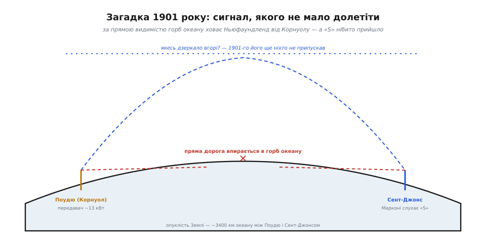
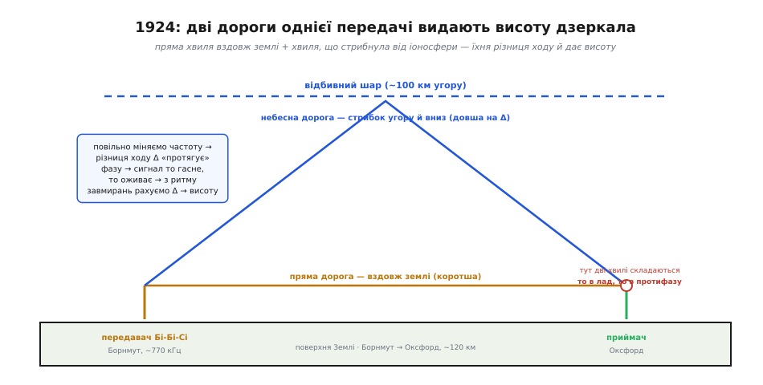

# 📜 Як знайшли небесне дзеркало

Найдивніше в історії іоносфери те, що людство **скористалося нею раніше, ніж дізналося, що вона є**. Спершу був незрозумілий сигнал, що перестрибнув океан усупереч усім розрахункам; тоді — двоє людей, які майже одночасно й незалежно здогадалися, що високо вгорі мусить висіти провідне дзеркало; і аж за двадцять із гаком років — двоє інших, які це дзеркало **зміряли**, не злетівши до нього. Це гарна історія не лише тому, що в ній є загадка й розв'язка. Вона показує, як насправді просувається наука: не «спершу теорія, тоді застосування», а навпаки — спершу впертий факт, який нікуди не подіти, потім сміливий здогад, і лише наприкінці — доказ, який перетворює здогад на знання. І як ми побачимо, той фінальний доказ був ще й **першим виміром відстані за допомогою радіо** — прямим предком радара.

## Сигнал, якого не мало бути

12 грудня 1901 року Ґульєльмо Марконі (італ. *Guglielmo Marconi*) сидів на пагорбі Сигнал-Гілл (англ. *Signal Hill*) у Сент-Джонсі на Ньюфаундленді (тоді — окрема британська колонія, нині схід Канади), притиснувши до вуха телефонну слухавку, і чекав на три коротких тріски. Три крапки — це літера «S» абеткою Морзе, найпростіший сигнал, який можна послати: натиснув ключ тричі, відпустив. За три з гаком тисячі кілометрів, на протилежному боці Атлантики, у Поудю (англ. *Poldhu*) на півострові Корнуол у південно-західній Англії, його станція раз за разом вистукувала ту саму «S» — навмисне обрали найкоротшу літеру, щоб легше було впізнати її в шумі. І Марконі, за його словами, її почув. Поряд був лише один свідок — його помічник Джордж Кемп (англ. *George Kemp*), який теж підтвердив, що чув тріски.

> 🔧 **Навіщо це.** Зверни увагу на сам прийом «послати найпростіший пізнаваний сигнал, коли не певен, чи канал узагалі працює». Це не примха старовини, а робоча інженерна звичка й донині: налагоджуючи нове радіо, ти спершу ганяєш не корисні дані, а відому коротку послідовність (тестовий тон, «ping», преамбулу), яку легко впізнати на тлі шуму. Спершу довести, що канал є взагалі, — і лише потім перейматися швидкістю й даними.

Щоб відчути, чому це твердження одразу викликало захват і недовіру, треба згадати головне правило поширення радіохвиль, з якого виростає весь цей крок курсу. Хвиля на тих частотах, що їх використовував Марконі, мала б іти **поверхневою хвилею** вздовж землі або **прямою видимістю** — а Земля кругла. Як ми бачили, [пряма дорога між двома точками впирається в опуклість планети](root:embedded/propagation-modes): антени за обрієм одна для одної просто не «бачаться». А три з половиною тисячі кілометрів океану — це не пагорб, це величезний **горб води**, висотою в десятки кілометрів посередині. Жодна пряма лінія від Корнуолу до Ньюфаундленду крізь цей горб не проходить.


*Поудю в Корнуолі й Сент-Джонс на Ньюфаундленді розділяє ~3400 км океану. Посередині — горб земної опуклості, що ховає один берег від іншого: прямої дороги немає. Здогад про відбивний шар угорі (пунктир) з'явиться лише наступного року — у грудні 1901-го сигнал «S» був чистою загадкою.*

Ще гірше для здорового глузду: станція в Поудю працювала на довжині хвилі близько 366 метрів — це **середні хвилі**, частота приблизно 820 кілогерц, той самий діапазон, де згодом оселиться звичайне AM-радіо. А середні хвилі вдень **поглинаються** нижніми шарами зарядженого повітря, ще не встигнувши відбитися від дзеркала вгорі. Прийом же Марконі влаштовував удень. Виходить, що навіть із пізнішим знанням про іоносферу сигнал на тій частоті о тій порі доби **не мав** подолати Атлантику.

Тож чесно скажемо одразу, як велить добра історія: **сам факт того прийому — спірний**. Записати сигнал не було чим — слухали на слух, а він був надто кволий, щоб увімкнути самописець. Єдиний свідок, Кемп, був помічником Марконі, тобто аж ніяк не безстороннім. А три тихих тріски в навушнику легко сплутати з тим, чого в атмосфері завжди вдосталь: розрядом далекої грози, тріском статики, випадковою завадою. Пізніші дослідники — серед них радіоінженер Джон Белроуз (англ. *John S. Belrose*) і фізик Браян Бредфорд — перерахували умови того дня й дійшли висновку, що почути справжній сигнал на 366 метрах удень через таку відстань Марконі майже напевно не міг; найімовірніше, бажане видали за дійсне. Статус цього факту — **спірний**: одні історики техніки вважають 1901 рік першим мостом через Атлантику, інші — добросовісною помилкою.

Але ось у чому краса цієї історії: **для нашого сюжету не так важливо, чи справді Марконі щось почув того дня**. Важливо, що сама Атлантика **таки** долалася радіо — якщо не 1901-го, то невдовзі, і вже без жодних сумнівів, на коротших хвилях і вночі. А отже, лишалося питання, на яке хтось мусив відповісти: **як?** Якщо Земля кругла, а хвиля впирається в обрій, то яким робом сигнал опиняється по той бік горба? Цей упертий факт — хвиля доходить туди, куди прямої дороги немає — і став насінням, з якого виросло поняття іоносфери.

## Двоє людей, одна здогадка, один рік

Відповідь надійшла напрочуд швидко — уже наступного, 1902 року. І, що особливо красиво, її дали **двоє людей незалежно один від одного**, навіть не змовляючись: американський інженер-електрик Артур Едвін Кеннеллі (англ. *Arthur Edwin Kennelly*) і англійський фізик-самоук Олівер Гевісайд (англ. *Oliver Heaviside*). Обидва, почувши про подвиг Марконі, поставили те саме питання й дійшли тієї самої відповіді: десь високо вгорі, в атмосфері, мусить висіти **провідний шар**, що відбиває радіохвилі назад до землі, наче дзеркало під стелею. Хвиля не пробиває горб океану — вона **перестрибує** його, відбившись від цього шару.

Хід думки тут вартий того, щоб його відтворити, бо це зразок чесного наукового міркування «від першопричини». Ланцюжок простий і невблаганний:

```
факт:    радіо доходить за обрій (Атлантику долано)
але:     пряма хвиля впирається в кривину Землі
отже:    дорога йде НЕ по прямій — її щось завертає назад до землі
питання: що саме може завернути радіохвилю вниз?
відповідь: відбивач угорі — провідний шар, дзеркало під «стелею» неба
```

Чому саме **провідний** шар? Бо радіоінженери вже знали з лабораторії: радіохвиля відбивається від провідника — від металу, від чогось, де є вільні заряди, здатні ворухнутися їй назустріч і відіслати її назад. Якщо хвиля повертається до землі звідкись згори, то там, угорі, мусить бути щось провідне. Звичайне повітря — добрий ізолятор, струму не проводить. Отже, треба було припустити, що високо вгорі повітря **перестає бути ізолятором** — стає частково провідним.

Гевісайд пішов на крок далі й висловив здогад, який згодом виявився правдою: повітря там провідне тому, що **сонячне випромінювання вибиває з атомів заряджені частинки** — те, що ми тепер звемо іонами та вільними електронами. Власне, саме звідси й піде пізніша назва шару — **іоносфера**, тобто «сфера іонів». Заряджені частинки й роблять розріджене повітря провідним, а провідне повітря — дзеркалом для радіохвиль. (Чому розріджене повітря на висоті веде струм, тоді як щільне внизу — ні, і чому це дзеркало вибагливе до частоти й часу доби — це вже фізика самого режиму, [про неї — у кроці про небесну хвилю](root:embedded/propagation-modes).)

Двоє людей, одна ідея, той самий рік — тож шар надовго дістав подвійне ім'я: **шар Кеннеллі-Гевісайда** (англ. *Kennelly–Heaviside layer*). Кому віддати першість? За датами публікацій Кеннеллі був трохи раніший: свою думку він оприлюднив у березні 1902 року в американському фаховому виданні. Гевісайд опублікував свою — наприкінці того ж року, у статті «Telegraphy» для енциклопедії «Британіка». Але це **не та першість, де хтось у когось підгледів**: листування й обставини показують, що думали вони самостійно, кожен своїм шляхом, і тому в історії техніки за обома справедливо лишилося авторство. Статус цього передбачення — **усталений**: і авторство, і незалежність двох ліній думки добре задокументовані.

> 🔧 **Навіщо це.** Подвійне ім'я «Кеннеллі-Гевісайда» — добра нагода запам'ятати, як насправді робляться відкриття. Не «один геній — одна ідея», а кілька людей, що незалежно доходять того самого, бо факт **дозрів**: щойно Атлантику долано, питання «що відбиває хвилю вниз?» висіло в повітрі, і відповісти на нього міг кожен, хто вмів думати від першопричини. Розрізняй у будь-якій історії техніки три різні речі: **ідею** (хтось припустив), **теорію** (хтось обґрунтував) і **доказ** (хтось виміряв). Кеннеллі й Гевісайд дали ідею та теорію. Доказу ще не було.

І тут варто наголосити на чесній межі. Станом на 1902 рік відбивний шар лишався **гарною здогадкою** — правдоподібною, переконливою, такою, що пояснювала факт, але **не доведеною**. Ніхто не бачив цього шару, не торкався його, не зміряв, на якій він висоті й чи існує взагалі. Пояснення, яке нічим не перевірено, — це ще не знання, хай яке струнке. Двадцять із гаком років шар Кеннеллі-Гевісайда жив у книжках саме так: як найкраще пояснення дивного факту, що його ніхто не міг ні підтвердити, ні спростувати.

## Як зміряти стелю, не злітаючи до неї

Доказ надійшов узимку 1924 року — і прийшов він у вигляді не просто підтвердження, а **виміру**: уперше хтось не лише сказав «дзеркало є», а й назвав, **на якій воно висоті**. Зробили це двоє в Англії: фізик Едвард Віктор Епплтон (англ. *Edward Victor Appleton*), народжений у Бредфорді, і його аспірант Майлз Барнетт (англ. *Miles Barnett*) — новозеландець із Данідіна, що приїхав до Кембриджа писати докторську. Їхній дослід — взірець фізичної винахідливості, бо вони розв'язали задачу, яка на перший погляд видається неможливою: **зміряти висоту відбивача, не маючи змоги ні дістатися до нього, ні навіть побачити його**.

Думка, що лежить в основі, проста й глибока водночас — і вона прямо спирається на те, що ми вже знаємо про дороги хвилі. До приймача той самий сигнал може дійти **двома дорогами одночасно**: одна — пряма, **вздовж землі** (поверхнева хвиля); друга — **через небо**, стрибнувши вгору до відбивного шару й повернувшись униз (небесна хвиля). Небесна дорога довша: вона йде вгору й назад, тобто намотує зайвий шлях. І ось ключ: **наскільки саме вона довша — залежить від того, як високо висить дзеркало**. Вище дзеркало — довший гак угору-вниз — більша різниця ходу між двома дорогами. Якщо виміряти цю різницю, з простої геометрії можна порахувати висоту.


*Дві дороги однієї передачі. Пряма (поверхнева) хвиля йде вздовж землі — це коротший шлях. Небесна стрибає вгору до відбивного шару й вертається — це довший шлях на величину Δ. У приймачі дві хвилі складаються; повільно міняючи частоту, можна змусити їхню фазову різницю «протягтися» так, що сигнал то гасне, то оживає, — і з ритму цих завмирань вивести Δ, а з неї — висоту дзеркала.*

Лишалося питання: **як зміряти цю різницю ходу?** Тут і блиснула винахідливість. Виміряти час прольоту прямо тодішня техніка ще не могла — електроніка була надто повільна, щоб ловити мікросекундні затримки. Тож Епплтон зробив хитріше: він скористався тим, що дві хвилі, прийшовши до приймача різними дорогами, **накладаються одна на одну**. Коли їхні гребені збігаються — вони підсилюють одна одну, сигнал гучний; коли гребінь однієї лягає на западину іншої — вони гасять одна одну, сигнал слабне. (Це той самий механізм, що дає [багатопроменеве завмирання](root:com-medium/multipath-fading), через яке доводиться закладати запас у бюджет лінії, — тільки тут його не уникають, а **навмисне використовують як вимірювальний прилад**.)

Геніальний хід був ось у чому: **повільно змінювати частоту передавача**. Чому це працює — варто розжувати, бо тут уся суть. Різниця ходу між двома дорогами — це фіксована **відстань** Δ (скільки зайвих кілометрів намотала небесна хвиля). Але те, складуться хвилі в лад чи в протифазу, залежить не від самої відстані, а від того, **скільки довжин хвиль** у ній уміщається. А довжина хвилі залежить від частоти. Тож, повільно «протягуючи» частоту, ми змінюємо, скільки довжин хвиль лягає на ту саму незмінну відстань Δ, — і фазова різниця між двома дорогами плавно «пливе»: сигнал то гасне, то оживає, гасне й оживає. **Що довша зайва дорога Δ — то частіше чергуються ці завмирання** при тому самому розгоні частоти. Полічивши ритм завмирань на відомий розмах частоти, можна вирахувати Δ — а з неї й висоту шару. Простими словами:

```
міняємо частоту →
  на незмінну зайву відстань Δ лягає то більше, то менше довжин хвиль →
    дві дороги складаються то в лад, то в протифазу →
      сигнал у приймачі ритмічно то гасне, то оживає →
        частіший ритм = довша Δ = вище дзеркало
```

Це, по суті, спосіб **зміряти відстань частотою** замість секундоміра — і саме тому пізніше в ньому впізнають прямого предка радара: тієї самої ідеї «послати хвилю, спіймати відбиту й по ній дізнатися відстань». Тільки радар міряє час, а Епплтон обійшов брак швидкого секундоміра, перевівши відстань у мову частоти й завмирань.

### Ніч 11 грудня 1924 року

Дослід вимагав двох умов, які важко поєднати. По-перше, потрібен передавач, якому можна **плавно міняти частоту** і який мовить досить потужно, щоб обидві дороги — і пряма, і небесна — добивали до приймача порівнянної сили. По-друге, приймач треба поставити на **правильній відстані**: надто близько — небесна хвиля надто слабка проти прямої, надто далеко — навпаки; потрібна точка, де обидві дороги дають співмірний сигнал, бо тільки тоді їхнє складання помітне.

Передавач знайшовся в Бі-Бі-Сі (англ. *BBC*) — у щойно створеної британської мовної служби була станція в Борнмуті (англ. *Bournemouth*) на південному березі Англії, що працювала на частоті близько 770 кілогерц. Домовилися так: **після того, як увечері скінчиться звичайне мовлення**, станція не вимикається, а починає за домовленою програмою повільно «гойдати» свою частоту туди-сюди — щоб не заважати слухачам удень, експеримент робили глупої ночі, коли в ефірі тиша. Приймач Епплтон і Барнетт поставили в Оксфорді (англ. *Oxford*), приблизно за 120 кілометрів від Борнмута — на тій самій вдало підібраній відстані, де пряма й небесна хвилі мали зустрітися співмірними. (Кембридж, де працювали самі дослідники, для цього не годився — він був задалеко від Борнмута, там небесна хвиля переважила б пряму, і складання було б не зловити.)

У ніч з 11 на 12 грудня 1924 року, у глухі передсвітанкові години, коли Бі-Бі-Сі вже відмовляло своє й узялося гойдати частоту, в Оксфорді в навушниках поплив той самий очікуваний ритм: сигнал розгойдувався — голосніше, тихіше, голосніше, тихіше, — рівно так, як мало бути, якби високо вгорі справді висіло дзеркало й слало другу копію хвилі довшою дорогою. Це був не випадковий тріск, як колись у Марконі, а **закономірне, відтворюване, передбачуване** биття, що мінялося в лад зі зміною частоти. Полічивши ритм завмирань, вони вирахували різницю ходу, а з неї — висоту відбивача.

Вийшло близько **60 миль** — десь сотня кілометрів угору. Уперше шар Кеннеллі-Гевісайда перестав бути здогадкою: ось він, на виміряній висоті, відбиває хвилю, як і передбачали двадцять два роки тому. Статус цього доказу — **усталений**: дослід чистий, відтворюваний, висота правдоподібна й згодом багаторазово підтверджена. Більше того, далі досліди показали, що дзеркал **кілька**: над нижнім шаром Кеннеллі-Гевісайда (його стали звати шаром E) є ще вищий — його назвали **шаром Епплтона** (англ. *Appleton layer*, він-таки шар F). Саме вищий шар F і відповідає за далекий короткохвильовий зв'язок, той, що перестрибує океани.

> 🔧 **Навіщо це.** Тут варто зупинитися на тому, чого Епплтон і Барнетт досягли по суті, бо це ширше за саму іоносферу. Вони **зміряли відстань до недосяжного об'єкта, пославши до нього хвилю й спіймавши відбиту**. Це і є зерно радара, луни-висотоміра, гідролокатора, лазерного далекоміра, ультразвукового давача парктроніка — усієї величезної родини приладів «послав сигнал, спіймав відбиток, по ньому дізнався відстань». Коли в наступних кроках курсу ти зустрінеш [безконтактний вимір відстані](root:embedded/contactless-distance) на дроні чи роботі, що міряє дистанцію часом луни, — знай, що ти бачиш прямого нащадка тієї грудневої ночі 1924 року в Оксфорді. Епплтон не лише довів, що іоносфера є, — він винайшов спосіб **бачити радіо те, чого не видно оком**.

За ці роботи з фізики верхньої атмосфери — і насамперед за відкриття шару, що носить його ім'я, — Едвард Епплтон отримав Нобелівську премію з фізики 1947 року. Майлз Барнетт, його співавтор по тому ключовому досліду, повернувся згодом до Нової Зеландії й очолив там метеорологічну службу. А шар, що почав цю історію загадковим тріском у навушниках Марконі, відтоді носить подвійну пам'ять: внизу — імена Кеннеллі й Гевісайда, що його **передбачили**, вище — ім'я Епплтона, що його **зміряв**.

## Що тут насправді сталося

Якщо відступити на крок і подивитися на всю історію згори, видно струнку послідовність, яку варто тримати в голові не лише заради іоносфери, а як зразок того, **як узагалі дозріває знання**:

```
1901  ФАКТ (спірний):  Марконі нібито приймає «S» через Атлантику —
                       прямої дороги немає, як вийшло? загадка.
1902  ІДЕЯ + ТЕОРІЯ:   Кеннеллі (берез.) і Гевісайд (груд.) незалежно —
                       угорі є провідний відбивний шар (іони від Сонця).
                       Усталено як передбачення; але ще НЕ доведено.
1924  ДОКАЗ (вимір):   Епплтон і Барнетт міряють висоту шару (~60 миль),
                       змінюючи частоту й лічачи завмирання.
                       Перший вимір відстані радіо — предок радара.
1947  ВИЗНАННЯ:        Нобель Епплтону за фізику верхньої атмосфери.
```

Найважливіший урок цієї історії — не дати про дзеркало, а **порядок, у якому вони з'явилися**. Спершу був упертий факт, який нікуди не подіти: хвиля доходить туди, куди прямого шляху нема. Тоді — сміливий здогад, що пояснював факт, але сам лишався недоведеним двадцять два роки. І лише наприкінці — вимір, що перетворив здогад на знання, та ще й подарував людству новий спосіб бачити світ — радіолокацію. Розрізняти ці три щаблі — **факт**, **гіпотезу**, **доказ** — і не плутати правдоподібне з доведеним: ось чого варта ця історія поза самою іоносферою. А заразом вона пояснює, чому ми взагалі знаємо про небесне дзеркало, від якого стрибає [небесна хвиля](root:embedded/propagation-modes): не тому, що хтось до нього долетів, а тому, що хтось вигадав, як його **почути**.
