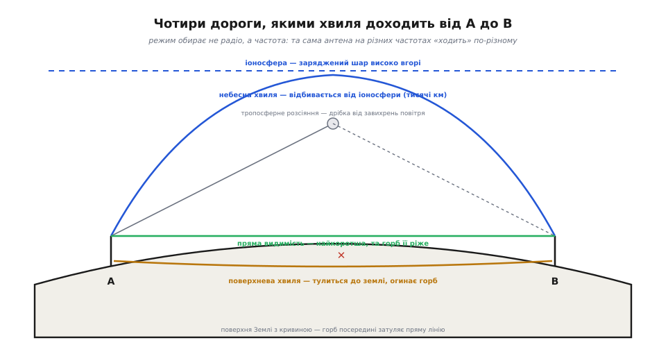
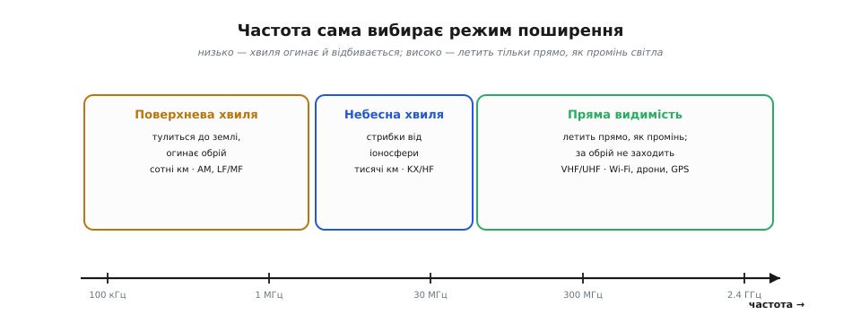
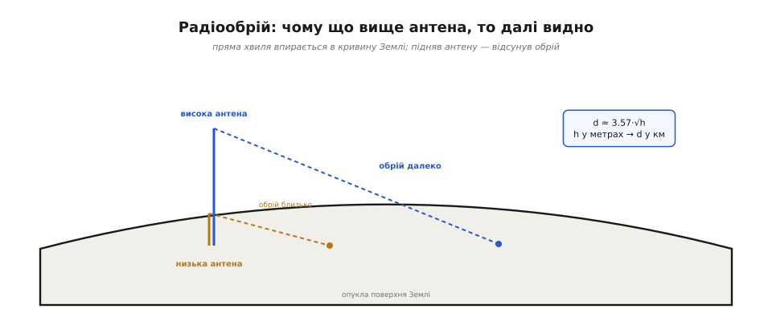
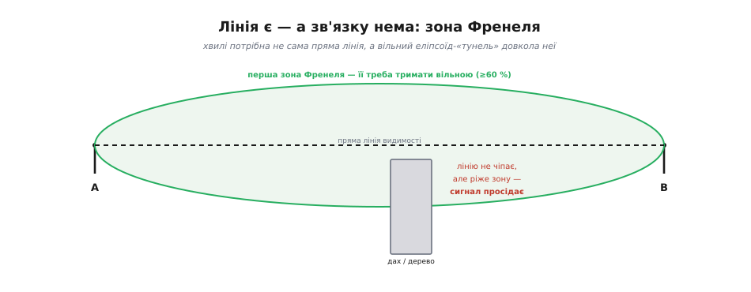

# Режими поширення радіохвиль

Коли ми складали [бюджет радіолінії](root:embedded/link-budget), один рядок ми взяли майже на віру — **втрати у просторі** `L_path`. Ми порахували їх так, ніби хвиля летить від передавача до приймача **єдиною прямою дорогою** крізь порожнечу. Для дрона над полем чи Wi-Fi у кімнаті це й справді так. Але варто рознести антени на десятки кілометрів — або просто опустити частоту — і виявляється, що дорога буває зовсім інша. Хвиля може **тулитися до землі** й заповзати за обрій. Може **відбитися від неба** й перестрибнути океан. Може просочитися крізь **завихрення повітря** туди, куди прямого шляху немає взагалі.

Те, **якою саме дорогою** хвиля йде від A до B, називають **режимом поширення** (англ. *propagation* — від лат. *propagare*, «поширювати, розводити»). І головна несподіванка цього кроку така: режим обирає **не інженер і не радіо, а частота**. Та сама антена, той самий передавач — на 100 кілогерцах і на 2.4 гігагерцах поведуться як два різні світи. Зрозумівши чому, ти перестанеш дивуватися, чому далекобійне «загоризонтне» радіо живе внизу спектра, а швидкий Wi-Fi і твій дрон — нагорі, і чому той самий рядок `L_path` для різних діапазонів треба рахувати геть по-різному.


*Та сама пара антен A і B, чотири різні дороги. Пряма видимість іде найкоротше, але впирається в горб земної кривини. Поверхнева хвиля тулиться до землі й огинає його. Небесна — стрибає від іоносфери. Тропосферне розсіяння ловить дрібку енергії, що відбилася від завихрень повітря високо вгорі. Яку дорогу обере хвиля — вирішує її частота.*

## Чому частота вирішує все

В основі всього — одна властивість хвилі, яку ми вже зустрічали, коли рахували [довжину антени](root:embedded/esp32-antenna): **довжина хвилі** λ обернено пов'язана з частотою через `λ = c / f`. Низька частота — це **довга** хвиля (на 100 кГц λ = 3 кілометри!), висока частота — **коротка** (на 2.4 ГГц λ = 12 сантиметрів). А від того, велика хвиля чи дрібна **порівняно з перешкодами на дорозі**, залежить геть усе.

Згадай, як поводиться звичайне світло — теж електромагнітна [хвиля](topic:ph-electromagnetism/em-wave), тільки з мікроскопічною λ. Світло йде **строго прямо** й кидає різку тінь: будь-яка перешкода більша за його крихітну довжину хвилі повністю його зупиняє. А тепер уяви морську хвилю за сотні метрів завдовжки — вона спокійно **огинає** палю чи буй, наче того й немає. Радіо вкладається між цими крайнощами, і місце на цій шкалі задає саме частота:

- **Довга хвиля (низька частота)** поводиться як морська: вона **більша за перешкоди**, тож огинає пагорби, будівлі, кривину землі. Вона «не помічає» дрібниць і заповзає в тінь.
- **Коротка хвиля (висока частота)** поводиться як світло: летить **прямо, як промінь**, і будь-яка перешкода — горб, будинок, обрій — кидає за собою радіотінь, у якій сигналу немає.

Ось чому говорити про режим поширення в відриві від частоти безглуздо. Не буває «доброго» чи «поганого» способу йти — буває **відповідність** частоти до задачі. Розгляньмо три головні режими в порядку від низу спектра до верху, і одразу стане видно, як кожен виростає з цього єдиного принципу.


*Шкала частот і три головні режими. Унизу (кілогерци й мегагерци) панує поверхнева хвиля — тулиться до землі, бере сотні кілометрів. Вище (короткі хвилі, KX/HF) вмикається небесна — стрибки від іоносфери на тисячі кілометрів. Від десятків мегагерц і вище (VHF/UHF, де живуть Wi-Fi, дрони, GPS) лишається тільки пряма видимість.*

## Поверхнева хвиля: тулитися до землі

На самому низу спектра — кілогерци й нижні мегагерци — хвиля така довга, що земля для неї перестає бути плоскою перешкодою й стає радше **напрямним рейсом**. Хвиля «прилипає» до поверхні й біжить уздовж неї, повторюючи рельєф і кривину планети, заповзаючи туди, куди прямого променя нема. Це **поверхнева хвиля** (англ. *ground wave*).

Механізм простий, якщо тримати в голові образ моря, що огинає палю. Довга хвиля **дифрагує** — згинається за край перешкоди, бо її розмір більший за саму перешкоду; земна кривина для неї — лише пологий згин, який вона легко обтікає. Водночас земля частково провідна, і нижній край хвилі, торкаючись її, трохи «гальмується» — фронт ніби перечіпляється за поверхню й нахиляється до неї, не даючи хвилі піти вгору. Разом це й тримає сигнал притиснутим до землі на сотні кілометрів.

Саме так працює знайоме **AM-радіо** в довго- і середньохвильовому діапазоні: вдень станцію чути за сотні кілометрів від міста, хоча жодної прямої видимості до вежі давно немає — сигнал прийшов **уздовж землі**, обігнувши обрій. Платня за дальність — крихітна швидкість: на таких низьких частотах фізично мало місця для даних (це той самий [обмін між смугою і швидкістю](topic:math-information/bandwidth-capacity), що ми бачили в бюджеті), тож поверхневою хвилею передають голос і телеграф, а не відео.

> 🔧 **Навіщо це.** У вбудованих системах поверхневою хвилею живуть [LPWAN](root:embedded/lpwan)-радіо на низьких суб-гігагерцових діапазонах (433/868 МГц — це вже не «класична» довга хвиля, але ефект притискання до землі частково лишається) і будь-яка задача «дотягтися за пагорб без вежі». Якщо в специфікації стоїть «зв'язок на десятки кілометрів по пересіченій місцевості без прямої видимості» — це натяк опускати частоту: що нижче, то краще хвиля огинає рельєф.

## Небесна хвиля: відбитися від неба

Підіймемося вище — у діапазон, який радисти звуть **короткими хвилями** (англ. *short waves*, ще KX/HF, *high frequency*, ~3–30 МГц). Тут хвиля вже надто коротка, щоб триматися землі: вона відривається й летить угору. І якби над нами була тільки порожнеча, на цьому історія й скінчилася б — сигнал пішов би в космос. Але високо вгорі, за сотню кілометрів, є **іоносфера** — шар, де сонячне випромінювання вибиває з атомів електрони й робить повітря частково зарядженим, провідним. Для коротких хвиль цей заряджений шар працює як **дзеркало**: хвиля, що летить угору під пологим кутом, не пробиває його, а **відбивається** назад до землі за тисячі кілометрів від передавача.

Тут і виникає **небесна хвиля** (англ. *sky wave*): сигнал стрибає вгору до іоносфери, вниз до землі, відбивається від землі знову вгору — і так «скаче», як камінець по воді, огинаючи всю опуклість планети. Саме так двоватний аматорський передавач у Києві дістає до Австралії: не пробиваючи кривину землі, а **перестрибуючи** її через небесне дзеркало.

Дзеркало це примхливе, і саме тут — найцікавіша фізика. Чи відіб'ється хвиля, залежить від **частоти й кута**. Занадто висока частота проб'є іоносферу наскрізь і втече в космос — є **гранична частота** (англ. *critical frequency*), вище якої дзеркало для прямовисного променя зникає. Вночі іоносфера слабшає (сонце її більше не «заряджає»), частина шарів зникає, і дальній зв'язок на одних частотах гасне, а на інших — навпаки оживає. Тому короткохвильовий зв'язок — це вічна гра з часом доби, сонячною активністю й вибором частоти.

> 🔧 **Навіщо це.** Для більшості вбудованих радіо (Wi-Fi, BLE, дрони на 2.4/5.8 ГГц) небесна хвиля **не працює зовсім** — на цих частотах хвиля давно пробиває іоносферу й летить у космос (інакше GPS-супутники просто не «світили» б нам крізь неї). Знати про неї треба з іншої причини: щоб **не покладатися** на неї там, де її немає, і щоб розуміти, чому «загоризонтні» далекобійні системи живуть унизу спектра, а не там, де хочеться більшої швидкості. Виняток — спеціалізовані KX/HF-модеми для зв'язку на тисячі кілометрів без супутника.

Те, як людство взагалі здогадалося про небесне дзеркало — окрема й гарна історія: вона почалася з загадкового сигналу через Атлантику, який за всіма розрахунками не мав долетіти. Коротко про неї — [у вставці про відкриття іоносфери](root:embedded/propagation-modes/hist-ionosphere-discovery.md).

## Пряма видимість: летіти, як промінь світла

А тепер — режим, у якому живе **майже вся наша вбудована техніка**. На частотах від десятків мегагерц і вище — VHF, UHF, гігагерци, де сидять Wi-Fi, BLE, дрони, GPS, мобільний зв'язок — хвиля стає такою короткою, що поводиться вже геть як світло. Землі вона не тримається (надто дрібна, щоб дифрагувати навколо кривини), від іоносфери не відбивається (пробиває її наскрізь). Лишається єдина дорога: **навпростець, по прямій, від антени до антени** — це **пряма видимість** (англ. *line-of-sight*, LOS, «лінія зору»).

Наслідок прямий і суворий: якщо між антенами стоїть щось непрозоре для радіо — горб, будинок, а на великій відстані й сама **кривина Землі** — за ним лягає **радіотінь**, і зв'язку немає. Хвиля не огинає перешкоду, як це робила поверхнева, і не перестрибує її, як небесна. Вона просто впирається. Звідси найважливіше практичне правило всього УКХ-радіо: **бачиш антену — є зв'язок; не бачиш — здебільшого ні**.

Це пояснює речі, які інакше здаються загадкою. Чому вежі стільникового зв'язку ставлять на дахах і пагорбах — щоб **піднести антену над перешкодами** й відсунути обрій. Чому дрон чудово керується, поки видно, і губиться, щойно зайде за будинок. Чому в бюджеті лінії для Wi-Fi ми сміливо брали один прямий шлях — бо на цих частотах іншого просто немає.

### Радіообрій: чому вище — далі

Якщо хвиля йде прямо, а Земля кругла, то дальність прямої видимості впирається в **обрій** — точку, де пряма від антени торкається опуклості планети. І звідси випливає просте, але потужне інженерне правило: **щоб бачити далі, підіймай антену вище**. Чим вище очко антени над землею, тим далі відсувається точка дотику — тим далі радіообрій.


*Опукла поверхня Землі. Низька антена «бачить» лише до близького обрію — пряма швидко впирається в кривину. Піднята антена сягає далі: точка дотику відсувається. Дальність до обрію росте як корінь із висоти — d ≈ 3.57·√h (h у метрах дає d у кілометрах).*

Відстань до радіообрію добре наближає проста формула. Вона виходить із геометрії дотичної до кулі (з невеликою поправкою на те, що повітря злегка **загинає** промінь донизу, тож радіо бачить трішки далі за око):

```
d ≈ 3.57 · √h
```

де `h` — висота антени над землею в метрах, `d` — дальність до обрію в кілометрах. Корінь означає важливе: **дальність росте повільніше за висоту** — щоб подвоїти обрій, антену треба підняти **вчетверо** вище. А повний просвіт між двома антенами — це сума їхніх обріїв: кожна тягнеться до своєї точки дотику назустріч іншій.

**Приклад (дальність прямої видимості для наземної станції й дрона).** Антена наземної станції на щоглі 10 м, дрон летить на висоті 100 м. На якій горизонтальній відстані вони ще «бачать» одне одного по прямій? Порахуймо обрій кожного й складімо:

:::tabs
```c
#include <math.h>

// Дальність до радіообрію (км) для антени на висоті h (метрів).
float radio_horizon_km(float h_m) {
    return 3.57f * sqrtf(h_m);
}

float d_ground = radio_horizon_km(10.0f);    // станція на щоглі 10 м
float d_drone  = radio_horizon_km(100.0f);   // дрон на висоті 100 м
float d_max    = d_ground + d_drone;         // повний просвіт між ними
// d_ground ≈ 11.3 км
// d_drone  ≈ 35.7 км
// d_max    ≈ 47.0 км
```
```python
from math import sqrt

# Дальність до радіообрію (км) для антени на висоті h (метрів).
def radio_horizon_km(h_m):
    return 3.57 * sqrt(h_m)

d_ground = radio_horizon_km(10.0)    # станція на щоглі 10 м
d_drone  = radio_horizon_km(100.0)   # дрон на висоті 100 м
d_max    = d_ground + d_drone        # повний просвіт між ними
# d_ground ≈ 11.3 км
# d_drone  ≈ 35.7 км
# d_max    ≈ 47.0 км
```
:::

Близько **47 кілометрів** — стільки дає сама геометрія прямої видимості. Далі за це антени ховаються одна від одної за кривиною, і навіть найкращий бюджет лінії з найчутливішим приймачем не допоможе: сигналу за обрієм фізично немає. Ось чому в реальних дронах висота польоту так впливає на дальність керування — піднявся вище, **відсунув обрій**.

> 🔧 **Навіщо це.** Це твій перший фільтр ще до бюджету лінії: спершу спитай «а чи є взагалі пряма видимість на потрібну відстань?». Якщо ні — жоден запас потужності не врятує, треба піднімати антену (щогла, ретранслятор, висота польоту) або міняти режим. Формула обрію дає миттєву прикидку: впиши висоти антен — і одразу видно стелю дальності. Для УКХ-зв'язку це часто важливіший обмежувач, ніж самі втрати в просторі.

### Зона Френеля: самої лінії замало

Тут чигає пастка, на якій спотикаються навіть досвідчені. Здавалося б: є пряма лінія між антенами, нічого її не перетинає — отже, зв'язок має бути ідеальний. Але на ділі сигнал часом помітно слабшає, хоча перешкода **прямої лінії й не торкається**. Чому?

Бо хвиля — це не нескінченно тонкий промінь. Вона займає **об'єм** довкола лінії видимості, і їй потрібен вільний не сам відрізок, а ціла сигароподібна зона навколо нього — **перша зона Френеля** (на честь французького фізика Оґюстена Френеля, *Augustin-Jean Fresnel*). Якщо в цю зону залазить дах, дерево чи пагорб — навіть не перекриваючи лінію, — частина хвилі, що йшла повз перешкоду, відбивається й приходить **не в лад** із прямою, гасячи її. Сигнал просідає, ніби з'явилися зайві втрати, яких у простому бюджеті ми не закладали.


*Між антенами A і B хвиля йде не тонкою лінією, а заповнює еліпсоїд — першу зону Френеля. Дах чи дерево можуть не перетинати прямої лінії видимості, але якщо вони ріжуть цей «тунель», сигнал помітно слабшає. Практичне правило: тримати вільними щонайменше ~60 % радіуса першої зони.*

Зона найтовща **посередині** прольоту й звужується до антен. Її радіус росте з відстанню й довжиною хвилі: що далі лінія й що нижча частота — то товщий потрібен «тунель». Звідси практичне правило радіоінженера: для надійного зв'язку треба тримати вільними **щонайменше ~60 %** радіуса першої зони. Саме тому антени радіомостів задирають на щогли вище за крони дерев — не лише щоб «бачити» поверх них, а щоб лісосмуга чи дах не різали зону Френеля.

> 🔧 **Навіщо це.** Коли ставиш точку-точку лінк (два будинки, база й вишка), мало пересвідчитися, що антени «бачать» одна одну. Прикинь радіус першої зони посередині прольоту й переконайся, що в неї не лізуть дерева, дахи, рельєф — інакше отримаєш просідання сигналу, яке бюджет лінії «не пояснить». Це найчастіша причина, чому лінк, що «за розрахунком мав працювати», на ділі ледь тягне.

## Тропосферне розсіяння: четверта дорога

Лишається режим-курйоз, який варто знати, щоб картина була повна. Він показує, що навіть за обрієм, де ні поверхневої, ні небесної хвилі немає, дорога все ж є — нехай і кепська. Це **тропосферне розсіяння** (англ. *tropospheric scatter*, від назви нижнього шару атмосфери — тропосфери).

Ідея така. **Тропосфера** — нижні десяток-другий кілометрів повітря — ніколи не буває однорідною: у ній постійно вирують області з трохи різною температурою, вологістю, густиною. Кожне таке завихрення трішки **заломлює** радіохвилю, що крізь нього проходить, і **дрібка** енергії розсіюється навсібіч — зокрема й донизу, **за обрій**. Майже вся хвиля летить далі прямо й гине в космосі; але якщо націлити обидві антени в спільний об'єм тропосфери високо над горизонтом, та крихітна розсіяна частка дозволяє зв'язатися на сотні кілометрів **поза прямою видимістю**.

Платня величезна: оскільки корисна лише дрібка енергії, потрібні **дуже потужні** передавачі й **великі** антени-тарілки. Тому тропосферне розсіяння ніколи не було масовим — це доля спеціальних загоризонтних ліній (військових, для зв'язку з віддаленими радарами), а не вбудованих пристроїв. Для нас це радше повчальний приклад: він показує, що «режим поширення» — не жорсткий список із трьох пунктів, а наслідок фізики хвилі та середовища, де завжди знайдеться ще якась лазівка, питання лише її ціни.

## Як це лягає в бюджет лінії

Тепер замкнімо коло й повернімося до того рядка `L_path`, з якого почали. Режим поширення — це і є відповідь на питання, **як саме рахувати ті втрати в просторі**, бо для кожної дороги вони рахуються по-різному:

- **Пряма видимість** — найпростіший і найчистіший випадок: втрати близькі до [вільного простору](topic:com-medium/free-space-loss), як ми й брали в бюджеті, **плюс** перевірка двох умов: чи є взагалі просвіт до обрію і чи вільна зона Френеля. Це режим майже всієї нашої техніки.
- **Поверхнева хвиля** — втрати залежать від провідності ґрунту й рельєфу; дальність велика, але ціна — низька частота й крихітна швидкість.
- **Небесна хвиля** — взагалі не вписується в простий бюджет: дальність задає капризне небесне дзеркало, що залежить від частоти, часу доби й сонця.

І ще одне, що пов'язує цей крок із попередніми. Коли хвиля йде до приймача **не однією дорогою, а кількома** — частина прямо, частина відбившись від землі, стіни, будівлі, — копії складаються то в лад, то в протифазу, і сигнал «дихає». Це [багатопроменеве завмирання](topic:com-medium/multipath-fading), через яке ми й закладали в бюджет запас на завмирання. Тепер видно його корінь: різні шляхи — це, по суті, **мікроверсія** того самого вибору дороги, тільки в межах однієї кімнати чи вулиці. Режими поширення й завмирання — це той самий принцип «хвиля йде не там, де ми думаємо» на двох масштабах: від кімнати до планети.

Опанувавши режими, ти дивишся на будь-яку радіозадачу інакше. Спершу — **яка частота й, отже, який режим**: чи долетить хвиля прямо, чи треба огинати, чи відбивати. Тоді — **чи є дорога** взагалі: просвіт до обрію, вільна зона Френеля. І аж потім — звичний [бюджет лінії](root:embedded/link-budget): чи вистачить потужності пройти цю конкретну дорогу із запасом. Це і є інженерне мислення про поширення: не «спробуймо й побачимо, чи добиває», а «розберімо, **якою дорогою** піде хвиля, і чи ця дорога взагалі існує».
