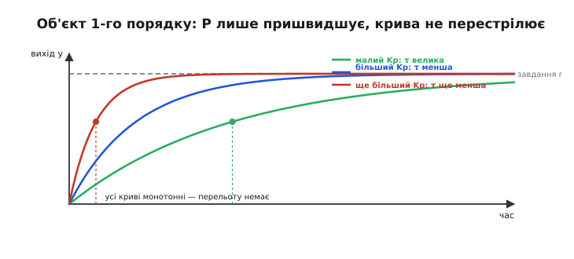
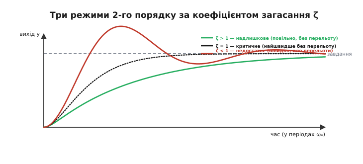

# 🧮 Динаміка замкненого контуру з чистим P

> У самій темі ми дивилися на пропорційний регулятор у **застиглому кадрі**: де він спиниться, який лишить сталий зсув. Але половина його характеру — не в тому, **де** він завмирає, а в тому, **як** туди йде: повзе ліниво, підходить рівно чи проскакує й гойдається. Це вже не алгебра рівноваги, а **динаміка** — рух у часі. Тут ми запишемо цей рух рівнянням і побачимо строго, від першопричини, дві речі, які в темі лише проголошено. Перше: на найпростішому об'єкті P **не вміє** перестрілювати — хоч як крути Kp, крива завжди монотонна. Друге: на об'єкті з інерцією той самий P **раптом** починає гойдатися, і ми виведемо точний поріг, за яким це стається, та рецепт, як його оминути. Апарат — диференціальні рівняння першого й другого порядку та їхні корені; нічого важчого.

Наскрізна думка одна, і варто взяти її з собою від початку: **долю замкненого контуру вирішують корені його характеристичного рівняння.** Де вони лежать — те й буде: дійсний від'ємний корінь дає плавне сповзання до цілі, пара комплексних — коливання, корінь із додатною дійсною частиною — рознос. Уся ця вставка — про те, як пропорційний регулятор **переставляє** ці корені, і чому на об'єкті першого порядку він фізично не може загнати їх у коливальний куток, а на другому — може, і то легко.

## Що взагалі означає «замкнути контур» у рівнянні

Спершу домовмося про сам об'єкт — те, чим регулятор керує. Рівновагу об'єкта ми вже описували одним числом, статичним підсиленням K: скільки сталого виходу дає одиниця сталого впливу. Але «скільки виходу **зрештою**» — це лише кінцева точка; щоб говорити про рух, треба сказати, **як швидко** вихід туди йде. Найпростіша чесна модель динаміки — **об'єкт першого порядку**: такий, що має один спосіб накопичувати — одну «пам'ять» у вигляді запасеної величини (тепло в тілі, заряд на конденсаторі, оберти маси проти тертя), і та величина не стрибає вмить, а повзе до нового рівня з певною **сталою часу** τ.

Записується це одним диференціальним рівнянням. Вихід y, вплив u, і швидкість зміни виходу тим більша, чим далі y від того рівня, який u «замовляє»:

```
 τ · dy/dt = −y + K · u        (об'єкт 1-го порядку, розімкнений)
```

Прочитаймо його очима, а не символами. Ліворуч — швидкість зміни виходу, помножена на сталу часу. Праворуч — «тяга до рівноваги»: доданок `−y` тягне вихід донизу (сам по собі об'єкт розсіює запас — гаряче тіло стигне, заряд стікає), а `K·u` підпихає вгору рівно настільки, скільки замовив вплив. Коли ці двоє зрівноважуються (`dy/dt = 0`), маємо `y = K·u` — рівно ту статичну картину, з якою ми вже знайомі. А стала τ каже, **як довго** триває підхід: за один τ вихід долає близько 63 % відстані до нового рівня, за три-чотири τ — практично весь шлях. Це та сама [стала часу, що й у RC-ланки](book:electronics/rc-time-constant): напруга на конденсаторі так само підповзає до живлення по експоненті, і τ = R·C міряє її неквапність.

> 🔧 **Навіщо це.** τ — це «інерція» вашого об'єкта, і знати її треба **до** будь-якого налаштування регулятора. Нагрівач із товстою чавунною плитою має τ у хвилини; маленький транзистор — у мілісекунди; крен легкого дрона — у десяті частки секунди. Регулятор не може бути швидшим за фізику об'єкта задарма: якщо τ велика, ніякий Kp не змусить вихід стрибнути вмить — він лише зробить підхід крутішим. Виміряти τ (штовхнути об'єкт і засікти, за скільки він пройде 63 % відстані) — перший крок, з якого починається розумне керування.

Тепер **замкнемо** контур. Регулятор дає `u = Kp·e`, помилка `e = r − y`. Підставмо це в рівняння об'єкта — і подивімося, що станеться з його динамікою:

```
 τ · dy/dt = −y + K · Kp · (r − y)
```

Розкриємо дужку й зберемо всі y ліворуч:

```
 τ · dy/dt = −y + K·Kp·r − K·Kp·y
 τ · dy/dt + y·(1 + K·Kp) = K·Kp·r
```

Поділимо все на `(1 + K·Kp)`, щоб рівняння знову набуло знайомої форми «стала часу · похідна + вихід = щось стале»:

```
 [τ / (1 + K·Kp)] · dy/dt + y = [K·Kp / (1 + K·Kp)] · r
```

І ось у цьому рядку — уся суть. Замкнений контур **знову** описується рівнянням першого порядку тієї самої форми, що й голий об'єкт, — але з **іншими** числами. Порівняймо коефіцієнт біля похідної: був `τ`, став `τ/(1 + K·Kp)`. Це і є **стала часу замкненого контуру**:

```
 τ_замкн = τ / (1 + K·Kp)
```

## Перше відкриття: P пришвидшує, але не гойдає

Формула `τ_замкн = τ/(1 + K·Kp)` каже дивовижно багато. Знаменник `1 + K·Kp` завжди більший за одиницю (Kp додатний, K додатний), тож `τ_замкн` **завжди менша** за τ — і то тим менша, чим сильніший регулятор. Замкнувши контур пропорційним регулятором, ми **пришвидшили** об'єкт: він тепер підходить до нового стану крутіше, ніж підходив сам собою. Подвоїли `K·Kp` — приблизно вдвічі скоротили час підходу. Це чистий виграш у швидкодії, і дається він самим лише P.


*Об'єкт першого порядку під пропорційним регулятором. Що більший Kp, то менша стала часу замкненого контуру τ_замкн = τ/(1+K·Kp) і крутіший підхід до завдання. Але форма кривої не міняється — це завжди та сама затухна експонента, і жодна крива не проскакує рівень. Пропорційний регулятор на такому об'єкті тільки пришвидшує рух, а перестрілити не здатний у принципі.*

Тепер — головне, друге, що ховається в тій самій формі. Рівняння замкненого контуру лишилося **першого порядку**. А розв'язок будь-якого лінійного рівняння першого порядку — це завжди та сама **затухна експонента**: вихід монотонно, без жодного перегину, підповзає до свого кінцевого рівня, як `1 − e^(−t/τ_замкн)`. Формально це видно з характеристичного кореня. Візьмімо вільний рух (r = 0, дивимось лише на власну динаміку) і за звичкою [лінійних диференціальних рівнянь](book:math/exponential-ode) шукаймо розв'язок у вигляді `y = e^(s·t)` — тоді `dy/dt = s·e^(s·t)`, і рівняння `τ_замкн·(dy/dt) + y = 0` згортається в алгебру:

```
 τ_замкн · s + 1 = 0     ⟹     s = −1 / τ_замкн = −(1 + K·Kp) / τ
```

Корінь **один** (рівняння першого степеня), він **дійсний** і **від'ємний**. Один-єдиний дійсний корінь не вміє породити коливання: `e^(s·t)` при від'ємному дійсному s — це просто згасання, без жодного гойдання. Щоб крива могла перестрілити й піти назад, потрібне синусоїдальне «дихання» в розв'язку, а воно з'являється **лише** з пари комплексних коренів — а їх дає тільки рівняння **другого** (чи вищого) степеня. Тож ось строгий висновок, який у темі стояв як твердження: **на об'єкті першого порядку чистий пропорційний регулятор не може перестрілити ціль, хоч би яким великим був Kp.** Він робить корінь дедалі «глибшим» (s їде далі вліво по дійсній осі, підхід крутішає), але корінь лишається один і лишається дійсним — коливанням просто нізвідки взятися.

Зверніть увагу, як це узгоджується з картиною зі самої теми — трьома кривими, де великий Kp розгойдував систему. Ніякого протиріччя: ті криві малювали об'єкт **із інерцією** — тобто не першого, а **другого** порядку (маса, що має і положення, і швидкість). Саме інерція додає другу пам'ять, другий корінь — і аж тоді P дістає змогу перестрілювати. Об'єкт першого порядку такої змоги йому не дає. Це важлива й часто недооцінена річ: **чи буде P гойдати, вирішує не сам регулятор, а порядок об'єкта.** Термостат на добре перемішаній воді (один порядок) під чистим P ніколи не задзвенить; той самий P на масі з малим тертям — залюбки.

> 🔧 **Навіщо це.** Перш ніж боятися коливань, спитайте, **скільки пам'яті** у вашого об'єкта. Якщо він по суті першого порядку — одна ємність, одна теплова маса, добре загашена вісь, — можете сміливо піднімати Kp заради швидкодії: перестрілу не буде, лишиться хіба сталий зсув, та й той меншатиме. Небезпека коливань з'являється, аж коли в контурі набирається **дві** й більше інерційних ланок (об'єкт плюс давач із запізненням, плюс фільтр) — тоді порядок росте, і P уже може розгойдати. Класифікувати об'єкт за порядком — найдешевший спосіб наперед знати, чого від нього чекати.

Тут-таки причаїлася й межа цього виграшу — та, що поверне нас до зсуву. Ми пришвидшили об'єкт, але подивімося на кінцевий рівень замкненої системи, на коефіцієнт біля r: він `K·Kp/(1 + K·Kp)`, а не одиниця. Тобто на стале завдання r вихід сідає не на r, а трохи нижче — рівно на `r·K·Kp/(1+K·Kp)`, лишаючи недобір `r/(1+K·Kp)`. Це той самий сталий зсув, тепер побачений з боку динаміки: пропорційний регулятор міняє **сталу часу** й **кінцевий рівень** тим самим множником `1+K·Kp`, і хоч як його роздувай, кінцевий рівень лише **прямує** до завдання, не досягаючи його. Швидкодію P дарує безкоштовно, а от точність — ні; за точністю доведеться йти до [інтегральної складової](root:embedded/integral-control).

## Об'єкт з інерцією: звідки беруться коливання

Тепер піднімемося на порядок вище — до об'єкта, який має **дві** пам'яті, і подивимося, як на ньому народжується те, чого об'єкт першого порядку дати не міг. Найчистіший приклад — **обертова маса**, бо саме її стабілізує польотний контролер, тримаючи крен чи тангаж дрона. У маси є два незалежні запаси: її **положення** (кут) і її **швидкість** (як швидко кут міняється). Друга пам'ять — швидкість — і є та інерція, що все змінить.

Другий закон Ньютона для обертання читається так само, як для прямого руху, тільки «маса» стає **моментом інерції** J, сила — **моментом** (крутним зусиллям), а прискорення — кутовим. Хай кут виходу — y, момент інерції — J, а на осі є ще й **загасання** (в'язке тертя, опір повітря, електричне гальмування мотора) з коефіцієнтом b, що протидіє швидкості. Тоді

```
 J · d²y/dt² = момент від регулятора − b · dy/dt
```

Тут `d²y/dt²` — кутове прискорення (друга похідна кута), `b·dy/dt` — гальмівний момент, пропорційний швидкості. Це рівняння **другого** порядку — у ньому стоїть друга похідна, бо станів тепер два. Замкнемо контур пропорційним регулятором: він міряє помилку кута `e = r − y` і видає момент `Kp·e`. Задля чистоти візьмімо завдання нульове (тримати рівень, r = 0, тоді e = −y) — так найкраще видно власну динаміку:

```
 J · d²y/dt² = Kp · (r − y) − b · dy/dt
```

Зберемо все ліворуч у канонічну форму рівняння другого порядку:

```
 J · d²y/dt² + b · dy/dt + Kp · y = Kp · r
```

Порівняймо з рівнянням першого порядку — різниця вирішальна. Там була одна похідна й один корінь; тут **дві** похідні, отже характеристичне рівняння буде **квадратним**, а квадратне вміє те, чого лінійне не вміло: мати **пару комплексних коренів**. А комплексні корені, як ми домовилися на початку, — це і є справжні гладкі коливання. Пропорційний регулятор на об'єкті з інерцією дістав інструмент, якого не мав на об'єкті першого порядку.

## Стандартна форма: ωₙ і ζ

Перш ніж розв'язувати, зведімо рівняння до вигляду, у якому вся інженерія читається з першого погляду. Поділимо `J·d²y/dt² + b·dy/dt + Kp·y = Kp·r` на J:

```
 d²y/dt² + (b/J) · dy/dt + (Kp/J) · y = (Kp/J) · r
```

Кожен коефіцієнт тут має глибокий фізичний сенс, і історично рівняння другого порядку заведено писати в **стандартній формі**, де ці сенси винесені назовні двома числами:

```
 d²y/dt² + 2·ζ·ωₙ · dy/dt + ωₙ² · y = ωₙ² · r
```

Зіставивши два останні рядки член у член, дістаємо обидва числа через параметри нашого контуру. Коефіцієнт біля y дає `ωₙ² = Kp/J`, звідки

```
 ωₙ = √(Kp / J)              (власна частота)
```

**Власна частота** ωₙ (англ. *natural frequency* — власна, природна частота) — це темп, з яким система коливалася б, якби загасання не було зовсім (b = 0): чисто пружний маятник «кут проти відновлювального моменту Kp». Вона росте як **корінь із Kp**: учетверо тугіший регулятор дає вдвічі швидші власні коливання. Це вже саме по собі промовисто — **пропорційний коефіцієнт задає частоту**, на якій контур схильний дзвеніти.

Друге число дістаємо, прирівнявши коефіцієнти біля першої похідної: `2·ζ·ωₙ = b/J`. Підставимо сюди `ωₙ = √(Kp/J)` і виразимо ζ:

```
 2·ζ·√(Kp/J) = b/J
 ζ = b / (2·J·√(Kp/J)) = b / (2·√(Kp·J))
```

тобто

```
 ζ = b / (2·√(Kp · J))       (коефіцієнт загасання)
```

**Коефіцієнт загасання** ζ (грец. літера «дзета»; англ. *damping ratio* — відношення загасання) — безрозмірне число, що каже, наскільки сильно система гасить свої власні коливання **відносно** того, скільки їх треба, щоб їх узагалі не було. Це найважливіша характеристика будь-якої системи другого порядку, і саме її значення відносно одиниці розділяє три якісно різні режими руху. Але спершу — ключове спостереження, заради якого все й затівалося.

Придивімося, **як ζ залежить від Kp**. Загасання b і момент інерції J — це фізика об'єкта, вони задані. Регулятор крутить лише Kp, а він стоїть у **знаменнику під коренем**:

```
 ζ = b / (2·√(J)) · (1/√Kp)     ⟹     ζ ~ 1 / √Kp
```

Ось воно, серце всієї динаміки чистого P на інерційному об'єкті: **загасання обернено пропорційне кореню з Kp.** Що сильніший регулятор, то **менше** загасання — то ближче система до дзвінких, погано гашених коливань. Це прямий математичний доказ компромісу «швидше проти стійкіше» зі самої теми: піднімаючи Kp заради швидкодії (більша ωₙ), ви **невідворотно** з'їдаєте загасання (менша ζ). Дві цілі не просто конфліктують випадково — вони пов'язані однією формулою, у якій той самий Kp тягне ωₙ вгору, а ζ вниз. Одним пропорційним коефіцієнтом обидва числа незалежно не задати: обрав ωₙ — ζ уже визначилося, і навпаки.

> 🔧 **Навіщо це.** Ця пара `(ωₙ, ζ)` — універсальна мова, якою інженери описують **будь-який** контур другого порядку, від підвіски авто до стабілізатора напруги. ωₙ каже «як швидко», ζ — «наскільки охайно». Побачивши в даташиті чи в статті «ζ = 0.7, ωₙ = 30 рад/с», ви одразу знаєте характер системи, навіть не бачачи схеми. І головне для налаштування: якщо чистим P ви ніяк не дістаєте водночас і швидкості, і гладкості — це не ваша невдача, а `ζ ~ 1/√Kp` в дії. Розв'язати цей вузол одним Kp неможливо; потрібне окреме гальмо, чутливе до швидкості, — [диференційна складова](root:embedded/derivative-control), яка додає до чисельника ζ доданок і дає підняти Kp, не втративши загасання.

## Характеристичне рівняння та його корені

Тепер розв'яжімо — знайдімо корені й побачимо три режими на власні очі. Беремо вільний рух (r = 0) стандартної форми й шукаємо розв'язок як `y = e^(s·t)`. Тоді `dy/dt = s·e^(s·t)`, `d²y/dt² = s²·e^(s·t)`, і після скорочення `e^(s·t)` рівняння перетворюється на **характеристичне**:

```
 s² + 2·ζ·ωₙ · s + ωₙ² = 0
```

Це звичайне квадратне рівняння відносно s; його два корені — за шкільною формулою:

```
 s = −ζ·ωₙ ± ωₙ·√(ζ² − 1)
```

Уся доля системи — у цьому виразі, а точніше — у **знаку підкореневого** `ζ² − 1`. Саме він вирішує, будуть корені дійсні чи комплексні, тобто чи гойдатиметься система. Розберімо три випадки — рівно ті три, що в темі показані трьома кривими.

**Надлишкове загасання (ζ > 1).** Підкореневий додатний, `√(ζ²−1)` — дійсне число, менше за ζ. Обидва корені **дійсні й від'ємні**:

```
 ζ > 1:   s₁ = −ζ·ωₙ + ωₙ·√(ζ²−1),   s₂ = −ζ·ωₙ − ωₙ·√(ζ²−1)      (обидва < 0)
```

Два дійсні від'ємні корені — це сума двох затухних експонент, **без жодного коливання**. Система повзе до цілі повільно, як перегашений маятник у густому сиропі: тим повільніше, чим більший ζ (один із коренів, `s₁`, підходить до нуля й задає млявий «хвіст»). Це режим «надійно, але ліниво». У нашому P-контурі він відповідає **малому Kp** — бо `ζ ~ 1/√Kp`, і мале Kp дає велике ζ.

**Критичне загасання (ζ = 1).** Підкореневий рівно нуль, `√0 = 0`, і два корені **зливаються в один подвійний**:

```
 ζ = 1:   s₁ = s₂ = −ωₙ         (подвійний дійсний корінь)
```

Це особлива, гранична точка: система підходить до цілі **найшвидше з можливого без перельоту**. Ще трохи менше загасання — і почнуться коливання; ще трохи більше — і рух стане мляво повзти. Критичне загасання — золота середина для всього, що має спинитися швидко й без відскоку: доводчик дверей, стрілка приладу, підвіска. Значення Kp, що дає рівно ζ = 1, знайдемо нижче — це і буде рецепт.

**Недостатнє загасання (ζ < 1).** Підкореневий **від'ємний**, і `√(ζ²−1)` стає уявним. Запишемо `√(ζ²−1) = i·√(1−ζ²)` (де i — уявна одиниця з [комплексних чисел](book:math/complex-numbers)) — і корені перетворюються на **комплексну спряжену пару**:

```
 ζ < 1:   s = −ζ·ωₙ ± i·ωₙ·√(1−ζ²)
```

Ось вони, коливання. Дійсна частина `−ζ·ωₙ` — **від'ємна** (поки ζ > 0), і вона задає **швидкість згасання** обвідної: чим більша за модулем, тим швидше коливання затухають. Уявна частина `ωₙ·√(1−ζ²)` — це **частота реальних коливань** ω_d (трохи нижча за власну ωₙ, бо загасання їх сповільнює). Розв'язок має вигляд `e^(−ζ·ωₙ·t)·cos(ω_d·t + …)` — синусоїда під затухною обвідною: система проскакує ціль, вертається, знову проскакує вже менше — і так, дедалі слабше, доки не заспокоїться. Це режим **великого Kp** (мале ζ), той самий, що в темі «стрімко кидається, перестрілює й довго розгойдується».


*Як пропорційний коефіцієнт водить корені по s-площині. Уся ліва (зелена) півплощина — стійкість: там дійсна частина від'ємна, рух згасає. За малого Kp корені дійсні й сидять на осі (надлишкове загасання, без коливань). Зі зростанням Kp вони сунуться назустріч і за Kp = b²/4J зливаються в подвійний корінь (критичне загасання). Далі відриваються від осі й розходяться вгору-вниз уздовж вертикалі Re = −b/2J — це комплексна пара, тобто коливання. Дійсна частина при цьому лишається сталою (−b/2J), а росте лише уявна: більший Kp не пришвидшує згасання, а тільки піднімає частоту гойдання. Ось чому самим P коливання не приборкати — корінь тікає вгору, а не вліво.*

Ця картинка приховує ще один тонкий, але важливий урок — придивіться до траєкторії червоних коренів. Коли корені вже комплексні, їхня **дійсна частина** застигає на `−ζ·ωₙ = −b/(2J)` — сталій, що **не залежить від Kp** узагалі (Kp скоротився!). Отже, підіймаючи Kp у коливальному режимі, ви **не пришвидшуєте згасання** обвідної ні на крихту — ви лише **піднімаєте частоту** коливань (уявну частину). Система дзвенить дедалі вище, але заспокоюється за той самий час. Це остаточний вирок спробі «продавити» гарну поведінку самим пропорційним коефіцієнтом: за порогом критичного загасання Kp керує вже тільки частотою дзвону, а не його тривалістю. Швидкість затухання в цьому режимі задає **виключно** фізичне загасання b об'єкта — і щоб її збільшити, потрібне штучне загасання від регулятора, тобто знову-таки [диференційна складова](root:embedded/derivative-control), яка зсуває корені вліво.

## Рецепт: обрати Kp під бажане загасання

Тепер обернімо задачу. Досі ми питали «що зробить заданий Kp»; інженерові частіше треба навпаки — **який Kp дасть бажаний характер руху**. Оскільки характер задає ζ, а ми маємо точну формулу `ζ = b/(2·√(Kp·J))`, лишається розв'язати її відносно Kp. Піднесімо до квадрата:

```
 ζ² = b² / (4·Kp·J)
```

і виразімо Kp:

```
 Kp = b² / (4·ζ²·J)
```

Ось прямий рецепт: **задавши бажане загасання ζ, отримуєш потрібний Kp однією формулою.** Обернена квадратична залежність від ζ у ній — та сама `ζ ~ 1/√Kp`, тільки прочитана з іншого боку: хочеш **удвічі** менше загасання (гостріший, швидший, але дзвінкіший відгук) — постав **учетверо** більший Kp.

Три опорні точки цього рецепта варто тримати в голові:

```
 ζ = 1    (критичне, найшвидше без перельоту):   Kp = b² / (4·J)
 ζ = 0.7  (класичний компроміс, ~5 % перельоту):  Kp = b² / (4·0.49·J) ≈ b² / (1.96·J)
 ζ = 0.5  (жвавіше, ~16 % перельоту):             Kp = b² / (4·0.25·J) = b² / J
```

Значення `ζ ≈ 0.7` інженери люблять недарма: воно дає найшвидший вихід на завдання з **прийнятним** (близько 5 %) перельотом і добрим запасом стійкості — золотий баланс між «ліниво» й «дзвінко». Для нашого дрона це означало б навмисно **недогасити** контур крену до ζ ≈ 0.7 заради жвавості, свідомо змирившись із крихітним перельотом.


*Три режими за коефіцієнтом загасання ζ — три обличчя того самого контуру за різного Kp. Надлишкове (ζ > 1, малий Kp) — вихід повзе до завдання повільно, без перельоту. Критичне (ζ = 1) — найшвидший підхід, який іще не перестрілює. Недостатнє (ζ < 1, великий Kp) — вихід стрімко кидається до цілі, проскакує її й гойдається дедалі слабше, поки не заспокоїться. Рецепт Kp = b²/(4·ζ²·J) дозволяє свідомо поставити систему в будь-яку з цих точок.*

**Пропорційне керування креном дрона: рахунок від початку до кінця.** Нехай момент інерції апарата навколо осі крену J = 0.02 кг·м², а сумарне загасання (аеродинамічне плюс електричне гальмування моторів) b = 0.12 Н·м·с/рад. Питання: який Kp дасть критичне загасання, і що буде за вдвічі більшого Kp?

```c
// розрахунок Kp для контуру крену (наземна прикидка перед польотом)
float J = 0.02f;                 // момент інерції по крену, кг·м²
float b = 0.12f;                 // коефіцієнт загасання, Н·м·с/рад

// критичне загасання ζ = 1:
float Kp_crit = (b * b) / (4.0f * J);      // = 0.0144 / 0.08 = 0.18
// власна частота на цьому Kp:
float wn = sqrtf(Kp_crit / J);             // = √(0.18/0.02) = √9 = 3.0 рад/с
```

```
 Критичне загасання (ζ = 1):
   Kp = b²/(4·J) = 0.12²/(4·0.02) = 0.0144/0.08 = 0.18
   ωₙ = √(Kp/J)  = √(0.18/0.02)   = √9 = 3.0 рад/с
   → крен виходить на рівень за ~1.5 с (кілька 1/ωₙ), без перельоту.

 Удвічі більший Kp = 0.36:
   ζ  = b/(2·√(Kp·J)) = 0.12/(2·√(0.36·0.02)) = 0.12/(2·0.0849) ≈ 0.71
   ωₙ = √(0.36/0.02) = √18 ≈ 4.24 рад/с
   → швидше (більша ωₙ), але вже з ~4–5 % перельотом (ζ впало до 0.7).

 Ще вдвічі, Kp = 0.72:
   ζ  = 0.12/(2·√(0.72·0.02)) = 0.12/(2·0.120) = 0.50
   → помітний переліт ~16 %; далі нарощувати Kp — множити дзвін.
```

Числа промовляють самі: подвоєння Kp щоразу підіймає ωₙ у √2 разів (швидше) і ділить ζ на √2 (дзвінкіше) — точно як велить `ωₙ ~ √Kp` і `ζ ~ 1/√Kp`. Пропорційним коефіцієнтом ми возимо систему по цій єдиній доріжці «швидше ⇄ дзвінкіше» і зійти з неї не можемо: щоб мати водночас і високу ωₙ, і пристойне ζ, доведеться додати регулятору чутливість до **швидкості** помилки.

> 🔧 **Навіщо це.** Формула `Kp = b²/(4·ζ²·J)` — це відправна точка налаштування **з голови, а не наосліп**. Знаєте (хоч би грубо) момент інерції та загасання свого об'єкта — прикиньте Kp під бажане ζ ще до першого ввімкнення, і ви стартуєте не з випадкового числа, а з осмисленого. Далі підправите на живому апараті, але вже в правильному околі. І пам'ятайте зворотний бік: якщо загасання b вашого об'єкта мале (легкий дрон, майже без тертя), то й Kp для пристойного ζ вийде малим — а отже, і ωₙ низькою, і контур млявим. Мала природна демпфованість — сигнал, що самим P не обійтися й час думати про [диференційну складову](root:embedded/derivative-control) або [повне налаштування ПІД](root:embedded/pid-tuning-cascade).

## Де ховається межа розносу

Уважний читач помітив: у формулі `s = −ζ·ωₙ ± …` дійсна частина від'ємна, **поки ζ > 0**, тобто поки є хоч якесь загасання b. Виходить, наш P-контур на масі з тертям **стійкий за будь-якого Kp** — корені ніколи не переходять у праву півплощину, лише піднімаються вгору вздовж вертикалі. То звідки ж береться рознос, яким лякає [тема стійкості](root:embedded/loop-stability)?

Відповідь чесна й важлива: рознос береться з того, чого ми в цій моделі **навмисне не врахували** — із **запізнення**. Наш об'єкт другого порядку відгукується хоч і з інерцією, але **миттєво** реагує на команду: момент прикладається до маси без затримки. У реальному контурі між помилкою й дією завжди є лаг — давач усереднює, обчислення триває такт, мотор розганяється не вмить. Кожна така ланка додає системі **ще порядок** (ще корені) і **фазове відставання**, а от воно вже здатне винести корені за уявну вісь. Тобто ідеальний P на чистому об'єкті другого порядку справді не зривається — але щойно ми додамо реалістичне запізнення (третій порядок і вище), картина зміниться, і достатньо великий Kp пожене корені праворуч, у рознос. Механізм цього — накопичення фази до 180° на частоті, де підсилення ще більше одиниці — розібрано окремо в [запасі стійкості](root:embedded/loop-stability); там межу видно з боку частоти, а не коренів, але це дві мови про те саме.

Отже, наша модель другого порядку — правдива, але **оптимістична**: вона чесно показує коливання й загасання, та не показує зриву, бо в ній немає затримки. Це корисне спрощення: воно дає точні ωₙ і ζ і всю інтуїцію про «швидше ⇄ дзвінкіше», а про рознос чесно каже «за цією межею мене вже мало — питай модель із запізненням». Тримати в голові, **що саме** твоя модель не враховує, — така сама частина інженерної чесності, як і вміння її розв'язати.

## Місток до дискретної реалізації

Усе вивдене жило в **неперервному** часі — плавні похідні, гладкі експоненти. Але в мікроконтролері регулятор працює **тактами**: щоцикл прочитав давач, порахував `u = Kp·e`, видав — і чекає наступного такту. Постає питання, чи не ламає ця «нарізка» часу все, що ми з'ясували.

Відповідь: поки такт **набагато частіший** за динаміку об'єкта (крок Δt значно менший за τ_замкн чи за період власних коливань 2π/ωₙ), дискретна реалізація майже точно повторює неперервну — ті самі τ_замкн, ωₙ, ζ, ті самі три режими. Неперервна модель — це просто границя дискретної за нескінченно частого такту, і на практиці кількадесят тактів на один період коливань уже роблять різницю несуттєвою. Це головна причина, чому неперервний аналіз, який ми тут провели, лишається робочим інструментом навіть для цифрового регулятора: він дає правильні числа й правильну інтуїцію, а такт лише має бути досить частим.

А от коли такт стає **рідким** — порівнянним із динамікою об'єкта, — з'являються суто дискретні явища, яких у неперервній картині немає: сама по собі **дискретизація** вносить додаткове запізнення (майже пів такту) й може розгойдати навіть те, що неперервно було б стійким. Тоді аналіз ведуть уже не через корені на s-площині, а через корені на **z-площині** (де стійкість — це «всередині одиничного кола», а не «в лівій півплощині»), і там навіть чистий пропорційний регулятор на простому об'єкті дістає власний поріг розносу, якого неперервна модель не бачила. Повне дискретне виведення — від «зсув на такт = множення на z» до точних порогів коливань і розносу — проведено в сусідній вставці про [стійкість дискретного контуру](root:embedded/autonomous-system/math-loop-stability.md); вона й доповнює цю, беручи той самий контур з боку тактів.

## Історія: як стійкість звели до коренів

Наостанок — звідки взявся сам спосіб міркувати, яким ми тут користалися: «запиши контур рівнянням, знайди корені характеристичного рівняння, поглянь на їхні знаки». Це не самоочевидна ідея — її треба було винайти, і винайшли її на тому самому пропорційному регуляторі, з якого починається ця тема.

У 1868 році шотландський фізик Джеймс Клерк Максвелл (той самий, чиї рівняння описують електромагнетизм) опублікував працю «Про регулятори» (*On Governors*) у «Працях Королівського товариства». Його непокоїла практична біда доби пари: відцентрові регулятори Уатта на швидкохідних машинах не просто «просідали», а часом **розгойдувалися** — оберти починали гуляти дедалі сильніше, аж до трясіння. Максвелл зробив те, чого до нього ніхто: описав регулятор із машиною **диференціальними рівняннями** й показав, що доля системи — стійкість чи рознос — залежить від того, чи мають **корені характеристичного рівняння від'ємні дійсні частини**. Саме та думка, з якою ми працювали всю вставку: корінь із додатною дійсною частиною — і система йде вразнос. Це вважають першою математичною теорією стійкості систем керування, а Максвелла — засновником теорії автоматичного керування. *(Усталений історичний факт, підтверджений численними джерелами з історії науки.)*

Показова й ще одна деталь тієї праці, що прямо лягає на нашу тему. Максвелл розрізнив два типи пристроїв: **«модератори»**, де виправлення пропорційне похибці швидкості (тобто, нашою мовою, чистий P), і власне **«регулятори»** (*governors*), у яких є ще й член, пропорційний **інтегралу** похибки. Тобто вже 1868 року він бачив: самого пропорційного (модератора) для точності замало, і треба додати накопичення помилки — рівно той крок від P до [I-складової](root:embedded/integral-control), який ми знаємо як лік від сталого зсуву. Мова тоді була інша, а суть — та сама.

Сам Максвелл розв'язав задачу про корені лише для рівнянь до третього порядку — далі алгебра ставала нездоланною. Загальне правило, як за коефіцієнтами многочлена **будь-якого** степеня дізнатися, чи всі його корені в лівій півплощині, не розкриваючи самих коренів, вивів його кембриджський однокурсник **Едвард Раут** (Adams Prize, 1877) — це і є **критерій Рауса**. Незалежно, з іншого боку, до того самого дійшов **Адольф Гурвіц** (1895), працюючи з інженером Аурелем Штодолою над регулюванням турбін у Цюриху, — звідси спарена назва **критерій Рауса–Гурвіца**, яким досі перевіряють стійкість, коли коренів забагато, щоб їх шукати руками. Але корінь усієї цієї гілки — рівно там, де ми стоїмо: у пропорційному регуляторі парової машини, що не хотів триматися рівно й часом розгойдувався, і в думці Максвелла, що відповідь ховається у знаках коренів характеристичного рівняння.
