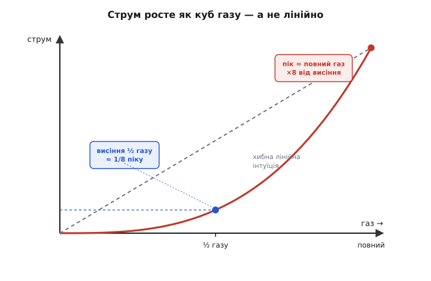

# Підбір пропульсії глибше: коефіцієнти гвинта, електричний ланцюг і кільце як нерухома точка

<preknowlist>
- [Просадка під навантаженням](topic:electronics/battery-sag) — напруга батареї падає під струмом через внутрішній опір; це окреме, вимірне явище (потрібне для другого контуру).
- [C-rate й опір](topic:electronics/c-rate) — стеля струму = C-rate × ємність і зв'язок C-rate із внутрішнім опором комірки.
</preknowlist>

Базовий крок дав нам кільце пропульсії й процедуру підбору: тяга вдвічі за вагу, гвинт робить тягу (діаметр у четвертому степені), KV зшиває мотор із напругою, батарея тримає струм і час, а маса батареї вертається в кільце. Дві замітки поглибили дві ланки — [чому потужність висіння росте як корінь із дискового навантаження](root:embedded/propulsion-sizing/math-disk-loading.md) і [чому KV та момент-на-ампер — одна обернена стала мотора](root:embedded/propulsion-sizing/math-kv-kt.md). Тепер зберемо це в інженерний апарат, яким справді рахують: виведемо **точну** формулу тяги гвинта через безрозмірні коефіцієнти (звідки насправді береться той четвертий степінь і чому потужність — п'ятий), пройдемо **весь електричний ланцюг** від грамів тяги до ампера з батареї, побачимо, що кільце — це **нерухома точка** ітерації, і що всередині нього ховається **другий** контур зворотного зв'язку через просадку напруги. А наприкінці зачепимо межі, за якими вся ця арифметика ламається: нагрів, висоту, швидкість польоту, число Маха на кінці лопаті.

Мета — щоб «на серветці» ти рахував не за завченими правилами, а бачив під кожним числом його механізм: тоді ти впораєшся й з апаратом, якого в жодній таблиці немає.

> 🔧 **Навіщо це.** Базова процедура працює, поки ти лишаєшся в межах таблиць виробника. Але щойно апарат виходить за них — важча ніж будь-яка готова збірка камера, політ у горах, гоночна швидкість, екзотична пара мотор-гвинт без таблиці — доводиться рахувати самому. Тоді потрібні не правила, а рівняння: скільки струму потягне ця пара на цій напрузі, чи витримає ESC пік, на скільки просяде батарея, за скільки перегріється обмотка. Ця стаття дає саме апарат, а не рецепт.

## Точна форма тяги: коефіцієнти Ct і Cp

У базі ми написали «тяга ∝ (оберти)² · (діаметр)⁴» і на цьому спинилися. Це правильна пропорція, але за нею стоїть точна рівність із конкретним множником, і саме її вкладено в кожну таблицю гвинтів. Виведімо її від першопринципів — з міркування розмірностей, бо саме воно показує, **звідки беруться степені**, а не постулює їх.

Від чого взагалі може залежати тяга гвинта, що крутиться в нерухомому повітрі? Від густини повітря ρ (нема чого відкидати — нема тяги), від того, як швидко він крутиться (оберти за секунду n), і від того, який він завбільшки (діаметр D). Форма лопаті, кут, профіль — усе це важить теж, але воно **безрозмірне**: подвоїш усі розміри гвинта разом — форма та сама. Тому тягу можна записати як добуток цих трьох величин у якихось степенях, помножений на безрозмірне число, що вбирає всю геометрію:

```
T = C · ρ^a · n^b · D^c
```

Степені a, b, c не вільні — їх диктує **розмірність**. Тяга — це сила, кг·м/с². Густина — кг/м³. Оберти за секунду — 1/с. Діаметр — м. Прирівняймо розмірності зліва й справа окремо за кілограмами, метрами й секундами:

```
кг:  1 = a                       → a = 1
с:  -2 = -b                      → b = 2
м:   1 = -3a + c = -3 + c        → c = 4
```

Три рівняння, три невідомі — і відповідь виходить однозначно: **a = 1, b = 2, c = 4**. Не тому, що хтось так вирішив, а тому, що інакше одиниці не зійдуться. Ось звідки береться той четвертий степінь діаметра й другий степінь обертів — із голого вимога, щоб рівняння мало розмірність сили. Безрозмірний множник C, що лишився, звуть **коефіцієнтом тяги** (англ. *thrust coefficient*), позначають Ct, і в ньому сидить уся аеродинаміка лопаті:

```
T = Ct · ρ · n² · D⁴
```

Те саме міркування для **потужності**, яку гвинт забирає з вала. Потужність — це Вт, кг·м²/с³. Пройдімо ту саму розмірнісну процедуру (P = Cp·ρ^a·n^b·D^c):

```
кг:  1 = a                       → a = 1
с:  -3 = -b                      → b = 3
м:   2 = -3a + c = -3 + c        → c = 5
```

Виходить **третій степінь обертів і п'ятий степінь діаметра**:

```
P = Cp · ρ · n³ · D⁵
```

де Cp — **коефіцієнт потужності** (англ. *power coefficient*). Строге виведення цих двох формул із локальних сил на кожному елементі лопаті (а не з самих лише розмірностей) робить [метод елемента лопаті](topic:physics/propeller-geometry/math-blade-element.md) у книзі — там видно, як Ct і Cp складаються з інтегралів підіймальної сили й опору вздовж лопаті; тут нам досить того, що дала розмірність.

Зупинімося на цих двох формулах, бо в них — практично все. **Тяга росте як квадрат обертів, потужність — як куб.** Це різниця, що визначає долю мотора: підняв оберти на 10%, тяга зросла на 21% (1.1² ≈ 1.21), а потужність — на 33% (1.1³ ≈ 1.33). Потужність завжди тікає вперед за тягою. Ось чому крутити той самий гвинт швидше — програшна стратегія: кожен відсоток тяги коштує півтора відсотка потужності, а потужність — це струм і нагрів. І ось чому діаметр вигідніший: у тязі він у четвертому степені проти квадрата в обертах, тобто важіль удвічі крутіший.

> 🔧 **Навіщо це.** Ці два коефіцієнти — місток між таблицею й реальністю. Виробник міряє Ct і Cp для свого гвинта; знаючи їх, ти передбачиш тягу й потужність на **будь-яких** обертах і густині, навіть тих, що в таблиці нема. А головне — бачиш пастку куба: коли хтось радить «підніми газ, буде більше тяги», за цим стоїть кубічне зростання струму. Тому запас тяги майже завжди дешевше купити діаметром, а не обертами.

### Що ховається в самих коефіцієнтах

Ct і Cp — не сталі числа гвинта. Вони залежать від **режиму польоту** — точніше, від однієї безрозмірної величини, що описує, наскільки швидко апарат летить проти того, як швидко крутиться гвинт. Її звуть **коефіцієнтом руху** (англ. *advance ratio*, «наскільки гвинт просунувся»):

```
       швидкість польоту        V
J  =  ────────────────────  =  ──────
       оберти × діаметр         n · D
```

J = 0 — це висіння: апарат стоїть, гвинт лише продуває повітря крізь себе. Саме цей режим ми рахуємо в сайзингу коптера, і саме для нього Ct і Cp найбільші. Зі зростанням швидкості польоту J росте, лопать зустрічає повітря під меншим ефективним кутом атаки, і Ct **падає** — тяга того самого гвинта на тих самих обертах у польоті менша, ніж на місці. До цього наслідку ми повернемось наприкінці, бо він і задає стелю швидкості апарата.

Корисна дія гвинта (яка частка вкладеної потужності стала корисною тягою × швидкість) виражається через ці три величини напрочуд чисто:

```
        корисна потужність      T · V        Ct
η  =  ──────────────────────  =  ──────  =  ──── · J
         вкладена потужність      P           Cp
```

На висінні (V = 0) ця η дорівнює нулю — і це не абсурд, а точне твердження: гвинт, що висить на місці, не робить **корисної роботи переміщення**, уся потужність іде в продування повітря вниз. Ефективність висіння тому міряють інакше — грамами тяги на ват, як ми робили в замітці про дискове навантаження; це різні речі, і плутати їх — типова помилка.

## Крок як швидкість: звідки береться стеля розгону

Тепер розкриймо крок глибше, ніж база («агресивність лопаті»). Крок має точний фізичний зміст **швидкості**, і саме він задає, як швидко апарат узагалі здатен летіти.

Крок P (у дюймах на коробці) — це відстань, на яку гвинт угвинтився б за один оберт у твердому тілі. Помнож його на оберти за секунду — дістанеш **швидкість кроку** (англ. *pitch speed*): теоретичну швидкість, з якою гвинт «вкручується» в повітря на повному газі.

```
швидкість кроку [м/с] = крок [м] · оберти [об/с]
```

**Умова.** Гвинт 10×4.5 (крок 4.5 дюйма) на моторі 900 KV, батарея 4S (≈14.8 В на повному заряді). Яка теоретична стеля швидкості апарата?

```c
// Швидкість кроку — стеля, до якої гвинт узагалі здатен розігнати апарат.
// Рахуємо як прикидку: KV × напруга дає оберти без навантаження,
// під навантаженням реальні оберти ~на 15–20% нижчі.
const float KV        = 900.0f;    // об/хв на вольт
const float VBAT      = 14.8f;     // 4S, повний заряд, В
const float PITCH_IN  = 4.5f;      // крок гвинта, дюйми
const float LOAD_DERATE = 0.80f;   // під гвинтом оберти просідають до ~80%

float rpm_free = KV * VBAT;                    // 900 * 14.8 = 13320 об/хв (без навантаження)
float rpm_load = rpm_free * LOAD_DERATE;       // ~10656 об/хв (з гвинтом)
float rps      = rpm_load / 60.0f;             // об/с
float pitch_m  = PITCH_IN * 0.0254f;           // крок у метрах
float v_pitch  = pitch_m * rps;                // швидкість кроку, м/с
// v_pitch = 0.1143 · 177.6 ≈ 20.3 м/с ≈ 73 км/год
```

```
оберти без навант.:  900 × 14.8       = 13320 об/хв
оберти під гвинтом:  13320 × 0.80     ≈ 10656 об/хв = 177.6 об/с
швидкість кроку:     0.1143 м × 177.6 ≈ 20.3 м/с ≈ 73 км/год
```

Ця цифра — **абсолютна стеля**, а не робоча швидкість. Реально апарат розганяється десь до 70–85% швидкості кроку, бо в міру наближення до неї ефективний кут атаки лопаті падає до нуля, тяга зникає (згадай: Ct падає з ростом J), і розганятися вже нічим. Тому коли хочеш **швидший** апарат — тобі потрібен більший крок (або вищі оберти через вищу напругу), а не більший діаметр: діаметр дає тягу для розгону, крок дає стелю швидкості. Гоночні гвинти тому мають крок, близький до діаметра або й більший (5×4.3, 5×4.8), а знімальні висять на малому кроці (10×3.3), бо їм швидкість не потрібна — їм потрібна економна тяга на місці.


*Тяга гвинта падає зі швидкістю польоту, і крок задає, де вона впаде до нуля. Гвинт малого кроку (знімальний) дає найбільшу тягу на висінні, але вичерпує її рано — його швидкість кроку низька. Гвинт великого кроку (гоночний) жертвує частиною тяги на місці заради того, щоб тримати її на високій швидкості. Робоча швидкість апарата — там, де тяга ще перекриває опір повітря, тобто помітно лівіше за перетин із нулем. Ось чому «швидкий» і «тягучий» гвинти — різні гвинти, і жоден діаметр цього не поєднає.*

## Електричний ланцюг: від грамів тяги до ампера з батареї

База читала струм «з таблиці мотора». Але звідки він там береться і як прикинути його, коли таблиці немає? Пройдімо весь ланцюг перетворень потужності — від повітря назад до батареї, — бо кожна ланка з'їдає свою частку, і саме їхній добуток задає ампер, який ти замовляєш у батареї.

Тяга — це кінець ланцюга, повітря. Батарея — початок, електрика. Між ними чотири перетворення, і на кожному частина потужності йде в тепло:

```
батарея → [ESC] → мотор → [вал] → гвинт → повітря
  U·I      η_esc    η_mot     M·ω     FoM      T·v_i
```

Пройдімо його **навпаки**, від потрібної тяги до струму — саме так рахують сайзинг.

**Крок 1. Від тяги до ідеальної аеродинамічної потужності.** Це вже вміємо з актуаторного диска: на висінні гвинту, щоб тримати тягу T, потрібна щонайменше ідеальна потужність P_id = T·v_i, де v_i = √(T/(2ρA)). Для нашого 1200-грамового квадрокоптера на 10-дюймових гвинтах ми діставали ≈58 Вт ідеально на всі чотири.

**Крок 2. Від ідеальної до реальної механічної потужності на валу — ділимо на добротність.** Реальний гвинт гірший за ідеальний диск: в'язке тертя, закрутка струменя, втрати на кінцях лопатей. Відношення ідеальної потужності до справжньої механічної на валу — це **добротність** (figure of merit, FoM), для пристойних гвинтів 0.6–0.75. Механічна потужність, яку мотор мусить подати на вал:

```
P_вал = P_id / FoM
```

**Крок 3. Від вала до електричної потужності мотора — ділимо на ККД мотора.** Мотор перетворює електрику на обертання не задарма: частина струму гріє мідь обмотки (втрати I²R), частина потужності — залізо й тертя. ККД доброго безщіткового мотора під навантаженням — 0.80–0.88. Електрична потужність, яку мотор бере зі свого боку:

```
P_ел_мот = P_вал / η_мот
```

**Крок 4. Від мотора до батареї — ділимо на ККД регулятора.** ESC комутує фази з деякими втратами на ключах і в комутації; його ККД зазвичай 0.95–0.98. Потужність, яку врешті бере з батареї весь вузол:

```
P_бат = P_ел_мот / η_esc
```

Зведімо весь ланцюг в одну формулу. Струм із батареї — це потужність, поділена на напругу:

```
              P_id
P_бат  =  ─────────────────────
           FoM · η_мот · η_esc

              P_бат       T · v_i
I_бат  =  ──────────  =  ──────────────────────────
             U           U · FoM · η_мот · η_esc
```

**Умова.** Той самий квадрокоптер 1200 г, 10-дюймові гвинти, батарея 4S (≈14.8 В). Оцінимо струм висіння **з фізики**, без таблиці, і порівняймо з таблично-очікуваними 32 А з базового кроку.

```c
#include <math.h>
const float RHO   = 1.225f;    // густина повітря, кг/м^3
const float G     = 9.81f;
const float M_KG  = 1.200f;    // злітна маса
const int   NP    = 4;         // гвинтів
const float D_IN  = 10.0f;     // діаметр, дюйми
const float VBAT  = 14.8f;     // 4S
const float FOM   = 0.68f;     // добротність гвинта
const float ETA_M = 0.83f;     // ККД мотора
const float ETA_E = 0.96f;     // ККД ESC

float hover_current() {
    float R   = (D_IN * 0.0254f) / 2.0f;
    float A   = NP * (float)M_PI * R * R;        // сумарна площа дисків, м^2
    float T   = M_KG * G;                         // тяга висіння = вага, Н
    float vi  = sqrtf(T / (2.0f * RHO * A));     // індукована швидкість, м/с
    float Pid = T * vi;                           // ідеальна потужність, Вт (усі гвинти)
    float Pbat = Pid / (FOM * ETA_M * ETA_E);    // потужність із батареї
    float Ibat = Pbat / VBAT;                     // струм із батареї, А
    return Ibat;
}
```

```
площа A        = 4·π·0.127²          ≈ 0.203 м²
тяга T         = 1.2·9.81            ≈ 11.8 Н
індук. швидк.  v_i = √(11.8/(2·1.225·0.203)) ≈ 4.9 м/с
ідеальна P_id  = 11.8·4.9            ≈ 58 Вт
реальна P_бат  = 58 / (0.68·0.83·0.96) ≈ 58 / 0.542 ≈ 107 Вт
струм висіння  I = 107 / 14.8        ≈ 7.2 А (сумарно, усі 4)
```

Сімка ампер на висінні — і тут варто спинитися, бо цифра сперечається з тим, що ми грубо клали в базовому кроці (там для ілюстрації кільця стояло «≈8 А з мотора», тобто ≈32 А сумарно). Різниця не в помилці, а в тому, **що саме рахує кожна цифра**. Наш актуаторний диск дав 58 Вт як **абсолютний фізичний ідеал** для 10-дюймового диска — менше цього не буде за жодних моторів; поділивши на реалістичні, але **оптимістичні** ККД, ми дістали ≈107 Вт і ≈7 А як **нижню межу** споживання. Жива пара мотор-гвинт покаже помітно більше: реальна добротність гіршого гвинта, неідеальне обтікання, гарячіша обмотка — усе це не вміщається в наші рівні 0.68 · 0.83 · 0.96, і фактичне висіння сяде десь на 12–20 А сумарно (ефективність 6–8 г/Вт із замітки про дискове навантаження), а не 7. Обидві цифри мають сенс і працюють разом: фізична оцінка — це **межа знизу** (нижче фізика не пустить, і якщо таблиця обіцяє менше — вона бреше), а таблична — те, що справді виміряли на залізі з усіма його недосконалостями. Прикидаючи апарат без таблиці, бери фізичну межу й помнож на 1.5–2.5 — і матимеш чесний робочий діапазон струму.

Головний урок цього прикладу навіть не в числі, а в **структурі**: струм із батареї — це тяга, прогнана крізь ланцюг ділень на чотири ККД, і кожен із них ти можеш поліпшити окремо. Кращий гвинт підіймає FoM; кращий мотор — η_мот; кращий ESC — η_esc; більший диск зменшує сам P_id. Помнож поліпшення — і струм падає, а політ довшає.

> 🔧 **Навіщо це.** Коли пари немає в таблиці, цей ланцюг — єдиний спосіб прикинути струм, а отже, вибрати C-rate батареї й струмовий клас ESC. І він показує, **куди тиснути** заради довшого польоту: не в один магічний компонент, а в добуток ефективностей. Апарат, у якому і гвинт добрий (FoM 0.72), і мотор добрий (η 0.86), і ESC добрий (η 0.97), літає помітно довше за той, де кожна ланка «нормальна» — бо втрати перемножуються, а не додаються.

### Чому струм не пропорційний газу

Ще одна пастка, яку база оминула: **струм росте з газом не лінійно, а різко** — і саме тому пік такий небезпечний. Зберімо це з двох уже виведених фактів.

Оберти майже пропорційні газу (ESC подає більшу частку напруги). Але потужність, як ми щойно вивели, росте як **куб** обертів (P = Cp·ρ·n³·D⁵). А струм при майже сталій напрузі пропорційний потужності. Отже:

```
I  ∝  P  ∝  n³  ∝  (газ)³   (приблизно)
```

Струм росте приблизно як **куб газу**. Це геть інша картина, ніж лінійна інтуїція «півгаза — півструму». Півгаза — це не половина, а лише **восьмина** максимального струму (0.5³ = 0.125). І навпаки: піднявши газ з 50% до 100%, ти множиш струм не вдвічі, а у **вісім разів**. Ось чому апарат, що спокійно висить на 8 амперах з мотора, у різкому ривку на повний газ раптом рве 60–80 — і чому і ESC, і дроти, і батарею беруть на цей пік, а не на висіння.


*Струм росте приблизно як куб газу, а не лінійно. Оскільки оберти майже пропорційні газу, а потужність — кубу обертів, споживаний струм теж кубічний. Тому висіння на половині газу коштує лише близько восьмини пікового струму, а повний газ підскакує у вісім разів. Хибна лінійна інтуїція (пунктир) майже скрізь занижує струм і саме тому веде до недобору C-rate батареї й струмового класу регулятора. Проєктувати треба на верхній кінець цієї кривої.*

## Кільце як нерухома точка: чому ітерація сходиться

База сказала: «вузол підбирають ітераціями, два-три оберти — і цифри сходяться». Але **чому** вони сходяться, а не розбігаються? Чому саме два-три оберти, а не двадцять? За цим стоїть точна математична причина, і варто її побачити — бо вона ж підказує, коли ітерація **не** зійдеться.

Кільце пропульсії — це рівняння, у якому злітна маса стоїть з обох боків. Зліва — маса, під яку рахуємо. Справа — сума фіксованих мас (рама, електроніка, камера, мотори) плюс маса батареї, а маса батареї сама залежить від того, скільки енергії треба, а це залежить від маси. Запишемо це чесно.

Позначимо: m — повна злітна маса, m₀ — фіксована частина (усе, крім батареї), а масу батареї виразимо через потрібну енергію. Час польоту t і струм висіння задають потрібну ємність, ємність задає масу батареї. Струм висіння ми щойно навчилися виражати через масу (через тягу T = mg у ланцюгу). Груба, але чесна модель: маса батареї приблизно пропорційна енергії, яку вона несе, а та — добутку потрібної потужності висіння на час. Потужність висіння росте з масою (важчий апарат — більша тяга — більша потужність). Отже маса батареї — зростаюча функція повної маси:

```
m  =  m₀  +  m_бат(m)
```

Це **рівняння нерухомої точки**: шукаємо таке m, що, підставлене справа, повертає себе зліва. Метод розв'язання очевидний — ітерація: береш прикидку m, рахуєш m_бат(m), додаєш m₀, дістаєш нове m, повторюєш. Питання лише — чи збігається послідовність.

Збігається вона тоді (і саме тому два-три кроки досить), коли функція **стисна**: коли зміна повної маси на Δm тягне зміну маси батареї, **меншу** за Δm. Формально — коли похідна m_бат по m менша за одиницю:

```
| d(m_бат) / dm |  <  1     ← умова збіжності
```

Що це означає фізично? Додав до апарата зайвий грам — він вимагає трохи більшої тяги на висіння — трохи більшого струму — трохи більшої батареї, щоб утримати той самий час польоту. Якщо ця «трохи більша батарея» важить **менше** за той зайвий грам, кожен оберт кільця гасить збурення, і послідовність збігається до нерухомої точки. Так воно й буває для розумних апаратів: додатковий грам корисного вантажу тягне за собою частку грама батареї, не цілий грам і не два.

А коли **не** збігається? Коли d(m_бат)/dm ≥ 1 — коли, щоб утримати час польоту, кожен доданий грам вимагає грама й більше батареї. Тоді ітерація **розбігається**: маса росте необмежено, батарея тягне батарею. Це не абстракція, а реальна межа — так званий стрімкий приріст. Він настає, коли ти вимагаєш від апарата надто довгого польоту при поганій ефективності: батарея, потрібна на цей час, важить стільки, що сама з'їдає весь виграш і вимагає ще більшої. Ось чому не буває коптера з годинним висінням на LiPo: у якийсь момент d(m_бат)/dm перетинає одиницю, і рівняння нерухомої точки просто не має розв'язку. Фундаментальну межу цього — енергогустину батареї — розбирає окрема [замітка про стелю витривалості й розбіжність масового кільця](root:embedded/propulsion-sizing/math-endurance-limit.md).


*Кільце пропульсії — рівняння нерухомої точки m = m₀ + m_бат(m). Ітерація (сходинки павутинної діаграми) збігається до перетину кривої з прямою y = x, поки нахил кривої менший за одиницю: кожен доданий грам апарата тягне менше грама батареї, збурення гаснуть, два-три кроки — і цифри стоять. Якщо ж нахил перевищує одиницю (права крива не перетинає пряму), сходинки розбігаються вгору — «батарея тягне батарею», розв'язку немає, апарат із таким часом польоту фізично не існує. Ось точна причина, чому сайзинг сходиться швидко — і чому годинне висіння на LiPo неможливе.*

> 🔧 **Навіщо це.** Тепер «два-три оберти» — не емпіричне спостереження, а наслідок стисності. І ти маєш діагностику: якщо кільце **не** сходиться (щоразу нарощуєш батарею, а часу польоту все мало, і маса пливе вгору) — це не помилка розрахунку, а сигнал, що ти вийшов за фізичну межу для цієї хімії. Рятунок не в «ще більшій батареї» (вона розбіжна), а в зменшенні самого апетиту: легша конструкція, більший диск (нижче навантаження, згадай корінь), інша хімія з вищою енергогустиною.

## Другий контур: просадка напруги замикає ще одне кільце

Досі ми мовчки вважали напругу батареї сталою. Це зручна брехня. Насправді напруга під струмом **просідає** — і це замикає всередині головного масового кільця **другий**, швидкий контур зворотного зв'язку, який на слабкій батареї здатен звалити апарат саме в момент, коли ти рвонув газ.

Механізм — з двох уже відомих фактів. Перший: [напруга батареї під струмом падає](topic:electronics/battery-sag) на добуток струму й внутрішнього опору комірок, U = U₀ − I·R_вн. Другий: оберти гвинта майже пропорційні напрузі (оберти ≈ KV·U). Зчепімо їх у ланцюг і подивімось, куди він веде.

Даєш повний газ → росте струм → напруга просідає (I·R_вн) → просіла напруга дає менші оберти (оберти ≈ KV·U) → менші оберти дають меншу тягу (тяга ∝ n²) → а тобі саме потрібна була велика тяга. Контур замкнувся, і знак його — **від'ємний** для тяги: рвонув газ по тягу, а частина її з'їлася просадкою. На здоровій батареї це дрібниця — просіло на 3–4%, тяга впала на кілька відсотків, непомітно. На **слабкій за C-rate** батареї (великий R_вн) це катастрофа: пік струму саджає напругу так, що оберти й тяга падають **дужче**, ніж додав газ, — і апарат замість ривка вгору **провалюється**. Гірше: провал висоти лякає пілота, він додає ще газу, струм росте ще, напруга сідає ще глибше — і контур на мить стає майже додатним, у штопор просадки.

Порахуймо, наскільки просадка з'їдає тягу, щоб побачити межу кількісно.

**Умова.** Батарея 4S, номінал 14.8 В, внутрішній опір усього пакета R_вн = 0.02 Ом (типово для доброї 4S). Піковий сумарний струм у ривку — 80 А. На скільки просяде напруга й на скільки впаде тяга проти розрахованої на номіналі?

```c
const float U0    = 14.8f;    // напруга без навантаження, В
const float R_INT = 0.020f;   // внутрішній опір пакета, Ом
const float I_PK  = 80.0f;    // піковий сумарний струм, А

float u_sag  = U0 - I_PK * R_INT;        // напруга під піком, В
float sag_pct = (U0 - u_sag) / U0 * 100.0f;

// оберти ~ пропорційні напрузі, тяга ~ квадрат обертів
// частка тяги, що лишилась = (u_sag/U0)^2
float rpm_ratio    = u_sag / U0;
float thrust_ratio = rpm_ratio * rpm_ratio;
float thrust_loss_pct = (1.0f - thrust_ratio) * 100.0f;
```

```
напруга під піком:  14.8 − 80·0.02 = 14.8 − 1.6 = 13.2 В
просадка:           (14.8−13.2)/14.8 ≈ 10.8 %
оберти:             ~10.8 % менше
тяга (∝ оберти²):   (13.2/14.8)² ≈ 0.796 → на ~20 % менше!
```

Ось де кусається квадрат. Просадка напруги лише на 11% через квадратичну залежність тяги обертається **втратою тяги на 20%** — саме на піку, саме коли тяга потрібна найбільше. А тепер уяви слабку батарею з R_вн = 0.05 Ом: просадка 80·0.05 = 4 В, напруга падає до 10.8 В, тяга лишається (10.8/14.8)² ≈ 0.53 — **майже вдвічі менша за розрахункову**. Апарат, який на папері мав TWR 2:1, у реальному ривку має ефективно 1.06:1 — і не маневрує, а падає. Ось чому C-rate беруть **із запасом**, а не впритул: запас за струмом — це малий R_вн — це малий I·R — це збережена тяга на піку.


*Просадка напруги замикає другий, швидкий контур усередині масового кільця. Повний газ підіймає струм, струм саджає напругу на внутрішньому опорі, просіла напруга знижує оберти, а тяга падає як їхній квадрат — тож 11-відсоткова просадка коштує 20% тяги. На здоровій батареї (малий внутрішній опір) провал дрібний і апарат тільки трохи в'ялий на піку; на слабкій за C-rate (великий опір) провал такий глибокий, що апарат замість ривка провалюється, а переляканий пілот додає газу — і контур на мить стає самопідсильним. Ось точна причина, чому C-rate беруть із запасом, а не впритул до розрахунку.*

> 🔧 **Навіщо це.** Це найчастіша прихована причина «апарат ніби має тягу, а на різкому маневрі кульгає й сідає». Люди перевіряють тягу на статичному тесті при повному заряді й свіжій батареї — і все гаразд. А в польоті, під навантаженням і на підсілій батареї, внутрішній опір з'їдає напругу, квадрат з'їдає тягу, і закладений запас TWR тане. Мораль: перевіряй тягу не на номіналі, а на **просілій** напрузі під піковим струмом — тоді побачиш реальну тягоозброєність, а не паперову.

## Межі, за якими арифметика ламається

Уся дотепна арифметика вище припускала кімнатне повітря, статичне висіння й помірні оберти. Реальний апарат виходить за ці рамки, і на кожній межі формули треба поправляти. Пройдімо чотири головні межі — вони й відділяють «полетить» від «здавалося б, мало полетіти».

**Нагрів: чому таблична межа мотора — не робоча точка.** Мотор і ESC мають два різні струмові рейтинги, і плутати їх — палити залізо. **Тривалий** (continuous) — струм, який ланка тримає нескінченно, не перегріваючись. **Піковий** (burst) — струм на короткі секунди, поки маса міді ще не встигла нагрітися. Різниця між ними — не примха, а теплова фізика: обмотка гріється струмом (втрати I²R) і охолоджується в повітря; поки тепла надходить менше, ніж відводиться, температура стоїть, а щойно струм переростає тривалу межу — температура повзе вгору з характерним **тепловим часом** (для дрібних моторів це секунди-десятки секунд). Тому пік у 80 А ланка витримає 5–10 секунд, а те саме тривало — спалить ізоляцію обмотки. Ізоляцію класифікують за граничною температурою (клас B — 130 °C, F — 155 °C, H — 180 °C); за нею мідь ще ціла, а от лак-ізоляція деградує, витки замикаються, і мотор гине. Проєктувати треба так, щоб **тривалий** струм висіння сидів з комфортним запасом під тривалим рейтингом, а пік вкладався в короткочасний. Строгу теплову модель ланки (тепловий опір, теплоємність, стала часу, чому охолодження вдесятеро повільніше за нагрів на висінні) розбирає окрема [замітка про тепловий бюджет пропульсивної ланки](root:embedded/propulsion-sizing/math-thermal-limit.md); загальний апарат теплового опору й сталої часу — [у книзі](topic:physics/thermal-resistance).

**Висота: рідше повітря — менша тяга.** Усі формули тяги несуть множник ρ — густину повітря. А вона падає з висотою: на 2000 м над рівнем моря повітря приблизно на 20% рідше, на 4000 м — на третину. Тяга ж прямо пропорційна ρ (T = Ct·ρ·n²·D⁴), тож той самий апарат у горах на 3000 м видає відсотків на 25 менше тяги на тих самих обертах. Мотор намагається це компенсувати вищими обертами — а це кубічно більший струм і нагрів. Ось чому апарат, налаштований у долині з TWR 2:1, у горах може мати ефективно 1.5:1 і ледве злітати, а мотори гріються дужче. Правило: якщо літаєш високо — закладай запас тяги на розрідження, або став більший диск, бо ρ карає всіх однаково й обійти її не можна.

**Число Маха на кінці лопаті: стеля обертів.** Здавалося б, крути гвинт швидше — матимеш більше тяги, і жодної межі. Межа є, і жорстка: **кінець лопаті не має наближатися до швидкості звуку**. Кінець рухається зі швидкістю v_кін = π·D·n; коли вона підповзає до ≈0.7–0.8 Маха (240–270 м/с), на лопаті виникають місцеві ударні хвилі, опір злітає, ефективність (Cp) обвалюється, гвинт починає вити й майже не додає тяги за дику потужність. Для 5-дюймового гоночного гвинта це настає вже десь на 40 000+ об/хв — і саме ця стеля, а не мотор, обмежує, наскільки корисно розкручувати малі гвинти. Великі гвинти впираються в Мах на набагато нижчих обертах (бо кінець далі від осі й лінійна швидкість більша при тих самих об/хв) — ще одна причина, чому їх крутять повільно: не лише економність, а й фізична неможливість крутити швидко без зриву в надзвук.

**Зрив потоку лопаті на малих обертах.** Дзеркальна межа знизу: якщо оберти замалі для заданого кроку, кут атаки лопаті переростає критичний, потік **зривається** (як крило на завеликому куті), тяга провалюється, а гвинт молотить повітря без користі. Це трапляється, коли на важкий апарат ставлять гвинт із завеликим кроком і крутять його повільно, щоб не перегріти мотор, — а він у зриві й тяги не дає. Тому крок і оберти мусять пасувати: гвинт має працювати в вікні між зривом (замалі оберти) і Махом (зависокі), і це вікно тим вужче, чим агресивніший крок.

> 🔧 **Навіщо це.** Ці чотири межі пояснюють більшість «незрозумілих» відмов, які не ловляться папером. Апарат гріє мотори до диму — уперся в тривалий тепловий рейтинг (пік плутають з тривалим). Не злітає в горах — з'їла густина. Гоночний гвинт виє й не тягне на максимумі — кінець лопаті в надзвуку. Важкий апарат із крутим гвинтом в'ялий — лопать у зриві. Знаючи межі, ти діагностуєш причину за симптомом, а не міняєш деталі навмання.

## Зведена процедура з фізикою під кожним кроком

Тепер, коли під кожним числом є механізм, перепишімо процедуру підбору вже інженерно — з формулами, а не лише порядком дій. База дала кроки; тут — рівняння до кожного.

**1. Злітна маса — прикидка m₀ + груба батарея.** Як у базі, але пам'ятай: це стартова точка ітерації нерухомої точки, уточниться на кроці 7.

**2. Потрібна тяга.** T_повна = m · g · TWR (TWR ≥ 2 коптер); на один гвинт T₁ = T_повна / n_гвинтів; тяга висіння на гвинт = m·g / n_гвинтів.

**3. Диск і навантаження.** Обери максимальний діаметр, що влазить у раму: A = n·π·(D/2)². Порахуй навантаження DL = m·g/A і прикинь ефективність висіння за коренем (менший DL — більше г/Вт). Це задає точку на кривій економності ще до вибору мотора.

**4. Оберти й пара мотор-гвинт.** З T₁ = Ct·ρ·n²·D⁴ прикинь потрібні оберти висіння (Ct бери з таблиці гвинта або 0.10–0.14 для типових). Напруга S задає стелю обертів через KV (оберти ≈ KV·U під навантаженням ×0.8); підбирай KV так, щоб потрібні оберти сиділи десь на 50–60% від макс. — це і є висіння на півгаза.

**5. Струм через ланцюг.** Струм висіння I_hover = T·v_i / (U·FoM·η_мот·η_esc) на висінні; піковий I_peak ≈ I_hover · (газ_пік/газ_hover)³ через кубічну залежність. Обидва потрібні: тривалий для нагріву й часу, піковий для C-rate і проводки.

**6. Батарея на пік і просадку.** C-rate: I_peak / ємність[А·год] × запас (бери 1.5–2× розрахункового). Перевір **просілу** тягу: U_sag = U₀ − I_peak·R_вн, реальний TWR масштабуй на (U_sag/U₀)². Ємність — компроміс часу й ваги.

**7. Нерухома точка.** Постав справжню масу батареї в крок 1, пройди кільце. Стеж за d(m_бат)/dm: якщо маса пливе вгору й не стає — ти за межею витривалості для цієї хімії, полегшуй апарат, а не нарощуй батарею.

**8. Теплова й фізична перевірка меж.** Тривалий струм висіння — з запасом під continuous-рейтингом мотора й ESC. Пік — у межах burst. Швидкість кінця лопаті π·D·n < 0.75 Маха. Якщо літаєш високо — множник ρ на тягу. Крок не завеликий для обертів (щоб не зрив).

Цей порядок дає не «найкращий взагалі» апарат, а **достатній, узгоджений і в межах фізики**: тяга вдвічі й на просілій напрузі, пара мотор-гвинт у своєму робочому вікні, батарея на пік із запасом, ланки не в перегріві, кінці лопатей не в надзвуку. Кожен крок тепер спирається не на правило, а на рівняння, яке ти можеш перевірити.
