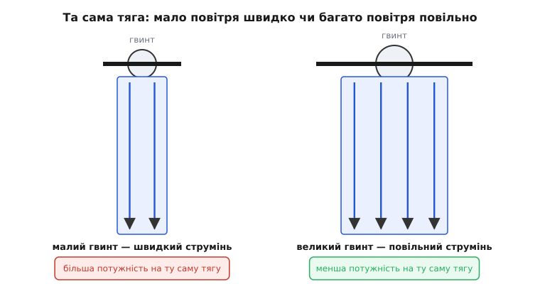
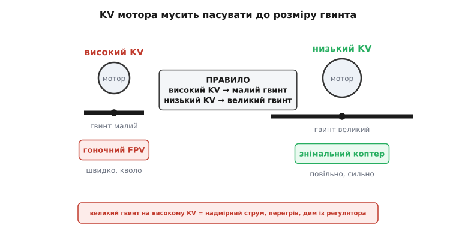
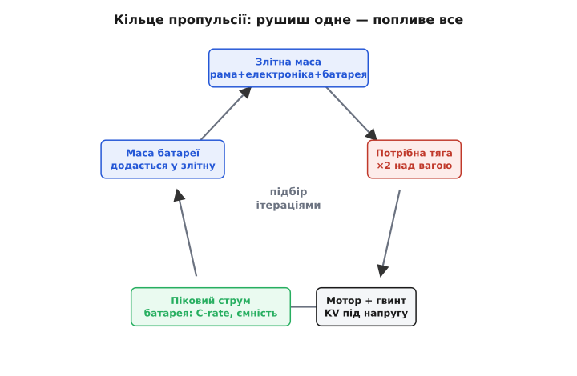

# Підбір пропульсії: мотор + гвинт + батарея під злітну масу

<preknowlist>
- [C-rate батареї](book:electronics/c-rate) — стеля струму = C-rate × ємність, тобто скільки струму батарея готова віддати за секунду.
- [Просадка під навантаженням](book:electronics/battery-sag) — напруга батареї падає під струмом через внутрішній опір комірок.
</preknowlist>

Досі повітряний апарат був для нас набором окремих істин фізики: [тяга мусить перебороти вагу](book:physics/thrust-vs-weight), гвинт [загрібає повітря вниз](book:physics/propeller-geometry), а протилежні за напрямом [реактивні моменти](book:physics/reaction-torque) гасять один одного на рамі. Кожну ми розбирали окремо, згори, як явище. Тепер зведімо їх докупи й поставмо приземлене питання, яке рано чи пізно ставить кожен, хто збирає коптер чи літак: **які саме мотори, гвинти й батарею купити, щоб оця конкретна купа заліза злетіла й полетіла?**

Питання оманливо просте. У каталозі тисячі моторів, що різняться в рази за обертами-на-вольт і потужністю, десятки типорозмірів гвинтів, батареї від крихітних до цеглин — і кожна ланка тягне іншу за собою. Візьмеш легший гвинт — впаде тяга; поставиш більший — мотор перегріється; додаси батарею на більший струм — здорожчаєш апарат зайвою вагою, яку сам же й возитимеш. **Пропульсія (лат. propellere — гнати вперед) — це не чотири окремі покупки, а один зв'язаний вузол**, де мотор, гвинт, батарея й злітна маса замкнені в кільце: рушиш одне — попливе все. Розберемо це кільце від першопричини, побачимо, які величини за що відповідають і як тиснуть одна на одну, і складемо просту процедуру, якою можна користуватися щоразу.

> 🔧 **Навіщо це.** Помилка в пропульсії карає одразу й дорого. Замала тяга — апарат ледве відривається, не тримає вітру й падає з першим маневром. Завелика — возиш зайві грами й розряджаєш батарею вдвічі швидше. Неузгоджений гвинт із мотором — дим із регулятора на першому ж газі. Уміти прикинути весь вузол «на серветці», перш ніж щось замовляти, — базова навичка, що відрізняє апарат, який літає, від коробки дорогих деталей, які між собою не дружать.

## Тяга — головна цифра, і її треба вдвічі більше за вагу

Почнімо з найважливішого, з чого починається будь-який розрахунок пропульсії. Ми вже знаємо: щоб апарат просто **висів** нерухомо, сумарна тяга всіх гвинтів має точно дорівнювати вазі — ні більше, ні менше. Але висіти мало. Апарату треба **розганятися вгору, нахилятися, боротися з поривом вітру**, а на все це потрібна тяга **понад** ту, що вже йде на утримання ваги. Звідси й головне правило пропульсії: тяга при повному газі має бути **щонайменше вдвічі більша за злітну вагу**.

Це співвідношення називають **тягоозброєністю** (англ. *thrust-to-weight ratio*, TWR) — відношення максимальної тяги до ваги апарата. Мінімум для керованого мультикоптера — **2:1**, і цифра ця не з повітря. Якщо максимальна тяга вдвічі більша за вагу, то на висінні мотори працюють рівно на **половині газу**: половина тяги тримає вагу, друга половина лишається в запасі — на розгін, нахили й вітер. Апарат із тягоозброєністю рівно 1:1 висів би на повному газі й **не мав чим маневрувати взагалі**: жодного запасу вгору, будь-який порив здуває його вниз, бо додати тяги нема куди.

```
тягоозброєність = тяга(повний газ) / вага

TWR = 1     висить на повному газі, маневрувати нічим  — не літає
TWR = 2     висить на половині газу, половина в запасі — мінімум для коптера
TWR = 3–4   спокійний знімальний апарат, запас на вітер і вагу камери
TWR = 6–12  гоночний FPV, шалене прискорення
```

> 🔧 **Навіщо це.** Правило «тяги вдвічі» — це те, з чого ти рахуєш **усе інше**. Знаєш злітну масу — одразу знаєш потрібну сумарну тягу (×2), а поділивши на кількість моторів — тягу з одного гвинта. Це відправна цифра, від якої танцює вибір мотора, гвинта й батареї. Пропустиш її — і решта розрахунку висить у порожнечі.

Тягоозброєність 2:1 — саме **мінімум**, а не мета. Спокійний апарат для зйомки роблять на 3:1 чи 4:1: запас потрібен, щоб нести камеру, тримати кадр проти вітру й не працювати весь час на межі. Гоночний FPV навпаки — женуть до 6:1 і вище, бо там цінують не економність, а миттєве прискорення. Але щойно ти піднімаєш тягоозброєність, ти вимагаєш потужніших моторів і гвинтів, а вони важчі й ненажерливіші — і збільшують ту саму вагу, під яку рахувалась тяга. Кільце вже почало стягуватися; тримаймо це в голові.

**Умова.** Збираємо квадрокоптер (4 мотори), прикидка злітної маси разом з рамою, батареєю, електронікою й камерою — 1200 г. Яка потрібна сумарна тяга й тяга з одного мотора для тягоозброєності 2:1?

```c
// маси й тяги у прошивці зручно тримати в грамах (цілі числа)
const int MASS_G   = 1200;   // злітна маса, г
const int MOTORS   = 4;      // кількість моторів
const int TWR_X10  = 20;     // тягоозброєність 2.0, помножено на 10 (без float)

// сумарна тяга при повному газі = маса × TWR
int thrust_total_g = MASS_G * TWR_X10 / 10;    // 1200 * 2.0 = 2400 г
// тяга, яку має дати ОДИН гвинт при повному газі
int thrust_each_g  = thrust_total_g / MOTORS;  // 2400 / 4 = 600 г
```

```
сумарна тяга:  1200 г × 2.0 = 2400 г
на 1 мотор:    2400 / 4     =  600 г  (при повному газі)
на висінні:    600 / 2      =  300 г  (кожен гвинт, ~половина газу)
```

Отже, кожен мотор із гвинтом мусить видавати **600 г тяги на повному газі**, а на висінні працюватиме десь на 300 г, тобто на половині. Це вже конкретна вимога, з якою можна йти до таблиць гвинтів і моторів. Але тягу робить не мотор сам по собі — її робить **гвинт**, який мотор крутить. З нього й почнемо занурення в залізо.

## Тягу робить гвинт: діаметр і крок

Мотор не штовхає повітря — він лише **крутить гвинт**, а вже гвинт, вгвинчуючись у повітря, відкидає його вниз і тим створює тягу. Тож перше, що визначає тягу, — це геометрія гвинта, і вона задається двома числами, які ти побачиш на кожній коробці: **діаметр** і **крок**.

Гвинт (англ. *propeller*, від того ж *propellere* — гнати) підписують парою на кшталт **«10×4.5»** або **«10 × 4.5»**: перше число — діаметр у дюймах, друге — крок. **Діаметр** — це розмах, коло, яке замітають лопаті; він задає, **скільки повітря** гвинт захоплює. **Крок** (англ. *pitch*) — відстань, на яку гвинт вгвинтився б за один оберт у щільному тілі, як шуруп у дереві; він задає, наскільки **агресивно** лопать нахилена, тобто скільки повітря вона жбурляє за оберт. Обидва в дюймах — ще один спадок хобі-галузі, що виросла на дюймових мірках.

Тепер найважливіше про діаметр, бо тут криється вся суть підбору. Тяга залежить від діаметра **дуже** круто — приблизно як **четвертий степінь**:

```
тяга ∝ (оберти)² · (діаметр)⁴
```

Четвертий степінь — це не описка. Він означає, що навіть **невелика** зміна діаметра дає **величезну** зміну тяги: збільшив діаметр лише на 10% — і тяга зросла майже наполовину (бо 1.1⁴ ≈ 1.46). Тому діаметр гвинта — набагато сильніший важіль тяги, ніж оберти: додати діаметра куди ефективніше, ніж крутити той самий гвинт швидше. І це має глибоку причину, до якої ми зараз дійдемо, — вона ж пояснює, чому великі повільні гвинти економніші.


*Чому великий повільний гвинт економніший. Ту саму тягу можна отримати, відкинувши мало повітря швидко (малий гвинт) або багато повітря повільно (великий гвинт). Оскільки на розгін повітря витрачається енергія, пропорційна квадрату його швидкості, вигідніше рухати більший об'єм повільніше: великий гвинт дає ті самі грами тяги меншою потужністю. Тому апарати на економність ставлять якнайбільші гвинти, які влазять у раму.*

Чому так? Тягу можна створити двома шляхами: **відкинути трохи повітря дуже швидко** або **відкинути багато повітря помалу**. Сила однакова в обох випадках — бо тяга це імпульс, який гвинт передає повітрю за секунду, а імпульс залежить від добутку маси на швидкість. Але **енергія**, яку треба на це витратити, залежить від **квадрата** швидкості струменя. Тому гнати вузький швидкий струмінь — марнотратство: половина потужності йде не в тягу, а в кінетичну енергію повітря, що дарма свистить униз. Великий гвинт захоплює широкий стовп повітря й посуває його повільно — і на ту саму тягу витрачає **менше потужності**. Ось чому важкі знімальні апарати й далекобійні коптери ставлять величезні повільні гвинти: вони економніші, тихіші й дають довший політ. А маленькі гоночні дрони з крихітними гвинтами, що виють на шалених обертах, платять за прудкість поганою економністю — їм важлива не дальність, а прискорення. Строгу міру цієї неощадності — **навантаження на диск** (тягу, поділену на площу, яку замітають усі гвинти) — розбирає окрема [замітка про дискове навантаження й ефективність висіння](root:embedded/propulsion-sizing/math-disk-loading.md).

А крок? Крок задає, під яким кутом лопать «кусає» повітря. Більший крок жбурляє повітря сильніше за оберт — дає більшу тягу й вищу максимальну швидкість, але **важче** для мотора: круту лопать важче тягнути крізь повітря, вона забирає більший момент і більший струм. Тому пари підбирають під роль: **малий крок** (наприклад, 10×3.8) легкий для мотора, дає плавну керовану тягу — добре для висіння й зйомки; **великий крок** (10×5.5) агресивніший, для швидкості й ривків — але гріє мотор і садить батарею. Простий орієнтир: діаметром керуєш «скільки взагалі тяги», кроком — «наскільки агресивно».

> 🔧 **Навіщо це.** Найпоширеніша помилка початківця — ганятися за кроком і обертами замість діаметра. Хочеш більше тяги — спершу дивись, чи не влізе **більший** гвинт: через четвертий степінь це найдешевший спосіб. Крок нарощуй обережно: кожен зайвий дюйм кроку — це зайвий струм і градуси на моторі й регуляторі, і саме перекручений крок найчастіше палить електроніку в новачків.

## KV — число, що зшиває мотор, гвинт і батарею

Отже, гвинт робить тягу, а тяга залежить від **обертів**. Але оберти задає вже мотор — точніше, мотор разом із напругою батареї. І ланкою, що зв'язує їх усіх, є одна цифра в паспорті мотора, повз яку не пройти: **KV**.

KV мотора — це **скільки обертів на хвилину він дає на кожен прикладений вольт** без навантаження. Мотор на 900 KV, під'єднаний до 10 вольт, прагне крутитися 900 × 10 = 9000 обертів за хвилину; той самий мотор на 20 вольт — удвічі швидше. Проста лінійна залежність:

```
оберти (без навантаження) ≈ KV · напруга
```

Одразу застережмо пастку в самій назві. Літера «V» у KV — це **не «вольт»**; це усталений у теорії двигунів символ **сталої швидкості** (англ. *velocity constant*, стала оберти-на-вольт). KV — властивість самого мотора, закладена його обмоткою: більше витків тоншого дроту дають **менший** KV, менше витків товщого — **більший**. Тому KV не «налаштовують» — його вибирають, купуючи конкретний мотор. І в нього є прихований близнюк: та сама котушка, що дає KV обертів на вольт, дає й певний **момент на кожен ампер струму**, і ці дві величини — обернені одна до одної. Мотор не можна зробити водночас і швидким на вольт, і сильним на ампер; це та сама монета з двох боків, і чому саме так — виводить [замітка про сталу мотора: KV, момент і зустрічна ЕРС](root:embedded/propulsion-sizing/math-kv-kt.md).

Звідси головне практичне правило, яке зшиває весь вузол докупи:

- **Високий KV** (наприклад, 2400) крутить **швидко, але кволо** — під нього беруть **малий** гвинт (крихітний гоночний дрон, високі оберти, мала тяга з кожного, зате миттєвий відгук);
- **Низький KV** (наприклад, 400) крутить **повільно, зате сильно** — під нього беруть **великий** гвинт (важкий знімальний апарат, низькі оберти, велика економна тяга).


*Головне правило узгодження. KV мотора й розмір гвинта мусять пасувати одне одному: високий KV дає високі оберти й малий момент — його місце з малим гвинтом; низький KV дає низькі оберти й великий момент — його місце з великим гвинтом. Поставити великий гвинт на високий KV означає перевантажити мотор: він потягне надмірний струм, перегріється й спалить себе або регулятор.*

Що станеться, якщо порушити це правило — почепити **великий** гвинт на **високий** KV? Мотор спробує розкрутити важкий гвинт до своїх шалених обертів, але той чинить опір; щоб його здолати, мотор тягне **надмірний струм**, гріється сам і грає регулятор — і за хвилини щось із них згорає. Це, мабуть, найчастіша причина диму на першому запуску саморобного коптера: неузгоджена пара «завеликий гвинт — зависокий KV». Тому KV, гвинт і напругу підбирають **разом**, як одне ціле, а не поодинці.

І тут у гру нарешті входить **напруга батареї**. Оскільки оберти ≈ KV × напруга, то саме напруга (а її задає кількість комірок у батареї) остаточно визначає, як швидко закрутиться гвинт. Один і той самий мотор на батареї 4S (≈14.8 В) крутитиме гвинт помітно швидше, ніж на 3S (≈11.1 В) — а отже, дасть більшу тягу, але й потягне більший струм. Тому напругу батареї теж не можна вибирати окремо: вона — частина того самого рівняння обертів. Перейдімо ж до батареї, останньої ланки кільця.

## Батарея: комірки задають напругу, ємність і C — струм і час

Батарея в цьому вузлі відповідає за дві різні речі, які легко сплутати: **скільки струму вона віддасть просто зараз** (щоб мотори не задихнулися на повному газі) і **як довго протримає апарат у повітрі**. За перше відповідає одне, за друге — інше, розберімо по черзі.

Літій-полімерні батареї (LiPo), на яких літає майже все, ми вже [проходили з боку хімії](root:embedded/battery-chemistries); тут згадаймо лише те, без чого не порахувати пропульсію. Батарею підписують трьома числами, і кожне відповідає за свою вимогу.

**Кількість комірок — «S» — задає напругу.** Одна літієва комірка дає близько 3.7 В у середньому (від 4.2 В зарядженою до 3.3–3.5 В розрядженою). Батарею збирають з комірок **послідовно** (англ. *series*, звідси «S»), і напруги додаються: 3S — три комірки, ≈11.1 В; 4S — ≈14.8 В; 6S — ≈22.2 В. Саме це число, як ми щойно бачили, разом із KV задає оберти гвинта. Тому вибір «скільки S» — це насправді вибір робочих обертів мотора: хочеш ту саму тягу нижчим струмом — береш **більше** комірок (вища напруга) і мотор із **нижчим** KV; це фундамент, чому потужні апарати йдуть на 6S, а не на 3S.

**Ємність — мА·год — задає, як довго летіти.** Ємність (англ. *capacity*) міряють у міліампер-годинах: батарея на 5000 мА·год віддає 5 ампер протягом години або 5000 ампер протягом... ну, теоретично, секунд. Це запас енергії, і він прямо задає час польоту: більша ємність — довший політ, але й **важча** батарея, а важча батарея збільшує злітну масу, під яку ми рахували тягу. Знову кільце: додав ємності на довший політ — потяжчав апарат — потрібно більше тяги на висіння — виріс струм — і виграш у часі частково з'їдається. Тому «поставити батарею побільше» не завжди дає довший політ; є оптимум, за яким зайва ємність возить сама себе.

**C-rate — множник — задає, скільки струму можна брати.** Ось найпідступніше число. [C-rate (від *capacity*)](book:electronics/c-rate) — це у скільки разів на секунду батарея готова віддавати свою ємність, тобто стеля струму. Максимальний тривалий струм рахують просто:

```
макс. струм [А] = C-rate × ємність [А·год]
```

Батарея «5000 мА·год, 30C» віддає щонайбільше 5.0 × 30 = 150 А тривало. Якщо твої мотори на повному газі просять більше — батарея не витягне: напруга під навантаженням **просяде**, тяга впаде саме тоді, коли ти рвонув газ, а комірки перегріються й здуються. Просадку напруги під струмом ми вже [бачили як окреме явище](book:electronics/battery-sag) — на слабкій за C-rate батареї вона стає смертельною: даєш повний газ, а апарат натомість провалюється, бо напруга просіла й оберти впали. Тому C-rate добирають **із запасом** над піковим струмом апарата, ніколи не впритул.

Тепер зведімо все в один розрахунок — це серце сайзингу батареї.

**Умова.** Той самий квадрокоптер 1200 г, 4 мотори. З таблиці обраного мотора з гвинтом 10×4.5: на висінні (≈300 г тяги з мотора) кожен мотор тягне ≈8 А, на повному газі (600 г) — ≈20 А. Беремо батарею 4S 5000 мА·год. Який струм на висінні, яку C-rate треба перекрити й скільки протримається апарат?

```c
const int MOTORS        = 4;
const int I_HOVER_EACH_A = 8;    // струм одного мотора на висінні, А
const int I_FULL_EACH_A  = 20;   // струм одного мотора на повному газі, А
const int CAP_MAH        = 5000; // ємність батареї, мА·год
const int USABLE_PCT     = 80;   // безпечно використовуємо ~80% ємності (LiPo не саджають у нуль)

// сумарний струм на висінні й на піку
int i_hover_A = MOTORS * I_HOVER_EACH_A;   // 4 * 8  = 32 А  (тримає вагу)
int i_peak_A  = MOTORS * I_FULL_EACH_A;    // 4 * 20 = 80 А  (усі на повному газі)

// потрібна C-rate = піковий струм / ємність[А·год]; ємність у А·год = CAP_MAH/1000
// щоб уникнути float: C = i_peak_A * 1000 / CAP_MAH
int c_needed = i_peak_A * 1000 / CAP_MAH;  // 80 * 1000 / 5000 = 16 C (мінімум; беремо з запасом)

// час висіння: корисна ємність[мА·год] / струм висіння[мА], у хвилинах
// корисні мА·год = CAP_MAH * USABLE_PCT / 100 ; струм у мА = i_hover_A * 1000
long usable_mah = (long)CAP_MAH * USABLE_PCT / 100;        // 4000 мА·год
int  hover_min  = (int)(usable_mah * 60 / (i_hover_A * 1000L)); // хвилини
// = 4000 * 60 / 32000 = 240000 / 32000 ≈ 7 хв
```

```
струм висіння:  4 × 8  =  32 А
піковий струм:  4 × 20 =  80 А
потрібна C:     80 А / 5 А·год = 16 C  → беремо батарею ≥ 25–30C із запасом
час висіння:    4000 мА·год / 32000 мА × 60 ≈ 7.5 хв
```

Розрахунок одразу показує три речі. По-перше, **батарея 5000 мА·год «16C» формально проходить, але впритул** — під таку піднавантаженість беруть 25–30C, щоб мати запас на просадку й старіння комірок. По-друге, реальний **час висіння — близько семи хвилин**, а в русі, з маневрами й вітром, буде менше: ось чому коптери літають хвилинами, а не годинами. По-третє, видно **кільце в дії**: захочеш довший політ — поставиш батарею 8000 мА·год, але вона важча, злітна маса зросте, струм висіння підскочить, і сім хвилин перетворяться не на дванадцять, а, може, на дев'ять. Кожна ланка тягне сусідню.

> 🔧 **Навіщо це.** Дві помилки тут коштують апарата. Перша — дивитися лише на ємність («візьму побільше мА·год, політаю довше») і не перевірити **C-rate**: слабка за струмом батарея просідає на газі, апарат провалюється й може впасти. Друга — рахувати струм лише на висінні й забути про **пік**: на висінні 32 А, а в різкому маневрі всі мотори разом рвуть 80 А, і саме цей пік мусить витримати і батарея (за C-rate), і регулятори, і дроти. Завжди рахуй **обидва** струми — тривалий для часу польоту, піковий для C-rate і проводки.

## Чотири ланки в одному кільці

Тепер, коли кожна величина на місці, побачмо весь вузол цілком — і чому його не можна розв'язати «по одній деталі за раз». Злітна маса, тяга, мотор із гвинтом і батарея замкнені в **кільце зворотного зв'язку**, де кожна ланка змінює наступну, а остання повертається до першої.


*Кільце пропульсії. Злітна маса вимагає вдвічі більшої тяги; тяга задає гвинт і мотор (KV під напругу); ті на повному газі задають піковий струм; струм задає потрібні C-rate та ємність батареї; а маса батареї додається назад у злітну масу — і коло замикається. Рушивши будь-яку ланку, ти зсуваєш усі інші, тож вузол підбирають ітераціями: прикинув — перерахував масу — уточнив — і так по колу, доки цифри не зійдуться.*

Прочитаймо кільце по стрілках. **Злітна маса** (рама + електроніка + камера + батарея) вимагає тяги вдвічі більшої — це задає, який **гвинт і мотор** узяти. Мотор із гвинтом на повному газі визначає **піковий струм** і **напругу** (через KV) — а це задає, яка потрібна **батарея**: її напруга (S), стеля струму (C-rate) і ємність (час польоту). Але батарея має **масу** — і ця маса повертається назад у злітну, з якої ми починали. Коло замкнулося: батарея, яку ти вибрав під потрібну тягу, сама змінює ту масу, під яку тягу рахували.

Саме тому пропульсію **не рахують за один прохід** — її підбирають **ітераціями**. Прикидаєш масу з приблизною батареєю → рахуєш тягу й струм → вибираєш мотор, гвинт, батарею → дивишся справжню масу батареї → **вертаєшся** й уточнюєш. Два-три оберти цього кола — і цифри сходяться: тяга перекриває вдвічі вагу, мотор із гвинтом узгоджені за KV, батарея тримає піковий струм і дає прийнятний час. Це не незручність методу, а природа зв'язаного вузла: чотири величини не можна задовольнити поодинці, бо кожна залежить від решти.

## Процедура підбору: від маси до полиці

Зведімо все в порядок дій, яким можна користуватися щоразу. Він іде **від злітної маси до конкретних деталей** і проходить кільце в правильному напрямі.

**1. Оціни злітну масу.** Склади вагу рами, польотного контролера, регуляторів, приймача, камери й **приблизної** батареї (першу прикидку бери грубо — уточниш на кроці 6). Це твоя відправна цифра.

**2. Порахуй потрібну тягу.** Помнож масу на тягоозброєність: **2** для звичайного коптера, 3–4 для знімального, більше для гоночного. Поділи на кількість моторів — дістанеш тягу, яку має видати **один** гвинт на повному газі.

**3. Обери напругу (S) і мотор із гвинтом.** Вирішуй **разом**: більше комірок (вища напруга) → нижчий KV → більший гвинт → економніше й прохолодніше; менше комірок → вищий KV → менший гвинт → простіше й дешевше. За тягою з кроку 2 знайди в таблиці виробника пару «мотор + гвинт», що дає цю тягу на повному газі, і **прочитай звідти струм** — і на висінні, і на піку. Пильнуй узгодження KV з розміром гвинта.

**4. Перевір нагрів і струм ланок.** Піковий струм одного мотора має бути в межах мотора й **регулятора** (регулятор беруть на струм із запасом; це ми вже [проходили при виборі ESC](root:embedded/esc-bldc-driver)). Дроти й роз'єми — теж на піковий струм. Не працюй жодною ланкою впритул до межі.

**5. Добери батарею.** Напруга (S) уже задана кроком 3. Пікова C-rate: піковий сумарний струм поділи на ємність в А·год і візьми з **запасом** (25–30C замість розрахункових 15). Ємність — компроміс між часом польоту й вагою.

**6. Поверни батарею в масу й уточни.** Тепер знаєш справжню вагу батареї — постав її у крок 1 замість прикидки й **пройди кільце ще раз**. Маса підросла? Перевір, чи тяга досі перекриває вдвічі; струм висіння підскочив — час польоту скоротився. Два-три оберти — і вузол зійдеться.

Цей порядок захищає від обох типових крайнощів — і від «взяв заслабке, апарат ледь висить», і від «навалив потужності й ємності, тягаю зайву вагу дарма». Пропульсію, як і серво, підбирають не «найкращу взагалі», а **достатню й узгоджену** для цього апарата: тяги вдвічі, мотор із гвинтом у парі, батарея на пік і на час — і все зважене одне проти одного по колу.
