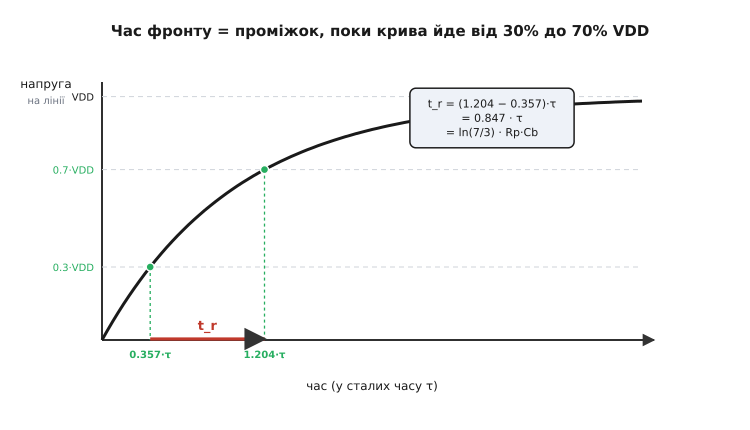
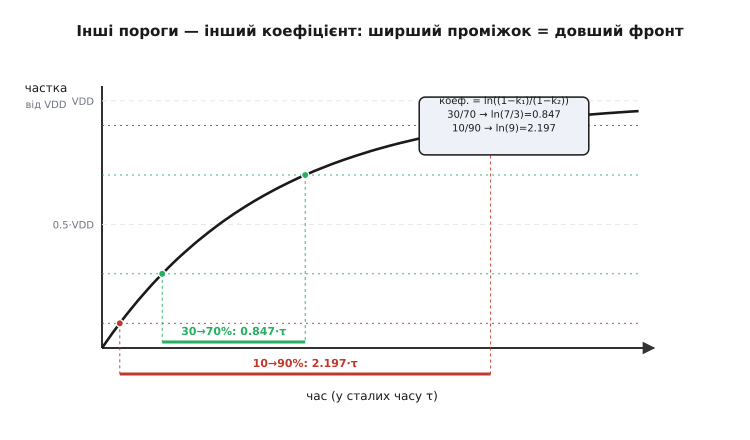

# 🧮 Звідки береться t_r ≈ 0.85·R·C

У статті про підтяжку ми скористалися готовою формулою: час фронту «вгору» дорівнює `t_r ≈ 0.8473 · Rp · Cb`, а звідси й верхня межа опору `Rp(max) = t_r / (0.8473 · Cb)`. Число 0.8473 з'явилося, ніби з капелюха, і ми пообіцяли пояснити його тут. Виведемо його повністю — від рівняння експоненти до конкретного коефіцієнта, — щоб ви бачили не магічну сталу, а звичайний наслідок того, як заряджається ємність крізь резистор. Заодно стане зрозуміло, чому це саме **0.85**, а не 2.2 чи 0.7, і від чого це число залежить: виявиться, що воно цілком у наших руках і змінюється разом із порогами, на яких ми вирішили міряти фронт.

Сенс тут не суто академічний. Коли в описі чіпа чи стандарту шини ви бачите граничний час фронту, він **завжди** прив'язаний до якихось двох рівнів напруги — і якщо переплутати, між якими саме рівнями його міряти, розрахунок підтяжки попливе. Тож розберімося, що це за рівні, звідки береться коефіцієнт між ними й сталою часу, і чому I2C обрав саме 30% та 70%.

## Рівняння зарядки: з чого все починається

Відштовхнімося від єдиного факту, який нам потрібен: коли вихід відпускає лінію, її ємність Cb заряджається крізь підтяжку Rp до напруги живлення VDD по класичній кривій RC. Чому саме по ній і звідки сама експонента — окрема історія, її ми не повторюватимемо; досить узяти результат.

> 🔧 **Навіщо це.** Уся ця вставка стоїть на одному рівнянні зарядки. Звідки воно береться — з закону Кірхгофа для кола «резистор плюс конденсатор» виходить диференціальне рівняння, розв'язок якого і є експонента. Якщо хочеться побачити цей висновок до останнього кроку (як саме з'являється `e`, чому показник саме `−t/τ`), він розписаний окремо. Тут же ми беремо рівняння як відому відправну точку й працюємо вже з ним.

Потрібне знання: напруга на ємності, яку заряджають крізь резистор від нуля до VDD, росте в часі за зростальною експонентою `v(t) = VDD·(1 − e^(−t/τ))`, де стала часу `τ = R·C`; за одну τ напруга набирає ≈63% шляху до мети, за п'ять — практично всі 99%. Виведення цього рівняння з кола — у статті [Стала часу RC](topic:hw-analog/rc-time-constant), а сам диференціальний розв'язок — у вставці [експоненційне ОДУ](topic:hw-analog/rc-time-constant/math-exponential-ode.md).

Ось воно, наше робоче рівняння:

```text
v(t) = VDD · (1 − e^(−t/τ)),    τ = Rp · Cb
```

Прочитаймо його повільно, бо далі ми весь час спиратимемося на цю форму. У нульовий момент `t = 0` показник `−t/τ` дорівнює нулю, `e⁰ = 1`, і вся дужка `(1 − 1) = 0` — лінія стартує з нуля, як і має бути одразу після того, як ключ її щойно тримав унизу. Коли час росте, показник `−t/τ` стає все від'ємнішим, `e^(−t/τ)` тане до нуля, дужка повзе до одиниці, а напруга — до VDD. Лінія ніколи не «доскакує» до VDD рівно, а нескінченно до неї наближається; саме тому жодного «моменту, коли фронт скінчився» в природі немає — і нам доведеться **самим домовитися**, що вважати початком і кінцем фронту.

Ось перший важливий висновок, ще до всякої арифметики: оскільки крива асимптотична, **час фронту — поняття умовне**. Не можна спитати «коли напруга дійшла до VDD» — формальна відповідь «ніколи». Можна лише спитати «коли вона дійшла, скажімо, до 70% VDD» — а це вже число. Тому будь-який час фронту в техніці завжди заданий **між двома рівнями**, і коефіцієнт зв'язку з τ цілком залежить від того, які два рівні ми взяли. Це не дрібниця стандарту, а неминучість математики: без двох опорних рівнів сама величина «час фронту» не означає нічого.

## Час досягти заданого рівня

Тепер головний прийом усієї вставки — **обернути** рівняння. Воно дає напругу як функцію часу; нам же треба навпаки: за заданою часткою напруги дізнатися, **коли** її досягнуто. Тобто розв'язати рівняння відносно `t`.

Хай нас цікавить момент, коли напруга досягла певної частки `k` від VDD (наприклад, `k = 0.3` для 30%). Підставимо `v = k·VDD`:

```text
k · VDD = VDD · (1 − e^(−t/τ))
```

Поділимо обидві частини на VDD — і, що дуже зручно, **саме живлення скорочується**:

```text
k = 1 − e^(−t/τ)
```

Це вже маленьке відкриття: у частках від VDD крива зарядки взагалі **не залежить від рівня живлення**. Чи шина на 3.3 В, чи на 5 В, чи на 1.8 — момент, коли вона набере свої 30% чи 70% (у частках τ), той самий. Живлення розтягує криву вгору-вниз за висотою, але не за часом. Тому й коефіцієнт фронту, який ми зараз виведемо, буде однаковим для будь-якого VDD — і це не випадковість, а прямий наслідок того, що VDD скоротилося ще на цьому кроці.

Тягнемо далі. Переносимо експоненту вліво, частку — вправо:

```text
e^(−t/τ) = 1 − k
```

Щоб дістати `t` із показника, потрібен інструмент, який «розв'язує» експоненту, — **натуральний логарифм** (лат. *logarithmus naturalis*, ln), обернений до піднесення основи `e` в степінь. Він просто питає: «у який степінь треба звести `e`, щоб отримати оце число». Прикладемо `ln` до обох частин; ліворуч `ln(e^x) = x` (логарифм за визначенням «знімає» експоненту):

```text
−t/τ = ln(1 − k)
```

Лишилося домножити на `−τ`:

```text
t(k) = −τ · ln(1 − k)
```

Ось вона — формула моменту, коли зарядка крізь RC досягає частки `k` від кінцевого рівня. Вона працює для будь-якого `k` від 0 до 1. Перевірмо її на знайомому числі: при `k = 0.63` маємо `t = −τ·ln(0.37) = τ·0.994 ≈ τ` — тобто 63% досягається рівно за одну сталу часу, точнісінько як в усіх підручниках про RC. Формула жива й узгоджена з тим, що ми вже знали; тепер скористаємося нею для двох потрібних рівнів. (Якщо механіка `ln` як оберненого до `e` хочеться твердіше, її основи — у статті [Логарифми](topic:math-analysis/logarithms).)

> 🔧 **Навіщо це.** Цю саму формулу `t(k) = −τ·ln(1 − k)` корисно тримати в голові й поза підтяжкою. Вона відповідає на питання «скільки чекати, поки RC-вузол набере стільки-то відсотків» у будь-якій схемі: затримка скидання мікроконтролера на RC-ланці, час заряду конденсатора фільтра живлення до робочого рівня, тривалість фронту на будь-якій ємнісній лінії. Один раз вивівши її, ви рахуєте всі такі затримки за хвилину, не вгадуючи «на око».

## Від двох рівнів — до коефіцієнта фронту

Час фронту — це **різниця** двох моментів: коли лінія пройшла нижній опорний рівень і коли дійшла до верхнього. Стандарт I2C, як ми побачимо за хвилину, міряє фронт між 30% і 70% від VDD. Знайдімо обидва моменти нашою формулою.

Нижній рівень, `k = 0.3`:

```text
t₃₀ = −τ · ln(1 − 0.3) = −τ · ln(0.7) = τ · 0.3567
```

Верхній рівень, `k = 0.7`:

```text
t₇₀ = −τ · ln(1 − 0.7) = −τ · ln(0.3) = τ · 1.2040
```

(Логарифми тут від чисел, менших за одиницю, тому самі `ln(0.7)` і `ln(0.3)` від'ємні; помножені на `−τ`, обидва моменти виходять додатні — як і має бути для часу.)

Час фронту — це проміжок між ними:

```text
t_r = t₇₀ − t₃₀ = −τ·ln(0.3) − (−τ·ln(0.7))
    = τ · (ln(0.7) − ln(0.3))
```

Тут варто бути уважним зі знаками, бо саме на цьому місці легко наплутати. Розкриваємо дужки акуратно: `t₇₀ − t₃₀ = −τ·ln(0.3) + τ·ln(0.7) = τ·(ln(0.7) − ln(0.3))`. Усередині дужки від більшого логарифма (`ln(0.7) ≈ −0.357`) віднімаємо менший (`ln(0.3) ≈ −1.204`), і результат додатний: `−0.357 − (−1.204) = 0.847`. За властивістю логарифмів різницю можна згорнути в логарифм частки, `ln(0.7) − ln(0.3) = ln(0.7/0.3) = ln(7/3)`, що іноді записують і так:

```text
t_r = τ · ln(7/3) = τ · ln(2.333…)
```

Підрахуймо саме число:

```text
ln(7/3) = ln(2.3333) = 0.8473
```

Ось і вся розгадка. Коефіцієнт 0.8473 — це **просто `ln(7/3)`**, відстань між рівнями 30% і 70% на експоненційній кривій, виміряна в сталих часу. Жодної магії: ми спитали «за скільки τ зарядка проходить від 0.3 до 0.7 VDD» — і відповідь виявилася 0.8473·τ.

```text
t_r = 0.8473 · τ = 0.8473 · Rp · Cb     (рівні 30% → 70% VDD)
```

А оскільки нас у проєктуванні цікавить **обернене питання** — який найбільший опір ще вкладається у відведений шиною час фронту, — просто розв'яжемо цю рівність відносно Rp:

```text
Rp(max) = t_r / (0.8473 · Cb)
```

Це і є та сама формула верхньої межі зі статті. Тепер вона не «дана згори», а виведена з рівняння зарядки за три кроки: обернули експоненту логарифмом, узяли різницю двох рівнів, розв'язали відносно опору.

**Перевіримо на числі зі статті: швидкий I2C, дозволений фронт t_r = 300 нс, ємність шини Cb = 150 пФ. Який Rp(max)?**

```text
Rp(max) = t_r / (0.8473 · Cb)
        = 300·10⁻⁹ / (0.8473 · 150·10⁻¹²)
        = 300·10⁻⁹ / (127.1·10⁻¹²)
        = 300·10⁻⁹ / 1.271·10⁻¹⁰
        ≈ 2360 Ом  ≈ 2.4 кОм
```

Те саме ≈2.4 кОм, що й у статті, — лише тепер ми бачимо, що 0.8473 в знаменнику взялося не нізвідки, а є `ln(7/3)`.


*Та сама крива RC, але дивимося на час. Момент перетину 30% настає за 0.357·τ, момент 70% — за 1.204·τ; їхня різниця 0.847·τ і є час фронту t_r між цими рівнями. Видно й чому крива асимптотична до VDD: «кінця» фронту немає, є лише момент досягнення обраного рівня.*

## Чому саме 30% і 70%: пороги самого I2C

Лишилося найцікавіше: чому стандарт обрав міряти фронт саме між 30% і 70%, а не, скажімо, між 10% і 90%, як заведено в багатьох інших галузях електроніки? Відповідь не в зручності округлення, а в тому, що **це не довільні рівні — це самі логічні пороги I2C-входу**.

За специфікацією I2C (NXP UM10204, чинна редакція 7.0 від 2021 року) вхід приймача в режимах Standard/Fast розрізняє рівні так: усе, що **нижче 0.3·VDD**, гарантовано читається як «0» (це поріг VIL — максимальна напруга, яку ще приймають за нуль), а все, що **вище 0.7·VDD**, гарантовано читається як «1» (поріг VIH — мінімальна напруга, яку вже приймають за одиницю). Між цими двома рівнями — «сіра зона» невизначеності, де приймач не зобов'язаний читати ні те, ні те. *(Статус: усталено — пряма норма специфікації; ці самі рівні 0.3VDD/0.7VDD задані як VIL/VIH і до них прив'язані всі часові параметри шини.)*

Звідси й вибір рівнів для фронту стає очевидним. Стандарт міряє час фронту саме між тими точками, де сигнал **виходить із зони впевненого нуля** (0.3·VDD) і **входить у зону впевненої одиниці** (0.7·VDD). Тобто t_r — це час, поки лінія перетинає «сіру зону» невизначеності: скільки триває перехід від «це ще точно 0» до «це вже точно 1». Міряти фронт по будь-яких інших рівнях для логічної шини не мало б фізичного сенсу — нас цікавить рівно той проміжок, поки рівень неоднозначний, бо саме він обмежує, як швидко можна слати наступний біт.

Тому 30% і 70% тут — не округлення «для краси», а **логічні пороги конкретної шини, винесені в означення часу фронту**. Інша шина зі своїми порогами дала б інші рівні й, отже, інший коефіцієнт. У цьому глибша думка: коефіцієнт `0.8473` належить не «фізиці RC взагалі», а **парі порогів I2C**. Зміни пороги — зміниться й коефіцієнт; ми зараз це й покажемо.

## Інші пороги — інший коефіцієнт

Щоб остаточно закріпити, що 0.8473 «прив'язане» саме до рівнів 30/70, прокрутимо ту саму машинку для інших пар. Формула в нас уже загальна: для переходу від нижнього рівня `k₁` до верхнього `k₂` коефіцієнт дорівнює

```text
коефіцієнт = ln(1 − k₁) − ln(1 − k₂) = ln( (1 − k₁) / (1 − k₂) )
```

Найпоширеніша альтернатива — **10% → 90%**, класична для опису фронтів цифрових сигналів та осцилографів. Підставимо `k₁ = 0.1`, `k₂ = 0.9`:

```text
коефіцієнт = ln(1 − 0.1) − ln(1 − 0.9) = ln(0.9) − ln(0.1)
           = ln(0.9 / 0.1) = ln(9) = 2.1972
```

Більш ніж удвічі більше за наше 0.8473. І це логічно: рівні 10% та 90% «обрізають» більший шмат кривої — від самого пологого хвоста внизу до повільного під'їзду вгорі, — а ці ділянки зарядка проходить найдовше, тож і часу між ними більше. Якби I2C міряв фронт по 10/90, та сама лінія «звітувала» б про фронт у 2.5 раза довший за тих самих Rp і Cb — і формула верхньої межі стала б `Rp(max) = t_r / (2.1972·Cb)`.

Для повноти — ще пара симетричних рівнів, **20% → 80%**:

```text
коефіцієнт = ln(0.8) − ln(0.2) = ln(0.8 / 0.2) = ln(4) = 1.3863
```

Зведімо разом, щоб картина була в одному місці:

```text
рівні        коефіцієнт = ln((1−k₁)/(1−k₂))
30% → 70%    ln(7/3) = 0.8473      ← пороги I2C, ним і користуємось
20% → 80%    ln(4)   = 1.3863
10% → 90%    ln(9)   = 2.1972
```

Тепер видно головне правило, заради якого все це й рахувалося: **час фронту без зазначення рівнів — беззмістовний**. Сказати «фронт 300 нс» — це півфрази; повна — «фронт 300 нс між 30% і 70%». Якщо в описі чіпа фронт заданий по 10/90, а ви підставите його в I2C-формулу з 0.8473 (розраховану на 30/70), то завищите дозволений опір приблизно в `2.1972/0.8473 ≈ 2.6` раза — і поставите завелику підтяжку, з якою шина збоїтиме. Тому, користуючись будь-якою формулою фронту, завжди звіряйте, **на які рівні** вона розрахована, і чи тими самими рівнями задано ваш `t_r`. Для розрахунку I2C-підтяжки обидва — і норматив t_r зі специфікації, і наш коефіцієнт — узгоджено стоять на 30/70, тож вони сумісні; мішати їх із числами «по 10/90» не можна.


*Чому коефіцієнт залежить від порогів. На тій самій кривій RC проміжок 30→70% (зелений) вузький — це майже середина, де крива найкрутіша; проміжок 10→90% (червоний) широкий, бо захоплює пологий хвіст унизу й повільний під'їзд угорі. Звідси й 0.8473 проти 2.1972 для тих самих Rp і Cb.*

## Звідки береться сама ємність Cb

Коефіцієнт ми вивели; лишилося чесно сказати, **що** стоїть під літерою Cb, бо без розумного числа для неї формула Rp(max) повисає в повітрі. Ємність шини — це не один компонент, а **сума** кількох внесків, що всі висять на одній лінії паралельно (а паралельні ємності, на відміну від опорів, просто додаються).

Складників три, від найбільшого до найдрібнішого:

```text
Cb = C_доріжки + Σ C_входів + C_роз'ємів-і-проводів
```

**Ємність доріжки** на платі залежить від її довжини та геометрії над опорним шаром («землею»): груба, але робоча оцінка — близько **1 пФ на сантиметр** звичайної доріжки на типовому склотекстоліті. Коротка лінія між сусідніми чіпами додасть пікофарад зо три-п'ять; довга шина через усю плату — уже десятки. Звідси й перше практичне правило з основної статті: коротші доріжки — менша Cb — ширше вікно опору.

**Ємність входів** — кожен вхід чіпа, під'єднаний до лінії, має власну вхідну ємність, типово одиниці пікофарад (часто 3–10 пФ, точне число — в описі конкретного чіпа). Один давач — дрібниця; десяток пристроїв на спільній шині — уже додаткові десятки пікофарад. Тому друге правило: менше пристроїв на лінії — менша Cb.

**Роз'єми, перемички, відрізки проводів** додають решту — зазвичай найменше, але довгий шлейф чи міжплатний кабель можуть несподівано переважити все інше.

Точне значення Cb знати наперед майже ніколи не вдається — і не треба. Для розрахунку підтяжки досить **порядку величини**: «десятки пікофарад» для компактної плати, «за сотню» для довгих ліній чи багатьох пристроїв. Саме тому в статті ми брали круглі 150 пФ — це характерна верхня межа, яку, до речі, специфікація I2C і задає як максимально допустиму ємність шини для звичайних режимів. Якщо ваша оцінка Cb наближається до цієї стелі, це вже сигнал: шина навантажена під зав'язку, вікно опору вузьке, і додавати на неї ще щось — ризиковано.

> 🔧 **Навіщо це.** Практична цінність цього розкладу — у тому, що він підказує, **яким важелем тиснути**, коли вікно опору схлопнулося. Формула Rp(max) показала *що* сталося (верхня межа впала нижче нижньої), а розклад Cb показує *чому* і *що робити*: якщо найбільший внесок — доріжки, коротшайте трасування; якщо входи — знімайте зайві пристрої з шини; якщо кабель — переходьте на коротший чи на іншу топологію. Без цього розкладу «розвантажте шину» з основної статті лишалося б порадою без конкретного важеля.

## Що ми насправді вивели

Зведімо нитку, бо за виведенням легко загубити, навіщо все це було. Ми взяли єдине рівняння зарядки ємності крізь резистор, обернули його логарифмом і дістали час досягнення будь-якого рівня. Різниця двох таких часів — для рівнів 30% і 70% — і є час фронту, а коефіцієнт між ним і сталою `τ = Rp·Cb` виявився рівно `ln(7/3) = 0.8473`. Звідси формула верхньої межі опору в статті — не постулат, а наслідок.

Дорогою проступили три думки, що варті більше за саме число. По-перше, через асимптотичність кривої час фронту в принципі визначений лише **між двома рівнями** — інакше він беззмістовний. По-друге, ці рівні для I2C — не округлення, а **самі логічні пороги шини** (0.3·VDD і 0.7·VDD), тож фронт міряє рівно час перетину зони невизначеності між «точно 0» і «точно 1». По-третє, коефіцієнт **жорстко зчеплений із вибором рівнів**: 30/70 дають 0.8473, 10/90 дали б 2.1972, і плутати числа з різних пар — пряма дорога до завеликої підтяжки й шини, що збоїть.

Тому, повернувшись до основної статті з її формулою `Rp(max) = t_r / (0.8473 · Cb)`, ви читаєте її вже не як рецепт, а як стислий запис усього цього виведення: бери дозволений шиною час фронту (між її ж порогами 30/70), бери оцінку ємності лінії — і дістанеш найбільший опір, з яким найповільніший фронт ще встигне.
