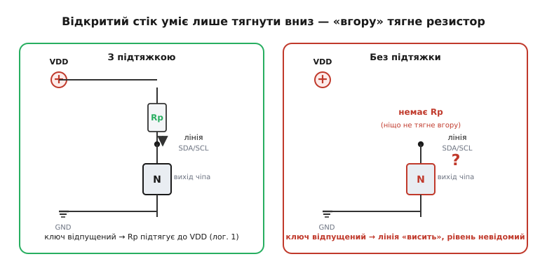
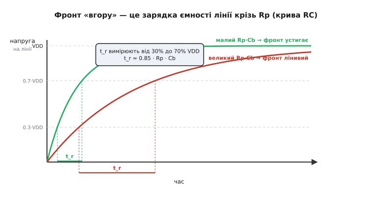
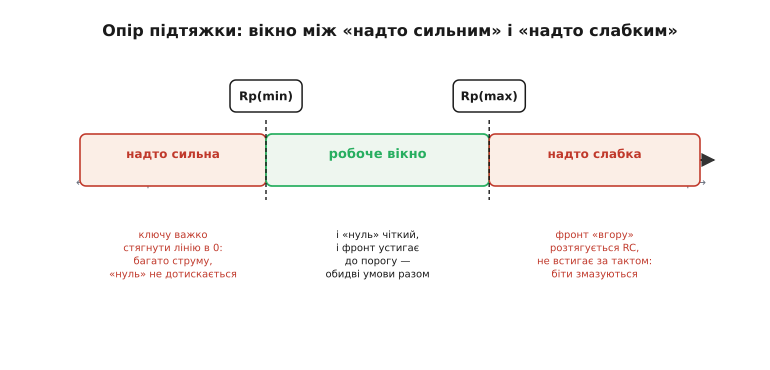
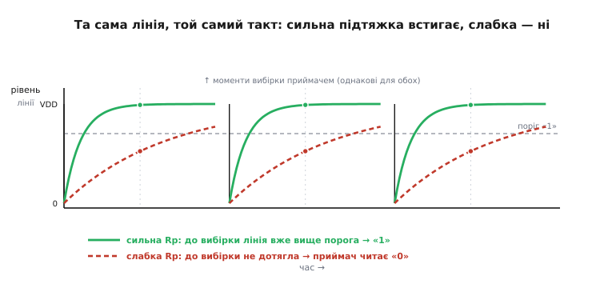

# Розрахунок підтяжки

Коли ми порівнювали [SPI та I2C](root:embedded/spi-vs-i2c), одну деталь I2C обійшли побіжно: обидві його лінії — з відкритим стоком, тому на шину обов'язково вішають зовнішні резистори-**підтяжки**. Так само влаштовані лінія переривання від давача, сигнал «готовності» від модуля, кнопка на вході мікроконтролера. Скрізь, де щось «уміє лише тягнути вниз» або взагалі мовчить, рівень спокою задає підтяжка. І щоразу постає те саме практичне питання: **який опір узяти** — 1 кОм, 4.7 кОм, 10 кОм? У статтях про шини це число просто з'являлося як належне. Тепер виведемо його самі, від першопричини, щоб ставити підтяжку усвідомлено, а не списувати з чужої схеми.

Резистор тут не «про всяк випадок» — він робить цілком конкретну роботу, і саме від його опору залежить, чи запрацює шина на потрібній швидкості та чи правильно мікроконтролер прочитає лінію. Завеликий опір — і сигнал «розмазується»; замалий — і вихід чіпа не може дотиснути лінію в нуль. Між цими двома бідами лежить вузьке робоче вікно, і весь розрахунок — це знайти його межі.

### Навіщо взагалі підтяжка

Почнімо з того, **чому без резистора не обійтися**. Звичайний логічний вихід — двотактний (англ. *push-pull*): усередині два ключі, верхній тягне лінію до живлення, нижній — до землі, і будь-якої миті лінію активно тримає один із них. Такому виходу підтяжка не потрібна: він сам задає і «1», і «0».

А є виходи з [відкритим стоком](topic:hw-digital/open-drain-output) (англ. *open-drain*; історичний родич на біполярних транзисторах — [відкритий колектор](topic:hw-components/open-collector-output)). У них верхнього ключа немає зовсім — лишився тільки нижній транзистор. Коли він відкритий, лінію стягнуто в нуль. Коли закритий, вихід просто **відпускає** лінію — не тягне нікуди, ніби дріт повис у повітрі. Сам по собі такий вихід уміє лише одне: притискати лінію вниз. «Вгору» її нема чому тягнути.

> 🔧 **Навіщо це.** Здавалося б, навіщо такий «неповноцінний» вихід? Бо саме він дозволяє з'єднати кілька пристроїв на **один спільний дріт** без конфлікту. Якщо два двотактні виходи зіткнуться — один жене «1», другий «0», — вони закоротять живлення на землю крізь себе й згорять. А виходи з відкритим стоком безпечні: хто завгодно може стягнути лінію в нуль, ніхто не тягне її вгору силоміць. Звідси й уся монтажна логіка, переривання зі спільної лінії та I2C з його двопровідною шиною.

Тут і вступає підтяжка. Її ставлять між лінією і плюсом живлення (VDD). Поки всі виходи на лінії відпущені, резистор тихенько підтягує лінію до VDD — це й буде «1». Щойно якийсь вихід відкриває свій нижній ключ, він пересилює слабкий резистор і стягує лінію в нуль — це «0». Резистор слабкий навмисне: він має лише задавати рівень спокою, а не змагатися з ключем.


*Вихід із відкритим стоком уміє лише стягувати лінію вниз. З підтяжкою (ліворуч): ключ відпущений — резистор підтягує лінію до VDD, виходить чітка «1». Без підтяжки (праворуч): ключ відпущений — лінію ніщо не тримає, вона «висить», і рівень читається випадково.*

Без резистора відпущена лінія перетворюється на антену: її потенціал ловить наводки, повзе від витоків, і мікроконтролер читає то «0», то «1» навмання. Тому правило просте: **є відкритий стік або вхід, що має десь спочивати, — має бути підтяжка**. Лишилося визначити її опір.

### Замала підтяжка: ключу важко дотиснути нуль

Здавалося б, чим менший опір, тим краще — тим жвавіше резистор тягне лінію вгору. Але є нижня межа, і диктує її **«нуль», а не «одиниця»**.

Згадаймо, що нижній ключ виходу — не ідеальний дріт. Це транзистор із якимось скінченним опором у відкритому стані; протікаючи крізь нього, струм створює невелике падіння напруги. Виробник гарантує: за певного струму стоку (типово IOL = 3 мА) напруга на відкритому виході не підніметься вище VOL (типово 0.4 В) — це й є гарантований «надійний нуль», який приймач напевно розпізнає.

А тепер погляньмо, звідки той струм береться. Коли ключ стягує лінію вниз, підтяжка нікуди не зникає — вона так і висить між VDD і лінією, і крізь неї тече струм просто в стягнуту вниз лінію, а далі крізь ключ у землю. Чим **менший** опір підтяжки, тим **більший** цей струм мусить проковтнути ключ. Якщо опір замалий, струм перевищить ті 3 мА, і падіння на ключі підскочить вище 0.4 В — «нуль» перестане бути надійним нулем, а сам ключ дарма гріється.

Звідси нижня межа опору. Найгірший момент — коли лінія вже стягнута майже в нуль: майже все VDD падає на резисторі, і струм крізь нього максимальний. Щоб цей струм не перевищив IOL, опір має бути не меншим за:

```text
Rp(min) = (VDD − VOL) / IOL
```

**Шина живиться від 3.3 В, вихід тримає VOL = 0.4 В за струму IOL = 3 мА. Який найменший опір підтяжки?**

```text
Rp(min) = (VDD − VOL) / IOL
        = (3.3 − 0.4) / 0.003
        = 2.9 / 0.003
        ≈ 967 Ом
```

Отже, для 3.3-вольтової шини опір нижчий за ≈1 кОм уже ризикований: ключу важко дотиснути надійний нуль, і він зайве гріється. Це і є сенс нижньої межі — **захист «нуля»**. Тепер подивимось, що штовхає опір угору.

### Завелика підтяжка: фронт «вгору» не встигає

Верхню межу диктує вже не «нуль», а **швидкість**, з якою лінія повертається в «1». І щоб її зрозуміти, треба згадати, що в будь-якої доріжки на платі є власна **ємність**.

У лінії є паразитна ємність відносно землі: ємність доріжки, входів усіх під'єднаних чіпів, провідників. Назвімо її Cb (англ. *bus capacitance* — ємність шини). Поки ключ стягує лінію вниз, він активно й швидко розряджає цю ємність — фронт «вниз» різкий. А от **вгору** лінію тягне сам лише резистор: відпустивши лінію, ключ більше нічим не керує, і ємність заряджається крізь підтяжку до VDD.

А заряд ємності крізь резистор — це класична [RC-зарядка](topic:hw-analog/rc-time-constant): напруга росте не миттєво, а по експоненті зі сталою часу τ = Rp · Cb. Що більший опір Rp, то повільніше резистор наповнює ємність і то лінивіший фронт. Ось і пастка: великий опір ощадить струм (добре для «нуля»), але розтягує фронт «вгору» — і якщо він не встигне дорости до порога «1» за відведений шиною час, приймач прочитає старий «0» замість нової «1».


*Відпустивши лінію, ключ лишає ємність Cb заряджатися крізь Rp — напруга росте по кривій RC. Час фронту t_r вимірюють між 30% і 70% від VDD. Малий добуток Rp·Cb (зелена крива) дає короткий фронт; великий (червона) — лінивий, що може не встигнути за тактом.*

Швидкі шини прямо обмежують **час фронту** t_r (англ. *rise time*) — скільки лінії дозволено дряпатися вгору. Наприклад, стандарт I2C задає максимум 1000 нс у звичайному режимі (100 кГц), 300 нс у швидкому (400 кГц) і 120 нс у Fast-mode Plus (1 МГц). Зв'язок часу фронту зі сталою RC виводиться з рівняння експоненти — як саме, розписано у вставці [звідки береться t_r ≈ 0.85·R·C](root:embedded/pullup-resistor-design/math-rise-time.md); тут скористаймося готовим результатом. Час фронту по стандарту міряють між 30% і 70% від VDD, і для зарядки RC це дає:

```text
t_r ≈ 0.8473 · Rp · Cb     (рівень 30% → 70% VDD)
```

Звідки й верхня межа опору: щоб устигнути у відведений t_r, опір має бути не більшим за:

```text
Rp(max) = t_r / (0.8473 · Cb)
```

**Швидкий I2C: 400 кГц, дозволений фронт t_r = 300 нс, ємність шини Cb = 150 пФ. Який найбільший опір підтяжки?**

```text
Rp(max) = t_r / (0.8473 · Cb)
        = 300e−9 / (0.8473 · 150e−12)
        = 300e−9 / 1.271e−10
        ≈ 2360 Ом  ≈ 2.4 кОм
```

Тобто на швидкому I2C з такою ємністю підтяжка, більша за ≈2.4 кОм, уже не встигне розігнати фронт — лінія читатиметься з помилками. Стале число 0.8473 — це просто ln(0.7) − ln(0.3) для рівнів 30% і 70% на експоненті; деталі — у тій-таки вставці.

### Вікно між двома межами

Тепер картина повна. Знизу опір тисне «нуль»: замала підтяжка — ключ не дотискає надійного нуля й гріється. Згори тисне «фронт»: завелика підтяжка — лінія повільно повзе вгору й не встигає за тактом. Робочий опір лежить **між** цими двома межами:

```text
Rp(min) ≤ Rp ≤ Rp(max)
   967 Ом ≤ Rp ≤ 2.4 кОм      (наш приклад: 3.3 В, 3 мА, 300 нс, 150 пФ)
```


*Перетягування каната. Менший опір (ліворуч) — ключу важко стягнути надійний нуль і він гріється; більший (праворуч) — фронт «вгору» розтягується RC і не встигає за тактом. Працює лише вікно посередині, де обидві умови виконані разом.*

У це вікно й треба влучити. Звідси й знайомі 4.7 кОм для типового повільного I2C і 2.2 кОм для швидкого: це просто значення зсередини відповідного вікна. А коли вікно **звужується або зникає** — а так буває, тільки-но ємність шини велика, — це не привід ставити «щось середнє». Це сигнал, що шину перевантажено: треба коротшати доріжки, знімати зайві пристрої з лінії або переходити на активну підтяжку. Якщо Rp(max) виявився меншим за Rp(min) — фізично сумісного опору немає, і ніяке число тут уже не врятує.

> 🔧 **Навіщо це.** На практиці підтяжку часто ставлять «як у сусідній платі» — і дарма. Перенесли давачі на довші доріжки, додали ще пару чіпів на шину — ємність Cb виросла, і вчорашні 4.7 кОм уже не вписуються у вікно: шина починає збоїти на швидкості, та ще й «плаваюче», бо помилка статистична. Уміючи прикинути обидві межі, ви за пів хвилини скажете, чи опір ще годиться, чи шину пора розвантажувати, — замість того щоб годинами ловити випадкові збої логічним аналізатором.

### Що це означає для фронту на лінії

Корінь усього — та сама несиметрія: вниз лінію жене сильний ключ, угору — слабкий резистор. Тому фронт «вгору» завжди повільніший за фронт «вниз», і саме він — вузьке місце шини. Вибір опору — це по суті вибір, наскільки крутим буде цей повільний фронт.


*Та сама лінія, той самий такт. Спад різкий в обох — його робить ключ. А фронт «вгору» різний: сильна підтяжка (суцільна) встигає підняти лінію вище порога «1» до моменту вибірки приймачем; слабка (пунктир) до того ж моменту не дотягує — приймач читає «0» замість «1».*

Видно, чому завелика підтяжка така підступна: ламається не «нуль», який легко побачити осцилографом, а саме «одиниця» — і то лише на швидкості й лише іноді. Зменшивши опір, фронт роблять крутішим — лінія встигає до порога, біти перестають змазуватися. Це й закладено в Rp(max): він гарантує, що навіть найповільніший фронт устигне.

### Як вибрати на практиці

Складімо все в порядок дій, яким можна користуватися щоразу.

Спершу оцініть **ємність шини** Cb — від неї залежить верхня межа. Доріжка на платі дає приблизно 1 пФ на сантиметр, кожен вхід чіпа — кілька пікофарад; для звичайної невеликої плати виходить десятки пікофарад, для довгих ліній чи багатьох пристроїв — за сотню. Точне число знати не обов'язково, досить порядку.

Далі порахуйте **обидві межі**:

```text
Rp(min) = (VDD − VOL) / IOL          ← щоб ключ дотискав надійний нуль
Rp(max) = t_r / (0.8473 · Cb)        ← щоб фронт устигав за тактом
```

VOL та IOL беруть з опису того чіпа, що стягує лінію (для I2C типово 0.4 В і 3 мА); t_r — з вимог шини (для I2C — за її режимом). Потім оберіть опір **усередині вікна**, ближче до меншого краю, якщо важлива швидкість і не шкода струму, чи ближче до більшого — якщо бережете живлення (нижче про це). І нарешті, якщо вікно вийшло від'ємним (Rp(max) < Rp(min)), не шукайте компромісу: **розвантажуйте шину** — коротші доріжки, менше пристроїв, нижча швидкість або активна підтяжка.

Зручно зробити цей розрахунок просто формулою в коді — щоб на етапі проєктування одразу бачити вікно для своїх умов:

**Приклад (межі вікна підтяжки для заданих умов).**

```c
#include <stdio.h>

// Повертає межі опору підтяжки [Ом] для заданих умов шини.
// vdd, vol — у вольтах; iol — у амперах; tr — у секундах; cb — у фарадах.
void pullup_window(double vdd, double vol, double iol,
                   double tr, double cb,
                   double *rp_min, double *rp_max) {
    *rp_min = (vdd - vol) / iol;            // нижня межа: надійний нуль
    *rp_max = tr / (0.8473 * cb);           // верхня межа: фронт устигає
}

int main(void) {
    double rmin, rmax;
    // Швидкий I2C: 3.3 В, VOL=0.4 В, IOL=3 мА, t_r=300 нс, Cb=150 пФ
    pullup_window(3.3, 0.4, 3e-3, 300e-9, 150e-12, &rmin, &rmax);

    printf("Rp(min) = %.0f Om\n", rmin);    // ~967
    printf("Rp(max) = %.0f Om\n", rmax);    // ~2360
    if (rmax < rmin)
        printf("Vikno porozhnie -> rozvantazhuy shynu!\n");
    else
        printf("Bery Rp mizh %.0f i %.0f Om\n", rmin, rmax);  // напр. 2.2 кОм
    return 0;
}
```

Цей шматок навмисне тривіальний — уся складність не в арифметиці, а в розумінні, **звідки** кожна межа й що робити, коли вони сходяться. Маючи це в коді, легко перевірити будь-яку зміну плати: збільшили ємність — одразу видно, чи не схлопнулося вікно.

### Менше струму чи крутіший фронт

Лишилося звести два хвости, бо у виборі всередині вікна ховається ще один компроміс — **струм проти швидкості**.

Поки лінія стягнута в нуль, крізь підтяжку постійно тече струм I ≈ VDD / Rp прямо в землю. Менший опір — крутіший фронт, але більший цей струм і більше марних втрат. На 3.3 В резистор 1 кОм у нулі з'їдає 3.3 мА, а 4.7 кОм — лише 0.7 мА. Для пристрою від мережі це дрібниця, а для приладу на батарейці, де шина часто лежить у нулі, кожні зайві міліампери прямо вкорочують час роботи.

Тому правило всередині вікна таке: **бережете живлення — беріть опір ближче до верхньої межі** (більший Rp, менший струм), ціною лінивішого фронту; **женетеся за швидкістю — ближче до нижньої** (менший Rp, крутіший фронт), ціною більшого струму. Коли ж хочеться і малого струму спокою, і крутого фронту водночас, пасивний резистор уже не дає — і тоді ставлять [активну підтяжку](topic:hw-digital/wired-logic): схему, що в нулі бере мало, а на фронті коротко «підхльоскує» лінію сильним струмом. Це вже інша тема, але виростає вона прямо з компромісу, який ми щойно вивели.

Підсумок короткий. Підтяжка — не «деталь про всяк випадок», а елемент із точно порахованим опором. Нижню межу диктує надійний «нуль», верхню — встигання фронту «вгору», а вікно між ними — те, у що треба влучити. Знаючи лише напругу живлення, параметри VOL/IOL чіпа, дозволений час фронту й приблизну ємність шини, ви виводите цей опір самі — і вже ніколи не списуєте «4.7 кОм» зі схеми наосліп.
