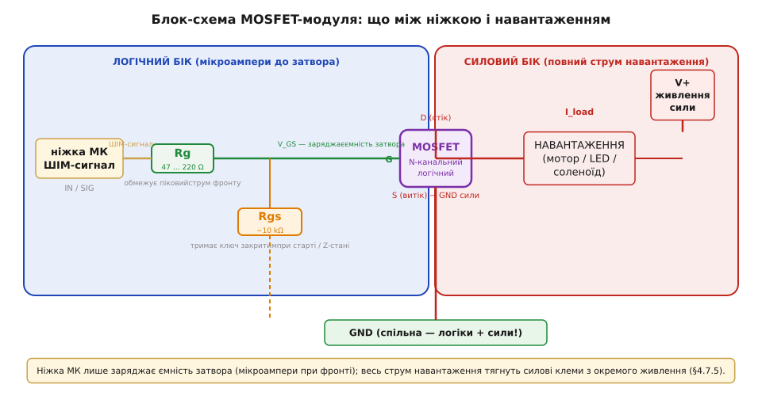
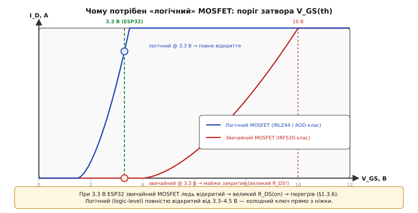

# 🔌 MOSFET-модуль для ШІМ-навантажень: затвор, частота, нагрів

> Універсальний патерн [керування потужним навантаженням](root:embedded/pwm-power-control) — «ШІМ-ніжка → затвор → транзистор-ключ → навантаження + флайбек-діод» — у силових ключах спирається на MOSFET (metal-oxide-semiconductor field-effect transistor), або польовий транзистор. Тема дає *ідею* ключа; ця вставка бере в руки **готову плату** MOSFET-модуля і розбирає три речі, від яких залежить, чи спрацює вона й не згорить: **затвор** (як ніжка його відкриває і чому «логічний» поріг є критичним), **частота** (чому є стеля і звідки вона береться), **нагрів** (звідки тепло і коли потрібен радіатор).

## Що це за клас

Готовий силовий ключ на платі — це N-канальний MOSFET плюс мінімальна обв'язка затвора плюс клемники під товстий дріт, і все це керується звичайним логічним рівнем ніжки мікроконтролера. Ринок пропонує три канонічні варіанти. Перший — «**IRF520-клас**»: старіша й значно дешевша платформа, яка на перший погляд виглядає ідеальною, але містить приховану пастку — вона не є «логічною», і від 3.3 В ESP32 відкривається лише частково (механізм цього розбирає підрозділ «Затвор»). Другий — «**IRLZ44-клас**» і сучасний «логічний AOD-клас»: ці транзистори повністю відкриваються вже від 2.5–4.5 В, тому безпосередньо сумісні з ніжкою ESP32 без жодних додаткових кіл. Третій — готові «**MOSFET trigger switch**»-модулі з AliExpress чи Amazon: вже розведені з потрібною обв'язкою, клемами й навіть світлодіодом-індикатором. Прив'язки до конкретних ревізій плат немає — важливий тип, а не маркування партії.

Чому взагалі варто брати готову плату, а не «голий» транзистор? Тому що [той самий патерн керування](root:embedded/pwm-power-control), у вигляді придатному до монтажу, вже повністю розведений: затворний резистор на своєму місці, підтяжка затвора до землі впаяна, клемники витримують товстий дріт під великий струм, подекуди є й опторозв'язка для гальванічного відділення. Для навчального або прототипного застосування — оптимальний варіант.

Одразу і чесно — межа застосування: цей клас є **низькобічним (low-side) ключем постійного струму**. Він стоїть між навантаженням і землею, а не між живленням і навантаженням (верхній, або high-side, ключ — складніша схема). Для мережі ~220 В він категорично непридатний — там потрібне [твердотільне реле SSR](topic:electronics/solid-state-relay). А що саме відбувається на платі між ніжкою і навантаженням, показує її блок-схема.

## Блок-схема плати: що між ніжкою і навантаженням

Ланцюг на модулі тривимірний, і розуміти його треба саме так: є **логічний бік** (вхід керування) і **силовий бік** (клеми під велике навантаження), а між ними стоїть MOSFET — єдиний елемент, що фізично з'єднує обидва світи. На логічному боці — три контакти: **IN** (або SIG), куди приходить ШІМ-сигнал із ніжки; **GND** логіки — спільна земля з МК; і деколи **VCC** для живлення вбудованого оптрона. На силовому боці — клемники під гвинт: **V+** (плюс силового живлення), **OUT** (один провід до навантаження) і **GND** сили.

Між цими двома світами стоять три обов'язкові деталі, які й складають «обв'язку затвора». Перша — **затворний резистор R_g** (зазвичай 47–220 Ом, послідовно між IN і затвором MOSFET). Затвор ізольований від каналу оксидом і поводиться як маленький конденсатор ємністю кілька нанофарад. Щоразу, коли ніжка перемикає рівень, вона заряджає або розряджає цю ємність. Без резистора кидок струму буде короткочасним та значним — ніжка може «просісти» по живленню, а в провідниках між ніжкою й затвором виникне дзвін через паразитну індуктивність. R_g гасить цей кидок і виконує роль RC-фільтра для фронту.

Друга деталь — **підтяжка затвора до землі R_gs** (~10 кΩ, між затвором і витоком, тобто між G і S). Її роль проста, але критична: поки ніжка не сконфігурована або перебуває у Z-стані під час скидання МК, лінія IN «плаває» — і без R_gs затвор може набрати будь-яку напругу від наводок. Навантаження може випадково спрацювати під час ресету. Підтяжка до землі тримає затвор гарантовано закритим, поки МК не встановить рівень явно — той самий принцип, що й у [вхідних підтяжок проти плаваючої ніжки](topic:electronics/floating-pullups). Третя деталь — необов'язковий **флайбек-діод або опторозв'язка**: діод обов'язковий для [індуктивного навантаження](topic:electronics/inductor-kickback), опто — коли потрібно гальванічно відділити логіку від силового кола.

Ніжка МК керує лише затвором: у сталому стані через неї тікають мікроампери витоку; при фронті — короткий імпульс заряду конденсаторної ємності затвора. Уся сила тече через клемники з окремого силового живлення. Цей поділ є головним захисним принципом схеми.



*Блок-схема MOSFET-модуля. Логічний бік: IN (ШІМ із ніжки) через затворний резистор R_g на затвор; підтяжка R_gs (~10 кΩ) тримає ключ закритим до старту. Силовий бік: V+ → навантаження → стік-витік MOSFET → GND; на низькобічному ключі транзистор стоїть між навантаженням і землею. Ніжка лише заряджає затвор (мікроампери), весь струм тягнуть силові клеми з окремого живлення.*

## Розпіновка й клеми

На логічному боці — три контакти, зазвичай підписані прямо на платі. **IN** або **SIG** — сюди йде ШІМ-сигнал із ніжки; полярність сигналу: HIGH відкриває ключ, LOW закриває. **GND** — земля логіки, яку треба з'єднати із землею МК (без цього ключ узагалі не реагує). **VCC** є не на кожному модулі — тільки на тих, що мають вбудовану опторозв'язку і потребують окремого живлення логічної частини; якщо VCC є, його зазвичай можна живити від тієї ж 3.3–5 В шини МК.

На силовому боці — клемники під гвинт, розраховані на струм від одиниць до десятків ампер. **V+** — плюс силового живлення (батарея, блок живлення, акумулятор — залежно від навантаження). **OUT** або клема навантаження — один дріт іде до мінусового виводу навантаження; другий дріт навантаження іде прямо на V+. **GND** сили — мінус силового живлення, який треба об'єднати із GND логіки (докладніше — у підключенні). Товщину дроту добирайте під реальний струм: [I²R-нагрів](topic:physics/joule-heating) є й у самому дроті, і про нього не варто забувати при складанні.

## Підключення

Схема збирається покроково: ніжку ШІМ МК подаємо на IN (через R_g, який уже на платі); одну клему навантаження — на OUT модуля, другу клему навантаження — на V+ силового живлення; GND силового живлення — на GND силової клеми модуля. І головне — **GND логіки та GND сили обов'язково об'єднати**: без спільної точки відліку MOSFET «не бачить» різниці потенціалів між G і S, і ключ мовчить. Це типова перша помилка — і та сама вимога [спільної землі](topic:electronics/common-ground), що й для будь-якого зв'язку між двома платами.

Для індуктивного навантаження — мотора або соленоїда — флайбек-діод ставиться паралельно навантаженню: анод до мінусу, катод до плюсу. Якщо він уже є на платі — перевір маркування на шовці (зазвичай позначений «D1»). Якщо немає — додай зовні; без нього напруга зворотного сплеску при вимкненні пробиває MOSFET за мілісекунди. Ще одне застереження щодо **логічного порогу**: для прямого керування від 3.3 В ESP32 потрібен **логічний MOSFET** (IRLZ44 / AOD-клас); звичайний IRF520 від 3.3 В не відкриється повністю — деталі в підрозділі «Затвор». Коли все під'єднано, заговорити з модулем найпростіше.

## «Перший байт»: як заговорити

Це не шина і не протокол — лише ШІМ-сигнал на ніжці IN. Потрібне те саме, що й на будь-якому МК: апаратний таймер у режимі [ШІМ](topic:programming/hardware-pwm) — задаєш частоту й [розрядність](topic:programming/pwm-resolution), далі лише пишеш число шпаруватості, а ніжку таймер тримає сам. На ESP32 цей блок зветься LEDC, на STM32 — канал таймера в режимі PWM; арифметика та сама.

**Плавний пуск мотора через MOSFET-модуль**
:::tabs
```arduino
// Низькобічний MOSFET-модуль на GPIO16, ШІМ 20 кГц, 8 біт
const int PIN_GATE = 16;
const int CH = 0, FREQ = 20000, RES = 8;   // 20 кГц — поза чутністю

void setup() {
  ledcSetup(CH, FREQ, RES);
  ledcAttachPin(PIN_GATE, CH);
  ledcWrite(CH, 0);                // старт із закритого ключа — навантаження вимкнено
}

void loop() {
  for (int d = 0; d <= 255; d++) { // плавний пуск: шпаруватість 0→100%
    ledcWrite(CH, d);
    delay(4);
  }
  delay(500);
}
```
```esp-idf
#include "driver/ledc.h"
#include "freertos/FreeRTOS.h"
#include "freertos/task.h"

#define PIN_GATE 16                          // ніжка на IN модуля

void gate_task(void *arg) {
    ledc_timer_config_t tcfg = {
        .speed_mode      = LEDC_LOW_SPEED_MODE,
        .duty_resolution = LEDC_TIMER_8_BIT,  // шкала 0…255
        .timer_num       = LEDC_TIMER_0,
        .freq_hz         = 20000,             // 20 кГц — поза чутністю
        .clk_cfg         = LEDC_AUTO_CLK,
    };
    ESP_ERROR_CHECK(ledc_timer_config(&tcfg));

    ledc_channel_config_t ccfg = {
        .gpio_num   = PIN_GATE,
        .speed_mode = LEDC_LOW_SPEED_MODE,
        .channel    = LEDC_CHANNEL_0,
        .timer_sel  = LEDC_TIMER_0,
        .duty       = 0,                      // старт із закритого ключа
        .hpoint     = 0,
    };
    ESP_ERROR_CHECK(ledc_channel_config(&ccfg));

    for (;;) {
        for (int d = 0; d <= 255; d++) {      // плавний пуск: 0→100%
            ledc_set_duty(LEDC_LOW_SPEED_MODE, LEDC_CHANNEL_0, d);
            ledc_update_duty(LEDC_LOW_SPEED_MODE, LEDC_CHANNEL_0);
            vTaskDelay(pdMS_TO_TICKS(4));
        }
        vTaskDelay(pdMS_TO_TICKS(500));
    }
}
```
```stm32
// TIM3_CH1 у режимі ШІМ на ніжці затвора (CubeMX: PSC = 0, ARR = 3999,
// такт таймера 80 МГц → 80 МГц / 4000 = 20 кГц).
extern TIM_HandleTypeDef htim3;

#define GATE_TIM  (&htim3)
#define GATE_CH   TIM_CHANNEL_1
#define GATE_ARR  3999U

static void gate_set(uint8_t duty8) {         // та сама шкала 0…255
    __HAL_TIM_SET_COMPARE(GATE_TIM, GATE_CH, (GATE_ARR + 1U) * duty8 / 256U);
}

void gate_start(void) {
    gate_set(0);                              // старт із закритого ключа
    HAL_TIM_PWM_Start(GATE_TIM, GATE_CH);
}

void gate_ramp(void) {
    for (int d = 0; d <= 255; d++) {          // плавний пуск: 0→100%
        gate_set((uint8_t)d);
        HAL_Delay(4);
    }
    HAL_Delay(500);
}
```
:::

Половина шкали шпаруватості (128 із 255) — це ~50%: навантаження отримує приблизно половину потужності; мотор крутиться на пів-швидкості, LED горить удвічі темніше. Живе спрацювання перевіряється за секунду. Рівень на ніжці — весь «протокол» спілкування з модулем, але навколо цієї простоти зосереджені три групи помилок: затвор, частота, нагрів.

## Затвор: чому «логічний» і навіщо резистор

Кожен MOSFET має характеристичний параметр — **поріг затвора** (gate threshold, V_GS(th)): мінімальна напруга між затвором і витоком, при якій транзистор починає відкриватись. Для звичайного MOSFET (IRF520, IRF540 та ін.) цей поріг лежить у діапазоні 2–4 В, але **повне відкриття**, при якому опір каналу мінімальний, досягається лише при 6–10 В на затворі. Подати туди 3.3 В означає тримати транзистор в проміжному режимі: канал частково відкритий, опір великий, струм тече — але вся зайва «зарізана» напруга падає на транзисторі у вигляді тепла. Логічний MOSFET (IRLZ44N, AOD4184 та ін.) спроектований інакше: повне відкриття настає вже при 2.5–4.5 В, і 3.3 В від ESP32 достатньо, щоб отримати мінімальний опір каналу та холодний ключ.

Затвор фізично є **конденсатором C_GATE** — шар оксиду між металевим затвором і каналом ізолює їх, утворюючи ємність зазвичай у кілька нанофарад (характеризовану й через заряд затвора Q_g у нанокулонах). Щоразу, коли ніжка перемикає рівень, вона заряджає або розряджає цю ємність. Звідси два наслідки: по-перше, R_g обмежує пікову амплітуду струму фронту, захищаючи ніжку й гасячи паразитний дзвін; по-друге, та сама ємність обмежує максимальну частоту ШІМ — чим частіше перемикати, тим більше енергії витрачається на перезарядку.

```
I_load керує V_GS; недовідкритий ключ: P = I² · R_DS(on) ↑
Логічний MOSFET: V_GS(th) ≈ 1.5–2.5 В; повне відкриття ≥ 2.5–4.5 В
Звичайний MOSFET: V_GS(th) ≈ 2–4 В; повне відкриття ≥ 6–10 В
```



*Чому потрібен «логічний» MOSFET. Струм стоку I_D від напруги затвора V_GS: звичайний транзистор повністю відкривається лише від ~10 В, тож 3.3 В ESP32 лишають його недовідкритим (великий R_DS(on) → перегрів). Логічний (logic-level) повністю відкритий уже від 3.3–4.5 В — холодний ключ прямо з ніжки.*

## Частота: чому є стеля

Для простого MOSFET-модуля без спеціального драйвера затвора частота ШІМ обмежена з двох боків. Знизу диктують практичні вимоги: мотор не повинен пищати на чутній частоті → треба більше ніж 20 кГц; для LED плавність важливіша за тишу → 1–5 кГц цілком достатньо. Згори тисне принциповий ефект — **втрати на перемиканні**.

При кожному фронті ніжка заряджає або розряджає ємність затвора C_GATE, і ця енергія (пропорційна C · V²) розсіюється на транзисторі не у відкритому стані, а саме в момент перемикання — протягом тієї частки мікросекунди, поки V_GS перетинає поріг і R_DS(on) ще не впав до мінімуму (тепло у ключі родиться лише в момент перемикання, поки канал на півдорозі). Що вища частота, то частіші ці фронти, то більша середня потужність втрат на перемиканні. На десятках–сотнях кГц «голий» модуль без gate-драйвера починає гріти MOSFET саме перемиканнями, а не провідністю. Практичне правило: для простого модуля без gate-драйвера тримайся в діапазоні **1–25 кГц**; вище — потрібен спеціальний драйвер затвора, який заряджає C_GATE набагато швидше і з нижчим опором. І перемикання, і недовідкриття зрештою зводяться до одного — нагріву.

## Нагрів: звідки тепло і коли радіатор

У MOSFET-ключі є два незалежні джерела тепла, і їх часто плутають. Перше — **втрати провідності**: у повністю відкритому стані транзистор поводиться як маленький резистор із опором **R_DS(on)** (від часток міліома у потужних транзисторах до одиниць ома в дешевих). За [законом Джоуля–Ленца](topic:physics/joule-heating): P = I² · R_DS(on). При великому струмі навантаження навіть малий R_DS(on) може давати суттєве тепло. Друге — **втрати перемикання**: на кожному фронті зростають пропорційно частоті й ємності затвора, як описано вище.

**Порахуймо: гріється чи ні.**
```
Навантаження: мотор 5 А, R_DS(on) = 0.04 Ом (логічний MOSFET, повністю відкритий)
Втрати провідності:  P = I² · R_DS(on) = 5² · 0.04 = 1.0 Вт
→ без радіатора корпус TO-220 терпить ~1 Вт; 5 А — на межі, бажано радіатор або обдув.

Той самий мотор, але MOSFET НЕдовідкритий (3.3 В на не-логічному, R_DS ≈ 0.5 Ом):
  P = 5² · 0.5 = 12.5 Вт  → перегрів і смерть ключа.
→ звідси правило: бери ЛОГІЧНИЙ MOSFET, щоб R_DS(on) був малий.
```

Висновок очевидний: малий R_DS(on) у поєднанні з повним відкриттям (логічний поріг) дає холодний ключ; великий струм або недовідкриття без тепловідводу — радіатор або згоряння. Усі три вісі вставки замикаються в єдину картину: **затвор** (повне відкриття → мінімальний R_DS(on)) ↔ **нагрів** (I² · R_DS(on)) ↔ **частота** (switching loss пропорційний частоті й ємності затвора). Розуміючи це тріо, важко помилитися з вибором режиму роботи.

## Типові граблі

- **Нелогічний MOSFET від 3.3 В** (IRF520-клас): не відкривається повністю, канал частково закритий, ключ ніби «працює», але гріється і просідає по напрузі на навантаженні — найпідступніша помилка, бо з першого погляду все виглядає живим. Бери логічний: IRLZ44N, AOD4184 або аналог.
- **Немає спільної землі** логіки й сили: MOSFET взагалі не відкривається, бо не має опорного потенціалу для V_GS — ключ мовчить незалежно від рівня на IN.
- **Індуктивне навантаження без флайбек-діода**: при вимкненні ключа індуктивність генерує короткий [сплеск напруги](topic:electronics/inductor-kickback) зворотної полярності — він легко пробиває MOSFET, якщо гранична напруга стік-витік V_DS(max) не врахована.
- **Зависока частота без gate-драйвера**: switching loss перегріває ключ, хоч навантаження й невелике; знизь частоту до 1–25 кГц або додай драйвер затвора.
- **Перевантаження по струму без радіатора**: P = I² · R_DS(on) недооцінили — корпус TO-220 без тепловідводу відводить лише близько 1–2 Вт; вище — потрібен радіатор або обдув.
- **Плаваючий IN на старті МК**: без підтяжки R_gs на платі (або якщо плата дешева і її нема) — навантаження може спрацювати в момент ресету, поки GPIO ще у високоомному Z-стані.

## Варіації класу

За полярністю: типовий і найдешевший варіант — **N-канальний низькобічний ключ** (MOSFET стоїть між навантаженням і землею). Для верхнього ключа (high-side, між живленням і навантаженням) потрібен **P-канальний MOSFET** або спеціальна bootstrap-схема для N-каналу — складніше, дорожче, і в типових аматорських модулях майже не зустрічається.

За керуванням: «голий» MOSFET-модуль (ніжка МК безпосередньо керує затвором через R_g) — найпростіший і найдешевший, але обмежений за частотою. **Модуль із gate-драйвером** (наприклад, IR2101, TC4420) заряджає C_GATE набагато швидшим і потужнішим імпульсом — дозволяє частоти до сотень кГц. **Опторозв'язаний модуль** (PC817 або аналог) — коли логіку МК треба повністю гальванічно відділити від силового кола: різні землі, різні джерела живлення, захист від наводок. За інтеграцією: одиничний ключ; **напівміст або повний [міст (H-bridge)](topic:electronics/h-bridge)** для реверсу мотора — там вже чотири транзистори і складніша логіка керування; **твердотільне реле SSR** для мережі 220 В. У всіх цих варіантах спільна нитка — той самий [патерн ШІМ-керування](root:embedded/pwm-power-control): ніжка тисне на затвор, а плата вирішує лише, яким напором і скільки тепла витримати.

> 🔧 **Навіщо це.** Коли треба ШІМити потужне навантаження з ESP32, бери готовий **логічний** N-MOS-модуль (IRLZ44/AOD-клас, не IRF520), підключи IN до ШІМ-ніжки, навантаження між V+ і OUT, **обов'язково об'єднай землі** логіки й сили, для індуктивного навантаження додай флайбек-діод. Три речі вирішують успіх або провал: **затвор** — тільки логічний поріг дає повне відкриття і мінімальний R_DS(on); **частота** — без gate-драйвера тримай 1–25 кГц; **нагрів** — рахуй P = I² · R_DS(on), при потребі ставь радіатор. Ніжка лише тисне на затвор — силу тягне MOSFET.
