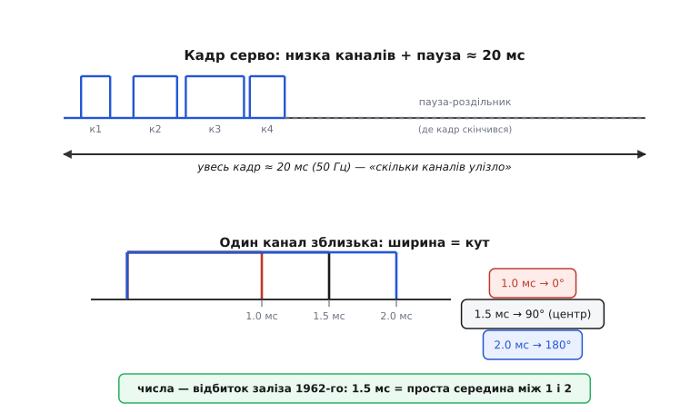

# 📜 Звідки взялися «50 Гц і 1–2 мс», і хто вмів рахувати спектр ШІМ

У самій темі ми розібрали дивну особливість сервоприводу: він, на відміну від дімера чи мотора, читає не усереднену потужність, а **ширину** конкретного імпульсу — 1.0 мс на одному краю, 1.5 мс у центрі, 2.0 мс на другому, і все це в кадрі з періодом рівно 20 мс. Ми назвали ці числа «майже загальноприйнятим стандартом» — і на цьому спинилися, бо для практики більшого не треба: задав ширину, вал повернувся.

Але спинилися ми на найцікавішому. Бо звідки взялися **саме ці** числа? Чому 20 мс, а не 10 чи 33? Чому діапазон 1–2 мс, а не, скажімо, 0–1 чи 2–4? Хто одного дня сів і вирішив, що бажаний кут вала треба слати **довжиною імпульсу**, — та ще й так вдало, що ця домовленість пережила лампи, транзистори, цілі покоління радіоапаратури й дожила незмінною до ваших сервомашинок сьогодні? Числа, що виглядають як освячена згори норма, майже завжди мають цілком земне походження — випадок, зручність, чиюсь конкретну схему на конкретному столі. Розкрутімо цю історію до самого вузла.

А поряд із нею проведімо другу нитку, на позір далеку. Коли ми в темі малювали ШІМ як спосіб керувати середньою потужністю, ми мовчки припустили, що це «просто вмикання й вимикання». Але швидке перемикання породжує ще дещо — цілий **спектр** побічних частот, гармонік, які в силовому приводі виють у моторі, гріють залізо й лізуть у радіоефір як завади. Питання «а що саме там за частоти й якої вони сили?» виявилося математично на диво підступним — і відповідь на нього прийшла не з електротехніки, а з **телефонії 1930-х**, за десятиліття до перших силових ШІМ-приводів. Ці дві нитки — стандарт серво й спектр ШІМ — на перший погляд про різне. Наприкінці ми побачимо, що їх ріднить одна річ: обидві прийшли в силову електроніку **збоку**, з галузі зв'язку, і закляли в ній надовго.

## Що було до цифри: як узагалі керували моделлю

Щоб відчути, чому «ширина імпульсу = кут» була проривом, треба уявити, з чим жили моделісти до неї. А жили вони, м'яко кажучи, бідно на керування.

Найперше радіокерування взагалі не мало **пропорційності**. Передавач умів лише вмикати й вимикати несучу хвилю, приймач ловив цей «є сигнал / нема сигналу», і все, що ним можна було зробити, — смикнути кермо в один крайній бік. Натиснув кнопку — кермо ліворуч; відпустив — гумка тягне його назад. Ніякого «трохи ліворуч» не існувало: керма мали лише два-три фіксовані положення, і пілот керував моделлю, наче морзянкою — серіями натисків. Так літали десятиліттями, і моделісти пишалися вже й цим, бо альтернативою був некерований політ «куди вивезе».

Далі з'явилися хитромудрі напівмеханічні викрутки — **«escapement»** (англ. *escapement* — «спусковий механізм», та сама деталь, що в годиннику відмірює хід пружини). Гумовий двигунець крутив кермо по колу фіксованих позицій, а імпульси від приймача по черзі відпускали його на наступний щабель: раз клацнув — праворуч, ще раз — прямо, ще — ліворуч. Це вже давало кілька положень, але лишалося кроковим, повільним і геть не пропорційним: пілот не задавав кут, а вибивав його клацанням, наче набирав номер на старому дисковому телефоні.

> 🔧 **Навіщо це.** Тримайте цей контраст у голові — він пояснює весь наступний прорив. До пропорційної цифри модель не «слухалася» плавно, а **перемикалася** між кількома завченими позами. Уся цінність винаходу, до якого ми йдемо, — в тому, що кермо вперше стало йти **точно туди й настільки**, наскільки хоче пілот, безперервно. Це той стрибок від «кількох кнопок» до «важіль куди хочеш», який ми сьогодні вважаємо самоочевидним, а тоді він був мрією.

Були й спроби справжньої пропорційності до цифри — так звані **аналогові пропорційні** системи, де положення керма гнали неперервним сигналом (наприклад, тоном змінної частоти). Вони працювали, та були примхливі: чутливі до дрейфу ламп, до розряду батарей, до наводок; тон «плив», а з ним плив і нейтраль керма. Пропорційність начебто була, але трималася на волосині аналогового рівня, що шумить і дрейфує від усього на світі. Саме ця крихкість аналогового сигналу — та сама вада, яку ми вже зустрічали в [історії цифрового газу дронів](root:embedded/esc-bldc-driver/hist-dshot-digital.md), тільки на два покоління раніше, — і підготувала ґрунт для повороту до **цифри**.

## Поворот: а що, як кодувати кут тривалістю?

І ось тут з'являються двоє людей, чиї імена варто назвати точно, бо саме їхнє рішення ви щодня повторюєте в коді, навіть не здогадуючись.

Це були двоє американських моделістів — **Даг Спренґ** (англ. *Doug Spreng*, повне ім'я Douglas Carder Spreng) і **Дон Матес** (англ. *Don Mathes*). Спренґ був інженером-електронником і водночас майстерним пілотом-моделістом; Матес узяв на себе радіочастину й механіку. На початку 1960-х вони поставили собі просте, але зухвале завдання: зробити радіокерування **по-справжньому цифровим і пропорційним** — таким, щоб положення керма кодувалося не тремким аналоговим рівнем, а чимось стійким і повторюваним.

Ключова думка Спренґа була саме та, довкола якої крутиться вся наша тема: **керувати положенням вала, змінюючи ширину імпульсу.** Не рівнем напруги, не частотою тону, а **тривалістю** — величиною, яку легко породити й, головне, легко й стійко виміряти простою електронікою того часу. Серво отримувало імпульс, усередині порівнювало його тривалість зі своїм еталоном і крутило вал, доки ці тривалості не зрівнювалися. Кут задавався **часом** — і саме тому не боявся ні дрейфу ламп, ні просідання батарей: тривалість не «пливе» так, як пливе рівень.

> 🔧 **Навіщо це.** Ось у чому глибина ідеї, і її легко проґавити за буденністю. Спренґ обрав носієм не напругу, а **час** — і цим одним ходом оминув усе, що псує аналоговий сигнал. Рівень напруги залежить від сотні речей: температури, старіння деталей, заряду батареї, довжини дроту. А тривалість імпульсу — це просто «скільки цокає». Її може відлічити найпростіший таймер, і вона однакова хоч на свіжій батареї, хоч на сідаючій. Той самий принцип — «кодуй значення часом, а не рівнем» — ви бачите щоразу, коли [апаратний таймер](topic:programming/hardware-pwm) формує вам ШІМ. Спренґ намацав його для серво першим.

Двоє заснували компанію **Digital Control Systems** і назвали свою систему **«Digicon»** (від *Digital Control* — «цифрове керування»). Щоб було на чому випробувати радіо, Матес спроєктував спеціальний літак — велику високопланну модель із вродженою стійкістю (щоб не падала від дрібних огріхів керування), з двигуном Veco .45. Модель назвали **«Digester»** — гра слів від *Digicon Tester*, «випробувач Digicona». Систему «Digicon» оголосили в грудневому числі журналу *American Modeler* за 1962 рік; тоді ж, на межі 1962–63 років, «Digester» і піднявся в повітря під цифровим пропорційним керуванням — за всіма ознаками **перший у світі**.

> 📜 **Статус доказовості.** Що це була **перша комерційна цифрова пропорційна** система, а Спренґ — автор ідеї кодувати кут шириною імпульсу — це **усталений факт**, зафіксований у кількох незалежних джерелах: біографії Спренґа в історичному проєкті Академії авіамоделювання (AMA), матеріалах Зали слави радіокерування й оглядах історії RC. Оголошення Digicona в *American Modeler* за грудень 1962 і назва-жарт «Digester» від «Digicon Tester» повторюються в тих самих джерелах дослівно. Одна дрібна розбіжність: публічний **дебют самого літака** на сторінках модельної преси різні джерела датують по-різному (згадують і грудень 1964 в *R/C Modeler*) — але це про пізнішу публікацію, а не про перший політ системи, який стався 1962–63. Слово «перший» тут стосується документованої **комерційної** системи; поодинокі лабораторні досліди інших людей могли бути й раніше, тож абсолютну світову першість беремо як **добре підтверджену, але не математично доведену**.

## Чому саме 20 мс і 1–2 мс: анатомія випадкового стандарту

Тепер найцікавіше — звідки взялися **конкретні числа**, які ми досі вбиваємо в код. І тут треба чесно сказати річ, що спершу розчаровує, а потім захоплює: ці числа не виведені з жодного глибокого закону. Вони — **відбиток заліза** тієї доби.

Почнімо з періоду **20 мс** (частота 50 Гц). Перші пропорційні системи мали не один канал, а кілька — окремо кермо висоти, кермо напряму, газ. Усі команди слали не паралельно, а **низкою імпульсів поспіль**: імпульс для першого серво, за ним для другого, третього, потім довша пауза — і все повторюється. Ця повторювана низка й утворює **кадр**. Скільки серво в кадрі, така й його довжина; для типового набору каналів кадр природно вклався десь у два десятки мілісекунд. Число «20 мс» ніхто не обирав як ідеал — воно **випало** з того, скільки імпульсів треба було впхнути в один цикл, плюс запас на паузу-роздільник, аби приймач розумів, де кадр закінчився й почався новий.

Тепер сам діапазон **1–2 мс**. Уявіть, що ви — Спренґ у 1962 році й вам треба обрати, якими тривалостями кодувати «від краю до краю». Занадто короткі імпульси (десятки мікросекунд) тодішня лампово-транзисторна електроніка виміряла б грубо, з великою відносною похибкою — той самий шум, що дошкуляв пізніше й [коротким імпульсам у дронів](root:embedded/esc-bldc-driver/hist-dshot-digital.md). Занадто довгі — з'їли б увесь кадр, не лишивши місця іншим каналам. Мілісекундний масштаб — золота середина: досить довгий, щоб виміряти його впевнено найпростішим лічильником, і досить короткий, щоб кілька таких умістилося в кадр. А «півтори мілісекунди — центр» вийшло само собою: середина між одиницею й двійкою. Симетрична, зручна для око-в-око налаштування нейтралі точка.

> 🔧 **Навіщо це.** Запам'ятайте цей урок ширше за серво: **дуже багато «стандартів» — це не істина, а закам'янілий компроміс** конкретного заліза конкретної доби. 20 мс — це «скільки каналів улазило в кадр». 1–2 мс — це «що надійно міряв тодішній лічильник, не з'ївши кадру». Півтори — просто середина. Коли наступного разу побачите в даташиті магічне число, питайте не «який закон за ним стоїть», а «яке залізо його колись породило». Часто відповідь саме така — і вона звільняє: якщо число історичне, а не священне, його часто можна й порушити (сучасні цифрові серво, як ми бачили в темі, охоче їдять і ширший діапазон, і вищу частоту).

Малюнок нижче показує анатомію цього кадру — і чому кожне число саме таке.

*Чому числа саме такі. Кадр — це низка імпульсів каналів поспіль плюс довга пауза-роздільник, аби приймач бачив межу кадру. Період ≈ 20 мс (50 Гц) **випав** із того, скільки каналів треба вкласти в один цикл, а не з якогось закону. Ширина 1.0–2.0 мс — компроміс: досить довго, щоб надійно виміряти простим лічильником тієї доби, досить коротко, щоб канали влізли в кадр. Центр 1.5 мс — проста середина.*

## Як формат закляк де-факто стандартом

Тепер друга частина загадки: гаразд, Спренґ обрав числа під своє залізо 1962 року — але чому їх не переобрали пізніше, коли залізо змінилося до невпізнання? Адже транзистори, потім мікросхеми, потім мікроконтролери вміли б виміряти й куди коротші, й куди точніші імпульси. Чому 1–2 мс і 50 Гц пережили всі ці революції незмінними?

Відповідь у двох речах, і перша з них — **Спренґ не запатентував свій винахід**. Він не став ні замикати ідею на себе, ні брати відрахувань з тих, хто нею скористався. І сталося те, що завжди стається з доброю відкритою ідеєю: її **всі скопіювали**. Кожен наступний виробник радіоапаратури, роблячи свою пропорційну систему, брав той самий формат — не з примусу, а тому що він був простий, працював і, головне, **вже поширювався**. Що більше виробників його брали, то дорожче було будь-кому відхилятися: серво одного виробника мусило слухатися приймача іншого, а для цього всі мали говорити однією мовою тривалостей.

Друга річ — **сумісність важить більше за досконалість**. Щойно на ринку опинилися тисячі приймачів і серво, що вже розуміють «50 Гц, 1–2 мс», будь-яке «краще» число стало не поліпшенням, а **несумісністю**. Виробник, що зробив би серво на, скажімо, 100 Гц і 0.5–1 мс, отримав би трошки виграшу в швидкості — і величезний програш у тому, що його товар не працював би з жодним наявним передавачем. Ринок голосує за сумісність, і формат Спренґа, раз поширившись, замкнувся сам на собі: його тримало вже не залізо, а **критична маса заліза, яке його вже говорить**.

> 🔧 **Навіщо це.** Це чистий приклад того, як народжується **де-факто стандарт** — не указом і не комітетом, а сніжною грудкою сумісності. Ідея була (1) достатньо добра, (2) вчасна й (3) не замкнена патентом — і цього вистачило, щоб вона покотилася сама й закам'яніла. Той самий механізм ви бачили в [історії DShot](root:embedded/esc-bldc-driver/hist-dshot-digital.md), лише з протилежним знаком: там відкритість зробила новий протокол спільним надбанням; тут відкритість закляла **старий** формат на десятиліття. Відкритість поширює те, що поширює, — байдуже, нове воно чи старе.

Так і вийшло, що коли ви сьогодні пишете `servo.write(90)`, під капотом бібліотека формує імпульс 1.5 мс у кадрі 20 мс — числами, які інженер Даг Спренґ намацав під лампову електроніку 1962 року й ніколи не запатентував. Ви говорите з валом мовою шістдесятих, і вона й досі жива саме тому, що була відкрита.

## Друга нитка: а хто вмів рахувати спектр цього миготіння?

Тепер відкладімо серво й повернімося до тієї другої нитки, що я обіцяв на початку. Бо в самій темі, малюючи ШІМ як просте «вмик-вимк» для керування потужністю, ми залишили величезну діру. Швидке перемикання — це не лише корисне середнє. Це ще й **різкий, стрибкоподібний сигнал**, а будь-який різкий сигнал, як відомо ще від Фур'є, складається з цілого хору синусоїд — основної частоти й безлічі **гармонік**.

Для силового приводу це не абстракція, а щоденний біль. Ці гармоніки — те, чому мотор під ШІМ пищить (ми в темі радили брати частоту понад 20 кГц саме щоб загнати виск за поріг чутності). Це те, що гріє осердя трансформаторів і дроселів. Це те, що лізе в радіоефір як електромагнітна завада й змушує ставити фільтри. Тож інженерові конче треба **наперед знати**: якщо я перемикаю на такій-то частоті з такою-то шпаруватістю, які саме побічні частоти я породжу і якої вони сили?

І ось тут ховається математична пастка, яку не видно, доки не спробуєш порахувати. Здавалося б, візьми звичайний ряд Фур'є та й розклади свій ШІМ-сигнал на гармоніки — задача першого курсу. Але ШІМ **не така проста**. У ній переплітаються **дві незалежні періодичності**: швидкий ритм самого перемикання (несуча) і повільна хвиля того, що ви модулюєте (наприклад, синус, який ШІМ відтворює для мотора чи звуку). Спектр такого сигналу — це не проста гребінка гармонік однієї частоти, а хитре плетиво, де довкола кожної гармоніки несучої роями сидять **бічні смуги** від модулювальної хвилі, і всі вони перемішуються. Одновимірний ряд Фур'є цього плетива не бере — він бачить лише одну періодичність, а їх дві.

## Bell Labs, 1933: подвійний ряд Фур'є з телефонної лабораторії

Розв'язок цієї математичної задачі народився за тридцять років **до** перших силових ШІМ-приводів — і геть в іншій галузі. Не в електротехніці сильних струмів, а в **телефонії**, у стінах Bell Telephone Laboratories, де тоді бився цвіт інженерної математики над тим, як передавати голос без спотворень.

Людину, що першою впоралася, звали **Вільям Р. Беннетт** (англ. *William R. Bennett*) — інженер-математик Bell Labs. Проблема, над якою він працював, зовні була про зв'язок, а не про мотори: коли ти модулюєш несучу хвилю голосом (щоб передати розмову по радіо чи по лінії), на виході з'являється купа побічних частот — **продуктів модуляції**, — і треба точно знати, які вони й якої сили, бо саме вони заважають і спотворюють. Це та сама математична задача, що й наша ШІМ-задача, лише вбрана в одежу зв'язку: **дві переплетені періодичності**, несуча й модуляція, і хор побічних частот від їхньої взаємодії.

Беннеттів хід був елегантний. Якщо періодичностей дві, міркував він, то й ряд Фур'є має бути **подвійний** — не в одній змінній, а у **двох** одночасно: одна вісь для фази несучої, друга для фази модуляції. Тоді кожна побічна частота дістає свою чітку адресу — пару чисел (яка гармоніка несучої, яка бічна смуга модуляції), — а її силу дає подвійний інтеграл по цих двох фазах. Складне плетиво, яке відмовлявся брати одновимірний Фур'є, у двовимірному записі розплітається в охайну сітку. Цей результат Беннетт виклав у статті **«New Results in the Calculation of Modulation Products»** («Нові результати в обчисленні продуктів модуляції») у *Bell System Technical Journal* у **квітні 1933 року** (том 12, с. 228–243).

> 📜 **Статус доказовості.** Авторство, назва, журнал і рік — **усталений документований факт**: стаття Беннетта 1933 року в *Bell System Technical Journal*, том 12, с. 228–243, зі своїм цифровим ідентифікатором (DOI), цитується в сучасній фаховій літературі з ШІМ як **першоджерело** методу подвійного ряду Фур'є для продуктів модуляції. Тут немає ні легенди, ні національної міфології — це рядовий, добре задокументований епізод історії Bell Labs.

Вдумайтеся в розрив у часі. Це **1933 рік**. Немає ще ні силової напівпровідникової електроніки, ні ШІМ-інверторів, ні мікроконтролерів — нічого з того світу, де ми сьогодні застосовуємо цю математику. Беннетт розв'язував задачу зв'язку, і про мотори чи блоки живлення не думав ані на мить. Він просто вивів правильний математичний апарат для «двох переплетених періодичностей» — а те, що через десятиліття цим апаратом рахуватимуть виск моторів і завади від блоків живлення, було поза його обрієм.

## Black, 1953: коли метод дістав ім'я і став книжкою

Наступну ланку теж поклала Bell Labs, і теж не заради силової електроніки. Її поклав **Гарольд С. Блек** (англ. *Harold S. Black*) — той самий інженер Bell Labs, що відоміший зовсім іншим, епохальним винаходом: **підсилювачем зі зворотним зв'язком** (він 1927 року придумав, як від'ємний зворотний зв'язок гамує спотворення підсилювача, — ідея, на якій стоїть уся сучасна аналогова електроніка). Але нас тут цікавить його пізніша, менш гучна робота.

1953 року Блек видав книжку **«Modulation Theory»** («Теорія модуляції», видавництво Van Nostrand) — ґрунтовний підсумок усього, що на той час знали про модуляцію. І саме в ній метод подвійного ряду Фур'є, започаткований Беннеттом, дістав завершений, систематичний виклад — той канонічний вигляд, у якому його відтоді й переказують. Настільки, що в сучасній інженерній літературі формулу спектра ШІМ часто називають просто **«методом Блека»** або **«подвійним рядом Фур'є за Беннеттом-Блеком»**. Книжка Блека стала тим містком, яким метод із журнальної статті перейшов у загальний інженерний ужиток: не всі читали Беннетта 1933-го, але «Modulation Theory» стояла на полицях.

> 📜 **Статус доказовості.** Що Блек систематизував метод у «Modulation Theory» (Van Nostrand, 1953) — **усталений факт**, підтверджений цитуванням у фаховій літературі з ШІМ. Що він **раніше** (кінець 1920-х) винайшов підсилювач зі зворотним зв'язком — теж загальновідомий, добре задокументований факт історії Bell Labs, наведений тут для контексту постаті. Тут важливо не переплутати внески: Беннетт **вивів** подвійний ряд для продуктів модуляції (1933), Блек **систематизував і закріпив** його в підручнику (1953). Обидва — з Bell Labs, обидва думали про **зв'язок**, а не про силові приводи.

## Місток за тридцять років: від радіозв'язку до силових приводів

Отже, апарат був готовий уже 1953 року — лежав у книжці Блека, вбраний в одежу теорії зв'язку. А тепер найдивовижніше: у **силову** електроніку він прийшов ще за двадцять з гаком років, аж у середині 1970-х, коли з'явилися перші серйозні ШІМ-інвертори — пристрої, що перемиканням ліплять із постійної напруги змінну для керування двигунами.

Інженери силової електроніки натрапили рівно на ту саму математичну стіну, що й Беннетт колись у телефонії: спектр ШІМ-інвертора — те саме плетиво двох переплетених періодичностей (частота перемикання й частота вихідної синусоїди), і одновимірний Фур'є його не бере. І тоді — за поширеною в фаховій літературі версією — **С. Р. Бовз і Б. М. Бірд** (англ. *S. R. Bowes*, *B. M. Bird*) близько **1975 року** зробили ключовий хід: вони **перенесли** готовий метод подвійного ряду Фур'є з теорії зв'язку (від Беннетта й Блека) на аналіз силових ШІМ-перетворювачів. Не винайшли заново — **впізнали**, що задача та сама, лиш у новій одежі, і застосували вже наявний апарат.

> 📜 **Статус доказовості.** Що метод подвійного ряду Фур'є прийшов у силову електроніку **зі зв'язку** й що першими його туди перенесли Бовз і Бірд близько 1975 року — це **загальноприйнята в фаховій літературі** атрибуція (її повторюють підручники й огляди з ШІМ, зокрема ті, що зводять родовід методу як «Беннетт → Блек → Бовз і Бірд»). Це радше **добре усталена традиція цитування**, ніж математично незаперечний «перший», — інші дослідники могли доходити близьких думок паралельно; але саме цей родовід є канонічним у літературі про спектр ШІМ.

Ось де дві наші нитки нарешті **сходяться в одну думку**. Придивіться до симетрії. Формат серво «50 Гц, 1–2 мс» народився в **радіокеруванні** (близький родич радіозв'язку) і перейшов звідти в силову-керівну електроніку ваших приводів, де закляк де-факто стандартом. Метод розрахунку спектра ШІМ народився в **телефонному зв'язку** й теж перейшов звідти в силову електроніку, де став канонічним інструментом. Обидва — **емігранти з галузі зв'язку**. І це не випадковість, а закономірність: зв'язок бився над «як укласти інформацію в сигнал і як його точно виміряти» на десятиліття раніше, ніж силова електроніка дозріла до тих самих питань. Коли дозріла — виявилося, що півроботи вже зроблено сусідами, і лишалося **впізнати** свою задачу в чужому вбранні.

## Що з цього лишилося нам

Озирнімося на обидві нитки — вони коротші, ніж здається, і повчальні разом.

Числа серво, які ми в темі назвали стандартом, — **20 мс і 1–2 мс з центром 1.5** — не спущені жодним законом природи. Їх намацав інженер Даг Спренґ разом із Доном Матесом близько 1962 року в системі Digicon, під лампово-транзисторне залізо своєї доби: 20 мс — бо стільки каналів улазило в кадр; 1–2 мс — бо це надійно міряв тодішній лічильник, не з'ївши кадру; 1.5 — проста середина. А закляли ці числа стандартом не через досконалість, а через дві земні речі: Спренґ **не запатентував** ідею, тож її всі скопіювали, — і щойно вона поширилася, сумісність зробила будь-яке «краще» число несумісним. Так випадковий компроміс однієї схеми пережив усі революції заліза й дожив до вашого `servo.write(90)`.

А коли та сама ШІМ, що крутить вам серво чи мотор, породжує виск, нагрів і завади — цілий спектр гармонік, — то математику, якою його рахують, теж не електротехніки винайшли. Її вивів **Вільям Беннетт** у Bell Labs 1933 року для задачі **телефонного зв'язку** (подвійний ряд Фур'є для продуктів модуляції), закріпив у підручнику **Гарольд Блек** 1953-го, а в силову електроніку її перенесли **Бовз і Бірд** близько 1975-го — впізнавши в задачі про інвертор ту саму задачу, що зв'язківці розв'язали за сорок років до того.

Обидві історії про одне: **корисне рідко народжується там, де ним потім користуються.** Формат серво прийшов із радіокерування, математика спектра — з телефонії; обидва оселилися в силовій електроніці як удома. Тож коли наступного разу задаватимете серво ширину імпульсу чи прикидатимете, на якій частоті ШІМ мотор перестане пищати, знайте: ви користуєтеся спадком інженерів зв'язку — того, хто вирішив кодувати кут часом і не став цього патентувати, і тих, хто навчився бачити хор частот у різкому сигналі. Числа й формули, що виглядають вічними, майже завжди мають ім'я, дату й цілком земне походження — і знати його означає розуміти, чому вони саме такі, а не лише як ними користуватися.
