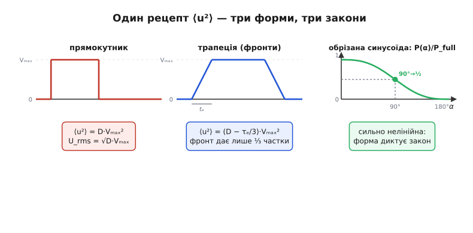
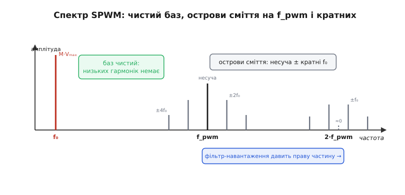

# 🧮 Діюче значення й спектр ШІМ: від ⟨U²⟩ до синусоїдальної модуляції

Детальна тема показала дві речі, які тут доведемо до дна. Перша: для резистивного навантаження рахувати треба не середню напругу, а **діюче** (RMS), і для прямокутного ШІМ це чарівним чином дало лінійне P = D·P_full. Друга: ШІМ — це не постійна напруга, а постійна складова **плюс гармоніки**, і саме останні вирішують, коли підхід «викриває себе». Обидва твердження спираються на один і той самий математичний апарат — усереднення квадрата й розклад у ряд Фур'є, — і варто пройти його один раз строго, щоб далі впізнавати в будь-якій формі сигналу.

Ми зробимо це в двох частинах, які на перший погляд не пов'язані, а насправді є двома боками однієї монети. Спершу — **енергія**: як порахувати ⟨U²⟩ для довільної форми (не лише ідеального прямокутника, а й трапеції зі скінченними фронтами, і синусоїди фазового керування), і чому для кожної форми відповідь інша. Потім — **частота**: який спектр має ШІМ, чому корисне сидить на постійній складовій, а сміття — на частоті перемикання й кратних, і як із цього народжується найкрасивіше застосування ШІМ — генерація синусоїди повільною модуляцією шпаруватості. Наприкінці стане видно, що RMS і спектр — це та сама інформація, лише переказана двома мовами: часовою та частотною.

Базове означення RMS (навіщо саме «корінь із середнього квадрата», чому проста середня синуса нульова, і звідки для чистого синуса береться множник √2) ми не переказуємо — воно вже розібране в атомі [«Діюче значення»](topic:ph-electromagnetism/rms-value) і його [виведенні √2](topic:ph-electromagnetism/rms-value/math-rms-derivation.md). Тут ми **застосовуємо** цей апарат до конкретних форм ШІМ і йдемо далі — у спектр, якого той атом не торкається.

## Означення для довільної форми: рецепт ⟨U²⟩

Почнімо з чіткого означення, з якого все випливає. Діюче значення сигналу u(t), періодичного з періодом T, — це

```
U_rms = √( ⟨u²⟩ ),   де   ⟨u²⟩ = (1/T)·∫₀ᵀ u(t)² dt
```

Кутові дужки ⟨·⟩ означають усереднення за один період. Уся інженерна вага цього означення в одному факті: **середня потужність на резисторі залежить рівно від ⟨u²⟩ і ні від чого більше**. Бо миттєва потужність p(t) = u(t)²/R, а її середнє — це ⟨u²⟩/R. Тому дві хвилі будь-якої форми, що мають однакове ⟨u²⟩, гріють резистор однаково, хай як по-різному вони виглядають у часі. Форма ховається; лишається одне число.

Звідси випливає **головний прийом усієї цієї математики**, і його варто вимовити явно, бо далі ми застосуємо його тричі поспіль. Щоб знайти ⟨u²⟩ для будь-якого сигналу, не треба нічого хитрого: розбий період на ділянки, де форма проста, порахуй внесок кожної ділянки в інтеграл квадрата, склади й поділи на період. Інтеграл — величина **адитивна**: внесок ділянки не залежить від того, що діється в решті періоду. Ця адитивність — те, що робить задачу підйомною для будь-якої кусково-простої форми, а майже всі реальні форми ШІМ саме такі.

> 🔧 **Навіщо це.** Коли даташит навантаження чи власний розрахунок вимагає «діюче значення струму» чи «діюча напруга на елементі» — а вимагає він це для нагріву, бо гріє саме ⟨I²⟩·R, — ви не шукаєте формулу під конкретну форму в довіднику. Ви розбиваєте період на прості ділянки й рахуєте ⟨u²⟩ вручну за 3 рядки. Цей рецепт універсальний: він працює для прямокутника, трапеції, обрізаної синусоїди, пилки, сходинок — для чого завгодно, що можна розбити на шматки з відомим інтегралом квадрата.

### Форма 1: ідеальний прямокутник — звідки √D

Найпростіша форма — ідеальний ШІМ: частку D періоду напруга дорівнює Vₘₐₓ, частку (1−D) — нулю, фронти миттєві. Розбиваємо період на дві ділянки й рахуємо інтеграл квадрата:

```
∫₀ᵀ u² dt = (D·T)·Vₘₐₓ²  +  ((1−D)·T)·0²  =  D·T·Vₘₐₓ²
⟨u²⟩ = (1/T)·D·T·Vₘₐₓ² = D·Vₘₐₓ²
U_rms = √(D·Vₘₐₓ²) = √D · Vₘₐₓ
```

Ось звідки √D. Зверніть увагу на **логіку**, а не лише на результат: квадрат Vₘₐₓ² «увімкнено» весь час, поки сигнал не нуль, тож у середній квадрат він входить із вагою D (частка часу), а не D² — бо ми усереднюємо вже готовий квадрат, а не підносимо до квадрата середнє. Це і є та сама пастка, про яку попереджала детальна тема: середнє й корінь **не переставляються місцями**. Середнє від квадрата (D·Vₘₐₓ²) — це не квадрат від середнього ((D·Vₘₐₓ)² = D²·Vₘₐₓ²). Перше дає потужність, друге — хибу.

Тепер потужність, і ось де ховається «диво лінійності»:

```
P_avg = U_rms²/R = (√D·Vₘₐₓ)²/R = D·Vₘₐₓ²/R = D·P_full
```

Квадрат кореня «з'їв» корінь і повернув лінійне D. Але тепер видно, що лінійність — **властивість саме прямокутної форми повного розмаху**, а не загальний закон: вона випливає з того, що для прямокутника ⟨u²⟩ виявився лінійним по D. Варто формі змінитися — і лінійності немає. Наступні дві форми це доводять предметно.

### Форма 2: трапеція зі скінченними фронтами — поправка до √D

Реальний ключ перемикається не миттєво: затвор MOSFET заряджається скінченний час, тож фронти мають нахил. Замість прямокутника маємо **трапецію**: напруга наростає лінійно від 0 до Vₘₐₓ за час t_e, тримається Vₘₐₓ, спадає лінійно назад за час t_e (візьмімо фронти симетричними — так майже завжди й буває). Питання детальної теми: наскільки це змінює ⟨u²⟩ проти ідеального D·Vₘₐₓ²?

Застосуємо рецепт. Ключова цеглинка — внесок одного лінійного фронту. На ділянці наростання u(t) = Vₘₐₓ·(t/t_e), тож

```
∫₀ᵗᵉ u² dt = ∫₀ᵗᵉ Vₘₐₓ²·(t/t_e)² dt = Vₘₐₓ²/t_e² · [t³/3]₀ᵗᵉ = Vₘₐₓ²·t_e/3
```

Ось важливий і неочевидний факт: фронт завширшки t_e вносить у інтеграл квадрата рівно **третину** того, що вніс би повноамплітудний прямокутник тієї ж ширини (той дав би Vₘₐₓ²·t_e). Причина суто геометрична — квадрат лінійного наростання є параболою, а площа під параболою від нуля до вершини — це третина площі прямокутника, що її описує. Тепер складімо весь період. Домовмося вимірювати шпаруватість D за рівнем 50% (як робить будь-який осцилограф і будь-яке визначення «ширини імпульсу»): тоді ширина плаского верху дорівнює (D·T − t_e), а обидва фронти дають по t_e/3:

```
∫₀ᵀ u² dt = Vₘₐₓ²·(D·T − t_e)  +  2·(Vₘₐₓ²·t_e/3)
          = Vₘₐₓ²·(D·T − t_e + 2t_e/3)
          = Vₘₐₓ²·(D·T − t_e/3)
```

Поділивши на T і позначивши **частку фронту** τₑ = t_e/T (яку частину періоду займає один фронт), дістаємо чистий результат:

```
⟨u²⟩ = (D − τₑ/3)·Vₘₐₓ²
U_rms = √(D − τₑ/3) · Vₘₐₓ
```

Читається прямо: скінченні фронти **зменшують** діюче значення, і поправка дорівнює третині частки фронту. Це логічно — на фронтах напруга менша за Vₘₐₓ, тож вони гріють слабше, ніж якби весь цей час був «повний». Множник ⅓ — не підгонка, а точний геометричний коефіцієнт параболи.

**Наскільки це важить: поправка на реальних фронтах.**
```
ШІМ 20 кГц → T = 50 мкс. Фронти MOSFET із драйвером: t_e ≈ 0.1 мкс.
τₑ = t_e/T = 0.1/50 = 0.002  → поправка τₑ/3 ≈ 0.00067
При D=0.5:  ⟨u²⟩ = (0.5 − 0.00067)·Vₘₐₓ² → U_rms падає на ≈0.07% — мізер.

Та сама схема без драйвера, повільні фронти t_e ≈ 2 мкс, та ще й 200 кГц (T=5 мкс):
τₑ = 2/5 = 0.4 (!)  → поправка τₑ/3 = 0.133
При D=0.5:  ⟨u²⟩ = (0.5 − 0.133)·Vₘₐₓ² = 0.367·Vₘₐₓ²  → потужність на 27% нижча за очікувану.
```

Висновок подвійний. Практичний: доки фронти набагато коротші за період (t_e ≪ T, а це і є ознака доброго ключа з драйвером), поправкою можна знехтувати — ідеальне √D працює. Але коли фронти «розповзаються» на помітну частку періоду — на дуже високій частоті або зі слабким керуванням затвора, — трапецієподібність починає **красти потужність**, і формула (D − τₑ/3) каже точно скільки. Це, до речі, ще один бік тих самих втрат перемикання, що їх ми рахували в самій темі: енергія, яку недоотримало навантаження на пологих фронтах, не зникла — частина її розсіялася в самому ключі, поки той був «на півдорозі». RMS-поправка й нагрів ключа — два наслідки однієї причини, скінченного часу фронту.

### Форма 3: обрізана синусоїда фазового керування — RMS як функція кута

Тепер найважливіший приклад, бо саме на ньому «лінійне D» ламається остаточно. У фазовому керуванні мережею, яке ми розбирали в самій темі, навантаження отримує не прямокутник, а **шматок синусоїди**: у кожному півперіоді струм починає текти не з нуля фази, а з кута α (кут відсічки, firing angle), і тече до кінця півперіоду. Форма — обрізана синусоїда. Порахуймо її діюче значення й побачимо, наскільки воно нелінійне за керувальним параметром α.

Мережа — синусоїда u(t) = Vₘ·sin(θ), де θ = ωt пробігає 0…π за півперіод. Обидва півперіоди в RMS однакові (квадрат прибирає знак), тож усереднювати досить по одному вікну ширини π, де провідність триває від α до π:

```
⟨u²⟩ = (1/π)·∫_α^π Vₘ²·sin²θ dθ
```

Тут вступає єдина тотожність, яку ми беремо готовою з [виведення √2](topic:ph-electromagnetism/rms-value/math-rms-derivation.md): sin²θ = ½ − ½·cos2θ. Вона перетворює нерозв'язний на око інтеграл квадрата на два табличні:

```
∫_α^π sin²θ dθ = ∫_α^π (½ − ½·cos2θ) dθ
              = ½·(π − α)  −  ½·[½·sin2θ]_α^π
              = ½·(π − α)  −  ¼·(sin2π − sin2α)
              = ½·(π − α)  +  ¼·sin2α        (бо sin2π = 0)
```

Підставляємо назад і виносимо Vₘ²:

```
⟨u²⟩ = (Vₘ²/π)·[ ½·(π − α) + ¼·sin2α ]
     = Vₘ²·[ ½ − α/(2π) + sin2α/(4π) ]
```

А діюче значення — корінь із цього. Зручно виразити його через **повне** діюче значення синуса U_full = Vₘ/√2 (те, що було б за α=0, повна провідність):

```
U_rms(α) = Vₘ·√( ½ − α/(2π) + sin2α/(4π) )
         = (Vₘ/√2)·√( 1 − α/π + sin2α/(2π) )
         = U_full·√( 1 − α/π + sin2α/(2π) )
```

Це і є та «зовсім інша залежність», яку обіцяла детальна тема. Погляньмо, наскільки вона крива. Керувальний параметр — кут α (від 0 до π), а нас цікавить частка потужності P(α)/P_full = (U_rms/U_full)² = 1 − α/π + sin2α/(2π):

```
α = 0     → частка потужності = 1.000   (повна: провідність увесь півперіод)
α = 45°   → 0.909                        (обрізали чверть — а втратили лише 9%!)
α = 90°   → 0.500                        (пуск у піку → рівно половина потужності)
α = 135°  → 0.091                        (лишилася чверть кута — а потужності 9%)
α = 180°  → 0.000                        (не вмикаємо взагалі)
```

Три речі варто вихопити з цієї таблиці. Перша: **α = 90° дає рівно половину потужності** — гарний орієнтир для пам'яті (запал у самому піку синусоїди ділить енергію навпіл; sin2α там нульовий, тож частка = 1 − ½ = ½). Друга: залежність **сильно S-подібна** — біля країв майже плоска (перші 45° кута коштують лише 9% потужності), а посередині крута. Це прямий наслідок того, що енергія синусоїди зосереджена коло піка (де sin² великий), а на краях, коло нуля фази, її мало. Обрізаючи край, ви прибираєте «дешеві» шматки; ріжучи коло піка — «дорогі». Третя, найголовніша для цієї вставки: **ніякого лінійного D тут і близько немає**. Якби хтось наївно вважав, що «частка кута = частка потужності» (лінійно), він на α = 90° чекав би 50% (випадково збіглося), але на α = 45° отримав би 75% замість справжніх 91%, а на α = 135° — 25% замість 9%. Помилка — до трьох разів. Прямокутник був щасливим винятком; загальний закон — рахувати ⟨u²⟩ чесно для кожної форми.


*Один рецепт ⟨u²⟩ на три форми. Прямокутник: середній квадрат = D·Vₘₐₓ², звідки U_rms = √D·Vₘₐₓ і потужність лінійна по D. Трапеція: фронти вносять лише ⅓ своєї «прямокутної» частки, тож ⟨u²⟩ = (D − τₑ/3)·Vₘₐₓ² — трохи менше. Обрізана синусоїда фазового керування: ⟨u²⟩ падає з кутом α сильно нелінійно, крива частки потужності S-подібна (перші 45° коштують 9%, пуск у піку α=90° дає рівно ½). Форма визначає закон — лінійне D було властивістю прямокутника, а не правилом.*

Цих трьох форм досить, щоб побачити суть: **рецепт ⟨u²⟩ один, а результат щоразу інший, бо його диктує форма**. Прямокутник → √D (і випадково лінійна потужність). Трапеція → мала від'ємна поправка τₑ/3. Обрізана синусоїда → сильно нелінійна RMS(α). Той самий інтеграл квадрата, розбитий на прості ділянки, дає всі три відповіді. Тепер, коли з енергією (часовим боком) розібралися, перейдімо на частотний бік — і побачимо, що це те саме, сказане інакше.

## Спектр ШІМ: чому корисне на нулі, а сміття на f_pwm

Друга частина. Детальна тема стверджувала: ШІМ = постійна складова (корисне середнє) + гармоніки на частоті перемикання й кратних (сміття). Доведімо це строго через ряд Фур'є й побачимо точно, **де** в спектрі що лежить — бо саме розташування вирішує, чи зможе навантаження відфільтрувати сміття.

Нагадаю ідею ряду Фур'є в одному реченні: будь-який періодичний сигнал — це сума постійної складової й синусоїд на кратних частотах (гармоніках), кожна зі своєю амплітудою. Для сигналу з періодом T ці частоти — це f_pwm = 1/T, 2·f_pwm, 3·f_pwm і так далі. Постійна складова — це просто середнє сигналу за період, тобто (для прямокутного ШІМ) наше знайоме U_avg = D·Vₘₐₓ. Це вже половина відповіді: **корисна складова ШІМ — це постійна складова (нульова частота) його спектра.**

Тепер амплітуди гармонік. Для прямокутного імпульсу зі шпаруватістю D коефіцієнти ряду Фур'є рахуються інтегруванням по одному імпульсу; результат класичний і його варто мати перед очима:

```
u(t) = D·Vₘₐₓ  +  Σ (n=1,2,3,…)  Aₙ·cos(2π·n·f_pwm·t + φₙ)
Aₙ = (2·Vₘₐₓ/(π·n))·|sin(π·n·D)|
```

Не заглиблюючись у виведення коефіцієнтів (це стандартний інтеграл прямокутника, доступний у будь-якому курсі рядів Фур'є), витягнімо з формули те, що має фізичний сенс для керування потужністю:

- **Постійна складова A₀ = D·Vₘₐₓ** — те, що ми хочемо. Лежить на нульовій частоті.
- **Гармоніки живуть тільки на n·f_pwm** — на частоті перемикання й цілих кратних. Між ними спектр порожній. Це критично: усе «сміття» ШІМ зібране в дискретні лінії, і найнижча з них — на f_pwm, тобто **далеко** від корисного нуля, якщо частоту вибрано розумно.
- **Амплітуда спадає як 1/n** — вищі гармоніки слабші, тож найнебезпечніша — перша, на f_pwm. Саме її має задавити навантаження.
- **Множник sin(π·n·D)** обнуляє деякі гармоніки за особливих D. Наприклад, при D = 0.5 зникають усі парні гармоніки (sin(π·n·½) = 0 для парних n) — меандр має тільки непарні. Це не абстракція: вибором D можна прибирати конкретні гармоніки, чим і користуються в силових інверторах.

Тепер стає прозорим головний висновок детальної теми, але вже частотною мовою. Інерція навантаження (стала часу τ) — це **фільтр низьких частот** зі смугою близько 1/τ. Він пропускає постійну складову (частота 0 завжди в смузі) і давить усе, що вище смуги. Умова роботи ШІМ «T_pwm ≪ τ» означає рівно одне: **перша гармоніка f_pwm лежить далеко вище смуги фільтра-навантаження**, тож вона (і всі вищі) придушені, а до навантаження доходить чиста постійна складова D·Vₘₐₓ. Часова умова «період набагато менший за сталу часу» і частотна умова «гармоніка перемикання далеко за смугою пропускання» — це буквально те саме нерівняння, переписане з осі часу на вісь частоти.

І тут-таки видно, **коли ШІМ викриває себе**: коли перша гармоніка недостатньо задавлена — бо f_pwm замала (лежить у смузі навантаження) або фільтр закволий. Тоді на нульовій складовій «сидить» помітна синусоїда на f_pwm: мотор чує її як пульсацію струму й свист, око й камера бачать як миготіння. Це не окремі біди, а один механізм — недодавлена перша гармоніка ШІМ, кожен приймач лише проявляє її по-своєму.

## Синусоїдальна ШІМ (SPWM): повільна модуляція шпаруватості

Тепер найкрасивіше — те, заради чого спектральний погляд і потрібен. Досі D було сталим. А що, як **повільно міняти шпаруватість у часі** за синусоїдним законом? Тоді постійна складова, яка дорівнює D·Vₘₐₓ, теж «попливе» синусоїдою — і на виході (після фільтра-навантаження) ми отримаємо **справжню синусоїду низької частоти**, зліплену з високочастотних прямокутних імпульсів. Це синусоїдальна ШІМ (SPWM), і на ній стоять усі інвертори, частотні приводи моторів і джерела безперебійного живлення — усе, що робить «змінний струм» із постійного.

Механізм читається прямо з попереднього розділу. Нехай ми хочемо на виході синусоїду частоти f₀, набагато нижчої за частоту перемикання f_pwm. Задаймо миттєву шпаруватість законом

```
D(t) = ½ + ½·M·sin(2π·f₀·t),   де 0 ≤ M ≤ 1 — глибина модуляції
```

Посередині синусоїди (де sin = +1) шпаруватість широка, коло 1; у западині (sin = −1) — вузька, коло 0; на переходах — 0.5. Локальна постійна складова кожного «кадру» ШІМ дорівнює D(t)·Vₘₐₓ, тобто повторює задану синусоїду. Оскільки f₀ ≪ f_pwm, за багато періодів перемикання шпаруватість майже не міняється, тож у кожному короткому вікні працює вся математика попереднього розділу — просто D тепер повільно дрейфує. Фільтр-навантаження (наприклад, індуктивність мотора) давить усе на f_pwm і вище, лишаючи плавну низькочастотну складову. Результат: **на вході — прямокутні імпульси повного розмаху, на виході — гладка синусоїда частоти f₀ з амплітудою M·Vₘₐₓ**.

Ось звідки лінійність SPWM, яку варто запам'ятати: амплітуда вихідної синусоїди дорівнює **M·Vₘₐₓ** (для 0 ≤ M ≤ 1, так звана лінійна зона модуляції). Хочеш більшу вихідну напругу — піднімаєш M; хочеш іншу частоту виходу — міняєш f₀; частота перемикання f_pwm лишається сталою й високою, лише «несе» модуляцію. Керування частотою й амплітудою розв'язане — саме те, що потрібно для приводу мотора зі змінною швидкістю.

Але спектр SPWM тонший за спектр сталого ШІМ, і його структура — окремий красивий результат. Коли шпаруватість модульована, гармоніки біля частоти перемикання вже не поодинокі лінії, а **розсипаються в бічні смуги** (sidebands) — групи ліній обабіч f_pwm, зсунуті на кратні f₀. Спектр набуває «острівної» будови:

- **Баз (baseband):** одна корисна лінія — сама синусоїда на f₀. Низьких гармонік (2f₀, 3f₀…) у чистій SPWM практично **немає** — і це головна перевага перед грубими методами: вихід чистий там, де важить.
- **Острів навколо несучої f_pwm:** сама несуча плюс бічні лінії на f_pwm ± f₀, f_pwm ± 2f₀, … Для непарної кратності несучої (сам f_pwm) лишаються лише **парні** зсуви: f_pwm ± 2f₀, f_pwm ± 4f₀ (лінії на f_pwm ± f₀ гасяться).
- **Острів навколо 2·f_pwm:** сама несуча 2f_pwm тут **гаситься**, а лишаються **непарні** зсуви: 2f_pwm ± f₀, 2f_pwm ± 3f₀, …

Цю дзеркальну заміну парності (непарний острів → парні бічні, парний острів → непарні бічні) не варто вивчати напам'ять; важлива сама картина: **усе сміття SPWM зібране в тісні острови навколо f_pwm і кратних, а весь низькочастотний діапазон під ним чистий**. Амплітуди ліній в островах точно описуються функціями Бесселя від глибини модуляції M — це наслідок того, що модульований прямокутник, розкладений строго, дає добуток гармонік несучої на гармоніки модуляції, а такий добуток і породжує бесселеві коефіцієнти (той самий апарат, що й у частотній модуляції в радіо — не випадково, як побачимо в історії нижче).


*Спектр синусоїдальної ШІМ на осі частоти. Ліворуч, у базовій смузі — одна корисна лінія на f₀ (амплітуда M·Vₘₐₓ) і майже порожньо навколо: низьких гармонік немає. Праворуч — острови сміття навколо несучої f_pwm та 2·f_pwm: несуча плюс бічні смуги, зсунуті на кратні f₀. Навколо f_pwm (непарний острів) — парні зсуви ±2f₀, ±4f₀; навколо 2·f_pwm (парний) сама несуча гасне, лишаються непарні ±f₀, ±3f₀. Фільтр-навантаження давить праву частину й лишає чисту синусоїду зліва. Амплітуди в островах задають функції Бесселя від глибини M.*

Практичний висновок звідси прямий: **чим вища f_pwm, тим далі острови сміття від корисної смуги й тим легше навантаженню їх задавити** — тому інвертори женуть частоту перемикання якомога вище (кілогерци-десятки кГц), доки втрати перемикання дозволяють. І навпаки: якщо f_pwm недостатньо вища за f₀, острови «наповзають» на корисну синусоїду, і мотор отримує гармонічне забруднення — зайвий нагрів, момент-пульсації, гудіння. Це той самий критерій «дави першу гармоніку», лише тепер перша гармоніка — це найближчий край найближчого острова.

**Скільки імпульсів на період синусоїди й чому це важить.**
```
Привід мотора: вихідна синусоїда f₀ = 50 Гц, частота перемикання f_pwm = 10 кГц.
Кратність несучої (несуча до модуляції):  m = f_pwm / f₀ = 10000/50 = 200.
→ 200 імпульсів ШІМ на кожен період вихідної синусоїди — острови сміття аж на 10 кГц,
  за смугою мотора (одиниці-десятки Гц) з колосальним запасом → синусоїда струму гладка.

Той самий привід, але дешевий контролер тягне лише f_pwm = 1 кГц:
  m = 1000/50 = 20 імпульсів на період → перший острів на 1 кГц, ближче;
  бічні смуги 1 кГц ± 100 Гц уже можуть проходити в струм → відчутне гудіння й нагрів.
→ кратність m тримають високою (типово ≥ 20…200) саме щоб відсунути острови.
```

Кратність m = f_pwm/f₀ — це й є частотна версія головного нерівняння всієї теми: вона каже, наскільки далеко острови сміття відсунуті від корисної синусоїди, тобто наскільки надійно навантаження їх відфільтрує. Велике m — чистий вихід; мале m — сміття в смузі. Те саме «T_pwm ≪ τ», лише переказане для випадку, коли корисне — не постійна складова, а ціла синусоїда.

## Звідки взявся апарат: від радіозв'язку до силових приводів

Математика, якою ми щойно скористалися для спектра SPWM, народилася **не** в силовій електроніці, а на пів століття раніше — у телефонії, і це гарний приклад того, як інструмент переживає свою першу задачу.

Подвійний ряд Фур'є для «модуляційних продуктів» — сигналу, у якому одна частота модулює іншу, — вивів **Вільям Р. Беннетт (William R. Bennett)** у Bell Telephone Laboratories, у праці «New results in the calculation of modulation products» (Bell System Technical Journal, 1933). Він рахував, які побічні частоти породжує модуляція в телефонних і радіоканалах — тобто ті самі бічні смуги, що ми бачили навколо несучої. Метод узагальнив і зробив підручниковим **Гарольд С. Блек (Harold S. Black)** — той самий інженер Bell Labs, що винайшов від'ємний зворотний зв'язок, — у книзі «Modulation Theory» (Van Nostrand, 1953). *(Статус: усталено; праці Беннетта 1933 і Блека 1953 — першоджерела, доступні й цитовані донині.)*

До керування силовими перетворювачами цей комунікаційний апарат приклав аж у 1970-х британський інженер **Стівен Р. Боуз (S. R. Bowes)** (з колегою Буллафом), у праці «New sinusoidal pulse width-modulated inverter» (Proceedings of the IEE, 1975): він показав, що спектр силової SPWM рахується точно тим самим подвійним рядом Фур'є Беннетта — Блека, бо математично «синусоїда модулює прямокутну несучу» — це та сама задача, що «сигнал модулює радіонесучу». *(Статус: усталено; праця Боуза 1975 — визнаний першоджерельний зв'язок між двома галузями.)* Ось чому бесселеві коефіцієнти, знайомі з частотної модуляції в радіо, з'являються й у спектрі приводу мотора: це буквально та сама модуляція, лише несуча тепер не радіохвиля, а такт силового ключа.

## Зведення: одна величина, дві мови

Пройшовши обидві частини, бачимо, що вони — про одне. Діюче значення ⟨u²⟩ (часовий бік) і спектр (частотний бік) — це та сама інформація про сигнал, розказана двома мовами, і зв'язок між ними точний: **повна енергія сигналу дорівнює сумі енергій усіх його спектральних складових** (це теорема Парсеваля — те, що середній квадрат у часі дорівнює сумі квадратів амплітуд гармонік плюс квадрат постійної складової). Тому ⟨u²⟩ прямокутного ШІМ можна знайти або інтегруванням у часі (як ми й зробили: D·Vₘₐₓ²), або склавши квадрат постійної складової з квадратами всіх гармонік ряду Фур'є — відповідь буде та сама. Два боки однієї монети сходяться до копійки.

Практична карта, що лишається в голові:

- **Потрібна потужність / нагрів** — рахуй у часі: ⟨u²⟩ = (1/T)∫u² розбиттям періоду на прості ділянки. Прямокутник → √D (і лінійна P = D·P_full як приємний виняток форми). Трапеція → поправка −τₑ/3. Обрізана синусоїда → сильно нелінійна RMS(α) = U_full·√(1 − α/π + sin2α/(2π)). Форма диктує закон.
- **Потрібна чистота / фільтрація / генерація сигналу** — думай у частоті: корисне сидить на нулі (сталий ШІМ) чи на f₀ (SPWM), сміття — на f_pwm і кратних. Умова успіху одна — відсунути сміття якнайдалі від корисного (велике f_pwm, велика кратність m), щоб інерція навантаження його задавила.

І та сама думка, що пронизувала всю тему, тут дістає найточніше формулювання: ШІМ ніколи не є постійною напругою — це постійна складова (чи повільна синусоїда) плюс дискретне сміття на частоті перемикання; чи спрацює підхід, вирішує єдине — чи достатньо далеко це сміття від корисного, щоб навантаження своєю сталою часу його відфільтрувало. Усе інше — ⟨u²⟩ конкретної форми та розташування островів у спектрі — це лише деталі того, **як саме** порахувати «далеко» для вашого випадку.
