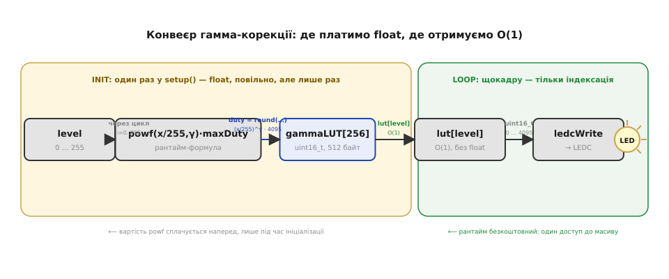
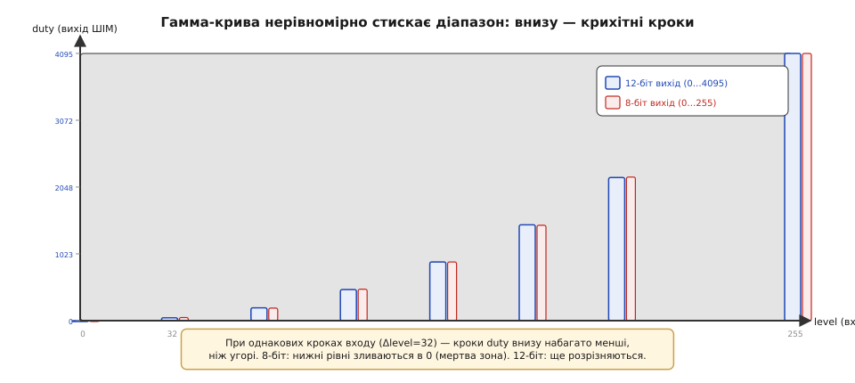

# ⚙️ Практика: Гамма-корекція ШІМ — щоб «плавне» було плавним і для ока

## Задача

Коли шпаруватість [ШІМ-керування світлодіодом](root:embedded/pwm-power-control) задають напряму — `ledcWrite(PIN, level << 4)` — начебто все «плавно». Але спробуйте зробити ефект «дихання»: діод повинен рівно розгорятися від нуля до максимуму й знову гаснути. Результат розчаровує: на початку яскравість різко спалахує вже від кількох перших кроків, а в кінці шкали «застигає» — підйом стає ледь помітним. Причина — у [сприйнятті яскравості](topic:programming/pwm-resolution): людське око реагує на світло логарифмічно, і рівномірні кроки шпаруватості зовсім не виглядають рівномірними. Тут ми вирішуємо суто інженерне завдання: побудувати відображення «бажана яскравість (лінійна шкала, 0…255) → шпаруватість (duty, 0…4095)», яке _око_ сприймає рівним. Замість того щоб задавати шпаруватість напряму, вставляємо між наміром і регістром один перерахунок. Практично існують два шляхи реалізації: обчислення в реальному часі (рантайм-степінь) і передрахована таблиця (LUT, lookup table) — порівняємо обидва й оберемо.

## Ідея

Стрижень рішення простий: між «бажаним рівнем» і викликом `ledcWrite` вставити функцію відображення `gamma(x)`. Формула для обчислення в реальному часі (Unicode у код-блоці нижче) принципово коректна, але в ній прихована пастка.

```
duty = round( (x/255)^γ · maxDuty ),  γ ≈ 2.2
```

Тут γ (гамма) — показник степеня, що описує нелінійність сприйняття; 2.2 — стандартне наближення для sRGB-простору, яке добре підходить і для оцінки яскравості оком. Формула правильна. Але `powf` у гарячому циклі — марнотратство: на ESP32 float-операція зведення до степеня коштує десятки тактів, а якщо одночасно керувати сотнями каналів (RGB-стрічка) — це з'їсть весь кадровий час.

Правильний підхід — **таблиця пошуку (LUT, lookup table)**, обчислена один раз у `setup()`, а далі лише індексація `lut[x]`. Ця ідея особливо вдала саме тут: вхід дискретний і вузький (0…255), тому вся «крива» — це рівно 256 готових чисел. Обчислити їх один раз через дорогий `powf`, зберегти у масив — і далі в гарячому циклі витрачати лише один такт на звернення до пам'яті.

Значення `maxDuty` безпосередньо визначає [роздільність ШІМ](topic:programming/pwm-resolution): при 8 бітах `maxDuty = 255`, при 12 бітах — 4095. Чим більше бітів, тим дрібніші кроки в нижній частині шкали, де гамма-крива найкрутіша. Саме тому для гамма-корекції рекомендують ≥10 біт: при 8 бітах кілька нижніх рівнів «стягуються» в нуль, і діод має «мертву зону» на початку дихання.



*Конвеєр гамма-корекції: бажаний рівень → LUT (один раз) → ledcWrite → діод; powf лише на ініціалізації, у гарячому циклі тільки індексація.*

## Робочий код (C/C++, ESP32 / Arduino-LEDC)

Для розуміння й налагодження корисно мати формулу реального часу й генератор LUT разом — як показано нижче.

**Блок 1 — генерація LUT і рантайм-формула:**

:::tabs
```cpp
#include <math.h>

const float    GAMMA    = 2.2f;
const int      PWM_BITS = 12;
const uint32_t MAX_DUTY = (1u << PWM_BITS) - 1;  // 4095

// Для розуміння: формула одного значення
uint32_t gammaRuntime(uint8_t level) {
    return (uint32_t) lroundf( powf((float)level / 255.0f, GAMMA) * MAX_DUTY );
}

// Таблиця: 12 біт ≤ 4095, тобто в uint16_t (0..65535) влізає; uint8_t не підійде
uint16_t gammaLUT[256];

void buildLUT() {
    // рахуємо ОДИН раз
    for (int i = 0; i < 256; i++) {
        gammaLUT[i] = (uint16_t) gammaRuntime((uint8_t)i);
    }
}
```
```micropython
import math

GAMMA    = 2.2
PWM_BITS = 12
MAX_DUTY = (1 << PWM_BITS) - 1  # 4095

# Для розуміння: формула одного значення
def gamma_runtime(level):
    return round((level / 255.0) ** GAMMA * MAX_DUTY)

# Таблиця: 12 біт ≤ 4095, влазить у звичайний int Python;
# 256 готових значень, порахованих один раз.
gamma_lut = [gamma_runtime(i) for i in range(256)]  # рахуємо ОДИН раз
```
:::

Формула точна, але float-`powf` коштує; саме тому ми виносимо її в стадію ініціалізації — і більше ніколи не викликаємо в основному циклі.

**Блок 2 — застосування: setup() і ефект «дихання»:**

:::tabs
```cpp
const int PIN = 5;

void setup() {
    ledcAttach(PIN, 5000, PWM_BITS);  // 5 кГц, 12 біт
    buildLUT();                        // одноразовий дорогий прохід
}

void loop() {
    // дихання: 0→255→0
    for (int level = 0; level < 256; level++) {
        ledcWrite(PIN, gammaLUT[level]);  // ЛИШЕ індексація, жодного float
        delay(8);
    }
    for (int level = 255; level >= 0; level--) {
        ledcWrite(PIN, gammaLUT[level]);
        delay(8);
    }
}
```
```micropython
from machine import Pin, PWM
from time import sleep_ms

PIN = 5
led = PWM(Pin(PIN), freq=5000)  # LUT побудовано вище, в setup-фазі модуля

while True:
    # дихання: 0→255→0
    for level in range(256):
        # duty_u16 бере 0..65535; наш 12-бітний LUT масштабуємо зсувом <<4
        led.duty_u16(gamma_lut[level] << 4)  # ЛИШЕ індексація, жодного float
        sleep_ms(8)
    for level in range(255, -1, -1):
        led.duty_u16(gamma_lut[level] << 4)
        sleep_ms(8)
```
:::

Порівняйте з варіантом `ledcWrite(PIN, level << 4)` (лінійне масштабування без гамми): перші десятки кроків майже невидимі, потім яскравість різко злітає — «дихання» виглядає нерівним. З LUT діод розгорається рівномірно для ока від першого кроку.

## Складність і пастки на МК

**Float проти цілого і вартість powf.** `powf` — десятки-сотні тактів залежно від реалізації; у циклі дихання на сотні каналів (RGB-стрічка) це легко з'їсть весь кадровий час. Висновок однозначний: LUT обов'язковий, float-обчислення — лише на ініціалізації. Складність звернення до LUT — O(1); пам'ять — 256 × 2 = 512 байт. Для ESP32 це дріб'язок, але на малих AVR (ATtiny, ATmega з 2 кБ SRAM) 512 байт — вже суттєво; тоді LUT зберігають у флеш-пам'яті через `PROGMEM` (або `const PROGMEM uint16_t gammaLUT[256] = {…};`) і читають через `pgm_read_word()`.

**Тип і переповнення виходу.** Чому `uint16_t`, а не `uint8_t`? При ≥9 бітах значення duty виходять за 255 і в байт не вміщаються. При 8-бітному виході сама гамма «з'їдає» низ шкали: перші кілька рівнів зводяться до нуля, кількість градацій на початку шкали критично мала — це і є пряма причина, чому для гамма-корекції потрібно ≥10–12 біт виходу (це знову про [роздільність ШІМ](topic:programming/pwm-resolution)).



*При однакових кроках рівня (вхід) гамма-крива дає дуже нерівні кроки duty (вихід): унизу шкали — крихітні, угорі — великі. При 8-біт виході нижні рівні зливаються в нуль («мертва зона»); 12-біт ще розрізняє дрібні кроки.*

**Округлення.** Цілочисельне відтинання `(int)(…)` систематично занижує криву: кожне значення зменшується на 0…0.99. Ефект підступний — кілька нижніх рівнів зливаються в однакове значення duty, утворюючи «мертву зону» на початку дихання. Слід використовувати `lroundf()` (або `+0.5f` перед приведенням типу), що нейтралізує систематичну похибку.

**`level = 0` має гасити діод повністю.** Математично 0^γ = 0, і таблиця правильно дає `gammaLUT[0] = 0` — перевірте це рядком `Serial.println(gammaLUT[0])` під час налагодження. Ще одна пастка: якщо діод підключений з боку катоду (активно-низький ключ), потрібна інверсія — `ledcWrite(PIN, MAX_DUTY - gammaLUT[level])`. Тип підключення визначає [схема ввімкнення діода](root:embedded/pwm-power-control).

**γ — не магічна константа.** 2.2 — типовий початковий орієнтир для sRGB-дисплеїв, але конкретний діод, драйвер і умови освітлення можуть суттєво змістити оптимальне значення. Серйозні реалізації (наприклад, LED-контролери для студійного освітлення) використовують криву CIE L*, точніше припасовану до сприйняття, — але для більшості практичних задач курсу γ = 2.2 підходить. Підбирайте на власний зір у реальних умовах: якщо «дихання» виглядає нерівним — спробуйте 2.0 або 2.5.

**RGB: три LUT чи один.** Для [RGB-діода](root:embedded/pwm-power-control) гамму застосовують поканально (R, G, B окремо), бо кожен колір може мати свою криву; спільний LUT зручніший, але може порушити баланс білого — це вже колориметрія, поза межами цього курсу.

**Узгодження частоти й роздільності.** Тут діє жорсткий [компроміс частоти й роздільності](topic:programming/pwm-resolution): `max_bits = log₂(f_clk / f_pwm)`. При тактуванні 80 МГц і частоті ШІМ 5 кГц: log₂(80 000 000 / 5000) = log₂(16 000) ≈ 13.97 — тобто 12 біт (4096 кроків) у LEDC ESP32 вкладається з запасом. Самоперевірка пройдена.

## Підсумок

Тепер ваше затемнення рівне для ока. Як цей перерахунок лягає на реальне [підключення діода](root:embedded/pwm-power-control) — струмообмежувальний резистор, транзисторний ключ для потужного навантаження і схема для RGB — розбирає сама тема ШІМ-керування.
