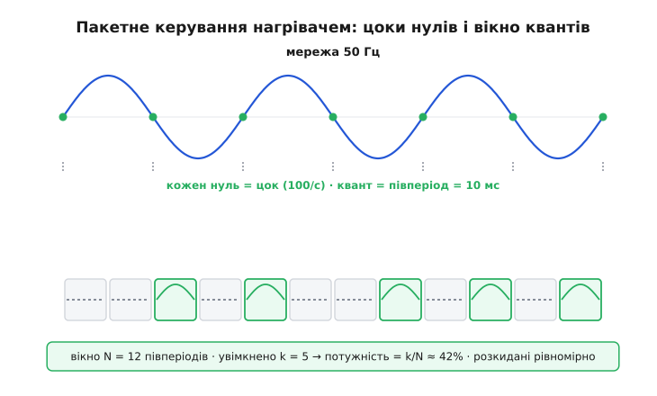

# ⚙️ Термостат мережевого нагрівача: пакетне керування SSR

У самій темі ми мимохідь сказали важливу річ: для мережевого (~220 В) нагрівача звичайний транзистор і кілогерцова ШІМ не годяться — там беруть твердотільне реле й **повільну** ШІМ, що вмикає навантаження цілими півперіодами мережі з перемиканням у нулі. Звучить як одне речення. Насправді за ним ховається окрема, дуже практична інженерія: як полічити ці півперіоди, як зловити нуль напруги, як із цих грубих квантів зліпити плавне керування температурою — і де все це боляче ламається. Цей практикум доводить думку до робочого коду на ESP32: реальний термостат, який тримає задану температуру мережевим нагрівачем, від найпростішого двопозиційного до ПІ поверх дискретних пакетів.

Одразу межа, щоб далі не було самообману. **Це код для нагрівача, теплового навантаження з величезною інерцією.** Усе, що ми тут робимо — грубий квант потужності в десятки мілісекунд, перемикання лише в нулі, повільна петля, — працює саме тому, що нагрівач не помічає, як ми клацаємо. Спробувати цим самим підходом дімувати лампу розжарювання — і ви побачите, чому воно не годиться; ми до цього дійдемо в пастках. А ще: усе тут про **безпеку роботи з мережею** мовчазно спирається на те, що між ESP32 і мережею стоїть гальванічна розв'язка (SSR її і дає), і що людина, яка це збирає, розуміє, з чим має справу. 220 В не пробачають недбалості.

### Задача

Маємо мережевий нагрівач — тен бойлера, нагрівальний стіл, паяльну піч, підігрів реактора — словом, резистивне навантаження на 220 В із потужністю від сотень ват до кількох кіловат. Керуємо ним через [твердотільне реле](topic:hw-power/solid-state-relay) (SSR), бо механічне реле, клацаючи по кілька разів на секунду роками, помре від зношення контактів, та ще й іскритиме. До нагрівача притулено давач температури. Задача проста на словах: **тримати задану температуру**, підливаючи рівно стільки потужності, скільки треба, щоб зрівноважити тепловтрати.

Але «підливати потужність» на мережі — не те саме, що крутити шпаруватість швидкої ШІМ. Тут три окремі труднощі, які не можна змішувати.

Перша: **чим власне дозувати потужність**. У низьковольтному колі ми міняли шпаруватість ШІМ на десятках кілогерц, і MOSFET слухняно відкривався та закривався. На мережі так не можна: якщо різко розірвати струм посеред синусоїди, коли напруга на піку 311 В, отримаємо крутий фронт, а з ним — пакет радіозавад на пів-спектра й кидок, що може вбити ключ. Тому мережу комутують **у нулі**: чекаємо, коли синусоїда сама перейде через нуль, і лише тоді вмикаємо чи вимикаємо. А раз перемикання прив'язане до нулів, найдрібніша порція, яку ми можемо дати чи не дати, — це **один півперіод** між сусідніми нулями. Для мережі 50 Гц це рівно 10 мс; для 60 Гц — приблизно 8.33 мс. Ось наш квант.

Друга: **як із квантів зробити рівень потужності**. Один квант — це або «повний півперіод у навантаження», або «нічого». Проміжних значень немає. Плавність народжується з **частки увімкнених квантів у вікні**: беремо вікно з N півперіодів і в ньому вмикаємо k із них — середня потужність виходить k/N від повної. Це та сама ідея «керувати часткою часу», що й у швидкій ШІМ, лише повільна, дискретна й прив'язана до мережі. Її називають **пакетним керуванням** (англ. *burst-fire*), бо навантаження отримує пакети цілих півперіодів.

Третя: **як цим тримати температуру**. Проста петля напрошується сама: холодно — вмикаємо нагрівач, нагрілося — вимикаємо. Це двопозиційний регулятор («увімк./вимк.», англ. *bang-bang*). Він працює, але має ваду — навколо порогу він дрижить, вмикаючи й вимикаючи реле дуже часто. Лікується це **гістерезисом** (двома порогами замість одного). А коли треба тримати температуру точно, без коливань і без сталого недольоту, над пакетами ставлять справжній регулятор — [ПІ](root:embedded/pi-controller-tuning), який видає бажану частку потужності, а ми переводимо її в кількість квантів. І тут вилазить своя пастка — **насичення інтегратора**, з якою теж треба впоратися.

Розберемо все це по черзі, від заліза-таймера до повного ПІ-термостата, і в кінці зберемо граблі, на які наступають усі.

### Ідея: лічба півперіодів і вікно потужності

Уявімо серце системи як лічильник, що цокає в ритмі мережі. Кожен перехід синусоїди через нуль — один цок. Між двома цоками — рівно один півперіод, наш квант. Якщо ми вміємо ловити ці цоки, ми маємо **годинник, синхронний із мережею**, і все керування зводиться до одного рішення на кожен цок: **у цей півперіод SSR увімкнути чи ні?**

Звідки беруться цоки? Потрібне **виявлення нуля** (англ. *zero-cross detection*) — окремий вузол, що видає мікроконтролеру короткий імпульс щоразу, коли мережева напруга проходить через нуль. Найпоширеніша схема — оптрон, чий світлодіод живиться від мережі через великий гасний резистор: поки напруга помітно відрізняється від нуля (у будь-який бік), оптрон проводить; поблизу нуля струм зникає, і вихід оптрона «клацає». Мікроконтролер ловить це переривання [по фронту на піні](root:embedded/polling-vs-interrupts). Виходить два імпульси на період мережі (нуль трапляється двічі — на спаді й на підйомі), тобто 100 імпульсів на секунду для 50 Гц. Кожен такий імпульс — межа кванта.

> 🔧 **Навіщо це.** Виявлення нуля — не забаганка, а те, що відрізняє грамотне мережеве керування від аматорського. Без нього ви вмикаєте SSR у випадкову мить синусоїди, і навіть «zero-cross» SSR (ті, що самі чекають нуля, щоб увімкнутися) не рятують від головного: без синхронізації ваша повільна ШІМ **пливе** відносно мережі, кванти виходять нерівні, а лічити енергію точно неможливо. Одна лінія переривання від копійчаного оптрона перетворює хаос на детермінований годинник. Це той самий крок, що [захоплення входу для вимірювання частоти](root:embedded/frequency-measurement-methods): прив'язати логіку до реальних подій сигналу, а не до власного таймера, що йде сам по собі.

Тепер про SSR. Більшість твердотільних реле для нагріву — **zero-crossing типу**: усередині вони самі відкриваються лише в нулі напруги, навіть якщо ви подали керівний сигнал посеред півперіоду. Це зручно й безпечно: нам не треба ловити нуль із наносекундною точністю, щоб увімкнути — SSR дочекається сам. Але воно ж і диктує гранулярність: раз SSR вмикається тільки в нулі, порція завжди кратна півперіоду. Тому наш квант — фізична властивість зв'язки «мережа + zero-cross SSR», а не наша примха.

Далі — вікно. Хай вікно містить N півперіодів (візьмемо для прикладу N = 100, тобто одну секунду для 50 Гц). Щоб віддати частку потужності `p` (від 0 до 1), треба ввімкнути `k = round(p · N)` півперіодів із цих ста. Питання лише — **які саме** з них. Найгрубіший спосіб — «пачкою»: спершу k увімкнених поспіль, тоді (N−k) вимкнених. Працює, але дає повільне «дихання» потужності: секунду грієм на повну, секунду не грієм. Для тена бойлера байдуже, для чутливішого навантаження — ні. Розумніший спосіб **розкидає** увімкнені кванти рівномірно по вікну, щоб потужність надходила якомога плавніше. Класичний прийом для рівномірного розкидання — той самий алгоритм, що малює похилу лінію на екрані (Брезенхема): накопичуй дрібну частку й вмикай квант, коли накопичилося на цілий. Ми його і застосуємо — виходить рівно й дешево.


*Кожен перехід синусоїди через нуль — цок лічильника (100 цоків/с для 50 Гц). У вікні з N півперіодів вмикаємо k = round(p·N) із них, розкидаючи рівномірно (акумулятор Брезенхема), а не пачкою. Квант незмінний — один півперіод (10 мс); плавність дає частка k/N. Перемикання завжди в нулі: мінімум завад, SSR щасливий.*

Отже, конструкція така: оптрон дає цоки нуля → переривання рахує півперіоди й на кожному вирішує «увімкнути SSR чи ні» за акумулятором, що прагне частки `p` → окремо, повільно, регулятор температури обчислює цю `p`. Два різні темпи: швидкий (сотні герц, лічба квантів) і повільний (частки герца, петля температури). Не плутати їх — половина успіху.

### Робочий код: лічба квантів і видача потужності

Почнемо з фундаменту — з того, що перетворює частку `p` на реальні півперіоди в навантаженні. Це найшвидша й найпростіша частина, вся в перериванні від оптрона. Пишемо під ESP-IDF/Arduino на ESP32; переривання по фронту на піні виявлення нуля.

```c
#include <stdint.h>
#include <stdbool.h>

// ── Піни ──
#define PIN_ZC    4       // вхід від оптрона виявлення нуля (фронт = нуль мережі)
#define PIN_SSR   5       // керування SSR: 1 = дозволити провідність цього півперіоду

// Бажана частка потужності 0..1000 (тисячні: 0 = вимк., 1000 = повна).
// Цілі числа навмисно — жодної рухомої коми в перериванні.
static volatile int32_t g_power_permille = 0;

// Акумулятор Брезенхема для рівномірного розкидання увімкнених квантів.
static volatile int32_t g_accum = 0;

// Лічильник півперіодів (для діагностики й для відліку секунд у петлі).
static volatile uint32_t g_halfcycles = 0;

// ── Переривання на кожен перехід мережі через нуль ──
// Викликається ~100 разів на секунду (50 Гц) / ~120 (60 Гц).
// Тут вирішуємо ОДНЕ: чи вести SSR у наступний півперіод.
void IRAM_ATTR zc_isr(void) {
    g_halfcycles++;

    // Акумулятор: додаємо частку, і коли «перелилося» за 1000 — вмикаємо квант.
    // Це рівномірно розкидає k увімкнених із кожної 1000 півперіодів.
    g_accum += g_power_permille;
    if (g_accum >= 1000) {
        g_accum -= 1000;
        gpio_set_level(PIN_SSR, 1);   // цей півперіод — у навантаження
    } else {
        gpio_set_level(PIN_SSR, 0);   // цей півперіод — пропускаємо
    }
}
```

Зупинімося на акумуляторі, бо в ньому вся краса. `g_power_permille` — це скільки «тисячних кванта» ми хочемо на кожен півперіод. На кожному цоку ми додаємо це до скарбнички `g_accum`; коли в скарбничці набралося на цілий квант (≥ 1000), ми віддаємо один увімкнений півперіод і віднімаємо 1000. Якщо `p` = 300 (тобто 30%), то приблизно кожен третій-четвертий півперіод виходить увімкненим, і вони **розкидані** рівномірно, а не злиплі в пачку. Це і є Брезенхем: замість ділити й планувати наперед, ми просто накопичуємо дріб і зриваємо квант, коли накопичилося. Дешево (одне додавання й порівняння), точно в середньому й ідеально рівномірно.

Чому цілі тисячні, а не `float` частка? Бо це **переривання**, і воно на ESP32 виконується часто. Ціла арифметика тут швидша, детермінована й не тягне за собою збереження стану співпроцесора рухомої коми в кожному вході в ISR. Регулятор температури нехай рахує в комі скільки завгодно — але на межі з перериванням ми переходимо в цілі числа. Той самий принцип «важке поза ISR, у ISR — коротко й цілочисельно», що й у будь-якій дисциплінованій [роботі з перериваннями](root:embedded/polling-vs-interrupts).

Одна тонкість вже тут. `gpio_set_level(PIN_SSR, 1)` у перериванні на нулі означає: «дозволити провідність, починаючи з цього нуля». Zero-cross SSR підхопить дозвіл і проведе весь наступний півперіод; знявши дозвіл на наступному нулі, ми його закриємо — знову ж у нулі. Тобто ми керуємо SSR **межами квантів**, і фізика перемикання в нулі забезпечена самим SSR. Якби SSR був **не** zero-cross (звичайний симісторний без внутрішнього детектора), нам довелося б самим вмикати його точно в нулі — і тоді точність нашого оптрона стала б критичною. З zero-cross SSR ми маємо запас: навіть якщо наш імпульс нуля трохи запізнюється, SSR однаково почне з наступного справжнього нуля.

Ініціалізація й реєстрація переривання — звична для ESP32:

```c
void thermostat_hw_init(void) {
    gpio_config_t out = {
        .pin_bit_mask = 1ULL << PIN_SSR,
        .mode = GPIO_MODE_OUTPUT,
    };
    gpio_config(&out);
    gpio_set_level(PIN_SSR, 0);

    gpio_config_t in = {
        .pin_bit_mask = 1ULL << PIN_ZC,
        .mode = GPIO_MODE_INPUT,
        .intr_type = GPIO_INTR_POSEDGE,   // фронт від оптрона = нуль мережі
        .pull_up_en = GPIO_PULLUP_ENABLE,
    };
    gpio_config(&in);

    gpio_install_isr_service(0);
    gpio_isr_handler_add(PIN_ZC, (gpio_isr_t)zc_isr, NULL);
}

// Задати бажану потужність (0..1000). Викликає регулятор температури.
void thermostat_set_power(int32_t permille) {
    if (permille < 0)    permille = 0;
    if (permille > 1000) permille = 1000;
    g_power_permille = permille;   // 32-бітний запис атомарний на ESP32
}
```

Це вся швидка частина. Вона нічого не знає про температуру — тільки чесно віддає задану частку потужності рівними квантами, синхронно з мережею. Тепер надбудуємо над нею мозок.

### Робочий код: двопозиційний регулятор із гістерезисом

Найпростіший спосіб тримати температуру — вмикати нагрівач на повну, коли холодно, і геть вимикати, коли нагрілося. Спокуса написати так:

```c
// НАЇВНО — не робіть так:
if (temp < setpoint) thermostat_set_power(1000);
else                 thermostat_set_power(0);
```

Проблема виявиться за хвилину роботи. Коли температура зависне рівно біля `setpoint`, найменше тремтіння давача (а шум є завжди) кидатиме її то трохи вище, то трохи нижче порога — і регулятор **брязкотітиме**: увімк., вимк., увімк., вимк., багато разів на секунду. Для SSR це стерпніше, ніж для механічного реле, але все одно погано: стрибки навантаження на мережі, зайвий знос, а якби замість SSR стояло справжнє реле — воно б за тиждень спалило контакти цим дрижанням.

Ліки — **гістерезис**: не один поріг, а два. Вмикаємо, коли впало нижче `setpoint − Δ`, і вимикаємо аж коли піднялося вище `setpoint + Δ`. Між цими порогами регулятор не чіпає стану — тримає те, що є. Дрижання давача на кілька десятих градуса вже не проскакує крізь ширшу зону, і брязкіт зникає.

:::tabs
```c
#include <stdbool.h>

// Двопозиційний регулятор із гістерезисом.
// Викликати з повільним темпом (напр., раз на секунду) з готовою температурою.
typedef struct {
    float setpoint;    // бажана температура, °C
    float hyst;        // півширина зони нечутливості (гістерезис), °C
    bool  heating;     // поточний стан: гріємо чи ні
} bangbang_t;

void bangbang_init(bangbang_t *b, float setpoint, float hyst) {
    b->setpoint = setpoint;
    b->hyst = hyst;
    b->heating = false;
}

void bangbang_update(bangbang_t *b, float temp) {
    if (b->heating) {
        // Гріємо — вимкнемо лише коли перевалили ВЕРХНІЙ поріг.
        if (temp > b->setpoint + b->hyst) b->heating = false;
    } else {
        // Не гріємо — увімкнемо лише коли впали під НИЖНІЙ поріг.
        if (temp < b->setpoint - b->hyst) b->heating = true;
    }
    thermostat_set_power(b->heating ? 1000 : 0);
}
```
```python
# Двопозиційний регулятор із гістерезисом.
# Викликати з повільним темпом (напр., раз на секунду) з готовою температурою.
class BangBang:
    def __init__(self, setpoint, hyst):
        self.setpoint = setpoint   # бажана температура, °C
        self.hyst = hyst           # півширина зони нечутливості (гістерезис), °C
        self.heating = False       # поточний стан: гріємо чи ні

    def update(self, temp):
        if self.heating:
            # Гріємо — вимкнемо лише коли перевалили ВЕРХНІЙ поріг.
            if temp > self.setpoint + self.hyst:
                self.heating = False
        else:
            # Не гріємо — увімкнемо лише коли впали під НИЖНІЙ поріг.
            if temp < self.setpoint - self.hyst:
                self.heating = True
        thermostat_set_power(1000 if self.heating else 0)
```
:::

Зверніть увагу: рішення залежить не лише від температури, а й від **поточного стану** `heating`. Це і є пам'ять гістерезису — та сама двозначність, що в [тригері Шмітта](topic:hw-analog/schmitt-trigger): результат у зоні між порогами залежить від того, звідки ми в неї зайшли. Один поріг дав би чистий брязкіт; два пороги плюс пам'ять дають спокійне перемикання з рідкими, чіткими переходами.

**Порахуймо, як часто клацатиме реле.** Хай нагрівач гріє бак води, що остигає й нагрівається зі швидкістю близько 0.5 °C/хв біля точки рівноваги, а гістерезис Δ = 1 °C.

```
Повна ширина зони: 2·Δ = 2 °C
Швидкість зміни біля рівноваги: ≈ 0.5 °C/хв
Час перетнути зону в один бік: 2 °C / 0.5 °C/хв = 4 хв
Повний цикл (нагрів + остигання): ≈ 8 хв
→ реле клацає ≈ раз на 8 хвилин.
```

Вісім хвилин між клацаннями — розкіш навіть для механічного реле. А тепер уявіть Δ = 0 (один поріг): та сама система клацала б із частотою шуму давача — рази на секунду. Гістерезис купує спокій ціною коливання температури в межах ±1 °C. Для бойлера це ідеально; для точного термостата паяльної печі — вже забагато, і там переходять до плавного регулювання. Це і є місток до ПІ.

> 🔧 **Навіщо це.** Гістерезис — перший інструмент проти брязкоту будь-якого релейного керування, від термостата до зарядки акумулятора. Правило вибору Δ просте: він має бути **більшим за шум давача** (щоб шум не проскакував) і **достатнім, щоб цикл вмикань був рідким** (порахуйте, як вище), але **не настільки великим**, щоб коливання температури стали неприйнятними. Замалий Δ — брязкіт; завеликий Δ — гойдалка температури. Це компроміс, який ставлять свідомо під конкретне навантаження, а не «на око».

### Робочий код: ПІ поверх дискретних пакетів з anti-windup

Двопозиційний регулятор завжди тримає температуру в **коливанні** — вона гуляє між порогами, бо нагрівач або на повну, або вимкнений, середнього немає. Коли треба тримати температуру **точно** й **сталою**, потрібен регулятор, що видає проміжну потужність — рівно стільки, скільки йде на тепловтрати. Це робота [ПІ-регулятора](root:embedded/pi-controller-tuning): пропорційна складова тягне до уставки за поточною похибкою, а інтегральна поволі добирає ту сталу потужність, що прибирає залишковий недоліт. Похідну для теплових систем зазвичай не беруть — вони повільні й зашумлені, Д-складова тут більше шкодить, ніж помагає.

Виклик у тому, що виходом ПІ буде **неперервне** число — бажана частка потужності, — а віддати ми можемо лише **дискретні** кванти. Але це не проблема: ПІ рахує `p` у діапазоні 0..1, а наш акумулятор Брезенхема сам перетворює цю частку на рівномірно розкидані півперіоди. Дискретність кванта розчиняється в усередненні: за секунду зі ста півперіодів акумулятор віддасть у середньому рівно `p·100` увімкнених. Тепловий об'єкт із його інерцією взагалі не помічає, що потужність надходить квантами по 10 мс, — він бачить лише плавне середнє. Тобто ПІ живе у світі неперервної потужності, а пакетний шар чесно її відтворює.

Головна пастка ПІ на нагрівачі — **насичення інтегратора** (англ. *integral windup*). Уявіть холодний старт: температура далеко нижче уставки, похибка величезна, і нагрівач уже на повних 100% — більше фізично не дати. Але інтегральна складова цього не знає: вона далі **накопичує** велику похибку секунда за секундою, роздуваючись до абсурдних значень. Коли температура нарешті дійде до уставки, цей роздутий інтеграл ще довго штовхатиме потужність на максимум — і температура **перескочить** далеко за ціль, перш ніж інтеграл встигне «розмотатися» назад. Величезний перегин, довге заспокоєння. Для паяльної печі це може означати перегрів плати; для реактора — біду.

Ліки — **anti-windup**. Найпростіший і найнадійніший спосіб для нашого випадку — **умовне інтегрування** (англ. *conditional integration*, або *clamping*): не накопичувати інтеграл, коли вихід і так уперся в межу, а похибка штовхає його ще далі в той самий бік. Тобто: якщо потужність уже 100%, а похибка все ще додатна (хочемо ще гріти) — інтеграл **не чіпаємо**, бо накопичувати нікуди. Щойно вихід зійшов з межі — інтегрування відновлюється. Так інтеграл ніколи не роздувається понад корисне.

:::tabs
```c
#include <stdint.h>

// ПІ-регулятор температури з умовним інтегруванням (anti-windup через clamping).
// Викликати повільно й РІВНОМІРНО (фіксований крок dt), напр. раз на секунду.
typedef struct {
    float setpoint;   // бажана температура, °C
    float kp;         // пропорційний коефіцієнт (частка/°C)
    float ki;         // інтегральний коефіцієнт (частка/(°C·с))
    float integ;      // накопичений інтеграл (у одиницях частки потужності)
    float dt;         // крок дискретизації, с (має збігатися з реальним темпом виклику)
} pi_t;

void pi_init(pi_t *c, float setpoint, float kp, float ki, float dt) {
    c->setpoint = setpoint;
    c->kp = kp;
    c->ki = ki;
    c->integ = 0.0f;
    c->dt = dt;
}

// Повертає бажану частку потужності 0..1.
float pi_update(pi_t *c, float temp) {
    float err = c->setpoint - temp;           // додатна = холодно, треба гріти

    // Кандидат інтеграла, ЯКБИ ми проінтегрували цей крок.
    float integ_next = c->integ + err * c->dt;

    // Сирий (ненасичений) вихід із кандидатом інтеграла.
    float raw = c->kp * err + c->ki * integ_next;

    // Насичуємо вихід до фізичних меж 0..1.
    float out = raw;
    if (out > 1.0f) out = 1.0f;
    if (out < 0.0f) out = 0.0f;

    // УМОВНЕ ІНТЕГРУВАННЯ: приймаємо новий інтеграл ЛИШЕ якщо вихід НЕ насичений,
    // або якщо похибка штовхає нас ГЕТЬ від межі (тобто інтеграл почне спадати).
    bool saturated_high = (raw > 1.0f) && (err > 0.0f);
    bool saturated_low  = (raw < 0.0f) && (err < 0.0f);
    if (!saturated_high && !saturated_low) {
        c->integ = integ_next;   // інтегруємо
    }
    // інакше — заморожуємо інтеграл на місці (не роздуваємо)

    return out;
}
```
```python
# ПІ-регулятор температури з умовним інтегруванням (anti-windup через clamping).
# Викликати повільно й РІВНОМІРНО (фіксований крок dt), напр. раз на секунду.
class PI:
    def __init__(self, setpoint, kp, ki, dt):
        self.setpoint = setpoint   # бажана температура, °C
        self.kp = kp               # пропорційний коефіцієнт (частка/°C)
        self.ki = ki               # інтегральний коефіцієнт (частка/(°C·с))
        self.integ = 0.0           # накопичений інтеграл (у одиницях частки потужності)
        self.dt = dt               # крок дискретизації, с (має збігатися з реальним темпом виклику)

    # Повертає бажану частку потужності 0..1.
    def update(self, temp):
        err = self.setpoint - temp             # додатна = холодно, треба гріти

        # Кандидат інтеграла, ЯКБИ ми проінтегрували цей крок.
        integ_next = self.integ + err * self.dt

        # Сирий (ненасичений) вихід із кандидатом інтеграла.
        raw = self.kp * err + self.ki * integ_next

        # Насичуємо вихід до фізичних меж 0..1.
        out = max(0.0, min(1.0, raw))

        # УМОВНЕ ІНТЕГРУВАННЯ: приймаємо новий інтеграл ЛИШЕ якщо вихід НЕ насичений,
        # або якщо похибка штовхає нас ГЕТЬ від межі (тобто інтеграл почне спадати).
        saturated_high = raw > 1.0 and err > 0.0
        saturated_low  = raw < 0.0 and err < 0.0
        if not saturated_high and not saturated_low:
            self.integ = integ_next   # інтегруємо
        # інакше — заморожуємо інтеграл на місці (не роздуваємо)

        return out
```
:::

Ключове місце — три останні перед `return` рядки логіки. Ми **спочатку** рахуємо, куди хилиться вихід із кандидатом інтеграла, і **лише потім** вирішуємо, приймати цей кандидат чи ні. Якщо вихід уперся в 100%, а похибка й далі каже «гріти» (`err > 0`) — це саме той випадок, коли інтеграл роздувався б намарно; ми його **заморожуємо**. Так само знизу: вихід на 0%, а похибка каже «остуджувати» (`err < 0`, температура вище уставки) — теж заморожуємо, бо нижче нуля потужність не буває. У всіх інших випадках — коли вихід у робочому діапазоні або коли похибка вже розвертає інтеграл назад до межі — інтегруємо нормально. Результат: інтеграл тримає рівно стільки, скільки треба для сталої потужності на рівновазі, і жодного зайвого «боргу», що спричиняв би перегин.

Зверніть увагу на `dt`. ПІ на нагрівачі **мусить** викликатися рівномірно, з тим самим кроком, що заданий у `c->dt`. Якщо ви кличете його «коли згадаєте», інтеграл рахується з неправильним масштабом часу, і налаштування «попливе». Найкраще — прив'язати виклик до того самого мережевого годинника: рахувати півперіоди в `g_halfcycles` і викликати ПІ кожні, скажімо, 100 півперіодів (рівно секунда для 50 Гц). Тоді темп петлі стабільний і не залежить від завантаженості процесора.

Зв'язати все докупи — окремий повільний цикл (задача FreeRTOS чи гілка super-loop), що читає давач, кличе ПІ й віддає частку в пакетний шар:

```c
static pi_t g_pi;

void thermostat_task(void *arg) {
    // Крок петлі — 1 секунда, прив'язаний до мережевого годинника (100 півперіодів).
    pi_init(&g_pi, /*setpoint=*/60.0f, /*kp=*/0.08f, /*ki=*/0.004f, /*dt=*/1.0f);

    uint32_t last_tick = g_halfcycles;
    for (;;) {
        // Чекаємо рівно 100 півперіодів мережі = 1 с (50 Гц) — стабільний крок dt.
        while ((uint32_t)(g_halfcycles - last_tick) < 100) {
            vTaskDelay(pdMS_TO_TICKS(2));
        }
        last_tick += 100;

        float temp = sensor_read_temperature();     // °C, з давача (див. нижче)
        float p = pi_update(&g_pi, temp);           // 0..1
        thermostat_set_power((int32_t)(p * 1000.0f + 0.5f));  // → тисячні у пакетний шар
    }
}
```

Про читання давача — окремо, бо це теж місце помилок. Тепловий давач буває різний: [термістор](root:embedded/battery-pack-thermal) через дільник і АЦП, цифровий (DS18B20 по 1-Wire), термопара з підсилювачем і холодним спаєм (MAX31855). Спільне одне: температуру треба брати **з тим же спокоєм**, що й керувати. Один відлік АЦП зашумлений — усередніть кілька; термістор нелінійний — застосуйте таблицю чи рівняння Стейнгарта–Гарта; термопара дає милівольти — не забудьте компенсацію холодного спаю. Для нашого прикладу схематично:

:::tabs
```c
float sensor_read_temperature(void) {
    // Приклад: NTC-термістор через дільник, кілька відліків АЦП і усереднення.
    const int N = 8;
    int32_t acc = 0;
    for (int i = 0; i < N; i++) acc += adc_read_raw();   // 12-біт відлік
    float raw = (float)acc / N;

    // → напруга → опір термістора → температура (спрощено, реальне — таблиця/Стейнгарт).
    float v = raw / 4095.0f * 3.3f;
    float r_ntc = R_FIXED * v / (3.3f - v);
    float temp = ntc_resistance_to_celsius(r_ntc);       // ваша калібрувальна функція
    return temp;
}
```
```micropython
from machine import ADC, Pin

adc = ADC(Pin(34))          # вхід дільника з NTC-термістором
adc.atten(ADC.ATTN_11DB)    # повний діапазон входу до ~3.3 В

def sensor_read_temperature():
    # Приклад: NTC-термістор через дільник, кілька відліків АЦП і усереднення.
    N = 8
    acc = sum(adc.read_u16() for _ in range(N))   # 16-біт відлік
    raw = acc / N

    # → напруга → опір термістора → температура (спрощено, реальне — таблиця/Стейнгарт).
    v = raw / 65535.0 * 3.3
    r_ntc = R_FIXED * v / (3.3 - v)
    temp = ntc_resistance_to_celsius(r_ntc)       # ваша калібрувальна функція
    return temp
```
:::

Дисципліна давача — не дрібниця: **сміття на вході дасть сміття на виході**, і жоден чудовий ПІ не врятує, якщо він реагує на шум термістора як на справжню зміну температури. Тому усереднення й, за потреби, легка [фільтрація](root:embedded/choosing-a-filter) стоять **перед** регулятором.

### Складність і пастки

Тепер найважливіше — місця, де ця акуратна схема б'ється об реальність. Кожна з цих пасток колись когось коштувала спаленої плати, зіпсованої заготовки чи нескінченного полювання на «привида».

- **Квант 10 мс — це грубо, і для швидких навантажень нікуди не годиться.** Уся конструкція тримається на тому, що навантаження **інерційне** й усереднює кванти. Нагрівальний тен, бак води, масивний стіл — так. Але щойно теплова (чи будь-яка) стала часу навантаження наближається до нашого кванта, усереднення ламається, і замість плавної потужності ви отримуєте видиме пульсування. Класичний приклад — далі.

- **Чому пакетне керування не годиться для лампи розжарювання.** Спокуса очевидна: лампа теж резистор на 220 В, чому б не дімувати її тими самими пакетами? Бо нитка розжарення має теплову сталу часу **порядку мілісекунд** — вона встигає помітно охолонути за кілька вимкнених півперіодів і знову розгорітися за увімкнені. Око бачить це як **мерехтіння**: лампа на 50% пакетного керування помітно блимає з частотою «дихання» пакетів. Для нагрівача (стала часу — хвилини) ті самі кванти невидимі; для лампи (стала часу — мілісекунди) вони кричущі. Тому лампи розжарювання дімують **фазовим** керуванням — обрізанням частини **кожного** півперіоду, а не пропуском цілих; там кожен півперіод несе частину потужності, і мерехтіння виходить на 100 Гц, яке око вже не ловить. Різниця сутнісна: пакетне керування — тихе по завадах, але грубе (квант — цілий півперіод); фазове — плавне, бо ділить кожен півперіод, але шумне (різкий фронт усередині синусоїди сипле завадами), і лампі саме воно й потрібне. Мораль: **квант має бути дрібним проти сталої часу навантаження**; для лампи 10 мс завеликі, для нагрівача — мізерні.

- **Брязкіт двопозиційного без гістерезису.** Ми це вже розібрали, але воно варте повтору як пастка: один поріг → регулятор дрижить із частотою шуму давача → знос реле (для механічного — смертельний) і стрибки на мережі. Завжди два пороги. І пам'ятайте: гістерезис **не** прибирає коливання температури, він лише робить перемикання рідкими; сама температура однаково гуляє в межах ±Δ. Треба без коливань — це вже ПІ, не двопозиційний.

- **Насичення інтегратора — і чому воно особливо підступне на нагріві.** Теплові системи повільні: після холодного старту нагрівач хвилинами сидить на 100%, і без anti-windup інтеграл за цей час роздувається до величезних чисел. Коли температура дійде до уставки, розмотування цього боргу дає перегин на десятки градусів і хвилини заспокоєння — на паяльній печі це прямий шлях до відшарування плати. Умовне інтегрування (заморозити інтеграл, коли вихід у насиченні й похибка штовхає далі) лікує це кількома рядками, які ми написали вище. **Ніколи не ставте ПІ на нагрівач без anti-windup** — на швидкому об'єкті windup дратує, на повільному тепловому він руйнівний. Є й інший спосіб — back-calculation (повертати різницю насиченого й ненасиченого виходу в інтеграл через сталу часу); для нашого дискретного випадку простий clamping надійніший і зрозуміліший.

- **Виявлення нуля дає подвійні спрацювання на ESP32.** Дуже практична пастка. Схема оптрона поблизу нуля має **повільний фронт** (струм зникає плавно), а входи ESP32 не мають виражного тригера Шмітта — тож біля порога вхід може «задзвеніти» й видати **кілька** переривань замість одного на кожен нуль. Наслідок: лічильник півперіодів біжить швидше за мережу, кванти плутаються, потужність виходить не та. Ліки: або апаратний тригер Шмітта / компаратор на вході, або програмний захист від брязкоту в ISR — ігнорувати нові фронти протягом, скажімо, 2 мс після попереднього (справжні нулі йдуть із інтервалом ~10 мс, тож 2 мс «глухоти» безпечні). Простий лічильник часу в ISR:

```c
void IRAM_ATTR zc_isr(void) {
    static uint32_t last_us = 0;
    uint32_t now = esp_timer_get_time();       // мкс
    if (now - last_us < 2000) return;          // <2 мс від попереднього — брязкіт, геть
    last_us = now;
    // ... далі звичайна логіка кванта (акумулятор, SSR) ...
}
```

- **Плутанина двох темпів.** Швидкий шар (лічба квантів, сотні герц) і повільний (петля температури, частки герца) мусять жити окремо. Спроба крутити регулятор прямо в ISR нуля, або навпаки, керувати SSR із повільної петлі — вірний спосіб отримати або перевантажене переривання, або кванти, прив'язані не до мережі. Розділіть чітко: ISR тільки рахує й вмикає SSR; повільна задача тільки думає й задає `p`. Обмін між ними — одна ціла змінна `g_power_permille` (32-бітний запис на ESP32 атомарний, зайвих замків не треба).

- **Zero-cross SSR має власну гранулярність — не боріться з нею.** Раз SSR вмикається лише в нулі, наймовірніша ваша порція — один півперіод, і жодним кодом ви не дасте «пів-півперіоду». Не намагайтеся: якщо треба тонше за квант, це вже фазове керування, інший клас SSR (random-fire) і зовсім інші проблеми із завадами. Для нагрівача півперіодної гранулярності з головою — просто робіть вікно N достатньо великим (100 і більше), і крок потужності 1/N стане дрібним.

- **Теплова затримка об'єкта — не забудьте про неї при налаштуванні.** Між «увімкнули нагрівач» і «давач відчув тепло» минає час — тепло має дійти від тена до давача. Ця затримка (транспортне запізнення) робить петлю схильною до коливань, якщо надто розігнати kp. Тому теплові петлі налаштовують **обережно й повільно**: малий kp, ще менший ki, і терпіння. Розганяти ПІ на об'єкті з великою затримкою — прямий шлях до гойдалки, яку не приборкати без спеціальних методів ([компенсації запізнення](root:embedded/lead-lag-compensator)).

- **Безпека мережі — над усім.** Нагадаю межу, з якої почали. SSR дає гальванічну розв'язку між логікою й мережею — не обходьте її. Тепловтрати самого SSR реальні (близько 1 В падіння × струм навантаження — для 10 А це 10 Вт тепла), тож SSR **мусить** сидіти на радіаторі, інакше згорить. І передбачте **незалежний** аварійний захист від перегріву (термозапобіжник на самому нагрівачі), що спрацює механічно, навіть коли ESP32 завис із увімкненим SSR — так само, як апаратний захист стоїть над прошивкою в [безпечній комутації котушки](root:embedded/inductive-load-switching/proj-firmware-safe-switching.md). Код може відмовити; механічний термозапобіжник — остання лінія, що не залежить від коду.

Зведімо все докупи. Мережевий термостат — це три чітко розділені шари. **Пакетний шар** ловить нулі мережі, лічить півперіоди й рівномірно розкидає увімкнені кванти під задану частку потужності — грубий квант 10 мс, але для інерційного нагрівача невидимий. **Регулятор** сидить над ним: у найпростішому вигляді двопозиційний із гістерезисом (проти брязкоту), у точному — ПІ з обов'язковим anti-windup (проти руйнівного перегину на повільному об'єкті). І **давач** годує регулятор чистою температурою — усередненою, лінеаризованою, відфільтрованою, бо сміття на вході отруює все. Квант має бути дрібним проти сталої часу навантаження — тоді нагрівач бачить лише плавне середнє, і мережею можна керувати так само спокійно й лінійно, як низьковольтним навантаженням через MOSFET, лише в ритмі самої мережі.
