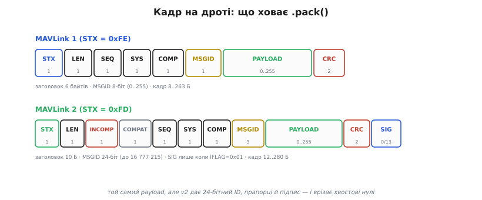
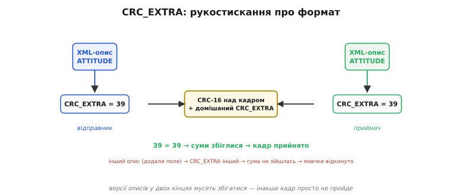
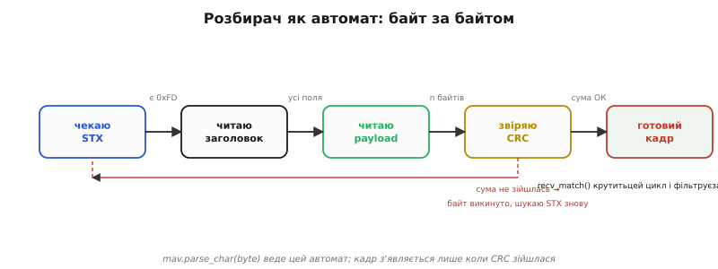
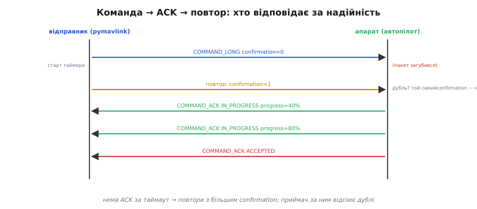
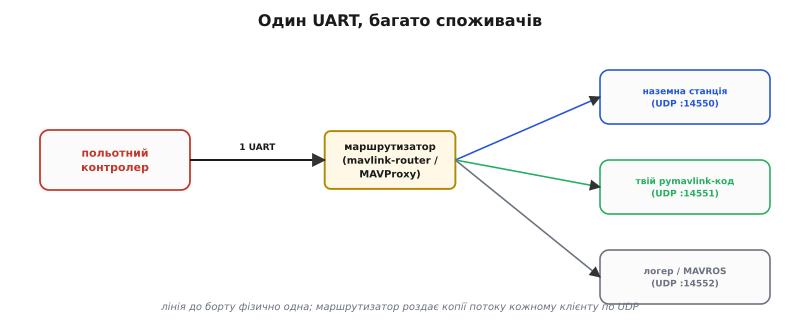

# pymavlink: під капотом

У базовому кроці ми взяли pymavlink як інструмент і за кілька рядків уже читали потік апарата: відкрили лінію, дочекалися серцебиття, ловили повідомлення, слали `COMMAND_LONG`. Цього досить, щоб щось запрацювало. Але «запрацювало на столі з симулятором» і «працює на борту в польоті, коли лінія втрачає пакети, а команда мусить дійти» — це дві різні речі, і між ними лежить саме те, що бібліотека від нас **сховала**. Тепер розкриймо капот: подивімося, з чого насправді складається кадр на дроті, як розбирач вихоплює його з суцільного струменя байтів, чому команда доходить попри втрати, і як влаштувати так, щоб один серійний провід годував відразу кілька програм. Мета проста: щоб жоден рядок pymavlink не був для тебе магією — за кожним стоятиме зрозумілий механізм.

Нитку поведемо туди, де в базовому кроці ми лише махнули рукою. Там ми сказали: «бібліотека знає всі діалекти, бо її код згенеровано з XML». Гарне речення, але воно ховає цілий механізм — і саме з нього починається все інше.

## Чому бібліотеку не пишуть, а генерують

Згадаймо, що [сам кадр MAVLink](book:communications/mavlink-packet) — не єдиний формат на всі часи, а сімейство повідомлень, кожне зі своїм набором полів. `HEARTBEAT` несе тип апарата й режим; `ATTITUDE` — три кути й три кутові швидкості; `GLOBAL_POSITION_INT` — широту, довготу, дві висоти й швидкості. Таких повідомлень у спільному наборі (*common.xml*) сотні, а ще є діалекти виробників — `ardupilotmega.xml`, `px4.xml` — з власними додатками. Якби хтось писав розбір кожного повідомлення руками, бібліотека застигла б: щойно в діалекті з'являється нове повідомлення, треба лізти в код і дописувати.

MAVLink обходить це інакше. Формат кожного повідомлення заданий **декларативно** — в XML: назва, числовий ID, перелік полів із типами й порядком. А код, який це повідомлення пакує й розбирає, не пишуть — його **породжує** генератор `mavgen` із того самого XML. Для Python результат — модуль `mavlink.py` (точніше, окремий модуль на кожен діалект), де кожному повідомленню відповідає свій клас із методами `pack()` та `unpack()`, а кожному полю — атрибут. Той модуль лежить у пакеті вже згенерований під усі стандартні діалекти; за потреби власного діалекту його породжують командою `python -m pymavlink.tools.mavgen`.

Ось чому в базовому прикладі ми писали `mavutil.mavlink.MAV_CMD_NAV_TAKEOFF` і `msg.alt`, ніде не оголошуючи ні цієї константи, ні цього поля: і константа, і атрибут **народилися з XML**. Бібліотека не «розуміє» повідомлення закладеним наперед знанням — вона будує його клас із опису. Тому нове повідомлення діалекту вона вміє читати без жодної правки коду: досить, щоб опис був у XML, з якого згенеровано модуль.

> 🔧 **Навіщо це.** Коли на борту стоїть кастомний діалект (виробник додав свої повідомлення для власного давача чи режиму), твій ноутбук зі стандартним pymavlink їх **не прочитає** — не тому, що «версії різні», а тому, що в його згенерованому модулі немає цих класів. Ліки — узяти той самий XML і перегенерувати діалект локально. Розуміння, що бібліотека **породжена з опису**, одразу підказує, де шукати причину «невідомого повідомлення».

Але тут ховається пастка, яку декларативний підхід породжує сам собою. Якщо і код відправника, і код приймача **генеруються з опису**, то що станеться, коли їхні описи **розійшлися**? Приймач чекатиме поля в одному порядку, відправник покладе їх в іншому — і вийде тихе, підступне псування даних. MAVLink передбачив цю небезпеку й вбудував проти неї захист прямо в контрольну суму. Це — CRC_EXTRA, і щоб його зрозуміти, спершу розберімо, що ж насправді летить дротом.

## Кадр на дроті: що ховає `.pack()`

Коли ми кличемо `m.mav.command_long_send(...)`, усередині повідомлення пакується методом `pack()` у послідовність байтів і йде в лінію. Розкриймо цю послідовність. MAVLink існує у двох версіях кадру, і pymavlink працює з обома; різниця між ними — це історія самого протоколу, і знати її варто, бо вона пояснює половину «дивних» речей на практиці.


*MAVLink 1 (STX = 0xFE): заголовок 6 байтів, ID повідомлення 8-бітний (0..255), увесь кадр 8..263 байти. MAVLink 2 (STX = 0xFD): заголовок 10 байтів, ID розширено до 24 біт (до 16 777 215), додано прапорці сумісності й необов'язковий 13-байтний підпис; хвостові нульові байти payload врізаються перед відправкою.*

**Кадр MAVLink 1** починається зі стартового байта `0xFE` (англ. *start of text*, STX — «початок тексту»). Далі йде заголовок: `LEN` — довжина payload (0..255), `SEQ` — порядковий номер кадру (0..255, по колу), `SYS` і `COMP` — система й вузол відправника, `MSGID` — числовий ID повідомлення (один байт, тож лише 0..255 типів). Потім сам payload завдовжки `LEN`, а в хвості — двобайтна контрольна сума. Заголовок — 6 байтів, сума — 2, тож найменший кадр (порожній payload) — 8 байтів, найбільший — 263.

Тісне місце тут видно відразу: **ID повідомлення — один байт**. Двісті п'ятдесят шість типів на всю екосистему з десятками виробників — це швидко стало тіснею. Тому 2017 року з'явився **кадр MAVLink 2** зі стартовим байтом `0xFD`. Він розширив ID до **24 біт** (до 16.7 мільйона типів — простір, який уже ніколи не вичерпається) і додав у заголовок два поля прапорців:

- `incompat_flags` — **прапорці несумісності**: якщо приймач не розуміє бодай один із них, він **мусить викинути кадр**. Це страховка формату: наприклад, біт `0x01` (`MAVLINK_IFLAG_SIGNED`) означає «кадр підписаний, у хвості ще 13 байтів підпису»; хто не вміє перевіряти підпис, той чесно відмовляється від кадру, а не читає його криво.
- `compat_flags` — **прапорці сумісності**: їх приймач може спокійно **проігнорувати**, якщо не розуміє, і однаково обробити кадр.

Ця пара прапорців — тонке інженерне рішення: вона розділяє зміни формату на «мусиш зрозуміти або відмовся» і «не зрозумів — не біда». Завдяки їй протокол можна розвивати, не ламаючи старих приймачів там, де це безпечно, і жорстко відсікаючи там, де небезпечно.

Заголовок MAVLink 2 — 10 байтів; із сумою найменший кадр — 12 байтів, а з підписом найбільший сягає 280. І ще одна ощадлива дрібниця, важлива на вузькій лінії: MAVLink 2 **врізає хвостові нульові байти** payload перед відправкою (крім найпершого байта, який ніколи не врізається). Якщо в повідомленні багато полів у кінці лишилися нульовими, вони просто не полетять у ефір; приймач добудує їх нулями назад. На повільному радіомодемі це відчутна економія — payload часто коротший за номінальний.

> 🔧 **Навіщо це.** Перше, на що дивишся в моніторі обміну, коли «щось не так», — стартовий байт: `0xFE` каже «це MAVLink 1», `0xFD` — «MAVLink 2». Якщо один кінець шле `0xFD`, а інший налаштований лише на `0xFE`, розмови не буде. У pymavlink версію кадру, якою **ти шлеш**, задають явно (наприклад, змінною середовища `MAVLINK20` або параметром з'єднання); версію, яку **ти приймаєш**, розбирач визначає з першого байта кожного кадру сам.

Тепер повернімося до контрольної суми — бо саме в ній сховано захист від розбіжності описів.

## CRC_EXTRA: рукостискання про формат без жодного рукостискання

Контрольна сума в хвості кадру — це CRC-16 (циклічний надлишковий код на 16 біт) за алгоритмом MCRF4XX із початковим значенням `0xFFFF`. Її задача очевидна: зловити биті, попсовані в лінії. Але MAVLink навантажує суму ще однією, набагато хитрішою роллю — і ось тут криється відповідь на питання, яке ми поставили раніше: як зловити розбіжність описів.

У суму, окрім самих байтів кадру, домішують ще один байт — **CRC_EXTRA**. Він **не передається в ефір**; його обидві сторони обчислюють самостійно — з **опису повідомлення**: беруть назву повідомлення, а потім тип і назву кожного поля, і згортають усе це в один байт. Ключове: CRC_EXTRA рахують **після** внутрішнього перевпорядкування полів (про нього — за мить), тож він ловить і помилку в порядку полів теж.

Наслідок — витончений. Відправник домішує в суму свій CRC_EXTRA, приймач при перевірці домішує **свій**. Якщо описи повідомлення в обох кінцях **однакові** — CRC_EXTRA однаковий, суми зійдуться, кадр прийнято. Якщо описи бодай трохи **розбіглися** (хтось додав поле, змінив тип, переставив) — CRC_EXTRA різний, сума **не зійдеться**, і приймач тихо відкине кадр як пошкоджений.


*Обидві сторони виводять CRC_EXTRA із власного опису повідомлення й домішують його в контрольну суму. Однакові описи → однаковий CRC_EXTRA → суми збігаються → кадр прийнято. Різні описи (додали поле) → різний CRC_EXTRA → сума не сходиться → кадр мовчки відкинуто.*

Це і є **рукостискання про формат без жодного рукостискання**. Дві сторони ніде явно не звіряють версії описів — а проте не можуть непомітно розійтися: сама контрольна сума не пропустить кадр, зібраний за іншим описом. Тому «версії MAVLink розійшлися» на практиці виглядає не як покручені числа в полях, а як **тиша**: кадри приходять у лінію, але жоден не проходить перевірку. Знаючи механізм, ти не шукатимеш причину в налаштуваннях мапи — ти згенеруєш діалект з правильного XML.

Тут доречно розкрити й обіцяне перевпорядкування полів, бо воно теж не випадкове. Числа різного розміру (2, 4, 8 байтів) процесор читає з пам'яті швидше, коли вони лежать за адресою, кратною їхньому розміру, — це називають вирівнюванням. Щоб payload читався без зайвих зусиль на будь-якій архітектурі, генератор **сортує поля за спаданням розміру**: спершу всі 8-байтні (`double`, 64-бітні цілі), потім 4-байтні, далі 2-байтні, наостанок однобайтні. Порядок полів **у XML** (логічний, зручний людині) і порядок **на дроті** (за розміром) — різні. Саме тому CRC_EXTRA рахують після сортування: якщо генератори двох сторін розійшлися бодай у цьому кроці, сума це впіймає. (Поля-розширення MAVLink 2, дописані в кінець опису пізніше, у сортуванні й у CRC_EXTRA участі не беруть — щоб старіші приймачі лишалися сумісні.)

Ми розібрали, що летить дротом і як воно захищене. Але дротом летить **суцільний струмінь байтів** без жодних розділювачів між кадрами. Як із нього вихопити окремі повідомлення? Це робота розбирача — і саме його крутить кожен виклик `recv_match`.

## Розбирач як автомат: із струменя байтів у повідомлення

Уяви, що з серійного порту тобі крапають байти — по одному, без пауз і без міток «тут кадр почався, тут скінчився». Єдина зачіпка — стартовий байт (`0xFE` чи `0xFD`). Розбирач MAVLink — це **скінченний автомат** (англ. *finite-state machine* — машина зі станів), який їсть байти по одному й переходить станами, а готовий кадр віддає лише тоді, коли той повністю зібрався й **зійшлася контрольна сума**.


*Кожен байт веде автомат станом далі: побачив STX — почав кадр; набрав заголовок — знає довжину payload; набрав payload — звіряє CRC. Зійшлася — кадр готовий; не зійшлася — байт викинуто, автомат знову шукає STX. recv_match() крутить цей цикл і віддає лише ті кадри, що пройшли фільтр.*

У pymavlink низом цього автомата керує `mav.parse_char(byte)`: згодуй йому байт — і він або поверне `None` (кадр ще не готовий, чекаю далі), або поверне зібраний об'єкт повідомлення. Логіка станів проста й невблаганна:

1. **Чекаю STX.** Кожен байт, що не `0xFE` і не `0xFD`, — сміття між кадрами, викидаю. Побачив стартовий — запам'ятав версію кадру, перейшов далі.
2. **Читаю заголовок.** Набираю фіксовану кількість байтів заголовка (6 для v1, 10 для v2). З `LEN` дізнаюся, скільки байтів payload буде далі; з `MSGID` — який це клас повідомлення (а отже, і його CRC_EXTRA).
3. **Читаю payload.** Набираю рівно `LEN` байтів.
4. **Звіряю CRC.** Обчислюю CRC-16 над кадром, домішую CRC_EXTRA для цього MSGID, порівнюю з двома байтами суми з кадру. **Зійшлася** — розпаковую поля (`unpack()`) у об'єкт і віддаю його. **Не зійшлася** — кадр зіпсовано (або описи розбіглися); викидаю **перший** байт і починаю пошук STX із наступного.

Останній пункт — тонкий і важливий. Якщо сума не зійшлася, автомат не викидає весь буфер — він зсувається на **один** байт і пробує знову. Чому? Бо «стартовий байт» `0xFD` міг випадково трапитися **всередині** payload попереднього кадру як звичайні дані; справжній початок наступного кадру — трохи далі. Зсуваючись по одному байту, автомат урешті знайде справжню межу кадру й засинхронізується. Це називають **ресинхронізацією**, і завдяки їй лінія відновлюється сама після будь-якого збою чи сміття — не треба ні перепідключення, ні скидання.

Тепер видно, чим насправді є `recv_match` із базового кроку. Це **обгортка над цим циклом**: вона читає байти з каналу, годує їх у `parse_char`, а коли той віддає готовий кадр — перевіряє його проти твого фільтра й повертає лише те, що ти просив. Розгорнімо її аргументи, бо кожен відповідає за конкретну поведінку:

```python
msg = m.recv_match(type='ATTITUDE',          # лише повідомлення цього типу
                   condition='ATTITUDE.roll>0.1',  # ще й з умовою на поле
                   blocking=True,             # чекати, а не повертати None
                   timeout=2.0)               # але не довше 2 секунд
```

`type` фільтрує за типом (можна й списком типів). `condition` — це рядок-вираз над полями вже розібраного повідомлення (`recv_match` обчислює його й пропускає кадр, лише якщо вираз істинний) — зручно, коли треба не будь-який `ATTITUDE`, а такий, де крен перевалив за поріг. `blocking` вирішує, **чекати** чи ні: при `blocking=False` метод, не знайшовши потрібного кадру, одразу повертає `None` і віддає керування твоєму коду — це основа неблокуючого циклу, до якого ми ще дійдемо. `timeout` при `blocking=True` обмежує очікування зверху: не дочекався за `timeout` секунд — повернув `None`, а не завис навіки.

> 🔧 **Навіщо це.** Наївний код пише `recv_match(type='COMMAND_ACK', blocking=True)` **без** `timeout` — і якщо ACK загубився в лінії, програма зависає назавжди, а апарат тим часом летить. У бортовому коді `blocking=True` без `timeout` — це міна. Правило просте: **будь-яке блокуюче очікування має верхню межу часу**, після якої ти сам вирішуєш, що робити (повторити, попередити, увімкнути безпечний режим).

Є ще один бік `recv_match`, про який мовчить базовий крок: поки ти чекаєш **один** тип, решта кадрів усе одно **прочитуються й розбираються** — бо інакше їх не можна пропустити. Розбирач мимохідь оновлює внутрішній словник «останнє відоме значення кожного типу» (`m.messages`), тож після `wait_heartbeat()` там уже лежить останній `HEARTBEAT`. Це пояснює, звідки `wait_heartbeat()` бере `target_system`/`target_component`: він крутить той самий цикл, доки не впіймає `HEARTBEAT`, і з нього дістає адресу відправника. І це підводить до питання, яке базовий крок оминув: а хто такий **ти** на цій лінії?

## Хто на лінії: адреси, з'єднання й транспорт

У кадрі, як ми бачили, є `SYS`/`COMP` **відправника**. Коли шлеш команду, у ній стоять `target_system`/`target_component` — **кому**. Але в полях `SYS`/`COMP` самого твого кадру стоїть **твоя** адреса — і її теж треба задати. Її кладе pymavlink із параметрів з'єднання `source_system` та `source_component`:

```python
m = mavutil.mavlink_connection('udpin:0.0.0.0:14550',
                               source_system=255,      # хто Я в цій мережі
                               source_component=190)   # яким вузлом себе зву
```

За домовленістю наземні станції беруть `source_system=255`; бортовий код, що вдає повноцінний вузол системи, бере той самий `SYS`, що й апарат (зазвичай 1), але окремий `COMP`. Навіщо взагалі мати адресу відправника? Бо апарат адресує **відповіді** (той-таки `COMMAND_ACK`) назад — за адресою, з якої прийшла команда. Поставиш собі адресу, що збігається з кимось іншим на шині, — і відповіді почнуть плутатися між вами. У MAVLink-мережі це не косметика, а маршрутизація.

Тепер — рядок з'єднання, який у базовому кроці ми лише перелічили. Розберімо його як формулу `схема:адреса:порт`, бо кожна схема — це інший транспорт із іншою поведінкою:

- `serial:/dev/ttyUSB0:57600` або просто `/dev/ttyUSB0` — **серійний порт**. Так бортовий комп'ютер з'єднано з контролером дротом; другий сегмент — швидкість (бод). Це потік байтів без жодних меж кадрів — рівно той випадок, задля якого й потрібен автомат-розбирач.
- `udpin:0.0.0.0:14550` — **слухати UDP**: відкрити порт і **чекати**, доки хтось почне слати. `in` означає «я сервер, з'єднуйтеся до мене». Так приймають потік від симулятора чи від моста на борту.
- `udpout:192.168.1.10:14550` — **слати UDP** на заданий вузол: `out` означає «я активно шлю туди».
- `tcp:192.168.1.10:5760` — **поверх TCP**.

І тут криється відмінність, яку базовий крок згорнув до «змінюється лише рядок». [UDP і TCP поводяться зовсім по-різному](book:communications/tcp-vs-udp). TCP гарантує доставку й порядок: втрачений сегмент він перешле, кадри прийдуть усі й по черзі. UDP не гарантує **нічого** — датаграма може загубитися, здублюватися, прийти не в тому порядку. Здавалося б, TCP кращий. Але для телеметрії реального часу він часто **гірший**: коли TCP наткнеться на втрату, він **зупинить весь потік**, доки не перешле згублене, — і свіжа телеметрія застрягне в черзі за старою, уже неактуальною. Для потоку, де важливе **найсвіжіше** значення, а не кожне поспіль, «загубив пакет — най гине, дай наступний» здорове. Тому телеметрію майже завжди пускають по UDP, а сам протокол додає надійність **вибірково** — лише там, де вона потрібна: у командах. І це вертає нас до найважливішого — до того, як команда доходить попри втрати.

## Команда, що доходить: протокол ACK, повтори й дублі

У базовому прикладі ми послали `MAV_CMD_NAV_TAKEOFF` і прочитали `COMMAND_ACK`. Але між «послали» і «прочитали ACK» стоїть цілий протокол надійності, який ми там не розкрили, — і без нього команда по ненадійному UDP просто губилася б без сліду. Механіку самих кадрів команди ми вже проходили окремим кроком; [як влаштовано `COMMAND_LONG` і поля MAV_CMD](root:embedded/mavlink-commands) — там, тут заглибимося саме в **надійність**.

Головна ідея: у MAVLink за доставку команди відповідає **відправник**, а не транспорт. Схема така. Відправник шле `COMMAND_LONG` і **запускає таймер**. Апарат, отримавши команду, **зобов'язаний** відповісти кадром `COMMAND_ACK` із результатом. Якщо ACK не прийшов за таймаут — відправник **шле команду знову**, збільшивши поле `confirmation` на одиницю. Це поле — лічильник спроб, і воно ж розв'язує найпідступнішу проблему повторів: **дублі**.


*Відправник шле команду й чекає ACK за таймером. Пакет загубився — повтор із confirmation=1. Апарат виконує довгу команду, шлючи проміжні COMMAND_ACK зі станом IN_PROGRESS і відсотком, і нарешті ACCEPTED. Дубль із тим самим confirmation апарат розпізнає й не виконує двічі.*

Розгорнімо, чому дублі — це серйозно. Уяви команду «додай газу на 10%». Загубився не сам кадр, а **ACK у зворотний бік**: апарат команду виконав, але відправник ACK не побачив і шле команду ще раз. Якби апарат виконав її вдруге — газу стало б на 20% більше, ніж хотіли. Поле `confirmation` рятує: апарат бачить, що прийшла команда з тим самим (чи меншим) `confirmation`, розуміє «це повтор того, що я вже зробив», і **лише повторює ACK**, не виконуючи дію знову. Так повтори роблять доставку надійною, **не** множачи саму дію. Це класична **ідемпотентність** (від лат. *idem* — «той самий» і *potens* — «здатний»): повторити запит безпечно, бо результат той самий.

Результат у `COMMAND_ACK` — не «так/ні», а перелік `MAV_RESULT`, і кожне значення веде до іншої реакції коду:

- `MAV_RESULT_ACCEPTED` — прийнято, апарат виконує. Це успіх.
- `MAV_RESULT_TEMPORARILY_REJECTED` — **зараз** не можу (зайнятий, не той стан), спробуй **пізніше**. Тут повтор доречний — але з паузою, не миттєвий.
- `MAV_RESULT_DENIED` — відмовлено остаточно; повторювати **марно**, команда в цьому контексті недозволена.
- `MAV_RESULT_UNSUPPORTED` — апарат такої команди **не знає**; повтор нічого не дасть.
- `MAV_RESULT_FAILED` — узявся, але **не вдалося** (наприклад, не пройшла передпольотна перевірка).
- `MAV_RESULT_IN_PROGRESS` — **довга** команда почалася й **триває**; далі надійдуть ще ACK зі станом і полем `progress` (0..100%, або 255 якщо невідомо).

Різниця між цими значеннями — не формальність. Наївний код перевіряє «чи `ACCEPTED`» і на будь-що інше повторює команду в тісному циклі — і на `DENIED` чи `UNSUPPORTED` то марне гатіння в лінію, а на `TEMPORARILY_REJECTED` без паузи — те саме. Грамотна реакція **розгалужується** за результатом. Особливо `IN_PROGRESS`: якщо код його не розуміє, він за таймером вирішить «ACK не прийшов» і почне слати команду знову — **посеред** її виконання. Тож правильний цикл трактує `IN_PROGRESS` як «усе гаразд, чекаю далі», а не як мовчання.

Зберімо це в реальний фрагмент прошивки — надійна відправка команди з повторами, розрізненням результату й обмеженням спроб. Це те, чого базовий приклад свідомо не показував:

```c
// Надійна відправка команди: повтори з нарощуванням confirmation,
// розбір MAV_RESULT, обмеження спроб. Псевдо-C у стилі pymavlink-виклику.
typedef enum { CMD_OK, CMD_RETRY_LATER, CMD_REFUSED, CMD_TIMEOUT } cmd_outcome_t;

cmd_outcome_t send_command_reliable(mavlink_conn_t *m, uint16_t command,
                                    const float p[7], int max_tries)
{
    for (int confirmation = 0; confirmation < max_tries; confirmation++) {
        command_long_send(m, m->target_system, m->target_component,
                          command, confirmation,
                          p[0], p[1], p[2], p[3], p[4], p[5], p[6]);

        uint32_t deadline = millis() + 1000;          // таймер на ACK: 1 с
        for (;;) {
            mavlink_message_t *ack = recv_match(m, "COMMAND_ACK",
                                                deadline - millis());
            if (!ack) break;                          // таймаут → зовнішній повтор

            if (ack->command != command) continue;    // ACK не на нашу команду
            switch (ack->result) {
                case MAV_RESULT_ACCEPTED:      return CMD_OK;
                case MAV_RESULT_IN_PROGRESS:   deadline = millis() + 5000;
                                               continue;   // довга дія: чекаємо далі
                case MAV_RESULT_TEMPORARILY_REJECTED: return CMD_RETRY_LATER;
                case MAV_RESULT_DENIED:
                case MAV_RESULT_UNSUPPORTED:
                case MAV_RESULT_FAILED:        return CMD_REFUSED;  // повтор марний
                default:                       return CMD_REFUSED;
            }
        }
    }
    return CMD_TIMEOUT;                                // вичерпали спроби
}
```

Зверни увагу на три речі, яких немає в наївному коді. По-перше, `confirmation` **росте** з кожним зовнішнім повтором — саме за ним апарат відсіє дублі. По-друге, `IN_PROGRESS` не завершує цикл, а **відсуває дедлайн** і чекає далі — інакше ми б повторювали посеред виконання. По-третє, остаточні відмови (`DENIED`/`UNSUPPORTED`/`FAILED`) повертають керування **одразу**, не витрачаючи спроби на безнадійне. Це і є різниця між «на столі спрацювало» і «працює в польоті».

Є ще один різновид команди, вартий згадки, бо він рятує від тонкої помилки з координатами. Поряд із `COMMAND_LONG` існує `COMMAND_INT`. Різниця в тому, як передають широту й довготу. У `COMMAND_LONG` усі сім параметрів — числа з рухомою комою (`float`, 32 біти). Для широти/довготи цього **замало**: 32-бітний `float` дає близько семи значущих десяткових цифр, а щоб позиціонувати точку на Землі з точністю до метра, треба більше — похибка `float`-широти виходить кілька метрів. `COMMAND_INT` кладе широту й довготу в **цілі** числа — градуси, помножені на 10⁷ (тобто «мікроградуси» з запасом), — і жодної точності не губить. Додатково `COMMAND_INT` несе поле `frame` — систему координат (відносно рівня моря, відносно точки старту, відносно поточної висоти), знімаючи двозначність, яку `COMMAND_LONG` лишав на здогад. Тому для будь-чого позиційного (лети в точку, постав геозону) беруть `COMMAND_INT`, а `COMMAND_LONG` лишають простим командам без координат — arm, зміна режиму, зліт на висоту.

Ми навчилися надійно **слати**. Лишилося друге питання швидкості: скільки й чого нам **шлють** — і як цим керувати, щоб не втопити вузьку лінію.

## Керування потоком: замовити рідше, щоб не захлинутися

У кроці «MAVLink із землі» ми бачили: апарат шле не все підряд, а обраний набір повідомлень, кожне зі своєю частотою. Тепер — як цим керувати **з коду** й чому це питання життя і смерті для вузького радіо.

Історично частоту груп повідомлень задавали кадром `REQUEST_DATA_STREAM` — «шли мені групу POSITION з частотою 5 Гц». Він грубий: керує **групами**, не окремими повідомленнями, і його **визнано застарілим** (з 2015 року). На зміну прийшла точна команда `MAV_CMD_SET_MESSAGE_INTERVAL` — вона задає **інтервал** (у мікросекундах) між кадрами **одного конкретного** повідомлення за його ID. Хочеш `ATTITUDE` десять разів на секунду — проси інтервал 100000 мкс саме для `ATTITUDE`; решту не чіпай:

```python
def request_message_interval(m, message_id, rate_hz):
    interval_us = int(1e6 / rate_hz)             # 10 Гц → 100000 мкс
    m.mav.command_long_send(
        m.target_system, m.target_component,
        mavutil.mavlink.MAV_CMD_SET_MESSAGE_INTERVAL,
        0,                                        # confirmation
        message_id,                               # param1: ЯКЕ повідомлення
        interval_us,                              # param2: інтервал, мкс
        0, 0, 0, 0, 0)

# приклад: хочу ATTITUDE удесятеро частіше за GLOBAL_POSITION_INT
request_message_interval(m, mavutil.mavlink.MAVLINK_MSG_ID_ATTITUDE, 10)
request_message_interval(m, mavutil.mavlink.MAVLINK_MSG_ID_GLOBAL_POSITION_INT, 1)
```

Зверни увагу: `SET_MESSAGE_INTERVAL` — це теж команда, тож летить вона тим самим `COMMAND_LONG` і **сама підтверджується** через `COMMAND_ACK`. Отже, замовлення потоку теж треба слати надійно (з тим самим циклом повторів), інакше можна не помітити, що апарат замовлення не прийняв, і чекати на потік, якого немає. Це підказує й діагностику: **є** серцебиття, але **немає** телеметрії — часто означає, що потоки просто не замовлені (або замовлення загубилося).

Чому взагалі так морочитися, а не просити все на максимумі? Бо лінія має **межу пропускної здатності**, і в неї легко впертися. Порахуймо на очах — це той випадок, коли одна арифметична дія рятує від захлинання каналу.

**Умова: телеметрійний радіомодем дає корисних приблизно 4000 байтів/с (типовий 57600 бод з накладними). Ми хочемо ATTITUDE (кадр ≈ 36 Б) на 20 Гц і GLOBAL_POSITION_INT (кадр ≈ 44 Б) на 5 Гц. Чи влізе?**

```
ATTITUDE:            36 Б × 20 /с = 720 Б/с
GLOBAL_POSITION_INT: 44 Б ×  5 /с = 220 Б/с
                                   ─────────
разом корисних:                    940 Б/с
запас каналу:      4000 − 940 = 3060 Б/с  → влазить із запасом

а якби ATTITUDE просили на 100 Гц:
                     36 Б × 100 /с = 3600 Б/с  (лише одне повідомлення!)
                     + 220 Б/с інших = 3820 Б/с  → 96% каналу на межі —
                     будь-яка ще телеметрія переповнить, пакети підуть у чергу й гинути
```

Висновок наочний: попросив зайве вдесятеро — і одне повідомлення з'їло майже весь канал. Ось чому `SET_MESSAGE_INTERVAL` для окремого повідомлення — правильний інструмент: він дає замовити **саме те й саме стільки**, скільки треба, а не групу «про всяк випадок». Повне виведення бюджету швидкостей — скільки Гц на скільки повідомлень витримає лінія заданої ширини, з урахуванням накладних кадру, — ми винесли окремо: [арифметика бюджету швидкостей телеметрії](root:embedded/pymavlink/math-link-budget-rates.md). Загальну ж модель того, скільки бітів фізично пролізе крізь радіоканал, дає [бюджет лінії](root:embedded/link-budget).

Тепер у нас є всі частини, щоб зібрати їх правильно на самому апараті — і тут виникає архітектурне питання, якого базовий крок торкнувся лише картинкою.

## Архітектура на борту: один провід, багато споживачів

У базовому кроці ми поставили бортовий комп'ютер поряд із контролером і з'єднали їх коротким UART. Тепер — глибша механіка цього рішення й проблема, що з нього виростає.

Чому взагалі дріт, а не радіо, коли комп'ютер уже на борту? Бо [затримка й ненадійність радіо](book:communications/latency-reliability) на короткому серійному проводі просто **зникають**: сантиметровий UART не губить кадрів і не додає помітної затримки. Але UART до контролера — **один**, а споживачів потоку на борту зазвичай **кілька**: твій pymavlink-код, який керує; наземна станція, яка теж хоче бачити телеметрію (через окреме радіо); логер, що все записує; можливо, MAVROS-міст. Усі вони хочуть читати **той самий** потік — а фізична лінія одна, і два процеси не можуть відкрити один серійний порт водночас.


*Фізична лінія до борту одна. Маршрутизатор (mavlink-router чи MAVProxy) читає її, а копії потоку роздає кожному клієнту по своєму UDP-порту — і зводить їхні кадри назад у єдину лінію до контролера. Так один провід годує багатьох.*

Розв'язка — **маршрутизатор MAVLink**. Одна програма (легкий `mavlink-router` або той-таки MAVProxy) відкриває серійний порт **сама, одна**, читає з нього потік — і **роздає копії** кожному клієнту по окремому UDP-порту (наприклад, наземній станції на `:14550`, твоєму коду на `:14551`, логеру на `:14552`). У зворотний бік вона **зводить** кадри від усіх клієнтів у ту саму єдину лінію до контролера, маршрутизуючи їх за `SYS`/`COMP`. Ось де стає в пригоді те, що кожен кадр несе адресу відправника й отримувача: маршрутизатор дивиться на адресу й розуміє, кому кадр призначений, а кому — лише копія для відома. Твій pymavlink-код при цьому не знає й не мусить знати, що між ним і контролером стоїть маршрутизатор: він так само робить `mavutil.mavlink_connection('udpin:...')` — просто підключається не до фізичного порту, а до UDP-виходу маршрутизатора.

> 🔧 **Навіщо це.** Типова помилка початківця на борту: два скрипти намагаються відкрити `/dev/serial0` водночас — і другий падає з «порт зайнятий», або, гірше, вони крадуть байти один в одного, і обидва бачать кашу. Правило: **серійний порт відкриває рівно одна програма — маршрутизатор**, а всі інші (твій код, станція, логер) під'єднуються до нього по UDP. Це не ускладнення, а єдиний коректний спосіб дати одну лінію багатьом.

І цей поділ поглиблює те, про що йшлося в базовому кроці: [керування важливіше за телеметрію](book:communications/control-telemetry). Польотний контролер стабілізує апарат у реальному часі й лишається простим і надійним; бортовий комп'ютер думає складне (зір, планування) і має право падати; маршрутизатор просто розводить потоки. Якщо твій розумний код зависне, контролер далі тримає апарат, а маршрутизатор далі годує наземну станцію — розум відпав, але політ триває. Кожен шар робить своє, і збій одного не валить решти.

Лишилося замкнути одну діру безпеки, яку відкриває вся ця легкість під'єднання по UDP.

## Підпис: коли команду мусить бути неможливо підробити

Уся зручність UDP має темний бік: до відкритого UDP-порту може під'єднатися **будь-хто**, і послати `COMMAND_LONG` «роззброїти мотори посеред польоту» технічно так само легко, як твоєму коду. У кадрі MAVLink 1 немає **жодного** захисту від підробки — хто завгодно в мережі може видати себе за будь-який `SYS`/`COMP`. Для апарата, яким керують по мережі, це реальна загроза, і MAVLink 2 дає на неї відповідь — **підпис повідомлень** (той самий біт `MAVLINK_IFLAG_SIGNED` і 13 байтів у хвості кадру, які ми бачили у структурі).

Ідея підпису — довести, що кадр справді від того, хто знає **спільний таємний ключ**, і що його ніхто не змінив і не програв повторно. Механіка тонша, ніж проста контрольна сума, тож розберімо ці 13 байтів:

- **1 байт — `link_id`**: номер логічної лінії (щоб та сама сторона могла слати кількома каналами й вони не плутались).
- **6 байтів — часова мітка**: 48-бітне число в одиницях по 10 мікросекунд від 1 січня 2015 GMT. Вона мусить **лише зростати** для кожної логічної лінії.
- **6 байтів — власне підпис**: перші 48 біт від SHA-256, обчисленого над зчепленням `таємний_ключ + заголовок + payload + CRC + link_id + мітка`. Ключ — 32 байти, спільні для обох кінців.

Два властивості випливають звідси прямо. **Автентичність**: підробити підпис, не знаючи 32-байтного ключа, обчислювально неможливо — тож кадр із правильним підписом справді від того, хто ключ знає. **Захист від повтору** (англ. *replay attack* — «атака повтором»): зловмисник міг би записати твій легітимний кадр «роззброїти» і програти його пізніше — але часова мітка в підписі щоразу нова й зростаюча, а приймач **відкидає** кадр, чия мітка не більша за останню прийняту з тієї самої лінії. Записаний старий кадр має стару мітку — його відкинуть. У pymavlink підпис вмикають, задавши з'єднанню той самий ключ, що й на борту (`m.setup_signing(key)`), після чого бібліотека сама додає й перевіряє ці 13 байтів.

> 🔧 **Навіщо це.** Підпис — не параноя для окремих випадків, а норма, щойно керування виходить за межі короткого дроту: апарат, доступний по Wi-Fi, LTE чи будь-якій спільній мережі, **мусить** приймати команди лише підписані — інакше керування над ним відкрите всім. Коли команди раптом «не доходять» після ввімкнення підпису на борту — перше підозрюване саме воно: у коді не заданий ключ (кадри йдуть непідписані, борт їх відкидає) або розійшлися годинники (мітки не проходять перевірку).

## Складаємо все: чому неблокуючий цикл — єдиний правильний

Тепер видно, чому базовий приклад з `while True: recv_match(blocking=True)` годиться лише для демонстрації. У живому бортовому коді ти мусиш **водночас**: читати телеметрію, стежити за таймерами команд, реагувати на власну логіку (зір, план), не зависати, коли лінія замовкла, і відновлюватися, коли вона впала. Блокуючий виклик, що завмирає на одному типі повідомлення, для цього непридатний — поки він чекає, уся решта стоїть.

Каркас правильного циклу спирається на все, що ми розібрали: неблокуючий `recv_match(blocking=False)`, що віддає керування одразу; єдиний словник останніх значень; таймери на власні дії; окремий нагляд за серцебиттям, щоб ловити обрив:

```c
// Каркас бортового циклу: нічого не блокує; усе рухається за таймерами.
void companion_loop(mavlink_conn_t *m)
{
    uint32_t last_hb_seen = millis();
    for (;;) {
        // 1) вичерпуємо все, що вже прийшло — без блокування
        mavlink_message_t *msg;
        while ((msg = recv_match(m, NULL, /*timeout=*/0)) != NULL) {
            switch (msg->msgid) {
                case MAVLINK_MSG_ID_HEARTBEAT:
                    last_hb_seen = millis();          // лінія жива
                    break;
                case MAVLINK_MSG_ID_ATTITUDE:
                    update_attitude(msg);             // оновили стан
                    break;
                // …інші типи…
            }
        }

        // 2) власна логіка за таймером (зір, план, регулятор)
        run_control_step(m);

        // 3) нагляд за обривом: серцебиття мовчить понад 3 с
        if (millis() - last_hb_seen > 3000) {
            handle_link_loss(m);                       // безпечний режим / повторне під'єднання
            last_hb_seen = millis();
        }

        sleep_ms(10);                                 // не крутимо цикл марно на 100%
    }
}
```

Тут кожен фрагмент — з того, що ми пройшли. Пункт 1 **вичерпує** чергу неблокуючими викликами, тож жоден кадр не застоюється, а програма не зависає на одному типі. Оновлення стану лягає в словник останніх значень — далі логіка читає **найсвіжіше**, не чекаючи. Пункт 2 — власна робота, що біжить незалежно від того, чи прийшов саме зараз потрібний кадр. Пункт 3 — той самий детектор обриву за серцебиттям, що й у кроці «з землі», лише тепер із боку борту: замовк потік — вмикаємо безпечну поведінку. А надійну відправку команд (з повторами й розбором `MAV_RESULT`) вставляємо туди, де логіка ухвалює рішення. Повний робочий приклад такого циклу — з перепідключенням при падінні лінії, обмеженням частоти власних команд і акуратним завершенням — винесено окремо: [бортовий цикл pymavlink, готовий до польоту](root:embedded/pymavlink/proj-robust-loop.md).

Ось і все коло цього кроку. Ми почали з того, що бібліотеку **не пишуть, а породжують** з опису, — і побачили, як це породжує і зручність (нове повідомлення читається без правок), і небезпеку розбіжності описів, яку ловить CRC_EXTRA. Ми розібрали **кадр на дроті** в обох версіях, автомат-**розбирач**, що вихоплює кадри зі струменя байтів, і зрозуміли, чим насправді є `recv_match`. Ми побачили, **хто ти** на лінії й чому телеметрію пускають по ненадійному UDP, а надійність додають **вибірково** — у командах, через протокол ACK із повторами й `confirmation` проти дублів. Ми навчилися **керувати потоком**, щоб не втопити вузьке радіо, звели багатьох споживачів на один провід через **маршрутизатор** і закрили діру безпеки **підписом**. Той самий pymavlink, що в базовому кроці читав потік трьома рядками, тепер для тебе прозорий до останнього байта — і саме на цій прозорості будується код, якому можна довірити апарат у польоті, а не лише на столі.
