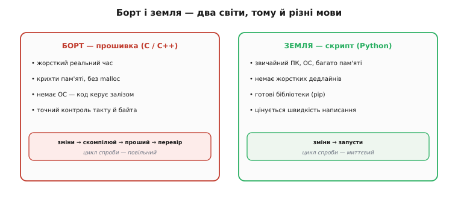
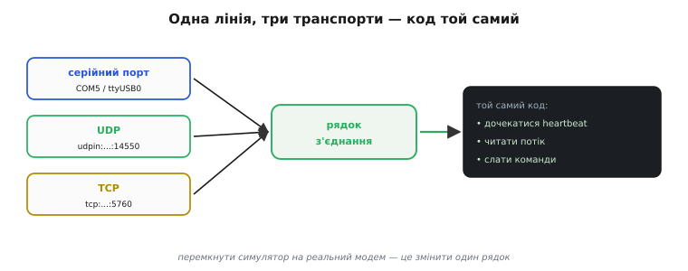
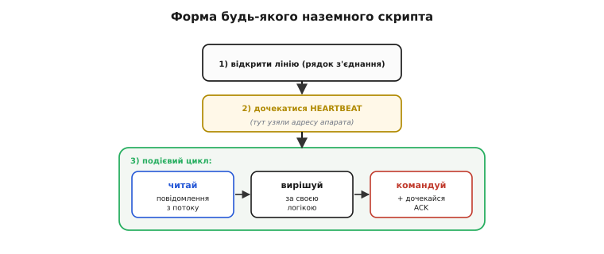

# Python для наземних скриптів

Увесь цей курс ми писали **прошивку** — код, що біжить усередині мікроконтролера: на C і C++, компільований під конкретний чип, прошитий у флеш, обмежений кількома кілобайтами пам'яті й зобов'язаний устигати в реальному часі. І от ми переходимо на **інший бік ниточки** — на землю, до оператора з ноутбуком, — і майже мимоволі беремо в руки геть інший інструмент: **Python**. Не C. Питання не дрібне й не випадкове: чому та сама людина, що годину тому воювала за кожен байт у прошивці, тепер пише наземний скрипт мовою, де про байти взагалі не думаєш? Відповідь на це «чому» — і є суть цієї теми. Розберімося, **чим земля відрізняється від борту** настільки, що змінює навіть мову, і **чому саме Python** тут природно переміг.

### Земля — це інший світ

Почнімо з найглибшого. Прошивка на борту живе в **жорсткому реальному часі**: контур стабілізації мусить порахувати нову корекцію моторів за строго відміряний проміжок — інакше апарат хитне й перекине. Там немає права «задуматися на мить». Пам'ять — крихти, тож динамічне виділення (`malloc`) уникають, аби не було ні фрагментації, ні раптової паузи. Немає операційної системи з файлами й процесами — код сам собі господар заліза. У такому світі C — не примха, а **необхідність**: він дає точний контроль над кожним тактом і кожним байтом, і саме тому вся прошивка, яку ми писали цей курс, — на C і C++.

Тепер поглянь на землю. Тут — **повноцінний персональний комп'ютер**: гігабайти пам'яті, операційна система, диск, мережа, екран. І, головне, **зовсім інші вимоги до часу**. Наземний скрипт не тримає апарат у повітрі — це робить контролер на борту. Скрипт лише **розмовляє** з апаратом по [MAVLink](topic:sys-dron/mavlink-packet): читає телеметрію, ухвалює рішення, шле команди. Якщо він на десяту частки секунди «задумається» — нічого не впаде: телеметрія — це потік, наступний кадр однаково прийде, а команда почекає. Тобто на землі зникає та сама причина, що диктувала C на борту. **Реального часу немає — отже, немає й потреби в мові, що ним керує.**


*Прошивка живе в реальному часі, на крихтах пам'яті, без ОС — там точний контроль C обов'язковий, а цикл «зміни → скомпілюй → проший → перевір» повільний. Наземний скрипт живе на звичайному комп'ютері з ОС і купою пам'яті, без жорстких дедлайнів — там цінується швидкість написання, а цикл «зміни → запусти» миттєвий. Різниця світів — і є причина різних мов.*

Це і є ключ. Мову для роботи обирають не за модою, а за **тим, що вона мусить робити добре**. На борту треба керувати залізом і встигати в реальному часі — виграє C. На землі треба **швидко пробувати, читати потоки, склеювати шматки, показувати результат** — і тут раптом на перший план виходять цілком інші чесноти, яких у C якраз бракує.

### Чому саме Python

Уяви, як виглядала б наземна робота на C. Ти хочеш просто **побачити**, що шле апарат: під'єднатися, дочекатися серцебиття, вивести висоту. Мовою прошивки це — окремий проєкт: написати файл, підключити бібліотеки, **скомпілювати** під свою систему, зібрати, запустити, побачити помилку, знову правити, знову компілювати. Кожна дрібна спроба — повний цикл збірки. А тобі ж лише подивитися одне поле телеметрії.

Python тут дає три речі, кожна з яких прямо б'є в біль наземної роботи.

**Перше — жодної збірки.** Python — мова **інтерпретована**: написав рядок — він одразу виконався, без окремого кроку компіляції. Більше того, є **REPL** (англ. *Read–Eval–Print Loop* — «читай–обчисли–виведи, і знову») — інтерактивна оболонка, де ти вводиш команди по одній і **зразу бачиш результат**. Хочеш перевірити, чи взагалі є апарат на порту? Відкрив оболонку, набрав три рядки, побачив висоту. Не сподобалось — виправив один рядок і повторив. Цей цикл «спробував–побачив» коротший за компіляцію в рази, а наземна робота — це суцільне пробування: який порт, яка швидкість, чи той режим, чи дійшла команда.

**Друге — «батарейки в комплекті».** Python приходить із величезною стандартною бібліотекою й ще більшою екосистемою готових пакетів. Треба відкрити мережевий сокет, розпарсити файл, побудувати графік телеметрії, зберегти лог у таблицю — усе це вже написано, підключається одним рядком. Ти не будуєш інфраструктуру — ти **склеюєш готове**. Саме тому Python часто називають **мовою-клеєм**: його сила не в тому, щоб бути найшвидшим, а в тому, щоб за десять хвилин зв'язати докупи те, що інакше зайняло б день.

**Третє — читабельність.** Python читається майже як псевдокод, тож наземний скрипт — це те, що можна **написати, зрозуміти й змінити за один присід**, часто прямо в полі, коли треба швидко перевірити гіпотезу «а що, як послати оцю команду». Для одноразового діагностичного скрипта ця швидкість важливіша за все інше.

Склади ці три чесноти — і побачиш, що вони точно збігаються з тим, чого вимагає земля: **швидко пробувати, склеювати готове, легко читати й міняти**. Мова, яку [задумали](root:embedded/python-ground-scripts/hist-python-name.md) як просту й приємну для щоденної роботи, ідеально лягла на задачу, де головне — не швидкодія, а швидкість людини перед екраном.

> 🔧 **Навіщо це.** Коли треба **один раз** щось перевірити з апаратом — чому не арм'ується, яка частота потоку, чи проходить нова команда, — ти не заводиш проєкт на C. Ти відкриваєш оболонку Python, за п'ять рядків під'єднуєшся й дивишся. Дев'ять із десяти «наземних» задач — саме такі одноразові перевірки й невеликі автоматизації, і Python створений рівно під них. C лишається там, де він незамінний, — усередині борту.

### Що ти насправді отримуєш: інтерпретатор і пакети

Практично «мати Python» означає мати на комп'ютері **інтерпретатор** — програму, що читає твій `.py`-файл і виконує його рядок за рядком (найпоширеніша реалізація зветься **CPython**). Запуск скрипта — це буквально `python myscript.py`; окремого артефакта-виконуваного файлу, як у C, немає.

Далі — **pip** (рекурсивний жарт: *Pip Installs Packages*), інструмент, яким доставляєш чужі бібліотеки: `pip install щось` — і пакет уже доступний твоєму коду. Саме так ти поставиш і бібліотеку для роботи з MAVLink, коли [дійдемо до неї](root:embedded/pymavlink).

І ще один камінь, без якого наземний скрипт не «дотягнеться» до заліза, — **робота з серійним портом**. Радіомодем-«свисток», що стоїть у USB ноутбука, система бачить як послідовний порт (`COM5` у Windows, `/dev/ttyUSB0` у Linux). Щоб Python міг у нього писати й читати, є пакет **pyserial**: він **ховає всі відмінності операційних систем** за одним простим інтерфейсом. Код, написаний з pyserial, працює **без змін** на Windows, Linux і macOS, і на самому Raspberry Pi — змінюється лише назва порту. Це не дрібниця: наземні скрипти часто пишуть на одному комп'ютері, а ганяють на іншому, і те, що заліза «під капотом» торкається один переносний шар, економить купу болю.

> 🔧 **Навіщо це.** Перше, на чому спотикаються новачки, — не код, а **порт і швидкість**. Скрипт не бачить апарат — і причина майже завжди тут: не той порт (`COM4` замість `COM5`), не та швидкість модему (57600 замість 115200) або порт зайнятий іншою програмою (наземною станцією, яку забули закрити). pyserial дає рівні правила гри на всіх системах, але **правильні порт і швидкість вибираєш ти** — і саме їх перевіряй першими.

### Одна лінія, три транспорти

Тепер тонкий, але важливий момент, який робить наземний код напрочуд гнучким. Апарат може бути під'єднаний **по-різному**: дротом через радіомодем (серійний порт), або по мережі — коли між тобою й бортом стоїть [симулятор](topic:sys-dron/sitl-simulation) чи міст, що віддає MAVLink через **UDP** або **TCP**. Здавалося б, три різні випадки — три різні коди. Але ні.

Наземні інструменти звели все під'єднання до **одного рядка** — так званого **рядка з'єднання** (*connection string*), який просто описує, **куди** під'єднатися:

```
serial:COM5:115200        серійний порт (радіомодем у USB), швидкість 115200
/dev/ttyUSB0              той самий серійний порт у Linux
udpin:localhost:14550    слухати UDP-порт (типово так віддає потік симулятор)
tcp:127.0.0.1:5760       під'єднатися по TCP
```

Уся решта коду — читання потоку, реакція, команди — **однакова** для будь-якого з цих варіантів. Змінюється лише цей один рядок. Це і є пряма практична вигода з того, що на землі ми не воюємо із залізом напряму: транспорт стає **деталлю налаштування**, а не частиною логіки. Ти пишеш скрипт проти симулятора по UDP, а потім тим самим кодом ідеш у поле й під'єднуєшся до реального модему по серійному порту — правиш один рядок.


*Серійний порт, UDP чи TCP — усе описується одним рядком з'єднання. Що б там не було, далі йде та сама логіка: дочекатися серцебиття, читати потік, слати команди. Транспорт — деталь налаштування, а не частина твого коду; перемкнути симулятор на реальний модем — це змінити один рядок.*

### Форма будь-якого наземного скрипта

Придивімося тепер до самого **скелета** наземного скрипта — бо він завжди той самий, хоч би що ти автоматизував. Пригадаймо погляд [із землі на весь обмін](root:embedded/mavlink-from-ground): апарат сам кричить HEARTBEAT, униз тече телеметрія потоком, угору йдуть команди з підтвердженням. Наземний скрипт просто **втілює цей погляд у код**, і завжди в тій самій послідовності:

```
1) відкрити лінію           за рядком з'єднання
2) дочекатися HEARTBEAT     поки не прийшов — адреси апарата ще немає
3) у циклі:
      прочитати повідомлення   з потоку телеметрії
      вирішити                 за своєю логікою
      (за потреби) послати      команду й дочекатися ACK
```


*Спершу два обов'язкові кроки — відкрити лінію за рядком з'єднання й дочекатися HEARTBEAT (аж тут стає відома адреса апарата). Далі — подієвий цикл: прочитав повідомлення → вирішив за своєю логікою → за потреби скомандував і дочекався ACK. Хоч би яка складна автоматика, вона вкладається в цю саму форму.*

Три перші кроки — **обов'язковий вступ будь-якої розмови**. Особливо другий: доки не прийшло серцебиття, скрипт навіть **не знає адреси** апарата (його номери системи й компонента), а без адреси команду нікуди слати. Тому «дочекатися HEARTBEAT» — не формальність, а момент **знайомства**, після якого можна звертатися. А далі — **подієвий цикл**: прийшло повідомлення — зреагуй. Уся автоматика, хоч би яка складна, — це варіації цього одного циклу «читай → вирішуй → командуй».

Ось де знову проступає різниця світів. На борту цикл прошивки — це **жорсткий метроном**: строго стільки-то разів на секунду, без права запізнитися. Наземний цикл — **розслаблений**: він крутиться, скільки треба, реагуючи на те, що прийшло, і якщо між кадрами мине зайва мілісекунда, ніхто не постраждає. Ту саму ідею «читай і реагуй» дві мови втілюють по-різному, бо в них різна ціна затримки. Порівняй той самий крок — «дочекатися повідомлення про кути» — очима двох світів:

**Умова: узяти з потоку одне повідомлення ATTITUDE (кути крену/тангажу) і вивести крен.**

```cpp
// На БОРТУ (C++): реагуємо в тісному циклі реального часу, без пауз і без alloc
mavlink_message_t msg;
while (link.receive(&msg)) {              // усе, що встигло прийти цього такту
    if (msg.msgid == MAVLINK_MSG_ID_ATTITUDE) {
        mavlink_attitude_t att;
        mavlink_msg_attitude_decode(&msg, &att);
        current_roll = att.roll;          // одразу в контур керування
    }
}
```

```python
# На ЗЕМЛІ (Python): той самий сенс, але просто й неспішно
msg = m.recv_match(type='ATTITUDE', blocking=True)   # почекай, поки прийде саме воно
print("крен:", msg.roll)                             # і просто виведи
```

Той самий крок — та сама ідея «дочекайся кутів і візьми крен» — але C-версія вписана в тактовий цикл і працює з сирими байтами кадру, а Python-версія в один рядок каже «почекай на потрібне повідомлення» й дає готове поле `msg.roll`. Різниця не в потужності мови, а в **світі**, для якого код написаний: борту потрібен контроль і швидкість, землі — простота й швидкість написання.

Зверни увагу: сам розбір байтів у Python-версії ми **не пишемо** — за нас це робить бібліотека, яка збирає кадр, звіряє контрольну суму й віддає об'єкт із полями. Що це за бібліотека і як влаштований її API — тема [наступного кроку](root:embedded/pymavlink); тут нам важлива не вона, а **форма** скрипта, у яку вона вкладається.

### Ти рухаєш реальний апарат із ноутбука

І тепер — найважливіше, що відрізняє наземний скрипт від будь-якої іншої «гри з кодом». Коли ти пишеш веб-сторінку й помиляєшся — ти бачиш негарну кнопку. Коли ти пишеш наземний скрипт і помиляєшся — **у повітрі рухається реальна машина з обертовими гвинтами**. Легкість Python оманлива: те, що команду армування можна послати одним рядком за секунду, не означає, що це безпечно.

Звідси — залізні правила, без яких за скрипт не сідають. **Спершу — симулятор.** Будь-який новий скрипт спочатку ганяють проти [програмного апарата (SITL)](topic:sys-dron/sitl-simulation), де помилка коштує нуль. Лише коли логіка вилизана, її переносять на реальне залізо — і той самий рядок з'єднання робить перехід тривіальним. **Апарат — на землі, гвинти зняті** для перших запусків на живому борту. І головне — **скрипт мусить уміти безпечно спинитися**: якщо ти натиснув Ctrl-C або код спіткнувся, він не має лишити апарат у польоті з увімкненими моторами, які востаннє почули «лети». Це не паранойя — це різниця між налагодженням програми й керуванням літальним апаратом. Готовий каркас скрипта, що коректно завершується й не лишає борт «наказаним у нікуди», варто мати [під рукою як шаблон](root:embedded/python-ground-scripts/proj-safe-ground-script.md).

> 🔧 **Навіщо це.** Найтиповіша й найдорожча помилка новачка — узяти приклад з інтернету, підставити свій порт і **запустити прямо на зарядженому апараті з гвинтами**. Приклади пишуть для симулятора; на реальному борту недописаний скрипт, що армує мотори й «забуває» їх роззброїти при виході, — це поранення. Правило просте: новий код бачить реальні гвинти **тільки** після симулятора й тільки зі знятими пропелерами.

### Куди це веде

Отже, наземний скрипт — це **Python на звичайному комп'ютері**, що по одному рядку з'єднання під'єднується до апарата й крутить простий цикл «читай телеметрію → вирішуй → шли команду». Мову ми взяли не навмання: земля не вимагає реального часу, зате винагороджує швидкість написання, готові бібліотеки й миттєве пробування — і саме це Python дає найкраще, лишаючи C там, де незамінний контроль над залізом.

Лишилося назвати той шар, що робить усю чорну роботу з кадрами MAVLink, — бібліотеку, яку ставлять через pip і яка перетворює байти на об'єкти з полями. Це [pymavlink](root:embedded/pymavlink), і саме нею ми говоритимемо з апаратом далі. А наскільки серйозно на цьому фундаменті можна будувати, показує один факт: повноцінна наземна станція **MAVProxy** — командний GCS, яким користуються розробники ArduPilot, — написана саме на Python поверх pymavlink. Тобто «наземний скрипт» і «справжня наземна станція» — не два різні світи, а одна драбина: те, з чого ти починаєш п'ятьма рядками в оболонці, тією ж мовою й тими ж бібліотеками виростає до інструмента, що водить апарати на змаганнях.

---
