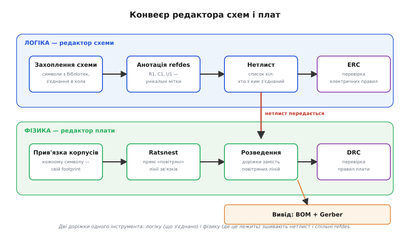
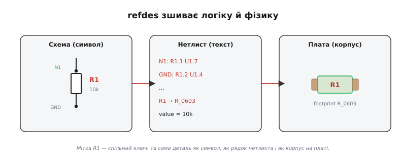

# 🔌 Редактор схем і плат: інструмент, у якому схема стає платою

Читати схему ми навчилися: п'ять кроків, патерни, вузли, номінали. Але звідки схема **береться** і куди вона потім **дівається**? Той акуратний малюнок із символами, шинами й підписами R1, C1, U1 — не самоціль. Його хтось намалював в особливій програмі, і не для краси, а щоб та сама програма перетворила намальоване на **фізичну плату**: прямокутник склотекстоліту з мідними доріжками й майданчиками під деталі. Клас таких програм зветься **EDA** (англ. *Electronic Design Automation* — автоматизація проєктування електроніки), а конкретний режим малювання схеми — **захоплення схеми** (англ. *schematic capture*, буквально «схоплювання схеми»: інструмент «схоплює» ваш задум у машиночитанний вигляд).

Розібратися, як влаштований цей інструмент, варто не заради самої програми. Коли розумієш, **як** схема стає платою — через які кроки, які файли, які перевірки, — то й **читаєш** чужі схеми точніше: бачиш у них не картинку, а вхід у конвеєр, де кожен підпис і кожна крапка з'єднання щось означають для наступного кроку. Цей текст — про клас інструментів узагалі, без прив'язки до якогось одного продукту. Назви на кшталт KiCad, Altium чи gEDA згадаємо хіба як приклади: суть однакова в усіх, від безплатних до тих, що коштують як автомобіль.

## Клас інструмента: що це взагалі таке

EDA-редактор — це, по суті, **два редактори в одному пакеті**, зшиті спільною базою даних:

- **редактор схеми** — де ви малюєте **логіку**: які компоненти є і що з чим з'єднано, без жодної думки про фізичні розміри й розташування;
- **редактор плати** (англ. *PCB layout editor*, *PCB* — *printed circuit board*, друкована плата) — де ви розкладаєте **фізику**: де саме на текстоліті лежить кожна деталь і як між ними біжать мідні доріжки.

Ключ до всього інструмента — у цьому **поділі на логіку й фізику** і в тому, як їх зв'язано. Схема відповідає на питання **«що з чим з'єднано»**; плата — на питання **«де це лежить і як прокладено мідь»**. Це два зовсім різні світи. На схемі резистор — це прямокутник із двома лініями, і байдуже, де він на аркуші: логіка з'єднань від його положення не залежить. На платі той самий резистор — це два мідні майданчики на точній відстані, з точними координатами, і від того, куди його посунути, залежить довжина доріжок, наводки, тепло.

> 🔧 **Навіщо це.** Саме через цей поділ читання схеми має сенс окремо від плати. Схема — це **чиста логіка кола**, очищена від фізичного безладу; тому за схемою розумієш **задум**, а за платою — **втілення**. Коли ви читаєте схему за нашим рецептом (живлення → блоки → сигнал → вузли → номінали), ви читаєте саме логіку — і робите це, не відволікаючись на те, де воно лежить у міді. Інструмент навмисне тримає ці шари нарізно, щоб кожен можна було охопити окремо.

А що ж зшиває два світи докупи? Дві речі, і обидві вам уже трапилися при читанні схем: **позначення деталей** (refdes) і **список кіл** (нетлист). Розберемо весь конвеєр по кроках, а тоді повернемося до цієї пари як до серця всього інструмента.

## Блок-схема: конвеєр від задуму до заводу

Робота в EDA — це не хаотичне малювання, а **конвеєр** із чіткими станціями. Задум входить з одного кінця, виробничі файли виходять з іншого, і між ними — ланцюжок кроків, де кожен спирається на попередній.


*Дві доріжки одного інструмента. Угорі — логіка: намалювати схему, розставити мітки, зібрати список кіл, перевірити електрику. Внизу — фізика: дати кожному символу корпус, побачити зв'язки повітряними лініями, розвести доріжки, перевірити правила плати. Нетлист «падає» з логіки у фізику й тримає обидві доріжки узгодженими.*

Пройдімося станціями — це, по суті, розгорнутий «звідки і куди» тієї схеми, яку ви читаєте.

**1. Захоплення схеми.** Ви витягуєте [символи](topic:electronics/component-symbols) із **бібліотек** — готових наборів позначень (резистор, конденсатор, мікросхема з підписаними виводами) — і з'єднуєте їхні виводи лініями. Кожна лінія (чи група з'єднаних ліній) стає **колом** (англ. *net*, «мережа») — тобто одним електричним вузлом, тією самою «зафарбованою» точкою, про яку ми говорили при читанні вузлів. Тут ви працюєте суто з логікою: перетягуєте символи, тягнете дроти, ставите крапки з'єднань.

**2. Анотація refdes.** Кожному символу інструмент (або ви вручну) присвоює **унікальне позначення** — R1, R2, C1, U1. Це і є **refdes** (англ. *reference designator*, «опорне позначення»). Спершу свіжопоставлений символ часто висить із «R?» — знаком питання; **анотація** (англ. *annotation*) — це операція, що замінює всі ці «?» на реальні номери, стежачи, щоб жоден не повторився. Здавалося б, дрібниця — але саме ця мітка далі зв'яже логіку з фізикою, тож без коректної анотації конвеєр не поїде.

**3. Генерація нетлиста.** Готову схему інструмент «сплющує» у **нетлист** (англ. *netlist*, «список мереж/кіл») — простий текстовий список: які кола є і які виводи яких деталей до кожного кола під'єднані. Це вже не картинка, а **дані**: машиночитанний зліпок усієї логіки з'єднань. Історично саме нетлист був тим форматом, яким обмінювалися різні програми в 1980-х, коли редактор схеми й редактор плати часто були **окремими продуктами** від різних виробників; щоб вони порозумілися, індустрія навіть виробила спільні формати обміну (як **EDIF** — вендоронезалежний формат нетлистів і схем, укладений консорціумом виробників наприкінці 1980-х). Нетлист — це «есперанто» між логікою і фізикою.

**4. Прив'язка корпусів (footprint).** Ось де логіка зустрічає фізику. Символ на схемі не знає про розміри — резистор може бути велетенським дротяним або крихітним, як макова зернина. Тому кожному символу треба призначити **корпус** (англ. *footprint*, «слід/відбиток» — те, що деталь лишає на платі): набір мідних майданчиків потрібної форми й розміру на потрібних відстанях. Той самий логічний резистор R1 може дістати корпус великий чи мініатюрний — логіка та сама, фізика різна. Про те, як влаштований сам відбиток деталі на міді, докладніше — у [проєктуванні корпусів](topic:electronics/footprint-design).

**5. Передача нетлиста в редактор плати й ratsnest.** Ви імпортуєте нетлист у редактор плати. Інструмент бачить: ага, є деталі з корпусами, і є список, хто з ким має бути з'єднаний. Він розкидає корпуси на заготовці плати й з'єднує ті виводи, що мусять бути в одному колі, **прямими тонкими лініями «навпростець»** — так званими **повітряними зв'язками** (англ. *airwires*, «повітряні дроти»). Уся ця плутанина прямих ліній, що перетинаються врізнобіч, і зветься **ratsnest** (англ. «пацюче гніздо» — бо купа переплетених ниток і справді схожа на клубок). Це ще не доріжки — це лише **підказка**, що з чим має з'єднатися. Ratsnest — жива річ: рухаєте деталь — лінії тягнуться за нею, лишаючись прямими.

**6. Розведення доріжок.** Тепер головна ручна (або напівавтоматична) робота: перетворити кожну повітряну лінію на **справжню мідну доріжку** (англ. *trace*). Ви ведете доріжки так, щоб вони не перетиналися недозволено, вписалися в габарит, оминули заборонені зони. У міру того як зв'язки перетворюються на мідь, ratsnest **тане**: кожна розведена лінія зникає з клубка. Порожній ratsnest = усе розведено. Про фізику самих доріжок і саму [друковану плату як об'єкт](topic:electronics/pcb-layout) — окрема тема.

**7. Перевірки: ERC і DRC.** На двох рівнях інструмент сам себе перевіряє. **ERC** (англ. *Electrical Rules Check*, перевірка електричних правил) працює на **схемі**: шукає логічні безглуздя — вихід, з'єднаний з виходом; вивід живлення, що нікуди не під'єднаний; вхід, що висить у повітрі; кола з єдиним виводом (нікуди не ведуть). **DRC** (англ. *Design Rules Check*, перевірка правил проєктування) працює на **платі**: шукає фізичні порушення — доріжки надто близько одна до одної, доріжка тонша за дозволену, майданчики налазять, зазори менші за ті, що витримає завод. Дві сітки, два різні шари помилок.

**8. Вивід виробничих файлів.** Плата готова — час віддати її на завод і в закупівлю. Інструмент генерує два різні виходи:
- **BOM** (англ. *Bill of Materials*, [специфікація/перелік матеріалів](topic:electronics/bom)) — таблиця «що купити»: скільки яких деталей, які номінали, які корпуси. Це те, за чим збирач замовляє компоненти.
- **Gerber** — набір файлів, що описують кожен шар плати (мідь, маску, шовкографію) як набір фігур; це **мова, якою розмовляють із заводом**. Формат старий і поважний: коріння його — у фотоплотерах фірми Gerber Scientific (заснованої винахідником Джозефом Гербером) ще з 1960-х; сучасний варіант **RS-274X** («розширений Gerber») з'явився 1991 року й дотепер є фактичним стандартом обміну з виробництвом.

Ось і весь конвеєр: **захопив схему → розставив мітки → зібрав нетлист → дав корпуси → розвів по ratsnest → перевірив ERC/DRC → вивів BOM і Gerber**. Кожен крок готує ґрунт наступному, і весь ланцюг тримається на одній зв'язці, до якої ми тепер і повернемося.

## Розпіновка класу: refdes і нетлист як спільні виводи

У «залізного» компонента є розпіновка — які виводи за що відповідають. У EDA-інструмента «розпіновка» умовна, але вона є: це **два стики**, якими логіка з'єднується з фізикою. Зрозумієте ці два стики — зрозумієте весь інструмент.

**refdes — спільний ключ.** Мітка R1 існує **одночасно в трьох місцях**: як символ на схемі, як рядок у нетлисті, як корпус на платі. Це не три різні R1 — це **одна деталь**, показана трьома способами. refdes — той нитяний місток, що прошиває всі три погляди.


*Мітка R1 — спільний ключ. Ліворуч вона на символі схеми, посередині — у рядках нетлиста (виводи R1.1, R1.2 приписані до кіл), праворуч — на корпусі плати. Змініть R1 на схемі — і зміна «протече» крізь нетлист аж у плату, бо всюди це та сама мітка.*

**нетлист — спільна мова з'єднань.** Якщо refdes зв'язує **деталі**, то нетлист зв'язує **з'єднання**. Він каже: «коло N1 містить вивід 1 деталі R1 і вивід 7 деталі U1»; «коло GND містить вивід 2 деталі R1 і вивід 4 деталі U1». Це — той самий поділ на вузли, який ви робите очима, читаючи схему («усе, з'єднане одним дротом, — один вузол»), тільки записаний машиною й нічого не пропускаючи.

Погляньмо на крихітний нетлист трьох деталей — світлодіод через резистор до виводу мікроконтролера:

```
# нетлист: кола і приписані до них виводи (refdes.вивід)
(net "+5V"   (node R1 1) (node U1 8))
(net "N1"    (node R1 2) (node D1 1))   # вузол між резистором і анодом
(net "GND"   (node D1 2) (node U1 4))
```

Читається просто: коло `N1` — це точка, де сходяться вивід 2 резистора R1 і вивід 1 (анод) світлодіода D1. Рівно те, що на схемі було б жирною крапкою з'єднання й підписом «N1». Різниця в тому, що око читає це з картинки, а плата — з цього тексту. **Нетлист — це ваша схема, переказана мовою, яку розуміє редактор плати.**

> 🔧 **Навіщо це.** Ось чому в EDA **не малюють плату вручну «з голови»**. Ви малюєте лише **схему** (логіку), а зв'язки на платі інструмент бере з нетлиста — і **не дасть** з'єднати те, чого нема на схемі, чи забути те, що на схемі є. Ratsnest — це буквально нетлист, показаний лініями: скільки повітряних зв'язків, стільки з'єднань вимагає схема. Тому «джерело правди» — завжди схема; плата лише **втілює** те, що схема наказала. Звідси й головне правило гігієни, до якого ми зараз дійдемо: схема й плата мусять лишатися **синхронними**.

## Підключення станцій: як шари тримаються разом

Тепер видно, як увесь інструмент «підключений» усередині — як станції передають роботу далі. Це не лінійна вулиця з одностороннім рухом; це радше **двоповерхова будівля зі сходами між поверхами**.

**Верхній поверх — логіка** (схема → refdes → нетлист → ERC). **Нижній — фізика** (корпуси → ratsnest → доріжки → DRC). **Сходи між ними — нетлист**, і ходять цими сходами не раз. Ви не проходите конвеєр один раз згори вниз і не забуваєте про верх. Реальна робота **ітеративна**: намалювали шматок схеми → передали в плату → порозводили → помітили, що чогось бракує чи щось незручно лягає → **повернулися на схему**, поправили → **знову передали нетлист** у плату. Інструмент при повторній передачі не стирає вашу роботу, а **звіряє** поточну плату з новим нетлистом і показує різницю: це коло додалося, це зникло, цю деталь замінено.

Саме тому нетлист передають **знову й знову** — це не разова дія на початку, а постійний **синхронізатор** між двома поверхами. І саме тут ховається головна пастка класу, бо якщо ці сходи розсинхронізуються, обидва поверхи починають брехати один про одного.

## «Перший проєкт»: найкоротший шлях крізь інструмент

Замість «першого байта» в програмі — **перший наскрізний проєкт** у EDA. Найкоротший маршрут, щоб зробити просту плату, укладається у вісім кроків, і кожен ви вже впізнаєте:

1. **Намалюй схему.** Витягни символи з бібліотек, з'єднай виводи в кола. Це та сама схема, яку потім хтось читатиме за нашим рецептом.
2. **Анотуй.** Хай усі «R?» стануть R1, R2, … — без повторів.
3. **Прогони ERC.** Полагодь висячі виводи, зустрічні виходи, неживлені мікросхеми, поки перевірка не змовкне.
4. **Признач корпуси.** Кожному символу — свій footprint під те, що реально паятимеш.
5. **Згенеруй нетлист і передай у плату.** З'являться корпуси й ratsnest — клубок повітряних зв'язків.
6. **Розстав і розведи.** Спершу розумно **розклади** деталі (згруповані блоки — поруч, розв'язувальні конденсатори — впритул до чипів, як ми бачили при читанні патернів), тоді **веди доріжки**, аж поки ratsnest не розтане.
7. **Прогони DRC.** Полагодь зазори, ширини, налізання — поки й ця перевірка не змовкне.
8. **Виведи BOM і Gerber.** Перший — у закупівлю деталей, другий — на завод.

Прикметно, як цей маршрут дзеркалить **читання** схеми, тільки навпаки. Читаючи, ви йдете від готової картинки до розуміння задуму (живлення → блоки → сигнал → вузли → номінали). Проєктуючи, ви йдете від задуму до картинки й далі до заліза (схема → нетлист → корпуси → мідь). Це той самий місток між логікою і фізикою, пройдений у двох напрямках; тому хто вміє читати схему, той **швидше вчиться її створювати**, і навпаки.

## Типові граблі класу

У кожного класу пристроїв є свої граблі, на які наступає майже кожен. У EDA вони майже всі ростуть із одного кореня — **розриву між логікою і фізикою**.

**Розсинхрон схеми й плати.** Наступніша граблина класу. Ви поправили схему — додали резистор, перекинули дріт, — але **забули заново передати нетлист** у плату. Тепер схема каже одне, а плата втілює старе: два поверхи будівлі суперечать один одному. Найпідступніше те, що плата при цьому **виглядає готовою** — доріжки розведені, DRC мовчить, — а насправді вона розводить **застарілу** логіку. Захист простий: **щоразу після правки схеми — заново синхронізуй плату** й уважно дивись, що інструмент показує в різниці. Багато редакторів мають окрему перевірку на розсинхрон — не ігноруйте її.

**Забутий чи неправильний footprint.** Символ на схемі є, а корпус йому не призначено — або призначено **не той**. На схемі це непомітно (логіка ж ціла!), але в плату така деталь або не потрапить зовсім, або потрапить із чужим слідом: мініатюрний корпус там, де мав бути великий, чи розпіновка «дзеркалом». Плата зробиться, деталь **не влізе** або сяде не тими виводами. Ліки: перед виведенням Gerber пройдися по **всьому** списку деталей і звір корпус кожної з тим, що реально паятимеш; не покладайся, що «за замовчуванням правильно».

**Проігнорований ERC/DRC.** Перевірки лаються — а ви махнули рукою: «та то дрібниці». Частина зауважень і справді нешкідлива (інструмент буває занудою), але серед них тоне й **справжня** біда: неживлений вивід живлення, коротке замикання між сусідніми доріжками, зазор, тонший за той, що витримає завод. Правило гігієни: **розбирай кожне зауваження**, а не глуши всі гуртом. Те, що свідомо визнав хибною тривогою, — прямо познач як виняток, щоб наступного разу воно не ховало нову, справжню помилку.

**Кола, з'єднані «майже».** Дві лінії на схемі виглядають з'єднаними, а насправді їхні кінці **не зійшлися** на пікселі — крапки з'єднання нема. Око бачить один вузол, інструмент бачить **два різні кола**. У нетлист це піде як розрив, у ratsnest — як зайва повітряна лінія (або її брак), і на платі зв'язок просто **не з'явиться**. Саме тому при читанні ми наголошували: жирна крапка = з'єднання, її відсутність = лінії лише **перетнулися**. Інструмент тут суворіший за око: для нього «майже з'єднано» = «не з'єднано». Помічник — підсвітка кола: клацнув на дріт, і видно **весь** вузол; якщо half того, що ти вважав одним колом, не підсвітилося — ось і розрив.

**Плутанина «висить у повітрі».** Вивід, що навмисне лишений непід'єднаним, і вивід, забутий помилково, для інструмента виглядають однаково — і ERC лається на обидва. Тому невикористані виводи прийнято **явно позначати** особливим значком «нема з'єднання» (англ. *no-connect*), кажучи інструментові: «це навмисно, мовчи». Так справжні забуті виводи не тонуть серед навмисних.

Спільна нитка всіх граблів очевидна: **логіка й фізика мусять лишатися одним цілим**, а всі перевірки на те й існують, щоб ловити мить, коли вони розповзаються. Хто це затямив, той половину помилок класу не робить зовсім.

## Варіації класу

Клас «редактор схем і плат» широкий, і конкретні інструменти різняться — але **конвеєр, який ми розібрали, спільний для всіх**. Змінюється обгортка, не суть.

**За ціною й відкритістю.** Є безплатні відкриті пакети (той-таки KiCad чи старший gEDA), є дорогі промислові (як Altium), є проміжні. Дорогі дають більше автоматики, кращі бібліотеки, глибші перевірки цілісності сигналів — але **захоплення схеми, нетлист, корпуси, ratsnest, ERC/DRC, Gerber** є в кожному. Навчившись конвеєра на одному, ви впізнаєте його в будь-якому іншому — міняються меню й гарячі клавіші, не поняття.

**Окремі програми проти єдиного пакета.** Історично (і подекуди досі у важкій промисловості) редактор схеми, редактор плати й симулятор бували **різними** продуктами, зшитими через файли-нетлисти. Саме звідти — уся культура стандартних форматів обміну: коли ланки конвеєра від різних виробників, їм потрібна спільна мова. Сучасні пакети частіше **інтегровані** (усе в одній базі даних, синхронізація автоматична), і розсинхрон стає важче влаштувати — але не неможливо, тож правило синхронності лишається чинним.

**Зі вбудованим симулятором.** Багато редакторів схем уміють не лише готувати плату, а й **прораховувати** коло ще до пайки — це та сама схема, віддана не в редактор плати, а в [SPICE-симулятор](topic:electronics/spice-simulation). Тут нетлист служить іншому споживачеві: не заводу, а математичній моделі, що передбачає напруги й струми. Один і той самий зліпок логіки годує два різні світи — виробництво й симуляцію.

**Складніші схеми — ієрархія.** Коли коло велике, його не тримають на одному аркуші, а ділять на **ієрархію** підсхем — про це докладніше в [ієрархічних схемах](topic:electronics/hierarchical-schematics) і в тому, як шини й [векторні кола](topic:electronics/net-bus-notation) стискають десятки однотипних ліній в один жирний штрих. Для конвеєра це нічого не змінює: інструмент усе одно «сплющить» ієрархію в єдиний плоский нетлист перед передачею в плату. Ієрархія — зручність для **читача й автора** схеми, а не окремий фізичний шар.

Хоч би яку варіацію ви відкрили, тримайте в голові ту саму карту: **логіка (схема) ↔ фізика (плата), зшиті через refdes і нетлист, перевірені через ERC і DRC, виведені в BOM і Gerber**. Це кістяк усього класу; решта — деталі оформлення. І коли наступного разу ви читатимете чужу схему, ви бачитимете в ній не лише коло, а **вхід у цей конвеєр** — те, з чого почнеться шлях до реальної плати.
