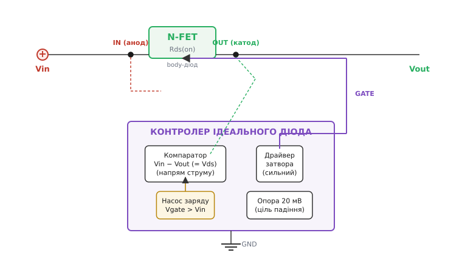
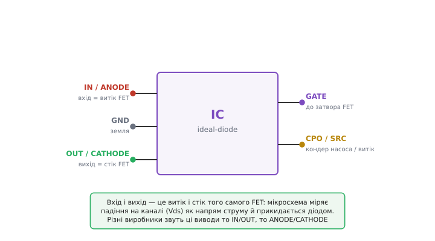
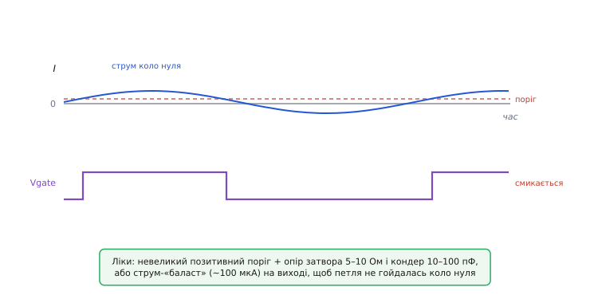

# 🔌 Мікросхема-контролер ідеального діода

Пасивний «ідеальний діод» на P-MOSFET, який ми зібрали в попередніх кроках, добрий і майже безкоштовний, але в нього три вроджені межі: він закривається повільно (аж поки резистор розрядить затвор), не блокує струм, що тече **назад** з виходу, і на низькій вхідній напрузі недовідкриває канал, бо |Vgs| прив'язане до самого Vin. Кожну з цих меж знімає окремий клас мікросхем — **контролери ідеального діода** (англ. *ideal-diode controller*). Це не один партномер, а ціла родина зі спільною архітектурою; розберімо її як клас — що всередині, як воно виглядає ззовні, як це підключати й де на цьому спотикаються, — не називаючи конкретних моделей, бо принцип у всіх однаковий.

Одразу проведімо межу, яку легко сплутати. **Контролер** сам транзистора не має — він лише **керує зовнішнім MOSFET**, який ви добираєте під свій струм. Є і споріднений клас — **інтегрований ідеальний діод**, де силовий FET уже сидить усередині корпусу; він простіший у монтажі, але прив'язаний до закладеного в кристал Rds(on) і струму, тож для великих струмів чи мінімального падіння беруть саме контролер із зовнішнім, свідомо низькоомним FET. Далі мова про контролер: він цікавіший, і саме він дає ту гнучкість, заради якої від пасивної схеми взагалі відмовляються.

## Що це за клас пристрою

Уявіть той самий пасивний вузол — MOSFET у розрив плюсового проводу, — але замість тупого резистора на затворі стоїть маленька мікросхема, яка **активно стежить за напрямком струму й активно керує затвором**. Вона робить рівно те, чого пасивна схема не вміє: тримає канал широко відкритим, коли струм тече вперед, і **вихоплює заряд із затвора за частку мікросекунди**, щойно струм спробує піти назад. По суті це електронний наглядач, який щомиті вирішує одне бінарне питання — «куди зараз тече струм?» — і залежно від відповіді або тримає FET увімкненим, або блискавично його вимикає.

Звідки контролер знає напрямок струму, не маючи окремого шунта? Хитрість елегантна: **самий канал відкритого MOSFET і є його амперметр**. Струм, що тече крізь опір Rds(on), лишає на ньому падіння Vds = I·Rds(on); знак цього падіння — це знак струму. Тече вперед — вхід (витік) трохи вищий за вихід (стік), Vds додатне; пішло назад — вихід стає вищим за вхід, Vds змінює знак. Контролеру досить бути точним **мікровольтметром** на своїх двох виводах, що сидять на витоку й стоку FET, — і він читає напрямок струму прямо з падіння на каналі, без жодного зайвого резистора у силовому колі. Це та сама причина, з якої «ідеальний діод» узагалі має сенс: те, що для діода було втратою (падіння), тут стало безкоштовним сигналом.

> 🔧 **Навіщо це.** Головна цінність контролера — не «ще менше падіння» (його й пасивна схема дає), а **швидке блокування зворотного струму**. Тільки-но у вас на вході більш ніж одне джерело (батарея плюс USB, основне плюс резервне) або на виході є куди перетікати заряду (великий конденсатор, паралельна шина), пасивний body-діод перестає рятувати — він відкритий саме в зворотному напрямку. Контролер закриває цей шлях за мікросекунди; без нього струм тік би з сильнішого джерела в слабше або з виходу назад у щойно зниклий вхід.

## Що всередині: блок-схема

Уся родина складається з тих самих чотирьох вузлів, з'єднаних в один контур регулювання.


*Контролер керує зовнішнім MOSFET. Компаратор читає падіння на каналі як напрям струму; драйвер заряджає й розряджає затвор; насос заряду дає напругу вище входу (щоб відкрити N-канал згори); вузол опори тримає крихітне цільове падіння. Сам силовий струм крізь мікросхему не тече — лише крізь зовнішній FET.*

**Компаратор напрямку струму** — серце вузла. Він вимірює Vds на каналі й порівнює зі своїм порогом. Поки струм іде вперед, компаратор тримає команду «відкрито». Щойно струм слабшає до нуля й ладен розвернутися, компаратор перемикається — і робить це навмисно **швидко й асиметрично**: увімкнення можна дозволити плавне, а от вимкнення при розвороті струму мусить бути миттєве, бо кожна зайва мікросекунда — це зворотний струм, що встиг протекти.

**Сильний драйвер затвора** — м'язи вузла. Пасивна схема розряджала затвор через резистор у сотні кілоом — звідси її десятки мікросекунд. Драйвер контролера натомість здатний висмикнути заряд із затвора струмом у **ампери**: типовий контролер дає струм розряду порядку 2 А і закриває канал не за 100 мкс, а менш ніж за мікросекунду. Саме драйвер перетворює «повільну RC-схему» на «швидкий вентиль».

**Насос заряду** (англ. *charge pump*) — вузол, без якого верхньоплечий N-канал неможливий. N-MOSFET у верхньому плечі відкривається, коли затвор **вищий** за витік; а витік тут сидить на самому Vin. Отже, щоб надійно відкрити N-канал, затвор треба підняти **вище за вхідну напругу** — а взяти напругу вище власного живлення пасивно нізвідки. Насос заряду перекачує заряд конденсаторами так, що на виході дає напругу на кілька-десяток вольтів вище Vin; цієї «надбавки» й вистачає, щоб повністю розкрити N-канал згори. Як саме конденсаторний насос піднімає напругу вище живлення — окрема гарна історія; тут досить знати, що це вбудований генератор напруги «понад вхід».

> Насос заряду — це схема, що з фіксованого живлення робить напругу **вищу** за нього (або протилежного знаку), гойдаючи заряд між конденсаторами: один заряджається від живлення, потім його «ставлять згори» на інший, і напруги додаються. ККД і струм обмежені, але для затвора MOSFET (майже без постійного струму) цього рівно досить. Докладно — у статті [насос заряду](book:electronics/charge-pump).

**Вузол опори (цільове падіння).** Найтонше в архітектурі — те, що добрий контролер не просто «відкриває навстіж», а **регулює** падіння. Він має еталонну напругу-ціль, порядку **20 мВ** (у різних приладів 8–22 мВ), і безперервно підганяє напругу на затворі так, щоб Vds трималося коло цієї цілі: падіння впало нижче — трохи прикриває затвор, зросло — підкручує. Навіщо навмисно тримати падіння, а не тиснути його в нуль? Бо це падіння — сигнал: якби контролер відкрив канал повністю й Vds стало нанівець, він би **втратив вимір напрямку** й не помітив би раннього розвороту струму. Мінімальне ненульове падіння — це запас чутливості, який дає компаратору «бачити» струм. Ось чому в даташитах ідеального діода фігурує не «нуль вольт», а саме ці десятки мілівольтів як робоча точка.

## Типова розпіновка

Корпуси в родини дрібні (часто 5–6 виводів), але набір виводів по суті той самий. Не заучуйте літери — тримайте в голові **функцію**: два виводи міряють падіння на каналі, один жене затвор, один-два обслуговують живлення й насос, один — земля.


*Виводи входу й виходу сидять на витоку й стоку одного FET — це «анод» і «катод» уявного діода; мікросхема міряє між ними падіння каналу. GATE жене затвор, окремий вивід тримає конденсатор насоса заряду, ще один — витік для зворотного шляху розряду. Літери в різних виробників різні, функції — ті самі.*

- **Вхід (IN, він же ANODE, він же VIN).** Сидить на витоку зовнішнього FET, тобто на боці джерела. Один із двох виводів вимірювання падіння. Часто заодно живить сам контролер.
- **Вихід (OUT, він же CATHODE, він же VOUT).** Сидить на стоку FET, на боці навантаження. Другий вивід вимірювання. Різниця IN−OUT і є те падіння Vds, за яким контролер читає напрямок струму.
- **Затвор (GATE).** Вихід драйвера — просто до затвора зовнішнього MOSFET. На ньому контролер і піднімає напругу (для N-каналу — вище входу через насос), і швидко валить її при розвороті струму.
- **Витік / зворотний шлях (SOURCE, SRC).** Окремий вивід, прив'язаний до витоку FET якнайближче — щоб розряд затвора йшов коротким шляхом і драйвер бачив справжнє Vgs. У деяких приладах суміщений з входом.
- **Конденсатор насоса (CPO, VCAP, CP).** Сюди чіпляють маленький конденсатор, на якому насос заряду накопичує «надбавку» для затвора. Орієнтир ємності — близько **десятикратної ємності затвора** вашого FET, щоб було чим швидко його заряджати.
- **Земля (GND).** Опора для внутрішньої логіки й компаратора.

Чому виводи то «IN/OUT», то «ANODE/CATHODE»? Бо мікросхема свідомо **прикидається діодом**: для решти схеми вона — двовивідний елемент, що пропускає струм в один бік і блокує в інший, тож частина виробників так і підписує виводи «анод/катод». Фізично ж це витік і стік того самого FET. Обидві назви позначають той самий вузол — не плутайтеся, коли зустрінете різні букви на однаковій за суттю мікросхемі.

## Як це підключати

Схема виходить майже така сама, як пасивний «ідеальний діод», тільки замість резистора й стабілітрона на затворі стоїть мікросхема:

- **Силовий шлях.** Зовнішній MOSFET — у розрив плюсового проводу: витік на вхідне джерело, стік на плату. Орієнтація body-діода — як у пасивній схемі: він має блокувати саме зворотний напрямок (це принципово, а не косметично — тут працює та сама логіка, що й для одиночного [body-діода](book:electronics/body-diode)). Для N-каналу у верхньому плечі це означає стік до навантаження, витік до входу, і насос заряду підніме затвор вище входу, щоб канал відкрився.
- **Вимірювальні виводи** контролера — на витік (вхід) і стік (вихід) цього ж FET. Дроти сенсу ведуть **прямо до виводів транзистора**, не до далеких точок шини: контролеру потрібне справжнє падіння саме на каналі, а не плюс падіння на доріжках, інакше він хибно оцінить струм.
- **Затвор** — з виводу GATE прямо на затвор FET (часто через маленький послідовний резистор, до якого повернемось у граблях).
- **Конденсатор насоса** — між виводом CPO й витоком FET, номіналом під ємність затвора.
- **Живлення й земля** контролера — на плюс і землю; часто вхід сам і живить мікросхему, тож окремого живлення не треба.

Ось «**перший байт**» цього класу — мінімальний ланцюжок думки, коли берете такий контролер уперше: **(1)** оберіть N- чи P-канал і, відповідно, чи потрібен насос — верхньоплечий N майже завжди означає контролер із насосом; **(2)** доберіть MOSFET за струмом і, головне, за Rds(on) при **гарячому** кристалі (він росте вдвічі до 125 °C) і за напругою затвор–витік, яку FET витримає; **(3)** переконайтеся, що FET **логічного рівня**, якщо вхід низьковольтний, інакше контролер не розкриє канал повністю; **(4)** поставте конденсатор насоса ≈10× ємності затвора; **(5)** прикиньте мінімальний робочий струм — і якщо навантаження буває майже нульовим, одразу передбачте засоби проти тремтіння затвора (нижче). П'ять кроків — і вузол працює.

**Скільки такий вузол їсть у спокої й чим це краще за пасивну схему?** Порахуймо чесно, бо саме тут головна відмінність від резистора на затворі.

**Вхід 12 В. Пасивний P-MOSFET має резистор затвора Rg = 100 кОм; контролер має власний струм спокою Iq = 5 мкА. Скільки бере кожен у штатній роботі й за скільки закривається?**

```text
Пасивна схема (струм крізь Rg постійно):
  Iq_pas = Vin / Rg
         = 12 / 100000
         = 120 мкА                    ← увесь час, поки є вхід
  Час закриття ≈ Rg · Ciss
         = 100000 · 1·10⁻⁹
         = 100 мкс                    ← повільно

Контролер:
  Iq_ic  = 5 мкА                      ← власне споживання
  Час закриття (драйвер ~2 А, Ciss 1 нФ, ΔVgs ~10 В):
         t ≈ Ciss · ΔVgs / Idrv
           = 1·10⁻⁹ · 10 / 2
           = 5 нс … але з затримкою компаратора
         разом < 1 мкс               ← у ~100 разів швидше
```

Виходить подвійний виграш: контролер бере **у ~20 разів менше** струму спокою (5 мкА проти 120 мкА — критично для пристрою, що місяцями живе від батареї) **і** закривається **на два порядки швидше** (менш ніж мікросекунда проти сотні). Пасивна схема потрапляє в пастку компромісу: щоб закриватися швидше, треба зменшити Rg — але тоді росте струм спокою (Vin/Rg), а він і так уже головна витрата в сплячому пристрої. Контролер розриває цей компроміс: активний драйвер дає і малий струм спокою, і швидке закриття водночас. Повне виведення динаміки закриття пасивної схеми — пік і сумарний зворотний заряд залежно від Rg та Ciss — розібране в окремій [математичній вставці](root:embedded/reverse-polarity/math-turnoff-dynamics.md); тут важливий висновок, а не повторне виведення.

## Типові граблі

Клас надійний, але має кілька характерних пасток — усі ростуть із самої його природи «активного контуру, що читає крихітне падіння».

**Тремтіння затвора біля порога.** Найвідоміша й найнеочікуваніша пастка. Коли струм навантаження **майже нульовий**, він «висить» коло порога компаратора й переходить його то туди, то сюди від найменшого шуму. Контролер слухняно то відкриває FET, то закриває — і затвор починає **смикатися**, а на виході з'являється дрібне брижіння напруги. Механізм подвійний. По-перше, контролер із регулюванням падіння — це петля зворотного зв'язку, а їй для стабільності потрібен бодай **мінімальний струм** (порядку сотні мікроампер); без навантаження петля втрачає опору й гойдається. По-друге, якщо поріг компаратора зроблено трохи **додатним** (щоб надійніше ловити розворот), то для ввімкнення FET потрібен мінімальний прямий струм I ≥ Vпоріг/Rds(on) — а нижче нього мікросхема чесно тримає FET закритим і знову вмикає його, коли струм на мить зросте.


*Тремтіння затвора при майже нульовому навантаженні: струм гуляє коло порога, і контролер услід за ним відкриває-закриває FET. Лікують малим позитивним порогом, невеликим опором і конденсатором на затворі (сповільнити фронти) або струмом-«баластом» ~100 мкА на виході, щоб петля мала за що триматися.*

Лікують тремтіння трьома засобами, які часто поєднують: **невеликий послідовний резистор на затворі (5–10 Ом) плюс дрібний конденсатор (10–100 пФ)** — вони сповільнюють фронти рівно настільки, щоб зірвати автоколивання; або **струм-«баласт»** — постійний резистор із виходу на землю, що тягне ті самі ~100 мкА (наприклад, 120 кОм на 12 В), даючи петлі мінімальне навантаження; або прилад із навмисно заданим невеликим гістерезисом порога. Головне — **передбачити** це на етапі схеми, якщо ваш пристрій має режим майже без споживання; інакше «незрозуміле брижіння на виході в сплячці» стане сюрпризом уже на готовій платі.

> 🔧 **Навіщо це.** Тремтіння затвора — класична причина, чому «на столі все працює, а в полі пищить». На повному навантаженні петля стабільна й проблеми не видно; вона вилазить саме в економному режимі, коли пристрій майже спить, — тобто там, де ви найменше хочете дивних коливань напруги й зайвого споживання. Резистор із конденсатором на затворі й баластний струм коштують копійки, але їх треба закласти **до** розведення плати.

**Потреба мінімального прямого струму.** Це той самий корінь, поданий з іншого боку. Контролер із додатним порогом чи з регулюванням падіння не «вмикається в нуль» — йому потрібен мінімальний прямий струм, щоб узагалі відкрити канал і тримати петлю. Якщо навантаження буває меншим за цей поріг, FET сидітиме закритим (працюючи лише через body-діод із його повним Vf), а вихід — просідати. Наслідок практичний: не чекайте від «ідеального діода» ідеальної поведінки при струмах, менших за десятки-сотні мікроампер; якщо вони вам потрібні, додайте той самий баластний струм або оберіть прилад із нижчим порогом.

**Захист затвора.** Та сама пересторога, що й у пасивній схемі та в [ключі живлення](book:electronics/mosfet-power-switch), лишається чинною. Оксид під затвором MOSFET тонкий і пробивається зазвичай при |Vgs| близько 20 В. Багато контролерів мають **вбудований обмежувач** напруги затвора (типово до ~15 В) — тоді зовнішній стабілітрон не потрібен, і це одна з переваг мікросхеми над пасивним вузлом. Але не всі; на високовольтному вході обов'язково перевірте по даташиту, чи контролер сам обмежує Vgs, і якщо ні — поставте стабілітрон затвор–витік, як у пасивній схемі. Плутати «контролер завжди береже затвор» — небезпечно: частина простих приладів цього не робить.

**Дроти вимірювання й затвора — коротко й до самого FET.** Контролер читає **мілівольти** падіння на каналі; будь-яке зайве падіння на доріжках сенсу він сприйме за струм і зрегулює хибно. Вимірювальні виводи ведіть кельвінівськи — прямо до виводів транзистора, а не до найближчої зручної точки шини. Так само вивід витоку (зворотний шлях розряду) має йти коротко до витоку FET, інакше драйвер «не побачить» справжнє Vgs і закриватиме канал повільніше, ніж обіцяє даташит. Довгі тонкі доріжки тут — прямий шлях до нестабільності й повільного вимкнення.

**Не забути конденсатор насоса.** Верхньоплечий N-канал без конденсатора на виводі насоса просто **не відкриється** повністю: насосу нема на чому накопичити «надбавку» для затвора. Це не «покращувач», а обов'язковий елемент; його відсутність чи замалий номінал дають млявий, недовідкритий FET із великим падінням — тобто саме те, від чого ви йшли до контролера.

## Варіації класу

Родина розпадається на кілька гілок, і вибір між ними — це той самий компроміс, що й для пасивної схеми, лише з ширшими можливостями.

**N-канал у верхньому плечі проти P-канала.** Контролер з насосом заряду дозволяє поставити згори **N-канальний** FET — а він за однакову ціну й розмір має менший Rds(on), бо рухливість електронів приблизно втричі вища за рухливість дірок. Тобто ще менше падіння й тепла, ніж у P-варіанті, без розриву землі. Ціна — сам насос (складніший кристал, свій дрібний струм) і обов'язковий конденсатор насоса. Простіші й дешевші контролери натомість керують **P-каналом** згори без насоса (P-канал відкривається затвором **нижче** витоку, а це напруга нижча за вхід, її взяти легко) — вони простіші, але й Rds(on) за ту саму ціну більший. Правило грубе: треба мінімальне падіння на чималому струмі — N-канал із насосом; треба простий дешевий вузол — P-канал без насоса.

**Об'єднання джерел (power ORing).** Головна прикладна варіація. Здатність швидко блокувати зворотний струм робить контролер природним інструментом, щоб з'єднати два джерела на спільну шину: кожен вхід (батарея, USB, адаптер) заводять через свій «ідеальний діод» на один вихід. Вищий з двох тримає шину, нижчий контролер автоматично **відсікає** (його Vds стало зворотним — канал закрився), а коли вищий зникне, нижчий підхопить навантаження за мікросекунди. Звичайні діоди робили б те саме, але палили б Vf·I на кожному вході постійно й ризикували б зворотним струмом; контролери роблять це майже без втрат і без ризику перетікання з сильнішого джерела в слабше. Для реверс-захисту нам важлива сама механіка блокування зворотного струму; ORing — її пряме застосування.

**Контролер проти інтегрованого ідеального діода.** Крайня «спрощена» гілка — коли FET уже всередині мікросхеми. Тоді монтаж мінімальний (нема зовнішнього транзистора, дротів сенсу, конденсатора насоса), але ви прив'язані до закладеного в кристал Rds(on) і граничного струму. Для малих струмів це найзручніший варіант; для великих чи для мінімального падіння повертаються до контролера із зовнішнім, свідомо низькоомним FET.

**Контролери з додатковими функціями.** Часто той самий вузол суміщають із суміжними захистами: обмеженням пускового струму (плавний старт великого конденсатора на вході), відсіканням при перенапрузі, вимиканням за командою мікроконтролера. Це вже не «чистий ідеальний діод», а комбінований вхідний захисний вузол — але ядро в ньому те саме: компаратор напрямку, драйвер затвора й, за потреби, насос заряду. Коли зустрінете такий багатофункційний прилад, шукайте це ядро — і решта розпіновки читатиметься легко.

Підсумково: контролер ідеального діода — це пасивний «ідеальний діод», якому додали три речі, яких тому бракувало: **швидкий компаратор напрямку**, **сильний драйвер затвора** й (для верхньоплечого N-канала) **насос заряду**. За це платять складнішим вузлом, власним дрібним споживанням і схильністю до тремтіння біля нуля струму — але дістають блокування зворотного струму за мікросекунди, мінімальний струм спокою й найменше можливе падіння. Там, де реверс — лише рідкісна аварія, вистачить і дешевого діода чи пасивного MOSFET; там, де на вході кілька джерел, важить кожен мікроампер сплячки чи потрібне справді двостороннє блокування, беруть саме цей клас.
