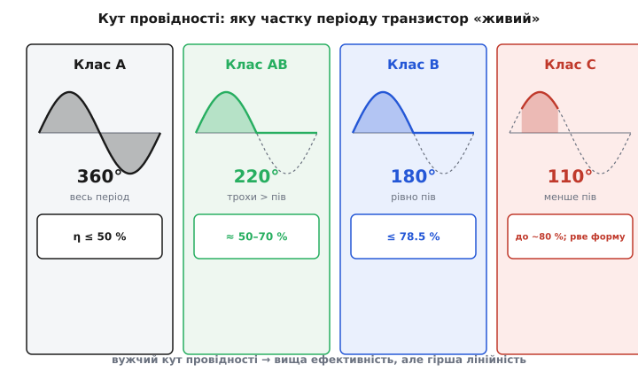
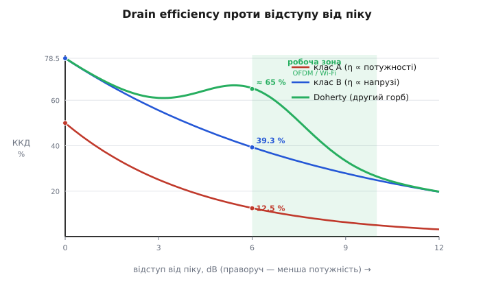

# 🔌 Класи підсилювачів потужності: лінійність проти ефективності

У статті ми вже зачепили болюче місце PA: щоб не спотворювати піки сигналу з великим PAPR, його доводиться тримати у відступі, а на відступі ефективність провалюється — і саме тому «закласти запас потужності» означає посадити батарею навіть тоді, коли запас не працює. Тут розберемо, **чому** так влаштовано — від самого транзистора. Виявиться, що лінійність і ефективність — не дві незалежні характеристики, які можна покращувати кожну окремо, а **дві сторони однієї фізичної заслінки**, і повернути її в один бік можна лише коштом другого. Зрозумівши цей конфлікт, ти перестанеш питати «який клас PA найкращий» (такого нема) і почнеш питати правильне: «який клас пасує **моєму** сигналу».

Це вставка-узагальнення: жодних партномерів, лише принцип, спільний для будь-якого підсилювача потужності — чи то лампового передавача 1930-х, чи то крихітного PA всередині твого радіочипа.

## Транзистор як кран: звідки взагалі береться ефективність

Почнімо з найпростішого образу, бо без нього все подальше — порожні літери. Підсилювач потужності — це **кран**, який керує великим потоком енергії від джерела живлення в навантаження (антену), а ручку крана смикає слабкий вхідний сигнал. Транзистор не «створює» потужність — він лише **дозує** ту, що тече від батареї. Уся енергія, яку PA вкидає в антену, приходить із живлення; уся, яку він **не** вкинув, осідає в самому транзисторі **теплом**.

Ось чому ефективність — це буквально питання, **скільки енергії транзистор пропустив в антену, а скільки розсіяв у собі**. Якщо з 1 Вт, узятого від батареї, 0.5 Вт пішло в ефір, а 0.5 Вт нагріло транзистор — ефективність 50 %. Цю величину для PA називають **ефективністю по стоку (drain efficiency)**, бо в польовому транзисторі потужність живлення заходить через вивід стоку:

```
η = P_RF / P_DC
```

де `P_RF` — корисна радіочастотна потужність в антену, `P_DC` — потужність, узята від живлення. Усе, що не потрапило в `P_RF`, перетворилося на тепло: `P_тепло = P_DC − P_RF`. Тримай цей баланс у голові — він керує всім.

> 🔧 **Навіщо це.** Для розробника drain efficiency — це не абстракція, а прямий переклад у дві фізичні величини, які ти відчуєш руками: **час роботи від батареї** і **температуру корпусу**. PA з ефективністю 10 % замість 40 % бере від батареї вчетверо більше струму на ту саму потужність в ефір — і втричі більше тепла мусить кудись подіти. На дроні це означає коротший політ і гарячий радіомодуль; на давачі з елементом живлення — місяці замість років автономності.

Є й друга, чесніша міра — **PAE (power-added efficiency, ефективність із доданою потужністю)**. Вона віднімає потужність, яку ми **самі вклали** на вхід PA, бо її ж теж дала батарея:

```
PAE = (P_RF,вих − P_RF,вх) / P_DC
```

Поки підсилення PA велике (понад 10 dB — а так майже завжди), вхідна потужність мізерна на тлі вихідної, і PAE майже збігається з drain efficiency. Тому далі говоритимемо просто «ефективність», маючи на увазі drain efficiency, — а PAE згадуй, коли підсилення одного каскаду мале й вхідну потужність уже не можна знехтувати.

Тепер головне питання: від чого залежить, скільки транзистор розсіє в собі? Відповідь — від того, **як довго протягом кожного періоду сигналу він тримає кран привідкритим**. І саме тут народжуються класи.

## Кут провідності — одна ручка, що задає все

Уяви синусоїду на вході PA — один повний оберт, 360°. Транзистор можна змістити (задати йому **робочу точку**, *bias*) так, що він проводитиме струм або весь цей оберт, або тільки його частину. Частку періоду, протягом якої транзистор **відкритий і проводить струм**, називають **кутом провідності (conduction angle)**. Це і є та єдина ручка, що ділить підсилювачі на класи.

Чому ця ручка керує ефективністю — видно з балансу тепла. Транзистор гріється найдужче тоді, коли через нього тече струм **і одночасно** на ньому падає напруга (потужність втрат = струм × напруга). Якщо транзистор відкритий **весь** період, він розсіює тепло **весь** час, навіть у паузах між піками сигналу, коли в антену майже нічого не йде. Якщо ж він відкривається лише на короткий спалах біля піку, а решту часу повністю закритий (струм нуль → втрат нуль), то й гріється лише в ці спалахи. Менший кут провідності → менше часу на марні втрати → вища ефективність.


*Та сама синусоїда на вході, чотири робочі точки. Заштрихована — частина періоду, коли транзистор «живий» і проводить струм. Клас A проводить увесь оберт (360°) і тому гріється завжди; клас B — рівно половину (180°); клас C — лише вузький спалах біля піку. Праворуч — стеля ефективності кожного класу: вужчий кут піднімає її, але, як побачимо, ламає форму сигналу.*

Здавалося б — звужуй кут і тішся ефективністю. Але тут вступає розплата. Коли транзистор проводить **не весь** період, він **відрізає** ту частину сигналу, поки закритий. Half-cycle, який він пропустив, у вихідному струмі просто відсутній — форма спотворена. Тобто **те саме звуження кута, що дає ефективність, водночас руйнує лінійність**. Це не дві окремі вади, а одна причина з двома наслідками. Ось чому конфлікт лінійність↔ефективність нерозв'язний у межах одного транзистора: вони керуються однією ручкою, що крутить їх у протилежні боки. Пройдімося класами й побачимо цей розмін у дії.

## Клас A: ідеальна форма, половина енергії в нікуди

**Клас A** — транзистор зміщено так, що він проводить **весь період, усі 360°**. Робочу точку ставлять посередині: навіть коли вхідного сигналу нема взагалі, через транзистор тече добрий постійний струм (його так і звуть — **струм спокою**, *quiescent current*).

Плата за це очевидна: транзистор споживає від батареї **повний струм завжди** — і на піку сигналу, і в тиші. У тиші вся ця потужність іде просто в тепло, бо в антену нічого не передається. Тому стеля ефективності класу A — лише **50 %**, і це теоретичний максимум, досяжний тільки на повній амплітуді й лише в гарно узгодженій (трансформаторній чи резонансній) схемі; у простих конфігураціях стеля взагалі 25 %.

Натомість виграш — у формі. Раз транзистор ніколи не закривається, він ніколи нічого не відрізає: вихід повторює вхід без зламів. Клас A — **найлінійніший** з усіх, еталон чистоти. Його ставлять там, де спотворення критичні, а ефективність другорядна: малосигнальні каскади, драйвери, прецизійні підсилювачі.

А тепер — та сама пастка відступу, але вже з числом, виведеним до кінця. Поведінка класу A на відступі катастрофічна, і ось чому. Струм спокою **не залежить** від амплітуди сигналу — він фіксований робочою точкою. Отже, потужність від батареї `P_DC` майже стала, хоч би як ти зменшував сигнал. А корисна потужність в антену падає як **квадрат** амплітуди. Ефективність — їхнє відношення, тож:

```
η_A(відступ) ∝ P_RF / P_DC ∝ (амплітуда)² / const ∝ потужність
```

Тобто ефективність класу A падає **пропорційно вихідній потужності**. Відступив на 6 dB (учетверо менша потужність) — ефективність упала **вчетверо**:

**Клас A на відступі 6 dB.** Стеля 50 % на піку. Відступ 6 dB = потужність у 4 рази менша:

```
η_пік   = 50 %
відступ = 6 dB  →  множник потужності = 10^(−6/10) ≈ 0.25  (тобто ×1/4)
η(−6dB) = 50 % × 0.25 = 12.5 %
```

:::tabs
```c
// Drain efficiency класу A на заданому відступі від піку
#include <math.h>

float eff_class_a(float peak_eff_pct, float backoff_db) {
    float p_ratio = powf(10.0f, -backoff_db / 10.0f); // 6 dB -> 0.25
    return peak_eff_pct * p_ratio;                     // η ∝ потужності
}
// eff_class_a(50.0f, 6.0f) -> 12.5 %
```
```python
# Drain efficiency класу A на заданому відступі від піку

def eff_class_a(peak_eff_pct, backoff_db):
    p_ratio = 10.0 ** (-backoff_db / 10.0)  # 6 dB -> 0.25
    return peak_eff_pct * p_ratio           # η ∝ потужності

# eff_class_a(50.0, 6.0) -> 12.5 %
```
:::

Дванадцять із половиною відсотків. Решта 87.5 % енергії з батареї — у тепло, нагрівати корпус. Саме тому клас A на потужному передавачі з відступом нежиттєздатний: він спалив би батарею й розплавився б. Його місце — там, де сигнал малий, а чистота понад усе.

## Клас B: половина періоду, але злам у нулі

Логічний наступний крок: а що, як прибрати струм спокою зовсім? Хай транзистор сидить **закритий**, поки сигнал не штовхне його у провідність. Тоді в тиші — нуль струму, нуль втрат. Це **клас B**: кут провідності рівно **180°**, транзистор проводить рівно **половину** періоду (тільки коли вхід заганяє його у відкритий стан), а другу половину мовчить.

Ефективність злітає. Раз струм тече лише півперіоду й лише коли є що передавати, марних втрат у паузах нема. Теоретична стеля класу B — **π/4 ≈ 78.5 %**, майже вдвічі вище за клас A. І падає вона на відступі м'якше. Тут струм від батареї пропорційний **амплітуді** (бо транзистор бере рівно стільки, скільки треба на поточний рівень сигналу), а корисна потужність — квадрату амплітуди. Відношення:

```
η_B(відступ) ∝ (амплітуда)² / амплітуда ∝ амплітуда (напруга)
```

Ефективність класу B падає **пропорційно амплітуді (напрузі)**, тобто як **корінь** із відношення потужностей. На тих самих 6 dB відступу:

**Клас B на відступі 6 dB.** Стеля 78.5 % на піку. Відступ 6 dB = амплітуда вдвічі менша:

```
η_пік   = 78.5 %
відступ = 6 dB  →  множник амплітуди = 10^(−6/20) ≈ 0.5  (тобто ×1/2)
η(−6dB) = 78.5 % × 0.5 ≈ 39.3 %
```

:::tabs
```c
// Drain efficiency класу B на заданому відступі від піку
#include <math.h>

float eff_class_b(float peak_eff_pct, float backoff_db) {
    float v_ratio = powf(10.0f, -backoff_db / 20.0f); // 6 dB -> 0.5 (напруга!)
    return peak_eff_pct * v_ratio;                     // η ∝ амплітуді
}
// eff_class_b(78.5f, 6.0f) -> 39.3 %
```
```python
# Drain efficiency класу B на заданому відступі від піку

def eff_class_b(peak_eff_pct, backoff_db):
    v_ratio = 10.0 ** (-backoff_db / 20.0)  # 6 dB -> 0.5 (напруга!)
    return peak_eff_pct * v_ratio           # η ∝ амплітуді

# eff_class_b(78.5, 6.0) -> 39.3 %
```
:::

Порівняй із класом A: на тому самому відступі 6 dB клас B дає **39.3 %** проти жалюгідних **12.5 %** у класу A — утричі ефективніше саме там, де реально працює сигнал із PAPR. Зверни увагу на показник у формулі: для класу A це `/10` (бо ∝ потужності), для класу B — `/20` (бо ∝ напрузі). Один символ у коді — а за ним уся різниця в характері згасання.

Але дарма нічого не буває. Ціна класу B — **лінійність біля нуля**. Розглянь стик двох половинок: один транзистор тягне верхню півхвилю, другий (у двотактній, *push-pull*, схемі) — нижню. У момент переходу через нуль обидва на мить майже закриті, і вихід «провисає». Це **спотворення сходинки (crossover distortion)** — характерний злам у точці переходу. Для гучного звуку чи сигналу з постійною обвідною це дрібниця, але для радіо з щільним спектром такий злам породжує позасмугові продукти, які лізуть у сусідні канали. Чистий клас B у радіопередавачах майже не вживають саме через цю сходинку — натомість беруть компроміс.

## Клас AB: компроміс, на якому стоїть майже все радіо

**Клас AB** — саме той компроміс. Транзистору лишають **маленький** струм спокою: достатній, щоб він не закривався повністю в момент переходу через нуль (і сходинка зникала), але набагато менший за повний струм класу A. Кут провідності виходить **між 180° і 360°** — трохи більший за половину періоду.

Це золота середина. Невеликий струм спокою «зашпаровує» зону сходинки, повертаючи прийнятну лінійність, а більшу частину періоду транзистор усе ж бере струм за потребою, тримаючи ефективність помітно вищою за клас A — типово десь **50–70 %** на піку залежно від того, наскільки близько його змістили до B. Чим ближче до B (менший струм спокою) — тим ефективніше й нелінійніше; чим ближче до A — тим чистіше й ненажерливіше. Цією однією ручкою (величиною струму спокою) проєктувальник і налаштовує компроміс під конкретний сигнал.

> 🔧 **Навіщо це.** Коли ти бачиш у характеристиках радіомодуля «лінійний PA» — майже напевно це клас AB або його родич. Це робочий кінь усіх сучасних бездротових систем зі складною модуляцією: Wi-Fi, Bluetooth у режимах з обвідною, стільниковий зв'язок. PA всередині ESP32 — теж лінійний клас цього роду, бо OFDM-сигнал Wi-Fi він мусить підсилювати, не спотворюючи. Тому, дивлячись на тракт, виходь із того, що твій PA — це AB: помірно ефективний, але вимогливий до відступу.

Клас AB лінійний — а отже, успадковує всю проблему PAPR і відступу, тільки в трохи м'якшому вигляді, ніж клас B. Щоб зрозуміти, наскільки боляче цей відступ б'є по реальному пристрою, треба востаннє повернутися до питання: **чому взагалі сигнал змушує триматися у відступі**. Відповідь — у його обвідній.

## Чому модуляція з обвідною замикає тебе у відступі

Уся проблема в тому, **чи міняється амплітуда сигналу в часі**. Тут радіосигнали діляться на два світи, і доля PA в кожному протилежна.

Перший світ — сигнали **зі сталою обвідною (constant envelope)**. Інформація сидить тільки у **фазі** чи **частоті** несучої, а амплітуда стала, як рейка. Класичні приклади — FM, FSK, GMSK (модуляція старого GSM). Для такого сигналу PA можна гнати **на самій стелі**, у глибоке стиснення: хай він жорстко обрізає все, що вище межі, — обрізати нічого, бо амплітуда й так стала. А раз можна на стелі — можна навіть **клас C** (кут менше 180°, ефективність під 80 %), і саме його історично ставили в FM-передавачі. Зі сталою обвідною конфлікт лінійність↔ефективність майже зникає: бери найефективніший клас і не думай про спотворення амплітуди.

Другий світ — сигнали **зі змінною обвідною**. Амплітуда несе частину інформації й **гуляє** в часі, інколи різко. Сюди належить усе сучасне: QAM, OFDM (Wi-Fi), сигнали LTE/5G. І ось тут PA зобов'язаний бути лінійним — бо якщо він обріже високий пік, інформація, закладена в амплітуду цього піку, **спотвориться безповоротно**, а спектр «розповзеться» в сусідні канали (це звуть *spectral regrowth*, відростання спектра).

Наскільки високі ці піки — вимірюють уже знайомим нам **PAPR (peak-to-average power ratio)**: на скільки децибел миттєвий пік перевищує середній рівень. У синусоїди PAPR = 3 dB. У OFDM, де сотні піднесучих складаються у випадкових фазах і зрідка всі збігаються в один момент, пікове значення підстрибує далеко над середнім: типово **10–13 dB** для OFDM-систем загалом; для Wi-Fi практичний розподіл лягає приблизно в **3.5–10 dB** (на рівні 99.9 % випадків — близько 10 dB), для LTE — близько **12 dB**.

І тут замикається пастка. Щоб PA **не обрізав** навіть найрідші 10-децибельні піки, його стелю треба підняти так, щоб пік уміщався під нею. А це означає, що **середній** рівень сигналу, на якому PA працює переважну частину часу, опиняється на ці ж приблизно 6–10 dB **нижче** стелі. Сигнал змушує PA жити **у відступі (back-off)** — не тому, що так захотів проєктувальник, а тому, що інакше рідкісний пік зруйнує сигнал. А у відступі ефективність провалюється за тими формулами, що ми вивели: клас AB, який на піку дав би 60–70 %, у точці −8 dB згасає до якихось 15–25 %.


*Як згасає ефективність, коли сигнал відходить від піку (праворуч). Клас A (∝ потужності) провалюється найкрутіше — на 6 dB лишається 12.5 %; клас B (∝ напрузі) тримається краще — 39.3 %. Зелена смуга — робоча зона OFDM/Wi-Fi (відступ ~6–10 dB): саме сюди потрапляє середній рівень сигналу, і саме тут звичайний PA найнеефективніший. Крива Doherty показує вихід: другий горб ефективності, навмисно посаджений у цю зону.*

Тепер видно, **чому з графіка випливає головна теза статті**. Робоча точка реального Wi-Fi-PA — не на піку кривої, а глибоко в зеленій смузі, де навіть найкращий клас згасає. І якщо ти «про всяк випадок» закладаєш PA з більшою номінальною потужністю, ти лише **зсуваєш робочу точку ще глибше у відступ** — у ще лівішу, ще неефективнішу частину його власної кривої. Зайвий PA не лежить тихо; він тягне більший струм спокою, гріється дужче й на тому самому корисному рівні працює з гіршою ефективністю. **Запас потужності, який не використовується щомиті, не безкоштовний — за нього щомиті платить батарея.**

## ESP32 на пальцях: ціна лінійності у твоєму чипі

Цей конфлікт не десь у теорії — він зашитий у даташит чипа, який стоїть у тебе на платі. Подивись, як ESP32 декларує потужність передачі для різних режимів:

- **802.11b** (проста модуляція, майже стала обвідна, низький PAPR) — десь **+20 dBm**;
- **802.11n MCS7** (OFDM, високий PAPR, потрібна лінійність) — лише близько **+13…+15 dBm**.

Той самий чип, той самий PA, та сама антена — а в режимі OFDM віддає в ефір на **5–7 dB менше**. Куди поділися ці децибели? Їх з'їв **обов'язковий відступ**: щоб не спотворювати OFDM-піки (інакше зросте EVM і сигнал не пролізе крізь спектральну маску), радіо **само** притишило PA. Це і є плата за лінійність у чистому вигляді — і вона не якась екзотика, а буденна цифра з реального даташита.

**Що це означає для дальності й батареї.** У режимі 802.11b ти маєш +20 dBm і вищу ефективність PA (бо він ближче до стелі). У режимі OFDM — менша потужність в ефір (коротша дальність за інших рівних) **і** гірша ефективність PA (бо він у відступі). Тобто за вищу швидкість OFDM ти платиш **двічі**: і дальністю, і струмом. Знати це треба, коли проєктуєш автономний вузол: якщо тобі важлива дальність і години роботи, а не пікова швидкість, інколи розумніше слати дані повільнішим, але «жорсткішим» режимом — він і добиває далі, і береже батарею.

> 🔧 **Навіщо це.** Звідси проста проєктна дисципліна. По-перше, **не закладай зайвої потужності PA «про запас»** — кожен зайвий децибел номіналу зсуває робочу точку у відступ і капає струмом цілодобово, навіть коли запас не потрібен. По-друге, **рахуй струм передачі для свого реального режиму**, а не для рядка «макс. потужність» з даташита: OFDM на відступі візьме більше, ніж проста модуляція на стелі. По-третє, якщо бюджет енергії тисне, **обирай вид модуляції свідомо** — стала обвідна дозволяє гнати PA ефективніше.

## Як інженери все ж обходять відступ

Конфлікт лінійність↔ефективність нерозв'язний **у межах одного транзистора зі сталою робочою точкою**. Але якщо дозволити робочій точці чи топології **мінятися разом із сигналом**, частину виграшу можна повернути. Це окреме мистецтво, і тобі як прикладному розробнику не доведеться його будувати, — але впізнавати ці назви в характеристиках варто, бо саме вони пояснюють, чому сучасні базові станції й телефони не плавляться.

**Doherty.** Найстаріший і досі найпоширеніший прийом. Замість одного PA ставлять **два**: основний (*carrier*, несучий) і допоміжний (*peaking*, піковий). На середніх рівнях сигналу працює лише несучий, налаштований так, щоб бути найефективнішим **саме у відступі**, а не на піку. Коли ж сигнал стрибає до піку, вмикається піковий підсилювач і через спеціальну чвертьхвильову ланку **динамічно змінює навантаження**, яке «бачить» несучий, — і той теж виходить на високу ефективність. Результат — **другий горб** ефективності, навмисно посаджений у робочу зону відступу (типово близько 6 dB нижче піку), що добре видно на нашому графіку. Прийом винайшов **Вільям Догерті (William H. Doherty)** з Bell Telephone Laboratories у **1936 році** — американський інженер (народився в Кембриджі, Массачусетс; навчався в Гарварді), який шукав, як підняти ефективність потужних лампових AM-передавачів; історично Doherty підняв їхній ККД приблизно з 30 % до понад 60 %. (Усталений факт; авторство й дата задокументовані в історичних оглядах IEEE.) Сьогодні Doherty — стандарт у передавачах базових станцій стільникового зв'язку.

**Envelope tracking (стеження за обвідною, ET).** Інший хід: лишити один PA, але **рухати його живлення** вгору-вниз слідом за миттєвою обвідною сигналу. Згадай: марні втрати в PA — це коли напруга живлення є, а сигнал малий (різниця осідає теплом). ET прибирає цю різницю: коли обвідна сигналу провисає, швидкий перетворювач опускає й напругу живлення PA, тримаючи транзистор завжди близько до насичення — найефективнішого режиму. Живлення «дихає» в такт із сигналом, і відступ перестає коштувати тепла. Ідейний предок ET — техніка **EER (envelope elimination and restoration, усунення й відновлення обвідної)**, яку запропонував **Леонард Кан (Leonard R. Kahn)** ще **1952 року** (праця «Single-Sideband Transmission by Envelope Elimination and Restoration», *Proc. IRE*). Сучасний envelope tracking масово ставлять у PA смартфонів, щоб подовжити час роботи від батареї на LTE/5G з їхнім високим PAPR.

Обидва прийоми атакують той самий ворог — **марні втрати у відступі**, — але з різних боків: Doherty грає **топологією** (два підсилювачі ділять роботу), ET грає **живленням** (один підсилювач, але напруга стежить за сигналом). Їх навіть поєднують. Тобі, найімовірніше, дістанеться готовий PA чи радіочип, де все це вже вирішено за тебе, — але тепер, побачивши в характеристиках «Doherty» чи «envelope tracking», ти знатимеш, **яку саме проблему** ця складність розв'язує: не «зробити сигнал чистішим» і не «гучнішим», а **повернути ефективність там, де відступ її забрав**.

## Що з цього винести

Звузимо все до кількох тверджень, на які можна спиратися в реальному проєкті.

Лінійність і ефективність PA — **не дві ручки, а одна**: кут провідності. Розкрутиш його на повний оберт (клас A) — отримаєш ідеальну форму й стелю 50 %; стиснеш до спалаху (клас C) — ефективність під 80 %, але форму порвано. Усе практичне радіо зі складною модуляцією живе на компромісі **класу AB**.

Сигнали з обвідною (OFDM, QAM) **змушують** тримати PA у відступі на величину PAPR (для Wi-Fi — порядку 6–10 dB), а у відступі ефективність провалюється: для класу A — пропорційно **потужності** (на 6 dB → ×1/4), для класу B — пропорційно **напрузі** (на 6 dB → ×1/2). Це не вада конкретного чипа, а фізика будь-якого лінійного PA.

Звідси головне практичне правило, заради якого все це й розбиралося: **зайвий запас потужності PA — не безкоштовний**. Кожен закладений «про всяк випадок» децибел зсуває робочу точку глибше у відступ, де PA найненажерливіший, і капає струмом батареї цілодобово — навіть коли той запас ані разу не знадобився. Тому потужність тракту закладай **під реальну потребу бюджету лінії**, а не з округленням угору, і рахуй струм передачі для **свого** режиму модуляції, а не для найгучнішого рядка в даташиті. А коли натрапиш на Doherty чи envelope tracking — знай, що це не магія, а інженерна відповідь рівно на той конфлікт, що ми тут розклали по транзистору.
