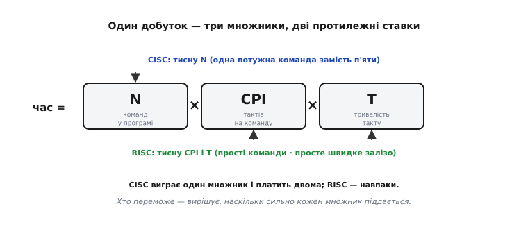
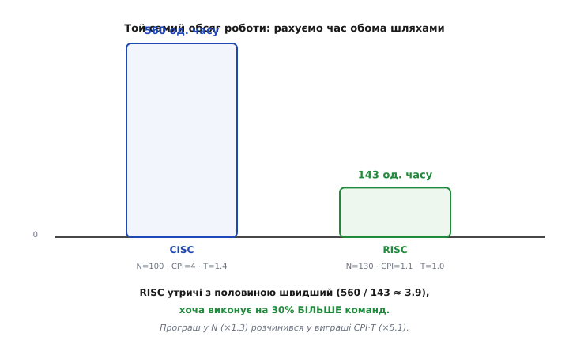
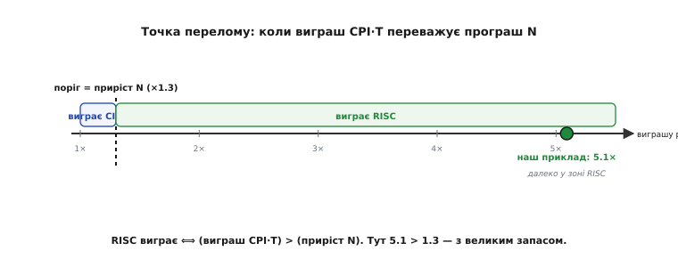
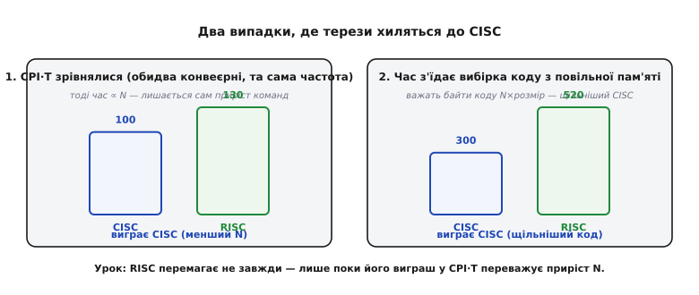

# 🧮 Залізний закон і точка, де RISC переганяє

У кроці ми вже записали залізний закон одним рядком і сказали словами: RISC виграє, бо його приріст `N` малий, а виграш `CPI·T` великий. Це правильно — але це твердження, а не доказ. Тут ми доведемо його **до кінця**: виведемо сам закон із першого принципу (а не приймемо на віру), витягнемо з нього **точну нерівність** — алгебраїчну умову, за якої RISC справді швидший, — прорахуємо її на конкретних числах, знайдемо **точку перелому** й, найважливіше, покажемо два реальні випадки, де нерівність **перевертається** і виграє вже CISC. Бо закон, який завжди дає ту саму відповідь, — це не закон, а гасло; сила залізного закону саме в тому, що він каже, **коли** відповідь інша.

## Звідки береться сам добуток

Почнімо з питання, простішого, ніж здається: що таке взагалі «час виконання програми» в тактах? Процесор живе тактами — короткими однаковими проміжками, у ритмі яких він робить крок за кроком. Отже, весь час програми — це просто **скільки тактів вона зайняла**, помножене на **тривалість одного такту**:

```
час = (усього тактів) × T
```

де `T` — тривалість такту (англ. *clock period*), обернена до [тактової частоти](topic:programming/clock-frequency): при 1 ГГц такт триває 1 нс, при 100 МГц — 10 нс. Це рівність за означенням, сперечатися нема з чим. Уся хитрість — у першому множнику: **скільки тактів** з'їдає програма?

Порахувати такти навпростець важко — їх мільярди. Але їх можна порахувати **непрямо**, через команди. Програма — це послідовність машинних [команд](topic:programming/isa); хай їх усього `N` (від *number of instructions* — скільки команд процесор реально виконав, щоб зробити роботу). Якби кожна команда коштувала рівно один такт, тактів було б теж `N`. Але команди коштують по-різному: проста додавання — один такт, множення — кілька, доступ до повільної пам'яті — і десяток. Тож уводимо **середню ціну команди в тактах**:

```
CPI = (усього тактів) / N
```

`CPI` (*cycles per instruction*, англ. «тактів на команду») — це просто означення: узяли всі такти, поділили на кількість команд, дістали середнє. Звідси одразу «усього тактів = N × CPI», і, підставивши в перший рядок, дістаємо весь закон:

```
час = N × CPI × T
```

Зверніть увагу, що ми нічого не **припустили** — ми лише двічі скористалися означеннями (такт як одиниця часу, CPI як середнє). Тому це співвідношення й зветься **залізним** (англ. *iron law of performance*): воно не модель і не наближення, яке колись зламається, а тотожність — воно **завжди** точне, за будь-якої архітектури, компілятора чи програми. Термін увів **Дуглас Кларк** (*Douglas W. Clark*) на основі спільного з **Джоелом Емером** (*Joel S. Emer*) кількісного аналізу процесорів; їхня засаднича стаття «A Characterization of Processor Performance in the VAX-11/780» вийшла 1984 року — і, що показово для нашої теми, характеризувала вона саме VAX, взірцевий CISC (усталений факт). Саме цей аналіз, за словами самого Кларка, згодом підштовхнув розвиток RISC — бо щойно ви бачите час як добуток трьох незалежних множників, стає видно: тиснути можна на будь-який з них, і вони **не рівноцінні**.

> 🔧 **Навіщо це.** Ця тотожність — не історія, а ваш робочий інструмент, коли прошивка «гальмує». Гальмо завжди сидить рівно в одному з трьох множників, і закон каже, у якому саме дивитися: `N` — забагато команд (кепський алгоритм, зайві копіювання в циклі); `CPI` — команди дорогі (доступ до повільної флеш зі станами очікування, ділення, плаваюча кома без апаратного блоку); `T` — низька частота (часто навмисне занижена заради економії струму). Розкладіть заміряний час на ці три числа — і побачите, який важіль тягнути. Оптимізувати алгоритм (`N`), коли насправді все впирається в `CPI` доступу до пам'яті, — марно згаяний час.

## Три множники — і чому вони не рівноцінні

Тепер найважливіше спостереження, без якого весь закон був би просто арифметикою. Три множники `N`, `CPI`, `T` **не незалежні одне від одного в межах архітектури** — коли ви міняєте набір команд, ви тягнете їх усі три разом, і в **протилежні** боки. Саме через цей зв'язок вибір RISC чи CISC і стає ставкою.


*Один добуток, три множники, дві протилежні ставки. CISC давить `N` (одна потужна команда замість кількох), але платить за це зростанням `CPI` (складну команду важче виконати за такт) і `T` (громіздке залізо не розігнати). RISC давить `CPI` (кожна команда проста, ~1 такт) і `T` (просте залізо на високій частоті), платячи зростанням `N` (простих команд треба більше). Виграє той, чия ставка вигідніша — а це вже питання чисел.*

Простежмо ці зв'язки як причинно-наслідкові ланцюжки, бо саме вони — суть.

**Ставка CISC — тиснути `N`.** Дай одну команду `ADD [m], R1` замість трьох (`LD`/`ADD`/`ST`) — і команд у програмі стане менше, `N` впаде. Логіка бездоганна: менше команд — менше роботи лічити. Але тепер простежте наслідки для інших двох. Складна команда сама лізе в пам'ять посеред обчислення, має різну довжину, потребує багатокрокового розкручування — тож виконати її за один такт неможливо, вона тягне кілька; отже `CPI` **росте**. А щоб таку команду взагалі декодувати, потрібне громіздке залізо з довгими ланцюгами логіки, а довгі ланцюги не дають підняти частоту; отже `T` теж **росте**. CISC виграє один множник ціною двох.

**Ставка RISC — тиснути `CPI` і `T`.** Роби кожну команду простою й однакової довжини. Тоді її видно декодувати миттєво, вона рівно проходить [конвеєр](topic:programming/pipeline) за один такт, і `CPI` падає майже до одиниці. Просте залізо — короткі ланцюги логіки — розганяється до високої частоти, тож `T` малий. Ціна одна: проста команда робить менше, тож щоб виконати ту саму роботу, команд треба **більше** — `N` росте. RISC свідомо програє один множник, щоб виграти два.

Ось де вся суперечка «мало простих чи багато складних» стискається в одне точне питання. Обидві сторони змінюють **добуток** `N × CPI × T`; питання лише, **чий множник зрушується сильніше**. Перепишімо це як пряме порівняння — і суперечка світоглядів перетвориться на нерівність, яку можна розв'язати.

## Виведення нерівності: коли RISC справді швидший

Візьмімо ту саму роботу — ту саму програму, той самий алгоритм — і виконаймо її двічі: раз на CISC, раз на RISC. Кожна машина має свою трійку множників. Позначмо їх індексами `c` і `r`:

```
час_CISC = Nc × CPIc × Tc
час_RISC = Nr × CPIr × Tr
```

RISC швидший — це просто означає, що його час менший:

```
Nr × CPIr × Tr  <  Nc × CPIc × Tc
```

Це вже відповідь, але в ній переплетено всі шість чисел, і нічого не видно. Розплетімо. Поділимо обидві частини на `час_RISC`... ні, зробімо інакше й прозоріше: зберімо в одному боці все, що стосується `N`, а в другому — все, що стосується `CPI·T`. Поділимо обидві частини нерівності на `Nc` і на `(CPIr × Tr)`. Знак `<` при діленні на додатні числа не міняється:

```
   Nr × CPIr × Tr        Nc × CPIc × Tc
  ─────────────────  <  ─────────────────
   Nc × CPIr × Tr        Nc × CPIr × Tr
```

Скоротімо. Ліворуч `CPIr × Tr` скорочується згори й знизу, лишається `Nr / Nc`. Праворуч `Nc` скорочується, лишається `(CPIc × Tc) / (CPIr × Tr)`. Дістаємо чисту, симетричну умову:

```
   Nr          CPIc × Tc
  ────    <    ───────────
   Nc          CPIr × Tr
```

І ось тут ховається вся суть теми — в одному рядку. Розгляньмо кожен бік окремо, бо кожен має ясний зміст.

**Лівий бік — `Nr / Nc` — це ціна простоти.** Наскільки більше команд RISC виконує за ту саму роботу. Якщо RISC потребує на 30% більше команд, це число 1.3. Це **програш** RISC — єдиний множник, у якому він поступається.

**Правий бік — `(CPIc × Tc) / (CPIr × Tr)` — це виграш простоти.** У скільки разів одна CISC-команда «дорожча» за одну RISC-команду в реальному часі (такти × тривалість такту). Якщо CISC-команда в середньому вимагає вчетверо більше тактів і йде на повільнішому такті, це число велике. Це **виграш** RISC.

Тепер нерівність читається однією фразою, і це найголовніше речення всієї вставки:

> **RISC швидший тоді й лише тоді, коли його приріст кількості команд (`Nr/Nc`) менший за його виграш у ціні команди (`CPIc·Tc / CPIr·Tr`).**

Інакше кажучи: те, що RISC **втрачає** на більшій кількості команд, має бути з надлишком **відіграно** тим, що кожна його команда дешевша. Порівнюємо два відношення — програш проти виграшу. Якщо виграш переважує програш, RISC перемагає; якщо ні — перемагає CISC. Ніякої магії, ніякої ідеології — чиста арифметика двох дробів.

Зверніть увагу, що ця форма ще й **розділила** те, що залежить від компілятора, і те, що залежить від заліза. Лівий бік `Nr/Nc` — це переважно про те, наскільки щільно **компілятор** укладає роботу в прості команди. Правий бік `CPIc·Tc / CPIr·Tr` — це про **мікроархітектуру**: як швидко залізо жує команду. Революцію RISC зробило саме емпіричне відкриття (див. [історію революції](root:embedded/risc-cisc/hist-risc-revolution.md)), що для типового коду лівий бік виходить **близьким до одиниці** (компілятор укладає щільно, приріст команд помірний), а правий бік — **великим** (складна команда справді втричі-вчетверо дорожча). Тобто в типовому випадку нерівність виконується з великим запасом. Але «в типовому» — не «завжди»; побачимо й винятки. Спершу — числа.

## Worked-приклад: рахуємо час обома шляхами

Візьмімо конкретні, правдоподібні числа. Вони відповідають класичній історичній розвилці: **не-конвеєризований мікрокодований CISC** (як ранні VAX-подібні машини, де складна команда справді розкручувалася багато тактів) проти **конвеєризованого RISC** (де проста команда йде майже за такт). Саме на цій розвилці RISC і переміг уперше.

**Умова.** Та сама програма. CISC: `Nc = 100` команд, `CPIc = 4` такти на команду, `Tc = 1.4` (умовних одиниці часу за такт — громіздке залізо, повільніший такт). RISC: `Nr = 130` команд (на 30% більше — ціна простих команд), `CPIr = 1.1` (майже такт на команду), `Tr = 1.0` (просте залізо, швидший такт).

Підставмо в закон напряму:

```
час_CISC = Nc × CPIc × Tc = 100 × 4 × 1.4 = 560 одиниць часу
час_RISC = Nr × CPIr × Tr = 130 × 1.1 × 1.0 = 143 одиниці часу
```

```
пришвидшення = час_CISC / час_RISC = 560 / 143 ≈ 3.9 раза
```


*Той самий обсяг роботи, порахований обома шляхами. Висота стовпчика — це весь добуток `N×CPI×T`. RISC виконує на 30% більше команд (130 проти 100), а виходить майже вчетверо швидшим — бо його програш у `N` (×1.3) потонув у виграші `CPI·T` (×5.1). Оце й є та «перемога простоти», яку крок описав словами, тепер у числах.*

Тепер перевірмо це нашою **нерівністю** — і побачимо ту саму відповідь під іншим кутом, що набагато повчальніше за голий підсумок часу:

```
лівий бік  (приріст N):        Nr / Nc          = 130 / 100        = 1.30
правий бік (виграш CPI·T):     (CPIc·Tc)/(CPIr·Tr) = (4×1.4)/(1.1×1.0) = 5.6 / 1.1 ≈ 5.09
```

```
умова RISC-перемоги:   1.30  <  5.09   ✓  (виконано з великим запасом)
```

Нерівність виконується не просто так, а **розгромно**: RISC мав відіграти лише коефіцієнт 1.30, а відіграв 5.09 — учетверо більше, ніж було треба. Ось чому підсумкове пришвидшення таке велике (3.9 ≈ 5.09/1.30). І ось перший важливий урок чисел: **перемога RISC тут не тонка й не крихка — вона з величезним запасом**. Саме тому революція RISC була не «на 10% краще в лабораторії», а очевидною й нездоланною: біднота мови коштувала дрібку `N`, а купувала кратний виграш у `CPI·T`.

## Точка перелому: скільки команд RISC може собі дозволити

Нерівність корисна не лише тим, що дає «так/ні», а тим, що показує **запас** — і межу, за якою запас вичерпується. Спитаймо навпаки: тримаючи виграш `CPI·T` тим самим (5.09), **скільки команд** RISC міг би виконувати, доки не зрівняється з CISC? Це і є **точка перелому** (англ. *break-even point*) — межа, де час обох машин однаковий.

Рівність настає, коли лівий бік доростає до правого:

```
   Nr*
  ────  =  5.09      ⟹      Nr* = Nc × 5.09 = 100 × 5.09 ≈ 509 команд
   Nc
```

Ось воно, число, що ставить усе на місце: **RISC зрівнявся б із CISC лише при 509 командах** проти 100 у CISC — тобто якби прості команди роздули програму більш ніж **уп'ятеро**. А реально роздули лише до 130 (×1.3). Відстань від 130 до 509 — це і є той величезний запас міцності, з яким RISC перемагає. Компілятор мав би писати абсурдно роздутий код — по п'ять RISC-команд на кожну CISC-команду в **середньому по всій програмі**, — щоб звести перевагу RISC нанівець. Такого не буває: реальний приріст, як ми бачили, ближчий до чверті-третини.


*Уся нерівність на одній осі. Вісь — виграш у ціні команди `(CPIc·Tc)/(CPIr·Tr)`. Пунктир — поріг, що дорівнює приросту команд `Nr/Nc` = 1.3: ліворуч від нього виграш замалий і перемагає CISC, праворуч — виграш переважує приріст і перемагає RISC. Наш приклад (зелена точка) стоїть на 5.1 — далеко в зоні RISC, тобто з майже чотирикратним запасом над порогом.*

Ця картина, до речі, пояснює, **чому** RISC свого часу міг дозволити собі бути «марнотратним» щодо кількості команд. Запас такий великий, що навіть істотне зростання `N` його не з'їдає. Але — і це чесна межа — реальні цифри бувають і скромнішими за нашу історичну розвилку. Виміри на сучасних наборах (робота Селіо, Паттерсона й Асановича, 2016) дають для RISC-V RV64G приблизно **+16%** команд проти x86-64 і **+9%** проти ARMv8 — тобто `Nr/Nc` ближче до 1.1–1.16, ще менше за наші 1.3 (правдоподібно, за виміряними даними). Запас, отже, ще більший. А от правий бік — виграш `CPI·T` — у сучасних машинах уже **не** 5, і саме тут починається найцікавіше: випадки, де нерівність перевертається.

## Де нерівність перевертається — два чесні випадки

Закон був би підозрілим, якби завжди хвалив RISC. Тож знайдімо, де він **не** хвалить — де права частина всихає настільки, що приріст `N` перемагає виграш `CPI·T`, і швидшим стає CISC. Це не поразка теорії, а її сила: вона точно вказує умови.


*Два випадки, де терези хиляться до CISC. Ліворуч: обидві машини однаково добре конвеєризовані на однаковій частоті, тож `CPIc·Tc ≈ CPIr·Tr` — виграш простоти зникає, і час визначає сам `N`, де CISC із меншою кількістю команд перемагає. Праворуч: час програми з'їдає не обчислення, а вибірка байтів коду з повільної пам'яті — тоді важить щільність коду `N×розмір`, і компактніший CISC знову попереду. Обидва — прямі наслідки тієї самої нерівності.*

**Випадок перший: `CPI·T` зрівнялися.** Уявіть, що CISC теж навчився бути швидким — саме це й сталося з сучасним x86, який усередині ріже команди на прості µops і жене їх RISC-подібним конвеєром на високій частоті. Тоді `CPIc·Tc` стає майже рівним `CPIr·Tr`, і правий бік нерівності падає до **≈ 1**. Підставмо в умову:

```
   Nr                             130
  ────   <   ≈ 1     ⟹    але    ───  = 1.30   >   1     ✗
   Nc                             100
```

Нерівність **не виконується**. Якщо ціна команди в обох однакова, лишається сам добуток на `N`, а тут CISC із меншими 100 командами випереджає RISC зі 130. Формально: `час_CISC = 100×1×1 = 100`, `час_RISC = 130×1×1 = 130` — виграє CISC на ті самі 30%, що становлять приріст команд. **Ось глибша причина, чому x86 узагалі вижив.** Він не намагався перемогти RISC у його грі з простими командами — він зробив свій `CPI·T` таким самим малим (через внутрішній RISC), і тоді його історична перевага в `N` (щільний код) знову запрацювала. Не «CISC кращий», а «коли забрати виграш RISC у ціні команди, лишається перевага CISC у кількості». Тому й межа між філософіями розмилася: обидві сторони підтягли свій слабкий множник, і різниця стиснулася до самого `N`.

**Випадок другий: час з'їдає вибірка коду, а не обчислення.** Досі ми мовчки вважали, що `CPI` відбиває обчислення. Але на дрібному чипі з повільною флеш-пам'яттю буває, що процесор більшість часу не рахує, а **чекає, поки з пам'яті приїде наступна команда**. Тоді вузьке місце — не АЛП, а пропускна здатність вибірки коду, і важить уже не кількість команд, а кількість **байтів коду**, які треба протягти з пам'яті: `N × (середній розмір команди)`. А тут CISC зі своїм щільним кодом виграє по обох осях — і команд менше, і кодуються вони компактніше.

Прикиньмо. Хай CISC: 100 команд по 3 байти в середньому = 300 байтів коду. Класичний RISC із суто 32-бітними командами: 130 команд по 4 байти = 520 байтів. Якщо час пропорційний байтам вибірки:

```
час_CISC ∝ 100 × 3 = 300
час_RISC ∝ 130 × 4 = 520      ⟹   CISC швидший (менше байтів тягти)
```

Тут перемагає CISC — йому треба вибирати з пам'яті на ~42% менше байтів коду, ніж RISC. Це не абстракція, а **точна причина**, чому в темі з'явилися стиснуті набори команд. RISC відповів саме на цю загрозу: Thumb-2 в ARM і розширення C у RISC-V кодують часті команди 16 бітами, повертаючи щільність. З тими самими 130 командами, але вже по ~2.5 байти: `130 × 2.5 = 325` — майже наздогнали CISC, **не** втративши простоти декодування. За виміряними даними (той самий аналіз 2016 року) стиснутий RV64GC виявляється навіть **щільнішим** за x86-64 — тягне на 8% менше динамічних байтів коду. Тобто RISC залатав саме ту дірку в нерівності, крізь яку CISC міг би прослизнути.

**Межовий випадок третій, тонший: крихітне `N`.** Здавалося б, при зовсім малій роботі — виконати дію один раз — має спрацювати проти RISC той факт, що він робить 3 команди там, де CISC 1. Прорахуймо чесно, і побачимо несподіване. Одна дія `m = m + R1`: CISC — одна команда, RISC — три (`LD`/`ADD`/`ST`):

```
час_CISC = 1 × CPIc × Tc = 1 × 4 × 1.4 = 5.6
час_RISC = 3 × CPIr × Tr = 3 × 1.1 × 1.0 = 3.3      ⟹   RISC усе одно швидший
```

RISC перемагає навіть тут — бо його виграш у ціні команди (кожна дешева) переважує потрійний програш у кількості. Тобто на **самій арифметиці** крихітне `N` нерівність не перевертає. Де ж воно кусає насправді? У тому, чого проста модель `CPI` не бачить: **конвеєр не встигає розігнатися**. Ми виводили `CPIr ≈ 1` для сталого потоку, але це середнє по довгому циклу — воно передбачає, що конвеєр заповнений і щотакту завершується команда. На трьох командах поспіль конвеєр іще наповнюється (перші команди платять за «заповнення труби»), і ефективний `CPIr` тут не 1.1, а помітно більший — ближчий до глибини конвеєра. Тобто справжня межа для крихітного `N` — не в самому законі, а в тому, що припущення `CPIr ≈ 1` **тимчасово хибне**, доки конвеєр холодний. Це чесне уточнення: перелом на малому `N` реальний, але його механізм — не програш у кількості команд, а недосяжність `CPI ≈ 1` без розігріву.

> 🔧 **Навіщо це.** Ці три випадки — не екзотика, а прямі підказки для прошивки. Перший (`CPI·T` зрівнялися) каже: не переносьте наосліп інтуїцію «RISC завжди швидший» на порівняння двох сучасних добре конвеєризованих ядер — там вирішує вже `N` і якість компілятора, а не буква ISA. Другий (вибірка коду) каже: на чипі з повільною флеш і без кешу вмикайте стиснутий набір (Thumb-2 — типово ввімкнений; на Cortex-M іншого й нема) і дбайте про розмір коду в гарячому циклі — бо там `CPI` роздуває саме вибірка, а не обчислення. Третій (холодний конвеєр) каже: дуже короткі, часто викликані функції платять за розігрів непропорційно — тому inline гарячих дрібних функцій окупається не «магічно», а тому, що прибирає повторне наповнення конвеєра.

## Що з усього цього виносимо

Складімо весь ланцюг в одну думку. Ми вивели залізний закон `час = N × CPI × T` не як формулу для заучування, а як тотожність за означенням — і саме тому їй можна довіряти беззастережно. З неї ми витягли єдину нерівність, що вирішує все протистояння:

```
   Nr          CPIc × Tc
  ────    <    ───────────      ⟺   RISC швидший
   Nc          CPIr × Tr
```

І прочитали її як зважування: **програш у кількості команд проти виграшу в ціні команди**. На історичних числах виграш переважив програш майже вчетверо (5.09 проти 1.30), тому RISC переміг не тонко, а з розгромним запасом — до перелому було б аж 509 команд проти реальних 130. А тоді ми знайшли, де запас усе-таки вичерпується: коли CISC підтягує свій `CPI·T` до RISC-рівня (і лишається сама перевага `N` — так вижив x86), і коли час програми визначає вже не обчислення, а вибірка байтів коду (і виграє щільніший код — так народилися стиснуті набори).

Найглибше тут те, що всі три великі сюжети теми — перемога RISC, виживання x86 через внутрішній RISC, поява Thumb-2 і RISC-V C — це **не три окремі історії, а один закон під трьома кутами**. Кожен із них — це та сама нерівність, у якій змінюється, який множник домінує. Залізний закон не пророкує «RISC завжди перемагає»; він каже точніше й чесніше: **перемагає той, у кого добуток трьох множників менший, — а який множник тягнути, диктує конкретне залізо й конкретний код.** Оце й є справжня причина, чому питання «хто переміг» не має однослівної відповіді — і чому воно врешті звелося до однієї внутрішньої одиниці роботи, простого швидкого кроку, до якого обидві філософії дійшли з різних боків.
