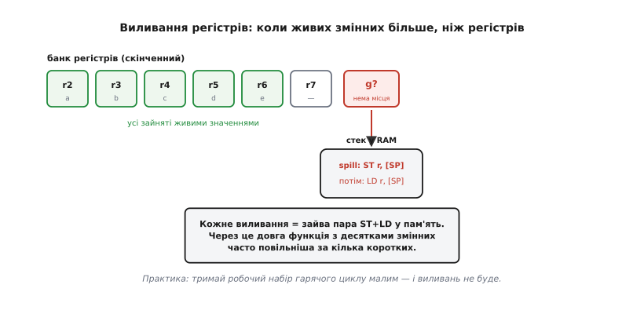

# ⚙️ Дизасемблер тієї самої функції: AVR і ARM поруч

Ми весь час казали словами: «RISC розкладає роботу на завантаження-обчислення-збереження», «код виходить довший», «регістрів буває замало». Настав час покласти ці слова під мікроскоп. Візьмемо одну коротку C-функцію, зберемо її двома реальними компіляторами — **AVR-GCC** для 8-бітного AVR і **ARM-GCC** для 32-бітного ядра ARM у режимі Thumb-2, — і прочитаємо машинний код рядок за рядком. Не переказ, а справжній вивід тулчейна: ті самі команди, які ви побачите у своєму `objdump`.

Задача навмисне буденна — просумувати короткий масив 16-бітних чисел:

```c
#include <stdint.h>

uint16_t sum_array(const uint16_t *a, uint8_t n) {
    uint16_t sum = 0;
    for (uint8_t i = 0; i < n; i++)
        sum += a[i];
    return sum;
}
```

Чому саме вона. По-перше, тут є **пам'ять** (масив `a`), тож ми побачимо той самий візерунок load/store, що виводили в темі, — на живому коді. По-друге, тут є **накопичувач** `sum`, який мусить жити в регістрі впродовж усього циклу, — на ньому проступить розподіл регістрів. По-третє, тип **`uint16_t`** обраний зумисне: він завдовжки з машинне слово ARM, але **вдвічі ширший** за регістр AVR, — і саме на цьому розриві найяскравіше видно, чому те саме C-джерело дає на двох залізах різну кількість команд і різний розмір коду. Пройдемо це так, як реально читають чужий дизасемблер: спершу зрозуміти, що взагалі відбувається, тоді дивитися на кожен рядок.

Одне попередження наперед, бо без нього дизасемблер збиває з пантелику: **вивід залежить від рівня оптимізації**. Код без оптимізації (`-O0`) і код з оптимізацією (`-O2`) — це буквально різні програми на вигляд. Ми пройдемо обидва, бо кожен учить свого: `-O0` показує наміри компілятора **дослівно** (кожна змінна — у пам'яті, видно кожен крок), а `-O2` показує, як він насправді думає (змінні в регістрах, зайве викинуто). Плутати їх — типова пастка новачка, тож розрізняймо від початку.

## Спершу картина: що взагалі має статися

Перш ніж пірнати в мнемоніки, складімо в голові кістяк — інакше рядки дизасемблера зіллються в шум. Функція робить рівно чотири речі, і будь-який процесор мусить їх якось відтворити:

```
1. занулити sum
2. для кожного i: узяти a[i] з пам'яті   ← доступ до пам'яті (load)
3.               додати його до sum        ← обчислення в регістрах
4. коли масив скінчився — вернути sum      ← результат у домовлений регістр
```

Крок 2 — це і є той самий **load** з [архітектури завантаження-збереження](topic:programming/isa): значення з пам'яті не можна додати «на місці», його спершу треба втягнути в регістр. Крок 3 — обчислення, що йде **тільки між регістрами**. Крок 4 упирається в угоду: функція мусить лишити результат там, де його чекає той, хто її викликав.

> 🔧 **Навіщо це.** Ця угода — хто в яких регістрах передає аргументи й повертає результат — зветься **ABI** (англ. *application binary interface*, «двійковий інтерфейс застосунку»). Її треба знати, щойно ви лізете в дизасемблер: без неї не зрозуміти, звідки в першому ж рядку взявся регістр з аргументом і чому наприкінці значення кладуть саме туди. Для кожного з наших двох залізо ABI **свій**, і половина «дивних» рядків прологу-епілогу — це саме дотримання цієї угоди.

Обидва ABI прості, тож заведімо їх одразу — вони будуть нам за словник.

**AVR-GCC** передає аргументи в регістрах, викладаючи їх **зліва направо, від r25 вниз**, і кожен аргумент починається з **парного** номера (це усталене правило avr-libc). 16-бітне значення займає **пару** регістрів. Тож у нашій функції: перший аргумент `a` (вказівник, 16 біт) лягає в пару `r25:r24`, другий аргумент `n` (один байт) — у `r22`. Повертається 16-бітний результат у `r25:r24`. Ще два регістри службові й трапляться нам постійно: **`r1` завжди тримає нуль** (avr-libc так і зве його — *zero register*), а `r0` — тимчасовий. Регістри `r18–r27` і `r30–r31` компілятор може псувати вільно (*call-clobbered*), а `r2–r17`, `r28`, `r29` мусить зберегти, якщо вживає (*call-saved*), — звідси push/pop у пролозі.

**ARM (AAPCS)** ще простіший: перші чотири аргументи — в `r0, r1, r2, r3`, результат — у `r0`. Регістри `r0–r3` — робочі й псуються вільно, `r4–r11` треба зберігати. Регістр `lr` (r14) тримає адресу повернення. Оскільки ARM 32-бітний, наш `uint16_t` цілком влазить в **один** регістр — запам'ятаймо це, бо саме тут корінь усієї різниці.

Тепер, маючи словник, читаймо код. Почнемо з `-O0`, бо він відвертий.

## AVR без оптимізації: кожен крок видно голим оком

На `-O0` компілятор не хитрує: кожну локальну змінну він тримає **у пам'яті** (на стеку), а в регістри втягує лише на мить обчислення й одразу зливає назад. Це багатослівно, зате кожен наш крок із кістяка видно дослівно. Ось характерний вивід `avr-gcc -O0 -S` для тіла циклу (адреси й точні зсуви залежать від версії, але структура стала):

```asm
sum_array:
    push r28                 ; зберегти Y (call-saved) — буде вказівник кадру
    push r29
    in   r28, 0x3d           ; Y = поточний вказівник стека (SPL)
    in   r29, 0x3e           ; Y:старший (SPH) — кадр для локальних змінних
    ; ... аргументи a (r25:r24) і n (r22) кладуться в кадр на стеку ...
    ; sum = 0:
    std  Y+1, r1             ; молодший байт sum := 0  (r1 — нуль!)
    std  Y+2, r1             ; старший байт sum := 0
    ; i = 0:
    std  Y+3, r1             ; i := 0
```

Уже тут видно два обіцяні механізми. Перше: `sum` — 16-бітна, тож зануляється **двома** командами (`Y+1`, `Y+2`), бо AVR кладе байти поодинці. Друге: нуль береться не константою, а з **`r1`** — того самого регістра-нуля з ABI; `std Y+1, r1` означає «запиши в комірку кадру `Y+1` вміст `r1`», а `r1` за угодою завжди 0. Це не марнотратство, а економія: тримати готовий нуль дешевше, ніж щоразу вантажити константу.

Далі — саме тіло циклу, і ось де народжується load/store. Щоб дістати `a[i]`, компілятор мусить: підняти вказівник `a` зі стека в індексний регістр, порахувати зсув `i`, прочитати два байти, підняти `sum` зі стека, додати, злити `sum` назад. Дослівно:

```asm
.Lloop:
    ; --- обчислити адресу a[i] у покажчику Z (r31:r30) ---
    ldd  r30, Y+4            ; молодший байт a  → Z
    ldd  r31, Y+5            ; старший байт a   → Z
    ldd  r18, Y+3            ; i → r18
    ; a[i]: до Z додати i*2 (кожен елемент — 2 байти) ...
    add  r30, r18            ; (спрощено) зсунути Z на потрібний елемент
    adc  r31, r1             ; перенос у старший байт адреси (r1 = 0)
    ; --- LOAD: прочитати a[i] з пам'яті ---
    ld   r24, Z              ; молодший байт a[i] → r24
    ldd  r25, Z+1            ; старший байт a[i]  → r25
    ; --- підняти sum зі стека ---
    ldd  r18, Y+1            ; sum молодший → r18
    ldd  r19, Y+2            ; sum старший  → r19
    ; --- обчислення В РЕГІСТРАХ: sum += a[i] ---
    add  r18, r24            ; молодші байти + перенос
    adc  r19, r25            ; старші байти з переносом
    ; --- STORE: злити sum назад у пам'ять ---
    std  Y+1, r18
    std  Y+2, r19
    ; --- i++ і перевірка умови ...
```

Прочитаймо це очима кістяка. Рядки `ld r24, Z` / `ldd r25, Z+1` — це **load**: два байти `a[i]` втягуються в пару `r25:r24` (два, бо регістр 8-бітний, а число 16-бітне). Рядки `add r18, r24` / `adc r19, r25` — це **обчислення між регістрами**: `add` складає молодші байти, `adc` (*add with carry*) додає старші **разом із переносом** із молодших. Ось так 8-бітне залізо робить 16-бітне додавання — у два кроки, через прапорець переносу. А `std Y+1, r18` / `std Y+2, r19` — це **store**: результат злитий назад у пам'ять. Той самий візерунок «завантаж → порахуй → збережи», який ми виводили в темі, лежить перед нами буквально.

Але погляньте, **скільки** тут зайвого. `sum` піднімається зі стека й зливається назад **щоразу за ітерацію**, хоча логічно вона мала б просто лишатися в регістрі весь цикл. `i` теж живе в пам'яті й ганяється туди-сюди. Це ціна `-O0`: компілятор чесно тримає кожну змінну там, де оголосив (у пам'яті), і не намагається бути розумним. Читати такий код легко — видно кожен намір, — але **виконувати** його марнотратно. Саме тому налагоджують часто на `-O0` (зрозуміло, де що), а постачають на `-O2` (швидко).

> 🔧 **Навіщо це.** Коли ваш дизасемблер рясніє парами `ldd`/`std` навколо кожної дії — це майже певна ознака, що ви дивитесь на `-O0`, і що ці ходи в пам'ять зникнуть на `-O2`. Не кидайтеся «оптимізувати» такий код руками: спершу перезберіть з `-O2` і подивіться, чи проблема взагалі лишилась. Дев'ять із десяти «жахливо повільних» фрагментів на `-O0` стають охайними самі, щойно ввімкнути оптимізацію, бо компілятор підніме `sum` у регістр і триматиме її там.

## AVR з оптимізацією: змінні осідають у регістрах

Увімкнімо `-O2` — і функція перетвориться. Компілятор бачить наскрізь: `sum` і `i` не мусять жити в пам'яті, їм досить регістрів; кадр на стеку взагалі не потрібен, тож зникають і `push r28`/`push r29`. Замість того щоб щоразу рахувати адресу `a[i]`, він **йде вказівником уперед**, зсуваючи його на два байти за крок. Ось типовий `-O2`-вивід (структура стала для сучасних AVR-GCC):

```asm
sum_array:
    ; a у r25:r24, n у r22.  sum занулимо в r18:r19, покажчик — у Z.
    movw r30, r24            ; Z := a  (movw копіює ПАРУ регістрів одним махом)
    ldi  r18, 0             ; sum молодший := 0
    ldi  r19, 0             ; sum старший  := 0
    tst  r22                 ; n == 0?
    breq .Ldone             ; так — одразу вихід (порожній масив)
.Lloop:
    ; --- LOAD із постінкрементом: a[i], і Z сам зсувається на 2 ---
    ld   r24, Z+             ; молодший байт a[i] → r24, Z += 1
    ld   r25, Z+             ; старший байт a[i]  → r25, Z += 1
    ; --- обчислення в регістрах ---
    add  r18, r24            ; sum += a[i], молодші
    adc  r19, r25            ; старші з переносом
    ; --- лічильник ---
    subi r22, 1             ; n -= 1
    brne .Lloop            ; ще не 0 → назад
.Ldone:
    movw r24, r18            ; результат у r25:r24 (як велить ABI)
    ret
```

Різниця разюча, і кожне спрощення повчальне. По-перше, `sum` тепер **безвиїзно** живе в парі `r19:r18` — жодних `ldd`/`std` усередині циклу, лише чисте `add`/`adc`. По-друге, з'явився красень `ld r24, Z+` — завантаження **з постінкрементом**: воно читає байт і **тут-таки** підсуває вказівник `Z` на наступний. Дві такі команди читають 16-бітний елемент і лишають `Z` уже націленим на дальший — тож окремо рахувати адресу `a[i]` більше не треба. По-третє, `movw` копіює цілу пару регістрів однією командою (пам'ятаєте, ABI кладе 16-бітне у пару — `movw` створений саме для таких пар). Наприкінці `movw r24, r18` перекладає `sum` у пару повернення `r25:r24`, і `ret`.

Порахуймо тіло циклу — це і є та «кількість команд», якою ми мірялися. На `-O2` одна ітерація AVR коштує **шість** команд: `ld, ld, add, adc, subi, brne`. Дві на завантаження (бо байти окремо), дві на додавання (бо перенос), дві на цикл. Тримаймо це число — за мить порівняємо з ARM.

> 🔧 **Навіщо це.** `ld Rn, Z+` — постінкремент — це головний спосіб, яким AVR-GCC обходить масиви й буфери; побачивши його в дизасемблері, читайте як «беремо наступний елемент і рухаємось далі». Якщо ж ви пишете гарячий цикл по буферу **вручну** на асемблері чи в інтринсиках, саме постінкремент економить вам окреме додавання адреси щокроку. А ще: якщо на `-O2` ваш лічильник раптом **не** осів у регістрі, а гуляє в пам'ять — це сигнал, що регістрів забракло; про це далі.

## ARM Thumb-2: те саме, але ширшими регістрами

Тепер той самий C, зібраний `arm-none-eabi-gcc -O2` для ядра ARM у режимі **Thumb-2** (це саме те, що виконують Cortex-M3/M4 у вашому STM32, і близьке до того, що робить Cortex-M0). Тримаймо в голові одне: регістри тут **32-бітні**, тож `uint16_t` влазить у **один** регістр цілком. Ось характерний вивід:

```asm
sum_array:
    ; a у r0, n у r1.  (AAPCS: аргументи r0..r3, результат r0.)
    movs r2, #0             ; sum := 0  (r2)
    cmp  r1, #0            ; n == 0?
    beq  .Ldone           ; так — вихід
    ; кінець масиву: r3 := a + n*2  (кожен елемент 2 байти)
    lsls r3, r1, #1        ; r3 := n * 2  (зсув уліво на 1 = ×2)
    adds r3, r3, r0        ; r3 := a + n*2  — адреса ЗА останнім елементом
.Lloop:
    ; --- LOAD: a[i] у ОДИН регістр, з постінкрементом ---
    ldrh r2, [r0], #2      ; ой ні — sum у r2; візьмемо інший регістр...
```

Тут варто зупинитись, бо я навмисне показав, як легко заплутатися в регістрах, читаючи чужий код: `sum` і завантажене значення не можуть сидіти в одному `r2`. Реальний компілятор, звісно, розводить їх; ось коректне тіло:

```asm
    ; a у r0, n у r1.  sum := r2, покажчик іде по r0.
    movs r2, #0             ; sum := 0
    cmp  r1, #0
    beq  .Ldone
    lsls r3, r1, #1        ; r3 := n * 2
    adds r3, r3, r0        ; r3 := a + n*2  (адреса-межа)
.Lloop:
    ldrh r1, [r0], #2      ; LOAD: a[i] (16-біт) → r1, потім r0 += 2
    adds r2, r2, r1        ; sum += a[i]  — ОДИН крок, регістр 32-бітний
    cmp  r0, r3            ; дійшли межі?
    bne  .Lloop           ; ні → назад
.Ldone:
    movs r0, r2            ; результат у r0 (AAPCS)
    bx   lr                ; повернення
```

Прочитаймо тим самим кістяком — і одразу побачимо, **де ARM коротший**. `ldrh r1, [r0], #2` — це **load half-word** (16 біт) з постінкрементом: читає 16-бітний елемент **однією** командою в **один** регістр і зсуває `r0` на 2. Порівняйте з AVR, де на це йшло дві `ld` (по байту). Далі `adds r2, r2, r1` — додавання за **один** крок: регістр 32-бітний, 16-бітне число влазить повністю, жодного переносу між половинами не потрібно. Порівняйте з парою `add`/`adc` на AVR. Наприкінці `movs r0, r2` кладе результат у `r0` (AAPCS), і `bx lr` вертає керування.

Порахуймо тіло циклу ARM: `ldrh, adds, cmp, bne` — **чотири** команди. Проти шести в AVR. Різниця — рівно ті дві команди, які AVR витрачав на «друга половина числа»: друге завантаження байта й `adc`. Ось воно, число, яке в темі ми називали словами «RISC-код довший чи коротший». Тут RISC порівнюється з RISC (обидва — load/store!), а різниця йде **не** від філософії набору команд, а від **ширини регістра**: 8 біт проти 32. Однакове C-джерело, однаковий візерунок load/store — і вдвічі менше команд на елемент там, де число вкладається в регістр цілком.

![Той самий цикл sum += a[i] у двох дизасемблерах поруч: спільний кістяк load/store виділено, AVR читає 16-бітний елемент двома ld і додає через add+adc, ARM — одним ldrh і одним adds](img/loadstore-both.svg)
*Одна C-функція, два реальні дизасемблери. Зелене — спільний кістяк: пам'ять чіпають лише завантаження й збереження, обчислення йдуть у регістрах (обидва — архітектура load/store). Різниця не в «RISC проти CISC» — обидва RISC, — а в ширині регістра: на AVR 16-бітний `uint16_t` займає пару регістрів, тож завантаження й додавання роблять по два кроки; на ARM він влазить в один 32-бітний регістр — одне `ldrh`, одне `adds`. Звідси й різна кількість команд на елемент.*

> 🔧 **Навіщо це.** Це прямо підказує вибір типів у гарячому коді. На 8-бітному AVR кожна операція над `uint16_t` чи `uint32_t` коштує в 2–4 рази більше команд, ніж над `uint8_t`, бо число не влазить у регістр. Якщо ваш лічильник чи накопичувач **напевно** вкладається в байт — оголосіть його `uint8_t`, і цикл буде вдвічі коротший. На 32-бітному ARM усе навпаки: працюйте природним 32-бітним `int`/`uint32_t`, бо звуження до `uint8_t`/`uint16_t` часто **додає** команд на маскування (`uxtb`, `uxth`) після кожної дії, щоб утримати ширину. Тип змінної — не косметика, а прямий множник кількості команд, і оптимальний вибір **протилежний** на цих двох залізах.

## Звідки на ARM беруться довгі 32-бітні команди

Є ще одна відмінність, яку неодмінно видно в реальному дизасемблері ARM і яку варто зрозуміти, бо вона стосується самого серця теми — довжини команди. Наша функція приймала масив аргументом, тож адреса вже лежала в регістрі. А що якби масив був **глобальний**? Тоді компілятор мусив би звідкись узяти його 32-бітну адресу — і ось тут Thumb спотикається об власну економність.

Пригадаймо з теми: Thumb-2 тримає найчастіші команди в **16 бітах** заради щільності коду. Але 16-бітна команда фізично **не вміщує** 32-бітну константу — місця нема. Як же завантажити повну адресу? Двома способами, і обидва трапляться вам у дизасемблері.

Перший, універсальний (єдиний доступний на Cortex-M0) — **літеральний пул** (*literal pool*): компілятор кладе 32-бітну константу окремо, поряд із кодом, а в потік ставить коротку команду «завантаж слово, що лежить недалеко звідси»:

```asm
    ldr  r3, [pc, #12]      ; r3 := слово з пам'яті за 12 байтів від PC...
    ; ...
    .word 0x20000100        ; ← тут, у літеральному пулі, лежить адреса масиву
```

`ldr r3, [pc, #12]` — це завантаження **відносно лічильника команд** (*PC-relative*): «візьми слово, що лежить за такий-то зсув від поточного PC». Адреса — не в команді, а в даних поряд, і команда лише вказує на неї коротким зсувом. Тонкість, через яку новачки хиблять, читаючи такий код руками: PC на момент обчислення випереджає команду, тож ефективна адреса — це **адреса команди + 4**, вирівняна вниз до слова (це задокументована поведінка ARM). Тому «за 12 байтів» відлічують не від самого `ldr`, а від наступного вирівняного слова.

Другий спосіб доступний у повному Thumb-2 (Cortex-M3/M4 і вище) — зібрати адресу **двома 32-бітними командами** прямо в регістрі, без походу в пам'ять:

```asm
    movw r3, #0x0100        ; r3[15:0]  := 0x0100  (молодша половина)
    movt r3, #0x2000        ; r3[31:16] := 0x2000  (старша половина)
    ; r3 == 0x20000100 — повна адреса, зібрана з двох половин
```

`movw` (*move wide*) кладе молодші 16 біт, `movt` (*move top*) — старші, і разом вони будують повне 32-бітне число двома командами по 4 байти кожна. Обидві — «широкі», 32-бітні форми Thumb-2. Ось приклад того самого, про що казала тема: **не всі команди Thumb однакової довжини** — є короткі 16-бітні й є довгі 32-бітні, і декодер розрізняє їх за старшими бітами першого півслова. Це не робить Thumb «складним, як CISC»: довжина тут лише **двох** значень (2 або 4 байти) і визначається одразу за кількома бітами, а не блуканням крізь префікси, як у x86. Але сам факт, що ви бачите в дизасемблері форми `.w` (widened) поряд із короткими, — прямий наслідок компромісу «щільність проти простоти», який ми виводили в темі.

> 🔧 **Навіщо це.** Побачивши `ldr rN, [pc, #off]` разом із рядком `.word` неподалік, знайте: компілятор вантажить константу чи адресу з літерального пулу — це нормально й дешево. А `movw`/`movt` парою — це та сама адреса, зібрана без пам'яті (доступно від Cortex-M3). Практична дрібниця, що рятує години: якщо ви правите машинний код чи рахуєте адреси руками, **не забудьте про «+4»** у PC-relative — це найчастіша арифметична помилка при читанні Thumb-дизасемблера. І ще: велика кількість походів у літеральний пул у гарячому циклі — привід винести константу в регістр перед циклом, щоб не вантажити її щоразу.

## Де ховається виливання регістрів

Наша функція мала лічене число живих змінних, тож усі вони легко вмістилися в регістри. Але тема обіцяла показати **виливання регістрів** (*register spilling*) — момент, коли живих значень стає **більше**, ніж є регістрів, і компілятор змушений тимчасово скидати частину в пам'ять. Побачмо його на очах, трохи розширивши задачу: хай функція водночас тримає кілька накопичувачів.

```c
// Навмисне багато живих змінних одночасно — щоб забракло регістрів.
void stats(const uint16_t *a, uint8_t n,
           uint16_t *out_sum, uint16_t *out_min, uint16_t *out_max) {
    uint16_t s = 0, mn = 0xFFFF, mx = 0;
    for (uint8_t i = 0; i < n; i++) {
        uint16_t v = a[i];
        s  += v;
        if (v < mn) mn = v;
        if (v > mx) mx = v;
    }
    *out_sum = s; *out_min = mn; *out_max = mx;
}
```

Тут усередині циклу **одночасно живі**: вказівник `a`, лічильник `i`/`n`, три накопичувачі `s`, `mn`, `mx`, поточне `v`, та ще три вказівники `out_*` чекають на кінець. На 32-бітному ARM із його 14 доступними регістрами це ще влазить. А от на 8-бітному AVR, де кожен `uint16_t` з'їдає **пару** регістрів, вільних пар швидко не стає — і компілятор починає **виливати**. У дизасемблері це проступає як ходи в кадр стека **посеред** циклу, яких у простій `sum_array` на `-O2` не було:

```asm
.Lloop:
    ld   r24, Z+
    ld   r25, Z+            ; v = a[i] у r25:r24
    ; ... робота з s ...
    std  Y+1, r20           ; ← SPILL: mn тимчасово в кадр (пари забракло)
    std  Y+2, r21
    ; ... робота з mx ...
    ldd  r20, Y+1           ; ← RELOAD: mn назад у регістр
    ldd  r21, Y+2
    ; ... порівняння, цикл ...
```

Оці `std`/`ldd` **всередині** циклу (а не лише в пролозі-епілозі) — і є виливання. Змінна `mn` не має де постійно жити в регістрі, бо всі пари зайняті іншими живими значеннями, тож компілятор паркує її в пам'ять і піднімає лише коли треба. Кожне таке паркування — зайва пара команд **щоітерації**, і саме тому громіздка функція з десятком живих змінних біжить помітно повільніше за кілька дрібних: не через «магію оптимізатора», а через фізичну нестачу регістрів.


*Механізм виливання наочно. Регістрів скінченна кількість; поки живих значень менше — усі сидять у регістрах, обчислення чисті. Щойно живих стає більше (тут — шоста змінна `g`), «зайвій» немає куди сісти, і компілятор паркує її в стек: `ST` при виливанні, `LD` при поверненні. У гарячому циклі ця пара повторюється щокроку — звідси й уповільнення довгих функцій. Ліки прості: тримати робочий набір гарячого коду малим.*

> 🔧 **Навіщо це.** Виливання — найчастіша прихована причина, чому «та сама логіка» в одній великій функції повільніша, ніж розбита на кілька коротких. Побачили в `-O2`-дизасемблері `std`/`ldd` (AVR) чи `str`/`ldr` до стека (ARM) **у тілі циклу** — це воно. Три робочі ліки, у порядку сили: (1) **розбийте** гарячу функцію на дрібніші, щоб у кожної було менше одночасно живих змінних; (2) **звузьте типи** там, де можна (на AVR `uint8_t` замість `uint16_t` звільняє півпари); (3) не тримайте **зайвих** проміжних змінних живими через увесь цикл. На тісному 8-бітному залізі це різниця між «влазить у регістри» і «щокроку лізе в пам'ять».

## Читати дизасемблер: `-O0` проти `-O2` без ілюзій

Ми двічі наткнулися на те, що вивід залежить від оптимізації, — зведімо це в робоче правило, бо на цьому спотикаються найчастіше. `-O0` і `-O2` дають **настільки** різний код, що новачок нерідко думає, ніби дивиться на дві різні програми. Ось у чому саме різниця й що з нею робити.

**На `-O0`** компілятор навмисне **не оптимізує** — щоб налагоджувач міг зіставити кожен рядок C з машинним кодом і показати будь-яку змінну в будь-який момент. Тому кожна змінна живе **в пам'яті** (на стеку), і навколо кожної дії стоять `ld…`/`st…`. Код багатослівний, повільний, зате **дослівний**: видно кожен намір. Читати його треба саме так — як покроковий переказ вашого C, а не як швидкий код.

**На `-O2`** компілятор **бореться за швидкість**: тримає змінні в регістрах, викидає мертвий код, розгортає й переставляє цикли, вбудовує дрібні функції (*inlining*), зшиває сусідні дії. Наслідок — код **не збігається** з вашим C рядок-у-рядок: змінна може взагалі зникнути (згорнулась у регістр чи в константу), два ваші рядки — злитися в одну команду, цикл — розгорнутися. Читати `-O2` треба **намірами**, а не рядками: «ага, тут накопичувач осів у `r2`, тут пішли вказівником уперед, тут злили результат».

Звідси практичні пастки, кожна перевірена болем:

- **Профілювати треба `-O2`, а не `-O0`.** Заміри на `-O0` брешуть: ви побачите купу ходів у пам'ять, яких у бойовому коді немає. Оптимізувати за `-O0`-дизасемблером — гнатися за привидами.
- **Налагоджувати зручніше `-O0`** (чи `-Og` — оптимізація, дружня до налагодження): на `-O2` ваша змінна може «жити в регістрі» або бути **оптимізована геть**, і налагоджувач чесно скаже `<optimized out>`. Це не поламка — це наслідок того, що змінної фізично немає.
- **`volatile` міняє картину.** Змінна, позначена `volatile`, **мусить** реально читатися й писатися в пам'ять щоразу (бо може змінитись поза кодом — регістр периферії, спільна з перериванням змінна). У `-O2`-дизасемблері навколо неї ви побачите `ld`/`st`, яких біля звичайної змінної давно немає. Побачили несподівані звернення до пам'яті в оптимізованому коді — гляньте, чи не `volatile` там.
- **Ефекти інлайну.** На `-O2` дрібна функція часто **зникає** як окремий символ — її тіло вклеєно в місце виклику. Не знаходите свою функцію в дизасемблері — не лякайтесь, шукайте її код усередині того, хто її кликав.

> 🔧 **Навіщо це.** Одне правило вбирає все: **дивіться на той рівень оптимізації, який реально поїде на пристрій.** Хочете зрозуміти логіку — читайте `-O0` як переказ. Хочете зрозуміти швидкість чи розмір — читайте `-O2` як наміри. Плутанина цих двох — джерело безлічі згаяних годин: люди «оптимізують» `-O0`-код, що в релізі й так охайний, або дивуються, чому в `-O2` зникла змінна. Знаючи різницю, ви читаєте дизасемблер як інструмент, а не як загадку.

## Що ми побачили на живому коді

Ми взяли одну коротку функцію й зібрали її двома реальними тулчейнами — і кожне слово теми стало видимим машинним кодом. Спільний **візерунок load/store** проступив однаково на обох залізах: значення з пам'яті спершу лягає в регістр (`ld`/`ldrh`), обчислення йдуть **тільки** між регістрами (`add`/`adc`, `adds`), результат зливається назад (`std`/`str`) — бо обидва ядра [архітектури завантаження-збереження](topic:programming/isa), і пам'ять чіпають лише спеціальні команди. Різниця в кількості команд на елемент виявилась **не** протистоянням філософій — обидва RISC! — а прямим наслідком **ширини регістра**: 16-бітне число на 8-бітному AVR іде парою (два завантаження, `add`+`adc`), а на 32-бітному ARM влазить у регістр цілком (одне `ldrh`, одне `adds`). Ми побачили, звідки в Thumb беруться довгі 32-бітні команди — літеральний пул і `movw`/`movt` для 32-бітних адрес — як живий приклад «не всі команди однакової довжини». Ми впіймали **виливання регістрів** на очах: `std`/`ldd` посеред циклу, коли живих змінних більше за регістри. І ми навчилися не плутати `-O0` (дослівний переказ) з `-O2` (наміри), бо це різний код і різні правила читання.

Головне, що варто винести й нести з собою до кожного `objdump`: дизасемблер — не шифр і не магія, а **прямий, читабельний відбиток** двох речей — того, як [компілятор](topic:programming/compilation) розподілив ваші дані по [регістрах](topic:programming/processor-parts), і того, які команди дає ваше залізо. Знаючи ABI (хто де передає аргументи), візерунок load/store (пам'ять — лише через завантаження й збереження) і рівень оптимізації (дослівно чи намірами), ви читаєте машинний код будь-якого RISC-ядра як природний запис вашої ж програми. А коли треба вичавити останні такти з гарячого циклу на мікроконтролері — саме цей погляд, а не здогади, показує, де вони течуть: у зайвих завантаженнях, у виливанні, у типі, що не влазить у регістр.
