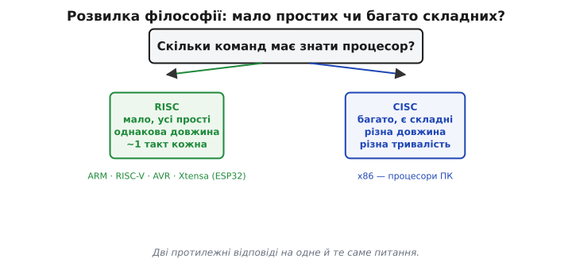
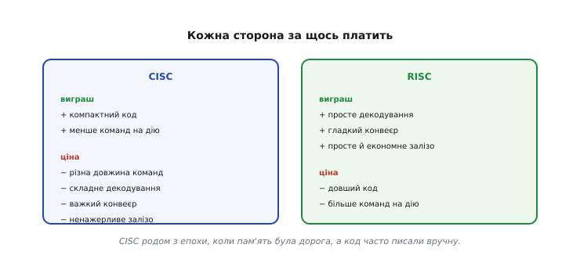
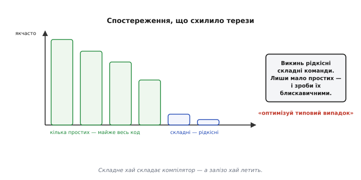
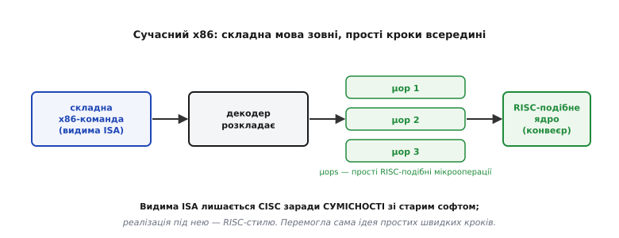
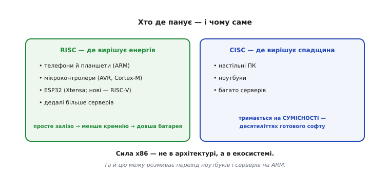

# RISC і CISC

Одна з найглибших розвилок у будові процесора стосується не швидкості й не розміру, а самої **філософії** його [мови — набору команд](topic:programming/isa). Питання просте на вигляд, але з далекосяжними наслідками: щоб процесор був швидким, йому краще знати **мало простих** команд чи **багато потужних**? Перша відповідь дістала назву **RISC** (*Reduced Instruction Set Computer*, англ. «комп'ютер зі скороченим набором команд»), друга — **CISC** (*Complex Instruction Set Computer*, «складний набір команд»). Навколо цього вибору точилася ціла епоха суперечок; він розділив процесори на дві великі гілки — і, що найцікавіше, переміг зрештою зовсім не так, як усі очікували. Розберімо обидві філософії, революцію, що схилила терези, причину, чому сьогодні межа між ними розмита, і чому майже все, що ви програмуватимете, — RISC.

### Питання: мало простих чи багато складних


*Проєктуючи [набір команд](topic:programming/isa), інженер обирає філософію. RISC: мало команд, усі прості, кожна — один крихітний крок, однакової довжини, виконується приблизно за один такт (ARM, RISC-V, AVR, Xtensa в ESP32). CISC: багато команд, серед них дуже складні, одна здатна робити цілу низку дій, команди різної довжини й тривалості (x86 — процесори ПК). Дві протилежні відповіді на одне й те саме питання.*

Це не технічна дрібниця, а два світогляди. CISC міркує так: дай програмісту (а тоді й компілятору) **потужні** команди, щоб одна робила багато, — і програма вийде коротша. RISC заперечує: ні, дай **прості, однакові** команди, які залізо виконує блискавично, а складне нехай складеться з них. Найкраще різницю видно тоді, коли обидві філософії розв'язують одне й те саме завдання.

### Те саме завдання двома мовами

Візьмімо найбуденнішу дію: до числа, що лежить у пам'яті, додати вміст регістра R1 і записати суму назад у пам'ять. Скажімо, у комірці за міткою `m` лежить лічильник, і його треба збільшити на R1.

**Умова:** `m = m + R1`, де `m` — число в пам'яті, R1 — регістр.

CISC робить це **однією** складною командою, яка сама й читає з пам'яті, і додає, і пише назад:

```asm
ADD [m], R1      ; одна команда: прочитати m, додати R1, записати суму в m
```

RISC такої команди не має взагалі — він розкладає ту саму роботу на **три** прості кроки, і кожен робить рівно одне:

```asm
LD  R2, [m]      ; завантажити m із пам'яті в регістр R2
ADD R2, R1       ; додати в регістрах: R2 = R2 + R1
ST  [m], R2      ; зберегти R2 назад у пам'ять за міткою m
```

![Та сама задача m = m + R1: CISC однією командою ADD [m],R1, RISC трьома — LD, ADD, ST](img/same-task.svg)
*Однакова робота двома мовами. CISC пакує її в одну потужну команду `ADD [m], R1`, що сама лізе в пам'ять посеред обчислення. RISC розкладає на три прості команди: завантажити (`LD`), додати в регістрах (`ADD`), зберегти (`ST`) — кожна проста, виконується приблизно за такт, легко лягає в конвеєр. CISC економить рядки коду, RISC — складність заліза.*

Тут проступає головна риса RISC. Пам'ять у ньому чіпають **лише** дві спеціальні команди — завантаження (`LD`) і збереження (`ST`), — а всі обчислення йдуть **між регістрами**. Це звуть **архітектурою завантаження-збереження** (*load/store*): хочеш порахувати над числом із пам'яті — спершу **завантаж** його в [регістр](topic:programming/processor-parts), порахуй там, потім **збережи** результат. CISC натомість дозволяє командам прямо лізти в пам'ять посеред обчислення, та ще й десятками різних способів адресації. Філософія RISC — тримати кожну команду простою й однаковою, навіть якщо їх через те більше; а просте, передбачуване залізо легше зробити швидким.

> 🔧 **Навіщо це.** Архітектура завантаження-збереження прямо пояснює, чому ваш код для мікроконтролера так часто має форму «завантажити в регістр → порахувати → зберегти назад». Коли пишете на C для AVR чи ESP32 і дивитесь у згенерований асемблер, ви бачите саме цей візерунок: значення з пам'яті спершу опиняється в регістрі, дії йдуть над регістрами, і лише наприкінці результат лягає назад. Це не примха компілятора, а наслідок того, що пам'ять чіпають тільки `LD`/`ST`. Розуміючи це, ви перестаєте дивуватися «зайвим» командам і починаєте читати дизасембльований код як природний.

### Чим за це платять обидві сторони


*Це не «краще-гірше», а обмін. CISC: команди потужні, зате різної довжини й тривалості — код виходить компактніший, але декодування складне, [конвеєр](topic:programming/pipeline) дається важко, а залізо громіздкіше й ненажерливіше. RISC: команди прості й однакової довжини — код довший, зате декодування тривіальне, конвеєр тече гладко, залізо простіше й економніше.*

Корінь усього компромісу — у **довжині команди**. У RISC усі команди однакового розміру, а поля з номерами регістрів стоять на сталих місцях, тож процесор вихоплює їх **паралельно** з розбором самої команди — декодування виходить майже миттєвим. У CISC команди різної довжини: щоб дізнатися, де закінчується одна й починається наступна, треба спершу частково її розібрати, а команда ще й може перетнути межу пам'яті — усе це робить вибірку й декодування плутаними. Звідси й тягнеться різниця в конвеєрі: рівні, однакові команди течуть [конвеєром](topic:programming/pipeline) гладко, а різнорозмірні раз у раз його збивають.

Щоб зрозуміти, **звідки** взагалі взявся CISC, треба згадати його епоху. У 1960–70-х пам'ять була дорогою й мізерною, тож компактний код був на вагу золота — а складні команди давали саме компактність: одна команда замість п'ятьох. До того ж програми тоді часто писали **вручну** в асемблері, і потужна команда «зроби все одразу» рятувала живу людину від десятка дрібних кроків. За тих умов CISC мав цілковитий сенс. Та коли пам'ять подешевшала, а код почали генерувати **компілятори**, обидві ці переваги зблякли — і ґрунт під CISC поплив.

### Революція RISC


*Спостереження, що схилило терези. На зламі 1970–80-х дослідники помітили дивне: компілятори користуються лише жменькою простих команд, а складні «потужні» команди — рідкісні; проте саме через них **усе** залізо стає складнішим і гірше конвеєриться. Висновок напрошувався сам: викинути рідкісні складні команди, лишити мало простих — і зробити їх блискавичними та ідеально конвеєрними, а складне хай складає з них компілятор.*

Це й була **революція RISC** — одна з найважливіших ідей в історії процесорів. Її серце — принцип «**оптимізуй типовий випадок**»: краще, щоб найчастіші прості команди летіли якнайшвидше, ніж щоб рідкісні складні тягли вниз геть усе залізо. Класичні RISC-машини пішли на це аж до кінця: вони викинули навіть **мікрокод** (внутрішню «програмку» в процесорі, що розкручувала складну команду на кроки) — кожна команда стала такою простою, що виконується безпосередньо залізом за один такт. Простота виявилася не слабкістю, а **силою**: прості однакові команди легше декодувати, легше [конвеєрити](topic:programming/pipeline), і вони доводять процесор до бажаного одного [такту на команду](topic:programming/clock-frequency). Це той самий глибокий урок: складна поведінка надійніше постає з простих швидких кроків, ніж зі складних повільних — RISC просто застосував його до самої [мови процесора](topic:programming/what-is-processor).

> 📜 **Дотична історія:** [Революція RISC — як троє людей вирішили, що менше це швидше](root:embedded/risc-cisc/hist-risc-revolution.md). Майже водночас і незалежно та сама думка проросла у трьох місцях: Джон Кокк збудував в IBM прототип 801, Девід Паттерсон у Берклі дав слово «RISC» і процесор RISC-I, а Джон Геннессі у Стенфорді — машину MIPS. Як народилася ця ідея, чому вона йшла проти всієї тодішньої моди й чому її головний урок виходить далеко за межі заліза — окремо.

### Сьогодні межа розмита

Хто ж переміг? Відповідь несподівана: **обидва — і жоден**.


*Сучасний x86 (CISC) приймає складні команди ззовні, але всередині декодер розкладає кожну на кілька простих RISC-подібних **мікрооперацій** (µops) — і вже їх конвеєрить. Тобто навіть «CISC»-процесор усередині має RISC-подібне ядро. Видима [ISA](topic:programming/isa) лишається CISC заради **сумісності** зі старим софтом, а реалізація під нею — RISC-стилю.*

Ось де знову зблиснула ідея [набору команд як **контракту**](topic:programming/isa). Видима мова — це стабільний зовнішній контракт, а **як** її виконано всередині — окрема свобода інженера. Саме тому виробники x86 змогли лишити стару складну мову зовні (щоб не ламати десятиліття готового софту), а всередині тихо перейти на швидке RISC-подібне ядро. Перехід стався ще в середині 1990-х — у процесорах на кшталт Intel Pentium Pro та AMD K5: відтоді декодер бере кожну складну x86-команду й перетворює її на потік простих мікрооперацій. Прості, найчастіші команди розкладає на місці тверда логіка декодера; рідкісні дуже складні — окремий блок дістає готовими з внутрішньої пам'яті, і ось тут **мікрокод повертається**, але вже не для всього, а лише для важких винятків. Так межа й розмивається: зовні мова CISC, усередині — RISC-стиль із мікрокодом на додачу. Тож сьогодні «RISC проти CISC» — це вже не жорсткий поділ заліза, а радше питання **філософії видимої мови**; на рівні ж реалізації ідея простоти проникла всюди.

### Хто де панує


*RISC панує там, де вирішальна енергоефективність: телефони й планшети (ARM), мікроконтролери (AVR, ARM Cortex-M), ESP32 (Xtensa, нові — RISC-V), дедалі більше серверів — бо простіше залізо означає менше кремнію й менше енергії, а отже довшу батарею. CISC (x86) тримається на настільних ПК, ноутбуках і багатьох серверах головно завдяки сумісності — величезній спадщині готового софту. Сила x86 — не в архітектурі, а в екосистемі.*

Практичний висновок прямий: ваш телефон, ваш мікроконтролер, ваш **ESP32** — усі RISC, бо для них енергоефективність вирішальна (немає ні розетки, ні вентилятора), і сама простота архітектури вже працює на довшу батарею. x86 тримається на настільних машинах передусім через інерцію сумісності — десятиліття програм, які ніхто не хоче переписувати. Та й ця межа тане: навіть ноутбуки й сервери дедалі частіше переходять на ARM, бо простота й економність зрештою беруть гору. Майже все, що ви програмуватимете тут, — RISC-машини, і це не випадковість, а наслідок тієї самої революції простоти.

> 🔧 **Навіщо це.** Для розробника прошивок ця тема має цілком конкретний сенс. По-перше, **ваші цільові чипи — RISC** (AVR, ARM, ESP32), тож їхній асемблер складається з простих однакових команд, і одна дія часто потребує кількох команд (як `LD`/`ADD`/`ST`) — це нормально й швидко, дивуватися нема чому. По-друге, коли дбаєте про споживання (батарея!), **енергоефективність RISC** уже на вашому боці — простота архітектури економить струм без жодних зусиль з вашого боку. По-третє, урок «оптимізуй типовий випадок; прості швидкі кроки б'ють складні повільні» — універсальний принцип проєктування, корисний далеко за межами процесорів, зокрема й у вашому власному коді. RISC переміг не випадково — він утілив найглибшу ідею цієї теми.
