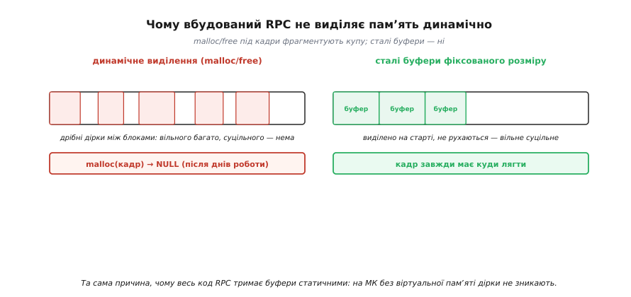

# ⚙️ Робочий RPC-диспетчер поверх UART: від кадру до кешу за ID

У темі ми розклали RPC на дві деталі — заглушку й диспетчер — і назвали три біди дроту, що псують зручну ілюзію локального виклику. Але назвати ще не значить уміти. Між фразою «диспетчер шукає функцію за номером і кличе її» та прошивкою, яку можна залити в реальний контролер і відправити в поле, лежить десяток рішень, кожне з яких легко зробити неправильно. Саме ці рішення ми тут і приймемо — всі, до останнього байта, — і зберемо з них **повний, перевірений кістяк** вбудованого RPC поверх звичайного UART.

Задача звучить буденно: хай головний контролер кличе функції периферійного по одному дроту, наче ті функції живуть у нього самого. Та щойно почнеш писати, виявляється, скільки всього треба вирішити. Як саме байти лягають у кадр? Що робити з кадром, у якому один біт перевернувся в дорозі? Куди класти аргументи, щоб обидва боки розуміли їх однаково й без динамічної пам'яті? Як зробити так, щоб загублена відповідь не виконала команду двічі? І як клієнтові чекати на відповідь, **не заморозивши** весь інший код? Кожне питання ми вже бачили в теорії; тепер дамо на кожне рядок коду, який працює.

> 🔧 **Навіщо це.** Це не навчальна вправа з порожнім протоколом. Рівно такий обмін стоїть між головним МК і давачем-копроцесором на одній платі, між польотним контролером і модулем телеметрії, між материнським контролером приладу й розумним блоком живлення. Зробив каркас наївно — «прийшов байт, дивлюся switch» — і він працюватиме на столі, доки одного дня перешкода не переверне номер функції у щось за межами таблиці, і контролер не стрибне на випадкову адресу. Заклав межі, CRC, кеш і неблокувальне очікування правильно — той самий вузол мовчки відпрацьовує роками. Різниця між «демо» і «продуктом» тут — кілька десятків рядків, які ми зараз і напишемо.

## Ідея цілком: один кадр туди, один назад, число замість імені

Перш ніж занурюватись у байти, окреслимо весь обмін одним поглядом, бо далі легко загубитися в деталях. Клієнт хоче викликати функцію. Він складає **один кадр запиту** — компактну двійкову структуру, де записано: хто кличе (номер запиту, ID), що кличе (номер функції), з чим (аргумент) і чи не побилося це в дорозі (контрольна сума). Кадр летить по UART. Сервер його ловить, перевіряє суму, дістає номер функції, бере за цим номером справжню функцію з **таблиці**, кличе її з аргументом, бере результат і складає **один кадр відповіді** — той самий ID, код результату, повернуте значення, знову сума. Кадр вертається. Клієнт звіряє ID, переконується, що це відповідь саме на його виклик, і віддає значення прикладному коду.

Усе. Жодного тексту, жодного розбору рядків, жодного динамічного виділення. Два кадри фіксованого вигляду, одна таблиця функцій, трохи арифметики над номерами. Вся подальша робота — заповнити цей кістяк надійним м'ясом: щоб кадр не сплутати з шумом на лінії, щоб побитий номер не виліз за межі таблиці, щоб повтор не виконав дію вдруге, щоб очікування не зупинило систему.

Домовмося відразу про обмеження, які роблять цей RPC **вбудованим**, а не «дорослим», — ми вивели їх у темі, тут просто закріплюємо як правила гри. Аргумент один і має фіксований розмір (32-бітне ціле). Більше аргументів — пакуємо їх у ту саму структуру фіксованого розміру, ніколи не розтягуючи кадр динамічно. Усі буфери виділено наперед, на етапі компіляції; `malloc` у цьому коді не з'явиться жодного разу — і нижче ми побачимо, чому це не примха, а необхідність. Один аргумент і один результат — це свідоме спрощення заради ясності кістяка; розширити його до кількох полів — механічна робота, яку ти зробиш сам, коли зрозумієш каркас.

## Шар 1: кадр на дроті — байт за байтом

Найперше рішення — і одне з найважливіших — як саме байти лягають у кадр. Тут панує спокуса «та якось покладу», за яку потім дорого платиш. Ми покладемо **обдумано**, бо від форми кадру залежить і простота коду, і стійкість до перешкод.

UART сам по собі не знає, де починається й де закінчується наше повідомлення: він шле байт за байтом суцільним потоком, а [кадр UART](root:com-devices/uart-frame) обрамлює лише один байт, не наше повідомлення з кількох байтів. Отже межі повідомлення ми маємо позначити самі. Найпростіший і найнадійніший спосіб — **байт-початок** (англ. *start byte*), особливе значення на самому початку кадру, по якому приймач упізнає: «ось тут починається щось моє». Виберемо рідкісне значення `0x7E` — воно традиційно слугує позначкою кадру в багатьох протоколах саме тому, що нечасто трапляється у звичайних даних.

Далі — поля самого повідомлення. Розкладемо їх у структуру фіксованого розміру:

```
 0       1       2       3       4       5       6       7       8       9
┌───────┬───────┬───────┬───────────────────────────────┬───────────────┐
│ 0x7E  │  ID   │ func  │            arg (4 байти)        │  CRC (2 б.)   │
│ start │ запит │ № фц. │     молодший→старший байт       │  CRC-16/CCITT │
└───────┴───────┴───────┴───────────────────────────────┴───────────────┘
       └──────── ці 6 байтів накриває CRC ────────┘
```

Розберімо, **чому** кожне поле саме таке.

**`ID` — один байт.** Номер запиту, що зв'язує запит із відповіддю й ловить повтори. Чому одного байта досить? Бо на тісній шині в дорозі ніколи не буває сотень одночасних викликів; ID лише має бути різним для сусідніх у часі запитів, щоб їх не сплутати. Лічильник 0…255, що йде по колу, дає рівно це. Якби каналом летіли тисячі запитів навперебій, узяли б два байти — але на UART між двома чипами це надмір.

**`func` — один байт.** Номер функції, що індексує таблицю. Один байт — це до 256 команд; жоден вбудований пристрій стільки не має, тож запас величезний. І саме цей байт приходить ззовні й тому **не заслуговує довіри** — головна думка всього шару диспетчеризації, до якої ми дійдемо.

**`arg` — чотири байти.** Аргумент як 32-бітне ціле зі знаком. Покладемо його **молодшим байтом уперед** (англ. *little-endian* — «з тупого кінця»), бо більшість контролерів, з якими ми працюємо, саме так і зберігають числа в пам'яті, і тоді маршалінг стає майже копіюванням. Головне правило тут одне: обидва боки мусять домовитися про [порядок байтів](root:sf-algorithms/bits-bytes-endianness) заздалегідь і назавжди — інакше одна сторона прочитає число `1` як `16777216`, і це найпідступніший із багів, бо на малих числах він тихо мовчить, а проявляється лише на великих.

**`CRC` — два байти.** Контрольна сума, що накриває поля `ID`, `func`, `arg` (але не сам байт-початок — він лише маркер). Два байти CRC-16 ловлять практично всі поодинокі й пакетні помилки в кадрі такого розміру.

Опишемо це в коді. Зверни увагу на `__attribute__((packed))` — без нього компілятор має право вставити невидимі байти-вирівнювачі між полями, і структура в пам'яті перестане збігатися байт-у-байт із кадром на дроті:

```c
#include <stdint.h>
#include <stdbool.h>
#include <string.h>

#define RPC_START   0x7Eu      // байт-початок кадру

// Кадр запиту на дроті. packed → жодних невидимих байтів-вирівнювачів,
// розкладка в памʼяті ТОЧНО збігається з порядком байтів на лінії.
typedef struct __attribute__((packed)) {
    uint8_t  id;               // номер запиту (повтори/звʼязка)
    uint8_t  func;             // номер функції — ІНДЕКС у таблицю
    int32_t  arg;              // аргумент (little-endian на дроті)
    uint16_t crc;             // CRC-16/CCITT над {id, func, arg}
} rpc_req_t;

// Кадр відповіді: той самий ID, код результату, повернуте значення.
typedef struct __attribute__((packed)) {
    uint8_t  id;               // ID запиту, на який це відповідь
    uint8_t  status;           // 0 = OK, інакше код помилки (нижче)
    int32_t  value;            // результат функції (значуще лише при OK)
    uint16_t crc;
} rpc_resp_t;

// Коди результату у відповіді.
enum {
    RPC_OK          = 0,       // виконано, value дійсне
    RPC_ERR_BADFUNC = 1,       // номер функції за межами таблиці
    RPC_ERR_BADCRC  = 2,       // (сервер не шле — клієнт сам відсіює)
    RPC_ERR_BUSY    = 3,       // обробник тимчасово не може виконати
};
```

Чому ми взагалі описали кадр **структурою**, а не просто масивом байтів із ручним «байт 2 — це func»? Бо структура робить маршалінг тривіальним: заповнив поля — і вся структура вже лежить у пам'яті готовим кадром, лишається додати байт-початок попереду й вислати її байти. Це і є та сама вигода фіксованого двійкового формату, про яку йшлося в темі: маршалінг зводиться до заповнення полів і одного копіювання, без жодного перетворення чисел на текст і назад.

## Шар 2: CRC — недовіра до кожного кадру

Дріт несе не лише корисні дані, а й перешкоди. Один перевернутий біт у `arg` — і мотор крутне на інше число; один перевернутий біт у `func` — і ми кличемо не ту функцію, а то й вилазимо за межі таблиці. Тому кожен кадр мусить нести доказ власної цілості, а приймач — перевіряти цей доказ **перш ніж глянути на вміст**. Цей доказ і є [контрольна сума CRC](root:com-modulation/crc): передавач рахує її над полями кадру й кладе в кінець, приймач рахує заново над тим, що прийшло, і звіряє. Збіглося — кадр цілий; ні — викидаємо мовчки, наче його й не було.

Візьмемо усталений варіант **CRC-16/CCITT** з твірним многочленом `0x1021` (це настояний, перевірений практикою вибір для коротких кадрів; многочлен `0x1021` відповідає `x¹⁶ + x¹² + x⁵ + 1` і використовується в безлічі протоколів зв'язку — від XMODEM до Bluetooth). Початкове значення візьмемо `0xFFFF` — поширений варіант, що краще ловить помилки на початку кадру, ніж старт із нуля. На контролері CRC рахують одним із двох способів: побітово (повільніше, але без таблиці) або за наперед порахованою таблицею (швидше, але 512 байтів флешу). Для RPC-кадру з кількох байтів побітовий варіант цілком швидкий, тож почнемо з нього — він короткий і не з'їдає флеш:

```c
// CRC-16/CCITT (poly 0x1021, init 0xFFFF), побітово.
// len байтів за вказівником data → 16-бітна сума.
static uint16_t crc16(const uint8_t *data, size_t len) {
    uint16_t crc = 0xFFFFu;
    for (size_t i = 0; i < len; i++) {
        crc ^= (uint16_t)data[i] << 8;          // байт у старші 8 біт
        for (int b = 0; b < 8; b++) {
            if (crc & 0x8000u)                   // старший біт = 1?
                crc = (crc << 1) ^ 0x1021u;      // зсув + XOR з многочленом
            else
                crc = crc << 1;                  // просто зсув
        }
    }
    return crc;
}
```

Тепер найважливіше — **як саме рахувати CRC над структурою**. Накриваємо нею перші `sizeof(структура) − 2` байти, тобто всі поля, **крім самого поля `crc`**. Запишемо два маленькі помічники, що рахують суму над кадром і дають відповідь на питання «цей кадр цілий?»:

```c
// Порахувати CRC над полями кадру (усе, крім останніх 2 байтів — самого crc).
static uint16_t req_crc(const rpc_req_t *r) {
    return crc16((const uint8_t *)r, sizeof(*r) - sizeof(r->crc));
}
static uint16_t resp_crc(const rpc_resp_t *r) {
    return crc16((const uint8_t *)r, sizeof(*r) - sizeof(r->crc));
}

// Кадр цілий, якщо порахована сума збіглася із записаною.
static bool req_ok(const rpc_req_t *r)  { return req_crc(r)  == r->crc; }
static bool resp_ok(const rpc_resp_t *r){ return resp_crc(r) == r->crc; }
```

Один тонкий момент, на якому спотикаються: CRC ми рахуємо над **структурою в пам'яті**, а вона `packed`, тож її байти лежать рівно так, як підуть на дріт. Якби структура не була `packed`, байти-вирівнювачі потрапили б під CRC на одному боці й не потрапили на іншому (з іншим компілятором чи вирівнюванням), і суми б ніколи не збіглися. Ось чому `packed` тут не косметика, а умова правильності.

> 🔧 **Навіщо це.** Перевірка CRC — це втілення в код простого правила: **усьому, що прийшло з дроту, не вір, доки не довів цілість**. Пропустиш цю перевірку — і одного дня перешкода перетворить `func=2` на `func=130`, кадр пройде як «нормальний», і диспетчер спробує викликати функцію номер 130. Що буде далі, залежить лише від того, чи перевіряєш ти межі таблиці (Шар 4) — у найкращому разі помилка, у найгіршому стрибок на випадкову адресу. CRC відсікає цей сценарій ще на вході: побитий кадр просто зникає, наче його й не було, а клієнт за таймером надішле запит знову.

## Шар 3: маршалінг — структура стає кадром і назад

Маршалінг (пакування аргументів у байти) у нас вийде майже непомітним — і це окрема перемога двійкового формату. Щоб скласти кадр запиту, треба заповнити поля структури, порахувати над ними CRC і вислати: байт-початок, потім байти структури. Розпакування на тому боці — дзеркальне: зловити байт-початок, прочитати рівно `sizeof(rpc_req_t)` байтів у структуру, перевірити CRC.

Спершу — бік, що **шле**. Припустимо, у нас є функція `uart_write(byte)`, що кладе один байт у передавач (її дає драйвер UART конкретного контролера):

```c
extern void uart_write(uint8_t byte);     // драйвер UART: вислати один байт

// Маршалінг + відправка кадру запиту.
static void send_req(uint8_t id, uint8_t func, int32_t arg) {
    rpc_req_t r;
    r.id   = id;
    r.func = func;
    r.arg  = arg;                          // 32-бітне число лягає 4 байтами
    r.crc  = req_crc(&r);                  // сума над {id, func, arg}

    uart_write(RPC_START);                 // байт-початок (під CRC не йде)
    const uint8_t *p = (const uint8_t *)&r;
    for (size_t i = 0; i < sizeof(r); i++) // байти структури як є
        uart_write(p[i]);
}
```

Зверни увагу: маршалінг — це рядок `r.arg = arg`. Жодного «розклади число на байти вручну», жодного перетворення на текст. Структура `packed`, тож щойно ми присвоїли полю значення, потрібні байти **вже лежать** у пам'яті в правильному порядку; лишилося їх виплюнути. Ось чому вбудований RPC обирає двійкове пакування: воно майже безкоштовне і за тактами, і за кодом.

Тепер бік, що **приймає**. Тут є тонкість, через яку наївний приймач ламається: байти приходять **поодинці й розтягнуто в часі**, не всі разом. UART видає байт, контролер робить тисячу інших справ, видає наступний. Тому приймач мусить бути **скінченним автоматом** (англ. *state machine*) — він пам'ятає, що вже зібрав, і нарощує кадр байт за байтом, доки не набереться повний. Ось цей автомат, що збирає кадр запиту на стороні сервера:

```c
// Стан приймача кадрів. Збирає кадр байт за байтом із потоку UART.
typedef struct {
    enum { WAIT_START, COLLECT } state;
    uint8_t buf[sizeof(rpc_req_t)];        // буфер під рівно один кадр
    size_t  have;                          // скільки байтів кадру вже зібрано
} rx_t;

static rx_t g_rx = { WAIT_START, {0}, 0 };

// Згодувати приймачу один байт із UART. Повертає true, коли кадр зібрано
// ЦІЛКОМ (тоді він лежить у *out і CRC уже перевірено).
static bool rx_feed(rx_t *rx, uint8_t byte, rpc_req_t *out) {
    switch (rx->state) {
    case WAIT_START:
        if (byte == RPC_START) {           // дочекалися початку кадру
            rx->have  = 0;
            rx->state = COLLECT;
        }
        return false;                      // байт-початок у буфер не кладемо

    case COLLECT:
        rx->buf[rx->have++] = byte;
        if (rx->have < sizeof(rpc_req_t))
            return false;                  // кадр іще не повний — чекаємо далі

        rx->state = WAIT_START;            // кадр зібрано — готуємось до нового
        memcpy(out, rx->buf, sizeof(*out));
        if (!req_ok(out))                  // CRC не зійшовся → кадр битий
            return false;                  // мовчки викидаємо, ніби не було
        return true;                       // цілий кадр готовий до диспетчеризації
    }
    return false;
}
```

Цей автомат — серце прийому, і в ньому захована стійкість до сміття на лінії. Поки не прийшов байт-початок, приймач спокійно ігнорує будь-який шум (стан `WAIT_START`). Прийшов початок — починає лічити байти. Набрав повний кадр — звіряє CRC і або віддає цілий кадр диспетчерові, або тихо викидає битий. А якщо посеред кадру лінія смикнулась і ми набрали маячню? CRC не зійдеться, кадр викинемо, клієнт за таймером повторить — система сама себе вирівняє. Один недолік цього найпростішого автомата чесно назвемо: якщо байт-початок `0x7E` випадково трапиться **всередині** аргументу, автомат його не сплутає лише тому, що чекає рівно на стільки байтів, скільки треба, і звіряє CRC у кінці; справді стійкі протоколи додають ще й екранування байтів-початків усередині даних — але для каркаса достатньо CRC як останнього судді.

## Шар 4: диспетчер — таблиця, і недовіра до номера

Ось ми й дісталися серця сервера — того самого, що в темі ми зібрали в кілька рядків. Тепер обставимо його всім, що робить його надійним. Нагадаю ідею: номер функції — це ціле число, а отже він може просто **індексувати масив вказівників на функції**, і весь розбір команди стискається до одного звернення за індексом, без жодного дерева `if`.

```c
// Кожен обробник — функція однакової форми: аргумент → результат.
typedef int32_t (*rpc_handler)(int32_t arg);

// ── Реальні обробники (тіла «віддалених» функцій) ────────────────────────
extern int32_t adc_read(int ch);           // драйвери конкретного МК
extern void    motor_set(int duty);

static int32_t h_ping(int32_t a)        { (void)a; return 0; }
static int32_t h_read_sensor(int32_t n) { return adc_read((int)n); }
static int32_t h_set_motor(int32_t d)   { motor_set((int)d); return d; }

// ── Таблиця диспетчеризації: номер функції → вказівник на обробник ────────
static const rpc_handler TABLE[] = {
    h_ping,          // func 0
    h_read_sensor,   // func 1
    h_set_motor,     // func 2
};
#define RPC_COUNT (sizeof(TABLE) / sizeof(TABLE[0]))
```

А тепер найважливіший рядок усього сервера — перевірка межі. Номер `func` приходить **по дроту**, отже навіть після CRC ми мусимо спитати: а чи є взагалі функція з таким номером? Бо CRC доводить лише, що кадр прийшов **цілим**, — а цілим міг прийти й кадр, де клієнт (старішої версії, з помилкою чи зловмисний) поклав номер, якого в нашій таблиці немає:

```c
// Виконати функцію за номером. Заповнює *value й повертає код результату.
// func ПРИЙШОВ ІЗ ДРОТУ — перевіряємо межу, перш ніж торкатись таблиці.
static uint8_t dispatch(uint8_t func, int32_t arg, int32_t *value) {
    if (func >= RPC_COUNT) {               // номера такого нема в таблиці
        *value = 0;
        return RPC_ERR_BADFUNC;            // НЕ чіпаємо TABLE[func]!
    }
    *value = TABLE[func](arg);             // увесь диспетчер — цей рядок
    return RPC_OK;
}
```

На цей `if (func >= RPC_COUNT)` варто подивитися пильно, бо в ньому — межа між надійним пристроєм і тим, що падає від випадкового кадру. Уяви, що ми його прибрали, а по дроту прийшов цілий (CRC зійшовся!) кадр із `func = 200`. Вираз `TABLE[200]` читає пам'ять за межами масиву — там лежить **щось випадкове**, якесь сміття, що ми тлумачимо як адресу функції. Виклик за цією адресою — стрибок у нікуди: у кращому разі контролер ловить виняток і перезавантажується, у гіршому виконує випадкові байти як код. Перша з трьох бід дроту казала «не вір, що запит дійде»; ця перевірка каже ширше — **не вір вмісту запиту, навіть коли він дійшов цілим**. Цілість (CRC) і осмисленість (межа таблиці) — це дві різні перевірки, і потрібні обидві.

> 🔧 **Навіщо це.** Це найдешевша й найважливіша перевірка в усьому RPC: один порівняльний рядок проти класу аварій «контролер раптом перезавантажився в полі без видимої причини». Такі аварії неможливо відтворити на столі — вони трапляються лише коли реальна перешкода перевернула біти саме в полі `func` так, що CRC випадково зійшовся (рідко, але за місяці роботи й мільйони кадрів — неминуче). Інженер, що пропустив межу, шукатиме привид тижнями; інженер, що її поставив, навіть не дізнається, що його щойно врятувало. Той самий принцип діє скрізь, де індекс приходить ззовні, — і ми його вже застосовували, [звіряючи CRC перед тим, як дивитися на вміст кадру](root:com-modulation/crc).

## Шар 5: кеш відповідей — щоб повтор не виконав дію вдруге

Тепер найтонше місце, заради якого варто було все це починати. Згадаймо другу біду дроту: запит долетів, сервер чесно виконав функцію, але **відповідь згинула** дорогою назад. Клієнт не дочекався, спрацював його таймер, він повторив запит — і сервер, нічого не підозрюючи, **виконує дію вдруге**. Якщо то було `set_motor(60)`, біди немає (повтор «установи 60» дає ті самі 60). А якщо `motor_add(+10)` чи «скинь вантаж» — повтор означає подвійну дію в реальному світі.

У темі ми вивели два рівні захисту. Перший — **формулювати команди ідемпотентно**, як «установи в значення», щоб повтор був безпечний сам по собі. Це найдешевший захист, і ним треба користатися завжди. Але деякі дії справді не звести до «установи» — для них потрібен другий рівень: сервер **пам'ятає** ID нещодавно виконаних запитів разом з їхніми відповідями, і на повторний запит із уже баченим ID **не виконує функцію знову**, а лише надсилає збережену відповідь ще раз. Це і є кеш відповідей, що дає властивість «виконано **щонайбільше один раз**» (англ. *at-most-once* — точний термін із класичної роботи про RPC Бірелла й Нельсона 1984 року, де цю проблему вперше системно розібрали; статус: усталений факт).

Як його збудувати на контролері, де пам'ять — розкіш? Не зберігати всю історію, звісно. Досить **маленького кільцевого буфера** на останні кілька ID: запит, повторений через секунду, ми впізнаємо, а той, що повториться через годину, нам уже й байдужий — його контекст давно минув. Кілька записів цілком ловлять реальні повтори, бо повтор за таймером приходить за мілісекунди-секунди після оригіналу, не пізніше.

```c
#define CACHE_SIZE  4          // памʼять на останні 4 виконані запити

typedef struct {
    bool        used;          // запис зайнятий?
    uint8_t     id;            // ID виконаного запиту
    rpc_resp_t  resp;          // готова відповідь на нього
} cache_slot_t;

static cache_slot_t g_cache[CACHE_SIZE];
static size_t       g_cache_next = 0;   // куди писати наступну (по колу)

// Шукаємо в кеші готову відповідь за ID. NULL, якщо такого ще не бачили.
static const rpc_resp_t *cache_find(uint8_t id) {
    for (size_t i = 0; i < CACHE_SIZE; i++)
        if (g_cache[i].used && g_cache[i].id == id)
            return &g_cache[i].resp;
    return NULL;
}

// Запамʼятати відповідь (затираємо найстаріший запис по колу).
static void cache_store(uint8_t id, const rpc_resp_t *resp) {
    g_cache[g_cache_next].used = true;
    g_cache[g_cache_next].id   = id;
    g_cache[g_cache_next].resp = *resp;
    g_cache_next = (g_cache_next + 1) % CACHE_SIZE;
}
```

Тепер зберемо весь сервер докупи: прийняли кадр → **спершу заглянули в кеш** → якщо там готова відповідь, шлемо її, не виконуючи нічого → якщо ні, виконуємо, запам'ятовуємо й шлемо. Порядок тут критичний: перевірка кешу йде **перед** викликом функції, інакше захист безсилий.

```c
extern void uart_write(uint8_t byte);

// Скласти й вислати кадр відповіді (маршалінг відповіді).
static void send_resp(const rpc_resp_t *r) {
    uart_write(RPC_START);
    const uint8_t *p = (const uint8_t *)r;
    for (size_t i = 0; i < sizeof(*r); i++)
        uart_write(p[i]);
}

// Повний обробник одного цілого запиту на боці сервера.
static void server_handle(const rpc_req_t *req) {
    // 1) Уже бачили цей ID? → це ПОВТОР. Шлемо стару відповідь, не виконуючи.
    const rpc_resp_t *cached = cache_find(req->id);
    if (cached != NULL) {
        send_resp(cached);                 // дія НЕ виконується вдруге
        return;
    }

    // 2) Новий запит — виконуємо функцію через диспетчер.
    rpc_resp_t resp;
    resp.id     = req->id;
    resp.status = dispatch(req->func, req->arg, &resp.value);
    resp.crc    = resp_crc(&resp);

    // 3) Запамʼятовуємо відповідь — щоб майбутній повтор не виконав дію знову.
    cache_store(req->id, &resp);

    // 4) Шлемо відповідь.
    send_resp(&resp);
}
```

Подивись, як акуратно три біди дроту лягли в цей короткий код. Перша біда (запит не дійшов) тут не лікується — бо її лікує **клієнт** своїм таймером, до якого ми зараз перейдемо; сервер про загублений запит просто ніколи не дізнається, і це нормально. Другу біду (відповідь не дійшла) б'є кеш: повтор знаходить готову відповідь і не виконує дію вдруге. А межова перевірка в `dispatch` ловить осмисленість номера. Лишилася третя біда — падіння сервера посеред виконання — і її чесно скажемо: **цей кеш від неї не рятує**. Якщо живлення зникло між кроком 2 і кроком 3, дію виконано, а відповідь не збережено; після перезавантаження повтор виконає її знову. Захист від цього — або робити саму дію ідемпотентною (рівень один, найнадійніший), або зберігати ID у [енергонезалежній пам'яті](root:embedded/choosing-memory) до виконання дії, що вже інша вага складності. Кеш дає at-most-once **за умови, що сервер не падає** посеред роботи; абсолютну гарантію через падіння дає лише ідемпотентність самої дії.

> 🔧 **Навіщо це.** Розмір кешу — це прямий компроміс «пам'ять проти захисту», і вибирати його треба свідомо. Замалий (один запис) — і два різні запити, що чергуються з повторами, виб'ють один одного з кешу раніше, ніж надійде повтор. Завеликий — марно з'їдає дорогий ОЗП. Орієнтир простий: кеш має пережити стільки **різних** запитів, скільки клієнт устигне відправити за час одного циклу таймаут-повтор. На повільній шині з одним запитом «у польоті» досить і двох записів; на жвавішій бери з запасом. І пам'ятай головне правило з теми: кеш — це **другий** рубіж; перший і найдешевший — формулювати команди як «установи», щоб половина повторів була безпечна без жодного кешу. Це той самий механізм, що в [команд MAVLink із підтвердженням](root:embedded/mavlink-commands), де критична команда несе лічильник, аби повтор не виконав її вдвічі.

## Шар 6: клієнт, що чекає, не морозячи систему

Лишилася остання й найкаверзніша частина — бік клієнта. Тут стикаються дві вимоги, які тягнуть у різні боки. З одного боку, заглушка має **дочекатися** відповіді: викликали `read_sensor(3)` — хочемо отримати число. З іншого, контролер **не має права завмерти** на час очікування: поки ми чекаємо відповідь, він мусить далі обробляти переривання, крутити регулятор, годувати [вартового таймера](root:sf-devices/watchdog). Якщо чекати наївно — у простому циклі «доки немає відповіді, нічого не роби», — то одна повільна або загублена відповідь заморозить усе. На однопотоковому контролері без операційної системи це смерть: апарат перестає стабілізуватися, бо застряг в очікуванні температури.

Розв'язок — зробити клієнта теж **скінченним автоматом**, що не блокує. Виклик не чекає на місці; він лише **запускає** обмін (шле запит, вмикає таймер) і відразу повертає керування головному циклу. Відповідь, коли прийде, ловить приймач; таймаут, коли мине, ловить перевірка часу в циклі. Прикладний код періодично питає автомат «ну що, готово?» і займається іншим, доки відповіді немає. Опишемо стани:

```c
extern uint32_t millis(void);          // монотонний час у мілісекундах
extern void     uart_write(uint8_t);

#define RPC_TIMEOUT_MS  50u            // скільки чекати відповідь
#define RPC_RETRIES     3u             // скільки разів повторити запит

// Стан клієнтського виклику.
typedef enum {
    CALL_IDLE,        // вільний — можна починати новий виклик
    CALL_WAITING,     // запит відіслано, чекаємо відповідь або таймаут
    CALL_DONE,        // відповідь прийшла — value готове
    CALL_FAILED,      // вичерпали повтори — віддалена сторона мовчить
} call_state_t;

typedef struct {
    call_state_t state;
    uint8_t      id;            // ID цього виклику (для звірки відповіді)
    uint8_t      func;          // що викликали (на випадок повтору)
    int32_t      arg;
    uint32_t     t_sent;        // коли востаннє відіслали запит
    uint8_t      tries;         // скільки разів уже слали
    int32_t      value;         // результат (значущий при CALL_DONE)
    uint8_t      status;        // код результату з відповіді
} rpc_call_t;

static rpc_call_t g_call = { CALL_IDLE };
static uint8_t    g_next_id = 1;       // лічильник ID запитів (по колу)
```

Початок виклику — заглушка. Вона **не блокує**: лише заповнює стан, шле перший запит, заводить таймер і повертається. Прикладний код після цього вільний робити будь-що:

```c
// Заглушка: почати віддалений виклик. НЕ чекає — одразу повертає керування.
// Повертає false, якщо попередній виклик іще не завершено.
static bool rpc_call_begin(uint8_t func, int32_t arg) {
    if (g_call.state == CALL_WAITING)
        return false;                  // канал зайнятий попереднім викликом

    g_call.id     = g_next_id++;       // унікальний ID (0..255 по колу)
    g_call.func   = func;
    g_call.arg    = arg;
    g_call.tries  = 1;
    g_call.value  = 0;
    g_call.status = RPC_ERR_BUSY;
    g_call.state  = CALL_WAITING;

    send_req(g_call.id, func, arg);    // шлемо перший запит
    g_call.t_sent = millis();          // заводимо таймер
    return true;
}
```

Двигун клієнта — функція, яку головний цикл кличе **часто** (на кожному обороті). Вона робить дві речі: годує приймач байтами з UART (а той ловить відповідь) і стежить за таймером (а той ловить мовчання). Саме тут живе **таймаут і повтор** — лік другої й першої бід дроту з боку клієнта:

```c
extern bool uart_read(uint8_t *byte);  // драйвер: дістати байт, false якщо порожньо

// Приймач кадрів ВІДПОВІДІ (дзеркало rx_feed, але під rpc_resp_t).
static rx_t g_crx = { WAIT_START, {0}, 0 };
static bool resp_feed(rx_t *rx, uint8_t byte, rpc_resp_t *out) {
    switch (rx->state) {
    case WAIT_START:
        if (byte == RPC_START) { rx->have = 0; rx->state = COLLECT; }
        return false;
    case COLLECT:
        rx->buf[rx->have++] = byte;
        if (rx->have < sizeof(rpc_resp_t)) return false;
        rx->state = WAIT_START;
        memcpy(out, rx->buf, sizeof(*out));
        return resp_ok(out);           // битий кадр → false (наче не було)
    }
    return false;
}

// Двигун клієнта. Кликати ЧАСТО з головного циклу. Не блокує.
static void rpc_call_poll(void) {
    if (g_call.state != CALL_WAITING)
        return;                        // нема активного виклику — нічого робити

    // 1) Зловити відповідь, якщо прийшла.
    uint8_t byte;
    rpc_resp_t resp;
    while (uart_read(&byte)) {
        if (resp_feed(&g_crx, byte, &resp)) {
            if (resp.id == g_call.id) {        // це відповідь на НАШ виклик
                g_call.value  = resp.value;
                g_call.status = resp.status;
                g_call.state  = CALL_DONE;
                return;
            }
            // чужий ID — відповідь на старий виклик, ігноруємо
        }
    }

    // 2) Перевірити таймаут.
    if (millis() - g_call.t_sent >= RPC_TIMEOUT_MS) {
        if (g_call.tries >= RPC_RETRIES) {
            g_call.state = CALL_FAILED;        // вичерпали повтори — здаємось
            return;
        }
        g_call.tries++;
        send_req(g_call.id, g_call.func, g_call.arg);  // ТОЙ САМИЙ ID!
        g_call.t_sent = millis();              // перезаводимо таймер
    }
}
```

Зупинися на двох рядках, бо в них уся суть. Перший — `if (resp.id == g_call.id)`: відповідь приймаємо, лише якщо її ID збігається з ID нашого виклику. Це той самий номер запиту з теми, що зв'язує запит із відповіддю; без нього стара, спізніла відповідь на давній виклик прийшла б замість свіжої, і ми прийняли б торішню температуру за теперішню. Другий — повтор шле **той самий** ID (`g_call.id`, не новий). Це критично для зв'язки з кешем сервера: повтор із тим самим ID сервер упізнає й не виконає дію вдруге. Якби повтор ішов із новим ID, для сервера це був би **інший** запит, і весь захист кешу розсипався б. Таймаут на клієнті й кеш на сервері — це **одна команда у два голоси**: клієнт повторює тим самим ID, сервер за цим ID відсіює повтор.

Лишається показати, як цим користається прикладний код. Він не блокується — він питає стан і займається своїм:

```c
// Десь у головному циклі програми:
void main_loop(void) {
    static bool asked = false;

    rpc_call_poll();                       // двигун RPC — крутиться завжди

    if (!asked) {
        if (rpc_call_begin(1, 3))          // func 1 = read_sensor, arg = 3
            asked = true;
    }

    if (g_call.state == CALL_DONE) {
        int32_t temp = g_call.value;       // відповідь прийшла
        use_temperature(temp);
        g_call.state = CALL_IDLE;
        asked = false;
    } else if (g_call.state == CALL_FAILED) {
        handle_link_loss();                // віддалена сторона мовчить
        g_call.state = CALL_IDLE;
        asked = false;
    }

    run_control_loop();                    // ← це крутиться ВЕСЬ час,
    feed_watchdog();                       //    навіть поки чекаємо відповідь
}
```

Ось вона, та сама властивість, заради якої ми обрали автомат замість наївного очікування: `run_control_loop()` і `feed_watchdog()` виконуються на **кожному** обороті, незалежно від того, чекає RPC відповідь чи ні. Регулятор не завмирає, вартовий ситий, переривання обробляються. RPC-виклик розтягнувся в часі, але **не зупинив систему** — у цьому весь сенс неблокувального клієнта на однопотоковому контролері.

## Складність і пастки: де цей код ламається

Кістяк зібрано. Тепер найкорисніше — пройтися по місцях, де його легко зламати, і показати **код помилки поруч із кодом правильним**, бо саме на цих трьох пастках спотикаються найчастіше, і всі три ми обіцяли в темі розглянути впритул.

**Пастка перша: вихід за межі таблиці на побитому номері.** Найспокусливіше — написати диспетчер «прямо», без перевірки межі, бо на столі він працює бездоганно:

```c
// ❌ НЕБЕЗПЕЧНО: номер прийшов із дроту, а межі не перевірено.
static uint8_t dispatch_bad(uint8_t func, int32_t arg, int32_t *value) {
    *value = TABLE[func](arg);   // func=200 → читаємо памʼять за масивом
    return RPC_OK;               //          → виклик за випадковою адресою
}
```

На столі `func` завжди в межах, бо ти сам шлеш правильні кадри. У полі ж перешкода рано чи пізно переверне біти в `func` так, що CRC випадково зійдеться, прийде `func = 200`, і `TABLE[200]` прочитає сміття за масивом як адресу функції. Виправлення — той самий один рядок із Шару 4:

```c
// ✅ ПРАВИЛЬНО: спершу межа, тоді таблиця.
static uint8_t dispatch_ok(uint8_t func, int32_t arg, int32_t *value) {
    if (func >= RPC_COUNT) { *value = 0; return RPC_ERR_BADFUNC; }
    *value = TABLE[func](arg);
    return RPC_OK;
}
```

Запам'ятай як рефлекс: **будь-який індекс, що прийшов ззовні, перевіряй на межу перед уживанням**. CRC доводить цілість, але не осмисленість — цілим може прийти й безглуздий номер.

**Пастка друга: повторне виконання не-ідемпотентної команди без кешу.** Уяви, що ми прибрали кеш із `server_handle` — «навіщо він, відповідь же майже завжди доходить»:

```c
// ❌ НЕБЕЗПЕЧНО: без кешу повтор виконує дію ВДРУГЕ.
static void server_handle_bad(const rpc_req_t *req) {
    rpc_resp_t resp;
    resp.id     = req->id;
    resp.status = dispatch(req->func, req->arg, &resp.value);  // виконує ЗАВЖДИ
    resp.crc    = resp_crc(&resp);
    send_resp(&resp);                                          // навіть на повтор
}
```

Доки канал ідеальний, усе гаразд. Та щойно одна відповідь згине — клієнт повторить, і якщо функція була `motor_add(+10)`, мотор додасть не десять, а двадцять. Загублена відповідь тихо перетворилася на зайву дію в реальному світі. Лік — кеш із Шару 5, що **спершу шукає ID, а виконує лише новий запит**. Є й дешевший лік, який треба застосовувати **завжди, незалежно від кешу**: формулюй команду ідемпотентно. Не `motor_add(+10)`, а `motor_set(60)` — повтори «установи 60» хоч сто разів, результат той самий. Ідеально, коли обидва рубежі разом: ідемпотентне формулювання як основа і кеш для решти.

**Пастка третя: фрагментація від динамічного виділення.** Найпідступніша, бо проявляється не зразу, а через дні чи тижні безперервної роботи. Спокуса виглядає розумно й «гнучко»:

```c
// ❌ ПОВІЛЬНА СМЕРТЬ: буфер під кадр виділяємо динамічно щоразу.
static void send_req_bad(uint8_t id, uint8_t func, int32_t arg) {
    uint8_t *buf = malloc(sizeof(rpc_req_t) + 1);  // «гнучко» під розмір
    if (!buf) return;                              // а якщо памʼяті вже нема?
    /* ... заповнити buf, вислати ... */
    free(buf);
}
```

Логіка наче бездоганна: виділив під кадр, ужив, звільнив. Але на контролері з десятками кілобайтів ОЗП **без віртуальної пам'яті** кожна пара `malloc`/`free` лишає по собі дрібні дірки в купі. Виділення-звільнення різних розмірів **фрагментують** пам'ять: загальної вільної ще багато, але суцільного шматка потрібного розміру вже немає — і чергове `malloc` повертає `NULL` рівно тоді, коли пристрій пропрацював найдовше й найважливіше. Це класична [проблема безпечної роботи з пам'яттю](root:embedded/memory-safety) у вбудованих системах: динамічне виділення в довгограючій прошивці — міна сповільненої дії. Виправлення — те, з чим ми весь час і працювали: **жодного `malloc`**, усі буфери статичні, фіксованого розміру, відомі на етапі компіляції:

```c
// ✅ ПРАВИЛЬНО: структура на стеку, фіксований розмір, нуль динаміки.
static void send_req_ok(uint8_t id, uint8_t func, int32_t arg) {
    rpc_req_t r = { .id = id, .func = func, .arg = arg };
    r.crc = req_crc(&r);
    uart_write(RPC_START);
    const uint8_t *p = (const uint8_t *)&r;
    for (size_t i = 0; i < sizeof(r); i++) uart_write(p[i]);
}
```

Структура `r` живе на стеку: з'явилася на час виклику, зникла на виході, жодної дірки в купі. Максимальний розмір кадру відомий наперед, буфери приймача теж статичні — і клас аварій «скінчилася пам'ять посеред виклику після тижня роботи» зникає цілком.


*Чому вбудований RPC уникає динамічної пам'яті. Ліворуч: кожен `malloc`/`free` під кадр лишає в купі дрібну дірку; з часом вільна пам'ять є, але суцільного шматка під новий кадр уже нема — `malloc` вертає NULL саме тоді, коли пристрій пропрацював найдовше. Праворуч: буфери фіксованого розміру виділено раз на старті; вони не рухаються, купа не фрагментується, і кадр завжди має куди лягти. Та сама причина, чому весь наш код тримає буфери статичними.*

Тепер зведімо всю механіку обміну в одну картину, щоб видно було, як шари змикаються в одне ціле — від виклику в прикладному коді клієнта до виконання й кешування на сервері:


*Усі шість шарів в одному обміні. Клієнт: прикладний виклик → заглушка маршалить структуру → CRC → неблокувальний автомат шле кадр і заводить таймер. Дріт UART. Сервер: приймач-автомат збирає кадр байт за байтом → звіряє CRC (битий — мовчки геть) → кеш за ID (повтор — стара відповідь, без виконання) → диспетчер перевіряє межу таблиці й кличе обробник → відповідь маршалиться й летить назад. Кожен шар закриває свою біду: CRC — спотворення, межа — побитий номер, кеш — повторне виконання, таймаут — мовчання.*

## Що ти тримаєш у руках

Збери все докупи — і в тебе повний, працездатний кістяк вбудованого RPC поверх UART, у якому кожне рішення зроблено свідомо. Кадр фіксованого вигляду з байтом-початком, ID, номером функції, аргументом і CRC. Побітовий CRC-16/CCITT, що відсіває спотворені кадри ще на вході. Маршалінг через `packed`-структуру, де пакування — це присвоєння полю. Приймач-автомат, що збирає кадр із розтягнутого в часі потоку байтів і стійкий до сміття на лінії. Диспетчер як таблиця вказівників із межовою перевіркою, що ловить побитий номер. Кеш за ID, що дає at-most-once для не-ідемпотентних команд. І неблокувальний клієнт із таймаутом і повтором, що чекає на відповідь, **не морозячи** регулятор і вартового.

Цей кістяк свідомо мінімальний — один аргумент, один результат, побітовий CRC, кеш на чотири записи. Нарощуй його під свою задачу: кілька аргументів — пакуй у ту саму структуру фіксованого розміру; швидший CRC — заміни побітовий на табличний; жвавіший канал — побільши кеш; кілька викликів навперебій — заведи масив `rpc_call_t` замість одного. Але **фундамент** чіпати не доведеться, бо в ньому вже закладено всі чотири ліки на чотири біди дроту. Саме цього ми й домагалися: щоб RPC дав тобі змогу думати **діями й функціями**, а не байтами й кадрами, — і не покарав тихим багом за зручність.
