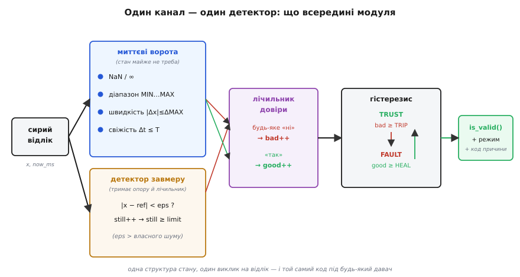
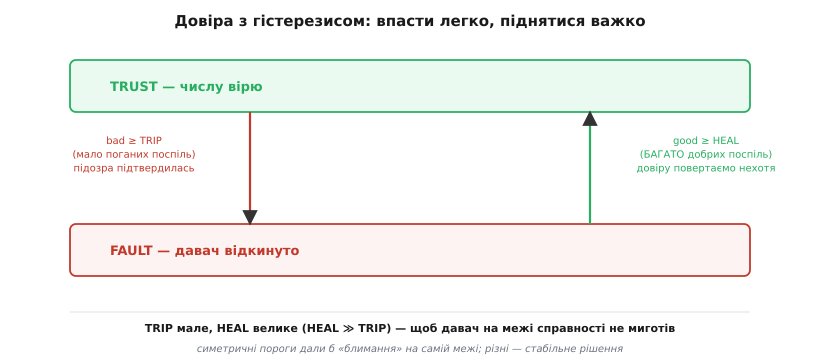

# ⚙️ Багаторазовий детектор відмови на канал

У самій темі ми розклали оборону на окремі прийоми: [три швидкі ворота](root:embedded/sensor-fault-detection) (діапазон, швидкість, тайм-аут), окремий ловець завмеру, лічильник підтвердження проти хибних тривог і гістерезис повернення довіри. Кожен ми бачили самотужки, маленьким шматком коду. Та в реальному пристрої давачів не один: висота, тиск, три струми фаз, чотири температури комірок батареї. Переписувати ці перевірки під кожен — це гарантовано наплодити шість трохи різних, трохи кривих копій, у п'ятій з яких хтось забуде скинути лічильник, а в шостій — переплутає поріг падіння з порогом повернення. Тому зберемо **усе в один файл**: одна структура стану на канал, один виклик на відлік, один прапорець `is_valid()` назовні. Далі під кожен новий давач ти лише заповнюєш табличку порогів — а перевірена логіка лишається та сама.

Це той самий хід, що ми вже робили з [абстракцією шини](root:embedded/spi-vs-i2c/proj-bus-abstraction.md): один раз написати правильно, тоді користуватися багато разів, не думаючи про нутрощі. Тільки тут «правильно» означає ще й **безпечно падати**, бо помилка в детекторі відмови — це не косметичний баг, а апарат, що довіряє мертвому давачу.

## Задача

Сформулюймо точно, що цей модуль має вміти — рівно стільки, не більше, бо кожна зайва функція тут це зайвий шанс на тонкий баг.

- **Прийняти сирий відлік** `x` із міткою часу `now_ms` і сказати одним викликом: цьому числу зараз можна вірити чи ні. Жодних кидань винятків, жодних блокувань — лише оновити внутрішній стан і повернути відповідь.
- **Ловити п'ять почерків відмови** з нашого словника: NaN/нескінченність, виліт за фізичну межу, нереальний стрибок, мовчання (тайм-аут) і завмер. Усе це — на **один** давач, без сусідів; голосування між давачами — окремий шар, що стоїть **над** цим модулем і дивиться на кілька його прапорців.
- **Не сіпатися від поодинокого збою.** Одна наводка, одна загублена посилка на шині — ще не відмова. Прапор «не вірю» піднімаємо лише коли погане **підтвердилося** кількома відліками поспіль.
- **Повертати довіру обережно**, через два різні пороги: впасти в недовіру легко, вибратися з неї важко, щоб давач на самій межі справності не миготів «здоровий–хворий».
- **Сказати не лише «так/ні», а й чому** (який саме почерк зловили) і **в якому режимі** зараз канал — щоб старший код міг розумно вирішити, чи перемикатися на запасне джерело.
- **Жити на голому залізі**: жодного `malloc`, фіксований розмір, передбачуваний час виконання, придатність до виклику з [переривання](book:programming/isr) чи з циклу 1 кГц на дешевому мікроконтролері.

> 🔧 **Навіщо це.** Межі задачі тут — половина успіху. Спокуса дописати в детектор «трохи фільтрації», «трохи усереднення», «а давай ще медіану з трьох давачів» закінчується модулем, який сам стає джерелом помилок і який страшно чіпати. Детектор має робити **одне**: казати, чи живий канал. Згладжування — окрема ланка [після](root:embedded/choosing-a-filter) нього, поєднання давачів — окрема ланка над ним. Чистий, вузький модуль легко перевірити, легко довірити й легко перенести на наступний проєкт.

## Ідея

Складімо все докупи однією картиною — як сирий відлік протікає крізь модуль і перетворюється на рішення.


*Один відлік заходить ліворуч. Спершу **миттєві ворота** (NaN, діапазон, швидкість, свіжість) — їм майже не треба пам'яті, лише попереднє значення. Паралельно **детектор завмеру** тримає опору й лічильник нерухомості. Будь-яке «ні» від воріт чи завмеру — це голос «погано» в **лічильник довіри**; «так» — голос «добре». А **гістерезис** із двома порогами (TRIP униз, HEAL угору) перетворює потік голосів на стабільний стан і віддає назовні `is_valid()` плюс код причини й режим. Уся ця машинерія — в одній структурі, оновлюваній одним викликом.*

Ключова думка — **розділення двох часових масштабів**. Миттєві перевірки дивляться на **один** відлік: чи він узагалі число, чи в межах, чи не стрибнув. Вони майже без пам'яті — їм треба знати лише попереднє значення й час. А підтвердження й гістерезис дивляться на **історію рішень**: не «цей відлік поганий», а «погані відліки йдуть **поспіль** уже достатньо довго». Це два різні питання, і плутати їх — класична помилка. Якщо підняти прапор з першого ж поганого відліку, детектор істеритиме на кожній наводці; якщо ж вимагати підтвердження від **самих** воріт (усереднювати всередині воріт), вони втратять гостроту. Тому ворота лишаються гострими й миттєвими, а м'якість і терпіння живуть **окремо**, у лічильнику довіри.

Сам лічильник довіри — це маленький [тригер Шмітта](book:electronics/schmitt-trigger), тільки не на напрузі, а на «кількості поганих/добрих поспіль». У тригера Шмітта два пороги: вмикається на одному рівні, вимикається на іншому, нижчому, — і завдяки зазору між ними вихід не дрижить на межі. Тут так само: щоб **оголосити** відмову, досить `TRIP` поганих поспіль (мале число — реагуємо швидко); щоб **зняти** відмову, треба `HEAL` добрих поспіль (велике число — повертаємо довіру нехотя). Зазор між цими порогами і є те, що не дає каналу миготіти.


*Стан каналу — це або TRUST (вірю), або FAULT (відкинуто). Униз веде малий поріг TRIP: кілька поганих відліків поспіль — і ми вже не віримо. Угору веде великий поріг HEAL: щоб повернути довіру, потрібно помітно більше добрих поспіль. Несиметрія навмисна: симетричні пороги дали б блимання на самій межі справності, різні — дають стабільне рішення. Боятися треба не «зайвої недовіри» (вона дешева), а «передчасної довіри» (вона небезпечна).*

І остання деталь ідеї, на якій спотикаються найчастіше: **перший відлік — особливий**. Поки давач не дав жодного числа, нам нема з чим порівнювати швидкість («стрибок» від чого?), нема опори для завмеру, нема відліку часу для тайм-ауту. Тому модуль має явний стан «ще не розігрітий» (`primed = false`): на першому валідному числі він **запам'ятовує** його як опору й базу, але **не судить** про швидкість і завмер — судити нема об що. Забути про це — означає або хибно оголосити відмову на старті (стрибок «від нуля до 1013 гПа» виглядає як божевільний), або, навпаки, проґавити завмер, бо опору так і не встановили.

## Робочий код: інтерфейс і стан

Почнімо з того, що видно зовні, — з заголовка. Тут уся домовленість: які перевірки є, який результат повертаємо, що тримаємо в стані. Це той інтерфейс, через який старший код спілкується з модулем, нічого не знаючи про його нутрощі.

```c
// fault_detector.h — детектор відмови одного давача-каналу.
// Голе залізо: без malloc, фіксований розмір, без блокувань.
#ifndef FAULT_DETECTOR_H
#define FAULT_DETECTOR_H

#include <stdint.h>
#include <stdbool.h>

// Який саме почерк відмови зловили (для діагностики й логів).
typedef enum {
    FD_OK = 0,        // канал здоровий
    FD_NAN,           // прийшов NaN або нескінченність
    FD_RANGE,         // виліт за фізичну межу [min..max]
    FD_RATE,          // нереальний стрибок за один крок
    FD_STALE,         // давач мовчить довше за тайм-аут
    FD_STUCK          // значення прилипло (рух менший за власний шум)
} fd_reason_t;

// Стан довіри до каналу.
typedef enum {
    FD_TRUST = 0,     // числу віримо
    FD_FAULT          // канал відкинуто, чекаємо на одужання
} fd_state_t;

// Незмінна конфігурація каналу — заповнюється раз під конкретний давач.
typedef struct {
    float    min, max;        // фізичні межі величини
    float    max_step;        // найбільша правдоподібна зміна за крок
    uint32_t timeout_ms;      // мовчання довше за це — відмова
    float    eps;             // рух менший за це вважаємо «нерухомістю»
    uint16_t stuck_limit;     // скільки нерухомих відліків поспіль — це завмер
    uint16_t trip_count;      // скільки поганих поспіль → FAULT (мале)
    uint16_t heal_count;      // скільки добрих поспіль → TRUST (велике)
} fd_config_t;

// Робочий стан каналу — нуль на старті означає «холодний, нерозігрітий».
typedef struct {
    const fd_config_t *cfg;   // вказівник на конфіг (у ПЗП/const — не копіюємо)
    fd_state_t  state;        // TRUST / FAULT
    fd_reason_t reason;       // причина останнього «погано»
    bool        primed;       // чи вже є з чим порівнювати (був ≥1 валідний)
    float       last;         // останнє ПРИЙНЯТЕ значення (для швидкості)
    uint32_t    last_ms;      // коли воно прийшло (для тайм-ауту)
    float       ref;          // опора для детектора завмеру
    uint16_t    still;        // нерухомих відліків поспіль
    uint16_t    bad_run;      // поганих відліків поспіль (рахуємо до TRIP)
    uint16_t    good_run;     // добрих відліків поспіль (рахуємо до HEAL)
} fd_channel_t;

// API.
void        fd_init(fd_channel_t *ch, const fd_config_t *cfg);  // або скидання
fd_state_t  fd_update(fd_channel_t *ch, float x, uint32_t now_ms); // 1 відлік
bool        fd_is_valid(const fd_channel_t *ch);   // зручний прапорець TRUST?
fd_reason_t fd_reason(const fd_channel_t *ch);     // чому впав (для логів)

#endif
```

Зверніть увагу на два рішення в самій структурі. По-перше, **конфіг і стан розділені**. Незмінні пороги (`fd_config_t`) можна покласти в `const` — у ПЗП мікроконтролера, — і **один** конфіг обслуговує хоч сотню однакових каналів (чотири термістори батареї з тими самими межами беруть той самий `cfg`, кожен зі своїм `fd_channel_t`). Це економить дорогу оперативну пам'ять і робить наміри явними: що тут налаштування, а що — поточний стан. По-друге, **стан спроєктований так, що нуль = безпечний холодний старт**: `state = FD_TRUST`, `primed = false`, усі лічильники нулі. Чому `TRUST`, а не `FAULT`? Бо доки давач не дав жодного поганого числа, немає підстав йому не вірити; перший же справді поганий відлік чесно проведе канал через підтвердження у `FAULT`. Стартувати з `FAULT` означало б на кожному ввімкненні мати «сліпий» період, поки `HEAL` добрих не назбирається, — а це власна, рукотворна відмова на рівному місці.

## Робочий код: серце детектора

Тепер найголовніше — функція `fd_update`. Вона і є весь модуль: миттєві ворота, детектор завмеру, голос у лічильник довіри й гістерезис — усе в одному прозорому проході. Читається згори вниз рівно як ми міркували.

```c
// fault_detector.c
#include "fault_detector.h"
#include <math.h>     // isnan, isinf, fabsf

void fd_init(fd_channel_t *ch, const fd_config_t *cfg) {
    ch->cfg      = cfg;
    ch->state    = FD_TRUST;     // доки не доведено погане — віримо
    ch->reason   = FD_OK;
    ch->primed   = false;        // ще нема з чим порівнювати
    ch->last     = 0.0f;
    ch->last_ms  = 0u;
    ch->ref      = 0.0f;
    ch->still    = 0u;
    ch->bad_run  = 0u;
    ch->good_run = 0u;
}

// Миттєві перевірки одного відліку. Повертає FD_OK або причину «погано».
// На ПЕРШОМУ валідному відліку швидкість/завмер не судимо — нема об що.
static fd_reason_t fd_check_sample(fd_channel_t *ch, float x, uint32_t now_ms) {
    const fd_config_t *c = ch->cfg;

    // 1. Узагалі число? NaN/∞ ловимо першими, бо з ними решта порівнянь — сміття.
    if (isnan(x) || isinf(x)) return FD_NAN;

    // 2. У фізичних межах? Найгрубіша й найдешевша перевірка.
    if (x < c->min || x > c->max) return FD_RANGE;

    if (ch->primed) {
        // 3. Свіжість: чи не мовчав давач задовго до цього відліку.
        //    (now_ms - last_ms) у БЕЗЗНАКОВІЙ арифметиці коректно
        //    переживає переповнення лічильника часу — див. пастки.
        if ((now_ms - ch->last_ms) > c->timeout_ms) return FD_STALE;

        // 4. Швидкість: чи міг сигнал так стрибнути за один крок.
        if (fabsf(x - ch->last) > c->max_step) return FD_RATE;

        // 5. Завмер: рух менший за власний шум давача, і то надто довго.
        if (fabsf(x - ch->ref) < c->eps) {
            if (ch->still < 0xFFFFu) ch->still++;
            if (ch->still >= c->stuck_limit) return FD_STUCK;
        } else {
            ch->ref   = x;       // ворухнулося — оновлюємо опору
            ch->still = 0u;
        }
    }
    return FD_OK;
}

fd_state_t fd_update(fd_channel_t *ch, float x, uint32_t now_ms) {
    const fd_config_t *c = ch->cfg;
    fd_reason_t r = fd_check_sample(ch, x, now_ms);

    if (r == FD_OK) {
        // Добрий відлік. Запам'ятати його як базу для наступних перевірок.
        ch->last    = x;
        ch->last_ms = now_ms;
        if (!ch->primed) {       // ПЕРШИЙ валідний — розігріваємось
            ch->ref    = x;      // опора для завмеру
            ch->primed = true;
        }
        // Голос «добре» в лічильник довіри.
        ch->bad_run = 0u;
        if (ch->good_run < 0xFFFFu) ch->good_run++;
        ch->reason  = FD_OK;
        // Гістерезис угору: повертаємо довіру лише після HEAL добрих поспіль.
        if (ch->state == FD_FAULT && ch->good_run >= c->heal_count) {
            ch->state = FD_TRUST;
        }
    } else {
        // Поганий відлік. last/last_ms НЕ оновлюємо: брехливе число
        // не має ставати базою для майбутніх перевірок швидкості.
        ch->good_run = 0u;
        if (ch->bad_run < 0xFFFFu) ch->bad_run++;
        ch->reason   = r;
        // Гістерезис униз: оголошуємо відмову після TRIP поганих поспіль.
        if (ch->state == FD_TRUST && ch->bad_run >= c->trip_count) {
            ch->state = FD_FAULT;
        }
    }
    return ch->state;
}

bool        fd_is_valid(const fd_channel_t *ch) { return ch->state == FD_TRUST; }
fd_reason_t fd_reason  (const fd_channel_t *ch) { return ch->reason; }
```

Розберімо найтонші місця, бо саме в них ховаються баги, які потім ловлять місяцями.

**Порядок перевірок не випадковий — від найгрубішого до найтоншого.** NaN/∞ йдуть першими: якщо число — не число, усі наступні `<`, `>`, віднімання дадуть сміття або теж NaN (порівняння з NaN завжди хибне, тож `x < min` його **не** зловить — спеціальна перевірка обов'язкова). Далі діапазон — одне порівняння, відсікає найгрубішу брехню задешево. Тайм-аут стоїть **перед** швидкістю й завмером навмисно: якщо давач довго мовчав, його нове число — це не «стрибок» (порівнювати з геть старим `last` безглуздо) і не «рух» — це просто перше число після паузи, і чесніше назвати причину `FD_STALE`, ніж `FD_RATE`. Тонкість, яку легко проґавити: завислий давач часто й далі віддає **те саме старе число** з тією ж часовою міткою або без оновлення — і тоді його ловить або `FD_STALE` (якщо мітка не рухається), або `FD_STUCK` (якщо мітка йде, а значення ні). Дві перевірки страхують одна одну.

**Погане число не стає базою.** Це найважливіший і найчастіше забутий рядок — точніше, його **відсутність**: у гілці «погано» ми **не** чіпаємо `last` і `last_ms`. Уявіть інакше: давач викинув одиничний дикий стрибок на 500, ми його забракували — але записали 500 в `last`. Наступний **здоровий** відлік (скажімо, 20) тепер порівнюється з 500, дає «стрибок» назад, і ми бракуємо вже здорове число. Один збій породив би лавину хибних. Тому база оновлюється **тільки** з прийнятих значень — детектор міряє швидкість і завмер відносно останньої **правди**, а не останнього **числа**.

**Лічильники не плутаються.** `bad_run` і `good_run` — взаємно гасні: добрий відлік обнуляє `bad_run`, поганий обнуляє `good_run`. Це і є «поспіль»: будь-який розрив серії скидає її в нуль. Саме тому одинична наводка серед потоку добрих не накопичується — `bad_run` стрибнув до одиниці й тут же впав назад. А `still` (лічильник завмеру) живе окремо й має власну логіку скидання — на **рух**, а не на «добрий відлік», бо завмерле число формально проходить діапазон і швидкість, тобто з погляду тих воріт воно «добре».

> 🔧 **Навіщо це.** Уся ця акуратність зі скиданням лічильників — не педантизм, а різниця між детектором, якому довіряють, і детектором, який вимикають через тиждень, бо він «бреше частіше за давач». Поле безжальне до хибних тривог: якщо оператор бачить десять фальшивих «відмова давача» на день, на одинадцяту, **справжню**, він уже не зреагує. Тому детектор має сіпатися **рідко й по ділу** — а це досягається саме чистою механікою «поспіль», де кожен лічильник скидається на своїй, правильній події.

## Як цим користуватися

Окреме гарне в модулі — як мало коду треба на боці виклику. Описуємо канали табличкою, оновлюємо в циклі, читаємо прапорець. Ось висотомір і барометр на одній платі дрона:

```c
// Конфіги — у const (лягають у ПЗП). Один конфіг = один тип давача.
static const fd_config_t CFG_BARO = {
    .min = 300.0f, .max = 1100.0f,   // гПа: фізичні межі на Землі
    .max_step = 5.0f,                // за крок (20 мс) тиск не стрибне більше
    .timeout_ms = 100u,              // барометр шле ~50 Гц → 20 мс; 100 мс = тривога
    .eps = 0.03f,                    // власний шум барометра ~0.02 гПа
    .stuck_limit = 50u,              // 50 відліків (~1 с) без руху — завмер
    .trip_count = 3u,                // 3 погані поспіль → не вірю
    .heal_count = 25u,               // 25 добрих поспіль → знову вірю
};

static fd_channel_t baro;            // стан цього конкретного барометра

void sensors_init(void) {
    fd_init(&baro, &CFG_BARO);
}

// Викликається на кожен новий відлік барометра.
void on_baro_sample(float hpa, uint32_t now_ms) {
    fd_update(&baro, hpa, now_ms);
    if (fd_is_valid(&baro)) {
        altitude_from_pressure(hpa);          // канал живий — користуємось
    } else {
        // Канал відкинуто. Старший код вирішує запасний хід:
        log_fault("baro", fd_reason(&baro));  // у лог — ЧОМУ впав
        altitude_hold_last();                 // коротко тримаємо останнє добре
    }
}
```

Для чотирьох однакових термісторів батареї це ще нагляніше: **один** конфіг і масив станів.

```c
static const fd_config_t CFG_CELL_TEMP = {
    .min = -40.0f, .max = 125.0f, .max_step = 4.0f, .timeout_ms = 500u,
    .eps = 0.1f, .stuck_limit = 20u, .trip_count = 3u, .heal_count = 30u,
};
static fd_channel_t cell_temp[4];    // 4 канали, ОДИН спільний конфіг

void cells_init(void) {
    for (int i = 0; i < 4; i++) fd_init(&cell_temp[i], &CFG_CELL_TEMP);
}

void on_cell_temps(const float t[4], uint32_t now_ms) {
    int healthy = 0;
    for (int i = 0; i < 4; i++)
        if (fd_update(&cell_temp[i], t[i], now_ms) == FD_TRUST) healthy++;
    // Над модулем — логіка системи: скільки каналів треба для безпеки.
    if (healthy < 2) enter_safe_mode();       // забагато сліпих термісторів
}
```

Цей приклад показує **межу** модуля наживо: сам детектор каже лише про **один** канал. «Скільки здорових каналів досить» — це вже [голосування / поєднання](book:communications/sensor-fusion), окремий шар над масивом прапорців. Модуль навмисно не лізе в це рішення: він постачає чесні прапорці, а що з ними робити — диктує задача (батареї досить двох робочих термісторів, керму літака — ні).

## Складність і пастки

Алгоритмічно модуль тривіальний: `O(1)` пам'яті й часу на відлік, жодних буферів, жодних циклів — кілька порівнянь і два лічильники. Уся складність — **не** в обчисленнях, а у **виборі чисел** і в кількох гострих кутах реалізації, де «майже правильно» означає «зрідка зрадить». Пройдімо їх по черзі.

**Вибір `eps`: між живим шумом і мертвою тишею.** Поріг завмеру — найделікатніше число в усьому модулі. Постав його замалим — і **живий** тихий давач час від часу хибно оголосять мертвим: його власне тремтіння інколи на кілька відліків опуститься нижче `eps`, лічильник `still` добіжить до межі, і канал «впаде» на рівному місці. Постав завеликим — і пропустиш справжній завмер: давач завис, але ти вважаєш будь-який рух менший за велике `eps` «нерухомістю», тож і живий шум, і мертва тиша для тебе однакові. Правило: `eps` беруть **трохи більшим** за розмах власного шуму давача — приблизно 1.5…3 його [середньоквадратичних відхилення (σ)](book:math/mean-variance). Тоді живий шум майже завжди вистрибує за `eps` хоча б раз за `stuck_limit` відліків (і скидає `still`), а мертве число стоїть під `eps` намертво. Звідки взяти σ: або з [характеристик давача](book:electronics/sensor-characteristics) (рядок «noise» / «RMS noise»), або просто записати кілька хвилин сирого потоку зі **завідомо нерухомим** давачем і подивитися на розкид.

**Скільки σ брати на `eps` — кількісно.** Хай σ шуму барометра = 0.02 гПа. Розкид ±3σ накриває майже весь живий шум.

```
σ = 0.02 гПа
eps ≈ 1.5·σ … 3·σ = 0.03 … 0.06 гПа

Беремо eps = 0.03 гПа (≈1.5σ): чутливо, але живий шум
усе одно реґулярно вистрибує за поріг і скидає лічильник.
```

Чому не рівно 3σ? Бо що менший `eps`, то **раніше** зловимо справжній завмер (живий давач частіше скидає лічильник, мертвий — ні). 1.5σ — добрий компроміс: живий шум перевалює цей поріг достатньо часто, щоб не накопичити хибний завмер, а мертва тиша й близько до нього не підходить. Якщо ж давач **дуже** тихий (24-бітний АЦП із сильним усередненням), σ буває менша за крок квантування — тоді `eps` ставлять у **один-два молодші розряди**, бо нижче вже немає чого ловити.

**Вибір `stuck_limit`: як довго величина може чесно стояти.** Це друга половина детектора завмеру, і вона залежить **не** від давача, а від **фізики того, що він міряє**. Кімнатна температура в штиль може чесно простояти хвилини; струм фази мотора, що крутиться, — не повинен стояти й кількох відліків. Правило: `stuck_limit` беруть **більшим** за найдовшу паузу, яку величина може реально простояти без жодного руху, з запасом. Формула проста:

```
stuck_limit ≈ (найдовша правдоподібна нерухомість, с) / (період відліку, с)

Барометр, 50 Гц (період 0.02 с), тиск може застигнути на ~1 с:
  stuck_limit ≈ 1.0 / 0.02 = 50 відліків

Поставив 5 → хибний завмер при кожному штилі.
Поставив 5000 → завислий давач помітиш аж за 100 с (запізно).
```

**Вибір `trip` і `heal`: несиметрія — це навмисно.** `trip_count` — скільки поганих поспіль терпіти до оголошення відмови — тримають **малим** (2–5): відмову треба ловити швидко, а одну-дві наводки й так відфільтрує «поспіль». `heal_count` — скільки добрих поспіль до повернення довіри — навпаки **велике** (десятки): давачу, що оклигав, ми віримо нехотя. Несиметрія не примха: вартість помилок різна. Хибна **недовіра** (зайвий `FAULT`) коштує переходу на запасне джерело — неприємно, але безпечно. Передчасна **довіра** (зарано вийшли з `FAULT`) коштує того, що знов годуємо систему брехнею. Тож `heal ≫ trip` завжди. Орієнтир по часу: `heal_count · період` має бути більшим за типову тривалість збою, що його ти не хочеш пускати назад одразу (наприклад, період дрижання контакту).

```
Барометр 50 Гц: trip = 3 (≈60 мс до FAULT — швидко),
                heal = 25 (≈0.5 с стабільної роботи до повернення довіри).
```

**Скидання стану: коли і як.** `fd_init` — це і конструктор, і скидання; других входів у стан немає, і це навмисно. Але є три ситуації, де скидати треба свідомо, інакше детектор збреше:

- **Зміна режиму давача.** Перемкнув барометр на іншу частоту вибірки чи діапазон — старі `last_ms`, `last`, `still` стосуються минулого життя. Виклич `fd_init` наново, бо інакше перший відлік у новому режимі порівняється зі старим і дасть хибний `FD_RATE` чи `FD_STALE`.
- **Велика, але **легітимна** зміна величини.** Літак різко пірнув — тиск стрибнув по-справжньому, законно. Якщо такий стрибок більший за `max_step`, детектор чесно оголосить `FD_RATE` — і це **правильна** поведінка, але якщо стрибки такого роду нормальні для твоєї задачі, `max_step` від початку має їх вміщати. Не «скидай детектор на маневрі», а **закладай маневр у `max_step`**. Скидання тут — милиця, що ховає погано підібраний поріг.
- **Холодний старт після сну.** Прокинувся [з глибокого сну](root:embedded/power-fail-safety) — лічильник часу міг обнулитися або стрибнути. Найчистіше: після пробудження `fd_init` усіх каналів, щоб `primed` знову став `false` і перший відлік чесно став базою.

**Перший відлік — і чому `primed` рятує.** Ми вже заклали це в код, але варто проговорити пастку прямо, бо вона **мовчазна**. Без `primed` перший виклик `fd_update` порівняв би число з `last = 0` і `last_ms = 0`. Тиск 1013 гПа проти `last = 0` — стрибок на 1013, мить `FD_RATE`. Час `now_ms = 50000` проти `last_ms = 0` — «мовчав 50 секунд», `FD_STALE`. Канал упав би на старті без жодної відмови. `primed = false` глушить **усі** перевірки, що спираються на історію (швидкість, тайм-аут, завмер), доки не пройде перше валідне число; діапазон і NaN працюють і на першому відліку (їм історія не потрібна). Одне поле — і весь клас стартових хибних тривог зникає.

**Переповнення лічильника часу — тиха міна.** `now_ms` зазвичай 32-бітний і переповнюється приблизно раз на 49 діб безперервної роботи. Наївна перевірка `if (now_ms < last_ms + timeout)` зламається в момент перевороту: `last_ms` величезний, `now_ms` щойно обнулився, давач раптом «замовк» на 49 діб. Рятунок — рахувати **різницю** в беззнаковій арифметиці: `(now_ms - last_ms) > timeout_ms`. Беззнакове віднімання з переповненням дає **правильний** інтервал навіть через переворот (це гарантує стандарт C для `unsigned`: результат береться за модулем 2³²). Саме тому в коді скрізь `now_ms - last_ms`, а не `now_ms < last_ms + ...`. Дрібниця на один символ — а без неї пристрій, що пропрацював сім тижнів, раптом оголошує всі давачі мертвими.

**`max_step` і пропущені відліки.** Поріг швидкості мовчки припускає **рівний** період між викликами. Якщо відліки інколи запізнюються (зайнята шина, перевантажений цикл), то за подвійний інтервал величина законно зміниться вдвічі більше — і фіксований `max_step` дасть хибний `FD_RATE`. Два виходи: або клади в `max_step` запас на найдовший реальний інтервал, або, якщо джиттер великий, масштабуй поріг часом — `fabsf(x - last) > max_step · (now_ms - last_ms) / nominal_ms`. Перший простіший і годиться, поки джиттер помірний; другий чесніший там, де період гуляє в рази.

**`float` і дешеві мікроконтролери.** Модуль написаний на `float`, бо межі давачів природно дробові. На ядрі з апаратним FPU (Cortex-M4F і вище) це безкоштовно. На ядрі **без** FPU (Cortex-M0, дрібні AVR) кожне `float`-порівняння — це виклик програмної бібліотеки, десятки тактів; у циклі на сотні каналів це помітно. Якщо припекло — переведи модуль на цілі (відліки АЦП «як є», без перетворення у фізичні одиниці): межі, крок і `eps` тоді теж у відліках, `fabsf` стає `abs` на `int32_t`, і `isnan` зникає (у цілих його не буває). Логіка лишається байт у байт та сама — змінюється лише тип числа.

**Виклик з переривання.** `fd_update` короткий, без блокувань і без `malloc` — його **можна** кликати прямо з [ISR давача](book:programming/isr/proj-deferred-work.md). Дві осторóги. Перша: на ядрі без FPU `float` в ISR тягне ту саму повільну бібліотеку — для гарячих переривань це привід перейти на цілі. Друга: якщо те саме поле стану читає й головний цикл (`fd_is_valid` у логіці керування), а пише ISR, читай прапорець атомарно — `fd_state_t` поміщається в одне слово, тож саме читання `state` атомарне на 32-бітному ядрі, але якщо знадобиться зчитати **разом** і стан, і причину, бери їх під коротку заборону переривань, щоб не впіймати півоновлення.

Зведімо. Сам код модуля — кілька десятків рядків нудної, передбачуваної логіки, і це його чеснота: нудний код не має де ховати баги. Уся справжня робота — у **числах**, які ти в нього вкладаєш: `eps` між живим шумом і мертвою тишею, `stuck_limit` за фізикою величини, несиметрична пара `trip ≪ heal`, межі з запасом на легітимні маневри. Підбери їх свідомо — і дістанеш один перевірений детектор, що чесно стереже хоч барометр, хоч термістор, хоч струм фази, і якому **можна** довірити рішення «вірити цьому числу чи ні». А це рівно той рубіж, що відділяє пристрій, який сліпо вірить давачу до останнього, від системи, яка [вчасно перестає слухати брехуна](root:embedded/sensor-fault-detection) й переходить на запасний хід.
