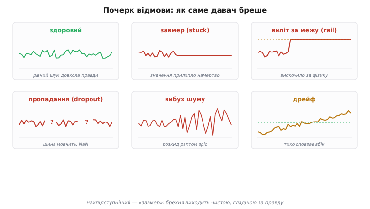
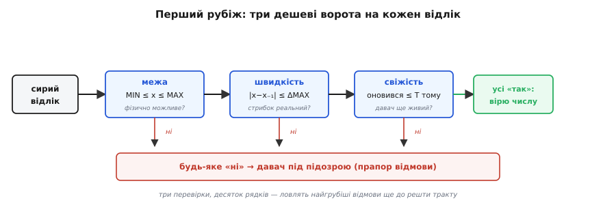
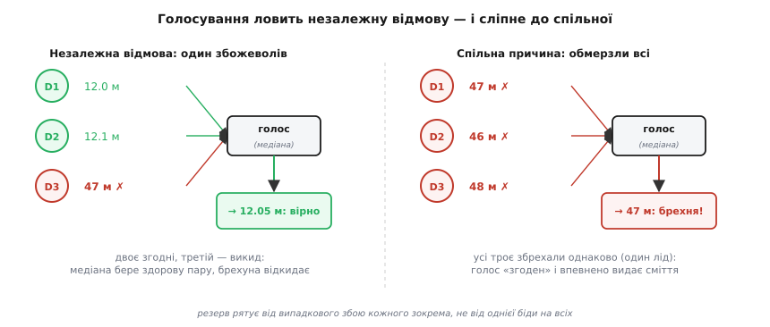

# Виявлення відмови давача

Усе, що ми робили з сигналом досі, мовчки спиралося на одне припущення: давач **живий і чесний**. Ми вчилися [чисто його зчитувати](root:embedded/signal-acquisition), [добирати фільтр під його конкретну брехню](root:embedded/choosing-a-filter), а тоді [поєднувати кілька давачів](topic:communications/sensor-fusion), довіряючи кожному рівно за його надійністю. Та фільтр гасить **шум** навколо правдивого числа — він не знає й знати не може, що самого числа вже немає, що давач відвалився, заклинив чи бреше. А коли в [FMEA](root:embedded/fmea-embedded) ми важили відмови трьома осями, найцінніша з них для прошивки була **виявність**: чи помітить код, що давач замовк, **перш ніж** керувати наосліп. Ось цей рядок технічного завдання — «помітити» — ми зараз і перетворимо на код.

Питання просте на словах і підступне на ділі: **як прошивка дізнається, що давачу більше не можна вірити?** Бо поки вона цього не знає, вона годує зіпсованим числом і фільтр, і регулятор, і всю логіку рішень — і робить це впевнено.

## Чому згладжування не рятує від брехні

Почнімо з прикрого факту, який ламає інтуїцію новачка. Шумний давач — це **видима** біда: число тремтить, і кожен бачить, що з ним щось не так, тож і фільтр на нього ставлять. А відмовлений давач часто видає число **чистіше за здорове**: заклинило на одному значенні — і воно рівне, як по лінійці, жодного тремтіння. Той самий [фільтр низьких частот](topic:algorithms/ema), що гладить шум, зробить таку брехню ще гладшою й ще переконливішою. Згладжування **не відрізняє** мертвого давача від тихого — для нього і те, і те просто «рівний сигнал».


*Здоровий давач рівно тремтить довкола правди. Решта — відмови: «завмер» (значення прилипло намертво), «виліт за межу» (вискочило за фізично можливе), «пропадання» (шина мовчить, приходить NaN), «вибух шуму» (розкид раптом зріс), «дрейф» (тихо сповзає вбік). Найпідступніший — «завмер»: його брехня виходить гладшою за саму правду, і жоден згладжувач її не викриє.*

Ціна цієї сліпоти буває страшна, і авіація заплатила її кров'ю. У 2009-му [рейс Air France 447 над Атлантикою](https://en.wikipedia.org/wiki/Air_France_Flight_447) втратив швидкісні дані, бо приймачі повітряного тиску (трубки Піто) обмерзли; автопілот побачив **розбіжність** між джерелами й чесно вимкнувся — детектор спрацював, — але далі люди не впоралися й звалили літак у штопор (доказово: офіційний звіт BEA). А в 1996-му [рейс Aeroperú 603](https://en.wikipedia.org/wiki/Aeroper%C3%BA_Flight_603) розбився геть інакше: технік заклеїв стрічкою статичні порти й забув її зняти, і всі прилади **узгоджено** показували неправильні висоту й швидкість — розбіжності не було, бо брехали всі однаково (доказово: офіційний звіт). Дві катастрофи, два протилежні уроки, до яких ми ще повернемося: іноді відмову видно за розбіжністю, а іноді саме її й немає.

> 🔧 **Навіщо це.** На столі забутий випадок коштує перезапуску програми. У полі давач висоти, що завис, — це апарат, який тримає газ і втикається в землю, переконаний, що ще набирає висоту. Тому виявлення відмови — не «приємний додаток» до тракту сигналу, а окремий **оборонний рубіж**, який треба будувати свідомо. Чистий сигнал — це добре; та спершу слід упевнитися, що сигнал узагалі **є**, перш ніж його чистити.

## Як саме давач бреше: словник режимів

Щоб ловити відмову, треба спершу назвати, **як** вона виглядає, — точно як у фільтрації ми спершу [ставили діагноз шуму](topic:algorithms/signal-noise), а тоді брали інструмент. Способів зламатися небагато, і кожен має свій почерк та свій детектор:

- **Завмер (stuck, flatline)** — значення прилипло й не ворушиться. Обірвався провід даних, заклинило механіку, повис драйвер.
- **Виліт за межу (out-of-range, rail)** — число вискочило за фізично можливе: барометр показує тиск як на Марсі, термометр — мінус триста.
- **Пропадання (dropout)** — давач узагалі не відповідає: шина мовчить, приходить NaN або старе значення з буфера.
- **Вибух шуму** — розкид раптом виріс у рази: тріснув контакт, поряд увімкнулося потужне навантаження.
- **Дрейф** — повільне сповзання правди вбік. Це межовий випадок: формально відмова, але ловиться не тут, а [калібруванням](topic:electronics/calibration) і порівнянням з еталоном, бо в моменті кожне окреме число виглядає правдоподібно.

Це той самий [словник режимів відмови (failure mode)](root:embedded/fmea-embedded), що й у FMEA, лише тепер ми дивимося на нього **очима коду**: під кожен почерк — своя дешева перевірка. Жодна перевірка не ловить усе; ловить усе **набір** перевірок, кожна під свій почерк.

## Перший рубіж: межі діапазону й швидкості

Найдешевший і найкорисніший детектор перевіряє три речі, які дають змогу впіймати найгрубіші відмови ще до будь-якої фільтрації. Кожна — кілька рядків, кожна відсікає свій клас брехні.


*Кожен сирий відлік проходить три ворота. Межа: чи лежить число у фізично можливому діапазоні. Швидкість: чи не стрибнуло воно за один крок дужче, ніж узагалі здатне. Свіжість: чи оновився давач не пізніше за дозволений час. Усі «так» — числу вірю; будь-яке «ні» — давач під підозрою, піднімаємо прапор відмови.*

**Перевірка меж (range check)** — найочевидніша. У кожної величини є фізична стеля й підлога: барометр на Землі не покаже тиск поза 300…1100 гПа, кут крену не вийде за ±180°. Усе, що поза цими межами, — гарантовано брехня, не варта навіть фільтрування.

**Перевірка швидкості (rate / slew check)** ловить тонше. Навіть якщо число всередині діапазону, воно не могло **стрибнути** туди за один крок, якщо це фізично неможливо: реальна температура повітря не зміниться на 50° за мілісекунду, реальна висота — на кілометр за відлік. Раптовий стрибок, більший за фізично досяжний, — підпис викиду або збою шини.

**Перевірка свіжості (staleness / timeout)** стереже сам факт життя. Кожен давач має слати дані з якоюсь частотою; якщо нового відліку немає довше за дозволений час, давач **мовчить** — обірвався, повис, відключилося живлення. Це окрема перевірка, бо завислий давач часто й далі віддає старе число, формально валідне за межами й швидкістю, — тільки воно вже не оновлюється.

Ось ці три ворота в коді. Один компактний крок на відлік — і три класи відмови позаду:

```c
#include <stdint.h>
#include <stdbool.h>
#include <math.h>

typedef struct {
    float    min, max;       // фізичні межі величини
    float    max_step;       // найбільша правдоподібна зміна за крок
    uint32_t timeout_ms;     // як довго мовчання вважати відмовою
    float    last;           // останнє прийняте значення
    uint32_t last_ms;        // коли воно прийшло
    bool     primed;         // чи вже є з чим порівнювати
} sensor_gate_t;

// true — числу можна вірити; false — давач під підозрою
bool gate_check(sensor_gate_t *g, float x, uint32_t now_ms) {
    if (isnan(x) || isinf(x)) return false;            // пропадання / NaN
    if (x < g->min || x > g->max) return false;        // виліт за межу
    if (g->primed && fabsf(x - g->last) > g->max_step)
        return false;                                  // нереальний стрибок
    if (g->primed && (now_ms - g->last_ms) > g->timeout_ms)
        return false;                                  // завмер / мовчання
    g->last = x; g->last_ms = now_ms; g->primed = true;
    return true;
}
```

> 🔧 **Навіщо це.** Це той самий перехід «з паперу в код», що ми бачили у FMEA: рядок таблиці «давач завмер, а ми цього не бачимо, виявність D=9» закривається ось цими десятьма рядками — і D падає до двійки. Найкраще в них те, що вони **майже безплатні**: жодних буферів, жодної математики, лише три порівняння на відлік. Тому межі й тайм-аут варто ставити навіть там, де відмова здається неймовірною, — ціна нульова, а виграш величезний.

## Завмер: коли тиша схожа на сигнал

Найхитріший детектор — той, що ловить **застрягле** значення, і хитрий він не кодом, а думкою. Наївна ідея проста: якщо число не змінилося за останні N відліків, давач завис. Але тут пастка, у яку легко впасти: **здоровий давач теж буває рівним**. Кімнатний термометр у штиль годинами показує те саме, барометр на столі не ворушиться — і це не відмова, а тиха правда.

Що ж відрізняє живу тишу від мертвої? Відповідь — у тому, що ми вже знаємо про давачі: справжній давач **ніколи не буває ідеально рівним**, бо в ньому завжди живе [власний шум — дрейф, тремтіння останнього біта](topic:electronics/drift-hysteresis-noise). Жива тиша все одно ледь-ледь смикається в молодших розрядах; мертва — стоїть **байт у байт**, без жодного руху. Тож завмер ловлять не за «значення не змінилося», а за «значення не змінилося **анітрохи**, навіть на крихту власного шуму, і то надто довго».

```c
typedef struct {
    float    eps;            // поріг: менший рух вважаємо «нерухомістю»
    uint16_t limit;          // скільки нерухомих відліків — це вже завмер
    float    ref;            // опорне значення, від якого міряємо рух
    uint16_t still;          // лічильник нерухомих відліків поспіль
} stuck_det_t;

bool is_stuck(stuck_det_t *s, float x) {
    if (fabsf(x - s->ref) < s->eps) {     // рух менший за власний шум давача
        if (s->still < 0xFFFF) s->still++;
    } else {
        s->ref = x;                       // ворухнулося — оновлюємо опору
        s->still = 0;
    }
    return s->still >= s->limit;          // надто довго мертво нерухоме
}
```

Поріг `eps` беруть **трохи більшим** за розмах власного шуму давача (його видно з [його характеристик](topic:electronics/sensor-characteristics) або з кількох хвилин запису сирого потоку), а `limit` — за найдовшу паузу, яку величина може реально простояти без жодного руху. Поставити `eps` надто малим — і живий тихий давач час від часу хибно оголосять мертвим; надто великим — і пропустиш повільне справжнє сповзання. Це знайомий компроміс чутливості, лише тепер на осі «рух», а не «час».

## Коли давачів кілька: голосування й узгодженість

Усі попередні детектори дивляться на **один** давач і питають «чи правдоподібне це число саме по собі». Та найсильніша перевірка з'являється, коли давачів **кілька**: тоді можна питати не «чи правдоподібне», а «чи **згодні** вони між собою». Зіпсований давач рідко бреше так само, як здорові, тож розбіжність його й викриває.

Найпряміший спосіб — **голосування**. Якщо тих самих величин три, беремо [медіану](topic:algorithms/median-filter): здоровий давач дасть число близьке до інших, а збожеволілий опиниться скраю шеренги, і медіана його просто відкине, узявши значення зі здорової пари. Це і є класичний підхід, що в техніку прийшов з [теорії надійних систем — потрійне резервування з голосуванням за більшістю](root:embedded/sensor-fault-detection/hist-tmr-voting.md): три однакові вузли, а «правда» — те, на чому збіглися щонайменше двоє. Коли давачів лише два, голосувати ніде — там можна тільки **помітити** розбіжність (двоє не згодні — хтось бреше), та не сказати, **хто** саме винен; для цього й потрібен третій голос. А коли давачі **різні** за природою (акселерометр і барометр обидва бачать висоту), їх звіряють не голосуванням, а **нев'язкою (residual)**: беруть різницю того, що давач показав, і того, що передбачила [модель руху чи інший давач](topic:algorithms/complementary-filter), — і якщо ця різниця надто велика й тримається, давач під підозрою.


*Зліва — незалежна відмова: двоє давачів згодні (12.0 і 12.1 м), третій збожеволів (47 м); медіана бере здорову пару й видає вірне число. Справа — спільна причина: обмерзли всі три, тож вони збрехали **однаково** (47, 46, 48 м); голос бачить повну згоду й упевнено видає сміття. Резерв рятує від випадкового збою кожного зокрема — не від однієї біди, що вдарила по всіх.*

І ось тут — найважливіший урок цього кроку, той самий, що його кров'ю розписали дві катастрофи з початку. Голосування й резервування мовчки припускають, що давачі відмовляють **незалежно** — кожен сам по собі, своєю окремою причиною. Та існує **спільна причина (common-cause failure)**: одна біда, що вражає всіх одразу. Обмерзання забило **всі** трубки Піто рейсу AF447 — і хоча там розбіжність ще встигла з'явитися й автопілот вимкнувся, на Aeroperú заклеєні порти змусили **всі** прилади брехати **узгоджено**, і жодне голосування не помогло б: трійця однаково неправильних чисел виглядає як ідеальна згода. Звідси тверезий висновок: резерв тим цінніший, чим **незалежніші** канали. Три давачі від одного виробника, на одній шині, під одним обмерзанням — це часто **один** давач, що його тричі переписали. Справжня стійкість — це **різні** принципи (тиск і супутник, інерція і зір), бо одна біда навряд чи однаково обдурить геть різну фізику.

> 🔧 **Навіщо це.** Перш ніж тішитися «у мене три давачі, я захищений», спитайте: що може зламати всі три **разом**? Спільне живлення, спільна шина, спільна вода в роз'ємі, спільне обмерзання, спільна вібрація. Якщо така причина є — рахуйте, що давач у вас **один**. Дешевий і потужний хід — додати в резерв давач **іншої** природи: він майже напевно відмовить з іншої причини, і тоді розбіжність таки з'явиться там, де голосування однакових мовчало б.

## Виявив — мало; треба ще й безпечно відреагувати

Детектор підняв прапор «давачу не вірю» — і це лише половина справи. У FMEA знизити число виявності D означало **помітити** відмову; та помітити й нічого не зробити — те саме, що не помітити. Друга половина — **політика реакції**, і будувати її треба так само свідомо, як і самі детектори.


*Виявив — мало. Спершу **підтвердь** відмову (не з одного відліку, а з кількох поспіль — проти хибних тривог). Тоді **познач** давач непридатним і прибери його з [поєднання](book:communications/sensor-fusion), опустивши його вагу до нуля. Далі **підстрахуй** вихід: коротко тримай останнє добре значення, потім переходь на модель чи на безпечний режим. А повертати давачу довіру — лише через гістерезис, інакше на самій межі він миготітиме «здоровий–хворий».*

Перше: **підтвердження**. Поодинокий збій — наводка, одна загублена посилка на шині — ще не відмова. Тому прапор піднімають не з першого «ні», а коли воно повторилося **N відліків поспіль**; одне-два «ні» серед потоку «так» — пробачаємо. Це той самий [гістерезис](topic:electronics/schmitt-trigger), що проти брязкоту порога: лічильник підозри росте на кожне «ні» й скидається на «так», а відмову оголошуємо, лише коли він перевалив поріг. Так детектор не сіпається від кожної дрібної завади.

Друге: **прибрати винного**. Щойно давач визнано непридатним, його негайно виключають з рішень — у [поєднанні давачів](topic:communications/sensor-fusion) це просто означає опустити його **вагу до нуля**, і система далі спирається на тих, хто живий. Третє: **підстрахувати вихід**, бо керування не можна лишити зовсім без числа. Коротку мить можна протриматися на **останньому доброму** значенні (давач от-от оживе), далі — перейти на **оцінку з моделі** чи з інших давачів, а як і це неможливо — у наперед продуманий **безпечний режим** (завис висотомір — тримай горизонт і знижуйся, а не газуй наосліп). Який саме запасний хід доречний — диктує сама задача; головне, щоб він **був продуманий заздалегідь**, а не імпровізувався в момент відмови.

І останнє, на чому легко спіткнутися: **повернення довіри**. Давач, що ожив, не варто пускати назад тієї ж миті, як він видав одне добре число, — інакше на самій межі справності він почне миготіти «здоровий–хворий–здоровий», смикаючи систему. Тут знову рятує гістерезис: щоб **оголосити** відмову, досить кількох поганих відліків, а щоб **зняти** її — потрібно помітно більше поспіль добрих. Два різні пороги, як у [тригера Шмітта](topic:electronics/schmitt-trigger): легко впасти в недовіру, важко з неї вибратися. Цю готову логіку — ворота, лічильник підтвердження, гістерезис повернення й єдиний прапорець `is_valid()` — зручно зібрати в [один багаторазовий модуль-детектор на канал](root:embedded/sensor-fault-detection/proj-fault-detector.md), щоб не переписувати її під кожен давач.

## Де це стоїть у тракті

Складімо все в одну картину. Виявлення відмови — це **ще одна ланка** того тракту обробки, що ми будували весь модуль, і стоїть вона **найпершою**: перевіряти, чи давач живий, треба **до** фільтра й калібрування, бо немає сенсу гладити та виправляти число, якому взагалі не можна вірити. Потік виходить такий: сирий відлік → ворота справності (живий? правдоподібний?) → і лише якщо так → [медіана й згладжування](root:embedded/choosing-a-filter) → [калібрування](topic:electronics/calibration) → у [поєднання й рішення](topic:communications/sensor-fusion). А прапор справності з першої ланки супроводжує число до самого кінця: поєднання дивиться на нього, щоб опустити вагу мертвого давача, а керування — щоб вчасно перейти на запасний хід.

Варто знати й межу всіх цих прийомів, чесно, без ілюзій. Жоден детектор не ловить відмову, що **прикинулася правдою**: давач, який тихо дрейфує всередині діапазону, з правдоподібною швидкістю, не завмерши й не випавши з шеренги, пройде всі ворота — бо він бреше **правдоподібно**. Проти такого є лише дві ради: незалежна звірка з давачем **іншої** природи (нев'язка таки виросте) і періодичне [калібрування за еталоном](topic:electronics/calibration). Тут ми впираємося в ту саму стіну, що й у фільтрації: детектор не **додає** інформації, він лише розумно користується тією, що в даних уже є. Коли її там немає — рятує не хитріший детектор, а **ще один, незалежний** погляд на ту саму величину.

І все ж навіть прості ворота — діапазон, швидкість, тайм-аут, завмер, голосування — закривають переважну більшість реальних відмов давачів за десяток рядків коду й копійки процесорного часу. Це той самий дешевий рубіж, що відрізняє іграшку, яка вірить кожному числу до останнього, від системи, яка **знає, коли їй брешуть**, і вчасно перестає слухати. Маючи таку систему, можна йти далі — до [оцінювачів, що зважено зливають кілька джерел в одну істину](topic:algorithms/kalman-filter), бо вони теж мовчки припускають, що джерела, які вони зливають, ще варті довіри; а пильнувати цю довіру — рівно та робота, яку ми щойно навчилися робити.
