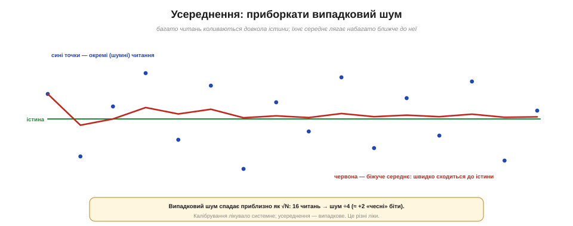
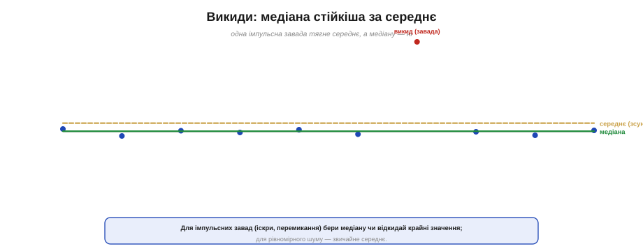
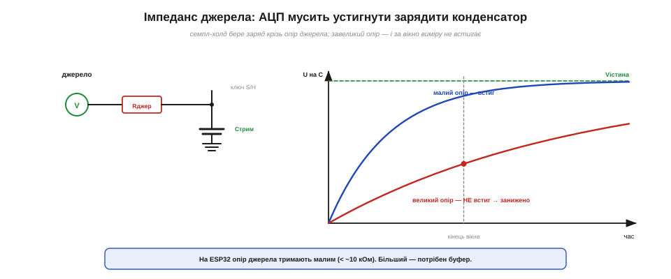
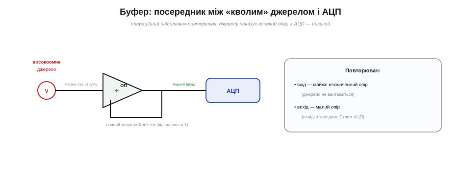
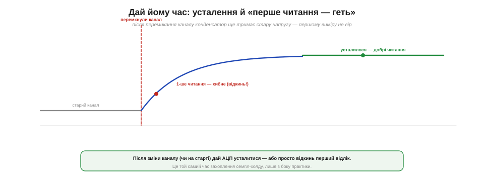
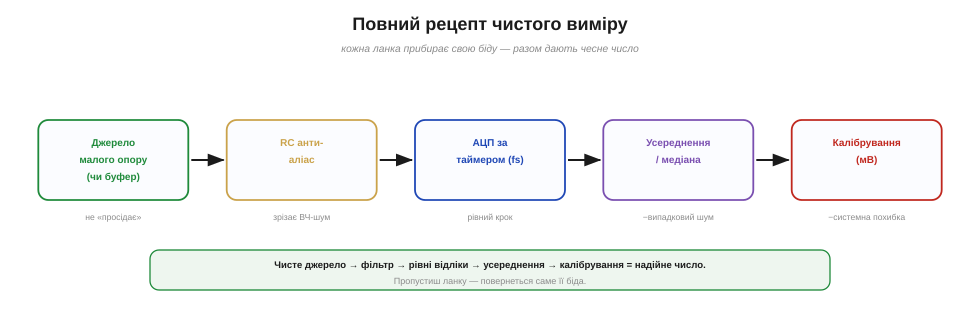

# Як правильно зчитати сигнал (усереднення; антиаліас; імпеданс джерела)

Сам по собі [АЦП](book:electronics/adc) — лише перетворювач напруги в код; чисте, надійне число з нього доводиться **здобувати**. Бо той самий АЦП у недбалих руках дає тремтливе сміття, а в дбайливих — стабільне число до молодшого біта. Тут зібрано докупи прийоми чистого вимірювання: **усереднення** проти шуму, правильний **імпеданс джерела** (чи не найчастіша причина загадкових помилок), **усталення**, антиаліас — і нарешті єдиний рецепт, що в'яже все це разом.

### Усереднення: лік від випадкового шуму

Почнімо з найдешевшого й найкориснішого прийому. [Калібрування](book:electronics/adc-errors) прибирає **системні** похибки, але проти **випадкового** шуму воно безсиле — бо шум щоразу інший, сталої поправки для нього нема. Зате в шуму є слабке місце: він **випадковий**, тобто однаково часто штовхає вимір угору й униз. Тож якщо зчитати АЦП багато разів і **усереднити**, ці поштовхи частково взаємознищаться, і середнє ляже куди ближче до істини, ніж будь-яке окреме читання.


*Окремі читання (сині) розкидані довкола істинного значення. Їхнє біжуче середнє (червона) швидко сходиться до істини. Випадковий шум спадає приблизно як √N: 16 читань зменшують його вчетверо — наче додалося два «чесні» біти.*

Виграш піддається оцінці: шум спадає приблизно як [**корінь** із кількості усереднених вимірів](book:math/averaging-gain). Усереднили 4 читання — шум удвічі менший; 16 — учетверо (а це ще десь два «ефективні» біти роздільності); 100 — у десять разів. Закон кореня, щоправда, скупуватий: щоб зменшити шум удесятеро, треба аж сто читань, тож без міри нарощувати їх немає сенсу — лише гаєш час. Зазвичай беруть розумні 4–64 відліки, залежно від того, наскільки тихий результат потрібен.

Чому саме корінь? Бо незалежні випадкові поштовхи складаються не прямо, а «по діагоналі» — у квадратах: половина тягне вгору, половина вниз, і сумарне відхилення росте повільніше за саму їх кількість. Звідси й головний компроміс: усереднення завжди **міняє швидкість на чистоту**. Кожен зайвий відлік — це час, тож для швидкозмінних сигналів багато не усереднеш. Для неперервного ж потоку зручне «біжуче середнє»: тримати ковзне вікно останніх N відліків і весь час оновлювати їхнє середнє, не чекаючи цілої пачки.

> 🔧 **Навіщо це.** Усереднення — перше, що варто додати, коли виміри «тремтять» в останніх цифрах. Кілька рядків коду: зчитати АЦП N разів у циклі, скласти, поділити на N — і шум помітно вщухне. Пам'ятайте поділ праці: **калібрування** випрямляє те, що криве завжди однаково, а **усереднення** гасить те, що тремтить випадково. Разом вони й дають чистий, точний відлік; поодинці кожне лишає половину біди.

### Медіана: коли заважають викиди

Усереднення чудове проти рівномірного «трав'яного» шуму, та має слабину: один великий **викид** — раптова іскра, перемикання потужного навантаження — здатний помітно потягнути середнє за собою. На такий випадок є стійкіший прийом — **медіана** (лат. *medianus* — серединний): вишикувати кілька читань за зростанням і взяти те, що стоїть посередині. Викид опиниться скраю шеренги, і на серединне значення він майже не вплине.


*Одна імпульсна завада (червона точка) помітно тягне **середнє** (жовта лінія), а **медіану** (зелена) лишає на місці. Для імпульсних завад беруть медіану чи відкидають крайні значення; для рівномірного шуму досить звичайного середнього.*

Звідси проста настанова: знаєте, що в системі бувають різкі поодинокі завади (реле, двигуни, іскріння), — фільтруйте **медіаною** або відкидайте кілька найбільших і найменших значень перед усередненням. Якщо ж шум рівний і дрібний, без викидів, звичайне середнє і простіше, і не гірше. Часто поєднують обидва: спершу медіаною прибирають викиди, потім усереднюють решту для гладкості.

### Імпеданс джерела: чому «кволе» джерело бреше

А тепер — найпідступніша й найменш очевидна причина хибних вимірів, через яку згаяно безліч годин. Усередині АЦП є [семпл-холд](book:electronics/sampling-quantization): щоб узяти знімок, АЦП на мить замикає ключ і **заряджає** свій крихітний конденсатор до напруги входу. Та заряд тече не миттєво — він мусить **протекти крізь опір джерела**. І якщо джерело «кволе», тобто має великий внутрішній опір, конденсатор просто **не встигає** зарядитися до правди за відведене коротке вікно виміру.


*АЦП заряджає свій конденсатор семпл-холду крізь опір джерела. Малий опір джерела — конденсатор устигає набрати істинну напругу (синя крива). Великий — за вікно виміру він не доходить до правди (червона), і АЦП повертає **занижене** значення.*

Наслідок дуже характерний: вимір виходить **систематично заниженим**, і то тим сильніше, чим вищий опір джерела й чим швидше АЦП намагається міряти. Класична пастка — завести на АЦП сигнал просто з виходу високоомного подільника (з резисторів у сотні кілоом чи мегаоми) і дивуватися, чому напруга «недобирає». На ESP32 для надійного виміру опір джерела радять тримати **малим — приблизно до 10 кОм**; що більший, то гірше. Лікують це трьома способами: зменшити опір самого джерела, дати АЦП **довше** вікно захоплення (де можливо) — або поставити **буфер**.

Глибша причина — той самий [час захоплення семпл-холду](book:electronics/sampling-quantization): конденсатор заряджається зі сталою часу, пропорційною опору джерела, тож великий опір розтягує заряд далеко за коротке вікно виміру. Є й другий, тонший бік: вхід АЦП сам потроху «підтікає» (має малесенький струм витоку), і на дуже високому опорі джерела навіть цей крихітний струм створює відчутне падіння напруги. Тому мегаомні джерела підступні **подвійно** — і повільні в заряді, і чутливі до витоку; обидві біди знімає той самий буфер.

> 🔧 **Навіщо це.** Якщо вимір **систематично занижений** (а калібрування й усереднення не допомагають) — підозрюйте надто **високий опір джерела**. Найшвидша перевірка: тимчасово під'єднайте до входу АЦП щось завідомо низькоомне (свіжу батарейку через подільник на кілька кілоом) — якщо «недобір» зник, винен був імпеданс. І не вішайте АЦП прямо на подільник із мегаомних резисторів: або зменшіть номінали, або поставте буфер (нижче).

### Буфер: посередник для високоомного джерела

Коли джерело за природою високоомне (а таких чимало — багато давачів, подільники для економії струму), його не змусиш віддавати заряд швидко. Розв'язок — поставити між ним і АЦП **буфер** (англ. *buffer* — прокладка, пом'якшувач), тобто операційний підсилювач у режимі [**повторювача (*voltage follower*)**](book:electronics/voltage-follower).


*Повторювач на операційному підсилювачі — ідеальний посередник. Своїм входом він показує джерелу **майже нескінченний** опір (тож не вантажить його й не спотворює напруги), а виходом дає АЦП **низькоомне**, «міцне» джерело, що вмить заряджає конденсатор семпл-холду. Напруга на виході дорівнює вхідній (підсилення 1).*

Працює це красиво. Вхід операційного підсилювача майже не бере струму, тож для кволого джерела повторювач — наче й не навантаження зовсім: напруга на ньому не просідає. А вихід підсилювача, навпаки, **міцний** — низькоомний, здатний швидко віддати заряд, — тож конденсатор АЦП він заповнює миттєво. Підсилення такого ввімкнення дорівнює одиниці (звідси й назва «повторювач»): він не змінює напругу, лише **«перепаковує» її в низький опір**, зручний для АЦП. Це стандартний прийом усюди, де треба зміряти високоомне джерело без спотворень.

На практиці буфер і антиаліасинговий фільтр часто стоять поряд: спершу RC-фільтр згладжує сигнал, а тоді повторювач «перепаковує» його в низький опір для АЦП — або, навпаки, буфер ставлять перед фільтром, щоб саме коло фільтра не вантажило високоомне джерело. Порядок добирають під схему, та разом ці двоє — фільтр і буфер — закривають більшість бід аналогового входу.

### Дай йому час: усталення

Ще одна практична дрібниця, що рятує від загадкових перших значень. Конденсатор семпл-холду тримає **попередню** напругу, аж поки не набере нову. Тому одразу після того, як ви **перемкнули канал** АЦП на інший вхід (або щойно ввімкнули пристрій), перший відлік може бути ще «застряглим» — сумішшю старого й нового.


*Після перемикання каналу конденсатор семпл-холду ще тримає стару напругу й переходить до нової не миттєво. Перше читання в цей момент — хибне; його просто **відкидають**, а беруть наступні, коли напруга вже усталилася. Це той самий час захоплення семпл-холду, лише з боку практики.*

Лік простий і дешевий: після зміни каналу або на старті дайте АЦП **трохи усталитися** — зробіть один «холостий» вимір і **відкиньте** його, а до діла беріть уже наступні. Це той самий [час захоплення семпл-холду](book:electronics/sampling-quantization), лише побачений з практичного боку. Звичка «перше читання — геть» коштує одного зайвого виклику, а позбавляє цілого класу примарних помилок, які інакше з'являються «через раз».

Найчастіше це кусає там, де один АЦП обслуговує **кілька** входів по черзі через вбудований перемикач (мультиплексор): зчитав канал А, перемкнувся на Б — а конденсатор ще пам'ятає напругу А. Саме в таких схемах звичка відкидати перше читання після кожного перемикання стає обов'язковою, інакше канали «протікають» один в одного, і виміри плутаються між собою — особливо підступно, бо помилка залежить від того, який канал читали попереднім.

### Антиаліас і достатня частота

Нарешті, не забуваймо двох правил **часу**, бо вони теж частина чистого зчитування. По-перше, якщо в сигналі можливий високочастотний шум (а він можливий майже завжди), між джерелом і АЦП має стояти **антиаліасинговий** [RC-фільтр](book:electronics/rc-filter), щоб зайві частоти не склалися вниз у вашу смугу. По-друге, відліки треба брати **досить часто** ([fs понад подвоєну найвищу частоту сигналу](book:communications/nyquist-aliasing)) і **рівномірно** — за таймером, а не «коли дійшли руки». Обидва ці правила входять у загальний рецепт як обов'язкові ланки.

Варто лише пам'ятати, що антиаліасинговий RC-фільтр має й зворотний бік: він **сповільнює** реакцію входу — що сильніше згладжуєш, то повільніше встигаєш за змінами сигналу. Тому зріз фільтра ставлять нижче за fs/2, але не надто низько, щоб не «з'їсти» сам корисний сигнал. Це той самий знайомий компроміс «гладкість проти швидкості», що й в усередненні, — тільки тепер у залізі, а не в коді.

Сюди ж належить і охайний **монтаж**: тримати доріжку до входу АЦП короткою й подалі від шумних кіл (силових ключів, радіо), а землю вести «зіркою» до спільної точки. Жоден фільтр не врятує, якщо наведення лізе просто у вхід, минаючи його. Чистий вимір починається з чистої землі — про це легко забути, ганяючись за бітами в коді.

### Повний рецепт чистого виміру

Зберімо все докупи. Надійний відлік — це не один виклик `analogRead`, а маленький **конвеєр**, де кожна ланка прибирає свою біду.


*Рецепт чистого виміру. Низькоомне джерело (чи буфер) — щоб не «просідало»; RC-антиаліас — зрізати ВЧ-шум; АЦП за таймером — рівний крок у часі; усереднення/медіана — проти випадкового шуму; калібрування — проти системної похибки. Пропустиш ланку — повернеться саме її біда.*

Кожна ланка цього конвеєра відповідає за свою біду: **джерело малого опору або буфер** дбає, щоб конденсатор устигав зарядитися; **RC-антиаліас** і **достатня fs за таймером** рятують від [аліасингу](book:communications/nyquist-aliasing); **усереднення чи медіана** гасять випадковий шум; **калібрування** (на ESP32 — просто `analogReadMilliVolts`) прибирає [системні зсув, масштаб і нелінійність](book:electronics/adc-errors). Жодна ланка не зайва: пропустиш — і саме її біда повернеться у вимір. Звісно, для грубого «світло/темно» вистачить і голого `analogRead`; та коли треба чесні вольти, проходять увесь рецепт.

Головне — не плутати, де яка ретельність потрібна. Для індикатора «світло/темно» чи «ручку покрутили» досить сирого читання й, може, легкого усереднення — городити буфери й калібрування тут марно. А для вимірювача напруги, ваг чи термометра кожна ланка рецепта на своєму місці. Мудрість не в тім, щоб завжди робити максимум, а в тім, щоб **дібрати зусилля під задачу** — і знати, яка ланка від якої біди рятує, коли результат таки «попливе».

**Приклад (усереднення та опір джерела).**

```
Усереднення: окреме читання має шум σ ≈ 3 LSB
  N = 16  →  шум σ/√16 = 3/4 = 0.75 LSB  (≈ +2 «чесні» біти)
  N = 64  →  3/8 ≈ 0.38 LSB

Опір джерела: конденсатор S/H заряджається зі сталою часу τ = R · C
  (R — опір джерела, C — ємність конденсатора семпл-холду)
  мале R (~ кОм)  → τ крихітна, встигає за вікно виміру ✓
  велике R (~ МОм) → τ велика, НЕ встигає → занижено ✗  → потрібен буфер
```
Два прийоми, дві різні біди: усереднення б'є по випадковому шуму, низький опір джерела (чи буфер) — по систематичному недобору від кволого джерела. Разом із калібруванням і антиаліасом вони й роблять вимір таким, якому можна вірити.

Отже, правильне зчитування — це маленький конвеєр звичок: тримай джерело низькоомним (інакше — буфер), став антиаліасинговий фільтр, бери відліки рівно й досить часто, усереднюй проти шуму, відкидай перший відлік після перемикання й переводь у вольти відкаліброване значення. Так аналоговий вхід проходить весь шлях — від напруги на ніжці до чистого числа, якому можна вірити; а те, якими саме [хитрощами залізо знаходить код для напруги](book:electronics/adc-types), — уже окрема історія про внутрішню будову перетворювача.
